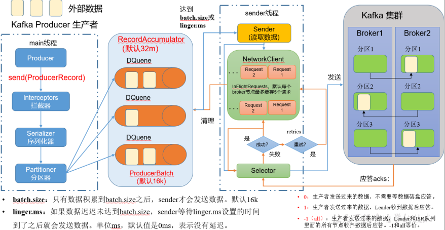

# 第 1 章 Kafka 概述

## 1.1 定义

**Kafka传统定义**：Kafka是一个**分布式**的基于**发布/订阅模式**的**消息队列**（Message Queue），主要应用于大数据实时处理领域。

**发布/订阅**：消息的发布者不会将消息直接发送给特定的订阅者，而是将发布的消息 分为不同的类别，订阅者只接收感兴趣的消息。

**Kafka最新定义**： Kafka是一个**开源的分布式事件流平台**（Event Streaming Platform），被数千家公司用于高性能数据管道、流分析、数据集成和关键任务应用。

## 1.2 消息队列

目前企业中比较常见的消息队列产品主要有 Kafka、ActiveMQ 、RabbitMQ 、 RocketMQ 等。在大数据场景主要采用 Kafka 作为消息队列。在 JavaEE 开发中主要采用 ActiveMQ、 RabbitMQ、RocketMQ。

### 1.2.1 传统消息队列的应用场景

传统的消息队列的主要应用场景包括：**缓存/消峰、解耦和异步通信**

### 1.2.2 消息队列的两种模式

##### 1）点对点模式

- 消费者主动拉取数据，消息收到后清除消息


2）发布/订阅模式

- 可以有多个topic主题（浏览、点赞、收藏、评论等）
- 消费者消费数据之后，不删除数据
- 每个消费者相互独立，都可以消费到数据


## 1.3 Kafka 基础架构


- （1）**Producer**：消息生产者，就是向 Kafka broker 发消息的客户端。
- （2）**Consumer**：消息消费者，向 Kafka broker 取消息的客户端。
- （3）**Consumer Group（CG）**：消费者组，由多个 consumer 组成。消费者组内每个消费者负责消费不同分区的数据，一个分区只能由一个组内消费者消费；消费者组之间互不影响。所有的消费者都属于某个消费者组，即消费者组是逻辑上的一个订阅者。
- （4）**Broker**：一台 Kafka 服务器就是一个 broker。一个集群由多个 broker 组成。一个 broker 可以容纳多个 topic。
- （5）**Topic**：可以理解为一个队列**，生产者和消费者面向的都是一个 topic**。
- （6）**Partition**：为了实现扩展性，一个非常大的 topic 可以分布到多个 broker（即服务器）上，一个 topic 可以分为多个 partition，每个 partition 是一个有序的队列。
- （7）**Replica**：副本。一个 topic 的每个分区都有若干个副本，一个 Leader 和若干个 Follower。
- （8）**Leader**：每个分区多个副本的“主”，生产者发送数据的对象，以及消费者消费数据的对象都是 Leader。
- （9）**Follower**：每个分区多个副本中的“从”，实时从 Leader 中同步数据，保持和 Leader 数据的同步。Leader 发生故障时，某个 Follower 会成为新的 Leader。

# 第 2 章 Kafka 快速入门

## 2.1 安装部署

### 2.1.1 集群规划

| hadoop102 | hadoop103 | hadoop104 |
| --------- | --------- | --------- |
| zk        | zk        | zk        |
| zk        | zk        | zk        |

### 2.1.2 集群部署

- 0）官方下载地址：http://kafka.apache.org/downloads.html

- 1）解压安装包 

    ```
    [atguigu@hadoop102 software]$ tar -zxvf kafka_2.12-3.0.0.tgz -C 
    /opt/module/
    ```

- 2）修改解压后的文件名称

    ```
    [atguigu@hadoop102 module]$ mv kafka_2.12-3.0.0/ kafka
    ```

- 3）进入到/opt/module/kafka 目录，修改配置文件

    ```
    [atguigu@hadoop102 kafka]$ cd config/
    [atguigu@hadoop102 config]$ vim server.properties
    ```

    输入以下内容：

    ```
    #> broker 的全局唯一编号，不能重复，只能是数字。
    broker.id=0
    #处理网络请求的线程数量
    num.network.threads=3
    #用来处理磁盘 IO 的线程数量
    num.io.threads=8
    #发送套接字的缓冲区大小
    socket.send.buffer.bytes=102400
    #接收套接字的缓冲区大小
    socket.receive.buffer.bytes=102400
    #请求套接字的缓冲区大小
    socket.request.max.bytes=104857600
    #> kafka 运行日志(数据)存放的路径，路径不需要提前创建，kafka 自动帮你创建，可以配置多个磁盘路径，路径与路径之间可以用"，"分隔
    log.dirs=/opt/module/kafka/datas
    #topic 在当前 broker 上的分区个数
    num.partitions=1
    #用来恢复和清理 data 下数据的线程数量
    num.recovery.threads.per.data.dir=1
    # 每个 topic 创建时的副本数，默认时 1 个副本
    offsets.topic.replication.factor=1
    #segment 文件保留的最长时间，超时将被删除
    log.retention.hours=168
    #每个 segment 文件的大小，默认最大 1G
    log.segment.bytes=1073741824
    # 检查过期数据的时间，默认 5 分钟检查一次是否数据过期
    log.retention.check.interval.ms=300000
    #> 配置连接 Zookeeper 集群地址（在 zk 根目录下创建/kafka，方便管理）
    zookeeper.connect=hadoop102:2181,hadoop103:2181,hadoop104:2181/kafka
    ```

- 4）分发安装包

    ```
    [atguigu@hadoop102 module]$ xsync kafka/
    ```

- 5）分别在 hadoop103 和 hadoop104 上修改配置文件/opt/module/kafka/config/server.properties中的 broker.id=1、broker.id=2 
  
    >  注：broker.id 不得重复，整个集群中唯一。
    
- 6）配置环境变量

  - （1）在/etc/profile.d/my_env.sh 文件中增加 kafka 环境变量配置
  
      ```
      [atguigu@hadoop102 module]$ sudo vim /etc/profile.d/my_env.sh
      ```
  
      增加如下内容：
  
      ```
      #KAFKA_HOME
      export KAFKA_HOME=/opt/module/kafka
      export PATH=$PATH:$KAFKA_HOME/bin
      ```
  
  - （2）刷新一下环境变量。
  
      ```
      [atguigu@hadoop102 module]$ source /etc/profile
      ```
  
  - （3）分发环境变量文件到其他节点，并 source。
  
      ```
      [atguigu@hadoop102 module]$ sudo /home/atguigu/bin/xsync/etc/profile.d/my_env.sh
      [atguigu@hadoop103 module]$ source /etc/profile
      [atguigu@hadoop104 module]$ source /etc/profile
      ```
  
- 7）启动集群
  
  - （1）先启动 Zookeeper 集群，然后启动 Kafka。
  
      ```
      [atguigu@hadoop102 kafka]$ zk.sh start 
      ```
      
  - （2）依次在 hadoop102、hadoop103、hadoop104 节点上启动 Kafka。
  
      ```
      [atguigu@hadoop102 kafka]$ bin/kafka-server-start.sh -daemon config/server.properties
      [atguigu@hadoop103 kafka]$ bin/kafka-server-start.sh -daemon config/server.properties
      [atguigu@hadoop104 kafka]$ bin/kafka-server-start.sh -daemon config/server.properties
      ```
  
      > 注意：配置文件的路径要能够到 server.properties。
  
- 8）关闭集群

    ```
    [atguigu@hadoop102 kafka]$ bin/kafka-server-stop.sh 
    [atguigu@hadoop103 kafka]$ bin/kafka-server-stop.sh 
    [atguigu@hadoop104 kafka]$ bin/kafka-server-stop.sh 
    ```

### 2.1.3 集群启停脚本

1）在/home/atguigu/bin 目录下创建文件 kf.sh 脚本文件

```
[atguigu@hadoop102 bin]$ vim kf.sh
```

脚本如下：

```
#! /bin/bash
case $1 in
"start"){
 for i in hadoop102 hadoop103 hadoop104
 do
 	echo " --------启动 $i Kafka-------"
 	ssh $i "/opt/module/kafka/bin/kafka-server-start.sh -daemon /opt/module/kafka/config/server.properties"
 done
};;
"stop"){
 for i in hadoop102 hadoop103 hadoop104
 do
 	echo " --------停止 $i Kafka-------"
 	ssh $i "/opt/module/kafka/bin/kafka-server-stop.sh "
 done
};;
esac
```

2）添加执行权限

```
[atguigu@hadoop102 bin]$ chmod +x kf.sh
```

3）启动集群命令

```
[atguigu@hadoop102 ~]$ kf.sh start
```

4）停止集群命令

```
[atguigu@hadoop102 ~]$ kf.sh stop
```

> 注意：停止 Kafka 集群时，一定要等 Kafka 所有节点进程全部停止后再停止 Zookeeper 集群。因为 Zookeeper 集群当中记录着 Kafka 集群相关信息，Zookeeper 集群一旦先停止， Kafka 集群就没有办法再获取停止进程的信息，只能手动杀死 Kafka 进程了。

## 2.2 Kafka 命令行操作

### 2.2.1 主题命令行操作

1）查看操作主题命令参数

```
[atguigu@hadoop102 kafka]$ bin/kafka-topics.sh
```


2）查看当前服务器中的所有 topic

```
[atguigu@hadoop102 kafka]$ bin/kafka-topics.sh --bootstrap-server 
hadoop102:9092 --list
```

3）创建 first topic

```
[atguigu@hadoop102 kafka]$ bin/kafka-topics.sh --bootstrap-server hadoop102:9092 --create --partitions 1 --replication-factor 3 --topic first
```

选项说明： 

--topic 定义 topic 名 

--replication-factor 定义副本数 

--partitions 定义分区数

4）查看 first 主题的详情

```
[atguigu@hadoop102 kafka]$ bin/kafka-topics.sh --bootstrap-server hadoop102:9092 --describe --topic first
```

5）修改分区数（**注意：分区数只能增加，不能减少**）

```
[atguigu@hadoop102 kafka]$ bin/kafka-topics.sh --bootstrap-server hadoop102:9092 --alter --topic first --partitions 3
```

6）再次查看 first 主题的详情

```
[atguigu@hadoop102 kafka]$ bin/kafka-topics.sh --bootstrap-server hadoop102:9092 --describe --topic first
```

7）删除 topic（学生自己演示）

```
[atguigu@hadoop102 kafka]$ bin/kafka-topics.sh --bootstrap-server hadoop102:9092 --delete --topic first
```

### 2.2.2 生产者命令行操作

#### 1）查看操作生产者命令参数

```
[atguigu@hadoop102 kafka]$ bin/kafka-console-producer.sh
```

| 参数                                                | 描述                                   |
| --------------------------------------------------- | -------------------------------------- |
| `--bootstrap-server  <String: server toconnect to>` | 连接的 Kafka Broker 主机名称和端口号。 |
| `--topic  <String: topic>`                          | 操作的 topic 名称。                    |

#### 2）发送消息

```
[atguigu@hadoop102 kafka]$ bin/kafka-console-producer.sh --bootstrap-server hadoop102:9092 --topic first
>hello world
>atguigu atguigu
```

### 2.2.3 消费者命令行操作

#### 1）查看操作消费者命令参数

```
[atguigu@hadoop102 kafka]$ bin/kafka-console-consumer.sh
```

| 参数                                                | 描述                                   |
| --------------------------------------------------- | -------------------------------------- |
| `--bootstrap-server  <String: server toconnect to>` | 连接的 Kafka Broker 主机名称和端口号。 |
| `--topic <String: topic>`                           | 操作的 topic 名称。                    |
| `--from-beginning`                                  | 从头开始消费。                         |
| `--group <String: consumer group id>`               | 指定消费者组名称。                     |

#### 2）消费消息

（1）消费 first 主题中的数据。

```
[atguigu@hadoop102 kafka]$ bin/kafka-console-consumer.sh --bootstrap-server hadoop102:9092 --topic first
```

（2）把主题中所有的数据都读取出来（包括历史数据）。

```
[atguigu@hadoop102 kafka]$ bin/kafka-console-consumer.sh --bootstrap-server hadoop102:9092 --from-beginning --topic first
```

### 第 3 章 Kafka 生产者

## 3.1 生产者消息发送流程

### 3.1.1 发送原理

在消息发送的过程中，涉及到了**两个线程——main 线程和 Sender 线程**。在 main 线程 中创建了一个**双端队列 RecordAccumulator**。main 线程将消息发送给 RecordAccumulator， Sender 线程不断从 RecordAccumulator 中拉取消息发送到 Kafka Broker。

\

### 3.1.2 生产者重要参数列表

| 参数名称                              | 描述                                                         |
| ------------------------------------- | ------------------------------------------------------------ |
| bootstrap.servers                     | 生产者连接集群所需的 broker 地 址清单 。 例 如 hadoop102:9092,hadoop103:9092,hadoop104:9092，可以设置 1 个或者多个，中间用逗号隔开。注意这里并**非需要所有的 broker 地址**，因为生产者从给定的 broker 里查找到其他 broker 信息。 |
| key.serializer 和 value.serializer    | 指定发送消息的 key 和 value 的序列化类型。一定要写 全类名。  |
| buffer.memory                         | RecordAccumulator 缓冲区总大小，**默认 32m。**               |
| batch.size                            | 缓冲区一批数据最大值，默认 16k。适当增加该值，可 以提高吞吐量，但是如果该值设置太大，会导致数据 传输延迟增加。 |
| linger.ms                             | 如果数据迟迟未达到 batch.size，sender 等待 linger.time 之后就会发送数据。单位 ms，**默认值是 0ms**，表示没有延迟。生产环境建议该值大小为 5-100ms 之间。 |
| acks                                  | 0：生产者发送过来的数据，不需要等数据落盘应答。 1：生产者发送过来的数据，Leader 收到数据后应答。 -1（all）：生产者发送过来的数据，Leader+和 isr 队列里面的所有节点收齐数据后应答。**默认值是-1，-1 和 all 是等价的。** |
| max.in.flight.requests.per.connection | 允许最多没有返回 ack 的次数，**默认为 5**，开启幂等性要保证该值是 1-5 的数字。 |
| retries                               | 当消息发送出现错误的时候，系统会重发消息。retries 表示重试次数。**默认是 int 最大值，2147483647**。 如果设置了重试，还想保证消息的有序性，需要设置 MAX_IN_FLIGHT_REQUESTS_PER_CONNECTION=1 否则在重试此失败消息的时候，其他的消息可能发送成功了。 |
| retry.backoff.ms                      | 两次重试之间的时间间隔，默认是 100ms。                       |
| enable.idempotence                    | 是否开启幂等性，默认 true，开启幂等性。                      |
| compression.type                      | 生产者发送的所有数据的压缩方式。**默认是 none**，也就是不压缩。 支持压缩类型：**none、gzip、snappy、lz4 和 zstd。** |

### 3.2 异步发送 API

### 3.2.1 普通异步发送

#### 1）需求：创建 Kafka 生产者，采用异步的方式发送到 Kafka Broker


#### 2）代码编写

（1）创建工程 kafka 

（2）导入依赖

```
		<dependency>
            <groupId>org.apache.kafka</groupId>
            <artifactId>kafka-clients</artifactId>
            <version>3.0.0</version>
        </dependency>
```

（3）创建包名：com.atguigu.kafka.producer

（4）编写不带回调函数的 API 代码

```
import org.apache.kafka.clients.producer.KafkaProducer;
import org.apache.kafka.clients.producer.ProducerConfig;
import org.apache.kafka.clients.producer.ProducerRecord;
import org.apache.kafka.common.serialization.StringSerializer;

import java.util.Properties;

public class CustomProducer {

    public static void main(String[] args) {

        // 0 配置
        Properties properties = new Properties();

        // 连接集群 bootstrap.servers
        properties.put(ProducerConfig.BOOTSTRAP_SERVERS_CONFIG,"hadoop102:9092,hadoop103:9092");

        // 指定对应的key和value的序列化类型 key.serializer
        properties.put(ProducerConfig.KEY_SERIALIZER_CLASS_CONFIG, StringSerializer.class.getName());
        properties.put(ProducerConfig.VALUE_SERIALIZER_CLASS_CONFIG,StringSerializer.class.getName());

        // 1 创建kafka生产者对象
        // "" hello
        KafkaProducer<String, String> kafkaProducer = new KafkaProducer<>(properties);

        // 2 发送数据
        for (int i = 0; i < 5; i++) {
            kafkaProducer.send(new ProducerRecord<>("first","atguigu"+i));
        }

        // 3 关闭资源
        kafkaProducer.close();
    }
}
```

### 3.2.2 带回调函数的异步发送

回调函数会在 producer 收到 ack 时调用，为异步调用，该方法有两个参数，分别是元数据信息（RecordMetadata）和异常信息（Exception），如果 Exception 为 null，说明消息发送成功，如果 Exception 不为 null，说明消息发送失败。

> 注意：消息发送失败会自动重试，不需要我们在回调函数中手动重试

```
public class CustomProducerCallback {

    public static void main(String[] args) throws InterruptedException {

        // 0 配置
        Properties properties = new Properties();

        // 连接集群 bootstrap.servers
        properties.put(ProducerConfig.BOOTSTRAP_SERVERS_CONFIG,"hadoop102:9092,hadoop103:9092");

        // 指定对应的key和value的序列化类型 key.serializer
//        properties.put(ProducerConfig.KEY_SERIALIZER_CLASS_CONFIG,"org.apache.kafka.common.serialization.StringSerializer");
        properties.put(ProducerConfig.KEY_SERIALIZER_CLASS_CONFIG, StringSerializer.class.getName());
        properties.put(ProducerConfig.VALUE_SERIALIZER_CLASS_CONFIG,StringSerializer.class.getName());

        // 1 创建kafka生产者对象
        // "" hello
        KafkaProducer<String, String> kafkaProducer = new KafkaProducer<>(properties);

        // 2 发送数据
        for (int i = 0; i < 500; i++) {
            kafkaProducer.send(new ProducerRecord<>("first", "atguigu" + i), new Callback() {
                @Override
                public void onCompletion(RecordMetadata metadata, Exception exception) {

                    if (exception == null){
                        System.out.println("主题： "+metadata.topic() + " 分区： "+ metadata.partition());
                    }
                }
            });

            Thread.sleep(2);
        }

        // 3 关闭资源
        kafkaProducer.close();
    }
}
```

### 3.3 同步发送 API

只需在异步发送的基础上，再调用一下 get()方法即可。

```
public class CustomProducerSync {

    public static void main(String[] args) throws ExecutionException, InterruptedException {

        // 0 配置
        Properties properties = new Properties();

        // 连接集群 bootstrap.servers
        properties.put(ProducerConfig.BOOTSTRAP_SERVERS_CONFIG,"hadoop102:9092,hadoop103:9092");

        // 指定对应的key和value的序列化类型 key.serializer
//        properties.put(ProducerConfig.KEY_SERIALIZER_CLASS_CONFIG,"org.apache.kafka.common.serialization.StringSerializer");
        properties.put(ProducerConfig.KEY_SERIALIZER_CLASS_CONFIG, StringSerializer.class.getName());
        properties.put(ProducerConfig.VALUE_SERIALIZER_CLASS_CONFIG,StringSerializer.class.getName());

        // 1 创建kafka生产者对象
        // "" hello
        KafkaProducer<String, String> kafkaProducer = new KafkaProducer<>(properties);

        // 2 发送数据
        for (int i = 0; i < 5; i++) {
            kafkaProducer.send(new ProducerRecord<>("first","atguigu"+i)).get();
        }

        // 3 关闭资源
        kafkaProducer.close();
    }
}
```

## 3.4 生产者分区

### 3.4.1 分区好处

（1）**便于合理使用存储资源**，每个Partition在一个Broker上存储，可以把海量的数据按照分区切割成一块一块数据存储在多台Broker上。合理控制分区的任务，可以实现负载均衡的效果。

（2）**提高并行度**，生产者可以以分区为单位发送数据；消费者可以以分区为单位进行**消费数据**。


### 3.4.2 生产者发送消息的分区策略

#### 1）默认的分区器 DefaultPartitioner

在 IDEA 中 ctrl +n，全局查找 DefaultPartitioner。

```
/**
* The default partitioning strategy:
* <ul>
* 	<li>If a partition is specified in the record, use it
* 	<li>If no partition is specified but a key is present choose a partition based on a hash of the key
* 	<li>If no partition or key is present choose the sticky partition that changes when the batch is full.
* 
* See KIP-480 for details about sticky partitioning.
*/
public class DefaultPartitioner implements Partitioner {
	 … …
}

```


#### 2）案例一

将数据发往指定 partition 的情况下，例如，将所有数据发往分区 1 中。

```
public class CustomProducerCallbackPartitions {

    public static void main(String[] args) throws InterruptedException {

        // 0 配置
        Properties properties = new Properties();

        // 连接集群 bootstrap.servers
        properties.put(ProducerConfig.BOOTSTRAP_SERVERS_CONFIG,"hadoop102:9092,hadoop103:9092");

        // 指定对应的key和value的序列化类型 key.serializer
//        properties.put(ProducerConfig.KEY_SERIALIZER_CLASS_CONFIG,"org.apache.kafka.common.serialization.StringSerializer");
        properties.put(ProducerConfig.KEY_SERIALIZER_CLASS_CONFIG, StringSerializer.class.getName());
        properties.put(ProducerConfig.VALUE_SERIALIZER_CLASS_CONFIG,StringSerializer.class.getName());

        // 1 创建kafka生产者对象
        // "" hello
        KafkaProducer<String, String> kafkaProducer = new KafkaProducer<>(properties);

        // 2 发送数据
        for (int i = 0; i < 5; i++) {
            kafkaProducer.send(new ProducerRecord<>("first", 1,"","hello" + i), new Callback() {
                @Override
                public void onCompletion(RecordMetadata metadata, Exception exception) {

                    if (exception == null){
                        System.out.println("主题： "+metadata.topic() + " 分区： "+ metadata.partition());
                    }
                }
            });

            Thread.sleep(2);
        }

        // 3 关闭资源
        kafkaProducer.close();
    }
}
```

#### 3）案例二

没有指明 partition 值但有 key 的情况下，将 key 的 hash 值与 topic 的 partition 数进行取余得到 partition 值。

```
public class CustomProducerCallback {

    public static void main(String[] args) throws InterruptedException {

        // 0 配置
        Properties properties = new Properties();

        // 连接集群 bootstrap.servers
        properties.put(ProducerConfig.BOOTSTRAP_SERVERS_CONFIG,"hadoop102:9092,hadoop103:9092");

        // 指定对应的key和value的序列化类型 key.serializer
//        properties.put(ProducerConfig.KEY_SERIALIZER_CLASS_CONFIG,"org.apache.kafka.common.serialization.StringSerializer");
        properties.put(ProducerConfig.KEY_SERIALIZER_CLASS_CONFIG, StringSerializer.class.getName());
        properties.put(ProducerConfig.VALUE_SERIALIZER_CLASS_CONFIG,StringSerializer.class.getName());

        // 1 创建kafka生产者对象
        // "" hello
        KafkaProducer<String, String> kafkaProducer = new KafkaProducer<>(properties);

        // 2 发送数据
        for (int i = 0; i < 500; i++) {
            kafkaProducer.send(new ProducerRecord<>("first", "atguigu" + i), new Callback() {
                @Override
                public void onCompletion(RecordMetadata metadata, Exception exception) {

                    if (exception == null){
                        System.out.println("主题： "+metadata.topic() + " 分区： "+ metadata.partition());
                    }
                }
            });

            Thread.sleep(2);
        }

        // 3 关闭资源
        kafkaProducer.close();
    }
}
```

### 3.4.3 自定义分区器

如果研发人员可以根据企业需求，自己重新实现分区器。

#### 1）需求

例如我们实现一个分区器实现，发送过来的数据中如果包含 atguigu，就发往 0 号分区， 不包含 atguigu，就发往 1 号分区。

#### 2）实现步骤

（1）定义类实现 Partitioner 接口。

（2）重写 partition()方法。

```
public class MyPartitioner implements Partitioner {
    @Override
    public int partition(String topic, Object key, byte[] keyBytes, Object value, byte[] valueBytes, Cluster cluster) {

        // 获取数据 atguigu  hello
        String msgValues = value.toString();

        int partition;

        if (msgValues.contains("atguigu")){
            partition = 0;
        }else {
            partition = 1;
        }

        return partition;
    }

    @Override
    public void close() {

    }

    @Override
    public void configure(Map<String, ?> configs) {

    }
}
```

（3）使用分区器的方法，在生产者的配置中添加分区器参数。

```

public class CustomProducerCallbackPartitions {

    public static void main(String[] args) throws InterruptedException {

        // 0 配置
        Properties properties = new Properties();

        // 连接集群 bootstrap.servers
        properties.put(ProducerConfig.BOOTSTRAP_SERVERS_CONFIG,"hadoop102:9092,hadoop103:9092");

        // 指定对应的key和value的序列化类型 key.serializer
//        properties.put(ProducerConfig.KEY_SERIALIZER_CLASS_CONFIG,"org.apache.kafka.common.serialization.StringSerializer");
        properties.put(ProducerConfig.KEY_SERIALIZER_CLASS_CONFIG, StringSerializer.class.getName());
        properties.put(ProducerConfig.VALUE_SERIALIZER_CLASS_CONFIG,StringSerializer.class.getName());

        // 关联自定义分区器
        properties.put(ProducerConfig.PARTITIONER_CLASS_CONFIG,"com.atguigu.kafka.producer.MyPartitioner");

        // 1 创建kafka生产者对象
        // "" hello
        KafkaProducer<String, String> kafkaProducer = new KafkaProducer<>(properties);

        // 2 发送数据
        for (int i = 0; i < 5; i++) {
            kafkaProducer.send(new ProducerRecord<>("first", 1,"","hello" + i), new Callback() {
                @Override
                public void onCompletion(RecordMetadata metadata, Exception exception) {

                    if (exception == null){
                        System.out.println("主题： "+metadata.topic() + " 分区： "+ metadata.partition());
                    }
                }
            });

            Thread.sleep(2);
        }

        // 3 关闭资源
        kafkaProducer.close();
    }
}
```

## 3.5 生产经验——生产者如何提高吞吐量

- batch.size：批次大小，默认16k
- linger.ms：等待时间，修改为5-100ms
- compression.type：压缩snappy
- RecordAccumulator：缓冲区大小，修改为64m

```
public class CustomProducerParameters {

    public static void main(String[] args) {

        // 0 配置
        Properties properties = new Properties();

        // 连接kafka集群
        properties.put(ProducerConfig.BOOTSTRAP_SERVERS_CONFIG,"hadoop102:9092,hadoop103:9092");

        // 序列化
        properties.put(ProducerConfig.KEY_SERIALIZER_CLASS_CONFIG, StringSerializer.class.getName());
        properties.put(ProducerConfig.VALUE_SERIALIZER_CLASS_CONFIG,StringSerializer.class.getName());

        // 缓冲区大小
        properties.put(ProducerConfig.BUFFER_MEMORY_CONFIG,33554432);

        // 批次大小
        properties.put(ProducerConfig.BATCH_SIZE_CONFIG,16384);

        // linger.ms
        properties.put(ProducerConfig.LINGER_MS_CONFIG, 1);

        // 压缩
        properties.put(ProducerConfig.COMPRESSION_TYPE_CONFIG,"snappy");


        // 1 创建生产者
        KafkaProducer<String, String> kafkaProducer = new KafkaProducer<>(properties);

        // 2 发送数据
        for (int i = 0; i < 5; i++) {
            kafkaProducer.send(new ProducerRecord<>("first","atguigu"+i));
        }

        // 3 关闭资源
        kafkaProducer.close();
    }
}
```

## 3.6 生产经验——数据可靠性

#### 1）ack 应答原理


**可靠性总结：**

- acks=0，生产者发送过来数据就不管了，可靠性差，效率高；
- acks=1，生产者发送过来数据Leader应答，可靠性中等，效率中等；
- acks=-1，生产者发送过来数据Leader和ISR队列里面所有Follwer应答，可靠性高，效率低；

在生产环境中，acks=0很少使用；acks=1，一般用于传输普通日志，允许丢个别数据；acks=-1，一般用于传输和钱相关的数据， 对可靠性要求比较高的场景。

数据重复分析：

acks： -1（all）：生产者发送过来的数据，Leader和ISR队列里面的所有节点收齐数据后应答。


2）代码配置

```
public class CustomProducerAcks {

    public static void main(String[] args) {

        // 0 配置
        Properties properties = new Properties();

        // 连接集群 bootstrap.servers
        properties.put(ProducerConfig.BOOTSTRAP_SERVERS_CONFIG,"hadoop102:9092,hadoop103:9092");

        // 指定对应的key和value的序列化类型 key.serializer
//        properties.put(ProducerConfig.KEY_SERIALIZER_CLASS_CONFIG,"org.apache.kafka.common.serialization.StringSerializer");
        properties.put(ProducerConfig.KEY_SERIALIZER_CLASS_CONFIG, StringSerializer.class.getName());
        properties.put(ProducerConfig.VALUE_SERIALIZER_CLASS_CONFIG,StringSerializer.class.getName());

        // acks
        properties.put(ProducerConfig.ACKS_CONFIG,"1");

        // 重试次数
        properties.put(ProducerConfig.RETRIES_CONFIG,3);

        // 1 创建kafka生产者对象
        // "" hello
        KafkaProducer<String, String> kafkaProducer = new KafkaProducer<>(properties);

        // 2 发送数据
        for (int i = 0; i < 5; i++) {
            kafkaProducer.send(new ProducerRecord<>("first","atguigu"+i));
        }

        // 3 关闭资源
        kafkaProducer.close();
    }
}
```

### 3.7 生产经验——数据去重

### 3.7.1 数据传递语义

- 至少一次（At Least Once）= ACK级别设置为-1 + 分区副本大于等于2 + ISR里应答的最小副本数量大于等于2
- 最多一次（At Most Once）= ACK级别设置为0
- 精确一次（Exactly Once）：对于一些非常重要的信息，比如和钱相关的数据，要求数据既不能重复也不丢失。

总结：

At Least Once可以保证数据不丢失，但是不能保证数据不重复；

At Most Once可以保证数据不重复，但是不能保证数据不丢失。

Kafka 0.11版本以后，引入了一项重大特性：幂等性和事务。

### 3.7.2 幂等性

#### 1）幂等性原理

**幂等性**就是指Producer不论向Broker发送多少次重复数据，Broker端都只会持久化一条，保证了不重复。

精确一次（Exactly Once） = 幂等性 + 至少一次（ ack=-1 + 分区副本数>=2 + ISR最小副本数量>=2） 。

**重复数据的判断标准**：具有相同主键`<PID, Partition, SeqNumber>`的消息提交时，Broker只会持久化一条。其中PID是Kafka每次重启都会分配一个新的；Partition 表示分区号；Sequence Number是单调自增的。 **所以幂等性只能保证的是在单分区单会话内不重复**。


#### 2）如何使用幂等性

开启参数 **enable.idempotence** 默认为 true，false 关闭。

## 3.7.3 生产者事务

#### 1）Kafka 事务原理

> 说明：开启事务，必须开启幂等性。


2）Kafka 的事务一共有如下 5 个 API

```
// 1 初始化事务
void initTransactions();

// 2 开启事务
void beginTransaction() throws ProducerFencedException;

// 3 在事务内提交已经消费的偏移量（主要用于消费者）
void sendOffsetsToTransaction(Map<TopicPartition, OffsetAndMetadata> offsets,String consumerGroupId) throws ProducerFencedException;

// 4 提交事务
void commitTransaction() throws ProducerFencedException;

// 5 放弃事务（类似于回滚事务的操作）
void abortTransaction() throws ProducerFencedException;
```

3）单个 Producer，使用事务保证消息的仅一次发送

```
public class CustomProducerTranactions {

    public static void main(String[] args) {

        // 0 配置
        Properties properties = new Properties();

        // 连接集群 bootstrap.servers
        properties.put(ProducerConfig.BOOTSTRAP_SERVERS_CONFIG, "hadoop102:9092,hadoop103:9092");

        // 指定对应的key和value的序列化类型 key.serializer
//        properties.put(ProducerConfig.KEY_SERIALIZER_CLASS_CONFIG,"org.apache.kafka.common.serialization.StringSerializer");
        properties.put(ProducerConfig.KEY_SERIALIZER_CLASS_CONFIG, StringSerializer.class.getName());
        properties.put(ProducerConfig.VALUE_SERIALIZER_CLASS_CONFIG, StringSerializer.class.getName());

        // 指定事务id
        properties.put(ProducerConfig.TRANSACTIONAL_ID_CONFIG, "tranactional_id_01");

        // 1 创建kafka生产者对象 事务 id 任意起名
        // "" hello
        KafkaProducer<String, String> kafkaProducer = new KafkaProducer<>(properties);

        kafkaProducer.initTransactions();

        kafkaProducer.beginTransaction();

        try {
            // 2 发送数据
            for (int i = 0; i < 5; i++) {
                kafkaProducer.send(new ProducerRecord<>("first", "atguigu" + i));
            }

            int i = 1 / 0;

            kafkaProducer.commitTransaction();
        } catch (Exception e) {
            kafkaProducer.abortTransaction();
        } finally {
            // 3 关闭资源
            kafkaProducer.close();
        }
    }
}
```

## 3.8 生产经验——数据有序


## 3.9 生产经验——数据乱序

1）kafka在1.x版本之前保证数据单分区有序，条件如下：

max.in.flight.requests.per.connection=1（不需要考虑是否开启幂等性）。

2）kafka在1.x及以后版本保证数据单分区有序，条件如下：

（1）未开启幂等性 

max.in.flight.requests.per.connection需要设置为1。

（2）开启幂等性

max.in.flight.requests.per.connection需要设置小于等于5。

原因说明：因为在kafka1.x以后，启用幂等后，kafka服务端会缓存producer发来的最近5个request的元数据， 故无论如何，都可以保证最近5个request的数据都是有序的。


> max.in.flight.requests.per.connection: 该参数指定了生产者在收到服务器响应之前可以发送多少个消息。它的值越高，就会占用越多的内存，不过也会提升吞吐量。把它设为 1 可以保证消息是按照发送的顺序写入服务器的，即使发生了重试。
