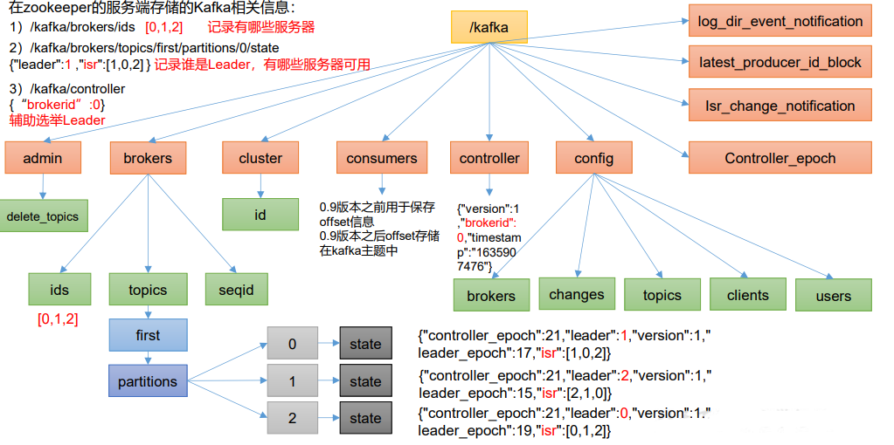

# 第 4 章 Kafka Broker

## 4.1 Kafka Broker 工作流程

### 4.1.1 Zookeeper 存储的 Kafka 信息

（1）启动 Zookeeper 客户端。

```
[atguigu@hadoop102 zookeeper-3.5.7]$ bin/zkCli.sh
```

（2）通过 ls 命令可以查看 kafka 相关信息。

```
[zk: localhost:2181(CONNECTED) 2] ls /kafka
```



### 4.1.2 Kafka Broker 总体工作流程


### 4.1.3 Broker 重要参数

