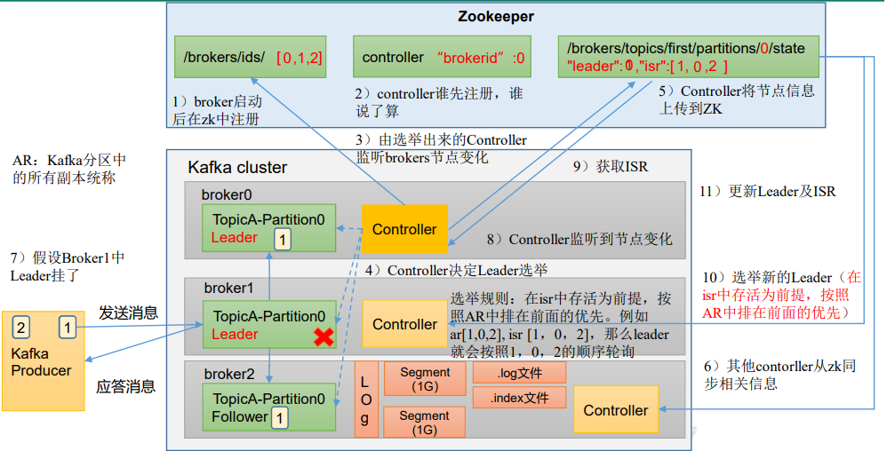
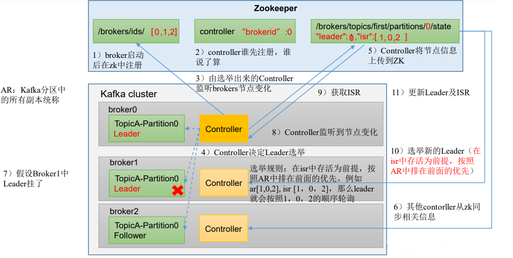
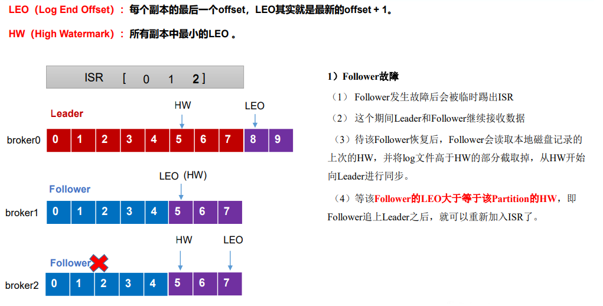
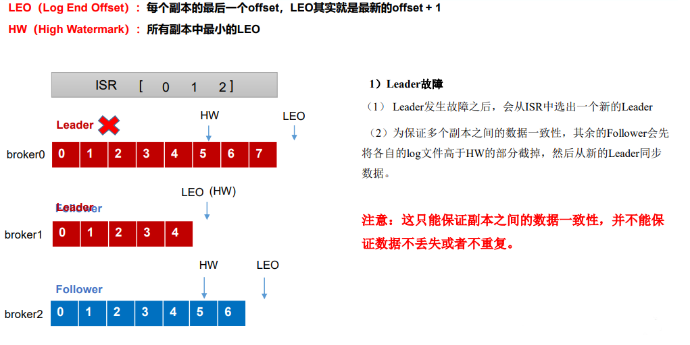
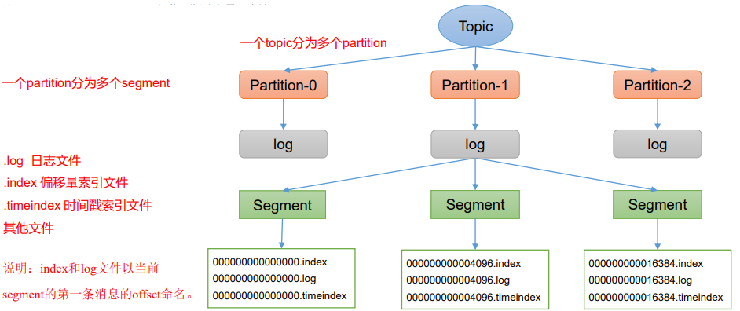

# 第 4 章 Kafka Broker

## 4.1 Kafka Broker 工作流程

### 4.1.1 Zookeeper 存储的 Kafka 信息

（1）启动 Zookeeper 客户端。

```
[atguigu@hadoop102 zookeeper-3.5.7]$ bin/zkCli.sh
```

（2）通过 ls 命令可以查看 kafka 相关信息。

```
[zk: localhost:2181(CONNECTED) 2] ls /kafka
```


### 4.1.2 Kafka Broker 总体工作流程



### 4.1.3 Broker 重要参数

| 参数名称                                | 描述                                                         |
| --------------------------------------- | ------------------------------------------------------------ |
| replica.lag.time.max.ms                 | ISR 中，如果 Follower 长时间未向 Leader 发送通信请求或同步数据，则该 Follower 将被踢出 ISR。 该时间阈值，**默认 30s。** |
| auto.leader.rebalance.enable            | **默认是 true**。 自动 Leader Partition 平衡。               |
| leader.imbalance.per.broker.percentage  | **默认是 10%。** 每个 broker 允许的不平衡的 leader 的比率。如果每个 broker 超过了这个值，控制器 会触发 leader 的平衡。 |
| leader.imbalance.check.interval.seconds | **默认值 300 秒**。检查 leader 负载是否平衡的间隔时间。      |
| log.segment.bytes                       | Kafka 中 log 日志是分成一块块存储的，此配置是指 log 日志划分成块的大小，**默认值 1G。** |
| log.index.interval.bytes                | **默认 4kb**，kafka 里面每当写入了 4kb 大小的日志 （.log），然后就往 index 文件里面记录一个索引。 |
| log.retention.hours                     | Kafka 中数据保存的时间，**默认 7 天。**                      |
| log.retention.minutes                   | Kafka 中数据保存的时间，**分钟级别**，默认关闭。             |
| log.retention.ms                        | Kafka 中数据保存的时间，**毫秒级别**，默认关闭。             |
| log.retention.check.interval.ms         | 检查数据是否保存超时的间隔，**默认是 5 分钟**。              |
| log.retention.bytes                     | **默认等于-1，表示无穷大**。超过设置的所有日志总 大小，删除最早的 segment。 |
| log.cleanup.policy                      | **默认是 delete**，表示所有数据启用删除策略； 如果设置值为 compact，表示所有数据启用压缩策略。 |
| num.io.threads                          | **默认是 8**。负责写磁盘的线程数。整个参数值要占总核数的 50%。 |
| num.replica.fetchers                    | 副本拉取线程数，这个参数占总核数的 50%的 1/3                 |
| num.network.threads                     | **默认是 3**。数据传输线程数，这个参数占总核数的 50%的 2/3 。 |
| log.flush.interval.messages             | 强制页缓存刷写到磁盘的条数，默认是 long 的最大值，9223372036854775807。一般不建议修改， 交给系统自己管理。 |
| log.flush.interval.ms                   | 每隔多久，刷数据到磁盘，默认是 null。一般不建 议修改，交给系统自己管理。 |

## 4.2 生产经验——节点服役和退役

### 4.2.1 服役新节点

#### 1）新节点准备

- （1）关闭 hadoop104，并右键执行克隆操作。
- （2）开启 hadoop105，并修改 IP 地址。
- （3）在 hadoop105 上，修改主机名称为 hadoop105。
- （4）重新启动 hadoop104、hadoop105。
- （5）修改 haodoop105 中 kafka 的 broker.id 为 3。
- （6）删除 hadoop105 中 kafka 下的 datas 和 logs。
- （7）启动 hadoop102、hadoop103、hadoop104 上的 kafka 集群。
- （8）单独启动 hadoop105 中的 kafka。
- 2）执行负载均衡操作

#### 2）执行负载均衡操作

（1）创建一个要均衡的主题。

```
[atguigu@hadoop102 kafka]$ vim topics-to-move.json
{
     "topics": [
     	{"topic": "first"}
     ],
     "version": 1
}
```

（2）生成一个负载均衡的计划。

```
[atguigu@hadoop102 kafka]$ bin/kafka-reassign-partitions.sh --bootstrap-server hadoop102:9092 --topics-to-move-json-file topics-to-move.json --broker-list "0,1,2,3" --generate

Current partition replica assignment
{"version":1,"partitions":[{"topic":"first","partition":0,"replicas":[0,2,1],"log_dirs":["any","any","any"]},{"topic":"first","partition":1,"replicas":[2,1,0],"log_dirs":["any","any","any"]},{"topic":"first","partition":2,"replicas":[1,0,2],"log_dirs":["any","any","any"]}]}

Proposed partition reassignment configuration
{"version":1,"partitions":[{"topic":"first","partition":0,"replicas":[2,3,0],"log_dirs":["any","any","any"]},{"topic":"first","partition":1,"replicas":[3,0,1],"log_dirs":["any","any","any"]},{"topic":"first","partition":2,"replicas":[0,1,2],"log_dirs":["any","any","any"]}]}
```

（3）创建副本存储计划（所有副本存储在 broker0、broker1、broker2、broker3 中）。

```
[atguigu@hadoop102 kafka]$ vim increase-replication-factor.json
```

输入如下内容

```
{"version":1,"partitions":[{"topic":"first","partition":0,"replicas":[2,3,0],"log_dirs":["any","any","any"]},{"topic":"first","partition":1,"replicas":[3,0,1],"log_dirs":["any","any","any"]},{"to
pic":"first","partition":2,"replicas":[0,1,2],"log_dirs":["any","any","any"]}]}
```

（4）执行副本存储计划。

```
[atguigu@hadoop102 kafka]$ bin/kafka-reassign-partitions.sh --bootstrap-server hadoop102:9092 --reassignment-json-file increase-replication-factor.json --execute
```

（5）验证副本存储计划。

```
[atguigu@hadoop102 kafka]$ bin/kafka-reassign-partitions.sh --bootstrap-server hadoop102:9092 --reassignment-json-file increase-replication-factor.json --verify

Status of partition reassignment:
Reassignment of partition first-0 is complete.
Reassignment of partition first-1 is complete.
Reassignment of partition first-2 is complete.

Clearing broker-level throttles on brokers 0,1,2,3
Clearing topic-level throttles on topic first
```

### 4.2.2 退役旧节点

#### 1）执行负载均衡操作

先按照退役一台节点，**生成执行计划**，然后按照服役时操作流程**执行负载均衡**。

（1）创建一个要均衡的主题。

```
[atguigu@hadoop102 kafka]$ vim topics-to-move.json

{
     "topics": [
     	{"topic": "first"}
     ],
     "version": 1
}
```

（2）创建执行计划。

```
[atguigu@hadoop102 kafka]$ bin/kafka-reassign-partitions.sh --bootstrap-server hadoop102:9092 --topics-to-move-json-file topics-to-move.json --broker-list "0,1,2" --generate

Current partition replica assignment
{"version":1,"partitions":[{"topic":"first","partition":0,"replicas":[2,0,1],"log_dirs":["any","any","any"]},{"topic":"first","partition":1,"replicas":[3,1,2],"log_dirs":["any","any","any"]},{"topic":"first","partition":2,"replicas":[0,2,3],"log_dirs":["any","any","any"]}]}

Proposed partition reassignment configuration
{"version":1,"partitions":[{"topic":"first","partition":0,"replicas":[2,0,1],"log_dirs":["any","any","any"]},{"topic":"first","par
tition":1,"replicas":[0,1,2],"log_dirs":["any","any","any"]},{"topic":"first","partition":2,"replicas":[1,2,0],"log_dirs":["any","any","any"]}]}
```

（3）创建副本存储计划（所有副本存储在 broker0、broker1、broker2 中）。

```
[atguigu@hadoop102 kafka]$ vim increase-replication-factor.json

{"version":1,"partitions":[{"topic":"first","partition":0,"replicas":[2,0,1],"log_dirs":["any","any","any"]},{"topic":"first","partition":1,"replicas":[0,1,2],"log_dirs":["any","any","any"]},{"to
pic":"first","partition":2,"replicas":[1,2,0],"log_dirs":["any","any","any"]}]}
```

（4）执行副本存储计划。

```
[atguigu@hadoop102 kafka]$ bin/kafka-reassign-partitions.sh --bootstrap-server hadoop102:9092 --reassignment-json-file increase-replication-factor.json --execute
```

（5）验证副本存储计划。

```
[atguigu@hadoop102 kafka]$ bin/kafka-reassign-partitions.sh --bootstrap-server hadoop102:9092 --reassignment-json-file increase-replication-factor.json --verify

Status of partition reassignment:
Reassignment of partition first-0 is complete.
Reassignment of partition first-1 is complete.
Reassignment of partition first-2 is complete.

Clearing broker-level throttles on brokers 0,1,2,3
Clearing topic-level throttles on topic first
```

2）执行停止命令

在 hadoop105 上执行停止命令即可。

```
[atguigu@hadoop105 kafka]$ bin/kafka-server-stop.sh 
```

> Kafka 执行负载均衡操作不会自动停止

## 4.3 Kafka 副本

### 4.3.1 副本基本信息

（1）Kafka 副本作用：提高数据可靠性。

（2）Kafka 默认副本 1 个，生产环境一般配置为 2 个，保证数据可靠性；太多副本会增加磁盘存储空间，增加网络上数据传输，降低效率。

（3）Kafka 中副本分为：Leader 和 Follower。Kafka 生产者只会把数据发往 Leader， 然后 Follower 找 Leader 进行同步数据。

（4）Kafka 分区中的所有副本统称为 AR（Assigned Repllicas）。

​		AR(**Assigned Replicas**) = ISR(**In-Sync Replicas**) + OS(**Out-of-Sync Replicas**)

ISR，表示和 Leader 保持同步的 Follower 集合。如果 Follower 长时间未向 Leader 发送通信请求或同步数据，则该 Follower 将被踢出 ISR。该时间阈值由 `replica.lag.time.max.ms` 参数设定，默认 30s。Leader 发生故障之后，就会从 ISR 中选举新的 Leader。

OSR，表示 Follower 与 Leader 副本同步时，延迟过多的副本。

## 4.3.2 Leader 选举流程

Kafka 集群中有一个 broker 的 Controller 会被选举为 Controller Leader，负责**管理集群 broker 的上下线**，所有 topic 的分区副本分配和 **Leader 选举**等工作。

Controller 的信息同步工作是依赖于 Zookeeper 的。



### 4.3.3 Leader 和 Follower 故障处理细节 水位

#### 1）Follower故障 



#### 2）Leader故障



### 4.3.4 分区副本分配

如果 kafka 服务器只有 4 个节点，那么设置 kafka 的分区数大于服务器台数，在 kafka 底层如何分配存储副本呢？

### 4.3.5 生产经验——手动调整分区副本存储

在生产环境中，每台服务器的配置和性能不一致，但是Kafka只会根据自己的代码规则创建对应的分区副本，就会导致个别服务器存储压力较大。所有需要手动调整分区副本的存储。

**需求**：创建一个新的topic，4个分区，两个副本，名称为three。将该topic的所有副本都存储到broker0和broker1两台服务器上。

手动调整分区副本存储的步骤如下：

- （1）创建一个新的 topic，名称为 three。

    ```
    atguigu@hadoop102 kafka]$ bin/kafka-topics.sh --bootstrap-server hadoop102:9092 --create --partitions 4 --replication-factor 2 --topic three
    ```

- （2）查看分区副本存储情况。

    ```
    [atguigu@hadoop102 kafka]$ bin/kafka-topics.sh --bootstrap-server hadoop102:9092 --describe --topic three
    ```

- （3）创建副本存储计划（所有副本都指定存储在 broker0、broker1 中）

    ```
    [atguigu@hadoop102 kafka]$ vim increase-replication-factor.json
    ```

    输入如下内容：

    ```
    {
        "version":1,
        "partitions":[{"topic":"three","partition":0,"replicas":[0,1]},
                    {"topic":"three","partition":1,"replicas":[0,1]},
                    {"topic":"three","partition":2,"replicas":[1,0]},
                    {"topic":"three","partition":3,"replicas":[1,0]}]
    }
    ```

- （4）执行副本存储计划。

    ```
    [atguigu@hadoop102 kafka]$ bin/kafka-reassign-partitions.sh --bootstrap-server hadoop102:9092 --reassignment-json-file increase-replication-factor.json --execute
    ```

- （5）验证副本存储计划。

    ```
    [atguigu@hadoop102 kafka]$ bin/kafka-reassign-partitions.sh --bootstrap-server hadoop102:9092 --reassignment-json-file increase-replication-factor.json --verify
    ```

- （6）查看分区副本存储情况

    ```
    [atguigu@hadoop102 kafka]$ bin/kafka-topics.sh --bootstrap-server hadoop102:9092 --describe --topic three
    ```

### 4.3.6 生产经验——Leader Partition 负载平衡

正常情况下，Kafka本身会自动把Leader Partition均匀分散在各个机器上，来保证每台机器的读写吞吐量都是均匀的。但是如果某些broker宕机，会导致Leader Partition过于集中在其他少部分几台broker上，这会导致少数几台broker的读写请求压力过高，其他宕机的 broker重启之后都是follower partition，读写请求很低，造成集群负载不均衡。


- `auto.leader.rebalance.enable`，默认是true。 自动Leader Partition 平衡
- `leader.imbalance.per.broker.percentage`， **默认是10%**。每个broker允许的不平衡的leader的比率。如果每个broker超过了这个值，控制器会触发leader的平衡。
- `leader.imbalance.check.interval.seconds`， **默认值300秒**。检查leader负载是否平衡 的间隔时间。

### 4.3.7 生产经验——增加副本因子

在生产环境当中，由于某个主题的重要等级需要提升，我们考虑增加副本。副本数的增加需要先制定计划，然后根据计划执行。

#### 1）创建 topic

```
[atguigu@hadoop102 kafka]$ bin/kafka-topics.sh --bootstrap-server hadoop102:9092 --create --partitions 3 --replication-factor 1 --topic four
```

#### 2）手动增加副本存储

（1）创建副本存储计划（所有副本都指定存储在 broker0、broker1、broker2 中）

```
[atguigu@hadoop102 kafka]$ vim increase-replication-factor.json
```

输入如下内容：

```
{"version":1,"partitions":[{"topic":"four","partition":0,"replicas":[0,1,2]},{"topic":"four","partition":1,"replicas":[0,1,2]},{"topic":"four","partition":2,"replicas":[0,1,2]}]}
```

（2）执行副本存储计划。

```
[atguigu@hadoop102 kafka]$ bin/kafka-reassign-partitions.sh --bootstrap-server hadoop102:9092 --reassignment-json-file increase-replication-factor.json --execute
```

## 4.4 文件存储

### 4.4.1 文件存储机制

#### 1）Topic 数据的存储机制

Topic是逻辑上的概念，而partition是物理上的概念，**每个partition对应于一个log文件**，该log文件中存储的就是Producer生产的数据。**Producer生产的数据会被不断追加到该log文件末端**，为防止log文件过大导致数据定位效率低下，Kafka采取了分片和索引机制， 将**每个partition分为多个segment。每个segment包括**：“.index”文件、“.log”文件和.timeindex等文件。这些文件位于一个文件夹下，该文件夹的命名规则为：topic名称+分区序号，例如：first-0。


