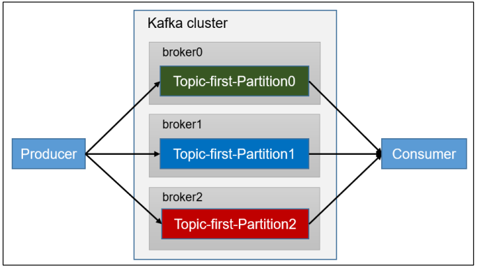
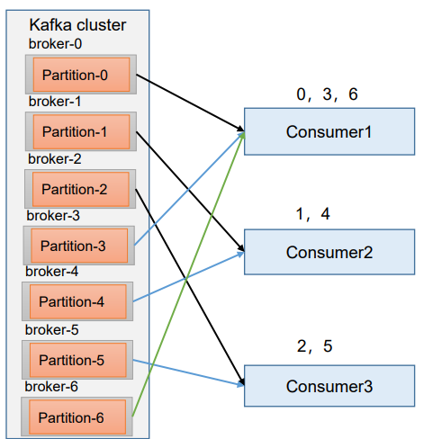
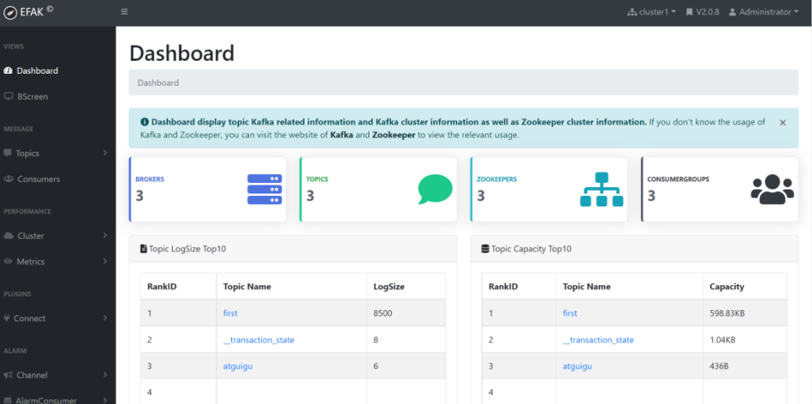

## 5.1 Kafka 消费方式

➢ pull（拉）模 式：

consumer 采用从 broker 中主动拉取数据。 Kafka 采用这种方式。

➢ push（推）模式：

Kafka 没有采用这种方式，因为由 broker 决定消息发送速率，很难适应所有消费者的消费速率。例如推送的速度是 50m/s， Consumer1、Consumer2 就来不及处理消息。

pull 模式不足之处是，如 果 Kafka 没有数据，消费者可能会陷入循环中，一直返回空数据。


## 5.2 Kafka 消费者工作流程

### 5.2.1 消费者总体工作流程


### 5.2.2 消费者组原理

Consumer Group（CG）：消费者组，由多个 consumer 组成。形成一个消费者组的条件，是所有消费者的 groupid 相同。

- 消费者组内每个消费者负责消费不同分区的数据，一个分区只能由一个组内消费者消费。
- 消费者组之间互不影响。所有的消费者都属于某个消费者组，即消费者组是**逻辑上的一个订阅者。**
  


#### 消费者组初始化流程

1. coordinator：辅助实现消费者组的初始化和分区的分配。

   coordinator 节点选择 = groupid 的 hashcode 值 % 50（ \_\_consumer_offsets 的分区数量）

   例如： groupid 的 hashcode 值 = 1，1% 50 = 1，那么`__consumer_offsets` 主题的 1 号分区，在哪个 broker 上，就选择这个节点的 coordinator 作为这个消费者组的老大。消费者组下的所有的消费者提交 offset 的时候就往这个分区去提交 offset。

   

   

### 5.2.3 消费者重要参数

| 参数名称                               | 描述                                                                                                                                                                                                                                                                                |
| -------------------------------------- | ----------------------------------------------------------------------------------------------------------------------------------------------------------------------------------------------------------------------------------------------------------------------------------- |
| bootstrap.servers                      | 向 Kafka 集群建立初始连接用到的 host/port 列表。                                                                                                                                                                                                                                    |
| key.deserializer 和 value.deserializer | 指定接收消息的 key 和 value 的反序列化类型。一定要写全 类名。                                                                                                                                                                                                                       |
| group.id                               | 标记消费者所属的消费者组。                                                                                                                                                                                                                                                          |
| enable.auto.commit                     | **默认值为 true**，消费者会自动周期性地向服务器提交偏移量。                                                                                                                                                                                                                         |
| auto.commit.interval.ms                | 如果设置了 enable.auto.commit 的值为 true， 则该值定义了消费者偏移量向 Kafka 提交的频率，**默认 5s。**                                                                                                                                                                              |
| auto.offset.reset                      | 当 Kafka 中没有初始偏移量或当前偏移量在服务器中不存在 （如，数据被删除了），该如何处理？ earliest：自动重置偏 移量到最早的偏移量。 **latest：默认，自动重置偏移量为最 新的偏移量。** none：如果消费组原来的（previous）偏移量 不存在，则向消费者抛异常。 anything：向消费者抛异常。 |
| offsets.topic.num.partitions           | `__consumer_offsets` 的分区数，**默认是 50 个分区。**                                                                                                                                                                                                                               |
| heartbeat.interval.ms                  | Kafka 消费者和 coordinator 之间的心跳时间，默认 3s。 该条目的值必须小于 session.timeout.ms ，也不应该高于 session.timeout.ms 的 1/3。                                                                                                                                               |
| session.timeout.ms                     | Kafka 消费者和 coordinator 之间连接超时时间，**默认 45s**。 超过该值，该消费者被移除，消费者组执行再平衡。                                                                                                                                                                          |
| max.poll.interval.ms                   | 消费者处理消息的最大时长，**默认是 5 分钟**。超过该值，该 消费者被移除，消费者组执行再平衡。                                                                                                                                                                                        |
| fetch.min.bytes                        | 默认 1 个字节。消费者获取服务器端一批消息最小的字节 数。                                                                                                                                                                                                                            |
| fetch.max.wait.ms                      | 默认 500ms。如果没有从服务器端获取到一批数据的最小字 节数。该时间到，仍然会返回数据。                                                                                                                                                                                               |
| fetch.max.bytes                        | 默认 Default: 52428800（50 m）。消费者获取服务器端一批 消息最大的字节数。如果服务器端一批次的数据大于该值 （50m）仍然可以拉取回来这批数据，因此，这不是一个绝对最大值。一批次的大小受 message.max.bytes （broker config）or max.message.bytes （topic config）影响。                |
| max.poll.records                       | 一次 poll 拉取数据返回消息的最大条数，默认是 500 条。                                                                                                                                                                                                                               |

## 5.3 消费者 API

### 5.3.1 独立消费者案例（订阅主题）

创建一个独立消费者，消费 first 主题中数据。



> 注意：在消费者 API 代码中必须配置消费者组 id。命令行启动消费者不填写消费者组 id 会被自动填写随机的消费者组 id。

2）实现步骤

```
public class CustomConsumer {

    public static void main(String[] args) {

        // 0 配置
        Properties properties = new Properties();

        // 连接 bootstrap.servers
        properties.put(ConsumerConfig.BOOTSTRAP_SERVERS_CONFIG,"hadoop102:9092,hadoop103:9092");

        // 反序列化
        properties.put(ConsumerConfig.KEY_DESERIALIZER_CLASS_CONFIG, StringDeserializer.class.getName());
        properties.put(ConsumerConfig.VALUE_DESERIALIZER_CLASS_CONFIG, StringDeserializer.class.getName());

        // 配置消费者组id
        properties.put(ConsumerConfig.GROUP_ID_CONFIG,"test5");

        // 设置分区分配策略
        properties.put(ConsumerConfig.PARTITION_ASSIGNMENT_STRATEGY_CONFIG,"org.apache.kafka.clients.consumer.StickyAssignor");

        // 1 创建一个消费者  "", "hello"
        KafkaConsumer<String, String> kafkaConsumer = new KafkaConsumer<>(properties);

        // 2 订阅主题 first
        ArrayList<String> topics = new ArrayList<>();
        topics.add("first");
        kafkaConsumer.subscribe(topics);

        // 3 消费数据
        while (true){

            ConsumerRecords<String, String> consumerRecords = kafkaConsumer.poll(Duration.ofSeconds(1));

            for (ConsumerRecord<String, String> consumerRecord : consumerRecords) {
                System.out.println(consumerRecord);
            }

            kafkaConsumer.commitAsync();
        }
    }
}
```

### 5.3.2 独立消费者案例（订阅分区）

1）需求：创建一个独立消费者，消费 first 主题 0 号分区的数据。


2）实现步骤

```
public class CustomConsumerPartition {

    public static void main(String[] args) {
        // 0 配置
        Properties properties = new Properties();

        // 连接
        properties.put(ConsumerConfig.BOOTSTRAP_SERVERS_CONFIG,"hadoop102:9092,hadoop103:9092");

        // 反序列化
        properties.put(ConsumerConfig.KEY_DESERIALIZER_CLASS_CONFIG, StringDeserializer.class.getName());
        properties.put(ConsumerConfig.VALUE_DESERIALIZER_CLASS_CONFIG, StringDeserializer.class.getName());

        // 组id
        properties.put(ConsumerConfig.GROUP_ID_CONFIG,"test");

        // 1 创建一个消费者
        KafkaConsumer<String, String> kafkaConsumer = new KafkaConsumer<>(properties);

        // 2 订阅主题对应的分区
        ArrayList<TopicPartition> topicPartitions = new ArrayList<>();
        topicPartitions.add(new TopicPartition("first",0));
        kafkaConsumer.assign(topicPartitions);

        // 3 消费数据
        while (true){

            ConsumerRecords<String, String> consumerRecords = kafkaConsumer.poll(Duration.ofSeconds(1));

            for (ConsumerRecord<String, String> consumerRecord : consumerRecords) {
                System.out.println(consumerRecord);
            }
        }
    }
}
```

### 5.3.3 消费者组案例

1）需求：测试同一个主题的分区数据，只能由一个消费者组中的一个消费。


```
public class CustomConsumer1 {

    public static void main(String[] args) {

        // 0 配置
        Properties properties = new Properties();

        // 连接 bootstrap.servers
        properties.put(ConsumerConfig.BOOTSTRAP_SERVERS_CONFIG,"hadoop102:9092,hadoop103:9092");

        // 反序列化
        properties.put(ConsumerConfig.KEY_DESERIALIZER_CLASS_CONFIG, StringDeserializer.class.getName());
        properties.put(ConsumerConfig.VALUE_DESERIALIZER_CLASS_CONFIG, StringDeserializer.class.getName());

        // 配置消费者组id
        properties.put(ConsumerConfig.GROUP_ID_CONFIG,"test5");
        // 设置分区分配策略
        properties.put(ConsumerConfig.PARTITION_ASSIGNMENT_STRATEGY_CONFIG,"org.apache.kafka.clients.consumer.StickyAssignor");

        // 1 创建一个消费者  "", "hello"
        KafkaConsumer<String, String> kafkaConsumer = new KafkaConsumer<>(properties);

        // 2 订阅主题 first
        ArrayList<String> topics = new ArrayList<>();
        topics.add("first");
        kafkaConsumer.subscribe(topics);

        // 3 消费数据
        while (true){

            ConsumerRecords<String, String> consumerRecords = kafkaConsumer.poll(Duration.ofSeconds(1));

            for (ConsumerRecord<String, String> consumerRecord : consumerRecords) {
                System.out.println(consumerRecord);
            }
        }
    }
}
```

## 5.4 生产经验——分区的分配以及再平衡

1、一个 consumer group 中有多个 consumer 组成，一个 topic 有多个 partition 组成，现在的问题是，**到底由哪个 consumer 来消费哪个 partition 的数据。**

2、Kafka 有四种主流的分区分配策略： Range、RoundRobin、Sticky、CooperativeSticky。 可以通过配置参数**partition.assignment.strategy**，修改分区的分配策略。默认策略是 Range + CooperativeSticky。Kafka 可以同时使用 多个分区分配策略。


| 参数名称                      | 描述                                                                                                                                                                                          |
| ----------------------------- | --------------------------------------------------------------------------------------------------------------------------------------------------------------------------------------------- |
| heartbeat.interval.ms         | Kafka 消费者和 coordinator 之间的心跳时间，默认 3s。 该条目的值必须小于 session.timeout.ms，也不应该高于 session.timeout.ms 的 1/3。                                                          |
| session.timeout.ms            | Kafka 消费者和 coordinator 之间连接超时时间，默认 45s。超过该值，该消费者被移除，消费者组执行再平衡。                                                                                         |
| max.poll.interval.ms          | 消费者处理消息的最大时长，默认是 5 分钟。超过该值，该消费者被移除，消费者组执行再平衡。                                                                                                       |
| partition.assignment.strategy | 消 费 者 分 区 分 配 策 略 ， 默 认 策 略 是 Range + CooperativeSticky。Kafka 可以同时使用多个分区分配策略。 可 以 选 择 的 策 略 包 括 ： Range 、 RoundRobin 、 Sticky 、 CooperativeSticky |

### 5.4.1 Range 以及再平衡

#### 1）Range 分区策略原理

Range 是对每个 topic 而言的。

首先对同一个 topic 里面的**分区按照序号进行排序**，并**对消费者按照字母顺序进行排序。**

假如现在有 7 个分区，3 个消费者，排序后的分区将会 是 0,1,2,3,4,5,6；消费者排序完之后将会是 C0,C1,C2。

通过 **partitions 数/consumer** 数来决定每个消费者应该消费几个分区。如果除不尽，那么前面几个消费者将会多消费 1 个分区。

例如，7/3 = 2 余 1 ，除不尽，那么消费者 C0 便会多消费 1 个分区。 8/3=2 余 2，除不尽，那么 C0 和 C1 分别多消费一个。

注意：如果只是针对 1 个 topic 而言，C0 消费者多消费 1 个分区影响不是很大。但是如果有 N 多个 topic，那么针对每个 topic，消费者 C0 都将多消费 1 个分区，topic 越多，C0 消 费的分区会比其他消费者明显多消费 N 个分区。 **容易产生数据倾斜！**



#### 2）Range 分区分配策略案例

（1）修改主题 first 为 7 个分区。

```
[andanyoung@hadoop102 kafka]$ bin/kafka-topics.sh --bootstrap-server hadoop102:9092 --alter --topic first --partitions 7
```

> 注意：分区数可以增加，但是不能减少。

（2）复制 CustomConsumer 类，创建 CustomConsumer2。这样可以由三个消费者 CustomConsumer、CustomConsumer1、CustomConsumer2 组成消费者组，组名都为“test”， 同时启动 3 个消费者。

#### 3）Range 分区分配再平衡案例

（1）停止掉 0 号消费者，快速重新发送消息观看结果（45s 以内，越快越好）。

- 1 号消费者：消费到 3、4 号分区数据。

- 2 号消费者：消费到 5、6 号分区数据。

- 0 号消费者的任务会整体被分配到 1 号消费者或者 2 号消费者。

> 说明：0 号消费者挂掉后，消费者组需要按照超时时间 45s 来判断它是否退出，所以需要等待，时间到了 45s 后，判断它真的退出就会把任务分配给其他 消费者 执行。

（2）再次重新发送消息观看结果（45s 以后）。

- 1 号消费者：消费到 0、1、2、3 号分区数据。

- 2 号消费者：消费到 4、5、6 号分区数据。

> 说明：消费者 0 已经被踢出消费者组，所以重新按照 range 方式分配。

### 5.4.2 RoundRobin 以及再平衡


RoundRobin 针对集群中**所有 Topic 而言。**

RoundRobin 轮询分区策略，是把所有的 partition 和所有的 consumer 都列出来，然后按照 hashcode 进行排序，最后通过轮询算法来分配 partition 给到各个消费者。

### 5.4.3 Sticky 以及再平衡

**粘性分区定义**：可以理解为分配的结果带有“粘性的”。即在执行一次新的分配之前， 考虑上一次分配的结果，尽量少的调整分配的变动，可以节省大量的开销。

粘性分区是 Kafka 从 0.11.x 版本开始引入这种分配策略，**首先会尽量均衡的放置分区 到消费者上面**，在出现同一消费者组内消费者出现问题的时候，会**尽量保持原有分配的分区不变化。**

## 5.5 offset 位移

### 5.5.1 offset 的默认维护位置


> \_\_consumer_offsets 主题里面采用 key 和 value 的方式存储数据。key 是 group.id+topic+ 分区号，value 就是当前 offset 的值。每隔一段时间，kafka 内部会对这个 topic 进行 compact，也就是每个 group.id+topic+分区号就保留最新数据。

#### 1）消费 offset 案例

（0）思想：\_\_consumer_offsets 为 Kafka 中的 topic，那就可以通过消费者进行消费。

（1）在配置文件 config/consumer.properties 中添加配置 `exclude.internal.topics=false`，默认是 true，表示不能消费系统主题。为了查看该系统主题数据，所以该参数修改为 false。

（2）采用命令行方式，创建一个新的 topic。

```
[andanyoung@hadoop102 kafka]$ bin/kafka-topics.sh --bootstrap-server hadoop102:9092 --create --topic andanyoung --partitions 2 --replication-factor 2
```

（3）启动生产者往 andanyoung 生产数据。

```
[andanyoung@hadoop102 kafka]$ bin/kafka-console-producer.sh --topic andanyoung --bootstrap-server hadoop102:9092
```

（4）启动消费者消费 andanyoung 数据。

```
[andanyoung@hadoop104 kafka]$ bin/kafka-console-consumer.sh --bootstrap-server hadoop102:9092 --topic andanyoung --group test
```

> 注意：指定消费者组名称，更好观察数据存储位置（key 是 group.id+topic+分区号）。

（5）查看消费者消费主题\_\_consumer_offsets。

```
andanyoung@hadoop102 kafka]$ bin/kafka-console-consumer.sh --topic __consumer_offsets --bootstrap-server hadoop102:9092 --consumer.config config/consumer.properties --formatter "kafka.coordinator.group.GroupMetadataManager\$OffsetsMessageFormatter" --from-beginning

[offset,andanyoung,1]::OffsetAndMetadata(offset=7, leaderEpoch=Optional[0], metadata=, commitTimestamp=1622442520203, expireTimestamp=None)
[offset,andanyoung,0]::OffsetAndMetadata(offset=8, leaderEpoch=Optional[0], metadata=, commitTimestamp=1622442520203, expireTimestamp=None)
```

### 5.5.2 自动提交 offset

为了使我们能够专注于自己的业务逻辑，Kafka 提供了自动提交 offset 的功能。

自动提交 offset 的相关参数：

- `enable.auto.commit`：是否开启自动提交 offset 功能，默认是 true
- `auto.commit.interval.ms`: 自动提交 offset 的时间间隔，默认是 5s


| 参数名称                | 描述                                                                                               |
| ----------------------- | -------------------------------------------------------------------------------------------------- |
| enable.auto.commit      | 默认值为 true，消费者会自动周期性地向服务器提交偏移量。                                            |
| auto.commit.interval.ms | 如果设置了 enable.auto.commit 的值为 true， 则该值定义了消费者偏移量向 Kafka 提交的频率，默认 5s。 |

#### 1）消费者自动提交 offset

```
public class CustomConsumerAutoOffset {

    public static void main(String[] args) {

        // 0 配置
        Properties properties = new Properties();

        // 连接 bootstrap.servers
        properties.put(ConsumerConfig.BOOTSTRAP_SERVERS_CONFIG,"hadoop102:9092,hadoop103:9092");

        // 反序列化
        properties.put(ConsumerConfig.KEY_DESERIALIZER_CLASS_CONFIG, StringDeserializer.class.getName());
        properties.put(ConsumerConfig.VALUE_DESERIALIZER_CLASS_CONFIG, StringDeserializer.class.getName());

        // 配置消费者组id
        properties.put(ConsumerConfig.GROUP_ID_CONFIG,"test");

        // 自动提交
        properties.put(ConsumerConfig.ENABLE_AUTO_COMMIT_CONFIG,true);

        // 提交时间间隔
        properties.put(ConsumerConfig.AUTO_COMMIT_INTERVAL_MS_CONFIG,1000);

        // 1 创建一个消费者  "", "hello"
        KafkaConsumer<String, String> kafkaConsumer = new KafkaConsumer<>(properties);

        // 2 订阅主题 first
        ArrayList<String> topics = new ArrayList<>();
        topics.add("first");
        kafkaConsumer.subscribe(topics);

        // 3 消费数据
        while (true){

            ConsumerRecords<String, String> consumerRecords = kafkaConsumer.poll(Duration.ofSeconds(1));

            for (ConsumerRecord<String, String> consumerRecord : consumerRecords) {
                System.out.println(consumerRecord);
            }
        }
    }
}
```

### 5.5.3 手动提交 offset

虽然自动提交 offset 十分简单便利，但由于其是基于时间提交的，开发人员难以把握 offset 提交的时机。因此 Kafka 还提供了手动提交 offset 的 API。

手动提交 offset 的方法有两种：分别是**commitSync（同步提交）** 和**commitAsync（异步提交）**。两者的相 点是，都会将本次提交的一批数据最高的偏移量提交；不同点是，同步提交阻塞当前线程，一直到提交成功，并且会自动失败重试（由不可控因素导致，也会出现提交失败）；而异步提交则没有失败重试机制，故有可能提交失败。

- commitSync（同步提交）：必须等待 offset 提交完毕，再去消费下一批数据。

- commitAsync（异步提交） ：发送完提交 offset 请求后，就开始消费下一批数据了。

  

#### 1）同步提交 offset

由于同步提交 offset 有失败重试机制，故更加可靠，但是由于一直等待提交结果，提交的效率比较低。以下为同步提交 offset 的示例。

```
public class CustomConsumerByHandSync {

    public static void main(String[] args) {

        // 0 配置
        Properties properties = new Properties();

        // 连接 bootstrap.servers
        properties.put(ConsumerConfig.BOOTSTRAP_SERVERS_CONFIG,"hadoop102:9092,hadoop103:9092");

        // 反序列化
        properties.put(ConsumerConfig.KEY_DESERIALIZER_CLASS_CONFIG, StringDeserializer.class.getName());
        properties.put(ConsumerConfig.VALUE_DESERIALIZER_CLASS_CONFIG, StringDeserializer.class.getName());

        // 配置消费者组id
        properties.put(ConsumerConfig.GROUP_ID_CONFIG,"test");

        // 手动提交
        properties.put(ConsumerConfig.ENABLE_AUTO_COMMIT_CONFIG,false);

        // 1 创建一个消费者  "", "hello"
        KafkaConsumer<String, String> kafkaConsumer = new KafkaConsumer<>(properties);

        // 2 订阅主题 first
        ArrayList<String> topics = new ArrayList<>();
        topics.add("first");
        kafkaConsumer.subscribe(topics);

        // 3 消费数据
        while (true){

            ConsumerRecords<String, String> consumerRecords = kafkaConsumer.poll(Duration.ofSeconds(1));

            for (ConsumerRecord<String, String> consumerRecord : consumerRecords) {
                System.out.println(consumerRecord);
            }

            // 手动提交offset
            kafkaConsumer.commitSync();
        }
    }
}
```

#### 2）异步提交 offset

虽然同步提交 offset 更可靠一些，但是由于其会阻塞当前线程，直到提交成功。因此吞吐量会受到很大的影响。因此更多的情况下，会选用异步提交 offset 的方式。 以下为异步提交 offset 的示例：

```
public class CustomConsumerByHandSync {

    public static void main(String[] args) {

        // 0 配置
        Properties properties = new Properties();

        // 连接 bootstrap.servers
        properties.put(ConsumerConfig.BOOTSTRAP_SERVERS_CONFIG,"hadoop102:9092,hadoop103:9092");

        // 反序列化
        properties.put(ConsumerConfig.KEY_DESERIALIZER_CLASS_CONFIG, StringDeserializer.class.getName());
        properties.put(ConsumerConfig.VALUE_DESERIALIZER_CLASS_CONFIG, StringDeserializer.class.getName());

        // 配置消费者组id
        properties.put(ConsumerConfig.GROUP_ID_CONFIG,"test");

        // 手动提交
        properties.put(ConsumerConfig.ENABLE_AUTO_COMMIT_CONFIG,false);

        // 1 创建一个消费者  "", "hello"
        KafkaConsumer<String, String> kafkaConsumer = new KafkaConsumer<>(properties);

        // 2 订阅主题 first
        ArrayList<String> topics = new ArrayList<>();
        topics.add("first");
        kafkaConsumer.subscribe(topics);

        // 3 消费数据
        while (true){

            ConsumerRecords<String, String> consumerRecords = kafkaConsumer.poll(Duration.ofSeconds(1));

            for (ConsumerRecord<String, String> consumerRecord : consumerRecords) {
                System.out.println(consumerRecord);
            }

            // 异步提交 offset
            kafkaConsumer.commitAsync();
        }
    }
}
```

### 5.5.4 指定 Offset 消费

**auto.offset.reset = earliest | latest | none** 默认是 latest。

当 Kafka 中没有初始偏移量（消费者组第一次消费）或服务器上不再存在当前偏移量时（例如该数据已被删除），该怎么办？

- （1）**earliest**：自动将偏移量重置为最早的偏移量，--from-beginning。
- （2）**latest**（默认值）：自动将偏移量重置为最新偏移量
- （3）**none**：如果未找到消费者组的先前偏移量，则向消费者抛出异常。


- （4）任意指定 offset 位移开始消费

```
    public class CustomConsumerSeek {

        public static void main(String[] args) {

            // 0 配置信息
            Properties properties = new Properties();

            // 连接
            properties.put(ConsumerConfig.BOOTSTRAP_SERVERS_CONFIG,"hadoop102:9092,hadoop103:9092");

            // 反序列化
            properties.put(ConsumerConfig.KEY_DESERIALIZER_CLASS_CONFIG, StringDeserializer.class.getName());
            properties.put(ConsumerConfig.VALUE_DESERIALIZER_CLASS_CONFIG, StringDeserializer.class.getName());

            // 组id
            properties.put(ConsumerConfig.GROUP_ID_CONFIG,"test3");

            // 1 创建消费者
            KafkaConsumer<String, String> kafkaConsumer = new KafkaConsumer<>(properties);

            // 2 订阅主题
            ArrayList<String> topics = new ArrayList<>();
            topics.add("first");
            kafkaConsumer.subscribe(topics);

            // 指定位置进行消费
            Set<TopicPartition> assignment = kafkaConsumer.assignment();

            //  保证分区分配方案已经制定完毕
            while (assignment.size() == 0){
                kafkaConsumer.poll(Duration.ofSeconds(1));

                assignment = kafkaConsumer.assignment();
            }

            // 指定消费的offset
            for (TopicPartition topicPartition : assignment) {
                kafkaConsumer.seek(topicPartition,600);
            }

            // 3  消费数据
            while (true){

                ConsumerRecords<String, String> consumerRecords = kafkaConsumer.poll(Duration.ofSeconds(1));

                for (ConsumerRecord<String, String> consumerRecord : consumerRecords) {

                    System.out.println(consumerRecord);
                }
            }
        }
    }
```

> 注意：每次执行完，需要修改消费者组名；

### 5.5.5 指定时间消费

需求：在生产环境中，会遇到最近消费的几个小时数据异常，想重新按照时间消费。 例如要求按照时间消费前一天的数据，怎么处理？

操作步骤：

```
    public class CustomConsumerSeekTime {

        public static void main(String[] args) {

            // 0 配置信息
            Properties properties = new Properties();

            // 连接
            properties.put(ConsumerConfig.BOOTSTRAP_SERVERS_CONFIG,"hadoop102:9092,hadoop103:9092");

            // 反序列化
            properties.put(ConsumerConfig.KEY_DESERIALIZER_CLASS_CONFIG, StringDeserializer.class.getName());
            properties.put(ConsumerConfig.VALUE_DESERIALIZER_CLASS_CONFIG, StringDeserializer.class.getName());

            // 组id
            properties.put(ConsumerConfig.GROUP_ID_CONFIG,"test3");

            // 1 创建消费者
            KafkaConsumer<String, String> kafkaConsumer = new KafkaConsumer<>(properties);

            // 2 订阅主题
            ArrayList<String> topics = new ArrayList<>();
            topics.add("first");
            kafkaConsumer.subscribe(topics);

            // 指定位置进行消费
            Set<TopicPartition> assignment = kafkaConsumer.assignment();

            //  保证分区分配方案已经制定完毕
            while (assignment.size() == 0){
                kafkaConsumer.poll(Duration.ofSeconds(1));

                assignment = kafkaConsumer.assignment();
            }

            // 希望把时间转换为对应的offset
            HashMap<TopicPartition, Long> topicPartitionLongHashMap = new HashMap<>();

            // 封装对应集合
            for (TopicPartition topicPartition : assignment) {
                topicPartitionLongHashMap.put(topicPartition,System.currentTimeMillis() - 1 * 24 * 3600 * 1000);
            }

            Map<TopicPartition, OffsetAndTimestamp> topicPartitionOffsetAndTimestampMap = kafkaConsumer.offsetsForTimes(topicPartitionLongHashMap);

            // 指定消费的offset
            for (TopicPartition topicPartition : assignment) {

                OffsetAndTimestamp offsetAndTimestamp = topicPartitionOffsetAndTimestampMap.get(topicPartition);

                kafkaConsumer.seek(topicPartition,offsetAndTimestamp.offset());
            }

            // 3  消费数据
            while (true){

                ConsumerRecords<String, String> consumerRecords = kafkaConsumer.poll(Duration.ofSeconds(1));

                for (ConsumerRecord<String, String> consumerRecord : consumerRecords) {

                    System.out.println(consumerRecord);
                }
            }
        }
    }
```

### 5.5.6 漏消费和重复消费

**重复消费**：已经消费了数据，但是 offset 没提交。

**漏消费**：先提交 offset 后消费，有可能会造成数据的漏消费。

（1）场景 1：**重复消费**。自动提交 offset 引起。


（2）场景 1：**漏消费**。设置 offset 为手动提交，当 offset 被提交时，数据还在内存中未落盘，此时刚好消费者线 程被 kill 掉，那么 offset 已经提交，但是数据未处理，导致这部分内存中的数据丢失。


## 5.6 生产经验——消费者事务

如果想完成 Consumer 端的精准一次性消费，那么需要**Kafka 消费端将消费过程和提交 offset 过程做原子绑定**。此时我们需要将 Kafka 的 offset 保存到支持事务的自定义介质（比如 MySQL）。这部分知识会在后续项目部分涉及。


## 5.7 生产经验——数据积压（消费者如何提高吞吐量）

1）如果是 Kafka 消费能力不足，则可以考虑增 加 Topic 的分区数，并且同时提升消费组的消费者数量，消费者数 = 分区数。（两者缺一不可）

2）如果是下游的数据处理不及时：提高每批次拉取的数量。批次拉取数据过少（拉取数据/处理时间 < 生产速度）， 使处理的数据小于生产的数据，也会造成数据积压。

| 参数名称        | 描述                                                                                                                                                                                                                                                                    |
| --------------- | ----------------------------------------------------------------------------------------------------------------------------------------------------------------------------------------------------------------------------------------------------------------------- |
| fetch.max.bytes | **默认 Default: 52428800（50 m）**。消费者获取服务器端一批消息最大的字节数。如果服务器端一批次的数据大于该值 （50m）仍然可以拉取回来这批数据，因此，这不是一个绝对最大值。一批次的大小受 message.max.bytes （broker config）or max.message.bytes （topic config）影响。 |
| ax.poll.records | 一次 poll 拉取数据返回消息的最大条数，默认是 500 条                                                                                                                                                                                                                     |

## 第 6 章 Kafka-Eagle 监控

Kafka-Eagle 框架可以监控 Kafka 集群的整体运行情况，在生产环境中经常使用。


