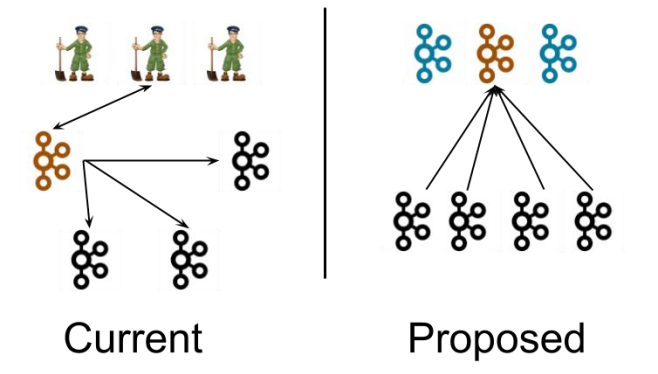

## 第 7 章 Kafka-Kraft 模式

## 7.1 Kafka-Kraft 架构



左图为 Kafka 现有架构，元数据在 zookeeper 中，运行时动态选举 controller，由 controller 进行 Kafka 集群管理。右图为 kraft 模式架构（实验性），不再依赖 zookeeper 集群， 而是用三台 controller 节点代替 zookeeper，元数据保存在 controller 中，由 controller 直接进行 Kafka 集群管理。

这样做的好处有以下几个：

- Kafka 不再依赖外部框架，而是能够独立运行；
- controller 管理集群时，不再需要从 zookeeper 中先读取数据，集群性能上升；
- 由于不依赖 zookeeper，集群扩展时不再受到 zookeeper 读写能力限制；
- controller 不再动态选举，而是由配置文件规定。这样我们可以有针对性的加强 controller 节点的配置，而不是像以前一样对随机 controller 节点的高负载束手无策。

## 7.2 Kafka-Kraft 集群部署

#### 1）再次解压一份 kafka 安装包

```
[atguigu@hadoop102 software]$ tar -zxvf kafka_2.12-3.0.0.tgz -C /opt/module/
```

#### 2）重命名为 kafka2

```
[atguigu@hadoop102 module]$ mv kafka_2.12-3.0.0/ kafka2
```

#### 3）在 hadoop102 上修改/opt/module/kafka2/config/kraft/server.properties 配置文件

```
[atguigu@hadoop102 kraft]$ vim server.properties

#kafka 的角色（controller 相当于主机、broker 节点相当于从机，主机类似 zk 功
能）
process.roles=broker, controller
#节点 ID
node.id=2
#controller 服务协议别名
controller.listener.names=CONTROLLER
#全 Controller 列表
controller.quorum.voters=2@hadoop102:9093,3@hadoop103:9093,4@hadoop104:9093
#不同服务器绑定的端口
listeners=PLAINTEXT://:9092,CONTROLLER://:9093
#broker 服务协议别名
inter.broker.listener.name=PLAINTEXT
#broker 对外暴露的地址
advertised.Listeners=PLAINTEXT://hadoop102:9092
#协议别名到安全协议的映射
listener.security.protocol.map=CONTROLLER:PLAINTEXT,PLAINTEXT:PLAINTEXT,SSL:SSL,SASL_PLAINTEXT:SASL_PLAINTEXT,SASL_SSL:SASL_SSL
#kafka 数据存储目录
log.dirs=/opt/module/kafka2/data
```

#### 4）分发 kafka2

```
[atguigu@hadoop102 module]$ xsync kafka2/
```

- 在 hadoop103 和 hadoop104 上 需 要 对 node.id 相应改变 ， 值需要和 controller.quorum.voters 对应。
- 在 hadoop103 和 hadoop104 上需要 根据各自的主机名称，修改相应的 advertised.Listeners 地址。

#### 5）初始化集群数据目录

（1）首先生成存储目录唯一 ID。

```
[atguigu@hadoop102 kafka2]$ bin/kafka-storage.sh random-uuid
J7s9e8PPTKOO47PxzI39VA
```

（2）用该 ID 格式化 kafka 存储目录（三台节点）。

```
[atguigu@hadoop102 kafka2]$ bin/kafka-storage.sh format -t J7s9e8PPTKOO47PxzI39VA -c /opt/module/kafka2/config/kraft/server.properties

[atguigu@hadoop103 kafka2]$ bin/kafka-storage.sh format -t J7s9e8PPTKOO47PxzI39VA -c /opt/module/kafka2/config/kraft/server.properties

[atguigu@hadoop104 kafka2]$ bin/kafka-storage.sh format -t J7s9e8PPTKOO47PxzI39VA -c /opt/module/kafka2/config/kraft/server.properties
```

#### 6）启动 kafka 集群

```
[atguigu@hadoop102 kafka2]$ bin/kafka-server-start.sh -daemon config/kraft/server.properties

[atguigu@hadoop103 kafka2]$ bin/kafka-server-start.sh -daemon config/kraft/server.properties

[atguigu@hadoop104 kafka2]$ bin/kafka-server-start.sh -daemon config/kraft/server.properties
```

#### 7）停止 kafka 集群

```
[atguigu@hadoop102 kafka2]$ bin/kafka-server-stop.sh
[atguigu@hadoop103 kafka2]$ bin/kafka-server-stop.sh
[atguigu@hadoop104 kafka2]$ bin/kafka-server-stop.sh
```

## 7.3 Kafka-Kraft 集群启动停止脚本

#### 1）在/home/atguigu/bin 目录下创建文件 kf2.sh 脚本文件

```
[atguigu@hadoop102 bin]$ vim kf2.sh
```

脚本如下：

```
#! /bin/bash
case $1 in
"start"){
	for i in hadoop102 hadoop103 hadoop104
	do
		echo " --------启动 $i Kafka2-------"
		ssh $i "/opt/module/kafka2/bin/kafka-server-start.sh -daemon /opt/module/kafka2/config/kraft/server.properties"
    done
};;
"stop"){
     for i in hadoop102 hadoop103 hadoop104
     do
     	echo " --------停止 $i Kafka2-------"
     	ssh $i "/opt/module/kafka2/bin/kafka-server-stop.sh "
     done
};;
esac
```

#### 2）添加执行权限

```
[atguigu@hadoop102 bin]$ chmod +x kf2.sh
```

#### 3）启动集群命令

```
[atguigu@hadoop102 ~]$ kf2.sh start
```

#### 4）停止集群命令

```
[atguigu@hadoop102 ~]$ kf2.sh stop
```

