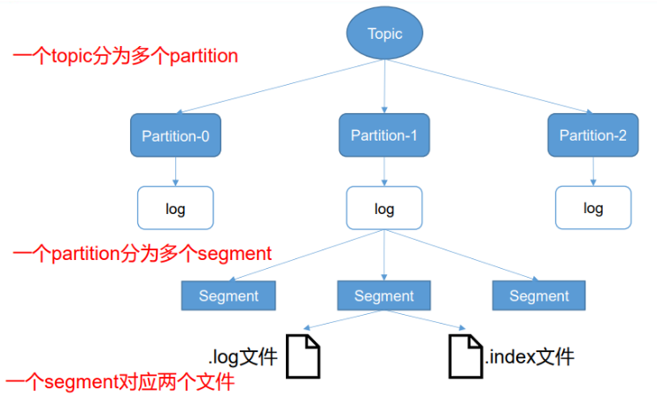
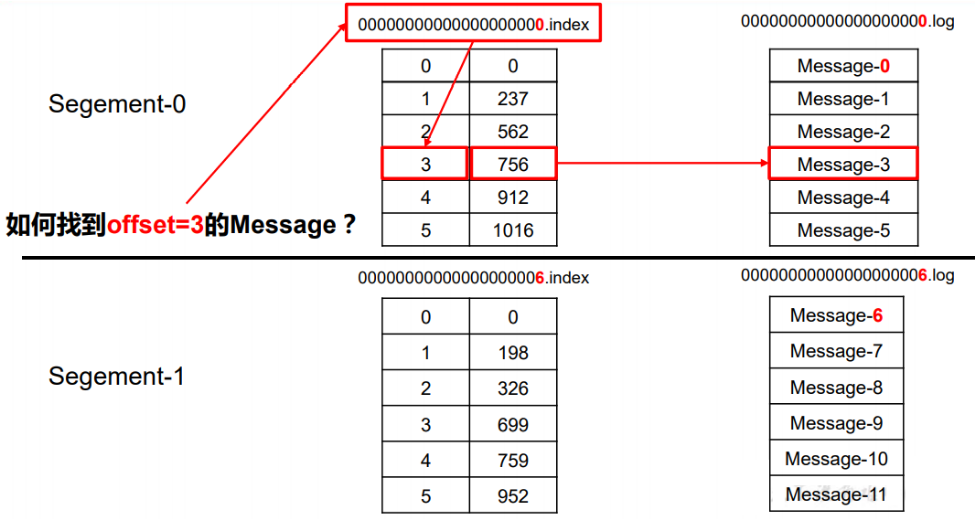
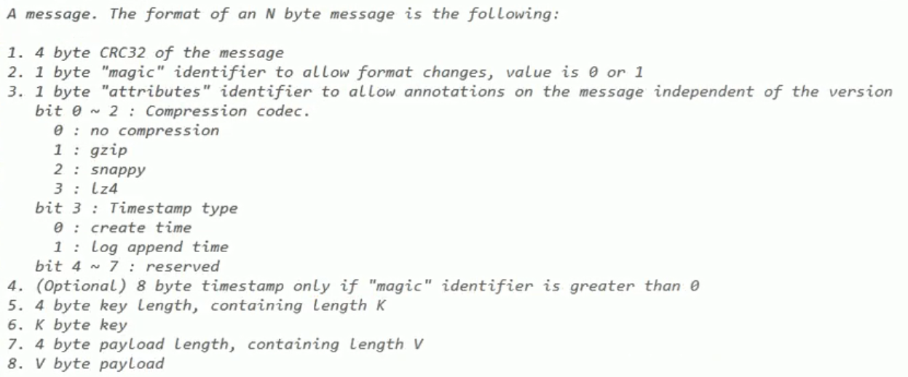
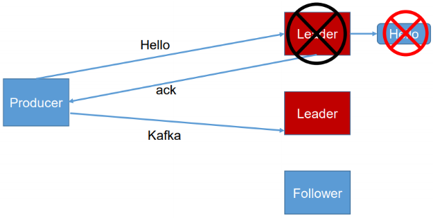
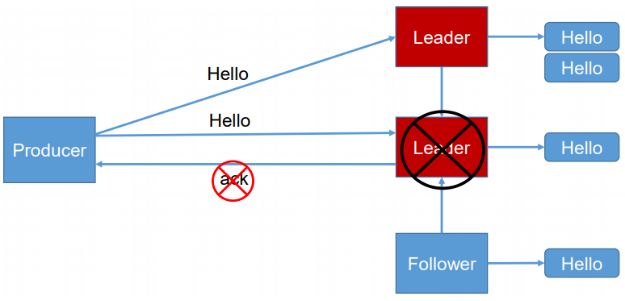
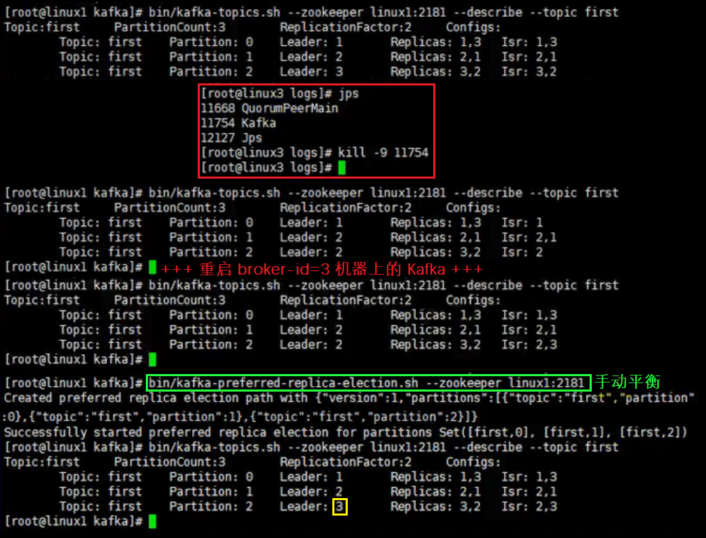
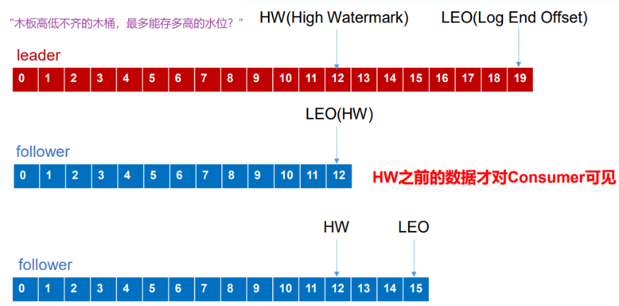
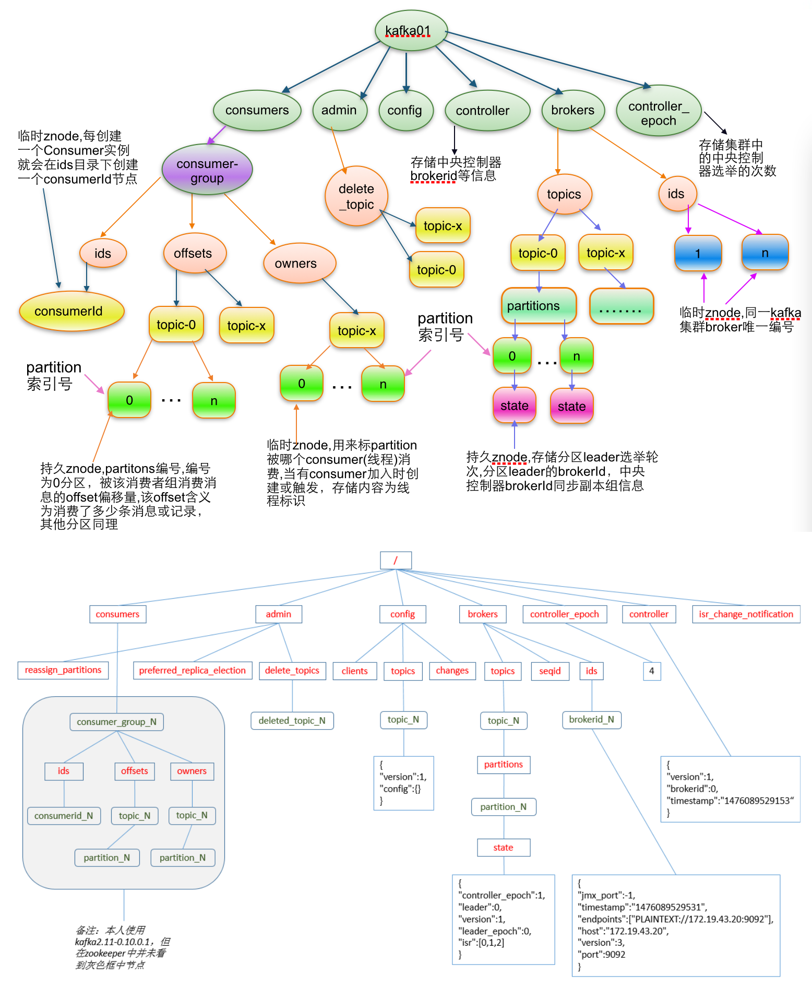
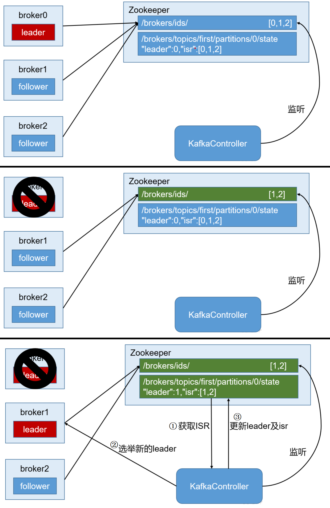

# 1.存储与读写

## 1.1 Kafka 存储机制



由于生产者生产的消息会不断追加到 log 文件末尾，为防止 log 文件过大导致数据定位效率低下，Kafka 采取了〈分片〉和〈索引〉机制，将每个 Partition 分为多个 Segment。

每个 Segment 对应两个文件 ——「.index」文件和「.log」文件。这些文件位于一个文件夹下，该文件夹的命名规则为：“Topic 名称 + 分区序号”。例如，first 这个 Topic 有 3 个分区，则其对应的文件夹为 first-0、first-1、first-2。


index 和 log 文件以当前 Segment 的第一条消息的 offset 命名。下图为 index 文件和 log 文件的结构示意图。



“.index” 文件存储大量的索引信息，“.log” 文件存储大量的数据，索引文件中的元数据指向对应数据文件中 Message 的物理偏移地址。

## 1.2 Message 数据结构



## 1.3 Message 删除策略

对于传统的 MQ 而言，一般会删除已经被消费的消息，而 Kafka 集群会保留所有的消息，无论其被消费与否。当然，因为磁盘限制，不可能永久保留所有数据（实际上也没必要），因此 Kafka 提供两种策略删除旧数据：① 基于时间、② Partition 文件大小。例如可以通过配置 `$KAFKA_HOME/config/server.properties`，让 Kafka 删除一周前的数据，也可在 Partition 文件超过 1GB 时删除旧数据，配置如下所示：

```
# The minimum age of a log file to be eligible for deletion
log.retention.hours=168
# The maximum size of a log segment file. When this size is reached a new log segment will be created.
log.segment.bytes=1073741824
# The interval at which log segments are checked to see if they can be deleted according to the retention policies
log.retention.check.interval.ms=300000
# If log.cleaner.enable=true is set the cleaner will be enabled and individual logs can then be marked for log compaction.
log.cleaner.enable=false
```

因为 Kafka 读取特定消息的时间复杂度为 O(1)，即与文件大小无关，所以这里删除过期文件与提高 Kafka 性能无关。选择怎样的删除策略只与磁盘以及具体的需求有关。

另外，Kafka 会为每一个 Consumer Group 保留一些 metadata 信息 —— 当前消费的消息的 position，也即 offset。这个 offset 由 Consumer 控制。正常情况下 Consumer 会在消费完一条消息后递增该 offset。当然，Consumer 也可将 offset 设成一个较小的值，重新消费一些消息。因为 offset 由 Consumer 控制，所以 Kafka Broker 是无状态的，它不需要标记哪些消息被哪些消费过，也不需要通过 Broker 去保证同一个 Consumer Group 只有一个 Consumer 能消费某一条消息，因此也就不需要锁机制，这也为 Kafka 的高吞吐率提供了有力保障。

## 1.4 Kafka 高效读写

**（1）顺序写磁盘**

Kafka 的 Producer 生产数据，要写入到 log 文件中。由于 Kafka 消息不能修改以及不会从文件中间删除保证了磁盘顺序读，所以写的过程是一直追加到文件末端，为顺序写。官网有数据表明，同样的磁盘，顺序写能到 600M/s，而随机写只有 100K/s。这与磁盘的机械机构有关，顺序写之所以快，是因为其省去了大量磁头寻址的时间。

**（2）零拷贝技术**


**（3）读写数据的批量 batch 处理以及压缩传输。**

# 2.Kafka 生产者

## 2.1 分区策略

### a. 分区原因

- 方便在集群中扩展，每个 Partition 可以通过调整以适应它所在的机器，而一个 Topic 又可以有多个 Partition 组成，因此整个集群就可以适应任意大小的数据了；
- 可以提高并发，因为可以以 Partition 为单位读写了。

### b. 消息路由

我们需要将 Producer 发送的数据封装成一个 ProducerRecord 对象。


- 指明 Partition 的情况下，直接将指明的值作为 Partition 值；
- 没有指明 Partition 值但有 key 的情况下，将 key 的 hash 值与 Topic 的 Partition 数进行取余得到 Partition 值；
- 既没有 Partition 值又没有 key 值的情况下，第一次调用时随机生成一个整数（后面每次调用在这个整数上自增），将这个值与 Topic 可用的 partition 总数取余得到 Partition 值，也就是常说的 Round-Robin 算法。

## 2.2 数据可靠性保证

### a. Replica

在 Kafka 在 0.8 以前的版本中，是没有 Replication 的，一旦某一个 Broker 宕机，则其上所有的 Partition 数据都不可被消费，这与 Kafka 数据持久性及 Delivery Guarantee 的设计目标相悖。同时 Producer 都不能再将数据存于这些 Partition 中。

由此可见，在没有 Replication 的情况下，一旦某机器宕机或者某个 Broker 停止工作则会造成整个系统的可用性降低。随着集群规模的增加，整个集群中出现该类异常的几率大大增加，因此对于生产系统而言 Replication 机制的引入非常重要。

而为保证 Producer 发送的数据，能可靠的发送到指定的 Topic，Topic 的每个 Partition 收到 Producer 发送的数据后，都需要向 Producer 发送 ack（acknowledgement 确认收到），如果 Producer 收到 ack，就会进行下一轮的发送，否则重新发送数据。

### b. ISR

何时发送 ACK 呢？


1.  同样为了容忍 n 台节点的故障，第一种方案需要 2n+1 个副本，而第二种方案只需要 n+1 个副本，而 Kafka 的每个分区都有大量的数据，第一种方案会造成大量数据的冗余；
2.  虽然第二种方案的网络延迟会比较高，但网络延迟对 Kafka 的影响较小。

基于如上分析，Kafka 采用了第二种方案，但设想以下情景：Leader 收到数据，所有 Follower 都开始同步数据，但有一个 Follower，因为某种故障，迟迟不能与 Leader 进行同步，那 Leader 就要一直等下去，直到它完成同步，才能发送 ACK。这个问题要怎么解决呢？往下看之前至少明确一点，Kafka 的复制机制肯定不是完全的同步复制。

> **ISR 是 Follower 集合的子集**

对于 Kafka 而言，定义一个 Broker 是否 “活着” 包含两个条件：① 它必须维护与 ZooKeeper 的 session（这个通过 ZooKeeper 的 Heartbeat 机制来实现）；② Follower 必须定时将 Leader 的消息复制过来。

**Leader 会跟踪与其保持同步的 Replica 列表，该列表称为 ISR（In Sync Replica）**。如果一个 Follower 超过一定时间（该值可在 `$KAFKA_HOME/config/server.properties` 中通过 `replica.lag.time.max.ms` 来配置，其默认值是 10000）未向 Leader 发送 fetch 请求，则 Leader 将把它从 ISR 中移除。

对于某些不太重要的数据，对数据的可靠性要求不是很高，能够容忍数据的少量丢失，所以没必要等 ISR 中的 Follower 全部接收成功。所以 Kafka 为用户提供了 3 种可靠性级别，用户根据对可靠性和延迟的要求进行权衡，选择以下的 `request.required.acks` 参数配置：

- 【0】Producer 不等待 Broker 的 ack，这一操作提供了一个最低的延迟，**Leader 一接收到还没写入磁盘就立即返回 ACK**；当 Broker 故障时有可能丢失数据；
- 【1】Producer 等待 Broker 的 ack，**Partition 的 Leader 落盘成功后返回 ACK**；如果在 Follower 同步成功之前 Leader 故障，那么将会丢失数据；  
  
- 【-1】Producer 等待 Broker 的 ack，**ISR 中的所有 Follower 都返回确认消息才返回 ACK**。但是如果在 Follower 同步完成后，Broker 发送 ACK 之前，Leader 发生故障，那么会造成数据重复。  
  

Kafka 的这种使用 ISR（In Sync Replica）的方式则很好的均衡了确保数据不丢失以及吞吐率，即一条消息只有被 ISR 里的所有 Follower 都从 Leader 复制过去才会被认为 ack。



### c. 相关配置

```
replica.lag.time.max.ms=10000
request.required.asks=-1
min.insync.replicas=1
```

第 3 个配置是干嘛用的呢？Kafka 当然是可以通过参数来限制 ISR 的最少数量的：`min.insync.replicas = N`，代表的语义是如果生产者 acks=-1，而在发送消息时 Broker 的 ISR 数量并没有达到 N，则 Broker 不能处理这条消息，需要直接给生产者报错。

```
def appendRecordsToLeader(records: MemoryRecords,
    isFromClient: Boolean, requiredAcks: Int = 0): LogAppendInfo = {

  val (info, leaderHWIncremented) = inReadLock(leaderIsrUpdateLock) {
    leaderReplicaIfLocal match {
    case Some(leaderReplica) =>
      val log = leaderReplica.log.get
      val minIsr = log.config.minInSyncReplicas
      val inSyncSize = inSyncReplicas.size

      // Avoid writing to leader if there are not enough insync replicas to make it safe
      if (inSyncSize < minIsr && requiredAcks == -1) {
        throw new NotEnoughReplicasException("Number of insync replicas "
            + "for partition %s is [%d], below required minimum [%d]"
                .format(topicPartition, inSyncSize, minIsr))
      }

      // code
  }

  // code
}
```

这样的 Fast-Fail 处理，在当 ISR 不足时，也能够避由于 Leader 宕机引起的消息丢失。

## 2.3 数据一致性保证

- 【LEO】 (日志末端位移，Log End Offset)指的是每个副本最大的 offset；
- 【HW】 (High Watermark)指的是消费者能见到的最大的 offset，ISR 队列中最小的 LEO。



**（1）Follower 故障**

Follower 发生故障后会被临时踢出 ISR，待该 Follower 恢复后，Follower 会读取本地磁盘记录的上次的 HW，并将 log 文件高于 HW 的部分截取掉，从 HW 开始向 Leader 进行同步。等该 Follower 的 LEO 大于等于该 Partition 的 HW，即 Follower 追上 Leader 之后，就可以重新加入 ISR 了。

**（2）Leader 故障**

Leader 发生故障之后，会从 ISR 中选出一个新的 Leader，之后，为保证多个副本之间的数据一致性，其余的 Follower 会先将各自的 log 文件高于 HW 的部分截掉，然后从新的 Leader 同步数据。

【注】

- Follower 可以批量的从 Leader 复制数据，这样极大的提高复制性能（批量写磁盘），极大减少了 Follower 与 Leader 的差距；
- LEO&HW 只能保证副本之间的数据一致性，并不能保证数据不丢失或者不重复。

## 2.4 消息投递保证

有这么几种可能的 Delivery Guarantee：

```
At Most once 　　消息可能会丢，但绝不会重复传输
At Least one 　  消息绝不会丢，但可能会重复传输
Exactly once 　  每条消息肯定会被传输一次且仅传输一次，很多时候这是用户所想要的。
```

**【Producer → Broker】**将服务器的 ACK 级别设置为 -1，可以保证 Producer 到 Broker 之间不会丢失数据，即 At Least Once 语义。相对的，将服务器 ACK 级别设置为 0，可以保证生产者每条消息只会被发送一次，即 At Most Once 语义。

但对于一些非常重要的信息，比如说交易数据，下游数据消费者要求数据既不重复也不丢失，即 Exactly Once 语义。在 0.11 版本以前的 Kafka，对此是无能为力的，只能保证数据不丢失，再在下游消费者对数据做全局去重。对于多个下游应用的情况，每个都需要单独做全局去重，这就对性能造成了很大影响。0.11 版本的 Kafka，引入了一项重大特性：**幂等性。**

所谓的〈幂等性〉就是指 Producer 不论向 Server 发送多少次重复数据，Server 端都只会持久化一条。〈幂等性〉结合 At Least Once 语义，就构成了 Kafka 的 Exactly Once 语义。即：

```
Exactly Once = At Least Once + 幂等性
```

要启用幂等性，只需要将 Producer 的参数中 `enable.idompotence` 设置为 true 即可（Kafka 会自动将 acks 属性设置为 -1）。

Kafka 的〈幂等性〉实现其实就是将原来下游需要做的去重放在了数据上游。开启〈幂等性〉的 Producer 在初始化的时候会被分配一个 PID，发往同一 Partition 的消息会附带 Sequence Number。而 Broker 端会对 `<PID, Partition, SeqNumber>` 做缓存，当具有相同主键的消息提交时，Broker 只会持久化一条。但是 PID 重启就会变化，同时不同的 Partition 也具有不同主键，所以〈幂等性〉无法保证跨分区跨会话的 Exactly Once。

**【Broker → Consumer】**接下来讨论的是消息从 Broker 到 Consumer 的 Delivery Guarantee 语义（仅针对 Kafka consumer high level API）。

Consumer 在从 Broker 读取消息后，可以选择 Ack，该操作会在 Zookeeper 中保存该 Consumer 在该 Partition 中读取的消息的 offset。该 Consumer 下一次再读该 Partition 时会从下一条开始读取。如未 Ack，下一次读取的开始位置会跟上一次 Ack 之后的开始位置相同。当然可以将 Consumer 设置为 auto-Ack，即 Consumer 一旦读到数据立即自动 Ack。（新版本保存在 Kafka 里面，不保存再 ZK 上）

如果只讨论这一读取消息的过程，那 Kafka 是确保了 Exactly once。但实际使用中应用程序并非在 Consumer 读取完数据就结束了，而是要进行进一步处理，而数据处理与 Ack 的顺序在很大程度上决定了消息从 Broker 和 Consumer 的 Delivery Guarantee Semantic。

## 2.5 小结

Producer 在发布消息到某个 Partition 时，先通过 ZooKeeper 找到该 Partition 的 Leader，然后无论该 Topic 的 Replication Factor 为多少，Producer 只将该消息**发送到该 Partition 的 Leader**。Leader 会将该消息写入其本地 Log。每个 Follower 都从 Leader 批量 Pull 数据。这种方式上，Follower 存储的数据顺序与 Leader 保持一致。Follower 在收到该消息并写入其 Log 后，向 Leader 发送 Ack。一旦 Leader 收到了 ISR 中的所有 Replica 的 Ack，该消息就被认为已经 Ack 了，Leader 将增加 HW 并且向 Producer 发送 Ack。

为了提高性能，每个 Follower 在接收到数据后就立马向 Leader 发送 Ack，而非等到数据写入 Log 中。因此，对于已经 Ack 的消息，Kafka 只能保证它被存于多个 Replica 的内存中，而不能保证它们被持久化到磁盘中，也就不能完全保证异常发生后该条消息一定能被 Consumer 消费。

Consumer 读消息**也是从 Leader 读取**，**只有 HW 前的消息才会暴露给 Consumer。**

Kafka Replication 的数据流如下图所示：


Producer 写入消息序列图如下所示：


1. Producer 先从 Zookeeper 的 "/brokers/.../state" 节点找到该 Partition 的 Leader；

2. Producer 将消息发送给该 Leader；

3. Leader 将消息写入本地 log；

4. Followers 从 Leader Pull 消息，写入本地 log 后向 Leader 发送 Ack；

5. Leader 收到所有 ISR 中的 Replica 的 Ack 后，增加 HW 并向 Producer 发送 Ack。

# 6. Kafka 消费者

## 3.1 消费方式

> Consumer 采用 Pull（拉）模式从 Broker 中读取数据。

Push（推）模式很难适应消费速率不同的消费者，因为消息发送速率是由 Broker 决定的。它的目标是尽可能以最快速度传递消息，**但是这样很容易造成 Consumer 来不及处理消息**，**典型的表现就是拒绝服务以及网络拥塞**。而 Pull 模式则可以根据 Consumer 的消费能力以适当的速率消费消息。

Pull 模式不足之处是，如果 Kafka 没有数据，消费者可能会陷入循环中，一直返回空数据。针对这一点，Kafka 的消费者在消费数据时会传入一个时长参数 timeout，如果当前没有数据可供消费，Consumer 会等待一段时间之后再返回，这段时长即为 timeout。

## 3.2 CG 的消费策略

消费者数目跟分区数目的关系：

- 一个消费者可以消费一个到全部分区数据；
- 分组消费，同一个分组内所有消费者消费一份完整的数据，此时一个分区数据只能被一个消费者消费，而一个消费者可以消费多个分区数据；
- 同一个消费组内，消费者数目大于分区数目后，消费者会有空余 = 分区数 - 消费者数。

当一个 Group 中， 有 Consumer 加入或者离开时会触发 Partitions 再平衡，`partition.assignment.strategy` 决定了 Partition 分配给消费者的分配策略。在 0.10.x 版本中，Kafka 提供两种分配策略（RangeAssignor、RoundRobinAssignor），0.11.x 版本新增策略（StickyAssignor）。

### a. RangeAssignor

RangeAssignor 以 Topic 为单位，以 “数据顺序” 排列可用分区，以 “字典顺序” 排列消费者，将 Topic 分区数除以消费者总数，以确定分配给每个消费者的分区数；如果没有平均分配，那么前几个消费者将拥有一个额外的分区。实现代码：

```
for (String memberId : subscriptions.keySet())
  assignment.put(memberId, new ArrayList<TopicPartition>());

  for (Map.Entry<String, List<String>> topicEntry : consumersPerTopic.entrySet()) {
    String topic = topicEntry.getKey();
    List<String> consumersForTopic = topicEntry.getValue();

    Integer numPartitionsForTopic = partitionsPerTopic.get(topic);
    if (numPartitionsForTopic == null) continue;

    Collections.sort(consumersForTopic);

    // Topic 分区数除以消费者总数
    int numPartitionsPerConsumer = numPartitionsForTopic / consumersForTopic.size();
    // 计算额外分区
    int consumersWithExtraPartition = numPartitionsForTopic % consumersForTopic.size();

    List<TopicPartition> partitions = AbstractPartitionAssignor.partitions(topic, numPartitionsForTopic);
    for (int i = 0, n = consumersForTopic.size(); i < n; i++) {
      int start = numPartitionsPerConsumer * i + Math.min(i, consumersWithExtraPartition);
      int length = numPartitionsPerConsumer + (i + 1 > consumersWithExtraPartition ? 0 : 1);
      assignment.get(consumersForTopic.get(i)).addAll(partitions.subList(start, start + length));
    }
  }
}
```

【步骤】

1.  将目标 Topic 下的所有 Partirtion 排序，存于 TP；
2.  对某 Consumer Group 下所有 Consumer 按照名字根据字典排序，存于 CG，第 i 个 Consumer 记为 Ci；
3.  N = size(TP) / size(CG)
4.  R = size(TP) % size(CG)
5.  Ci 获取的分区起始位置 = `N*i + min(i, R)`
6.  Ci 获取的分区总数 = `N + (i+1>R ? 0 : 1)`

【举例】

- 比如有两个 Topic(topic1，topic2) ，每个 Topic 都有 3 个分区：

  ```
  topic1: topic1p0, topic1p1, topic1p2
  topic2: topic2p0, topic2p1, topic2p2
  ```

- 一个消费组 consumer_group1: {consumer1，consumer2} 两个消费者，使用 RangeAssignor 策略可能会得到如下的分配：

  ```
  consumer1: [topic1p0, topic1p1, topic2p0, topic2p1]
  consumer2: [topic1p2, topic2p2]
  ```

- 如果此时消费组 consumer_group1 有新的消费者 consumer3 加入，使用 RangeAssignor 策略可能会得到如下的分配：

  ```
  consumer1: [topic1p0, topic2p0]
  consumer2: [topic1p2, topic2p2]
  consumer3: [topic1p1, topic2p1]
  ```

### b. RoundRobinAssignor

RoundRobinAssignor 是 Kafka 默认策略，对所有分区和所有消费者循环分配，分区更均衡。

```
Map<String, List<TopicPartition>> assignment = new HashMap<>();
for (String memberId : subscriptions.keySet())
  assignment.put(memberId, new ArrayList<TopicPartition>());

CircularIterator<String> assigner = new CircularIterator<>(Utils.sorted(subscriptions.keySet()));
for (TopicPartition partition : allPartitionsSorted(partitionsPerTopic, subscriptions)) {
  final String topic = partition.topic();
  while (!subscriptions.get(assigner.peek()).topics().contains(topic))
    assigner.next();
  assignment.get(assigner.next()).add(partition);
}
```

这种分配策略是针对消费者消费的所有 Topic 的所有分区进行分配。当有新的消费者加入或者有消费者退出，就会触发 rebalance。这种策略的具体分配步骤：

1.  对所有 Topic 的所有分区按照 Topic+Partition → String 之后的 hash 进行排序；
2.  对消费者按字典进行排序
3.  然后轮训的方式将分区分配给消费者

继续以上例 Topic 和消费组为例，RoundRobinAssignor 策略可能会得到如下的分配：

```
consumer1: [topic1p0, topic1p1, topic2p2]
consumer2: [topic2p0, topic2p1, topic1p2]
```

### c. StickyAssignor

StickyAssignor 策略是最复杂且是 0.11.x 版本出现的新策略，该策略主要作用：

- 使 Topic 分区分配尽可能均匀的分配给消费者；
- 当某个消费者终止触发重新分配时，尽可能保留现有分配，将已经终止的消费者所分配的分区移动到另一个消费者，避免全部分区重新平衡，节省开销。

这个策略自 0.11.x 版本出现后，一直到新版本有不同 bug 被发现，低版本慎用。

### d. 小结

Kafka 提供三种分配策略（RangeAssignor、RoundRobinAssignor、StickyAssignor），其中 StickyAssignor 策略是 0.11.x 版本新增的，每种策略不尽相同，RangeAssignor 策略以 Topic 为单位，以数据顺序排列可用分区，以字典顺序排列消费者计算分配；RoundRobinAssignor 对所有分区和所有消费者循环均匀分配；但这两种分配策略当有消费者终止或加入时均会触发消费组再平衡；StickyAssignor 策略当某个消费者终止时，尽可能保留现有分配，将已经终止的消费者所分配的分区移动到另一个消费者，避免全部分区重新平衡，节省开销；对于 Topic 分区数较多、数量较大使用 StickyAssignor 策略有较大优势。

## 3.3 offset 的维护

Kafka 0.9 版本之前，Consumer 默认将 offset 保存在 Zookeeper 中，从 0.9 版本开始，Consumer 默认将 offset 保存在 Kafka 一个内置的 topic（`__consumer_offsets`）中。


（1）consumer.properties：`exclude.internal.topics=false`

Kafka 中有两个内部的主题：`__consumer_offsets` 和 `__transaction_state`。`exclude.internal.topics` 用来指定 Kafka 中的内部主题是否可以向消费者公开，默认值为 true。如果设置为 true，那么只能使用 `subscribe(Collection)` 的方式而不能使用 `subscribe(Pattern)` 的方式来订阅内部主题，设置为 false 则没有这个限制。

（2）读取 offset


# 4.Controller Broker

## 4.1 ZooKeeper 作用



- admin
  - 该目录下 znode 只有在有相关操作时才会存在，操作结束时会将其删除；
  - /admin/reassign_partitions 用于将一些 Partition 分配到不同的 Broker 集合上。对于每个待重新分配的 Partition，Kafka 会在该 znode 上存储其所有的 Replica 和相应的 Broker-id。该 znode 由管理进程创建并且一旦重新分配成功它将会被自动移除。
- broker
  - 即 /brokers/ids/[brokerId]，存储 “活着” 的 Broker 信息；
  - Topic 注册信息（/brokers/topics/[topic]），存储该 topic 的所有 Partition 的所有 Replica 所在的 Broker-id，第一个 Replica 即为 Preferred Replica，对一个给定的 Partition，它在同一个 Broker 上最多只有一个 Replica，因此 Broker-id 可作为 Replica-id。
- controller
  - /controller → int (broker id of the controller) 存储当前 controller 的信息；
  - /controller_epoch → int (epoch) 直接以整数形式存储 controller epoch，而非像其它 znode 一样以 JSON 字符串形式存储。

## 4.2 Controller 简述

在 Kafka 集群中会有一个或者多个 Broker，其中有一个 Broker 会被选举为「控制器（Kafka Controller）」，它负责管理整个集群中所有分区和副本的状态。当某个分区的 Leader 副本出现故障时，由 Controller 负责为该分区选举新的 Leader 副本。当检测到某个分区的 ISR 集合发生变化时，由 Controller 负责通知所有 Broker 更新其元数据信息。当使用 kafka-topics.sh 脚本为某个 Topic 增加分区数量时，同样还是由 Controller 负责分区的重新分配。

Kafka 中的 Controller Election 的工作依赖于 Zookeeper，成功竞选为控制器的 Broker 会在 Zookeeper 中创建 /controller 这个临时（EPHEMERAL）节点，此临时节点的内容参考如下：

```
{"version":1, "brokerid":0, "timestamp":"1529210278988"}
```

其中 version 在目前版本中固定为 1，brokerid 表示称为 Controller Broker 的 id 编号，timestamp 表示竞选称为控制器时的时间戳。

在任意时刻，集群中有且**仅有一个控制器**。每个 Broker 启动的时候会去尝试去读取 /controller 节点的 brokerid 的值，如果读取到 brokerid 的值不为 -1，则表示已经有其它 Broker 节点成功竞选为控制器，所以当前 Broker 就会放弃竞选；如果 Zookeeper 中不存在 /controller 这个节点，或者这个节点中的数据异常，那么就会尝试去创建 /controller 这个节点，当前 Broker 去创建节点的时候，也有可能其他 Broker 同时去尝试创建这个节点，只有创建成功的那个 Broker 才会成为控制器，而创建失败的 Broker 则表示竞选失败。每个 Broker 都会在内存中保存当前 Controller 的 brokerid 值，这个值可以标识为 activeControllerId。

Zookeeper 中还有一个与控制器有关的 /controller_epoch 节点，这个节点是持久（PERSISTENT）节点，节点中存放的是一个整型的 controller_epoch 值。controller_epoch 用于记录控制器发生变更的次数，即记录当前的控制器是第几代控制器，我们也可以称之为 “控制器的纪元”。controller_epoch 的初始值为 1，即集群中第一个控制器的纪元为 1，当 Controller 发生变更时，每选出一个新的 Controller 就将该字段值加 1。**每个和 Controller 交互的请求都会携带上 controller_epoch 这个字段**，如果请求的 controller_epoch 值小于内存中的 controller_epoch 值，则认为这个请求是向已经过期的 Controller 所发送的请求，那么这个请求会被认定为无效的请求。如果请求的 controller_epoch 值大于内存中的 controller_epoch 值，那么则说明已经有新的 Controller 当选了。由此可见，Kafka 通过 controller_epoch 来保证 Controller 的唯一性，进而保证相关操作的一致性。

具备控制器身份的 Broker 需要比其他普通的 Broker 多一份职责，具体细节如下：


Controller 在选举成功之后会读取 Zookeeper 中各个节点的数据来初始化上下文信息（Controller Context），并且也需要管理这些上下文信息，比如为某个 Topic 增加了若干个分区，控制器在负责创建这些分区的同时也要更新上下文信息，并且也需要将这些变更信息同步到其他普通的 Broker 节点中。不管是监听器触发的事件，还是定时任务触发的事件，亦或者是其他事件（比如 ControlledShutdown）都会读取或者更新控制器中的上下文信息，那么这样就会涉及到多线程间的同步，如果单纯的使用锁机制来实现，那么整体的性能也会大打折扣。针对这一现象，Kafka 的 Controller 使用〈单线程基于事件队列的模型〉，将每个事件都做一层封装，然后按照事件发生的先后顺序暂存到 LinkedBlockingQueue 中，然后使用一个专用的线程（ControllerEventThread）按照 FIFO（First Input First Output，先入先出）的原则顺序处理各个事件，这样可以不需要锁机制就可以在多线程间维护线程安全。


## 4.3 Leader 选举

引入 Replication 之后，同一个 Partition 可能会有多个 Replica，而这时需要在这些 Replication 之间选出一个 Leader，Producer 和 Consumer 只与这个 Leader 交互，其它 Replica 作为 Follower 从 Leader 中复制数据。

因为需要保证同一个 Partition 的多个 Replica 之间的数据一致性（其中一个宕机后其它 Replica 必须要能继续服务并且即不能造成数据重复也不能造成数据丢失）。如果没有一个 Leader，所有 Replica 都可同时读 / 写数据，那就需要保证多个 Replica 之间互相（N×N 条通路）同步数据，数据的一致性和有序性非常难保证，大大增加了 Replication 实现的复杂性，同时也增加了出现异常的几率。而引入 Leader 后，只有 Leader 负责数据读写，Follower 只从 Leader 顺序 Fetch 数据（N 条通路），系统更加简单且高效。

**所有 Partition 的 Leader 选举都由 Controller 决定**。Controller 会将 Leader 的改变直接通过 RPC 的方式（比 ZooKeeper Queue 的方式更高效）通知需为此作为响应的 Broker。



## 4.4 All Replica 不工作

在 ISR 中至少有一个 Follower 时，Kafka 可以确保已经 Ack 的数据不丢失，但如果某个 Partition 的所有 Replica 都宕机了，就无法保证数据不丢失了。这种情况下有两种可行的方案：

1.  等待 ISR 中的任一个 Replica“活” 过来，并且选它作为 Leader；
2.  选择第一个 “活” 过来的 Replica（不一定是 ISR 中的）作为 Leader；

这就需要在〈可用性〉和〈一致性〉当中作出一个简单的折衷。如果一定要等待 ISR 中的 Replica“活”过来，那不可用的时间就可能会相对较长。而且如果 ISR 中的所有 Replica 都无法 “活” 过来了，或者数据都丢失了，这个 Partition 将永远不可用。选择第一个 “活” 过来的 Replica 作为 Leader，而这个 Replica 不是 ISR 中的 Replica，那即使它并不保证已经包含了所有已 Ack 的消息，它也会成为 Leader 而作为 Consumer 的数据源（所有读写都由 Leader 完成）。Kafka 0.8.\* 使用了第二种方式。根据 Kafka 的文档，在以后的版本中，Kafka 支持用户通过配置选择这两种方式中的一种，从而根据不同的使用场景选择〈高可用性〉还是〈强一致性〉。

# 5.常见流程的时序图

## 5.1 Topic create/delete


1.  Controller 在 ZooKeeper 的 /brokers/topics 节点上注册 watcher，当 Topic 被创建，则 Controller 会通过 watch 得到该 Topic 的 Partition/Replica 分配；
2.  Controller 从 /brokers/ids 读取当前所有可用的 Broker 列表，对于 set_p 中的每一个 Partition：
    1.  ① 从分配给该 Partition 的所有 Replica（称为 AR）中任选一个可用的 Broker 作为新的 Leader，并将 AR 设置为新的 ISR；
    2.  ② 将新的 Leader 和 ISR 写入 /brokers/topics/[topic]/partitions/[partition]/state；
3.  Controller 通过 RPC 向相关的 Broker 发送 LeaderAndISRRequest。


1.  Controller 在 ZooKeeper 的 /brokers/topics 节点上注册 watcher，当 Topic 被删除，则 Controller 会通过 watch 得到该 Topic 的 Partition/Replica 分配；
2.  若 `delete.topic.enable=false`，结束；否则 Controller 注册在 /admin/delete_topics 上的 watch 被 fire，Controller 通过回调向对应的 Broker 发送 StopReplicaRequest。

## 5.2 Broker failover


1.  Controller 在 ZooKeeper 的 /brokers/ids/[brokerId] 节点注册 Watcher，当 Broker 宕机时 ZooKeeper 会 fire watch；
2.  Controller 从 /brokers/ids 节点读取可用 Broker；
3.  Controller 决定 set_p，该集合包含宕机 Broker 上的所有 Partition；
4.  对 set_p 中的每一个 Partition：
    1.  ① 从 /brokers/topics/[topic]/partitions/[partition]/state 节点读取 ISR；
    2.  ② 决定新 Leader；
    3.  ③ 将新 Leader、ISR、controller_epoch 和 leader_epoch 等信息写入 state 节点；
5.  通过 RPC 向相关 Broker 发送 LeaderAndISRRequest 命令。

## 5.3 Controller failover

当 Controller 宕机时会触发 Controller failover。每个 Broker 都会在 ZooKeeper 的 "/controller" 节点**注册 watcher**，当 Controller 宕机时 ZooKeeper 中的临时节点消失，所有存活的 Broker 收到 fire 的通知，每个 Broker 都尝试创建新的 Controller path，只有一个竞选成功并当选为 Controller。

当新的 Controller 当选时会触发 `KafkaController.onControllerFailover()` 方法，在该方法中完成如下操作：


