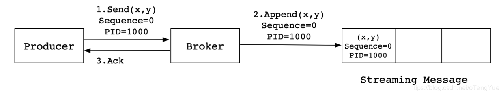
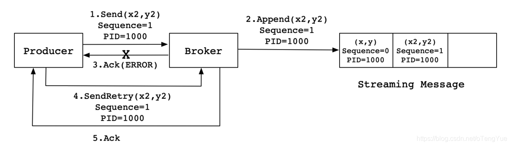
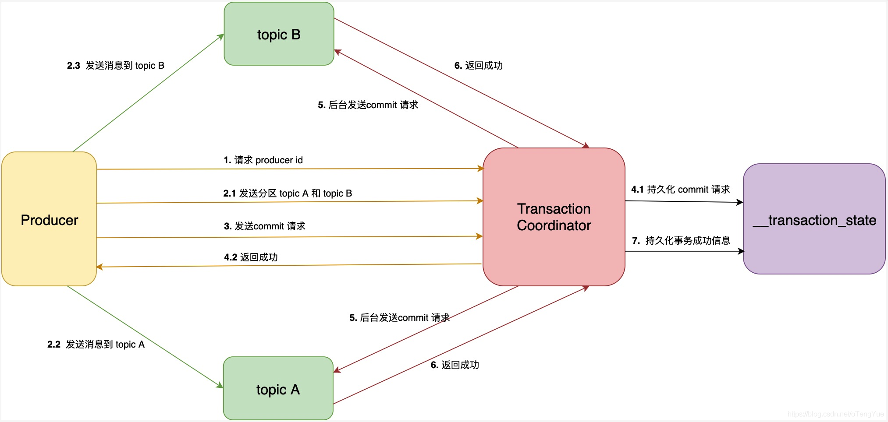
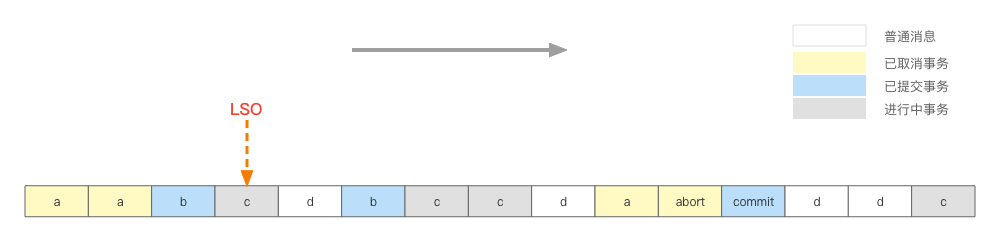

- 至少一次（At Least Once）= ACK 级别设置为-1 + 分区副本大于等于 2 + ISR 里应答的最小副本数量大于等于 2
- 最多一次（At Most Once）= ACK 级别设置为 0
- 精确一次（Exactly Once）：对于一些非常重要的信息，比如和钱相关的数据，要求数据既不能重复也不丢失。

## 幂等性

幂等性是指发送同样的请求，对系统资源的影响是一致的。结合 Kafka Producer，是指在多次发送同样的消息，Kafka 做到发送消息的不丢失和不重复。

### Kafka 为啥需要幂等性？

在使用 Kafka 时，需要确保 Exactly-Once 语义。分布式系统中，一些不可控因素有很多，比如网络、OOM、FullGC 等。在 Kafka Broker 确认 Ack 前，有可能出现网络异常、FullGC、OOM 等问题时导致 Ack 超时，Producer 会进行重复发送。注，在未达到最大重试次数前，会自动重试（非应用程序代码写的重试）。

### Kafka 的幂等性是如何实现的？

Producer 的幂等性指的是当发送同一条消息时，数据在 Server 端只会被持久化一次，数据不丟不重，Kafka 为了实现幂等性，在 0.11.0.0 之后加入的该新功能，它在底层设计架构中引入了 ProducerID 和 SequenceNumber。那这两个概念的用途是什么呢？

- **PID**：ProducerID，每个生产者启动时，Kafka 都会给它分配一个 ID，ProducerID 是生产者的唯一标识，需要注意的是，Kafka 重启也会重新分配 PID
- SequenceNumber ：对于每个 ProducerID，Producer 发送数据的每个 Topic 和 Partition 都对应一个从 0 开始单调递增的 SequenceNumber 值。

### 幂等性引入之后解决了什么问题？

面对这样的问题，Kafka 引入了幂等性。那么幂等性是如何解决这类重复发送消息的问题的呢？下面我们可以先来看看流程图：



同样，这是一种理想状态下的发送流程。实际情况下，会有很多不确定的因素，比如 Broker 在发送 Ack 信号给 Producer 时出现网络异常，导致发送失败。异常情况如下图所示：



当 Producer 发送消息 (x2,y2) 给 Broker 时，Broker 接收到消息并将其追加到消息流中。此时，Broker 返回 Ack 信号给 Producer 时，发生异常导致 Producer 接收 Ack 信号失败。对于 Producer 来说，会触发重试机制，将消息 (x2,y2) 再次发送，但是，由于引入了幂等性，在每条消息中附带了 PID（ProducerID）和 SequenceNumber。相同的 PID 和 SequenceNumber 发送给 Broker，而之前 **Broker 缓存过之前发送的相同的消息**，那么在消息流中的消息就只有一条(x2,y2)，不会出现重复发送的情况。

### 幂等性的限制条件

单独只使用 Producer 的幂等性是存在一些限制条件的：

- 只能保证 Producer 在单个会话内不丟不重 ，如果 Producer 出现意外挂掉再重启是无法保证的（幂等性情况下，是无法获取之前的状态信息，因此是无法做到跨会话级别的不丢不重）;
- 幂等性不能跨多个 Topic-Partition，只能保证单个 partition 内的幂等性 ，当涉及多个 Topic-Partition 时，这中间的状态并没有同步。

> 如果需要跨会话、跨多个 topic-partition 的情况，需要使用 **Kafka 的事务性来实现**。这种幂等性只是保证了再生产端实现了幂等性，在实际场景中往往需要在消息者端实现幂等性，可以最大程度避免重复消费。

### 幂等性的实现原理

每个新的 Producer 在初始化的时候会被分配一个唯一的 PID（凡是开启幂等性都是需要生成 PID，只不过未开启事务的 PID 可以在任意 broker 生成，而开启事务只能在 TransactionCoordinator 节点生成），该 PID 对用户完全透明而不会暴露给用户。Broker 端也会为每个 <PID, Topic, Partition> 维护一个序号，并且每次 Commit 一条消息时将其对应序号递增。对于接收的每条消息，如果其消息序号比 Broker 维护的序号（即最后一次 Commit 的消息的序号）大一，则 Broker 会接受它，否则将其丢弃：

- 如果消息序号比 Broker 维护的序号大于 1 以上，说明中间有数据尚未写入，也即乱序，此时 Broker 拒绝该消息，Producer 抛出 InvalidSequenceNumber
- 如果消息序号小于等于 Broker 维护的序号，说明该消息已被保存，即为重复消息，Broker 直接丢弃该消息，Producer 抛出 DuplicateSequenceNumber

上述设计解决了 0.11.0 之前版本中的两个问题：

- Broker 保存消息后，发送 ACK 前宕机，Producer 认为消息未发送成功并重试，造成数据重复
- 前一条消息发送失败，后一条消息发送成功，前一条消息重试后成功，造成数据乱序

> producer_id 是从 Kafka 服务端请求获取的（通过 ProducerIdManager 的 generateProducerId() 方法产生，维护在 zk 中的 /latest_producer_id_block 节点），消息序列号是 Producer 端生成的，初始值为 0，之后自增加 1，每个分区都有独立的序列号。这里需要说明下，Kafka 发送消息都是以 batch 的格式发送，batch 包含了多条消息。所以 Producer 发送消息 batch 的时候，只会设置该 batch 的第一个消息的序列号，后面消息的序列号可以根据第一个消息的序列号计算出来。

#### 如何使用幂等性

开启参数 **enable.idempotence** 默认为 true，false 关闭。

## 事务简介

Kafka 的 Exactly Once 幂等性只能保证单次会话内的精准一次性，不能解决跨会话和跨分区的问题；

Kafka 0.11 版本开始引入了事务支持。事务保证 Kafka 在 Exactly Once 语义的基础上，Producer 和 Consumer 可以跨分区和会话，要么全部成功，要么全部失败。

Kafka 的事务特性本质上是支持了 Kafka 跨分区和 Topic 的原子写操作。在同一个事务中的消息要么同时写入成功，要么同时写入失败。我们知道，Kafka 中的 Offset 信息存储在一个名为`__consumed_offsets`的 Topic 中，因此`read-process-write`模式，除了向目标 Topic 写入消息，还会向`__consumed_offsets`中写入已经消费的 Offsets 数据。因此`read-process-write`本质上就是跨分区和 Topic 的原子写操作。

**Kafka 的事务特性就是要确保跨分区的多个写操作的原子性。**

具体的场景包括：

1.  Producer 多次发送消息可以封装成一个原子性操作，即同时成功，或者同时失败；(可以是跨多分区的写入)
2.  Consumer-Transform-Producer 模式下，因为消费者提交偏移量出现问题，导致在重复消费消息时，生产者重复生产消息。需要将这个模式下消费者提交偏移量操作和生成者一系列生成消息的操作封装成一个原子操作。

多分区原子性写入保证 producer 发送到多个分区的一批消息要么都成功要么都失败 => 所谓的失败是指对事务型 consumer 不可见；而 consumer 端读取事务消息主要由 consumer 端隔离级别体现，它类似于数据库中隔离级别的概念，目前只是简单分为：read_uncommitted 和 read_committed，其中后者指的是 consumer 只能读取已成功提交事务的消息（当然也包括非事务型 producer 生产的消息）。

> 当事务中仅仅存在 Consumer 消费消息的操作时，它和 Consumer 手动提交 Offset 并没有区别。因此单纯的消费消息并不是 Kafka 引入事务机制的原因，单纯的消费消息也没有必要存在于一个事务中。

## Kafka Produce Api For Transactions

```
/**
     * 初始化事务
     */
    public void initTransactions();

    /**
     * 开启事务
     */
    public void beginTransaction() throws ProducerFencedException ;

    /**
     * 在事务内提交已经消费的偏移量
     */
    public void sendOffsetsToTransaction(Map<TopicPartition, OffsetAndMetadata> offsets,
                                         String consumerGroupId) throws ProducerFencedException ;

    /**
     * 提交事务
     */
    public void commitTransaction() throws ProducerFencedException;

    /**
     * 丢弃事务
     */
    public void abortTransaction() throws ProducerFencedException ;
```

### Write-process-wirte

```
KafkaProducer producer = createKafkaProducer(
  "bootstrap.servers", "localhost:9092",
  "transactional.id”, “my-transactional-id");

producer.initTransactions();
producer.beginTransaction();
producer.send("outputTopic", "message1");
producer.send("outputTopic", "message2");
producer.commitTransaction();
```

### Read-process-Write

```
KafkaProducer producer = createKafkaProducer(
  "bootstrap.servers", "localhost:9092",
  "transactional.id", "my-transactional-id");

KafkaConsumer consumer = createKafkaConsumer(
  "bootstrap.servers", "localhost:9092",
  "group.id", "my-group-id",
  "isolation.level", "read_committed");

consumer.subscribe(singleton("inputTopic"));

producer.initTransactions();

while (true) {
  ConsumerRecords records = consumer.poll(Long.MAX_VALUE);
  producer.beginTransaction();
  for (ConsumerRecord record : records)
    producer.send(producerRecord(“outputTopic”, record));
  producer.sendOffsetsToTransaction(currentOffsets(consumer), group);
  producer.commitTransaction();
}
```

## 开启事务配置

对于 Producer，需要设置`transactional.id`属性，这个属性的作用下文会提到。设置了`transactional.id`属性后，`enable.idempotence`属性会自动设置为 true。

对于 Consumer，需要设置`isolation.level = read_committed`，这样 Consumer 只会读取已经提交了事务的消息。另外，需要设置`enable.auto.commit = false`来关闭自动提交 Offset 功能。

## 事务保证

### 事务恢复的保证

为了实现有状态的应用也可以保证重启后从断点处继续处理，也即事务恢复。应用程序必须提供一个稳定的（重启后不变）唯一的 ID，也即 Transaction ID。Transactin ID 与 PID 可能一一对应。区别在于 Transaction ID 由用户提供，而 PID 是内部的实现对用户透明。

另外，为了保证新的 Producer 启动后，旧的具有相同 Transaction ID 的 Producer 即失效，每次 Producer 通过 Transaction ID 拿到 PID 的同时，还会获取一个单调递增的 epoch。由于旧的 Producer 的 epoch 比新 Producer 的 epoch 小，Kafka 可以很容易识别出该 Producer 是老的 Producer 并拒绝其请求。

有了 Transaction ID 和 epoch 后，Kafka 可保证：

- 跨 Session 的数据幂等发送。当具有相同 Transaction ID 的新的 Producer 实例被创建且工作时，旧的且拥有相同 Transaction ID 的 Producer 将不再工作。
- 跨 Session 的事务恢复。如果某个应用实例宕机，新的实例可以保证任何未完成的旧的事务要么 Commit 要么 Abort，使得新实例从一个正常状态开始工作。

### 事务原子性的保证

事务原子性是指 Producer 将多条消息作为一个事务批量发送，要么全部成功要么全部失败。 引入了一个服务器端的模块，名为 Transaction Coordinator，用于管理 Producer 发送的消息的事务性。

该 Transaction Coordinator 维护 Transaction Log，该 log 存于一个内部的 Topic 内。由于 Topic 数据具有持久性，因此事务的状态也具有持久性。

Producer 并不直接读写 Transaction Log，它与 Transaction Coordinator 通信，然后由 Transaction Coordinator 将该事务的状态插入相应的 Transaction Log。

Transaction Log 的设计与 Offset Log 用于保存 Consumer 的 Offset 类似。

### 事务中 Offset 的提交保证

在 Kafka Stream 应用中同时包含 Consumer 和 Producer（即 Consumer-Transform-Producer），前者负责从 Kafka 中获取消息，后者负责将处理完的数据写回 Kafka 的其它 Topic 中。

为了实现该场景下的事务的原子性，Kafka 需要保证对 Consumer Offset 的 Commit 与 Producer 对发送消息的 Commit 包含在同一个事务中。否则，如果在二者 Commit 中间发生异常，根据二者 Commit 的顺序可能会造成数据丢失和数据重复：

- 如果先 Commit Producer 发送数据的事务再 Commit Consumer 的 Offset，即 At Least Once 语义，可能造成数据重复。
- 如果先 Commit Consumer 的 Offset，再 Commit Producer 数据发送事务，即 At Most Once 语义，可能造成数据丢失。

### 用于事务特性的控制型消息

为了区分写入 Partition 的消息被 Commit 还是 Abort，Kafka 引入了一种特殊类型的消息，即 Control Message。该类消息的 Value 内不包含任何应用相关的数据，并且不会暴露给应用程序。它只用于 Broker 与 Client 间的内部通信。

对于 Producer 端事务，Kafka 以 Control Message 的形式引入一系列的 Transaction Marker。Consumer 即可通过该标记判定对应的消息被 Commit 了还是 Abort 了，然后结合该 Consumer 配置的隔离级别决定是否应该将该消息返回给应用程序。

> Kafka 事务的回滚，并不是删除已写入的数据，而是将写入数据的事务标记为 Rollback/Abort 从而在读数据时过滤该数据。

## 事务流程

### 事务原理流程图



上图中的 Transaction Coordinator 运行在 Kafka 服务端，下面简称 TC 服务。  
\_\_transaction_state 是 TC 服务持久化事务信息的 topic 名称，下面简称事务 topic。  
Producer 向 TC 服务发送的 commit 消息，下面简称事务提交消息。  
TC 服务向分区发送的消息，下面简称事务结果消息。

## Kafka 事务原理

Kafka 为了支持事务特性，引入一个新的组件：Transaction Coordinator。主要负责分配 pid，记录事务状态等操作。下面时 Kafka 开启一个事务到提交一个事务的流程图：


1 FindCoordinatorRequest（对应图的 1）

生产者把请求递交给任意一个 Broker，Broker 收到请求后，通过请求附带的事务 ID 与上文的公式，计算出 `__transaction_state` 的分区 ID，而其对应的主副本 Broker 即是负责当前事务的 Transaction Coordinator。

### 2 InitProducerIdRequest（对应 2 与 2a）

用户调用 KafkaProducer#initTransactions 初始化事务时，就会产生附带事务 ID 的 InitProducerIdRequest 请求（但，如果当前生产者还不知道 Transaction Coordinator 地址，会先发起上面说的 FindCoordinatorRequest 请求），收到请求后的 Transaction Coordinator 分配出生产者 ID，或抛出 ProducerFencedException 异常，即当前已存在新的相同事务 ID 的生产者，告知其停止运行。

### 3 开启事务回话

对应 KafkaProducer#beginTransaction，标记生产者状态机处于 IN_TRANSACTION 状态。

### 4 流的处理与转发阶段（Consume-Transform-Produce）

1.  AddPartitionsToTxnRequest（对应 4.1a）  
    在每轮生产者发送 RecordBatch 批消息之前，往 Transaction Coordinator 请求 AddPartitionsToTxnRequest，增量记录事务关联的 TopicPartition 列表，其中，第一次的请求还会记录 txnStartTimestamp 事务起始时间，用于计算事务回话超时，默认超时 `transaction.timeout.ms=1min`，也就是，整个事务允许最长为 1 分钟，不能续期，到期事务自动中止并返回 ProducerFencedException 异常。
2.  ProduceRequest（对应 4.2a）  
    生产者向 Brokers 写入事务性的 RecordBatch 批消息。
3.  AddOffsetsToTxnRequest（等价于 4.1a，对应 4.3a）  
    本质与 AddPartitionsToTxnRequest 一样。在提交 Offsets 之前，往 Transaction Coordinator 增量记录提交事务关联的 Group Coordinator 对应的 TopicPartition。
4.  TxnOffsetCommitRequest（相似于 4.2a，对应 4.4a）  
    Group Coordinator 把生产者提交的 Offsets 放置在**事务性待确认列表**，仅当事务成功提交（即，完成后文提及的 EndTransactionMarker 标记的写入），才转换为已确认状态，更新 Offsets 的可见性。  
    相比较普通的待确认列表，普通的只需要等待提交的 Offsets 内容同步到所有 ISRs，即可把待确认状态转为已确认，更新 Offsets 的可见性。

### 5 提交或回滚事务

1. EndTxnRequest*（对应 5.1）*

   当用户调用 KafkaProducer#commitTransaction 或者 abortTransaction 方法，生产者会往 Transaction Coordinator 发送附带提交或中止的事务结果的 EndTxnRequest 请求。

   当 Transaction Coordinator 在收到请求后，

   1. 把 PREPARE 消息写到 `__transaction_state`。（对应 5.1a）
   2. 通过 WriteTxnMarkersRequest 请求，向事务关联的所有 TopicPartitions 主副本写入 EndTransactionMarker 标记。（详细见下文）
   3. 最终，把封装了 COMMITTED 或 ABORTED 状态的 EndTransactionMarker 标记写到 `__transaction_state`。（对应 5.3a）

2. WriteTxnMarkersRequest（对应 5.2a）  
   Transaction Coordinator 向关联的 TopicPartitions 主副本提交 WriteTxnMarkersRequest 请求，请求中将附带生产者 ID，以用于过滤掉交叉不相关联生产者的日志。  
   在日后，当消费者读取某生产者的 Aborted 段日志时，可通过上文提及的 `.txnindex` 索引文件提前过滤，而读取 Committed 段的则无需格外处理。（具体参考上文的设计分解）  
   另外，如果 `__consumer_offsets` 也作为事务的一部分，同样写入 EndTransactionMarker 标记并更新 Offsets 可见性。

### 6 超时事务中止

默认情况，根据事务的起始时间戳，Transaction Coordinator 每 10s 轮询进行中的事务是否已超时，若发现超时事务，将推进 Epoch、中止当前事务（相当于 Transaction Coordinator 作为新的生产者）；而在未来，老的生产者将收到 ProducerFencedException 异常。

## 拒绝僵尸实例（Zombie fencing）

在分布式系统中，一个 instance 的宕机或失联，集群往往会自动启动一个新的实例来代替它的工作。此时若原实例恢复了，那么集群中就产生了两个具有相同职责的实例，此时前一个 instance 就被称为 “僵尸实例（Zombie Instance）”。在 Kafka 中，两个相同的 producer 同时处理消息并生产出重复的消息（read-process-write 模式），这样就严重违反了 Exactly Once Processing 的语义。这就是僵尸实例问题。

**Kafka 事务特性通过`transaction-id`属性来解决僵尸实例问题。所有具有相同`transaction-id`的 Producer 都会被分配相同的 pid，同时每一个 Producer 还会被分配一个递增的 epoch。Kafka 收到事务提交请求时，如果检查当前事务提交者的 epoch 不是最新的，那么就会拒绝该 Producer 的请求。从而达成拒绝僵尸实例的目标。**

## Producer 事务

为了实现跨分区跨会话的事务，需要引入一个全局唯一的 Transaction ID，并将 Producer 获得的 PID 和 Transaction ID 绑定。这样当 Producer 重启之后，就可以通过正在运行的 Transaction ID 获得原来的 PID。

为了管理 Transaction，Kafka 引入了一个新的组件 Transaction Coordinator。Producer 就是通过 Transaction Coordinator 交互获得 Transaction ID 对应的任务状态。还负责将事务所有写入 Kafka 的一个内部 Topic，这样即使整个服务重启，由于事务状态得到保存，进行中的事务状态可以得到恢复，从而继续获得。

## Consumer

对于 Consumer 而言，事务的保证就会相对较弱，尤其是无法保证 Commit 的信息被精确消息。这是由于 Consumer 可以通过 offset 访问任意信息，而且不同的 segmentFile 生命周期不同，同一事务的消息可能会出现重启后被删除的情况。

消息发送时，Broker 做的很重要的一个工作是维护 **LSO**（log stable offset），一个 Partition 中可能存了多个事务消息，也有可能存储了很多非事务的普通消息，而 LSO 为个正在进行中（已经 commit/abort 的事务不算）的事务消息的 offset



如上图：

- a： 已经的事务
- b： 已经提交的事务
- c： 正在进行中的事务（不确定终是取消还是提交）
- d： 普通消息，非事务消息

因此 LSO 的位置就在个正在进行中的事务的首消息的 offset。消息不断写入，Broker 需要实时维护 LSO 的位置，而在 LSO 以下的位置的消息是不可以被标记为`READ_COMMITED`的 consumer 消费的。

## 总结

- KAFKA 的事务机制，在底层依赖于幂等生产者，幂等生产者是 kafka 事务的必要不充分条件；
- 开启 kafka 事务时，kafka 会自动开启幂等生产者。
- Transaction Marker 与 PID 提供了识别消息是否应该被读取的能力，从而实现了事务的隔离性。
- 通过事务机制，KAFKA 实现了对多个 topic 的多个 partition 的原子性的写入（Atomic multi-partition writes）；
- KAFKA 的事务机制，在底层依赖于幂等生产者，幂等生产者是 kafka 事务的必要不充分条件：用户可以根据需要，配置使用幂等生产者但不开启事务；也可以根据需要开启 kafka 事务，此时 kafka 会使用幂等生产者；
- 为支持事务机制，KAFKA 引入了两个新的组件：**Transaction Coordinator 和 Transaction Log**，其中 transaction coordinator 是运行在每个 kafka broker 上的一个模块，是 kafka broker 进程承载的新功能之一（不是一个独立的新的进程）；而 transaction log 是 kakafa 的一个内部 topic；
- 为支持事务机制，kafka 将日志文件格式进行了扩展：日志中除了普通的消息，还有一种消息专门用来标志一个事务的结束，它就是控制消息 controlBatch, 它有两种类型：commit 和 abort，分别用来表征事务已经成功提交或已经被成功终止。
- 开启了事务的生产者，生产的消息最终还是正常写到目标 topic 中，但同时也会通过 transaction coordinator 使用两阶段提交协议，将事务状态标记 transaction marker，也就是控制消息 controlBatch，写到目标 topic 中，控制消息共有两种类型 commit 和 abort，分别用来表征事务已经成功提交或已经被成功终止；
- 开启了事务的消费者，如果配置读隔离级别为 read-committed, 在内部会使用存储在目标 topic-partition 中的事务控制消息，来过滤掉没有提交的消息，包括回滚的消息和尚未提交的消息, 从而确保只读到已提交的事务的 message；
- 开启了事务的消费者，过滤消息时，KAFKA consumer 不需要跟 transactional coordinator 进行 rpc 交互，因为 topic 中存储的消息，包括正常的数据消息和控制消息，包含了足够的元数据信息来支持消息过滤；
- 当然 kakfa 的 producer 和 consumer 是解耦的，你也可以使用非 transactional consumer 来消费 transactional producer 生产的消息，此时目标 topic-partition 中的所有消息都会被返回，不会进行过滤, 此时也就丢失了事务 ACID 的支持；

## 参考：

[Kafka 设计解析（八）- Exactly Once 语义与事务机制原理](http://www.jasongj.com/kafka/transaction/)

[学习笔记之 Kafka 幂等和事务](https://blog.csdn.net/oTengYue/article/details/104727512)

[Kafka 事务特性详解](https://www.jianshu.com/p/64c93065473e)

[Kafka 事务原理剖析](https://z.itpub.net/article/detail/F86DD78AECAC4DEC92468DEFFEB4ED0D)

[深入 Kafka Core 的设计（事务篇）](https://nlogn.art/dive-into-kafka-design-part-3.html)

[面试官：Kafka 事务是如何工作的？](https://juejin.cn/post/7122295644919693343)

https://www.cnblogs.com/hongdada/p/16945086.html
