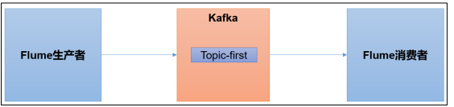
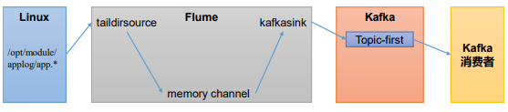
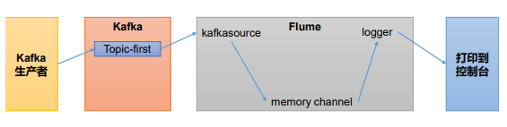

# 第 1 章 集成 Flume

Flume 是一个在大数据开发中非常常用的组件。可以用于 Kafka 的生产者，也可以用于 Flume 的消费者。



## 1.1 Flume 生产者



（1）启动 kafka 集群

（2）启动 kafka 消费者

```
[andanyoung@hadoop103 kafka]$ bin/kafka-console-consumer.sh --bootstrap-server hadoop102:9092 --topic first
```

（4）配置 Flume

在 hadoop102 节点的 Flume 的 job 目录下创建 file_to_kafka.conf

```
[andanyoung@hadoop102 flume]$ mkdir jobs
[andanyoung@hadoop102 flume]$ vim jobs/file_to_kafka.conf
```

配置文件内容如下

```
# 1 组件定义
a1.sources = r1
a1.sinks = k1
a1.channels = c1

# 2 配置 source
a1.sources.r1.type = TAILDIR
a1.sources.r1.filegroups = f1
a1.sources.r1.filegroups.f1 = /opt/module/applog/app.*
a1.sources.r1.positionFile = /opt/module/flume/taildir_position.json

# 3 配置 channel
a1.channels.c1.type = memory
a1.channels.c1.capacity = 1000
a1.channels.c1.transactionCapacity = 100

# 4 配置 sink
a1.sinks.k1.type = org.apache.flume.sink.kafka.KafkaSink
a1.sinks.k1.kafka.bootstrap.servers = hadoop102:9092,hadoop103:9092,hadoop104:9092
a1.sinks.k1.kafka.topic = first
a1.sinks.k1.kafka.flumeBatchSize = 20
a1.sinks.k1.kafka.producer.acks = 1
a1.sinks.k1.kafka.producer.linger.ms = 1

# 5 拼接组件
a1.sources.r1.channels = c1
a1.sinks.k1.channel = c1
```

（5）启动 Flume

```
[andanyoung@hadoop102 flume]$ bin/flume-ng agent -c conf/ -n a1 -f jobs/file_to_kafka.conf &
```

（6）向/opt/module/applog/app.log 里追加数据，查看 kafka 消费者消费情况

（7）观察 kafka 消费者，能够看到消费的 hello 数据

## 1.2 Flume 消费者



（1）配置 Flume

在 hadoop102 节点的 Flume 的/opt/module/flume/jobs 目录下创建 kafka_to_file.conf

```
[andanyoung@hadoop102 jobs]$ vim kafka_to_file.conf
```

配置文件内容如下

```
# 1 组件定义
a1.sources = r1
a1.sinks = k1
a1.channels = c1

# 2 配置 source
a1.sources.r1.type = org.apache.flume.source.kafka.KafkaSource
a1.sources.r1.batchSize = 50
a1.sources.r1.batchDurationMillis = 200
a1.sources.r1.kafka.bootstrap.servers = hadoop102:9092
a1.sources.r1.kafka.topics = first
a1.sources.r1.kafka.consumer.group.id = custom.g.id

# 3 配置 channel
a1.channels.c1.type = memory
a1.channels.c1.capacity = 1000
a1.channels.c1.transactionCapacity = 100

# 4 配置 sink
a1.sinks.k1.type = logger

# 5 拼接组件
a1.sources.r1.channels = c1
a1.sinks.k1.channel = c1
```

（2）启动 Flume

```
[andanyoung@hadoop102 flume]$ bin/flume-ng agent -c conf/ -n a1 -f jobs/kafka_to_file.conf -Dflume.root.logger=INFO,console
```

（3）启动 kafka 生产者

```
[andanyoung@hadoop103 kafka]$ bin/kafka-console-producer.sh --bootstrap-server hadoop102:9092 --topic first
```

并输入数据，例如：hello world

（4）观察控制台输出的日志

# 第 2 章 集成 SpringBoot

```
<dependency>
 <groupId>org.springframework.kafka</groupId>
 <artifactId>spring-kafka</artifactId>
</dependency
```

## 2.1 SpringBoot 生产者

（1）修改 SpringBoot 核心配置文件 application.propeties, 添加生产者相关信息

```
# 应用名称
spring.application.name=andanyoung_springboot_kafka
# 指定 kafka 的地址
spring.kafka.bootstrap-servers=hadoop102:9092,hadoop103:9092,hadoop104:9092
#指定 key 和 value 的序列化器
spring.kafka.producer.keyse-rializer=org.apache.kafka.common.serialization.StringSerializer
spring.kafka.producer.value-serializer=org.apache.kafka.common.serialization.StringSerializer
```

（2）创建 controller 从浏览器接收数据, 并写入指定的 topic

```
@RestController
public class ProducerController {

    @Autowired
    KafkaTemplate<String, String> kafka;

    @RequestMapping("/andanyoung")
    public String data(String msg){
        // 通过kafka发送出去
        kafka.send("first", msg);

        return "ok";
    }
}
```

（3）在浏览器中给/andanyoung 接口发送数据

> http://localhost:8080/andanyoung?msg=hello

## 2.2 SpringBoot 消费者

```
# =========消费者配置开始=========
# 指定 kafka 的地址
spring.kafka.bootstrap-servers=hadoop102:9092,hadoop103:9092,hadoop104:9092
# 指定 key 和 value 的反序列化器
spring.kafka.consumer.key-deserializer=org.apache.kafka.common.serialization.StringDeserial
izer
spring.kafka.consumer.value-deserializer=org.apache.kafka.common.serialization.StringDeserial
izer
#指定消费者组的 group_id
spring.kafka.consumer.group-id=andanyoung
# =========消费者配置结束=========
```

（2）创建类消费 Kafka 中指定 topic 的数据

```
@Configuration
public class KafkaConsumer {

    @KafkaListener(topics = "first")
    public void consumerTopic(String msg){
        System.out.println("收到消息：" + msg);
    }
}

```
