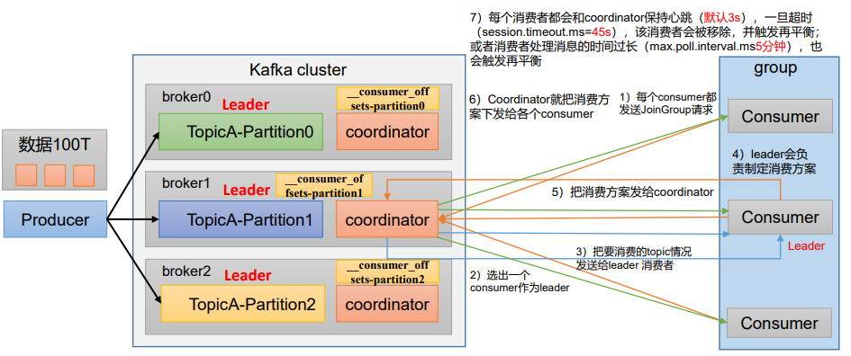

# 第 1 章 Kafka 硬件配置选择

## 1.1 场景说明

100 万日活，每人每天 100 条日志，每天总共的日志条数是 100 万 * 100 条 = 1 亿条。 

1 亿/24 小时/60 分/60 秒 = 1150 条/每秒钟。 

每条日志大小：0.5k - 2k（取 1k）。 

1150 条/每秒钟 * 1k ≈ 1m/s 。

高峰期每秒钟：1150 条 * 20 倍 = 23000 条。 

每秒多少数据量：20MB/s。

## 1.2 服务器台数选择

服务器台数	= 2 * （生产者峰值生产速率 * 副本 / 100） + 1 

​						= 2 * （20m/s * 2 / 100） + 1 

​						= 3 台 

建议 3 台服务器。

## 1.3 磁盘选择

kafka 底层主要是**顺序写**，固态硬盘和机械硬盘的顺序写速度差不多。

建议选择普通的机械硬盘。

每天总数据量：1 亿条 * 1k ≈ 100g

100g * 副本 2 * 保存时间 3 天 / 0.7 ≈ 1T

建议三台服务器硬盘总大小，大于等于 1T。


## 1.4 内存选择

Kafka 内存组成：堆内存 + 页缓存

1）Kafka 堆内存建议每个节点：10g ~ 15

在 kafka-server-start.sh 中修改

```
if [ "x$KAFKA_HEAP_OPTS" = "x" ]; then
 export KAFKA_HEAP_OPTS="-Xmx10G -Xms10G"
fi
```

（1）查看 Kafka 进程号

```
[atguigu@hadoop102 kafka]$ jps
2321 Kafka
5255 Jps
1931 QuorumPeerMain
```

（2）根据 Kafka 进程号，查看 Kafka 的 GC 情

```
[atguigu@hadoop102 kafka]$ jstat -gc 2321 1s 10
S0C S1C S0U S1U EC EU OC OU MC MU CCSC CCSU YGC YGCT FGC FGCT GCT 
0.0 7168.0 0.0 7168.0 103424.0 60416.0 1986560.0 148433.5 52092.0 46656.1 6780.0 6202.2 13 0.531 0 0.000 0.531
0.0 7168.0 0.0 7168.0 103424.0 60416.0 1986560.0 148433.5 52092.0 46656.1 6780.0 6202.2 13 0.531 0 0.000 0.531
0.0 7168.0 0.0 7168.0 103424.0 60416.0 1986560.0 148433.5 52092.0 46656.1 6780.0 6202.2 13 0.531 0 0.000 0.531
0.0 7168.0 0.0 7168.0 103424.0 60416.0 1986560.0 148433.5 52092.0 46656.1 6780.0 6202.2 13 0.531 0 0.000 0.531
0.0 7168.0 0.0 7168.0 103424.0 60416.0 1986560.0 148433.5 52092.0 46656.1 6780.0 6202.2 13 0.531 0 0.000 0.531
0.0 7168.0 0.0 7168.0 103424.0 61440.0 1986560.0 148433.5 52092.0 46656.1 6780.0 6202.2 13 0.531 0 0.000 0.531
0.0 7168.0 0.0 7168.0 103424.0 61440.0 1986560.0 148433.5 52092.0 46656.1 6780.0 6202.2 13 0.531 0 0.000 0.531
0.0 7168.0 0.0 7168.0 103424.0 61440.0 1986560.0 148433.5 52092.0 46656.1 6780.0 6202.2 13 0.531 0 0.000 0.531
0.0 7168.0 0.0 7168.0 103424.0 61440.0 1986560.0 148433.5 52092.0 46656.1 6780.0 6202.2 13 0.531 0 0.000 0.531
0.0 7168.0 0.0 7168.0 103424.0 61440.0 1986560.0 148433.5 52092.0 46656.1 6780.0 6202.2 13 0.531 0 0.000 0.531

```

参数说明：

S0C：第一个幸存区的大小； 

S1C：第二个幸存区的大小 

S0U：第一个幸存区的使用大小； 

S1U：第二个幸存区的使用大小 

EC：伊甸园区的大小； 

EU：伊甸园区的使用大小 

OC：老年代大小； 

OU：老年代使用大小 

MC：方法区大小； 

MU：方法区使用大小 

CCSC:压缩类空间大小； 

CCSU:压缩类空间使用大小 

YGC：年轻代垃圾回收次数；

YGCT：年轻代垃圾回收消耗时间 

FGC：老年代垃圾回收次数；

FGCT：老年代垃圾回收消耗时间 

GCT：垃圾回收消耗总时间；

（3）根据 Kafka 进程号，查看 Kafka 的堆内存

```
[atguigu@hadoop102 kafka]$ jmap -heap 2321
Attaching to process ID 2321, please wait...
Debugger attached successfully.
Server compiler detected.
JVM version is 25.212-b10

using thread-local object allocation.
Garbage-First (G1) GC with 8 thread(s)

Heap Configuration:
 MinHeapFreeRatio = 40
 MaxHeapFreeRatio = 70
 MaxHeapSize = 2147483648 (2048.0MB)
 NewSize = 1363144 (1.2999954223632812MB)
 MaxNewSize = 1287651328 (1228.0MB)
 OldSize = 5452592 (5.1999969482421875MB)
 NewRatio = 2
 SurvivorRatio = 8
 MetaspaceSize = 21807104 (20.796875MB)
 CompressedClassSpaceSize = 1073741824 (1024.0MB)
 MaxMetaspaceSize = 17592186044415 MB
 G1HeapRegionSize = 1048576 (1.0MB)
 
Heap Usage:
G1 Heap:
 regions = 2048
 capacity = 2147483648 (2048.0MB)
 used = 246367744 (234.95458984375MB)
 free = 1901115904 (1813.04541015625MB)
 11.472392082214355% used
G1 Young Generation:
Eden Space:
 regions = 83
 capacity = 105906176 (101.0MB)
 used = 87031808 (83.0MB)
 free = 18874368 (18.0MB)
 82.17821782178218% used
Survivor Space:
 regions = 7
 capacity = 7340032 (7.0MB)
 used = 7340032 (7.0MB)
 free = 0 (0.0MB)
 100.0% used
G1 Old Generation:
 regions = 147
 capacity = 2034237440 (1940.0MB)
 used = 151995904 (144.95458984375MB)
 free = 1882241536 (1795.04541015625MB)
 7.471886074420103% used
 
13364 interned Strings occupying 1449608 bytes.
```

2）页缓存：页缓存是 Linux 系统服务器的内存**。我们只需要保证 1 个 segment（1g）中25%**的数据在内存中就好。

每个节点页缓存大小 =（分区数 * 1g * 25%）/ 节点数。例如 10 个分区，页缓存大小 =（10 * 1g * 25%）/ 3 ≈ 1g

建议服务器内存大于等于 11G。

## 1.5 CPU 选择

- `num.io.threads = 8`  负责写磁盘的线程数，整个参数值要占总核数的 50%。

- `num.replica.fetchers = 1`  副本拉取线程数，这个参数占总核数的 50%的 1/3。

- `num.network.threads = 3` 数据传输线程数，这个参数占总核数的 50%的 2/3。

建议 32 个 cpu core。

## 1.6 网络选择

网络带宽 = 峰值吞吐量 ≈ 20MB/s 选择千兆网卡即可。

100Mbps 单位是 bit；10M/s 单位是 byte ; 1byte = 8bit，100Mbps/8 = 12.5M/s。

一般百兆的网卡（100Mbps ）、千兆的网卡（1000Mbps）、万兆的网卡（10000Mbps）。

# 第 2 章 Kafka 生产者

> 3.1.1 Updating Broker Configs 
>
> From Kafka version 1.1 onwards, some of the broker configs can be  updated without restarting the broker. See the Dynamic Update Mode  column in Broker Configs for the update mode of each broker config. 
>
> **read-only**: Requires a broker restart for update 
>
> **per-broker**: May be updated dynamically for each broker 
>
> **cluster-wide**: May be updated dynamically as a cluster-wide default. May also be updated as a per-broker value for testing.
>
> May also be updated as a per-broker value for testing.

## 2.1 Kafka 生产者核心参数配置


###  

| 参数名称                              | 描述                                                         |
| ------------------------------------- | ------------------------------------------------------------ |
| bootstrap.servers                     | 生产者连接集群所需的 broker 地 址清单 。 例 如 hadoop102:9092,hadoop103:9092,hadoop104:9092，可以设置 1 个或者多个，中间用逗号隔开。注意这里并**非需要所有的 broker 地址**，因为生产者从给定的 broker 里查找到其他 broker 信息。 |
| key.serializer 和 value.serializer    | 指定发送消息的 key 和 value 的序列化类型。一定要写 全类名。  |
| buffer.memory                         | RecordAccumulator 缓冲区总大小，**默认 32m。**               |
| batch.size                            | 缓冲区一批数据最大值，默认 16k。适当增加该值，可 以提高吞吐量，但是如果该值设置太大，会导致数据 传输延迟增加。 |
| linger.ms                             | 如果数据迟迟未达到 batch.size，sender 等待 linger.time 之后就会发送数据。单位 ms，**默认值是 0ms**，表示没有延迟。生产环境建议该值大小为 5-100ms 之间。 |
| acks                                  | 0：生产者发送过来的数据，不需要等数据落盘应答。 1：生产者发送过来的数据，Leader 收到数据后应答。 -1（all）：生产者发送过来的数据，Leader+和 isr 队列里面的所有节点收齐数据后应答。**默认值是-1，-1 和 all 是等价的。** |
| max.in.flight.requests.per.connection | 允许最多没有返回 ack 的次数，**默认为 5**，开启幂等性要保证该值是 1-5 的数字。 |
| retries                               | 当消息发送出现错误的时候，系统会重发消息。retries 表示重试次数。**默认是 int 最大值，2147483647**。 如果设置了重试，还想保证消息的有序性，需要设置 MAX_IN_FLIGHT_REQUESTS_PER_CONNECTION=1 否则在重试此失败消息的时候，其他的消息可能发送成功了。 |
| retry.backoff.ms                      | 两次重试之间的时间间隔，默认是 100ms。                       |
| enable.idempotence                    | 是否开启幂等性，**默认 true**，开启幂等性。                  |
| compression.type                      | 生产者发送的所有数据的压缩方式。**默认是 none**，也就是不压缩。 支持压缩类型：**none、gzip、snappy、lz4 和 zstd。** |

## 2.2 生产者如何提高吞吐量

| 参数名称         | 描述                                                         |
| ---------------- | ------------------------------------------------------------ |
| buffer.memory    | RecordAccumulator 缓冲区总大小，默认 **32m。**               |
| batch.size       | 缓冲区一批数据最大值，默认 16k。适当增加该值，可 以提高吞吐量，但是如果该值设置太大，会导致数据传 输延迟增加。 |
| linger.ms        | 如果数据迟迟未达到 batch.size，sender 等待 linger.time 之后就会发送数据。单位 ms，**默认值是 0ms**，表示没有 延迟。生产环境建议该值大小为 5-100ms 之间。 |
| compression.type | 生产者发送的所有数据的压缩方式。**默认是 none**，也就 是不压缩。 支持压缩类型：**none、gzip、snappy、lz4 和 zstd。** |

## 2.3 数据可靠性

| 参数名称 | 描述                                                         |
| -------- | ------------------------------------------------------------ |
| acks     | 0：生产者发送过来的数据，不需要等数据落盘应答。<br/>1：生产者发送过来的数据，Leader 收到数据后应答。<br/>-1（all）：生产者发送过来的数据，Leader+和 isr 队列 里面的所有节点收齐数据后应答。**默认值是-1，-1 和 all 是等价的。** |

- 至少一次（At Least Once）= ACK 级别设置为-1 + 分区副本大于等于 2 + ISR 里应答的最小副本数量大于等于 2

## 2.4 数据去重

1）配置参数

`enable.idempotence` : 是否开启幂等性，**默认 true**，表示开启幂等性。

2）Kafka 的事务一共有如下 5 个 API

```
// 1 初始化事务
void initTransactions();
// 2 开启事务
void beginTransaction() throws ProducerFencedException;
// 3 在事务内提交已经消费的偏移量（主要用于消费者）
void sendOffsetsToTransaction(Map<TopicPartition, OffsetAndMetadata> offsets,
 String consumerGroupId) throws 
ProducerFencedException;
// 4 提交事务
void commitTransaction() throws ProducerFencedException;
// 5 放弃事务（类似于回滚事务的操作）
void abortTransaction() throws ProducerFencedException;

```

## 2.5 数据有序

单分区内，有序（有条件的，不能乱序）；多分区，分区与分区间无序；

## 2.6 数据乱序

| 参数名称                              | 描述                                                         |
| ------------------------------------- | ------------------------------------------------------------ |
| enable.idempotence                    | 是否开启幂等性，**默认 true**，表示开启幂等性。              |
| max.in.flight.requests.per.connection | 允许最多没有返回 ack 的次数，**默认为 5**，开启幂等性要保证该值是 1-5 的数字。 |

# 第 3 章 Kafka Broker

## 3.1 Broker 核心参数配置


| 参数名称                                | 描述                                                         |
| --------------------------------------- | ------------------------------------------------------------ |
| replica.lag.time.max.ms                 | ISR 中，如果 Follower 长时间未向 Leader 发送通信请求或同步数据，则该 Follower 将被踢出 ISR。 该时间阈值，**默认 30s。** |
| auto.leader.rebalance.enable            | **默认是 true**。 自动 Leader Partition 平衡。               |
| leader.imbalance.per.broker.percentage  | **默认是 10%。** 每个 broker 允许的不平衡的 leader 的比率。如果每个 broker 超过了这个值，控制器 会触发 leader 的平衡。 |
| leader.imbalance.check.interval.seconds | **默认值 300 秒**。检查 leader 负载是否平衡的间隔时间。      |
| log.segment.bytes                       | Kafka 中 log 日志是分成一块块存储的，此配置是指 log 日志划分成块的大小，**默认值 1G。** |
| log.index.interval.bytes                | **默认 4kb**，kafka 里面每当写入了 4kb 大小的日志 （.log），然后就往 index 文件里面记录一个索引。 |
| log.retention.hours                     | Kafka 中数据保存的时间，**默认 7 天。**                      |
| log.retention.minutes                   | Kafka 中数据保存的时间，**分钟级别**，默认关闭。             |
| log.retention.ms                        | Kafka 中数据保存的时间，**毫秒级别**，默认关闭。             |
| log.retention.check.interval.ms         | 检查数据是否保存超时的间隔，**默认是 5 分钟**。              |
| log.retention.bytes                     | **默认等于-1，表示无穷大**。超过设置的所有日志总 大小，删除最早的 segment。 |
| log.cleanup.policy                      | **默认是 delete**，表示所有数据启用删除策略； 如果设置值为 compact，表示所有数据启用压缩策略。 |
| num.io.threads                          | **默认是 8**。负责写磁盘的线程数。整个参数值要占总核数的 50%。 |
| num.replica.fetchers                    | 副本拉取线程数，这个参数占总核数的 50%的 1/3                 |
| num.network.threads                     | **默认是 3**。数据传输线程数，这个参数占总核数的 50%的 2/3 。 |
| log.flush.interval.messages             | 强制页缓存刷写到磁盘的条数，默认是 long 的最大值，9223372036854775807。一般不建议修改， 交给系统自己管理。 |
| log.flush.interval.ms                   | 每隔多久，刷数据到磁盘，默认是 null。一般不建 议修改，交给系统自己管理。 |

## 3.2 服役新节点/退役旧节点

## 3.3 增加分区

## 3.4 增加副本因子

## 3.5 手动调整分区副本存储

## 3.6 Leader Partition 负载平衡

## 3.7 自动创建主题

如果 broker 端配置参数 **auto.create.topics.enable**  设置为 true（默认值是 true），那么当生产者向一个未创建的主题发送消息时，会自动创建一个分区数为 `num.partitions`（默认值为 1）、副本因子为 default.replication.factor（默认值为 1）的主题。除此之外，当一个消费者开始从未知主题中读取消息时，或者当任意一个客户端向未知主题发送元数据请求时，都会自动创建一个相应主题。这种创建主题的方式是非预期的，增加了主题管理和维护的难度。 生产环境建议将该参数设置为 false。

1）向一个没有提前创建 five 主题发送数据

```
[atguigu@hadoop102 kafka]$ bin/kafka-console-producer.sh --bootstrap-server hadoop102:9092 --topic five
>hello world
```

2）查看 five 主题的详情

```
[atguigu@hadoop102 kafka]$ bin/kafka-topics.sh --bootstrap-server hadoop102:9092 --describe --topic five
```

# 第 4 章 Kafka 消费者



## 4.6 消费者如何提高吞吐量

增加分区数；

```
[atguigu@hadoop102 kafka]$ bin/kafka-topics.sh --bootstrap-server hadoop102:9092 --alter --topic first --partitions 3
```

| 参数名称        | 描述                                                         |
| --------------- | ------------------------------------------------------------ |
| fetch.max.bytes | 默认 **Default: 52428800（50 m**）。消费者获取服务器端一批 消息最大的字节数。如果服务器端一批次的数据大于该值 （50m）仍然可以拉取回来这批数据，因此，这不是一个绝对 最大值。一批次的大小受 message.max.bytes （broker config） or max.message.bytes （topic config）影响。 |
| ax.poll.records | 一次 poll 拉取数据返回消息的最大条数，**默认是 500 条**      |

# 第 5 章 Kafka 总体

## 5.1 如何提升吞吐量

#### 1）提升生产吞吐量

- （1）buffer.memory：发送消息的缓冲区大小，默认值是 32m，可以增加到 64m。 
- （2）batch.size：默认是 16k。如果 batch 设置太小，会导致频繁网络请求，吞吐量下降； 如果 batch 太大，会导致一条消息需要等待很久才能被发送出去，增加网络延时。 
- （3）linger.ms，这个值默认是 0，意思就是消息必须立即被发送。一般设置一个 5-100 毫秒。如果 linger.ms 设置的太小，会导致频繁网络请求，吞吐量下降；如果 linger.ms 太长， 会导致一条消息需要等待很久才能被发送出去，增加网络延时。 
- （4）compression.type：默认是 none，不压缩，但是也可以使用 lz4 压缩，效率还是不错的，压缩之后可以减小数据量，提升吞吐量，但是会加大 producer 端的 CPU 开销。

#### 2）增加分区 

#### 3）消费者提高吞吐量

（1）调整 fetch.max.bytes 大小，默认是 50m。

（2）调整 max.poll.records 大小，默认是 500 条。

#### 4）增加下游消费者处理能力

## 5.2 数据精准一次

#### 1）生产者角度

- acks 设置为-1 （acks=-1）
- 幂等性（enable.idempotence = true） + 事务 。

#### 2）broker 服务端角度

- 分区副本大于等于 2 （--replication-factor 2）。
- ISR 里应答的最小副本数量大于等于 2 （min.insync.replicas = 2）。

## 3）消费者

- **事务 + 手动提交 offset** （enable.auto.commit = false）。
- 消费者输出的目的地必须支持事务（MySQL、Kafka）。

### 5.3 合理设置分区数

- （1）创建一个只有 1 个分区的 topic。
- （2）测试这个 topic 的 producer 吞吐量和 consumer 吞吐量。
- （3）假设他们的值分别是 Tp 和 Tc，单位可以是 MB/s
- （4）然后假设总的目标吞吐量是 Tt，那么分区数 = Tt / min（Tp，Tc）。

例如：producer 吞吐量 = 20m/s；consumer 吞吐量 = 50m/s，期望吞吐量 100m/s；

分区数 = 100 / 20 = 5 分区 

分区数一般设置为：3-10 个

分区数不是越多越好，也不是越少越好，需要搭建完集群，进行压测，再灵活调整分区个数。

## 5.4 单条日志大于 1m

| 参数名称                | 描述                                                         |
| ----------------------- | ------------------------------------------------------------ |
| message.max.bytes       | 默认 1m，broker 端接收每个批次消息最大值。                   |
| max.request.size        | 默认 1m，生产者发往 broker 每个请求消息最大值。针对 topic 级别设置消息体的大小。 |
| replica.fetch.max.bytes | 默认 1m，副本同步数据，每个批次消息最大值。                  |
| fetch.max.bytes         | 默认 Default: **52428800（50 m）**。消费者获取服务器端一批 消息最大的字节数。如果服务器端一批次的数据大于该值 （50m）仍然可以拉取回来这批数据，因此，这不是一个绝对 最大值。一批次的大小受 message.max.bytes （broker config） or max.message.bytes （topic config）影响。 |

## 5.5 服务器挂了

在生产环境中，如果某个 Kafka 节点挂掉。

正常处理办法：

（1）先尝试重新启动一下，如果能启动正常，那直接解决。

（2）如果重启不行，考虑增加内存、增加 CPU、网络带宽。

（3）如果将 kafka 整个节点误删除，如果副本数大于等于 2，可以按照服役新节点的方式重新服役一个新节点，并执行负载均衡。

## 5.6 集群压力测试

#### 1）Kafka 压测

用 Kafka 官方自带的脚本，对 Kafka 进行压测。

- 生产者压测：kafka-producer-perf-test.sh
- 消费者压测：kafka-consumer-perf-test.sh


#### 2）Kafka Producer 压力测试

（1）创建一个 test topic，设置为 3 个分区 3 个副本

```
[atguigu@hadoop102 kafka]$ bin/kafka-topics.sh --bootstrapserver hadoop102:9092 --create --replication-factor 3 --partitions 3 --topic test
```

（2）在/opt/module/kafka/bin 目录下面有这两个文件。我们来测试一下

```
[atguigu@hadoop105 kafka]$ bin/kafka-producer-perf-test.sh --topic test --record-size 1024 --num-records 1000000 --throughput 10000 --producer-props bootstrap.servers=hadoop102:9092,hadoop103:9092,hadoop104:9092 batch.size=16384 linger.ms=0
```

参数说明：

- record-size 是一条信息有多大，单位是字节，本次测试设置为 1k。
- num-records 是总共发送多少条信息，本次测试设置为 100 万条。
- throughput 是每秒多少条信息，设成-1，表示不限流，尽可能快的生产数据，可测出生产者最大吞吐量。本次实验设置为每秒钟 1 万条。
- producer-props 后面可以配置生产者相关参数，batch.size 配置为 16k。

#### 3）Kafka Consumer 压力测试

（1）修改/opt/module/kafka/config/consumer.properties 文件中的一次拉取条数为 500

```
max.poll.records=500
```

（2）消费 100 万条日志进行压测

```
[atguigu@hadoop105 kafka]$ bin/kafka-consumer-perf-test.sh --bootstrap-server hadoop102:9092,hadoop103:9092,hadoop104:9092 --topic test --messages 1000000 --consumer.config config/consumer.properties
```

参数说明:

- --bootstrap-server 指定 Kafka 集群地址
- --topic 指定 topic 的名称
- --messages 总共要消费的消息个数。本次实验 100 万条。
