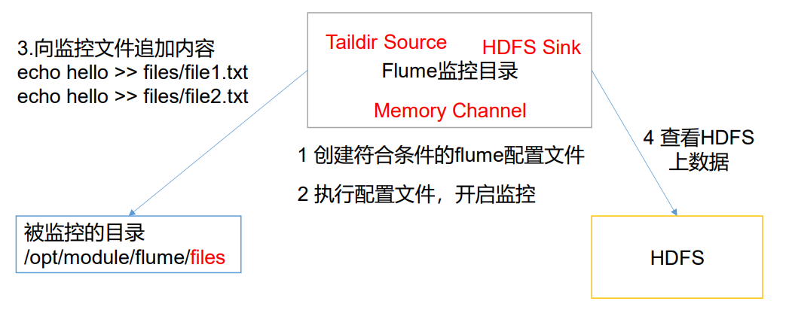

# 第 1 章 Flume 概述

## 1.1. Flume 定义

Flume 是 Cloudera 提供的一个高可用的，高可靠的，分布式的**海量日志采集、聚合和传输的系统。**Flume 基于流式架构，灵活简单。


Flume最主要的作用就是，实时读取服务器本地磁盘的数据，将数据写入到HDFS。

## 1.2 Flume 基础架构

Flume 组成架构如下图所示。


## 1.2.1 Agent

Agent 是一个 JVM 进程，它以事件的形式将数据从源头送至目的。 Agent 主要有 3 个部分组成，**Source、Channel、Sink**。

## 1.2.2 Source

Source 是负责接收数据到 Flume Agent 的组件。Source 组件可以处理各种类型、各种格式的日志数据，包括 avro、thrift、exec、jms、spooling directory、netcat、taildir、 sequence generator、syslog、http、legacy。

## 1.2.3 Sink

Sink 不断地轮询 Channel 中的事件且批量地移除它们，并将这些事件批量写入到存储或索引系统、或者被发送到另一个 Flume Agent。 

Sink 组件目的地包括 hdfs、logger、avro、thrift、ipc、file、HBase、solr、自定义。

## 1.**2.4 Channel**

Channel 是位于 Source 和 Sink 之间的缓冲区。因此，Channel 允许 Source 和 Sink 运作在不同的速率上。Channel 是线程安全的，可以同时处理几个 Source 的写入操作和几个 Sink 的读取操作。 

Flume 自带两种 Channel：Memory Channel 和 File Channel。 

Memory Channel 是内存中的队列。Memory Channel 在不需要关心数据丢失的情景下适用。如果需要关心数据丢失，那么 Memory Channel 就不应该使用，因为程序死亡、机器宕 机或者重启都会导致数据丢失。

File Channel 将所有事件写到磁盘。因此在程序关闭或机器宕机的情况下不会丢失数据。

## 1.2.5 Event

传输单元，Flume 数据传输的基本单元，以 Event 的形式将数据从源头送至目的地。 Event 由 **Header** 和 **Body** 两部分组成，Header 用来存放该 event 的一些属性，为 K-V 结构， Body 用来存放该条数据，形式为字节数组


# **第 2 章 Flume 入门**

## 2.1 Flume 安装部署

### 2.1.1 安装地址

（1）Flume 官网地址：http://flume.apache.org/ 

（2）文档查看地址：http://flume.apache.org/FlumeUserGuide.html 

（3）下载地址：http://archive.apache.org/dist/flume/

### 2.1.2 安装部署

（1）将 apache-flume-1.9.0-bin.tar.gz 上传到 linux 的/opt/software 目录下 

（2）解压 apache-flume-1.9.0-bin.tar.gz 到/opt/module/目录下

```
[atguigu@hadoop102 software]$ tar -zxf /opt/software/apacheflume-1.9.0-bin.tar.gz -C /opt/module/
```

（3）修改 apache-flume-1.9.0-bin 的名称为 flume

```
[atguigu@hadoop102 module]$ mv /opt/module/apache-flume-1.9.0-bin
/opt/module/flume
```

（4）将 lib 文件夹下的 guava-11.0.2.jar 删除以兼容 Hadoop 3.1.3

```
atguigu@hadoop102 lib]$ rm /opt/module/flume/lib/guava11.0.2.jar
```

## 2.2 Flume 入门案例

### 2.2.1 监控端口数据官方案例

#### 1）案例需求：

使用 Flume 监听一个端口，收集该端口数据，并打印到控制台。

#### 2）需求分析： 


#### 3）实现步骤：

（1）安装 netcat 工具

```
[atguigu@hadoop102 software]$ sudo yum install -y nc
```

（2）判断 44444 端口是否被占用

```
[atguigu@hadoop102 flume-telnet]$ sudo netstat -nlp | grep 44444
```

（3）创建 Flume Agent 配置文件 flume-netcat-logger.conf

（4）在 flume 目录下创建 job 文件夹并进入 job 文件夹。

```
[atguigu@hadoop102 flume]$ mkdir job
[atguigu@hadoop102 flume]$ cd job/
```

（5）在 job 文件夹下创建 Flume Agent 配置文件 flume-netcat-logger.conf。

```
[atguigu@hadoop102 job]$ vim flume-netcat-logger.conf
```

（6）在 flume-netcat-logger.conf 文件中添加如下内容。

```
添加内容如下：
# Name the components on this agent
a1.sources = r1
a1.sinks = k1
a1.channels = c1
# Describe/configure the source
a1.sources.r1.type = netcat
a1.sources.r1.bind = localhost
a1.sources.r1.port = 44444
# Describe the sink
a1.sinks.k1.type = logger
# Use a channel which buffers events in memory
a1.channels.c1.type = memory
a1.channels.c1.capacity = 1000
a1.channels.c1.transactionCapacity = 100
# Bind the source and sink to the channel
a1.sources.r1.channels = c1
a1.sinks.k1.channel = c1
```

注：配置文件来源于官方手册 http://flume.apache.org/FlumeUserGuide.html

##### 配置文件解析

（7)先开启 flume 监听端口

第一种写法：

```
[atguigu@hadoop102 flume]$ bin/flume-ng agent --conf conf/ --name a1 --conf-file job/flume-netcat-logger.conf -Dflume.root.logger=INFO,console
```

第二种写法：

```
[atguigu@hadoop102 flume]$ bin/flume-ng agent -c conf/ -n a1 -f job/flume-netcat-logger.conf -Dflume.root.logger=INFO,console
```

参数说明：

- --conf/-c：表示配置文件存储在 conf/目录 
- --name/-n：表示给 agent 起名为 a1 
- --conf-file/-f：flume 本次启动读取的配置文件是在 job 文件夹下的 flume-telnet.conf 文件。 
- -Dflume.root.logger=INFO,console ：
    - -D 表示 flume 运行时动态修改 flume.root.logger 参数属性值，并将控制台日志打印级别设置为 INFO 级别。日志级别包括:log、info、warn、 error。

（8）使用 netcat 工具向本机的 44444 端口发送内容

```
[atguigu@hadoop102 ~]$ nc localhost 44444
hello 
andy
```

（9）在 Flume 监听页面观察接收数据情况


> 控制台没有的话可以去 flume.log 里查看，可能是包冲突了

### 2.2.2 实时监控单个追加文件

#### 1）案例需求：实时监控 Hive 日志，并上传到 HDFS 中 

#### 2）需求分析：


#### 3）实现步骤：

（1）Flume 要想将数据输出到 HDFS，依赖 Hadoop 相关 jar 包

检查/etc/profile.d/my_env.sh 文件，确认 Hadoop 和 Java 环境变量配置正确

```
JAVA_HOME=/opt/module/jdk1.8.0_212
HADOOP_HOME=/opt/module/ha/hadoop-3.1.3
PATH=$PATH:$JAVA_HOME/bin:$HADOOP_HOME/bin:$HADOOP_HOME/sbin
export PATH JAVA_HOME HADOOP_HOME
```

（2）创建 flume-file-hdfs.conf 文

创建文件

```
[atguigu@hadoop102 job]$ vim flume-file-hdfs.conf
```

注：要想读取 Linux 系统中的文件，就得按照 Linux 命令的规则执行命令。由于 Hive 日志在 Linux 系统中所以读取文件的类型选择：exec 即 execute 执行的意思。表示执行 Linux 命令来读取文件。

添加如下内容

```
# Name the components on this agent
a2.sources = r2
a2.sinks = k2
a2.channels = c2
# Describe/configure the source
a2.sources.r2.type = exec
a2.sources.r2.command = tail -F /opt/module/hive/logs/hive.log
# Describe the sink
a2.sinks.k2.type = hdfs
a2.sinks.k2.hdfs.path = hdfs://hadoop102:9820/flume/%Y%m%d/%H
#上传文件的前缀
a2.sinks.k2.hdfs.filePrefix = logs-
#是否按照时间滚动文件夹
a2.sinks.k2.hdfs.round = true
#多少时间单位创建一个新的文件夹
a2.sinks.k2.hdfs.roundValue = 1
#重新定义时间单位
a2.sinks.k2.hdfs.roundUnit = hour
#是否使用本地时间戳
a2.sinks.k2.hdfs.useLocalTimeStamp = true
#积攒多少个 Event 才 flush 到 HDFS 一次
a2.sinks.k2.hdfs.batchSize = 100
#设置文件类型，可支持压缩
a2.sinks.k2.hdfs.fileType = DataStream
#多久生成一个新的文件
a2.sinks.k2.hdfs.rollInterval = 60
#设置每个文件的滚动大小
a2.sinks.k2.hdfs.rollSize = 134217700
#文件的滚动与 Event 数量无关
a2.sinks.k2.hdfs.rollCount = 0
# Use a channel which buffers events in memory
a2.channels.c2.type = memory
a2.channels.c2.capacity = 1000
a2.channels.c2.transactionCapacity = 100
# Bind the source and sink to the channel
a2.sources.r2.channels = c2
a2.sinks.k2.channel = c2
```

注意：对于所有与时间相关的转义序列，Event Header 中必须存在以 “timestamp”的 key（除非 hdfs.useLocalTimeStamp 设置为 true，此方法会使用 TimestampInterceptor 自 动添加 timestamp）。 

```
a3.sinks.k3.hdfs.useLocalTimeStamp = true
```


（3）运行 Flume

```
[atguigu@hadoop102 flume]$ bin/flume-ng agent --conf conf/ --name 
a2 --conf-file job/flume-file-hdfs.conf
```

（5）在 HDFS 上查看文件。

### 2.2.3 实时监控目录下多个新文件

#### 1）案例需求：使用 Flume 监听整个目录的文件，并上传至 HDFS

#### 2）需求分析：

 

#### 3）实现步骤：

（1）创建配置文件 flume-dir-hdfs.conf

创建一个文件

```
[atguigu@hadoop102 job]$ vim flume-dir-hdfs.conf
```

添加如下内容

```
a3.sources = r3
a3.sinks = k3
a3.channels = c3
# Describe/configure the source
a3.sources.r3.type = spooldir
a3.sources.r3.spoolDir = /opt/module/flume/upload
a3.sources.r3.fileSuffix = .COMPLETED
a3.sources.r3.fileHeader = true
#忽略所有以.tmp 结尾的文件，不上传
a3.sources.r3.ignorePattern = ([^ ]*\.tmp)
# Describe the sink
a3.sinks.k3.type = hdfs
a3.sinks.k3.hdfs.path = 
hdfs://hadoop102:9820/flume/upload/%Y%m%d/%H
#上传文件的前缀
a3.sinks.k3.hdfs.filePrefix = upload-
#是否按照时间滚动文件夹
a3.sinks.k3.hdfs.round = true
#多少时间单位创建一个新的文件夹
a3.sinks.k3.hdfs.roundValue = 1
#重新定义时间单位
a3.sinks.k3.hdfs.roundUnit = hour
#是否使用本地时间戳
a3.sinks.k3.hdfs.useLocalTimeStamp = true
#积攒多少个 Event 才 flush 到 HDFS 一次
a3.sinks.k3.hdfs.batchSize = 100
#设置文件类型，可支持压缩
a3.sinks.k3.hdfs.fileType = DataStream
#多久生成一个新的文件
a3.sinks.k3.hdfs.rollInterval = 60
#设置每个文件的滚动大小大概是 128M
a3.sinks.k3.hdfs.rollSize = 134217700
#文件的滚动与 Event 数量无关
a3.sinks.k3.hdfs.rollCount = 0
# Use a channel which buffers events in memory
a3.channels.c3.type = memory
a3.channels.c3.capacity = 1000
a3.channels.c3.transactionCapacity = 100
# Bind the source and sink to the channel
a3.sources.r3.channels = c3
a3.sinks.k3.channel = c3
```


（2）启动监控文件夹命令

```
[atguigu@hadoop102 flume]$ bin/flume-ng agent --conf conf/ --name 
a3 --conf-file job/flume-dir-hdfs.conf
```

> 说明：在使用 Spooling Directory Source 时，不要在监控目录中创建并持续修改文 件；上传完成的文件会以.COMPLETED 结尾；被监控文件夹每 500 毫秒扫描一次文件变动。

（3）向 upload 文件夹中添加文件

在/opt/module/flume 目录下创建 upload 文件夹

```
[atguigu@hadoop102 flume]$ mkdir upload
```

向 upload 文件夹中添加文件

```
[atguigu@hadoop102 upload]$ touch atguigu.txt
[atguigu@hadoop102 upload]$ touch atguigu.tmp
[atguigu@hadoop102 upload]$ touch atguigu.log
```

（4）查看 HDFS 上的数据

### 2.2.4 实时监控目录下的多个追加文件

Exec source 适用于监控一个实时追加的文件，不能实现断点续传；Spooldir Source 适合用于同步新文件，但不适合对实时追加日志的文件进行监听并同步；而 Taildir Source 适合用于监听多个实时追加的文件，并且能够实现断点续传。

#### 1）案例需求:使用 Flume 监听整个目录的实时追加文件，并上传至 HDFS

#### 2）需求分析: 



3）实现步骤：

（1）创建配置文件 flume-taildir-hdfs.conf

​	创建一个文件

```
[atguigu@hadoop102 job]$ vim flume-taildir-hdfs.conf
```

​	添加如下内容

```
a3.sources = r3
a3.sinks = k3
a3.channels = c3
# Describe/configure the source
a3.sources.r3.type = TAILDIR
a3.sources.r3.positionFile = /opt/module/flume/tail_dir.json
a3.sources.r3.filegroups = f1 f2
a3.sources.r3.filegroups.f1 = /opt/module/flume/files/.*file.*
a3.sources.r3.filegroups.f2 = /opt/module/flume/files2/.*log.*
# Describe the sink
a3.sinks.k3.type = hdfs
a3.sinks.k3.hdfs.path = 
hdfs://hadoop102:9820/flume/upload2/%Y%m%d/%H
#上传文件的前缀
a3.sinks.k3.hdfs.filePrefix = upload-
#是否按照时间滚动文件夹
a3.sinks.k3.hdfs.round = true
#多少时间单位创建一个新的文件夹
a3.sinks.k3.hdfs.roundValue = 1
#重新定义时间单位
a3.sinks.k3.hdfs.roundUnit = hour
#是否使用本地时间戳
a3.sinks.k3.hdfs.useLocalTimeStamp = true
#积攒多少个 Event 才 flush 到 HDFS 一次
a3.sinks.k3.hdfs.batchSize = 100
#设置文件类型，可支持压缩
a3.sinks.k3.hdfs.fileType = DataStream
#多久生成一个新的文件
a3.sinks.k3.hdfs.rollInterval = 60
#设置每个文件的滚动大小大概是 128M
a3.sinks.k3.hdfs.rollSize = 134217700
#文件的滚动与 Event 数量无关
a3.sinks.k3.hdfs.rollCount = 0
# Use a channel which buffers events in memory
a3.channels.c3.type = memory
a3.channels.c3.capacity = 1000
a3.channels.c3.transactionCapacity = 100
# Bind the source and sink to the channel
a3.sources.r3.channels = c3
a3.sinks.k3.channel = c3
```


（2）启动监控文件夹命令

```
[atguigu@hadoop102 flume]$ bin/flume-ng agent --conf conf/ --name 
a3 --conf-file job/flume-taildir-hdfs.conf
```

（3）向 files 文件夹中追加内

在/opt/module/flume 目录下创建 files 文件夹

```
[atguigu@hadoop102 flume]$ mkdir files
```

向 upload 文件夹中添加文件

```
[atguigu@hadoop102 files]$ echo hello >> file1.txt
[atguigu@hadoop102 files]$ echo atguigu >> file2.txt
```

（4）查看 HDFS 上的数据

**Taildir 说明：**

Taildir Source 维护了一个 json 格式的 position File，其会定期的往 position File 中更新每个文件读取到的最新的位置，因此能够实现断点续传。Position File 的格式如下：

```
{"inode":2496272,"pos":12,"file":"/opt/module/flume/files/file1.t
xt"}
{"inode":2496275,"pos":12,"file":"/opt/module/flume/files/file2.t
xt"}
```

注：Linux 中储存文件元数据的区域就叫做 inode，每个 inode 都有一个号码，操作系统用 inode 号码来识别不同的文件，Unix/Linux 系统内部不使用文件名，而使用 inode 号码来识别文件。