# 第 3 章 Flume 进阶

## 3.1 Flume 事务

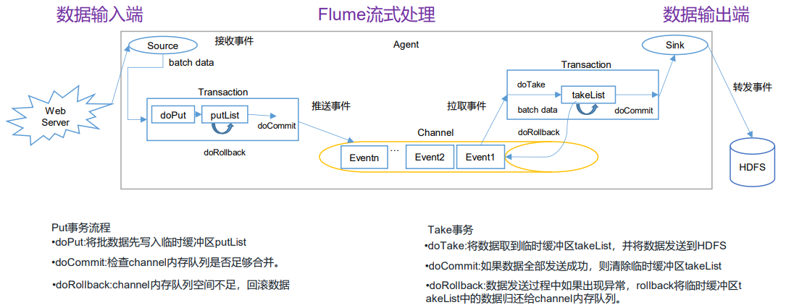

## 3.2 Flume Agent 内部原理

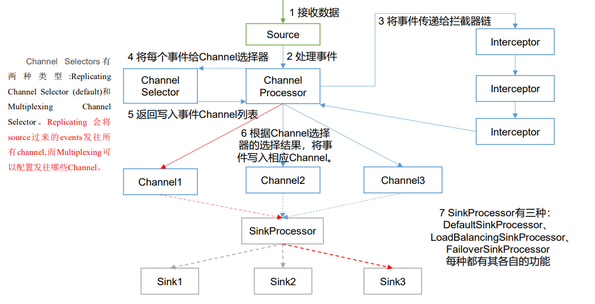

**重要组件：**

##### 1）ChannelSelector

ChannelSelector 的作用就是选出 Event 将要被发往哪个 Channel。其共有两种类型， 分别是 **Replicating**（复制）和 **Multiplexing**（多路复用）。 

ReplicatingSelector 会将同一个 Event 发往所有的 Channel，Multiplexing 会根据相应的原则，将不同的 Event 发往不同Channel。

##### 2）SinkProcessor 

SinkProcessor 共 有 三 种 类 型 ， 分 别 是 **DefaultSinkProcessor** 、 **LoadBalancingSinkProcessor** 和 **FailoverSinkProcessor** 

DefaultSinkProcessor 对 应 的 是 单 个 的 Sink ， LoadBalancingSinkProcessor 和 FailoverSinkProcessor 对应的是 Sink Group，LoadBalancingSinkProcessor 可以实现负载均衡的功能，FailoverSinkProcessor 可以错误恢复的功能。

## 3.3 Flume 拓扑结构

### 3.3.1 简单串联

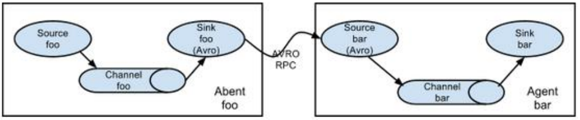

这种模式是将多个 flume 顺序连接起来了，从最初的 source 开始到最终 sink 传送的目的存储系统。此模式不建议桥接过多的 flume 数量， flume 数量过多不仅会影响传输速率，而且一旦传输过程中某个节点 flume 宕机，会影响整个传输系统。

### 3.3.2 复制和多路复用

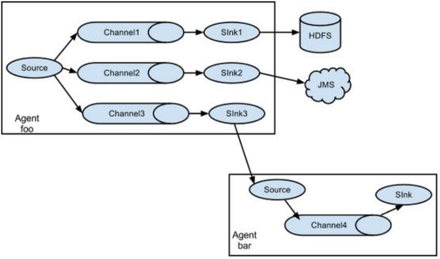

Flume 支持将事件流向一个或者多个目的地。这种模式可以将相同数据复制到多个 channel 中，或者将不同数据分发到不同的 channel 中，sink 可以选择传送到不同的目的地。

### 3.3.3 负载均衡和故障转移

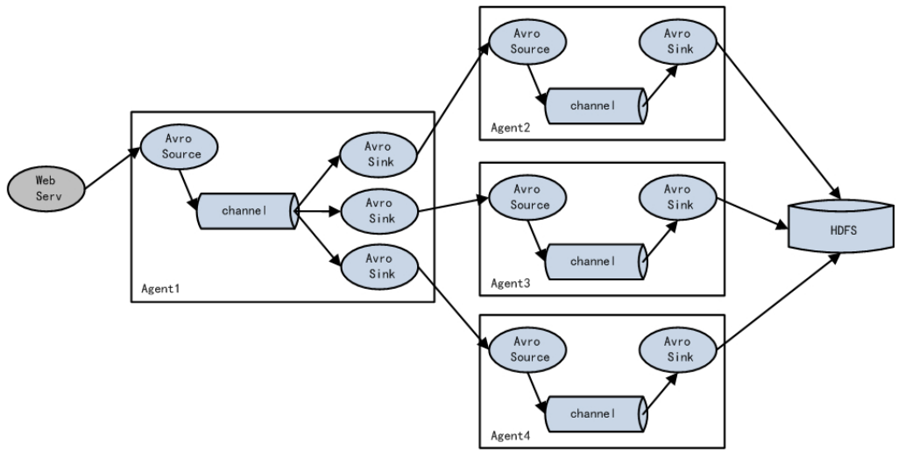

Flume支持使用将多个sink逻辑上分到一个sink组，sink组配合不同的SinkProcessor 可以实现负载均衡和错误恢复的功能。

### 3.3.4 聚合

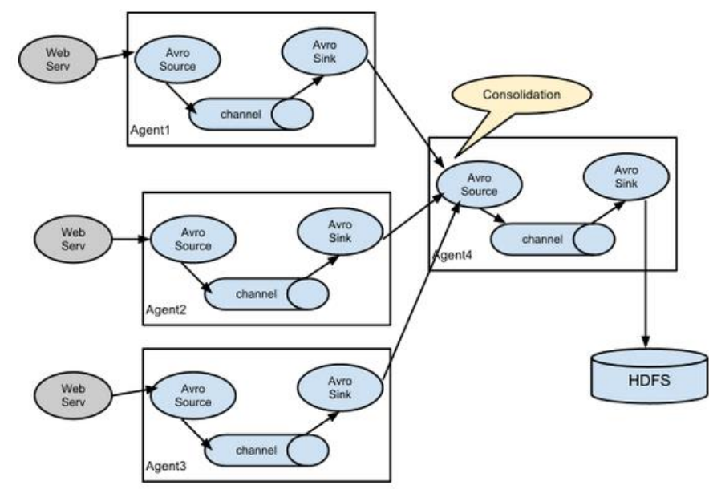

这种模式是我们最常见的，也非常实用，日常 web 应用通常分布在上百个服务器，大者甚至上千个、上万个服务器。产生的日志，处理起来也非常麻烦。用 flume 的这种组合方式能很好的解决这一问题，每台服务器部署一个 flume 采集日志，传送到一个集中收集日志的flume，再由此 flume 上传到 hdfs、hive、hbase 等，进行日志分析。

## 3.4 Flume 企业开发案例

### 3.4.1 复制和多路复用

1）案例需求

使用 Flume-1 监控文件变动，Flume-1 将变动内容传递给 Flume-2，Flume-2 负责存储到 HDFS。同时 Flume-1 将变动内容传递给 Flume-3，Flume-3 负责输出到 Local  FileSystem。

2）需求分析：

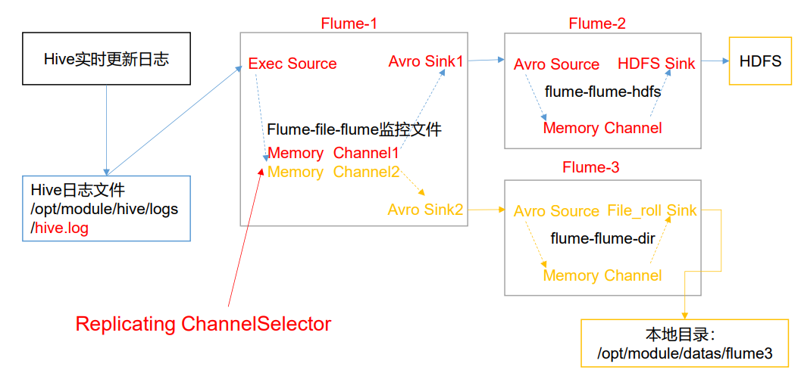3)实现步骤：

（1）准备工作

在/opt/module/flume/job 目录下创建 group1 文件夹

```
[atguigu@hadoop102 job]$ cd group1/
```

在/opt/module/datas/目录下创建 flume3 文件夹

```
[atguigu@hadoop102 datas]$ mkdir flume3
```

（2）创建 flume-file-flume.conf

配置 1 个接收日志文件的 source 和两个 channel、两个 sink，分别输送给 flume-flumehdfs 和 flume-flume-dir。

编辑配置文件

```
[atguigu@hadoop102 group1]$ vim flume-file-flume.conf
```

添加如下内容

```
# Name the components on this agent
a1.sources = r1
a1.sinks = k1 k2
a1.channels = c1 c2
# 将数据流复制给所有 channel
a1.sources.r1.selector.type = replicating
# Describe/configure the source
a1.sources.r1.type = exec
a1.sources.r1.command = tail -F /opt/module/hive/logs/hive.log
a1.sources.r1.shell = /bin/bash -c
# Describe the sink
# sink 端的 avro 是一个数据发送者
a1.sinks.k1.type = avro
a1.sinks.k1.hostname = hadoop102
a1.sinks.k1.port = 4141
a1.sinks.k2.type = avro
a1.sinks.k2.hostname = hadoop102
a1.sinks.k2.port = 4142
# Describe the channel
a1.channels.c1.type = memory
a1.channels.c1.capacity = 1000
a1.channels.c1.transactionCapacity = 100
a1.channels.c2.type = memory
a1.channels.c2.capacity = 1000
a1.channels.c2.transactionCapacity = 100
# Bind the source and sink to the channel
a1.sources.r1.channels = c1 c2
a1.sinks.k1.channel = c1
a1.sinks.k2.channel = c2
```

（3）创建 flume-flume-hdfs.conf

配置上级 Flume 输出的 Source，输出是到 HDFS 的 Sink。

编辑配置文件

```
[atguigu@hadoop102 group1]$ vim flume-flume-hdfs.conf
```

添加如下内容

```
# Name the components on this agent
a2.sources = r1
a2.sinks = k1
a2.channels = c1
# Describe/configure the source
# source 端的 avro 是一个数据接收服务
a2.sources.r1.type = avro
a2.sources.r1.bind = hadoop102
a2.sources.r1.port = 4141
# Describe the sink
a2.sinks.k1.type = hdfs
a2.sinks.k1.hdfs.path = hdfs://hadoop102:9820/flume2/%Y%m%d/%H
#上传文件的前缀
a2.sinks.k1.hdfs.filePrefix = flume2-
#是否按照时间滚动文件夹
a2.sinks.k1.hdfs.round = true
#多少时间单位创建一个新的文件夹
a2.sinks.k1.hdfs.roundValue = 1
#重新定义时间单位
a2.sinks.k1.hdfs.roundUnit = hour
#是否使用本地时间戳
a2.sinks.k1.hdfs.useLocalTimeStamp = true
#积攒多少个 Event 才 flush 到 HDFS 一次
a2.sinks.k1.hdfs.batchSize = 100
#设置文件类型，可支持压缩
a2.sinks.k1.hdfs.fileType = DataStream
#多久生成一个新的文件
a2.sinks.k1.hdfs.rollInterval = 30
#设置每个文件的滚动大小大概是 128M
a2.sinks.k1.hdfs.rollSize = 134217700
#文件的滚动与 Event 数量无关
a2.sinks.k1.hdfs.rollCount = 0
# Describe the channel
a2.channels.c1.type = memory
a2.channels.c1.capacity = 1000
a2.channels.c1.transactionCapacity = 100
# Bind the source and sink to the channel
a2.sources.r1.channels = c1
a2.sinks.k1.channel = c1
```

（4）创建 flume-flume-dir.conf

配置上级 Flume 输出的 Source，输出是到本地目录的 Sink。

编辑配置文件

```
[atguigu@hadoop102 group1]$ vim flume-flume-dir.conf
```

添加如下内容

```
# Name the components on this agent
a3.sources = r1
a3.sinks = k1
a3.channels = c2
# Describe/configure the source
a3.sources.r1.type = avro
a3.sources.r1.bind = hadoop102
a3.sources.r1.port = 4142
# Describe the sink
a3.sinks.k1.type = file_roll
a3.sinks.k1.sink.directory = /opt/module/data/flume3
# Describe the channel
a3.channels.c2.type = memory
a3.channels.c2.capacity = 1000
a3.channels.c2.transactionCapacity = 100
# Bind the source and sink to the channel
a3.sources.r1.channels = c2
a3.sinks.k1.channel = c2
```

> 提示：输出的本地目录必须是已经存在的目录，如果该目录不存在，并不会创建新的目 录。

（5）执行配置文件

分别启动对应的 flume 进程：flume-flume-dir，flume-flume-hdfs，flume-file-flume。

```
[atguigu@hadoop102 flume]$ bin/flume-ng agent --conf conf/ --name 
a3 --conf-file job/group1/flume-flume-dir.conf
[atguigu@hadoop102 flume]$ bin/flume-ng agent --conf conf/ --name 
a2 --conf-file job/group1/flume-flume-hdfs.conf
[atguigu@hadoop102 flume]$ bin/flume-ng agent --conf conf/ --name 
a1 --conf-file job/group1/flume-file-flume.conf
```

（6）启动 Hadoop 和 Hive

```
[atguigu@hadoop102 hadoop-2.7.2]$ sbin/start-dfs.sh
[atguigu@hadoop103 hadoop-2.7.2]$ sbin/start-yarn.sh
[atguigu@hadoop102 hive]$ bin/hive
hive (default)>
```

（7）检查 HDFS 上数据

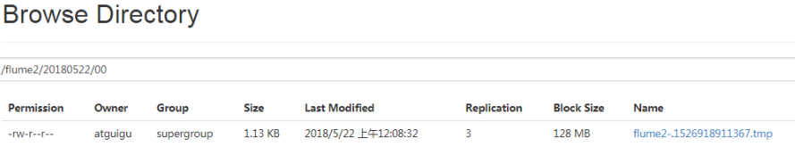

（8）检查/opt/module/datas/flume3 目录中数据

```
[atguigu@hadoop102 flume3]$ ll
总用量 8
-rw-rw-r--. 1 atguigu atguigu 5942 5 月 22 00:09 1526918887550-3
```

### 3.4.2 负载均衡和故障转移

1）案例需求

使用 Flume1 监控一个端口，其 sink 组中的 sink 分别对接 Flume2 和 Flume3，采用 FailoverSinkProcessor，实现故障转移的功能。

2）需求分析

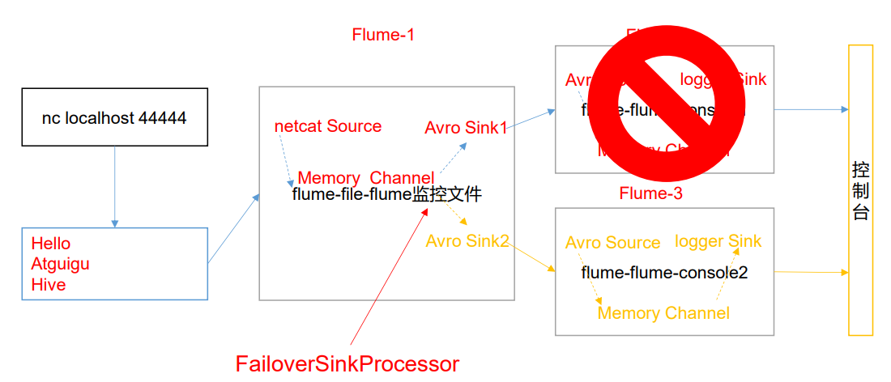

3）实现步骤 

（1）准备工作

在/opt/module/flume/job 目录下创建 group2 文件夹

（2）创建 flume-netcat-flume.conf

配置 1 个 netcat source 和 1 个 channel、1 个 sink group（2 个 sink），分别输送给 flume-flume-console1 和 flume-flume-console2。

编辑配置文件

```
[atguigu@hadoop102 group2]$ vim flume-netcat-flume.conf
```

添加如下内容

```
# Name the components on this agent
a1.sources = r1
a1.channels = c1
a1.sinkgroups = g1
a1.sinks = k1 k2
# Describe/configure the source
a1.sources.r1.type = netcat
a1.sources.r1.bind = localhost
a1.sources.r1.port = 44444
a1.sinkgroups.g1.processor.type = failover
a1.sinkgroups.g1.processor.priority.k1 = 5
a1.sinkgroups.g1.processor.priority.k2 = 10
a1.sinkgroups.g1.processor.maxpenalty = 10000
# Describe the sink
a1.sinks.k1.type = avro
a1.sinks.k1.hostname = hadoop102
a1.sinks.k1.port = 4141

a1.sinks.k2.type = avro
a1.sinks.k2.hostname = hadoop102
a1.sinks.k2.port = 4142
# Describe the channel
a1.channels.c1.type = memory
a1.channels.c1.capacity = 1000
a1.channels.c1.transactionCapacity = 100
# Bind the source and sink to the channel
a1.sources.r1.channels = c1
a1.sinkgroups.g1.sinks = k1 k2
a1.sinks.k1.channel = c1
a1.sinks.k2.channel = c1
```

（3）创建 flume-flume-console1.conf

配置上级 Flume 输出的 Source，输出是到本地控制台。

编辑配置文

```
[atguigu@hadoop102 group2]$ vim flume-flume-console1.conf
```

添加如下内容

```
# Name the components on this agent
a2.sources = r1
a2.sinks = k1
a2.channels = c1
# Describe/configure the source
a2.sources.r1.type = avro
a2.sources.r1.bind = hadoop102
a2.sources.r1.port = 4141
# Describe the sink
a2.sinks.k1.type = logger
# Describe the channel
a2.channels.c1.type = memory
a2.channels.c1.capacity = 1000
a2.channels.c1.transactionCapacity = 100
# Bind the source and sink to the channel
a2.sources.r1.channels = c1
a2.sinks.k1.channel = c1
```

（4）创建 flume-flume-console2.conf

配置上级 Flume 输出的 Source，输出是到本地控制台。

编辑配置文件

```
[atguigu@hadoop102 group2]$ vim flume-flume-console2.conf
```

添加如下内容

```
# Name the components on this agent
a3.sources = r1
a3.sinks = k1
a3.channels = c2

# Describe/configure the source
a3.sources.r1.type = avro
a3.sources.r1.bind = hadoop102
a3.sources.r1.port = 4142
# Describe the sink
a3.sinks.k1.type = logger
# Describe the channel
a3.channels.c2.type = memory
a3.channels.c2.capacity = 1000
a3.channels.c2.transactionCapacity = 100
# Bind the source and sink to the channel
a3.sources.r1.channels = c2
a3.sinks.k1.channel = c2
```

（5）执行配置文件

分别开启对应配置文件：flume-flume-console2，flume-flume-console1，flume-netcat-flume

```
[atguigu@hadoop102 flume]$ bin/flume-ng agent --conf conf/ --name 
a3 --conf-file job/group2/flume-flume-console2.conf -
Dflume.root.logger=INFO,console
[atguigu@hadoop102 flume]$ bin/flume-ng agent --conf conf/ --name 
a2 --conf-file job/group2/flume-flume-console1.conf -
Dflume.root.logger=INFO,console
[atguigu@hadoop102 flume]$ bin/flume-ng agent --conf conf/ --name 
a1 --conf-file job/group2/flume-netcat-flume.conf
```

（6）使用 netcat 工具向本机的 44444 端口发送内容

```
$ nc localhost 44444
```

（7）查看 Flume2 及 Flume3 的控制台打印日志

（8）将 Flume2 kill，观察 Flume3 的控制台打印情况。

> 注：使用 jps -ml 查看 Flume 进程。 

### 3.4.3 聚合

1）案例需求：  

hadoop102 上的 Flume-1 监控文件/opt/module/group.log， 

hadoop103 上的 Flume-2 监控某一个端口的数据流， 

Flume-1 与 Flume-2 将数据发送给 hadoop104 上的 Flume-3，Flume-3 将最终数据打印到控制台。

2）需求分析

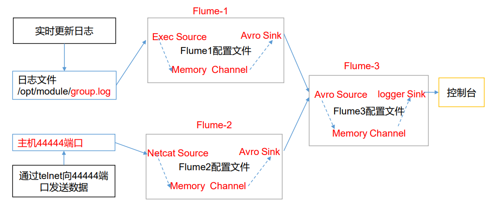

3）实现步骤：

（1）准备工作

分发 Flume

```
[atguigu@hadoop102 module]$ xsync flume
```

在 hadoop102、hadoop103 以及 hadoop104 的/opt/module/flume/job 目录下创建一个 group3 文件夹。

```
[atguigu@hadoop102 job]$ mkdir group3
[atguigu@hadoop103 job]$ mkdir group3
[atguigu@hadoop104 job]$ mkdir group3
```

（2）创建 flume1-logger-flume.conf

配置 Source 用于监控 hive.log 文件，配置 Sink 输出数据到下一级 Flume。

在 hadoop102 上编辑配置文件

```
[atguigu@hadoop102 group3]$ vim flume1-logger-flume.conf
```

添加如下内容

```
# Name the components on this agent
a1.sources = r1
a1.sinks = k1
a1.channels = c1
# Describe/configure the source
a1.sources.r1.type = exec
a1.sources.r1.command = tail -F /opt/module/group.log
a1.sources.r1.shell = /bin/bash -c
# Describe the sink
a1.sinks.k1.type = avro
a1.sinks.k1.hostname = hadoop104
a1.sinks.k1.port = 4141

# Describe the channel
a1.channels.c1.type = memory
a1.channels.c1.capacity = 1000
a1.channels.c1.transactionCapacity = 100
# Bind the source and sink to the channel
a1.sources.r1.channels = c1
a1.sinks.k1.channel = c1
```

（3）创建 flume2-netcat-flume.conf

配置 Source 监控端口 44444 数据流，配置 Sink 数据到下一级 Flume：

在 hadoop103 上编辑配置文

```
[atguigu@hadoop102 group3]$ vim flume2-netcat-flume.conf
```

添加如下内容

```
# Name the components on this agent
a2.sources = r1
a2.sinks = k1
a2.channels = c1
# Describe/configure the source
a2.sources.r1.type = netcat
a2.sources.r1.bind = hadoop103
a2.sources.r1.port = 44444
# Describe the sink
a2.sinks.k1.type = avro
a2.sinks.k1.hostname = hadoop104
a2.sinks.k1.port = 4141
# Use a channel which buffers events in memory
a2.channels.c1.type = memory
a2.channels.c1.capacity = 1000
a2.channels.c1.transactionCapacity = 100
# Bind the source and sink to the channel
a2.sources.r1.channels = c1
a2.sinks.k1.channel = c1
```

（4）创建 flume3-flume-logger.conf

配置 source 用于接收 flume1 与 flume2 发送过来的数据流，最终合并后 sink 到控制台。

```
在 hadoop104 上编辑配置文件
[atguigu@hadoop104 group3]$ touch flume3-flume-logger.conf
[atguigu@hadoop104 group3]$ vim flume3-flume-logger.conf
```

添加如下内容

```
# Name the components on this agent
a3.sources = r1
a3.sinks = k1
a3.channels = c1
# Describe/configure the source
a3.sources.r1.type = avro

a3.sources.r1.bind = hadoop104
a3.sources.r1.port = 4141
# Describe the sink
# Describe the sink
a3.sinks.k1.type = logger

# Describe the channel
a3.channels.c1.type = memory
a3.channels.c1.capacity = 1000
a3.channels.c1.transactionCapacity = 100

# Bind the source and sink to the channel
a3.sources.r1.channels = c1
a3.sinks.k1.channel = c1
```

（5）执行配置文件

分别开启对应配置文件：flume3-flume-logger.conf，flume2-netcat-flume.conf， flume1-logger-flume.conf。

```
[atguigu@hadoop104 flume]$ bin/flume-ng agent --conf conf/ --name 
a3 --conf-file job/group3/flume3-flume-logger.conf -
Dflume.root.logger=INFO,console
[atguigu@hadoop102 flume]$ bin/flume-ng agent --conf conf/ --name 
a2 --conf-file job/group3/flume1-logger-flume.conf
[atguigu@hadoop103 flume]$ bin/flume-ng agent --conf conf/ --name 
a1 --conf-file job/group3/flume2-netcat-flume.conf
```

（6）在 hadoop103 上向/opt/module 目录下的 group.log 追加内容

```
[atguigu@hadoop103 module]$ echo 'hello' > group.log
```

（7）在 hadoop102 上向 44444 端口发送数据

```
[atguigu@hadoop102 flume]$ telnet hadoop102 44444
```

（8）检查 hadoop104 上数据

## 3.5 自定义 Interceptor

1）案例需求

使用 Flume 采集服务器本地日志，需要按照日志类型的不同，将不同种类的日志发往不同的分析系统。

2）需求分析

在实际的开发中，一台服务器产生的日志类型可能有很多种，不同类型的日志可能需要发送到不同的分析系统。此时会用到 Flume 拓扑结构中的 Multiplexing 结构，Multiplexing 的原理是，根据 event 中 Header 的某个 key 的值，将不同的 event 发送到不同的 Channel中，所以我们需要自定义一个 Interceptor，为不同类型的 event 的 Header 中的 key 赋予不同的值。

在该案例中，我们以端口数据模拟日志，以是否包含”atguigu”模拟不同类型的日志， 我们需要自定义 interceptor 区分数据中是否包含”atguigu”，将其分别发往不同的分析 系统（Channel）。

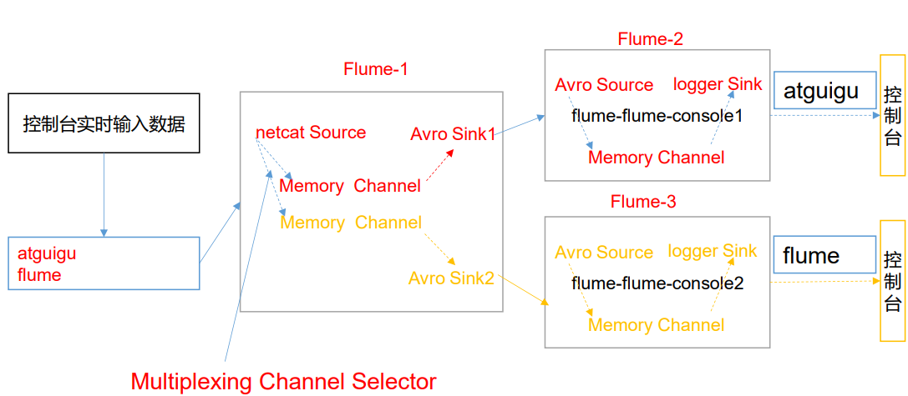

3）实现步骤

（1）创建一个 maven 项目，并引入以下依赖。

```
<dependency>
 <groupId>org.apache.flume</groupId>
 <artifactId>flume-ng-core</artifactId>
 <version>1.9.0</version>
</dependency
```

（2）定义 CustomInterceptor 类并实现 Interceptor 接口。

```
package com.atguigu.interceptor;
import org.apache.flume.Context;
import org.apache.flume.Event;
import org.apache.flume.interceptor.Interceptor;
import java.util.ArrayList;
import java.util.List;
import java.util.Map;
public class TypeInterceptor implements Interceptor {
     //声明一个存放事件的集合
     private List<Event> addHeaderEvents;
     @Override
      public void initialize() {
         //初始化存放事件的集合
         addHeaderEvents = new ArrayList<>();
     }
     //单个事件拦截
     @Override
     public Event intercept(Event event) {
         //1.获取事件中的头信息
         Map<String, String> headers = event.getHeaders();
         //2.获取事件中的 body 信息
         String body = new String(event.getBody());
         //3.根据 body 中是否有"atguigu"来决定添加怎样的头信息
         if (body.contains("atguigu")) {
         //4.添加头信息
         	headers.put("type", "first");
         } else {
         //4.添加头信息
         	headers.put("type", "second");
         }
         return event;
     }
     
     //批量事件拦截
     @Override
     public List<Event> intercept(List<Event> events) {
         //1.清空集合
         addHeaderEvents.clear();
         //2.遍历 events
         for (Event event : events) {
         	//3.给每一个事件添加头信息
         	addHeaderEvents.add(intercept(event));
         }
         //4.返回结果
         return addHeaderEvents;
     }
     
     @Override
     public void close() {
     }
     
     public static class Builder implements Interceptor.Builder {
         
         @Override
         public Interceptor build() {
         	return new TypeInterceptor();
         }
 
 		@Override
		public void configure(Context context) {
 		}
 	}
}
```

（3）编辑 flume 配置文件

为 hadoop102 上的 Flume1 配置 1 个 netcat source，1 个 sink group（2 个 avro sink）， 并配置相应的 ChannelSelector 和 interceptor。

```
# Name the components on this agent
a1.sources = r1
a1.sinks = k1 k2
a1.channels = c1 c2

# Describe/configure the source
a1.sources.r1.type = netcat
a1.sources.r1.bind = localhost
a1.sources.r1.port = 44444
a1.sources.r1.interceptors = i1
a1.sources.r1.interceptors.i1.type = com.atguigu.flume.interceptor.CustomInterceptor$Builder
a1.sources.r1.selector.type = multiplexing
a1.sources.r1.selector.header = type
a1.sources.r1.selector.mapping.first = c1
a1.sources.r1.selector.mapping.second = c2

# Describe the sink
a1.sinks.k1.type = avro
a1.sinks.k1.hostname = hadoop103
a1.sinks.k1.port = 4141
a1.sinks.k2.type=avro
a1.sinks.k2.hostname = hadoop104
a1.sinks.k2.port = 4242

# Use a channel which buffers events in memory
a1.channels.c1.type = memory
a1.channels.c1.capacity = 1000
a1.channels.c1.transactionCapacity = 100

# Use a channel which buffers events in memory
a1.channels.c2.type = memory
a1.channels.c2.capacity = 1000
a1.channels.c2.transactionCapacity = 100

# Bind the source and sink to the channel
a1.sources.r1.channels = c1 c2
a1.sinks.k1.channel = c1
a1.sinks.k2.channel = c2
```

为 hadoop103 上的 Flume4 配置一个 avro source 和一个 logger sink。

```
a1.sources = r1
a1.sinks = k1
a1.channels = c1

a1.sources.r1.type = avro
a1.sources.r1.bind = hadoop103
a1.sources.r1.port = 4141

a1.sinks.k1.type = logger

a1.channels.c1.type = memory
a1.channels.c1.capacity = 1000
a1.channels.c1.transactionCapacity = 100

a1.sinks.k1.channel = c1
a1.sources.r1.channels = c1
```

为 hadoop104 上的 Flume3 配置一个 avro source 和一个 logger sink。

```
a1.sources = r1
a1.sinks = k1
a1.channels = c1

a1.sources.r1.type = avro
a1.sources.r1.bind = hadoop104
a1.sources.r1.port = 4242

a1.sinks.k1.type = logger
a1.channels.c1.type = memory
a1.channels.c1.capacity = 1000
a1.channels.c1.transactionCapacity = 100

a1.sinks.k1.channel = c1
a1.sources.r1.channels = c1
```

（4）分别在 hadoop102，hadoop103，hadoop104 上启动 flume 进程，注意先后顺序。

（5）在 hadoop102 使用 netcat 向 localhost:44444 发送字母和数字。

（6）观察 hadoop103 和 hadoop104 打印的日志。

## 3.6 自定义 Source

#### 1）介绍

Source 是负责接收数据到 Flume Agent 的组件。Source 组件可以处理各种类型、各种格式的日志数据，包括 avro、thrift、exec、jms、spooling directory、netcat、sequence  generator、syslog、http、legacy。官方提供的 source 类型已经很多，但是有时候并不能满足实际开发当中的需求，此时我们就需要根据实际需求自定义某些 source。

官方也提供了自定义 source 的接口：

https://flume.apache.org/FlumeDeveloperGuide.html#source 根据官方说明自定义 MySource 需要继承 AbstractSource 类并实现 Configurable 和 PollableSource 接口。

实现相应方法：

getBackOffSleepIncrement() //backoff 步长

getMaxBackOffSleepInterval()//backoff 最长时间

configure(Context context)//初始化 context（读取配置文件内容）

process()//获取数据封装成 event 并写入 channel，这个方法将被循环调用。

使用场景：读取 MySQL 数据或者其他文件系统。

#### 2）需求

使用 flume 接收数据，并给每条数据添加前缀，输出到控制台。前缀可从 flume 配置文件中配置。

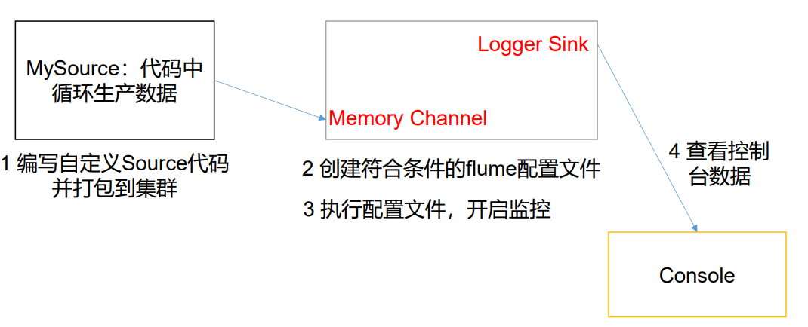

#### 3）分析 

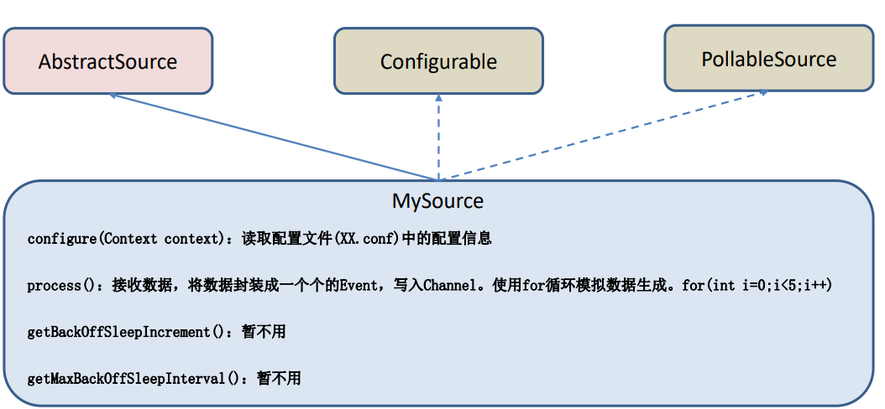

#### 4）编码 

（1）导入 pom 依赖

```
<dependency>
 <groupId>org.apache.flume</groupId>
 <artifactId>flume-ng-core</artifactId>
 <version>1.9.0</version>
</dependency>
```

（2）编写代码

```java
import org.apache.flume.Context;
import org.apache.flume.EventDeliveryException;
import org.apache.flume.PollableSource;
import org.apache.flume.conf.Configurable;
import org.apache.flume.event.SimpleEvent;
import org.apache.flume.source.AbstractSource;
import java.util.HashMap;
public class MySource extends AbstractSource implements Configurable, PollableSource {

 //定义配置文件将来要读取的字段
 private Long delay;
 private String field;
 
 //初始化配置信息
 @Override
 public void configure(Context context) {
     delay = context.getLong("delay");
     field = context.getString("field", "Hello!");
 }
 
 @Override
 public Status process() throws EventDeliveryException {
 
 try {
     //创建事件头信息
     HashMap<String, String> hearderMap = new HashMap<>();
     //创建事件
     SimpleEvent event = new SimpleEvent();
     //循环封装事件
     for (int i = 0; i < 5; i++) {
         //给事件设置头信息
         event.setHeaders(hearderMap);
         //给事件设置内容
         event.setBody((field + i).getBytes());
         //将事件写入 channel
         getChannelProcessor().processEvent(event);
         Thread.sleep(delay);
     	}
     } catch (Exception e) {
        e.printStackTrace();
        return Status.BACKOFF;
     }

    return Status.READY;
  }
    
 @Override
 public long getBackOffSleepIncrement() {
	return 0;
 }
    
 @Override
 public long getMaxBackOffSleepInterval() {
 	return 0;
 }
}

```

5）测试  

（1）打包

将写好的代码打包，并放到 flume 的 lib 目录（/opt/module/flume）下。

（2）配置文件

```
# Name the components on this agent
a1.sources = r1
a1.sinks = k1
a1.channels = c1

# Describe/configure the source
a1.sources.r1.type = com.atguigu.MySource
a1.sources.r1.delay = 1000
#a1.sources.r1.field = atguigu

# Describe the sink
a1.sinks.k1.type = logger

# Use a channel which buffers events in memory
a1.channels.c1.type = memory
a1.channels.c1.capacity = 1000
a1.channels.c1.transactionCapacity = 100

# Bind the source and sink to the channel
a1.sources.r1.channels = c1
a1.sinks.k1.channel = c1
```

（3）开启任务

```
[atguigu@hadoop102 flume]$ pwd
/opt/module/flume
[atguigu@hadoop102 flume]$ bin/flume-ng agent -c conf/ -f 
job/mysource.conf -n a1 -Dflume.root.logger=INFO,console
```

（4）结果展示

## 3.7 自定义 Sink

#### 1）介绍 

Sink 不断地轮询 Channel 中的事件且批量地移除它们，并将这些事件批量写入到存储或索引系统、或者被发送到另一个 Flume Agent。

Sink 是完全事务性的。在从 Channel 批量删除数据之前，每个 Sink 用 Channel 启动一 个事务。批量事件一旦成功写出到存储系统或下一个 Flume Agent，Sink 就利用 Channel 提交事务。事务一旦被提交，该 Channel 从自己的内部缓冲区删除事件。

Sink 组件目的地包括 hdfs、logger、avro、thrift、ipc、file、null、HBase、solr、 自定义。官方提供的 Sink 类型已经很多，但是有时候并不能满足实际开发当中的需求，此 时我们就需要根据实际需求自定义某些 Sink。

官方也提供了自定义 sink 的接口：

https://flume.apache.org/FlumeDeveloperGuide.html#sink 根据官方说明自定义 MySink 需要继承 AbstractSink 类并实现 Configurable 接口。


实现相应方法：

configure(Context context)//初始化 context（读取配置文件内容） 

process()//从 Channel 读取获取数据（event），这个方法将被循环调用。

使用场景：读取 Channel 数据写入 MySQL 或者其他文件系统。

#### 2）需求

使用 flume 接收数据，并在 Sink 端给每条数据添加前缀和后缀，输出到控制台。前后缀可在 flume 任务配置文件中配置。

流程分析：

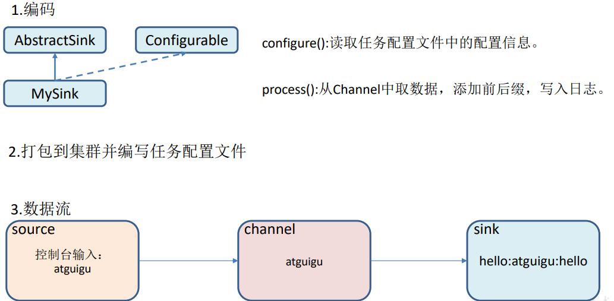

#### 3）编码

```java
import org.apache.flume.*;
import org.apache.flume.conf.Configurable;
import org.apache.flume.sink.AbstractSink;
import org.slf4j.Logger;
import org.slf4j.LoggerFactory;

public class MySink extends AbstractSink implements Configurable {

 //创建 Logger 对象
 private static final Logger LOG = LoggerFactory.getLogger(AbstractSink.class);
 private String prefix;
 private String suffix;
 
 @Override
 public Status process() throws EventDeliveryException {
     //声明返回值状态信息
     Status status;
     //获取当前 Sink 绑定的 Channel
     Channel ch = getChannel();
     //获取事务
     Transaction txn = ch.getTransaction();
     //声明事件
     Event event;
     //开启事务
     txn.begin();
     
     //读取 Channel 中的事件，直到读取到事件结束循环
     while (true) {
         event = ch.take();
         if (event != null) {
         	break;
         }
 	}
 	
     try {
         //处理事件（打印）
         LOG.info(prefix + new String(event.getBody()) + suffix);
         //事务提交
         txn.commit();
         status = Status.READY;
     } catch (Exception e) {
         //遇到异常，事务回滚
         txn.rollback();
         status = Status.BACKOFF;
     } finally {
         //关闭事务
         txn.close();
     }
     return status;
 }
 
 @Override
 public void configure(Context context) {
 //读取配置文件内容，有默认值
 prefix = context.getString("prefix", "hello:");
 //读取配置文件内容，无默认值
 suffix = context.getString("suffix");
 }
}
```

#### 4）测试  

（1）打包

将写好的代码打包，并放到 flume 的 lib 目录（/opt/module/flume）下。

（2）配置文件

```
# Name the components on this agent
a1.sources = r1
a1.sinks = k1
a1.channels = c1

# Describe/configure the source
a1.sources.r1.type = netcat
a1.sources.r1.bind = localhost
a1.sources.r1.port = 4444

# Describe the sink
a1.sinks.k1.type = com.atguigu.MySink
#a1.sinks.k1.prefix = atguigu:
a1.sinks.k1.suffix = :atguigu

# Use a channel which buffers events in memory
a1.channels.c1.type = memory
a1.channels.c1.capacity = 1000
a1.channels.c1.transactionCapacity = 100

# Bind the source and sink to the channel
a1.sources.r1.channels = c1
a1.sinks.k1.channel = c1
```

（3）开启任务

```
[atguigu@hadoop102 flume]$ bin/flume-ng agent -c conf/ -f 
job/mysink.conf -n a1 -Dflume.root.logger=INFO,console
[atguigu@hadoop102 ~]$ nc localhost 44444
hello
OK
atguigu
OK
```

（4）结果展示

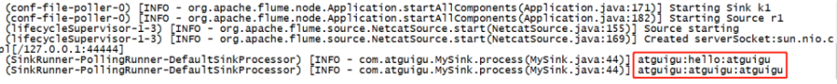

## 

# 第 4 章 企业真实面试题（重点）

## 4.1 你是如何实现 Flume 数据传输的监控的

使用第三方框架 Ganglia 实时监控 Flume。

## 4.2 Flume 的 Source，Sink，Channel 的作用？你们 Source 是什么类 型？

- 1）作用  

    - （1）Source 组件是专门用来收集数据的，可以处理各种类型、各种格式的日志数据， 包括 avro、thrift、exec、jms、spooling directory、netcat、sequence generator、syslog、 http、legacy
    - （2）Channel 组件对采集到的数据进行缓存，可以存放在 Memory 或 File 中。
    - （3）Sink 组件是用于把数据发送到目的地的组件，目的地包括 Hdfs、Logger、avro、 thrift、ipc、file、Hbase、solr、自定义。

- 2）我公司采用的 Source 类型为：
    - （1）监控后台日志：exec
    - （2）监控后台产生日志的端口：netcat

## 4.3 Flume 的 Channel Selectors

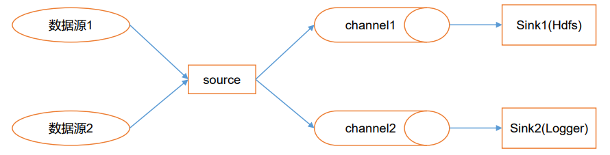
Channel Selectors，可以让不同的项目日志通过不同的Channel到不同的Sink中去。

官方文档上Channel Selectors 有两种类型:Replicating Channel Selector (default)和 Multiplexing Channel Selector

<font color="red">**这两种Selector的区别是:Replicating 会 将source过来的events发往所有channel,而 Multiplexing可以选择该发往哪些Channel。**</font>

## 4.4 Flume 参数调优

- 1）Source

    增加 Source 个（使用 Tair Dir Source 时可增加 FileGroups 个数）可以增大 Source 的读取数据的能力。例如：当某一个目录产生的文件过多时需要将这个文件目录拆分成多个 文件目录，同时配置好多个 Source 以保证 Source 有足够的能力获取到新产生的数据。

    batchSize 参数决定 Source 一次批量运输到 Channel 的 event 条数，适当调大这个参数可以提高 Source 搬运 Event 到 Channel 时的性能。

- 2）Channel

    type 选择 memory 时 Channel 的性能最好，但是如果 Flume 进程意外挂掉可能会丢失数据。type 选择 file 时 Channel 的容错性更好，但是性能上会比 memory channel 差。

    使用 file Channel 时 dataDirs 配置多个不同盘下的目录可以提高性能。

    Capacity 参数决定 Channel 可容纳最大的 event 条数。transactionCapacity 参数决定每次 Source 往 channel 里面写的最大 event 条数和每次 Sink 从 channel 里面读的最大 event 条数。**transactionCapacity 需要大于 Source 和 Sink 的 batchSize 参数。**

- 3）Sink 

    增加 Sink 的个数可以增加 Sink 消费 event 的能力。Sink 也不是越多越好够用就行，过多的 Sink 会占用系统资源，造成系统资源不必要的浪费。

    batchSize 参数决定 Sink 一次批量从 Channel 读取的 event 条数，适当调大这个参数可以提高 Sink 从 Channel 搬出 event 的性能。

## 4.5 Flume 的事务机制

Flume 的事务机制（类似数据库的事务机制）：Flume 使用两个独立的事务分别负责从 Soucrce 到 Channel，以及从 Channel 到 Sink 的事件传递。

比如 spooling directory source 为文件的每一行创建一个事件，一旦事务中所有的事件全部传递到 Channel 且提交成功，那么 Soucrce 就将该文件标记为完成。

同理，事务以类似的方式处理从 Channel 到 Sink 的传递过程，如果因为某种原因使得事件无法记录，那么事务将会回滚。且所有的事件都会保持到 Channel 中，等待重新传递。

## 4.6 Flume 采集数据会丢失吗?

根据 Flume 的架构原理，Flume 是不可能丢失数据的，其内部有完善的事务机制， Source 到 Channel 是事务性的，Channel 到 Sink 是事务性的，因此这两个环节不会出现数据的丢失，唯一可能丢失数据的情况是 Channel 采用 memoryChannel，agent 宕机导致数据丢失，或者 Channel 存储数据已满，导致 Source 不再写入，未写入的数据丢失。

**Flume 不会丢失数据，但是有可能造成数据的重复，例如数据已经成功由 Sink 发出， 但是没有接收到响应，Sink 会再次发送数据，此时可能会导致数据的重复**
