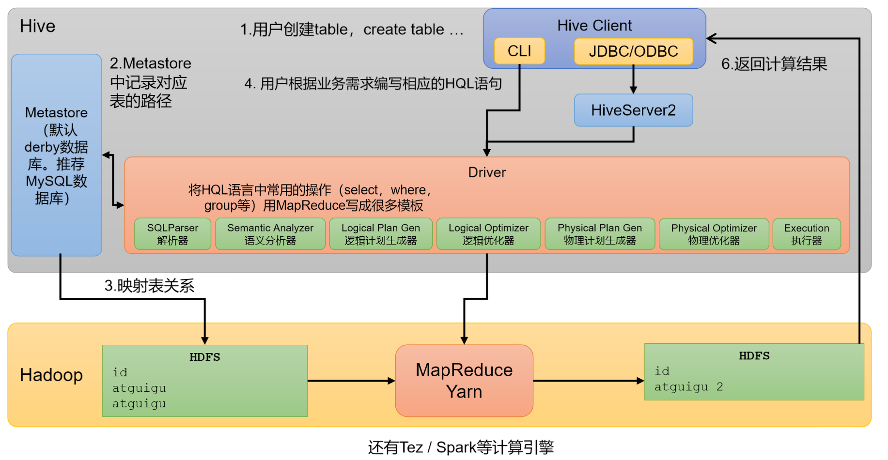
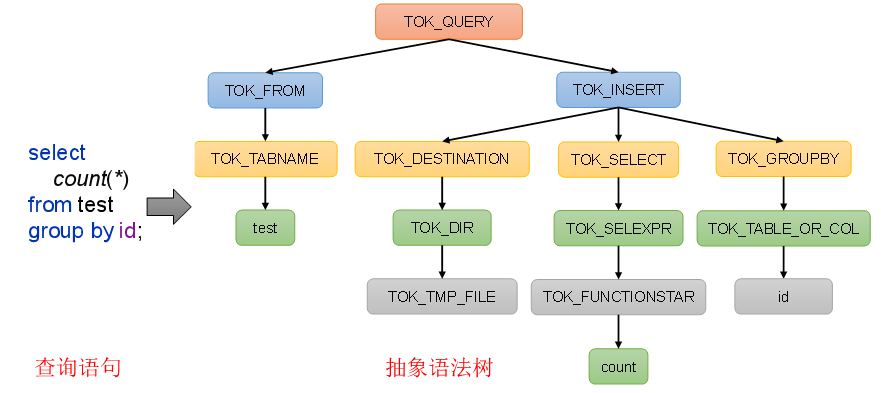
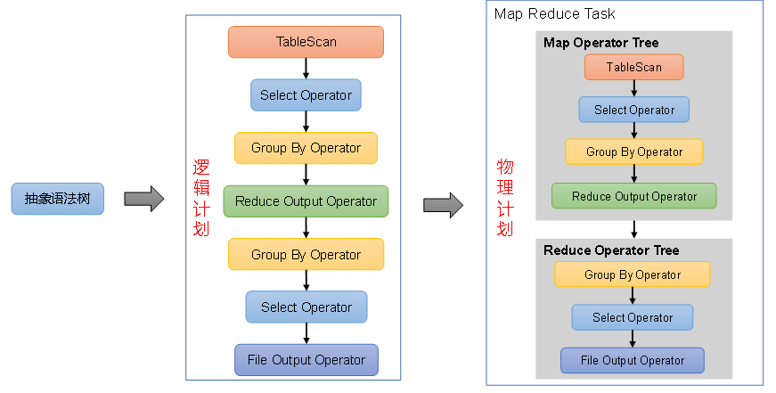
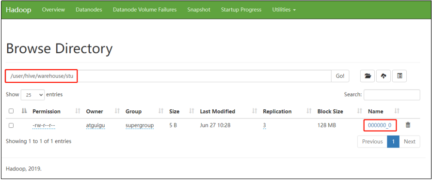
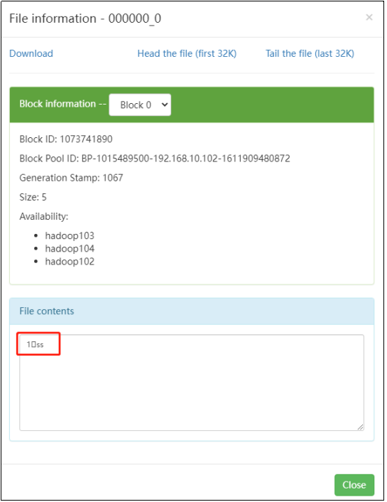
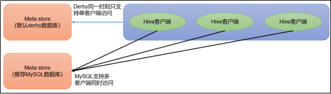
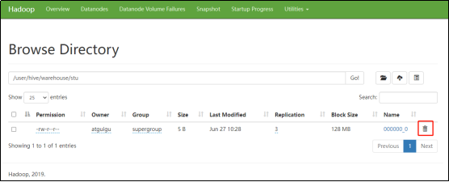
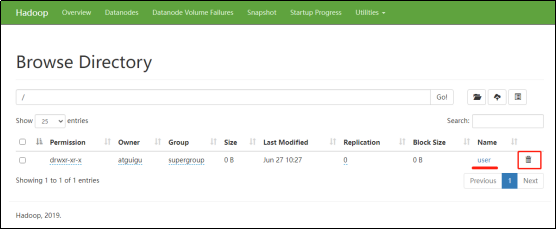

# **第1章** **Hive**入门

## 1.1 什么是Hive

### 1）Hive简介

Hive是由Facebook开源，基于Hadoop的一个**数据仓库工具**，可以将结构化的数据文件映射为一张表，并提供类SQL查询功能。

那为什么会有Hive呢？它是为了解决什么问题而诞生的呢？

下面通过一个案例，来快速了解一下Hive。

例如：需求，统计单词出现个数。

1）在Hadoop课程中我们用MapReduce程序实现的，当时需要写Mapper、Reducer和Driver三个类，并实现对应逻辑，相对繁琐。

```
test表
id列

atguigu
atguigu
ss
ss
jiao
banzhang
xue
hadoop
```

（2）如果通过Hive SQL实现，一行就搞定了，简单方便，容易理解。

2）Hive本质

Hive是一个Hadoop客户端，用于将**HQL（Hive SQL）转化成MapReduce程序。**

（1）Hive中每张表的数据存储在HDFS

（2）Hive分析数据底层的实现是MapReduce（也可配置为Spark或者Tez） 

（3）执行程序运行在Yarn上

## **1.2 Hive架构原理**



### 1）用户接口：Client

CLI（command-line interface）、JDBC/ODBC。

说明：JDBC和ODBC的区别。

（1）JDBC的移植性比ODBC好；（通常情况下，安装完ODBC驱动程序之后，还需要经过确定的配置才能够应用。而不相同的配置在不相同数据库服务器之间不能够通用。所以，安装一次就需要再配置一次。JDBC只需要选取适当的JDBC数据库驱动程序，就不需要额外的配置。在安装过程中，JDBC数据库驱动程序会自己完成有关的配置。）

（2）两者使用的语言不同，JDBC在Java编程时使用，ODBC一般在C/C++编程时使用。

### 2）元数据：Metastore

元数据包括：数据库（默认是default）、表名、表的拥有者、列/分区字段、表的类型（是否是外部表）、表的数据所在目录等。

默认存储在**自带的derby数据库**中，由于derby数据库只支持单客户端访问，生产环境中为了多人开发，推荐使用MySQL存储Metastore。

### 3）驱动器：Driver

（1）解析器（SQLParser）：将SQL字符串转换成抽象语法树（AST）

（2）语义分析（Semantic Analyzer）：将AST进一步划分为QeuryBlock

（3）逻辑计划生成器（Logical Plan Gen）：将语法树生成逻辑计划

（4）逻辑优化器（Logical Optimizer）：对逻辑计划进行优化

（5）物理计划生成器（Physical Plan Gen）：根据优化后的逻辑计划生成物理计划

（6）物理优化器（Physical Optimizer）：对物理计划进行优化

（7）执行器（Execution）：执行该计划，得到查询结果并返回给客户端





### 4）Hadoop

使用HDFS进行存储，可以选择MapReduce/Tez/Spark进行计算。

# 第2章 Hive安装

## **2.1 Hive安装地址**

1）Hive官网地址

http://hive.apache.org/

2）文档查看地址

https://cwiki.apache.org/confluence/display/Hive/GettingStarted

3）下载地址

http://archive.apache.org/dist/hive/

4）github地址

https://github.com/apache/hive

## 2.2 Hive安装部署

### 2.2.1 安装Hive

1）把apache-hive-3.1.3-bin.tar.gz上传到Linux的/opt/software目录下

2）解压apache-hive-3.1.3-bin.tar.gz到/opt/module/目录下面

```
[atguigu@hadoop102 software]$ tar -zxvf /opt/software/apache-hive-3.1.3-bin.tar.gz -C /opt/module/
```

3）修改apache-hive-3.1.3-bin.tar.gz的名称为hive

```
[atguigu@hadoop102 software]$ mv /opt/module/apache-hive-3.1.3-bin/ /opt/module/hive
```

4）修改/etc/profile.d/my_env.sh，添加环境变量

```
[atguigu@hadoop102 software]$ sudo vim /etc/profile.d/my_env.sh
```

（1）添加内容

```
#HIVE_HOME
export HIVE_HOME=/opt/module/hive
export PATH=$PATH:$HIVE_HOME/bin
```

（2）source一下

```
[atguigu@hadoop102 hive]$ source /etc/profile.d/my_env.sh
```

5）初始化元数据库（默认是derby数据库）

```
[atguigu@hadoop102 hive]$ bin/schematool -dbType derby -initSchema
```

### 2.2.2 启动并使用Hive

1）启动Hive

```
[atguigu@hadoop102 hive]$ bin/hive
```

2）使用Hive

```
hive> show databases;
hive> show tables;
hive> create table stu(id int, name string);
hive> insert into stu values(1,"ss");
hive> select * from stu;
```

观察HDFS的路径/user/hive/warehouse/stu，体会Hive与Hadoop之间的关系。

Hive中的表在Hadoop中是目录；Hive中的数据在Hadoop中是文件。





3）在Xshell窗口中开启另一个窗口开启Hive，在/tmp/atguigu目录下监控hive.log文件

```
[atguigu@hadoop102 atguigu]$ tail -f hive.log


Caused by: ERROR XSDB6: Another instance of Derby may have already booted the database /opt/module/hive/metastore_db.
        at org.apache.derby.iapi.error.StandardException.newException(Unknown Source)
        at org.apache.derby.iapi.error.StandardException.newException(Unknown Source)
        at org.apache.derby.impl.store.raw.data.BaseDataFileFactory.privGetJBMSLockOnDB(Unknown Source)
        at org.apache.derby.impl.store.raw.data.BaseDataFileFactory.run(Unknown Source)
...
```

> 原因在于Hive默认使用的元数据库为derby。derby数据库的特点是同一时间只允许一个客户端访问。如果多个Hive客户端同时访问，就会报错。由于在企业开发中，都是多人协作开发，需要多客户端同时访问Hive，怎么解决呢？我们可以将Hive的元数据改为用MySQL存储，MySQL支持多客户端同时访问。



4）首先退出hive客户端。然后在Hive的安装目录下将derby.log和metastore_db删除，顺便将HDFS上目录删除

```
hive> quit;
[atguigu@hadoop102 hive]$ rm -rf derby.log metastore_db
[atguigu@hadoop102 hive]$ hadoop fs -rm -r /user
```

5）删除HDFS中/user/hive/warehouse/stu中数据





## **2.3 MySQL安装**

### 2.3.1 安装MySQL

1）上传MySQL安装包以及MySQL驱动jar包

```
mysql-5.7.28-1.el7.x86_64.rpm-bundle.tar
mysql-connector-java-5.1.37.jar
```

2）解压MySQL安装包

```
[atguigu@hadoop102 software]$ mkdir mysql_lib
[atguigu@hadoop102 software]$ tar -xf mysql-5.7.28-1.el7.x86_64.rpm-bundle.tar -C mysql_lib/
```

3）卸载系统自带的mariadb

```
[atguigu@hadoop102 ~]$ sudo rpm -qa | grep mariadb | xargs sudo rpm -e --nodeps
```

4）安装MySQL依赖

```
[atguigu@hadoop102 software]$ cd mysql_lib
[atguigu@hadoop102 mysql_lib]$ sudo rpm -ivh mysql-community-common-5.7.28-1.el7.x86_64.rpm
[atguigu@hadoop102 mysql_lib]$ sudo rpm -ivh mysql-community-libs-5.7.28-1.el7.x86_64.rpm
[atguigu@hadoop102 mysql_lib]$ sudo rpm -ivh mysql-community-libs-compat-5.7.28-1.el7.x86_64.rpm
```

5）安装mysql-client

```
[atguigu@hadoop102 mysql_lib]$ sudo rpm -ivh mysql-community-client-5.7.28-1.el7.x86_64.rpm
```

6）安装mysql-server

```
[atguigu@hadoop102 mysql_lib]$ sudo rpm -ivh mysql-community-server-5.7.28-1.el7.x86_64.rpm
```

> 注意：若出现以下错误

```
warning: 05_mysql-community-server-5.7.16-1.el7.x86_64.rpm: Header V3 DSA/SHA1 Signature, key ID 5072e1f5: NOKEY
error: Failed dependencies:
libaio.so.1()(64bit) is needed by mysql-community-server-5.7.16-1.el7.x86_64
```

解决办法：

```
[atguigu@hadoop102 software]$ sudo yum -y install libaio
```

7）启动MySQL

```
[atguigu@hadoop102 software]$ sudo systemctl start mysqld
```

8）查看MySQL密码

```
[atguigu@hadoop102 software]$ sudo cat /var/log/mysqld.log | grep password
```

### 2.3.2 配置MySQL
