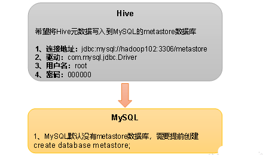
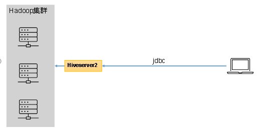
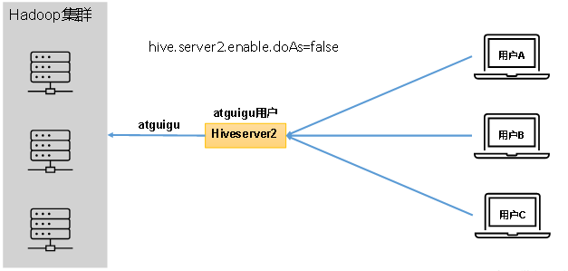
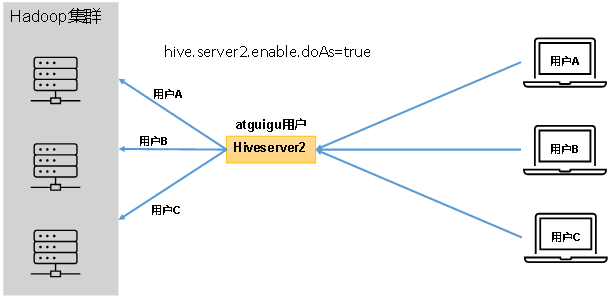
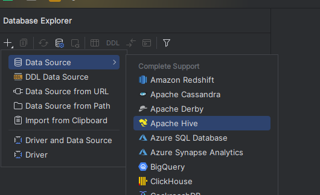
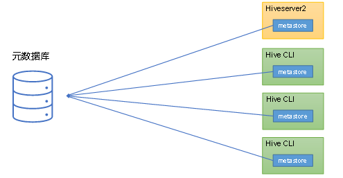
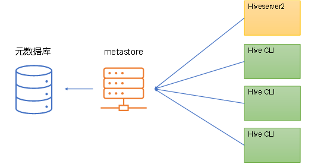

# **第1章** **Hive**入门

## 1.1 什么是Hive

### 1）Hive简介

Hive是由Facebook开源，基于Hadoop的一个**数据仓库工具**，可以将结构化的数据文件映射为一张表，并提供类SQL查询功能。

那为什么会有Hive呢？它是为了解决什么问题而诞生的呢？

下面通过一个案例，来快速了解一下Hive。

例如：需求，统计单词出现个数。

1）在Hadoop课程中我们用MapReduce程序实现的，当时需要写Mapper、Reducer和Driver三个类，并实现对应逻辑，相对繁琐。

```
test表
id列

atguigu
atguigu
ss
ss
jiao
banzhang
xue
hadoop
```

（2）如果通过Hive SQL实现，一行就搞定了，简单方便，容易理解。

2）Hive本质

Hive是一个Hadoop客户端，用于将**HQL（Hive SQL）转化成MapReduce程序。**

（1）Hive中每张表的数据存储在HDFS

（2）Hive分析数据底层的实现是MapReduce（也可配置为Spark或者Tez） 

（3）执行程序运行在Yarn上

## **1.2 Hive架构原理**


### 1）用户接口：Client

CLI（command-line interface）、JDBC/ODBC。

说明：JDBC和ODBC的区别。

（1）JDBC的移植性比ODBC好；（通常情况下，安装完ODBC驱动程序之后，还需要经过确定的配置才能够应用。而不相同的配置在不相同数据库服务器之间不能够通用。所以，安装一次就需要再配置一次。JDBC只需要选取适当的JDBC数据库驱动程序，就不需要额外的配置。在安装过程中，JDBC数据库驱动程序会自己完成有关的配置。）

（2）两者使用的语言不同，JDBC在Java编程时使用，ODBC一般在C/C++编程时使用。

### 2）元数据：Metastore

元数据包括：数据库（默认是default）、表名、表的拥有者、列/分区字段、表的类型（是否是外部表）、表的数据所在目录等。

默认存储在**自带的derby数据库**中，由于derby数据库只支持单客户端访问，生产环境中为了多人开发，推荐使用MySQL存储Metastore。

### 3）驱动器：Driver

（1）解析器（SQLParser）：将SQL字符串转换成抽象语法树（AST）

（2）语义分析（Semantic Analyzer）：将AST进一步划分为QeuryBlock

（3）逻辑计划生成器（Logical Plan Gen）：将语法树生成逻辑计划

（4）逻辑优化器（Logical Optimizer）：对逻辑计划进行优化

（5）物理计划生成器（Physical Plan Gen）：根据优化后的逻辑计划生成物理计划

（6）物理优化器（Physical Optimizer）：对物理计划进行优化

（7）执行器（Execution）：执行该计划，得到查询结果并返回给客户端


### 4）Hadoop

使用HDFS进行存储，可以选择MapReduce/Tez/Spark进行计算。

# 第2章 Hive安装

## **2.1 Hive安装地址**

1）Hive官网地址

http://hive.apache.org/

2）文档查看地址

https://cwiki.apache.org/confluence/display/Hive/GettingStarted

3）下载地址

http://archive.apache.org/dist/hive/

4）github地址

https://github.com/apache/hive

## 2.2 Hive安装部署

### 2.2.1 安装Hive

1）把apache-hive-3.1.3-bin.tar.gz上传到Linux的/opt/software目录下

2）解压apache-hive-3.1.3-bin.tar.gz到/opt/module/目录下面

```
[atguigu@hadoop102 software]$ tar -zxvf /opt/software/apache-hive-3.1.3-bin.tar.gz -C /opt/module/
```

3）修改apache-hive-3.1.3-bin.tar.gz的名称为hive

```
[atguigu@hadoop102 software]$ mv /opt/module/apache-hive-3.1.3-bin/ /opt/module/hive
```

4）修改/etc/profile.d/my_env.sh，添加环境变量

```
[atguigu@hadoop102 software]$ sudo vim /etc/profile.d/my_env.sh
```

（1）添加内容

```
#HIVE_HOME
export HIVE_HOME=/opt/module/hive
export PATH=$PATH:$HIVE_HOME/bin
```

（2）source一下

```
[atguigu@hadoop102 hive]$ source /etc/profile.d/my_env.sh
```

5）初始化元数据库（默认是derby数据库）

```
[atguigu@hadoop102 hive]$ bin/schematool -dbType derby -initSchema
```

### 2.2.2 启动并使用Hive

1）启动Hive

```
[atguigu@hadoop102 hive]$ bin/hive
```

2）使用Hive

```
hive> show databases;
hive> show tables;
hive> create table stu(id int, name string);
hive> insert into stu values(1,"ss");
hive> select * from stu;
```

观察HDFS的路径/user/hive/warehouse/stu，体会Hive与Hadoop之间的关系。

Hive中的表在Hadoop中是目录；Hive中的数据在Hadoop中是文件。


3）在Xshell窗口中开启另一个窗口开启Hive，在/tmp/atguigu目录下监控hive.log文件

```
[atguigu@hadoop102 atguigu]$ tail -f hive.log


Caused by: ERROR XSDB6: Another instance of Derby may have already booted the database /opt/module/hive/metastore_db.
        at org.apache.derby.iapi.error.StandardException.newException(Unknown Source)
        at org.apache.derby.iapi.error.StandardException.newException(Unknown Source)
        at org.apache.derby.impl.store.raw.data.BaseDataFileFactory.privGetJBMSLockOnDB(Unknown Source)
        at org.apache.derby.impl.store.raw.data.BaseDataFileFactory.run(Unknown Source)
...
```

> 原因在于Hive默认使用的元数据库为derby。derby数据库的特点是同一时间只允许一个客户端访问。如果多个Hive客户端同时访问，就会报错。由于在企业开发中，都是多人协作开发，需要多客户端同时访问Hive，怎么解决呢？我们可以将Hive的元数据改为用MySQL存储，MySQL支持多客户端同时访问。


4）首先退出hive客户端。然后在Hive的安装目录下将derby.log和metastore_db删除，顺便将HDFS上目录删除

```
hive> quit;
[atguigu@hadoop102 hive]$ rm -rf derby.log metastore_db
[atguigu@hadoop102 hive]$ hadoop fs -rm -r /user
```

5）删除HDFS中/user/hive/warehouse/stu中数据


## **2.3 MySQL安装**

### 2.3.1 安装MySQL

1）上传MySQL安装包以及MySQL驱动jar包

```
mysql-5.7.28-1.el7.x86_64.rpm-bundle.tar
mysql-connector-java-5.1.37.jar
```

2）解压MySQL安装包

```
[atguigu@hadoop102 software]$ mkdir mysql_lib
[atguigu@hadoop102 software]$ tar -xf mysql-5.7.28-1.el7.x86_64.rpm-bundle.tar -C mysql_lib/
```

3）卸载系统自带的mariadb

```
[atguigu@hadoop102 ~]$ sudo rpm -qa | grep mariadb | xargs sudo rpm -e --nodeps
```

4）安装MySQL依赖

```
[atguigu@hadoop102 software]$ cd mysql_lib
[atguigu@hadoop102 mysql_lib]$ sudo rpm -ivh mysql-community-common-5.7.28-1.el7.x86_64.rpm
[atguigu@hadoop102 mysql_lib]$ sudo rpm -ivh mysql-community-libs-5.7.28-1.el7.x86_64.rpm
[atguigu@hadoop102 mysql_lib]$ sudo rpm -ivh mysql-community-libs-compat-5.7.28-1.el7.x86_64.rpm
```

5）安装mysql-client

```
[atguigu@hadoop102 mysql_lib]$ sudo rpm -ivh mysql-community-client-5.7.28-1.el7.x86_64.rpm
```

6）安装mysql-server

```
[atguigu@hadoop102 mysql_lib]$ sudo rpm -ivh mysql-community-server-5.7.28-1.el7.x86_64.rpm
```

> 注意：若出现以下错误

```
warning: 05_mysql-community-server-5.7.16-1.el7.x86_64.rpm: Header V3 DSA/SHA1 Signature, key ID 5072e1f5: NOKEY
error: Failed dependencies:
libaio.so.1()(64bit) is needed by mysql-community-server-5.7.16-1.el7.x86_64
```

解决办法：

```
[atguigu@hadoop102 software]$ sudo yum -y install libaio
```

7）启动MySQL

```
[atguigu@hadoop102 software]$ sudo systemctl start mysqld
```

8）查看MySQL密码

```
[atguigu@hadoop102 software]$ sudo cat /var/log/mysqld.log | grep password
```

### 2.3.2 配置MySQL

配置主要是root用户 + 密码，在任何主机上都能登录MySQL数据库。

1）用刚刚查到的密码进入MySQL（如果报错，给密码加单引号）

```
[atguigu@hadoop102 software]$ mysql -uroot -p'password'
```

2）设置复杂密码（由于MySQL密码策略，此密码必须足够复杂）

```
mysql> set password=password("Qs23=zs32");
```

3）更改MySQL密码策略

```
mysql> set global validate_password_policy=0;
mysql> set global validate_password_length=4;
```

4）设置简单好记的密码

```
mysql> set password=password("123456");
```

5）进入MySQL库

```
mysql> use mysql
```

6）查询user表

```
mysql> select user, host from user;
```

7）修改user表，把Host表内容修改为%

```
mysql> update user set host="%" where user="root";
```

8）刷新

```
mysql> flush privileges;
```

9）退出

```
mysql> quit;
```

### **2.3.3** **卸载MySQL说明**

> 若因为安装失败或者其他原因，MySQL需要卸载重装，可参考以下内容。

（1）清空原有数据

①通过/etc/my.cnf查看MySQL数据的存储位置

```
[atguigu@hadoop102 software]$ sudo cat /etc/my.cnf
[mysqld]
datadir=/var/lib/mysql
```

②去往/var/lib/mysql路径需要root权限

```
[atguigu@hadoop102 mysql]$ su - root
[root@hadoop102 ~]# cd /var/lib/mysql
[root@hadoop102 mysql]# rm -rf *  （注意敲击命令的位置）
```

（2）卸载MySQL相关包

①查看安装过的MySQL相关包

```
[atguigu@hadoop102 software]$ sudo rpm -qa | grep -i -E mysql

mysql-community-libs-5.7.16-1.el7.x86_64
mysql-community-client-5.7.16-1.el7.x86_64
mysql-community-common-5.7.16-1.el7.x86_64
mysql-community-libs-compat-5.7.16-1.el7.x86_64
mysql-community-server-5.7.16-1.el7.x86_64
```

②一键卸载命令

```
[atguigu@hadoop102 software]$ rpm -qa | grep -i -E mysql\|mariadb | xargs -n1 sudo rpm -e --nodeps
```

## 2.4 配置Hive元数据存储到MySQL



### 2.4.1 配置元数据到MySQL

1）新建Hive元数据库

```
#登录MySQL
[atguigu@hadoop102 software]$ mysql -uroot -p123456

#创建Hive元数据库
mysql> create database metastore;
mysql> quit;
```

2）将MySQL的JDBC驱动拷贝到Hive的lib目录下。

```
[atguigu@hadoop102 software]$ cp /opt/software/mysql-connector-java-5.1.37.jar $HIVE_HOME/lib
```

3）在$HIVE_HOME/conf目录下新建hive-site.xml文件

```
[atguigu@hadoop102 software]$ vim $HIVE_HOME/conf/hive-site.xml
```

添加如下内容：

```
<?xml version="1.0"?>
<?xml-stylesheet type="text/xsl" href="configuration.xsl"?>

<configuration>
    <!-- jdbc连接的URL -->
    <property>
        <name>javax.jdo.option.ConnectionURL</name>
        <value>jdbc:mysql://hadoop102:3306/metastore?useSSL=false</value>
    </property>
    
    <!-- jdbc连接的Driver-->
    <property>
            <name>javax.jdo.option.ConnectionDriverName</name>
        <value>com.mysql.jdbc.Driver</value>
    </property>
    
	<!-- jdbc连接的username-->
    <property>
        <name>javax.jdo.option.ConnectionUserName</name>
        <value>root</value>
    </property>

    <!-- jdbc连接的password -->
    <property>
        <name>javax.jdo.option.ConnectionPassword</name>
        <value>123456</value>
    </property>

    <!-- Hive默认在HDFS的工作目录 -->
    <property>
        <name>hive.metastore.warehouse.dir</name>
        <value>/user/hive/warehouse</value>
    </property>
</configuration>
```

5）初始化Hive元数据库（修改为采用MySQL存储元数据）

```
[atguigu@hadoop102 hive]$ bin/schematool -dbType mysql -initSchema -verbose


beeline>
beeline> Initialization script completed
schemaTool completed
```

### 2.4.2 验证元数据是否配置成功

1）再次启动Hive

```
[atguigu@hadoop102 hive]$ bin/hive
```

2）使用Hive

```
hive> show databases;
hive> show tables;
hive> create table stu(id int, name string);
hive> insert into stu values(1,"ss");
hive> select * from stu;
```

3）在Xshell窗口中开启另一个窗口开启Hive（两个窗口都可以操作Hive，没有出现异常）

```
hive> show databases;
hive> show tables;
hive> select * from stu;
```

### 2.4.3 查看MySQL中的元数据

1）登录MySQL

```
[atguigu@hadoop102 hive]$ mysql -uroot -p123456
```

2）查看元数据库metastore

```
mysql> show databases;
mysql> use metastore;
mysql> show tables;
mysql> select * from DBS;
+-------+-----------------------+-------------------------------------------+---------+------------+------------+-----------+
| DB_ID | DESC                  | DB_LOCATION_URI                           | NAME    | OWNER_NAME | OWNER_TYPE | CTLG_NAME |
+-------+-----------------------+-------------------------------------------+---------+------------+------------+-----------+
|     1 | Default Hive database | hdfs://hadoop102:8020/user/hive/warehouse | default | public     | ROLE       | hive      |
+-------+-----------------------+-------------------------------------------+---------+------------+------------+-----------+
```

（2）查看元数据库中存储的表信息

```
mysql> select * from TBLS;
+--------+-------------+-------+------------------+---------+------------+-----------+-------+----------+---------------+
| TBL_ID | CREATE_TIME | DB_ID | LAST_ACCESS_TIME | OWNER   | OWNER_TYPE | RETENTION | SD_ID | TBL_NAME | TBL_TYPE      | 
+--------+-------------+-------+------------------+---------+------------+-----------+-------+----------+---------------+
|      1 |  1656318303 |     1 |                0 | atguigu | USER       |         0 |     1 | stu      | MANAGED_TABLE |
+--------+-------------+-------+------------------+---------+------------+-----------+-------+----------+---------------+
```

（3）查看元数据库中存储的表中列相关信息

```
mysql> select * from COLUMNS_V2;
+-------+----------+---------+------------+-------------+-------------+--------+
| CS_ID | CAT_NAME | DB_NAME | TABLE_NAME | COLUMN_NAME | COLUMN_TYPE | TBL_ID |
+-------+----------+---------+------------+-------------+-------------+--------+
|     1 | hive     | default | stu        | id          | int         |      1 |
|     2 | hive     | default | stu        | name        | string      |      1 |
+-------+----------+---------+------------+-------------+-------------+--------+
```

## 2.5 Hive服务部署

### 2.5.1 hiveserver2服务

Hive的hiveserver2服务的作用是提供jdbc/odbc接口，为用户提供远程访问Hive数据的功能，例如用户期望在个人电脑中访问远程服务中的Hive数据，就需要用到Hiveserver2。



#### 1）用户说明

在远程访问Hive数据时，客户端并未直接访问Hadoop集群，而是由Hivesever2代理访问。由于Hadoop集群中的数据具备访问权限控制，所以此时需考虑一个问题：那就是访问Hadoop集群的用户身份是谁？是Hiveserver2的启动用户？还是客户端的登录用户？

答案是都有可能，具体是谁，由Hiveserver2的`hive.server2.enable.doAs`参数决定，该参数的含义是是否启用Hiveserver2用户模拟的功能。若启用，则Hiveserver2会模拟成客户端的登录用户去访问Hadoop集群的数据，不启用，则Hivesever2会直接使用启动用户访问Hadoop集群数据。模拟用户的功能，默认是开启的。

具体逻辑如下：

未开启用户模拟功能：



开启用户模拟功能：



生产环境，推荐开启用户模拟功能，因为开启后才能保证各用户之间的权限隔离。

#### 2）hiveserver2部署

（1）Hadoop端配置

hivesever2的模拟用户功能，依赖于Hadoop提供的proxy user（代理用户功能），只有Hadoop中的代理用户才能模拟其他用户的身份访问Hadoop集群。因此，需要**将hiveserver2的启动用户设置为Hadoop的代理用户**，配置方式如下：

```
[atguigu@hadoop102 ~]$ cd $HADOOP_HOME/etc/hadoop
[atguigu@hadoop102 hadoop]$ vim core-site.xml
```

增加如下配置：

```
<!--配置所有节点的atguigu用户都可作为代理用户-->
<property>
    <name>hadoop.proxyuser.atguigu.hosts</name>
    <value>*</value>
</property>

<!--配置atguigu用户能够代理的用户组为任意组-->
<property>
    <name>hadoop.proxyuser.atguigu.groups</name>
    <value>*</value>
</property>
<!--配置atguigu用户能够代理的用户为任意用户-->
<property>
    <name>hadoop.proxyuser.atguigu.users</name>
    <value>*</value>
</property>
```

（2）Hive端配置

在hive-site.xml文件中添加如下配置信息

```
[atguigu@hadoop102 conf]$ vim hive-site.xml

<!-- 指定hiveserver2连接的host -->
<property>
	<name>hive.server2.thrift.bind.host</name>
	<value>hadoop102</value>
</property>

<!-- 指定hiveserver2连接的端口号 -->
<property>
	<name>hive.server2.thrift.port</name>
	<value>10000</value>
</property>
```

3）测试

（1）启动hiveserver2

```
[atguigu@hadoop102 hive]$ bin/hive --service hiveserver2
```

（2）使用命令行客户端beeline进行远程访问

启动beeline客户端

```
[atguigu@hadoop102 hive]$ bin/beeline -u jdbc:hive2://hadoop102:10000 -n atguigu
```

看到如下界面

```
Connecting to jdbc:hive2://hadoop102:10000
Connected to: Apache Hive (version 3.1.3)
Driver: Hive JDBC (version 3.1.3)
Transaction isolation: TRANSACTION_REPEATABLE_READ
Beeline version 3.1.3 by Apache Hive
0: jdbc:hive2://hadoop102:10000>
```

（3）使用Datagrip图形化客户端进行远程访问



> **错误：**
>
> [ 08S01] Could not open client transport with JDBC Uri: jdbc:hive2://192.168.1.100:10000: Failed to open new session: java.lang.RuntimeException: org.apache.hadoop.ipc.RemoteException(org.apache.hadoop.security.authorize.AuthorizationException): User: root is not allowed to impersonate atguigu org.apache.hadoop.ipc.RemoteException:User: root is not allowed to impersonate atguigu
>
> https://code84.com/744774.html

hive使用 atguigu 用户启动

### 2.5.2 metastore服务

Hive的metastore服务的作用是为Hive CLI或者Hiveserver2提供元数据访问接口。

#### 1）metastore运行模式

metastore有两种运行模式，分别为嵌入式模式和独立服务模式。下面分别对两种模式进行说明：

（1）嵌入式模式



（2）独立服务模式



生产环境中，不推荐使用嵌入式模式。因为其存在以下两个问题：

（1）嵌入式模式下，每个Hive CLI都需要直接连接元数据库，当Hive CLI较多时，数据库压力会比较大。

（2）每个客户端都需要用户元数据库的读写权限，元数据库的安全得不到很好的保证。

#### 2）metastore部署

（1）嵌入式模式

嵌入式模式下，只需保证Hiveserver2和每个Hive CLI的配置文件hive-site.xml中包含连接元数据库所需要的以下参数即可：

```
 	<!-- jdbc连接的URL -->
    <property>
        <name>javax.jdo.option.ConnectionURL</name>
        <value>jdbc:mysql://hadoop102:3306/metastore?useSSL=false</value>
    </property>
    
    <!-- jdbc连接的Driver-->
    <property>
        <name>javax.jdo.option.ConnectionDriverName</name>
        <value>com.mysql.cj.jdbc.Driver</value>
    </property>
    
	<!-- jdbc连接的username-->
    <property>
        <name>javax.jdo.option.ConnectionUserName</name>
        <value>root</value>
    </property>

    <!-- jdbc连接的password -->
    <property>
        <name>javax.jdo.option.ConnectionPassword</name>
        <value>123456</value>
    </property>
```

（2）独立服务模式

独立服务模式需做以下配置：

首先，保证metastore服务的配置文件hive-site.xml中包含连接元数据库所需的以下参数：

```
 <!-- jdbc连接的URL -->
    <property>
        <name>javax.jdo.option.ConnectionURL</name>
        <value>jdbc:mysql://hadoop102:3306/metastore?useSSL=false</value>
    </property>
    
    <!-- jdbc连接的Driver-->
    <property>
        <name>javax.jdo.option.ConnectionDriverName</name>
        <value>com.mysql.cj.jdbc.Driver</value>
    </property>
    
	<!-- jdbc连接的username-->
    <property>
        <name>javax.jdo.option.ConnectionUserName</name>
        <value>root</value>
    </property>

    <!-- jdbc连接的password -->
    <property>
        <name>javax.jdo.option.ConnectionPassword</name>
        <value>123456</value>
    </property>
    <!-- 指定hiveserver2连接的端口号 -->
    <property>
        <name>hive.server2.thrift.port</name>
        <value>10000</value>
    </property>
```

其次，保证Hiveserver2和每个Hive CLI的配置文件hive-site.xml中包含访问metastore服务所需的以下参数：

```
<!-- 指定metastore服务的地址 -->
<property>
	<name>hive.metastore.uris</name>
	<value>thrift://hadoop102:9083</value>
</property>
```

注意：主机名需要改为metastore服务所在节点，端口号无需修改，metastore服务的默认端口就是9083。

3）测试

此时启动Hive CLI，执行shou databases语句，会出现一下错误提示信息：

```
hive (default)> show databases;
FAILED: HiveException java.lang.RuntimeException: Unable to instantiate org.apache.hadoop.hive.ql.metadata.SessionHiveMetaStoreClient
```

这是因为我们在Hive CLI的配置文件中配置了hive.metastore.uris参数，此时Hive CLI会去请求我们执行的metastore服务地址，所以必须启动metastore服务才能正常使用。

metastore服务的启动命令如下：

```
[atguigu@hadoop202 hive]$ hive --service metastore
2022-04-24 16:58:08: Starting Hive Metastore Server
```

注意：启动后该窗口不能再操作，需打开一个新的Xshell窗口来对Hive操作。

重新启动 Hive CLI，并执行shou databases语句，就能正常访问了

```
[atguigu@hadoop202 hive]$ bin/hive
```

### 2.5.3 编写Hive服务启动脚本（了解）

**1）前台启动的方式导致需要打开多个Xshell窗口，可以使用如下方式后台方式启动**

- nohup：放在命令开头，表示不挂起，也就是关闭终端进程也继续保持运行状态

- /dev/null：是Linux文件系统中的一个文件，被称为黑洞，所有写入该文件的内容都会被自动丢弃

- 2>&1：表示将错误重定向到标准输出上
- Ø &：放在命令结尾，表示后台运行

一般会组合使用：nohup  [xxx命令操作]> file  2>&1 &，表示将xxx命令运行的结果输出到file中，并保持命令启动的进程在后台运行。

如上命令不要求掌握。

```
[atguigu@hadoop202 hive]$ nohup hive --service metastore 2>&1 &
[atguigu@hadoop202 hive]$ nohup hive --service hiveserver2 2>&1 &
```

**2）为了方便使用，可以直接编写脚本来管理服务的启动和关闭**

```
[atguigu@hadoop102 hive]$ vim $HIVE_HOME/bin/hiveservices.sh
```

内容如下：此脚本的编写不要求掌握。直接拿来使用即可。

```
#!/bin/bash

HIVE_LOG_DIR=$HIVE_HOME/logs
if [ ! -d $HIVE_LOG_DIR ]
then
	mkdir -p $HIVE_LOG_DIR
fi

#检查进程是否运行正常，参数1为进程名，参数2为进程端口
function check_process()
{
    pid=$(ps -ef 2>/dev/null | grep -v grep | grep -i $1 | awk '{print $2}')
    ppid=$(netstat -nltp 2>/dev/null | grep $2 | awk '{print $7}' | cut -d '/' -f 1)
    echo $pid
    [[ "$pid" =~ "$ppid" ]] && [ "$ppid" ] && return 0 || return 1
}

function hive_start()
{
    metapid=$(check_process HiveMetastore 9083)
    cmd="nohup hive --service metastore >$HIVE_LOG_DIR/metastore.log 2>&1 &"
    [ -z "$metapid" ] && eval $cmd || echo "Metastroe服务已启动"
    server2pid=$(check_process HiveServer2 10000)
    cmd="nohup hive --service hiveserver2 >$HIVE_LOG_DIR/hiveServer2.log 2>&1 &"
    [ -z "$server2pid" ] && eval $cmd || echo "HiveServer2服务已启动"
}

function hive_stop()
{
	metapid=$(check_process HiveMetastore 9083)
    [ "$metapid" ] && kill $metapid || echo "Metastore服务未启动"
    server2pid=$(check_process HiveServer2 10000)
    [ "$server2pid" ] && kill $server2pid || echo "HiveServer2服务未启动"
}

case $1 in
"start")
    hive_start
    ;;
"stop")
    hive_stop
    ;;
"restart")
    hive_stop
    sleep 2
    hive_start
    ;;
"status")
    check_process HiveMetastore 9083 >/dev/null && echo "Metastore服务运行正常" || echo "Metastore服务运行异常"
    check_process HiveServer2 10000 >/dev/null && echo "HiveServer2服务运行正常" || echo "HiveServer2服务运行异常"
    ;;
*)
    echo Invalid Args!
    echo 'Usage: '$(basename $0)' start|stop|restart|status'
    ;;
esac
```

**3）添加执行权限**

```
[atguigu@hadoop102 hive]$ chmod +x $HIVE_HOME/bin/hiveservices.sh
```

**4）启动Hive后台服务**

```
[atguigu@hadoop102 hive]$ hiveservices.sh start
```

## 2.6 Hive使用技巧

### **2.6.1 Hive常用交互命令**

```
[atguigu@hadoop102 hive]$ bin/hive -help
usage: hive
 -d,--define <key=value>          Variable subsitution to apply to hive
                                  commands. e.g. -d A=B or --define A=B
    --database <databasename>     Specify the database to use
 -e <quoted-query-string>         SQL from command line
 -f <filename>                      SQL from files
 -H,--help                        Print help information
    --hiveconf <property=value>   Use value for given property
    --hivevar <key=value>         Variable subsitution to apply to hive
                                  commands. e.g. --hivevar A=B
 -i <filename>                    Initialization SQL file
 -S,--silent                      Silent mode in interactive shell
 -v,--verbose                     Verbose mode (echo executed SQL to the console)
```

1）在Hive命令行里创建一个表student，并插入1条数据

```
hive (default)> create table student(id int,name string);
OK
Time taken: 1.291 seconds

hive (default)> insert into table student values(1,"zhangsan");
hive (default)> select * from student;
OK
student.id	student.name
1	zhangsan
Time taken: 0.144 seconds, Fetched: 1 row(s)
```

2）“-e”不进入hive的交互窗口执行hql语句

```
[atguigu@hadoop102 hive]$ bin/hive -e "select id from student;"
```

3）“-f”执行脚本中的hql语句

（1）在/opt/module/hive/下创建datas目录并在datas目录下创建hivef.sql文件

```
[atguigu@hadoop102 hive]$ mkdir datas
[atguigu@hadoop102 datas]$ vim hivef.sql
```

（2）文件中写入正确的hql语句

```
select * from student;
```

（3）执行文件中的hql语句

```
[atguigu@hadoop102 hive]$ bin/hive -f /opt/module/hive/datas/hivef.sql
```

（4）执行文件中的hql语句并将结果写入文件中

```
[atguigu@hadoop102 hive]$ bin/hive -f /opt/module/hive/datas/hivef.sql  > /opt/module/hive/datas/hive_result.txt
```

### 2.6.2 Hive参数配置方式

#### 1）查看当前所有的配置信息

```
hive>set;
```

#### 2）参数的配置三种方式

（1）配置文件方式

- 默认配置文件：hive-default.xml

- 用户自定义配置文件：hive-site.xml

    注意：**用户自定义配置会覆盖默认配置**。另外，Hive也会读入Hadoop的配置，**因为Hive是作为Hadoop的客户端启动的**，Hive的配置会覆盖Hadoop的配置。配置文件的设定对本机启动的所有Hive进程都有效。

（2）命令行参数方式

①启动Hive时，可以在命令行添加-hiveconf param=value来设定参数。例如：

```
[atguigu@hadoop103 hive]$ bin/hive -hiveconf
mapreduce.job.reduces=10;
```

注意：仅对本次Hive启动有效。

②查看参数设置

```
hive (default)> set mapreduce.job.reduces;
```

（3）参数声明方式

可以在HQL中使用SET关键字设定参数，例如：

```
hive(default)> set mapreduce.job.reduces=10;
```

> 注意：仅对本次Hive启动有效。

查看参数设置：

```
hive(default)> set mapreduce.job.reduces;
```

上述三种设定方式的优先级依次递增。即**配置文件 < 命令行参数< 参数声明 **。注意某些系统级的参数，例如log4j相关的设定，必须用前两种方式设定，因为那些参数的读取在会话建立以前已经完成了。

### 2.6.3 Hive常见属性配置

#### 1）Hive客户端显示当前库和表头

（1）在hive-site.xml中加入如下两个配置:

```
[atguigu@hadoop102 conf]$ vim hive-site.xml

<property>
    <name>hive.cli.print.header</name>
    <value>true</value>
    <description>Whether to print the names of the columns in query output.</description>
</property>
<property>
    <name>hive.cli.print.current.db</name>
    <value>true</value>
    <description>Whether to include the current database in the Hive prompt.</description>
</property>
```

（2）hive客户端在运行时可以显示当前使用的库和表头信息

```
[atguigu@hadoop102 conf]$ hive

hive (default)> select * from stu;
OK
stu.id	stu.name
1	ss
Time taken: 1.874 seconds, Fetched: 1 row(s)
hive (default)>
```

2）Hive运行日志路径配置

（1）Hive的log默认存放在/tmp/atguigu/hive.log目录下（当前用户名下）

```
[atguigu@hadoop102 atguigu]$ pwd
/tmp/atguigu
[atguigu@hadoop102 atguigu]$ ls
hive.log
hive.log.2022-06-27
```

（2）修改Hive的log存放日志到/opt/module/hive/logs

1修改$HIVE_HOME/conf/hive-log4j2.properties.template文件名称为 hive-log4j2.properties

```
[atguigu@hadoop102 conf]$ pwd
/opt/module/hive/conf

[atguigu@hadoop102 conf]$ mv hive-log4j2.properties.template hive-log4j2.properties
```

2在hive-log4j2.properties文件中修改log存放位置

```
[atguigu@hadoop102 conf]$ vim hive-log4j2.properties
```

修改配置如下

```
property.hive.log.dir=/opt/module/hive/logs
```

#### 3）Hive的JVM堆内存设置

新版本的Hive启动的时候，默认申请的JVM堆内存大小为256M，JVM堆内存申请的太小，导致后期开启本地模式，执行复杂的SQL时经常会报错：java.lang.OutOfMemoryError: Java heap space，因此最好提前调整一下HADOOP_HEAPSIZE这个参数。

（1）修改$HIVE_HOME/conf下的hive-env.sh.template为hive-env.sh

```
[atguigu@hadoop102 conf]$ pwd
/opt/module/hive/conf

[atguigu@hadoop102 conf]$ mv hive-env.sh.template hive-env.sh
```

（2）将hive-env.sh其中的参数 export HADOOP_HEAPSIZE修改为2048，重启Hive。
修改前

```
# The heap size of the jvm stared by hive shell script can be controlled via:
# export HADOOP_HEAPSIZE=1024
```

修改后

```
# The heap size of the jvm stared by hive shell script can be controlled via:
export HADOOP_HEAPSIZE=2048
```

4）关闭Hadoop虚拟内存检查

在yarn-site.xml中关闭虚拟内存检查（虚拟内存校验，如果已经关闭了，就不需要配了）。

（1）修改前记得先停Hadoop

```
[atguigu@hadoop102 hadoop]$ pwd
/opt/module/hadoop-3.1.3/etc/hadoop

[atguigu@hadoop102 hadoop]$ vim yarn-site.xml
```

（2）添加如下配置

```
<property>
    <name>yarn.nodemanager.vmem-check-enabled</name>
    <value>false</value>
</property>
```

（3）修改完后记得分发yarn-site.xml，并重启yarn。

# 第3章 DDL（Data Definition Language）数据定义

## 3.1 数据库（database）

### 3.1.1 创建数据库

#### 1）语法

```
CREATE DATABASE [IF NOT EXISTS] database_name
[COMMENT database_comment]
[LOCATION hdfs_path]
[WITH DBPROPERTIES (property_name=property_value, ...)];
```

2）案例

（1）创建一个数据库，不指定路径

```
hive (default)> create database db_hive1;
```

> 注：若不指定路径，其默认路径为${hive.metastore.warehouse.dir}/database_name.db

（2）创建一个数据库，指定路径

```
hive (default)> create database db_hive2 location '/db_hive2';
```

（3）创建一个数据库，带有dbproperties

```
hive (default)> create database db_hive3 with dbproperties('create_date'='2022-11-18');
```

### 3.1.2 查询数据库

#### 1）展示所有数据库

（1）语法

```
SHOW DATABASES [LIKE 'identifier_with_wildcards'];
```

注：like通配表达式说明：*表示任意个任意字符，|表示或的关系。

（2）案例

```
hive> show databases like 'db_hive*';
OK
db_hive_1
db_hive_2
```

#### 2）查看数据库信息

（1）语法

```
DESCRIBE DATABASE [EXTENDED] db_name;
```

（2）案例

1**查看基本信息**

```
hive> desc database db_hive3;
OK
db_hive		hdfs://hadoop102:8020/user/hive/warehouse/db_hive.db	atguigu	USER
```

查看更多信息

```
hive> desc database extended db_hive3;
OK
db_name	comment	location	owner_name	owner_type	parameters
db_hive3		hdfs://hadoop102:8020/user/hive/warehouse/db_hive3.db	atguigu	USER	{create_date=2022-11-18}
```

### 3.1.3 修改数据库

用户可以使用alter database命令修改数据库某些信息，其中能够修改的信息包括dbproperties、location、owner user。需要注意的是：修改数据库location，不会改变当前已有表的路径信息，而只是改变后续创建的新表的默认的父目录。

#### 1）语法

```
--修改dbproperties
ALTER DATABASE database_name SET DBPROPERTIES (property_name=property_value, ...);

--修改location
ALTER DATABASE database_name SET LOCATION hdfs_path;

--修改owner user
ALTER DATABASE database_name SET OWNER USER user_name;
```

2）案例

（1）修改dbproperties

```
hive> ALTER DATABASE db_hive3 SET DBPROPERTIES ('create_date'='2022-11-20');
```

### 3.1.4 删除数据库

#### 1）语法

```
DROP DATABASE [IF EXISTS] database_name [RESTRICT|CASCADE];
```

注：RESTRICT：严格模式，若数据库不为空，则会删除失败，默认为该模式。

  CASCADE：级联模式，若数据库不为空，则会将库中的表一并删除。

#### 2）案例

（1）删除空数据库

```
hive> drop database db_hive2;
```

（2）删除非空数据库

```
hive> drop database db_hive3 cascade;
```

### 3.1.5 切换当前数据库

1）语法

```
USE database_name;
```

## 3.2 表（table）

### 3.2.1 创建表

#### 3.2.1.1 语法

##### 1）普通建表

（1）完整语法

```
CREATE [TEMPORARY] [EXTERNAL] TABLE [IF NOT EXISTS] [db_name.]table_name   
[(col_name data_type [COMMENT col_comment], ...)]
[COMMENT table_comment]
[PARTITIONED BY (col_name data_type [COMMENT col_comment], ...)]
[CLUSTERED BY (col_name, col_name, ...) 
[SORTED BY (col_name [ASC|DESC], ...)] INTO num_buckets BUCKETS]
[ROW FORMAT row_format] 
[STORED AS file_format]
[LOCATION hdfs_path]
[TBLPROPERTIES (property_name=property_value, ...)]
```
（2）关键字说明：

- TEMPORARY

    临时表，该表只在当前会话可见，会话结束，表会被删除。

- EXTERNAL（重点）

    外部表，与之相对应的是内部表（管理表）。管理表意味着Hive会完全接管该表，包括元数据和HDFS中的数据。而外部表则意味着Hive只接管元数据，而不完全接管HDFS中的数据。

- data_type（重点）

    Hive中的字段类型可分为基本数据类型和复杂数据类型。

    基本数据类型如下：

    | **Hive**  | **说明**                                            | 定义          |
    | --------- | --------------------------------------------------- | ------------- |
    | tinyint   | 1byte有符号整数                                     |               |
    | smallint  | 2byte有符号整数                                     |               |
    | int       | 4byte有符号整数                                     |               |
    | bigint    | 8byte有符号整数                                     |               |
    | boolean   | 布尔类型，true或者false                             |               |
    | float     | 单精度浮点数                                        |               |
    | double    | 双精度浮点数                                        |               |
    | decimal   | 十进制精准数字类型                                  | decimal(16,2) |
    | varchar   | 字符序列，需指定最大长度，最大长度的范围是[1,65535] | varchar(32)   |
    | string    | 字符串，无需指定最大长度                            |               |
    | timestamp | 时间类型                                            |               |
    | binary    | 二进制数据                                          |               |
    
    复杂数据类型如下；
    
    | 类型   | 说明                                                     | 定义                        | 取值       |
    | ------ | -------------------------------------------------------- | --------------------------- | ---------- |
    | array  | 数组是一组相同类型的值的集合                             | array<string>               | arr[0]     |
    | map    | map是一组相同类型的键-值对集合                           | map<string, int>            | map['key'] |
    | struct | 结构体由多个属性组成，每个属性都有自己的属性名和数据类型 | struct<id:int, name:string> | struct.id  |
    
    注：类型转换
    
    Hive的基本数据类型可以做类型转换，转换的方式包括隐式转换以及显示转换。
    
    **方式一：隐式转换**
    
    具体规则如下：
    
    a. 任何整数类型都可以隐式地转换为一个范围更广的类型，如tinyint可以转换成int，int可以转换成bigint。
    
    b. 所有整数类型、float和string类型都可以隐式地转换成double。
    
    c. tinyint、smallint、int都可以转换为float。
    
    d. boolean类型不可以转换为任何其它的类型。
    
    详情可参考Hive官方说明：[Allowed Implicit Conversions](#LanguageManualTypes-AllowedImplicitConversions)
    
    **方式二：显示转换**
    
    可以借助cast函数完成显示的类型转换
    
    a.语法
    
    ```
    cast(expr as <type>) 
    ```
    
    b.案例
    
    ```
    hive (default)> select '1' + 2, cast('1' as int) + 2;
    
    _c0	   _c1
    3.0	    3
    ```
    
-  PARTITIONED BY（重点）
   
   创建分区表
   
- CLUSTERED BY ... SORTED BY...INTO ... BUCKETS（重点）
  
   创建分桶表
  
- ROW FORMAT（重点）
  
    指定SERDE，SERDE是Serializer and Deserializer的简写。Hive使用SERDE序列化和反序列化每行数据。详情可参考 [Hive-Serde](#DeveloperGuide-HiveSerDe)。语法说明如下：

**语法一**：DELIMITED关键字表示对文件中的每个字段按照特定分割符进行分割，其会使用默认的SERDE对每行数据进行序列化和反序列化。

```
ROW FORAMT DELIMITED 
[FIELDS TERMINATED BY char] 
[COLLECTION ITEMS TERMINATED BY char] 
[MAP KEYS TERMINATED BY char] 
[LINES TERMINATED BY char] 
[NULL DEFINED AS char]
```

注：

- fields terminated by ：列分隔符
- collection items terminated by ： map、struct和array中每个元素之间的分隔符
- map keys terminated by ：map中的key与value的分隔符
- lines terminated by ：行分隔符

**语法二**：SERDE关键字可用于指定其他内置的SERDE或者用户自定义的SERDE。例如JSON SERDE，可用于处理JSON字符串。

```
ROW FORMAT SERDE serde_name [WITH SERDEPROPERTIES (property_name=property_value,property_name=property_value, ...)] 
```

- STORED AS（重点）

指定文件格式，常用的文件格式有，textfile（默认值），sequence file，orc file、parquet file等等。

- LOCATION

    指定表所对应的HDFS路径，若不指定路径，其默认值为

    `${hive.metastore.warehouse.dir}/db_name.db/table_name`

- TBLPROPERTIES

    用于配置表的一些KV键值对参数

##### 2）Create Table As Select（CTAS）建表

该语法允许用户利用select查询语句返回的结果，直接建表，表的结构和查询语句的结构保持一致，且保证包含select查询语句放回的内容。

```
CREATE [TEMPORARY] TABLE [IF NOT EXISTS] table_name 
[COMMENT table_comment] 
[ROW FORMAT row_format] 
[STORED AS file_format] 
[LOCATION hdfs_path]
[TBLPROPERTIES (property_name=property_value, ...)]
[AS select_statement]
```

##### 3）Create Table Like语法

该语法允许用户复刻一张已经存在的表结构，与上述的CTAS语法不同，该语法创建出来的表中不包含数据。

```
CREATE [TEMPORARY] [EXTERNAL] TABLE [IF NOT EXISTS] [db_name.]table_name
[LIKE exist_table_name]
[ROW FORMAT row_format] 
[STORED AS file_format] 
[LOCATION hdfs_path]
[TBLPROPERTIES (property_name=property_value, ...)]
```

#### 3.2.1.2 案例

##### 1）内部表与外部表
