# 第12章 企业级调优

## 12.1 计算资源配置

本教程的计算环境为Hive on MR。计算资源的调整主要包括Yarn和MR。

### 12.1.1 Yarn资源配置

#### 1）Yarn配置说明

需要调整的Yarn参数均与CPU、内存等资源有关，核心配置参数如下

（1）yarn.nodemanager.resource.memory-mb

该参数的含义是，一个NodeManager节点分配给Container使用的内存。该参数的配置，取决于NodeManager所在节点的总内存容量和该节点运行的其他服务的数量。
考虑上述因素，此处可将该参数设置为64G，如下：

```
<property>
    <name>yarn.nodemanager.resource.memory-mb</name>
    <value>65536</value>
</property>
```

（2）yarn.nodemanager.resource.cpu-vcores

该参数的含义是，一个NodeManager节点分配给Container使用的CPU核数。该参数的配置，同样取决于NodeManager所在节点的总CPU核数和该节点运行的其他服务。
考虑上述因素，此处可将该参数设置为16。

```
<property>
    <name>yarn.nodemanager.resource.cpu-vcores</name>
    <value>16</value>
</property>
```

（3）yarn.scheduler.maximum-allocation-mb

该参数的含义是，单个Container能够使用的最大内存。推荐配置如下：

```
<property>
    <name>yarn.scheduler.maximum-allocation-mb</name>
    <value>16384</value>
</property>
```

（4）yarn.scheduler.minimum-allocation-mb

该参数的含义是，单个Container能够使用的最小内存，推荐配置如下：

```
<property>
    <name>yarn.scheduler.minimum-allocation-mb</name>
    <value>512</value>
</property>
```

#### 2）Yarn配置实操

（1）修改$HADOOP_HOME/etc/hadoop/yarn-site.xml文件

（2）修改如下参数

```
<property>
    <name>yarn.nodemanager.resource.memory-mb</name>
    <value>65536</value>
</property>
<property>
    <name>yarn.nodemanager.resource.cpu-vcores</name>
    <value>16</value>
</property>
<property>
    <name>yarn.scheduler.maximum-allocation-mb</name>
    <value>16384</value>
</property>
<property>
    <name>yarn.scheduler.minimum-allocation-mb</name>
    <value>512</value>
</property>
```

（3）分发该配置文件
（4）重启Yarn。

### 12.1.2 MapReduce资源配置

MapReduce资源配置主要包括Map Task的内存和CPU核数，以及Reduce Task的内存和CPU核数。核心配置参数如下：

#### 1）mapreduce.map.memory.mb	

该参数的含义是，单个Map Task申请的container容器内存大小，其默认值为1024。该值不能超出`yarn.scheduler.maximum-allocation-mb`和`yarn.scheduler.minimum-allocation-mb`规定的范围。

该参数需要根据不同的计算任务单独进行配置，在hive中，可直接使用如下方式为每个SQL语句单独进行配置：

```
set  mapreduce.map.memory.mb=2048;
```

#### 2）mapreduce.map.cpu.vcores	

该参数的含义是，单个Map Task申请的container容器cpu核数，其默认值为1。该值一般无需调整。

#### 3）mapreduce.reduce.memory.mb

该参数的含义是，单个Reduce Task申请的container容器内存大小，其默认值为1024。该值同样不能超出`yarn.scheduler.maximum-allocation-mb`和`yarn.scheduler.minimum-allocation-mb`规定的范围。

该参数需要根据不同的计算任务单独进行配置，在hive中，可直接使用如下方式为每个SQL语句单独进行配置：

```
set  mapreduce.reduce.memory.mb=2048;
```

#### 4）mapreduce.reduce.cpu.vcores	

该参数的含义是，单个Reduce Task申请的container容器cpu核数，其默认值为1。该值一般无需调整。

## 12.2 测试用表

### 12.2.1 订单表(2000w条数据)

**1）表结构**

| **id(订单id)** | **user_id(用户id)** | **product_id(商品id)** | **province_id(省份id)** | **create_time(下单时间)** | **product_num(商品id)** | **total_amount(订单金额)** |
| -------------- | ------------------- | ---------------------- | ----------------------- | ------------------------- | ----------------------- | -------------------------- |
| **10000001**   | 125442354           | 15003199               | 1                       | 2020-06-14 03:54:29       | 3                       | 100.58                     |
| **10000002**   | 192758405           | 17210367               | 1                       | 2020-06-14 01:19:47       | 8                       | 677.18                     |

**2）建表语句**

```
hive (default)>
drop table if exists order_detail;
create table order_detail(
    id           string comment '订单id',
    user_id      string comment '用户id',
    product_id   string comment '商品id',
    province_id  string comment '省份id',
    create_time  string comment '下单时间',
    product_num  int comment '商品件数',
    total_amount decimal(16, 2) comment '下单金额'
)
partitioned by (dt string)
row format delimited fields terminated by '\t';
```

**3）数据装载**

将order_detail.txt文件上传到hadoop102节点的/opt/module/hive/datas/目录，并执行以下导入语句。

> 注：文件较大，请耐心等待。

```
hive (default)> 
load data local inpath '/opt/module/hive/datas/order_detail.txt' overwrite into table order_detail partition(dt='2020-06-14');
```

12.2.2 支付表(600w条数据)

**1）表结构**

| **id(支付id)** | **order_detail_id(订单id)** | **user_id(用户id)** | **payment_time(支付时间)** | **total_amount(订单金额)** |
| -------------- | --------------------------- | ------------------- | -------------------------- | -------------------------- |
| **10000001**   | 17403042                    | 131508758           | 2020-06-14 13:55:44        | 391.72                     |
| **10000002**   | 19198884                    | 133018075           | 2020-06-14 08:46:23        | 657.10                     |

**2）建表语句**

```
hive (default)>
drop table if exists payment_detail;
create table payment_detail(
    id              string comment '支付id',
    order_detail_id string comment '订单明细id',
    user_id         string comment '用户id',
    payment_time    string comment '支付时间',
    total_amount    decimal(16, 2) comment '支付金额'
)
partitioned by (dt string)
row format delimited fields terminated by '\t';
```

**3）数据装载**

将payment_detail.txt文件上传到hadoop102节点的/opt/module/hive/datas/目录，并执行以下导入语句。

> 注：文件较大，请耐心等待。

```
hive (default)> 
load data local inpath '/opt/module/hive/datas/payment_detail.txt' overwrite into table payment_detail partition(dt='2020-06-14');
```

### 12.2.3 商品信息表(100w条数据)

**1）表结构**

| **id(商品id)** | **product_name(商品名称)** | **price(价格)** | **category_id(分类id)** |
| -------------- | -------------------------- | --------------- | ----------------------- |
| **1000001**    | **CuisW**                  | **4517.00**     | **219**                 |
| **1000002**    | **TBtbp**                  | **9357.00**     | **208**                 |

**2）建表语句**

```
hive (default)> 
drop table if exists product_info;
create table product_info(
    id           string comment '商品id',
    product_name string comment '商品名称',
    price        decimal(16, 2) comment '价格',
    category_id  string comment '分类id'
)
row format delimited fields terminated by '\t';
```

**3）数据装载**

将product_info.txt文件上传到hadoop102节点的/opt/module/hive/datas/目录，并执行以下导入语句

```
hive (default)> 
load data local inpath '/opt/module/hive/datas/product_info.txt' overwrite into table product_info;
```

### 12.2.4 省份信息表(34条数据)

**1）表结构**

| **id(省份id)** | **province_name(省份名称)** |
| -------------- | --------------------------- |
| **1**          | **北京**                    |
| **2**          | **天津**                    |

**2）建表语句**

```
hive (default)> 
drop table if exists province_info;
create table province_info(
    id            string comment '省份id',
    province_name string comment '省份名称'
)
row format delimited fields terminated by '\t';
```

3）数据装载
将province_info.txt文件上传到hadoop102节点的/opt/module/hive/datas/目录，并执行以下导入语句。

```
hive (default)> 
load data local inpath '/opt/module/hive/datas/province_info.txt' overwrite into table province_info;
```

## 12.3 Explain查看执行计划（重点）

### 12.3.1 Explain执行计划概述

Explain呈现的执行计划，**由一系列Stage组成**，这一系列Stage具有依赖关系，**每个Stage对应一个MapReduce Job**，或者一个文件系统操作等。
若某个Stage对应的一个MapReduce Job，其Map端和Reduce端的计算逻辑分别由Map Operator Tree和Reduce Operator Tree进行描述，Operator Tree由一系列的Operator组成，一个Operator代表在Map或Reduce阶段的一个单一的逻辑操作，例如TableScan Operator，Select Operator，Join Operator等。

下图是由一个执行计划绘制而成：


常见的Operator及其作用如下：

- TableScan：表扫描操作，通常map端第一个操作肯定是表扫描操作

- Select Operator：选取操作

- Group By Operator：分组聚合操作

- Reduce Output Operator：输出到 reduce 操作

- Filter Operator：过滤操作

- Join Operator：join 操作

- File Output Operator：文件输出操作

- Fetch Operator 客户端获取数据操作

### 12.3.2 基本语法

```
EXPLAIN [FORMATTED | EXTENDED | DEPENDENCY] query-sql
```

注：FORMATTED、EXTENDED、DEPENDENCY关键字为可选项，各自作用如下。

- FORMATTED：将执行计划以JSON字符串的形式输出

- EXTENDED：输出执行计划中的额外信息，通常是读写的文件名等信息
- DEPENDENCY：输出执行计划读取的表及分区

### 12.3.3 案例实操

#### 1）查看下面这条语句的执行计划

```
hive (default)> 
explain
select
    user_id,
    count(*)
from order_detail
group by user_id; 
```

#### 2）执行计划如下图


## 12.4 HQL语法优化之分组聚合优化

### 12.4.1 优化说明

Hive中未经优化的分组聚合，是通过一个MapReduce Job实现的。Map端负责读取数据，并按照分组字段分区，通过Shuffle，将数据发往Reduce端，各组数据在Reduce端完成最终的聚合运算。

**Hive对分组聚合的优化**主要围绕着减少Shuffle数据量进行，具体做法是map-side聚合。所谓map-side聚合，就是在map端维护一个hash table，利用其完成部分的聚合，然后将部分聚合的结果，按照分组字段分区，发送至reduce端，完成最终的聚合。map-side聚合能有效减少shuffle的数据量，提高分组聚合运算的效率。

map-side 聚合相关的参数如下：

```
--启用map-side聚合
set hive.map.aggr=true;

--用于检测源表数据是否适合进行map-side聚合。检测的方法是：先对若干条数据进行map-side聚合，若聚合后的条数和聚合前的条数比值小于该值，则认为该表适合进行map-side聚合；否则，认为该表数据不适合进行map-side聚合，后续数据便不再进行map-side聚合。
set hive.map.aggr.hash.min.reduction=0.5;

--用于检测源表是否适合map-side聚合的条数。
set hive.groupby.mapaggr.checkinterval=100000;

--map-side聚合所用的hash table，占用map task堆内存的最大比例，若超出该值，则会对hash table进行一次flush。
set hive.map.aggr.hash.force.flush.memory.threshold=0.9;
```

#### 12.4.2 优化案例

#### 1）示例SQL

```
hive (default)> 
select
    product_id,
    count(*)
from order_detail
group by product_id;
```

#### 2）优化前

未经优化的分组聚合，执行计划如下图所示：

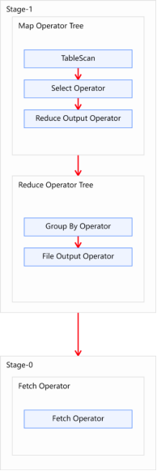

#### 3）优化思路

可以考虑开启map-side聚合，配置以下参数：

```
--启用map-side聚合，默认是true
set hive.map.aggr=true;

--用于检测源表数据是否适合进行map-side聚合。检测的方法是：先对若干条数据进行map-side聚合，若聚合后的条数和聚合前的条数比值小于该值，则认为该表适合进行map-side聚合；否则，认为该表数据不适合进行map-side聚合，后续数据便不再进行map-side聚合。
set hive.map.aggr.hash.min.reduction=0.5;

--用于检测源表是否适合map-side聚合的条数。
set hive.groupby.mapaggr.checkinterval=100000;

--map-side聚合所用的hash table，占用map task堆内存的最大比例，若超出该值，则会对hash table进行一次flush。
set hive.map.aggr.hash.force.flush.memory.threshold=0.9;
```

优化后的执行计划如图所示：

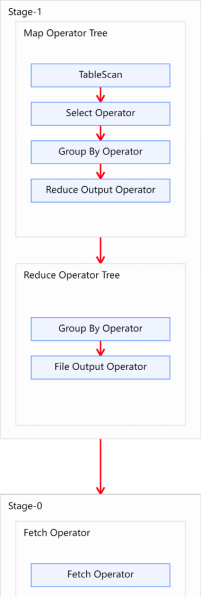

## 12.5 HQL语法优化之Join优化

### 12.5.1 Join算法概述

Hive拥有多种join算法，包括Common Join，Map Join，Bucket Map Join，Sort Merge Buckt Map Join等，下面对每种join算法做简要说明：

#### 1）Common Join

Common Join是Hive中最稳定的join算法，其通过一个MapReduce Job完成一个join操作。Map端负责读取join操作所需表的数据，并按照关联字段进行分区，通过Shuffle，将其发送到Reduce端，相同key的数据在Reduce端完成最终的Join操作。如下图所示：

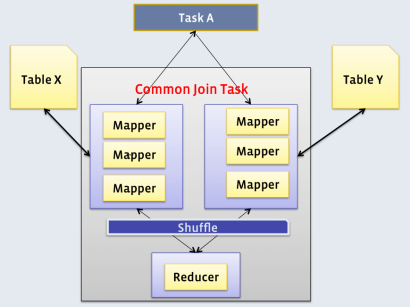

需要**注意**的是，sql语句中的join操作和执行计划中的Common Join任务并非一对一的关系，一个sql语句中的**相邻**的且**关联字段相同**的多个join操作可以合并为一个Common Join任务。

例如：

```
hive (default)> 
select 
    a.val, 
    b.val, 
    c.val 
from a 
join b on (a.key = b.key1) 
join c on (c.key = b.key1)
```

上述sql语句中两个join操作的关联字段均为b表的key1字段，则该语句中的两个join操作可由一个Common Join任务实现，也就是可通过一个Map Reduce任务实现。

```
hive (default)> 
select 
    a.val, 
    b.val, 
    c.val 
from a 
join b on (a.key = b.key1) 
join c on (c.key = b.key2)
```

上述sql语句中的两个join操作关联字段各不相同，则该语句的两个join操作需要各自通过一个Common Join任务实现，也就是通过两个Map Reduce任务实现。

#### 2）Map Join

Map Join算法可以通过两个只有map阶段的Job完成一个join操作。其适用场景为大表join小表。若某join操作满足要求，则第一个Job会读取小表数据，将其制作为hash table，并上传至Hadoop分布式缓存（本质上是上传至HDFS）。第二个Job会先从分布式缓存中读取小表数据，并缓存在Map Task的内存中，然后扫描大表数据，这样在map端即可完成关联操作。如下图所示：

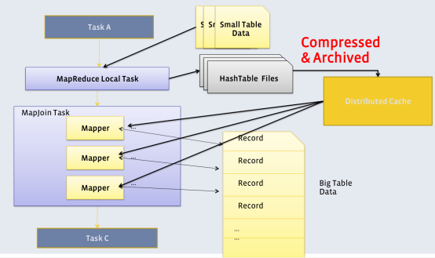

3）Bucket Map Join

Bucket Map Join是对Map Join算法的改进，其打破了Map Join只适用于大表join小表的限制，可用于大表join大表的场景。

Bucket Map Join的核心思想是：**若能保证参与join的表均为分桶表**，且关联字段为分桶字段，且其中一张表的分桶数量是另外一张表分桶数量的整数倍，就能保证参与join的两张表的分桶之间具有明确的关联关系，所以就可以在两表的分桶间进行Map Join操作了。这样一来，第二个Job的Map端就无需再缓存小表的全表数据了，而只需缓存其所需的分桶即可。其原理如图所示：

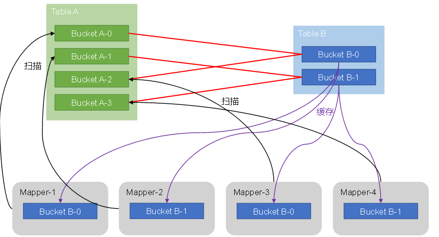

#### 4）Sort Merge Bucket Map Join

Sort Merge Bucket Map Join（简称SMB Map Join）基于Bucket Map Join。SMB Map Join要求，参与join的表均为分桶表，且需保证分桶内的数据是有序的，且分桶字段、排序字段和关联字段为相同字段，且其中一张表的分桶数量是另外一张表分桶数量的整数倍。

SMB Map Join同Bucket Join一样，同样是利用两表各分桶之间的关联关系，在分桶之间进行join操作，不同的是，分桶之间的join操作的实现原理。Bucket Map Join，两个分桶之间的join实现原理为Hash Join算法；而SMB Map Join，两个分桶之间的join实现原理为Sort Merge Join算法。

Hash Join和Sort Merge Join均为关系型数据库中常见的Join实现算法。Hash Join的原理相对简单，就是对参与join的一张表构建hash table，然后扫描另外一张表，然后进行逐行匹配。Sort Merge Join需要在两张按照关联字段排好序的表中进行，其原理如图所示：

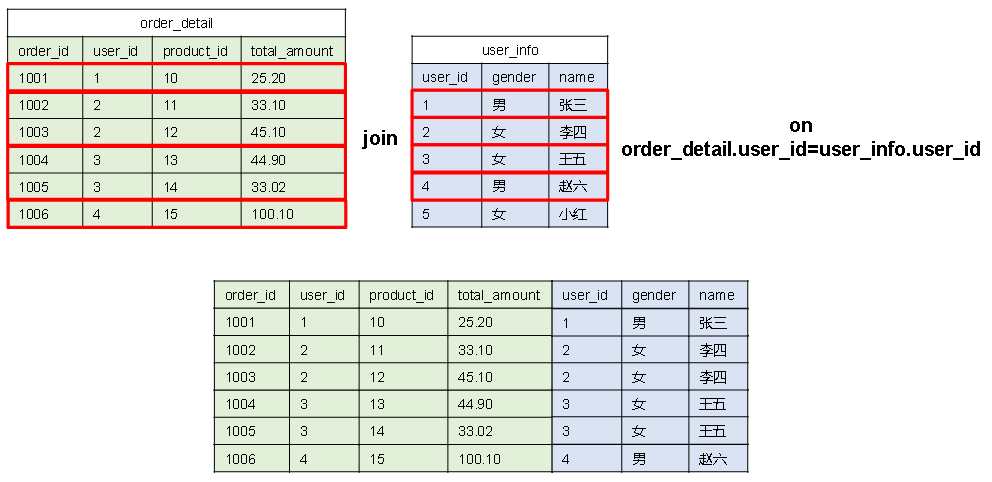

Hive中的SMB Map Join就是对两个分桶的数据按照上述思路进行Join操作。可以看出，SMB Map Join与Bucket Map Join相比，在进行Join操作时，Map端是无需对整个Bucket构建hash table，也无需在Map端缓存整个Bucket数据的，每个Mapper只需按顺序逐个key读取两个分桶的数据进行join即可。

### 12.5.2 Map Join

#### **12.5.2.1 优化说明**

Map Join有两种触发方式，一种是用户在SQL语句中增加hint提示，另外一种是Hive优化器根据参与join表的数据量大小，自动触发。

##### 1）Hint提示

用户可通过如下方式，指定通过map join算法，并且ta将作为map join中的小表。这种方式已经过时，不推荐使用。

```
hive (default)> 
select /*+ mapjoin(ta) */
    ta.id,
    tb.id
from table_a ta
join table_b tb
on ta.id=tb.id;
```

##### 2）自动触发

Hive在编译SQL语句阶段，起初所有的join操作均采用Common Join算法实现。

之后在物理优化阶段，Hive会根据每个Common Join任务所需表的大小判断该Common Join任务是否能够转换为Map Join任务，若满足要求，便将Common Join任务自动转换为Map Join任务。

但有些Common Join任务所需的表大小，在SQL的编译阶段是未知的（例如对子查询进行join操作），所以这种Common Join任务是否能转换成Map Join任务在编译阶是无法确定的。

针对这种情况，Hive会在编译阶段生成一个条件任务（Conditional Task），其下会包含一个计划列表，计划列表中包含转换后的Map Join任务以及原有的Common Join任务。最终具体采用哪个计划，是在运行时决定的。大致思路如下图所示：


Map join自动转换的具体判断逻辑如下图所示：


图中涉及到的参数如下：

```
--启动Map Join自动转换
set hive.auto.convert.join=true;

--一个Common Join operator转为Map Join operator的判断条件,若该Common Join相关的表中,存在n-1张表的已知大小总和<=该值,则生成一个Map Join计划,此时可能存在多种n-1张表的组合均满足该条件,则hive会为每种满足条件的组合均生成一个Map Join计划,同时还会保留原有的Common Join计划作为后备(back up)计划,实际运行时,优先执行Map Join计划，若不能执行成功，则启动Common Join后备计划。
set hive.mapjoin.smalltable.filesize=250000;

--开启无条件转Map Join
set hive.auto.convert.join.noconditionaltask=true;

--无条件转Map Join时的小表之和阈值,若一个Common Join operator相关的表中，存在n-1张表的大小总和<=该值,此时hive便不会再为每种n-1张表的组合均生成Map Join计划,同时也不会保留Common Join作为后备计划。而是只生成一个最优的Map Join计划。
set hive.auto.convert.join.noconditionaltask.size=10000000;
```

### 12.5.2.2 优化案例

1）示例SQL

```
hive (default)> 
select
    *
from order_detail od
join product_info product on od.product_id = product.id
join province_info province on od.province_id = province.id;
```

2）优化前

上述SQL语句共有三张表进行两次join操作，且两次join操作的关联字段不同。故优化前的执行计划应该包含两个Common Join operator，也就是由两个MapReduce任务实现。执行计划如下图所示：


3）优化思路

经分析，参与join的三张表，数据量如下

| **表名**          | **大小**              |
| ----------------- | --------------------- |
| **order_detail**  | 1176009934（约1122M） |
| **product_info**  | 25285707（约24M）     |
| **province_info** | 369（约0.36K）        |

**注：可使用如下语句获取表/分区的大小信息**

```
hive (default)> 
desc formatted table_name partition(partition_col='partition');
```

三张表中，product_info和province_info数据量较小，可考虑将其作为小表，进行Map Join优化

根据前文Common Join任务转Map Join任务的判断逻辑图，可得出以下优化方案：

**方案一：**
启用Map Join自动转换。

```
hive (default)> 
set hive.auto.convert.join=true;
```

不使用无条件转Map Join。

```
不使用无条件转Map Join。
hive (default)> 
set hive.auto.convert.join.noconditionaltask=false;
```

调整hive.mapjoin.smalltable.filesize参数，使其大于等于product_info。

```
hive (default)> 
set hive.mapjoin.smalltable.filesize=25285707;
```

这样可保证将两个Common Join operator均可转为Map Join operator，并保留Common Join作为后备计划，保证计算任务的稳定。调整完的执行计划如下图：


**方案二：**

启用Map Join自动转换。

```
hive (default)> 
set hive.auto.convert.join=true;
```

使用无条件转Map Join。

```
hive (default)> 
set hive.auto.convert.join.noconditionaltask=true;
```

调整hive.auto.convert.join.noconditionaltask.size参数，使其大于等于product_info和province_info之和。

```
hive (default)> 
set hive.auto.convert.join.noconditionaltask.size=25286076;
```

这样可直接将两个Common Join operator转为两个Map Join operator，并且由于两个Map Join operator的小表大小之和小于等于hive.auto.convert.join.noconditionaltask.size，故两个Map Join operator任务可合并为同一个。这个方案计算效率最高，但需要的内存也是最多的。

调整完的执行计划如下图：

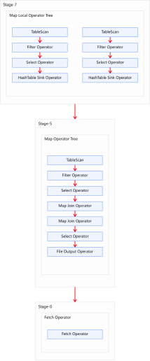

**方案三：**

启用Map Join自动转换。

```
hive (default)> 
set hive.auto.convert.join=true;
```

使用无条件转Map Join。

```
hive (default)> 
set hive.auto.convert.join.noconditionaltask=true;
```

调整hive.auto.convert.join.noconditionaltask.size参数，使其等于product_info。

```
hive (default)> 
set hive.auto.convert.join.noconditionaltask.size=25285707;
```

这样可直接将两个Common Join operator转为Map Join operator，但不会将两个Map Join的任务合并。该方案计算效率比方案二低，但需要的内存也更少。

调整完的执行计划如下图：


### **12.5.3** **Bucket Map Join**

#### 12.5.3.1 优化说明

Bucket Map Join不支持自动转换，发须通过用户在SQL语句中提供如下Hint提示，并配置如下相关参数，方可使用。

**1）Hint提示**

```
hive (default)> 
select /*+ mapjoin(ta) */
    ta.id,
    tb.id
from table_a ta
join table_b tb on ta.id=tb.id;
```

**2）相关参数**

```
--关闭cbo优化，cbo会导致hint信息被忽略
set hive.cbo.enable=false;
--map join hint默认会被忽略(因为已经过时)，需将如下参数设置为false
set hive.ignore.mapjoin.hint=false;
--启用bucket map join优化功能
set hive.optimize.bucketmapjoin = true;
```

#### 12.5.3.2 优化案例

**1）示例SQL**

```
hive (default)> 
select
    *
from(
    select
        *
    from order_detail
    where dt='2020-06-14'
)od
join(
    select
        *
    from payment_detail
    where dt='2020-06-14'
)pd
on od.id=pd.order_detail_id;
```

**2）优化前**

上述SQL语句共有两张表一次join操作，故优化前的执行计划应包含一个Common Join任务，通过一个MapReduce Job实现。执行计划如下图所示：

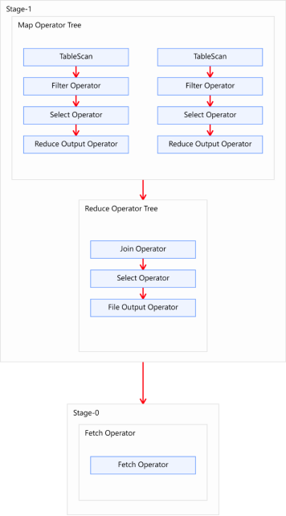

**3）优化思路**

经分析，参与join的两张表，数据量如下

| **表名**               | **大小**              |
| ---------------------- | --------------------- |
| **order****_detail**   | 1176009934（约1122M） |
| **payment****_detail** | 334198480（约319M）   |

两张表都相对较大，若采用普通的Map Join算法，则Map端需要较多的内存来缓存数据，当然可以选择为Map段分配更多的内存，来保证任务运行成功。但是，Map端的内存不可能无上限的分配，所以当参与Join的表数据量均过大时，就可以考虑采用Bucket Map Join算法。下面演示如何使用Bucket Map Join。

首先需要依据源表创建两个分桶表，order_detail建议分16个bucket，payment_detail建议分8个bucket,注意**分桶个数**的倍数关系以及**分桶字段**。

```
--订单表
hive (default)> 
drop table if exists order_detail_bucketed;
create table order_detail_bucketed(
    id           string comment '订单id',
    user_id      string comment '用户id',
    product_id   string comment '商品id',
    province_id  string comment '省份id',
    create_time  string comment '下单时间',
    product_num  int comment '商品件数',
    total_amount decimal(16, 2) comment '下单金额'
)
clustered by (id) into 16 buckets
row format delimited fields terminated by '\t';

--支付表
hive (default)> 
drop table if exists payment_detail_bucketed;
create table payment_detail_bucketed(
    id              string comment '支付id',
    order_detail_id string comment '订单明细id',
    user_id         string comment '用户id',
    payment_time    string comment '支付时间',
    total_amount    decimal(16, 2) comment '支付金额'
)
clustered by (order_detail_id) into 8 buckets
row format delimited fields terminated by '\t';
```

然后向两个分桶表导入数据。

```
--订单表
hive (default)> 
insert overwrite table order_detail_bucketed
select
    id,
    user_id,
    product_id,
    province_id,
    create_time,
    product_num,
    total_amount   
from order_detail
where dt='2020-06-14';

--分桶表
hive (default)> 
insert overwrite table payment_detail_bucketed
select
    id,
    order_detail_id,
    user_id,
    payment_time,
    total_amount
from payment_detail
where dt='2020-06-14';
```

然后设置以下参数：

```
--关闭cbo优化，cbo会导致hint信息被忽略，需将如下参数修改为false
set hive.cbo.enable=false;
--map join hint默认会被忽略(因为已经过时)，需将如下参数修改为false
set hive.ignore.mapjoin.hint=false;
--启用bucket map join优化功能,默认不启用，需将如下参数修改为true
set hive.optimize.bucketmapjoin = true;
```

最后在重写SQL语句，如下：

```
hive (default)> 
select /*+ mapjoin(pd) */
    *
from order_detail_bucketed od
join payment_detail_bucketed pd on od.id = pd.order_detail_id;
```

优化后的执行计划如图所示：

需要注意的是，Bucket Map Join的执行计划的基本信息和普通的Map Join无异，若想看到差异，可执行如下语句，查看执行计划的详细信息。详细执行计划中，如在Map Join Operator中看到 “BucketMapJoin: true”，则表明使用的Join算法为Bucket Map Join。

```
hive (default)> 
explain extended select /*+ mapjoin(pd) */
    *
from order_detail_bucketed od
join payment_detail_bucketed pd on od.id = pd.order_detail_id;
```

### 12.5.4 Sort Merge Bucket Map Join

```
--启动Sort Merge Bucket Map Join优化
set hive.optimize.bucketmapjoin.sortedmerge=true;
--使用自动转换SMB Join
set hive.auto.convert.sortmerge.join=true;
```

#### 12.5.4.2 优化案例

**1）示例SQL语句**

```
hive (default)> 
select
    *
from(
    select
        *
    from order_detail
    where dt='2020-06-14'
)od
join(
    select
        *
    from payment_detail
    where dt='2020-06-14'
)pd
on od.id=pd.order_detail_id;
```

**2）优化前**

上述SQL语句共有两张表一次join操作，故优化前的执行计划应包含一个Common Join任务，通过一个MapReduce Job实现。

**3）优化思路**
经分析，参与join的两张表，数据量如下

| **表名**               | **大小**              |
| ---------------------- | --------------------- |
| **order****_detail**   | 1176009934（约1122M） |
| **payment****_detail** | 334198480（约319M）   |

张表都相对较大，除了可以考虑采用Bucket Map Join算法，还可以考虑SMB Join。相较于Bucket Map Join，SMB Map Join对分桶大小是没有要求的。下面演示如何使用SMB Map Join。

首先需要依据源表创建两个的有序的分桶表，order_detail建议分16个bucket，payment_detail建议分8个bucket,注意**分桶个数**的倍数关系以及**分桶字段和排序字段**。

```
--订单表
hive (default)> 
drop table if exists order_detail_sorted_bucketed;
create table order_detail_sorted_bucketed(
    id           string comment '订单id',
    user_id      string comment '用户id',
    product_id   string comment '商品id',
    province_id  string comment '省份id',
    create_time  string comment '下单时间',
    product_num  int comment '商品件数',
    total_amount decimal(16, 2) comment '下单金额'
)
clustered by (id) sorted by(id) into 16 buckets
row format delimited fields terminated by '\t';

--支付表
hive (default)> 
drop table if exists payment_detail_sorted_bucketed;
create table payment_detail_sorted_bucketed(
    id              string comment '支付id',
    order_detail_id string comment '订单明细id',
    user_id         string comment '用户id',
    payment_time    string comment '支付时间',
    total_amount    decimal(16, 2) comment '支付金额'
)
clustered by (order_detail_id) sorted by(order_detail_id) into 8 buckets
row format delimited fields terminated by '\t';
```

然后向两个分桶表导入数据。

```
--订单表
hive (default)> 
insert overwrite table order_detail_sorted_bucketed
select
    id,
    user_id,
    product_id,
    province_id,
    create_time,
    product_num,
    total_amount   
from order_detail
where dt='2020-06-14';

--分桶表
hive (default)> 
insert overwrite table payment_detail_sorted_bucketed
select
    id,
    order_detail_id,
    user_id,
    payment_time,
    total_amount
from payment_detail
where dt='2020-06-14';
```

然后设置以下参数：

```
--启动Sort Merge Bucket Map Join优化
set hive.optimize.bucketmapjoin.sortedmerge=true;
--使用自动转换SMB Join
set hive.auto.convert.sortmerge.join=true;
```

最后在重写SQL语句，如下：

```
hive (default)> 
select
    *
from order_detail_sorted_bucketed od
join payment_detail_sorted_bucketed pd
on od.id = pd.order_detail_id;
```

优化后的执行计如图所示：

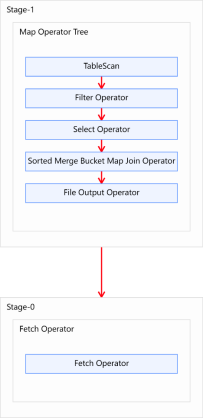

## 12.6 HQL语法优化之数据倾斜

### 12.6.1 数据倾斜概述

数据倾斜问题，通常是指参与计算的数据分布不均，即某个key或者某些key的数据量远超其他key，导致在shuffle阶段，大量相同key的数据被发往同一个Reduce，进而导致该Reduce所需的时间远超其他Reduce，成为整个任务的瓶颈。
Hive中的数据倾斜常出现在分组聚合和join操作的场景中，下面分别介绍在上述两种场景下的优化思路。

### 12.6.2 分组聚合导致的数据倾斜

#### 12.6.2.1 优化说明

前文提到过，Hive中未经优化的分组聚合，是通过一个MapReduce Job实现的。Map端负责读取数据，并按照分组字段分区，通过Shuffle，将数据发往Reduce端，各组数据在Reduce端完成最终的聚合运算。

如果group by分组字段的值分布不均，就可能导致大量相同的key进入同一Reduce，从而导致数据倾斜问题。

由分组聚合导致的数据倾斜问题，有以下两种解决思路：

**1）Map-Side聚合**

开启Map-Side聚合后，数据会现在Map端完成部分聚合工作。这样一来即便原始数据是倾斜的，经过Map端的初步聚合后，发往Reduce的数据也就不再倾斜了。最佳状态下，Map-端聚合能完全屏蔽数据倾斜问题。

相关参数如下：

```
--启用map-side聚合
set hive.map.aggr=true;

--用于检测源表数据是否适合进行map-side聚合。检测的方法是：先对若干条数据进行map-side聚合，若聚合后的条数和聚合前的条数比值小于该值，则认为该表适合进行map-side聚合；否则，认为该表数据不适合进行map-side聚合，后续数据便不再进行map-side聚合。
set hive.map.aggr.hash.min.reduction=0.5;

--用于检测源表是否适合map-side聚合的条数。
set hive.groupby.mapaggr.checkinterval=100000;

--map-side聚合所用的hash table，占用map task堆内存的最大比例，若超出该值，则会对hash table进行一次flush。
set hive.map.aggr.hash.force.flush.memory.threshold=0.9;
```

**2）Skew-GroupBy优化**

Skew-GroupBy的原理是启动两个MR任务，第一个MR按照随机数分区，将数据分散发送到Reduce，完成部分聚合，第二个MR按照分组字段分区，完成最终聚合。

相关参数如下：

```
--启用分组聚合数据倾斜优化
set hive.groupby.skewindata=true;
```

#### 12.6.2.2 优化案例

**1）示例SQL语句**

```
hive (default)>
select
    province_id,
    count(*)
from order_detail
group by province_id;
```

> 需要注意的是，hive中的map-side聚合是默认开启的，若想看到数据倾斜的现象，需要先将hive.map.aggr参数设置为false

**（2）Skew-GroupBy优化**

设置如下参数

```
--启用skew-groupby
set hive.groupby.skewindata=true;
--关闭map-side聚合
set hive.map.aggr=false;
```

开启Skew-GroupBy优化后，可以很明显看到该sql执行在yarn上启动了两个mr任务，第一个mr打散数据，第二个mr按照打散后的数据进行分组聚合。

### 12.6.3 Join导致的数据倾斜

#### 12.6.3.1 优化说明

前文提到过，未经优化的join操作，默认是使用common join算法，也就是通过一个MapReduce Job完成计算。Map端负责读取join操作所需表的数据，并按照关联字段进行分区，通过Shuffle，将其发送到Reduce端，相同key的数据在Reduce端完成最终的Join操作。

如果关联字段的值分布不均，就可能导致大量相同的key进入同一Reduce，从而导致数据倾斜问题。

由join导致的数据倾斜问题，有如下三种解决方案：

**1）map join**

使用map join算法，join操作仅在map端就能完成，没有shuffle操作，没有reduce阶段，自然不会产生reduce端的数据倾斜。该方案适用于大表join小表时发生数据倾斜的场景。

相关参数如下：

```
--启动Map Join自动转换
set hive.auto.convert.join=true;

--一个Common Join operator转为Map Join operator的判断条件,若该Common Join相关的表中,存在n-1张表的大小总和<=该值,则生成一个Map Join计划,此时可能存在多种n-1张表的组合均满足该条件,则hive会为每种满足条件的组合均生成一个Map Join计划,同时还会保留原有的Common Join计划作为后备(back up)计划,实际运行时,优先执行Map Join计划，若不能执行成功，则启动Common Join后备计划。
set hive.mapjoin.smalltable.filesize=250000;

--开启无条件转Map Join
set hive.auto.convert.join.noconditionaltask=true;

--无条件转Map Join时的小表之和阈值,若一个Common Join operator相关的表中，存在n-1张表的大小总和<=该值,此时hive便不会再为每种n-1张表的组合均生成Map Join计划,同时也不会保留Common Join作为后备计划。而是只生成一个最优的Map Join计划。
set hive.auto.convert.join.noconditionaltask.size=10000000;
```

**2）skew join**

skew join的原理是，为倾斜的大key单独启动一个map join任务进行计算，其余key进行正常的common join。原理图如下：

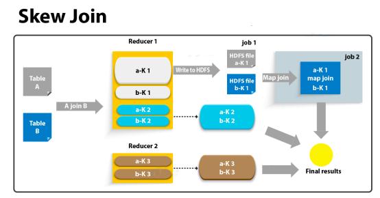

相关参数如下：

```
--启用skew join优化
set hive.optimize.skewjoin=true;
--触发skew join的阈值，若某个key的行数超过该参数值，则触发
set hive.skewjoin.key=100000;
```

这种方案对参与join的源表大小没有要求，但是对两表中倾斜的key的数据量有要求，要求一张表中的倾斜key的数据量比较小（方便走mapjoin）。

**3）调整SQL语句**

若参与join的两表均为大表，其中一张表的数据是倾斜的，此时也可通过以下方式对SQL语句进行相应的调整。
假设原始SQL语句如下：A，B两表均为大表，且其中一张表的数据是倾斜的。

```
hive (default)>
select
    *
from A
join B
on A.id=B.id;
```

其join过程如下：

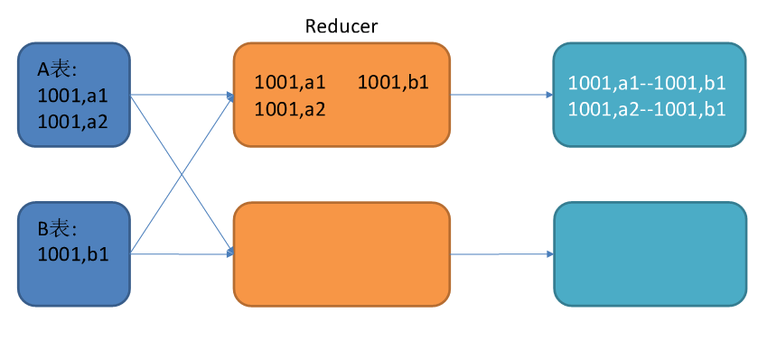

图中1001为倾斜的大key，可以看到，其被发往了同一个Reduce进行处理。
调整SQL语句如下：

```
hive (default)>
select
    *
from(
    select --打散操作
        concat(id,'_',cast(rand()*2 as int)) id,
        value
    from A
)ta
join(
    select --扩容操作
        concat(id,'_',0) id,
        value
    from B
    union all
    select
        concat(id,'_',1) id,
        value
    from B
)tb
on ta.id=tb.id;
```

调整之后的SQL语句执行计划如下图所示：

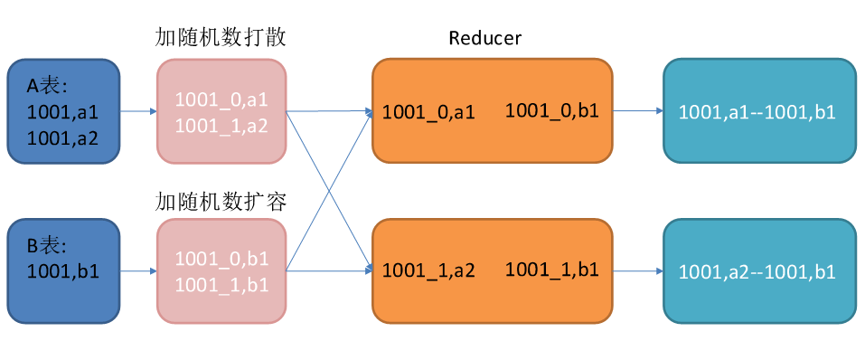

#### 12.6.3.2 优化案例

**1）示例SQL语句**

```
hive (default)>
select
    *
from order_detail od
join province_info pi
on od.province_id=pi.id;
```

**2）优化前**

order_detail表中的province_id字段是存在倾斜的，若不经过优化，通过观察任务的执行过程，是能够看出数据倾斜现象的。


需要注意的是，hive中的map join自动转换是默认开启的，若想看到数据倾斜的现象，需要先将hive.auto.convert.join参数设置为false。

**3）优化思路**

上述两种优化思路均可解决该数据倾斜问题，下面分别进行说明：

**（1）map join**

设置如下参数

```
--启用map join
set hive.auto.convert.join=true;
--关闭skew join
set hive.optimize.skewjoin=false;
```

可以很明显看到开启map join以后，mr任务只有map阶段，没有reduce阶段，自然也就不会有数据倾斜发生。


**（2）skew join**

设置如下参数

```
--启动skew join
set hive.optimize.skewjoin=true;
--关闭map join
set hive.auto.convert.join=false;
```

开启skew join后，使用explain可以很明显看到执行计划如下图所示，说明skew join生效，任务既有common join，又有部分key走了map join。

并且该sql在yarn上最终启动了两个mr任务，而且第二个任务只有map没有reduce阶段，说明第二个任务是对倾斜的key进行了map join。


## 12.7 HQL语法优化之任务并行度

#### 12.7.1 优化说明

对于一个分布式的计算任务而言，设置一个合适的并行度十分重要。Hive的计算任务由MapReduce完成，故并行度的调整需要分为Map端和Reduce端。

### 12.7.1.1 Map端并行度

Map端的并行度，也就是Map的个数。是由输入文件的切片数决定的。一般情况下，Map端的并行度无需手动调整。
以下特殊情况可考虑调整map端并行度：

**1）查询的表中存在大量小文件**

按照Hadoop默认的切片策略，一个小文件会单独启动一个map task负责计算。若查询的表中存在大量小文件，则会启动大量map task，造成计算资源的浪费。这种情况下，可以使用Hive提供的CombineHiveInputFormat，多个小文件合并为一个切片，从而控制map task个数。相关参数如下：

```
set hive.input.format=org.apache.hadoop.hive.ql.io.CombineHiveInputFormat;
```

**2）map端有复杂的查询逻辑**

若SQL语句中有正则替换、json解析等复杂耗时的查询逻辑时，map端的计算会相对慢一些。若想加快计算速度，在计算资源充足的情况下，可考虑增大map端的并行度，令map task多一些，每个map task计算的数据少一些。相关参数如下：

```
--一个切片的最大值
set mapreduce.input.fileinputformat.split.maxsize=256000000;
```

#### 12.7.1.2 Reduce端并行度

Reduce端的并行度，也就是Reduce个数。相对来说，更需要关注。Reduce端的并行度，可由用户自己指定，也可由Hive自行根据该MR Job输入的文件大小进行估算。

Reduce端的并行度的相关参数如下：

```
--指定Reduce端并行度，默认值为-1，表示用户未指定
set mapreduce.job.reduces;
--Reduce端并行度最大值
set hive.exec.reducers.max;
--单个Reduce Task计算的数据量，用于估算Reduce并行度
set hive.exec.reducers.bytes.per.reducer;
```

 

Reduce端并行度的确定逻辑如下：

若指定参数**mapreduce.job.reduces**的值为一个非负整数，则Reduce并行度为指定值。否则，Hive自行估算Reduce并行度，估算逻辑如下：

假设Job输入的文件大小为**totalInputBytes**

参数**hive.exec.reducers.bytes.per.reducer**的值为bytesPerReducer。

参数**hive.exec.reducers.max**的值为maxReducers。

则Reduce端的并行度为：


根据上述描述，可以看出，Hive自行估算Reduce并行度时，是以整个MR Job输入的文件大小作为依据的。因此，在某些情况下其估计的并行度很可能并不准确，此时就需要用户根据实际情况来指定Reduce并行度了。

### 12.7.2 优化案例

**1）示例SQL语句**

```
hive (default)>
select
    province_id,
    count(*)
from order_detail
group by province_id;
```

**2）优化前**

上述sql语句，在不指定Reduce并行度时，Hive自行估算并行度的逻辑如下：

```
totalInputBytes= 1136009934
bytesPerReducer=256000000
maxReducers=1009
```

经计算，Reduce并行度为


**3）优化思路**

上述sql语句，在默认情况下，是会进行map-side聚合的，也就是Reduce端接收的数据，实际上是map端完成聚合之后的结果。观察任务的执行过程，会发现，每个map端输出的数据只有34条记录，共有5个map task。

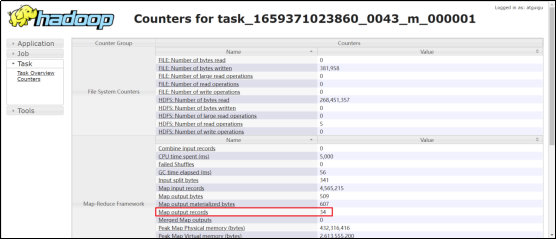

也就是说Reduce端实际只会接收170（34*5）条记录，故理论上Reduce端并行度设置为1就足够了。这种情况下，用户可通过以下参数，自行设置Reduce端并行度为1。

```
--指定Reduce端并行度，默认值为-1，表示用户未指定
set mapreduce.job.reduces=1;
```

**12.8 HQL语法优化之小文件合并**

### 12.8.1 优化说明

小文件合并优化，分为两个方面，分别是Map端输入的小文件合并，和Reduce端输出的小文件合并。

#### 12.8.1.1 Map端输入文件合并

合并Map端输入的小文件，是指将多个小文件划分到一个切片中，进而由一个Map Task去处理。目的是防止为单个小文件启动一个Map Task，浪费计算资源。

相关参数为：

```
--可将多个小文件切片，合并为一个切片，进而由一个map任务处理
set hive.input.format=org.apache.hadoop.hive.ql.io.CombineHiveInputFormat; 
```

#### 12.8.1.2 Reduce输出文件合并

合并Reduce端输出的小文件，是指将多个小文件合并成大文件。目的是减少HDFS小文件数量。其原理是根据计算任务输出文件的平均大小进行判断，若符合条件，则单独启动一个额外的任务进行合并。

相关参数为：

```
--开启合并map only任务输出的小文件
set hive.merge.mapfiles=true;

--开启合并map reduce任务输出的小文件
set hive.merge.mapredfiles=true;

--合并后的文件大小
set hive.merge.size.per.task=256000000;

--触发小文件合并任务的阈值，若某计算任务输出的文件平均大小低于该值，则触发合并
set hive.merge.smallfiles.avgsize=16000000;
```

### 12.8.2 优化案例

**1）示例用表**

现有一个需求，计算各省份订单金额总和，下表为结果表。

```
hive (default)>
drop table if exists order_amount_by_province;
create table order_amount_by_province(
    province_id string comment '省份id',
    order_amount decimal(16,2) comment '订单金额'
)
location '/order_amount_by_province';
```

**2）示例SQL语句**

```
hive (default)>
insert overwrite table order_amount_by_province
select
    province_id,
    sum(total_amount)
from order_detail
group by province_id;
```

**3）优化前**

根据任务并行度一节所需内容，可分析出，默认情况下，该sql语句的Reduce端并行度为5，故最终输出文件个数也为5，下图为输出文件，可以看出，5个均为小文件。

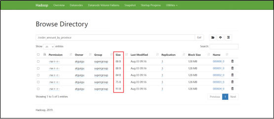

**4）优化思路**

若想避免小文件的产生，可采取方案有两个。

（1）合理设置任务的Reduce端并行度

若将上述计算任务的并行度设置为1，就能保证其输出结果只有一个文件。

（2）启用Hive合并小文件优化

设置以下参数：

```
--开启合并map reduce任务输出的小文件
set hive.merge.mapredfiles=true;

--合并后的文件大小
set hive.merge.size.per.task=256000000;

--触发小文件合并任务的阈值，若某计算任务输出的文件平均大小低于该值，则触发合并
set hive.merge.smallfiles.avgsize=16000000;
```

再次执行上述的insert语句，观察结果表中的文件，只剩一个了。

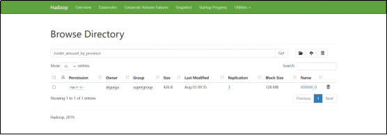

## 12.9 其他优化

### 12.9.1 CBO优化

#### 12.9.1.1 优化说明

CBO是指Cost based Optimizer，即基于计算成本的优化。

在Hive中，计算成本模型考虑到了：数据的行数、CPU、本地IO、HDFS IO、网络IO等方面。Hive会计算同一SQL语句的不同执行计划的计算成本，并选出成本最低的执行计划。目前CBO在hive的MR引擎下主要用于join的优化，例如多表join的join顺序。

相关参数为：

```
--是否启用cbo优化 
set hive.cbo.enable=true;
```

#### 12.9.2.2 优化案例

1）示例SQL语句

```
hive (default)>
select
    *
from order_detail od
join product_info product on od.product_id=product.id
join province_info province on od.province_id=province.id;
```

**2）关闭CBO优化**

```
--关闭cbo优化 
set hive.cbo.enable=false;

--为了测试效果更加直观，关闭map join自动转换
set hive.auto.convert.join=false;
```

根据执行计划，可以看出，三张表的join顺序如下：

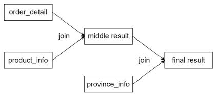

**3）开启CBO优化**

```
--开启cbo优化 
set hive.cbo.enable=true;
--为了测试效果更加直观，关闭map join自动转换
set hive.auto.convert.join=false;
```

根据执行计划，可以看出，三张表的join顺序如下：

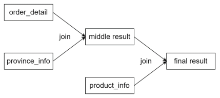

**4）总结**

根据上述案例可以看出，CBO优化对于执行计划中join顺序是有影响的，其之所以会将province_info的join顺序提前，是因为province info的数据量较小，将其提前，会有更大的概率使得中间结果的数据量变小，从而使整个计算任务的数据量减小，也就是使计算成本变小。

### 12.9.2 谓词下推

#### 12.9.2.1 优化说明

谓词下推（predicate pushdown）是指，尽量将过滤操作前移，以减少后续计算步骤的数据量。

相关参数为：

```
--是否启动谓词下推（predicate pushdown）优化
set hive.optimize.ppd = true;
```

需要注意的是：

CBO优化也会完成一部分的谓词下推优化工作，因为在执行计划中，谓词越靠前，整个计划的计算成本就会越低。

### 12.9.3 矢量化查询

Hive的矢量化查询优化，依赖于CPU的矢量化计算，CPU的矢量化计算的基本原理如下图：

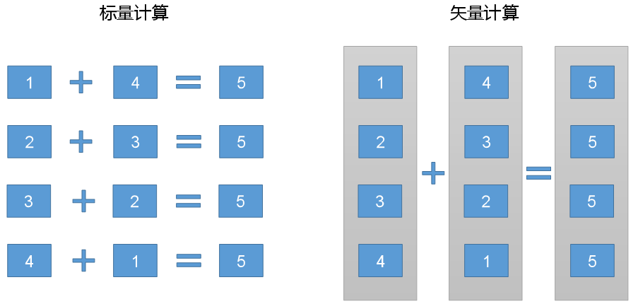

Hive的矢量化查询，可以极大的提高一些典型查询场景（例如scans, filters, aggregates, and joins）下的CPU使用效率。

相关参数如下：

```
set hive.vectorized.execution.enabled=true;
```

若执行计划中，出现“Execution mode: vectorized”字样，即表明使用了矢量化计算。

官网参考连接：

https://cwiki.apache.org/confluence/display/Hive/Vectorized+Query+Execution#VectorizedQueryExecution-Limitations

#### 12.9.4 Fetch抓取

Fetch抓取是指，Hive中对某些情况的查询可以不必使用MapReduce计算。例如：select * from emp;在这种情况下，Hive可以简单地读取emp对应的存储目录下的文件，然后输出查询结果到控制台。

相关参数如下：

```
--是否在特定场景转换为fetch 任务
--设置为none表示不转换
--设置为minimal表示支持select *，分区字段过滤，Limit等
--设置为more表示支持select 任意字段,包括函数，过滤，和limit等
set hive.fetch.task.conversion=more;
```

### 12.9.5 本地模式

#### 12.9.5.1 优化说明

大多数的Hadoop Job是需要Hadoop提供的完整的可扩展性来处理大数据集的。不过，有时Hive的输入数据量是非常小的。在这种情况下，为查询触发执行任务消耗的时间可能会比实际job的执行时间要多的多。对于大多数这种情况，**Hive可以通过本地模式在单台机器上处理所有的任务。对于小数据集，执行时间可以明显被缩短。**

相关参数如下：

```
--开启自动转换为本地模式
set hive.exec.mode.local.auto=true;  

--设置local MapReduce的最大输入数据量，当输入数据量小于这个值时采用local  MapReduce的方式，默认为134217728，即128M
set hive.exec.mode.local.auto.inputbytes.max=50000000;

--设置local MapReduce的最大输入文件个数，当输入文件个数小于这个值时采用local MapReduce的方式，默认为4
set hive.exec.mode.local.auto.input.files.max=10;
```

### 12.9.6 并行执行

Hive会将一个SQL语句转化成一个或者多个Stage，每个Stage对应一个MR Job。默认情况下，Hive同时只会执行一个Stage。但是某SQL语句可能会包含多个Stage，但这多个Stage可能并非完全互相依赖，也就是说有些Stage是可以并行执行的。此处提到的并行执行就是指这些Stage的并行执行。相关参数如下：

```
--启用并行执行优化
set hive.exec.parallel=true;       
    
--同一个sql允许最大并行度，默认为8
set hive.exec.parallel.thread.number=8; 
```

### **12.9.7 严格模式**

Hive可以通过设置某些参数防止危险操作：

**1）分区表不使用分区过滤**

将`hive.strict.checks.no.partition.filter`设置为true时，对于分区表，除非where语句中含有分区字段过滤条件来限制范围，否则不允许执行。换句话说，就是用户不允许扫描所有分区。进行这个限制的原因是，通常分区表都拥有非常大的数据集，而且数据增加迅速。没有进行分区限制的查询可能会消耗令人不可接受的巨大资源来处理这个表。

**2）使用order by没有limit过滤**

将`hive.strict.checks.orderby.no.limit`设置为true时，对于**使用了order by语句的查询，要求必须使用limit语句**。因为order by为了执行排序过程会将所有的结果数据分发到同一个Reduce中进行处理，强制要求用户增加这个limit语句可以防止Reduce额外执行很长一段时间（开启了limit可以在数据进入到Reduce之前就减少一部分数据）。

**3）笛卡尔积**

将`hive.strict.checks.cartesian.product`设置为true时，**会限制笛卡尔积的查询**。对关系型数据库非常了解的用户可能期望在执行JOIN查询的时候不使用ON语句而是使用where语句，这样关系数据库的执行优化器就可以高效地将WHERE语句转化成那个ON语句。不幸的是，Hive并不会执行这种优化，因此，如果表足够大，那么这个查询就会出现不可控的情况。


# 附录：常见错误及解决方案

## 1）连接不上MySQL数据库

（1）导错驱动包，应该把mysql-connector-java-5.1.27-bin.jar导入/opt/module/hive/lib的不是这个包。错把mysql-connector-java-5.1.27.tar.gz导入hive/lib包下。

（2）修改user表中的主机名称没有都修改为%，而是修改为localhost

## 2）Hive默认的输入格式处理是CombineHiveInputFormat，会对小文件进行合并。

```
hive (default)> set hive.input.format;
hive.input.format=org.apache.hadoop.hive.ql.io.CombineHiveInputFormat
```

可以采用HiveInputFormat就会根据分区数输出相应的文件。

```
hive (default)> set hive.input.format=org.apache.hadoop.hive.ql.io.HiveInputFormat;
```

## 3）不能执行MapReduce程序

可能是Hadoop的Yarn没开启。

## 4）启动MySQL服务时，报MySQL server PID file could not be found! 异常。

在/var/lock/subsys/mysql路径下创建hadoop102.pid，并在文件中添加内容：4396

## **5）报service mysql status MySQL is not running, but lock file (/var/lock/subsys/mysql[失败])异常。**

解决方案：在/var/lib/mysql目录下创建：-rw-rw----. 1 mysql mysql     5 12月 22 16:41 hadoop102.pid文件，并修改权限为777。

## 6）JVM堆内存溢出（Hive集群运行模式）

描述：java.lang.OutOfMemoryError: Java heap space

解决：在yarn-site.xml中加入如下代码。

```
<property>
	<name>yarn.scheduler.maximum-allocation-mb</name>
	<value>2048</value>
</property>
<property>
  	<name>yarn.scheduler.minimum-allocation-mb</name>
  	<value>2048</value>
</property>
<property>
	<name>yarn.nodemanager.vmem-pmem-ratio</name>
	<value>2.1</value>
</property>
<property>
	<name>mapred.child.java.opts</name>
	<value>-Xmx1024m</value>
</property>
```

7）JVM堆内存溢出（Hive本地运行模式）

描述：在启用Hive本地模式后，hive.log报错java.lang.OutOfMemoryError: Java heap space

解决方案1（临时）：

在Hive客户端临时设置io.sort.mb和mapreduce.task.io.sort.mb两个参数的值为10

解决方案2（永久生效）：
在$HIVE_HOME/conf下添加hive-env.sh。

```
[atguigu@hadoop102 conf]$ pwd
/opt/module/hive/conf
[atguigu@hadoop102 conf]$ cp hive-env.sh.template hive-env.sh
```

然后将其中的参数export HADOOP_HEAPSIZE=1024的注释放开，然后重启Hive。


8）虚拟内存限制

​	在yarn-site.xml中添加如下配置:

```
<property>
    <name>yarn.nodemanager.vmem-check-enabled</name>
    <value>false</value>
 </property>
```

