# 第 1 章 Scala 入 门

## 1.1概述

### 1.1.1为什么学习 Scala

1）Spark—新一代内存级大数据计算框架，是大数据的重要内容。

2）Spark就是使用Scala编写的。因此为了更好的学习Spark, 需要掌握Scala这门语言。

3）Spark的兴起，带动Scala语言的发展！

### 1.1.2Scala 发展历史

联邦理工学院的马丁·奥德斯基（Martin Odersky）于2001年开始设计Scala。
马丁·奥德斯基是编译器及编程的狂热爱好者，长时间的编程之后，希望发明一种语言，能够让写程序这样的基础工作变得高效，简单。所以当接触到JAVA语言后，对JAVA这门便携式，运行在网络，且存在垃圾回收的语言产生了极大的兴趣，所以决定将函数式编程语言的特点融合到JAVA中，由此发明了两种语言（Pizza & Scala）。
Pizza和Scala极大地推动了Java编程语言的发展。

- JDK5.0 的泛型、增强for循环、自动类型转换等，都是从Pizza引入的新特性。

- JDK8.0  的类型推断、Lambda表达式就是从Scala引入的特性。

  

  JDK5.0和JDK8.0的编辑器就是马丁·奥德斯基写的，因此马丁·奥德斯基一个人的战斗力抵得上一个Java开发团队。

### 1.1.3Scala 和 Java 关系

一般来说，学 Scala 的人，都会 Java，而 Scala 是基于 Java 的，因此我们需要将 Scala和 Java 以及 JVM 之间的关系搞清楚，否则学习 Scala 你会蒙圈。

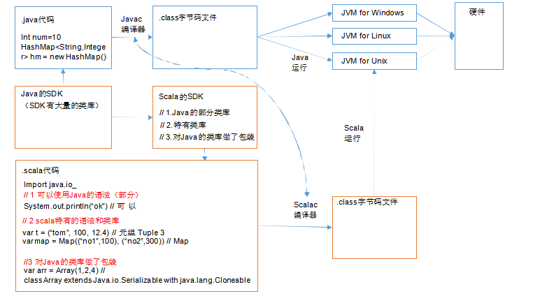

### 1.1.4Scala 语言特点

Scala是一门以Java虚拟机（JVM）为运行环境并将面向对象和函数式编程的最佳特性结合在一起的   静态类型编程语言（静态语言需要提前编译的如：Java、c、c++等，动态语言如：js）。
1）Scala是一门**多范式**的编程语言，Scala支持**面向对象和函数式编程**。（多范式，就是多种编程方法的意思。有面向过程、面向对象、泛型、函数式四种程序设计方法。）
2）Scala源代码（.scala）会被编译成Java字节码（.class），然后运行于JVM之上，并可以调用现有   的Java类库，实现两种语言的无缝对接。
3）Scala单作为一门语言来看，非常的简洁高效。

Scala在设计时，马丁·奥德斯基是参考了Java的设计思想，可以说Scala是源于Java，同时马丁·奥   德斯基也加入了自己的思想，将函数式编程语言的特点融合到JAVA中,    因此，对于学习过Java的同学， 只要在学习Scala的过程中，搞清楚Scala和Java相同点和不同点，就可以快速的掌握Scala这门语言。

## 1.2Scala 环境搭建

1）安装步骤
（1）首先确保 JDK1.8 安装成功
（2）下载对应的Scala 安装文件 scala-2.12.11.zip ([https://www.scala-lang.org/download/](https://www.scala-lang.org/download/))
（3）解压 scala-2.12.11.zip，我这里解压到D:\Tools
（4）配置 Scala 的环境变量

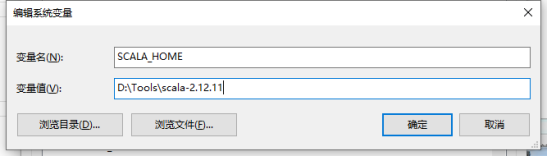

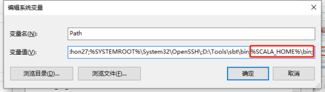

注意 1：解压路径不能有任何中文路径，最好不要有空格。

注意 2：环境变量要大写SCALA_HOME

1） 测试

需求：计算两数 a 和b 的和。步骤

（1） 在键盘上同时按win+r 键，并在运行窗口输入cmd 命令

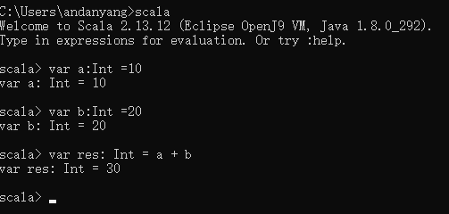

## 1.3 Scala 插件安装

默认情况下 IDEA 不支持Scala 的开发，需要安装Scala 插件。

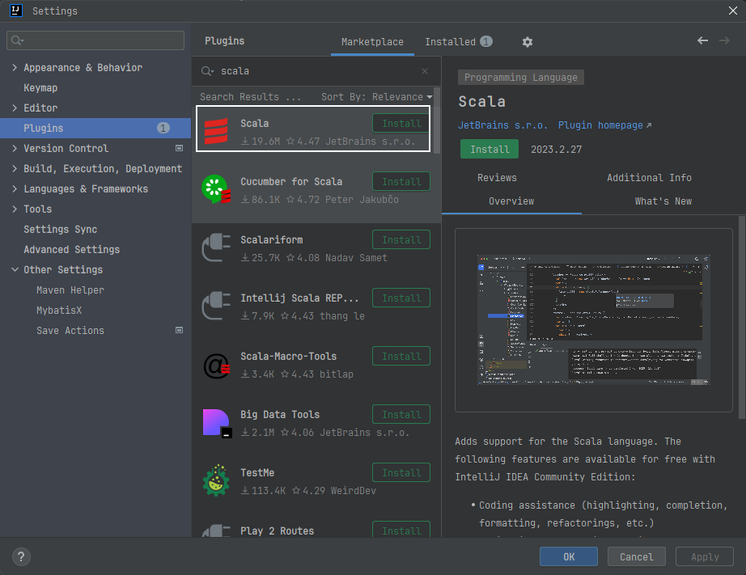

## 1.4HelloWorld 案例

### 1.4.1创建IDEA 项目工程

1）打开 IDEA->点击左侧的 Flie->选择 New->选择Project…

2）创建一个 Maven 工程，并点击 next

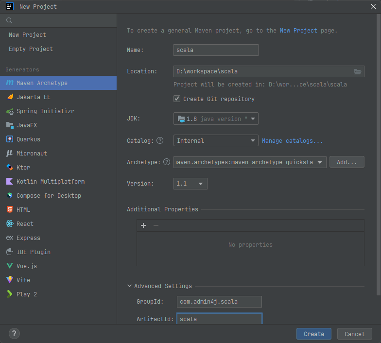

3）默认下，Maven 不支持 Scala 的开发，需要引入 Scala 框架。

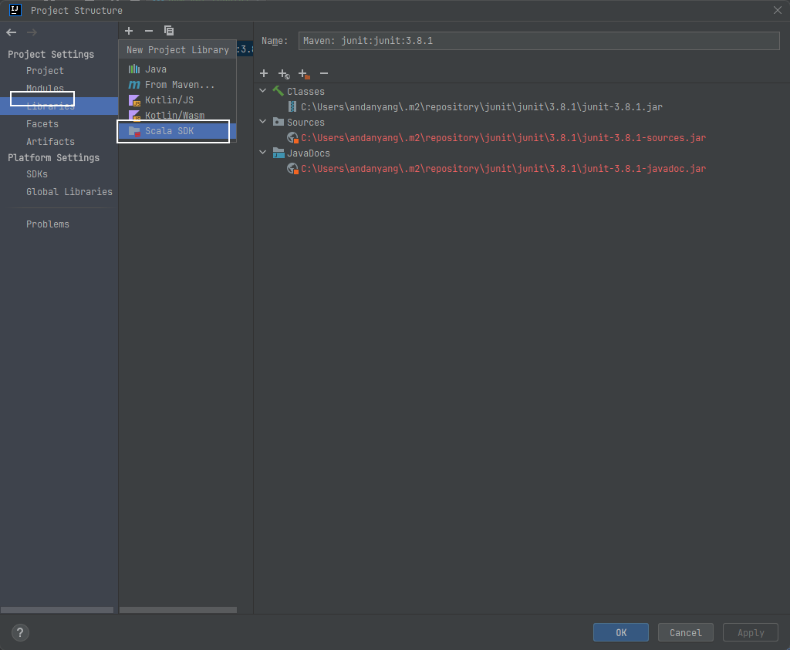

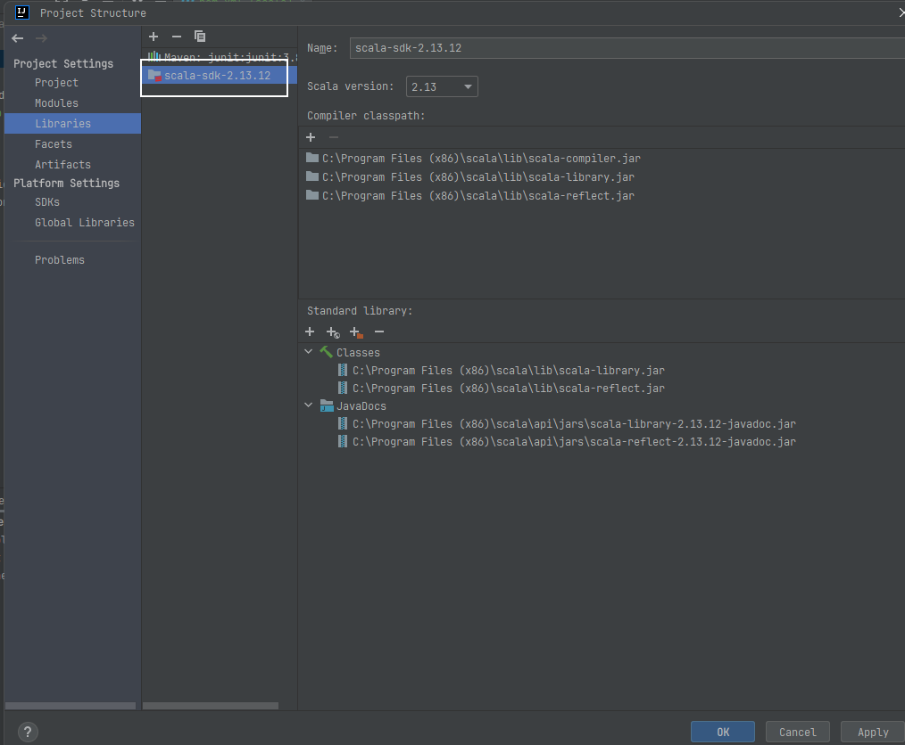

4）创建项目的源文件目录

右键点击 main 目录->New->点击 Diretory ->  写个名字（比如 scala）。
右键点击 scala 目录->Mark Directory as->选择 Sources root，观察文件夹颜色发生变化。

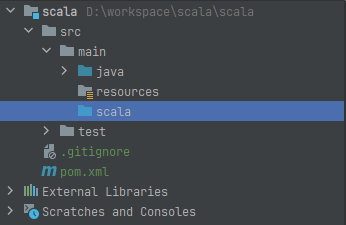

5）在 scala 包下，创建包 com.admin4j.chapter01 包名和 Hello 类名，
右键点击 scala 目录->New->Package->输入 com.admin4j.chapter01->点击 OK。
右键点击 com.admin4j.chapter01->New->Scala Class->Kind 项选择 Object->Name 项输入
Hello。

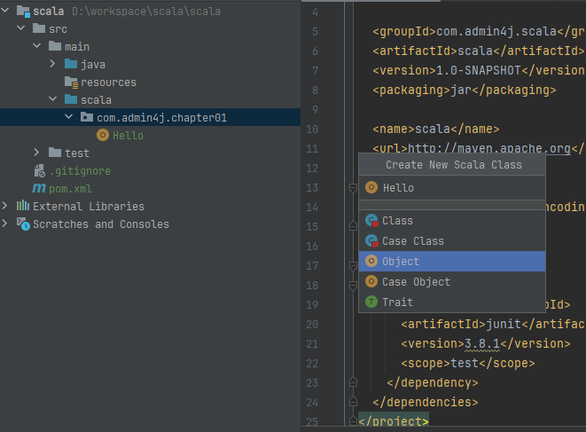

6）编写输出Hello Scala 案例

在类中中输入 main，然后回车可以快速生成 main 方法； 在 main 方法中输入println("hello scala")

```
object Hello {

  def main(args: Array[String]): Unit = {

    println("Hello scala")
    System.out.println("Hello Java")
  }
}
```

运行后，观察控制台打印输出：
hello scala 

hello scala
说明：Java 中部分代码也是可以在 Scala 中运行。

### 1.4.2 class 和object 说明

对第一个程序进行说明

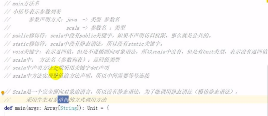

```
package com.atguigu.chapter01

object Hello {
	def main(args: Array[String]): Unit = { 
		println("hello scala")
	}
}
```

Scala完全面向对象，故Scala去掉了Java中非面向对象的元素，如static关键字，void类型

1）static
Scala无static关键字，由object实现类似静态方法的功能（类名.方法名）。
class关键字和Java中的class关键字作用相同，用来定义一个类；

2）void
对于无返回值的函数，Scala定义其返回值类型为Unit类

### 1.4.3 Scala 程序反编译

1）在项目的 target 目录 Hello 文件上点击右键->Show in Explorer->看到 object 底层生成 `Hello$.class` 和 `Hello.class` 两个文件

2） 采用 Java 反编译工具 jd-gui.exe 反编译代码，将 Hello.class 拖到 jd-gui.exe 页面


**1）Hello源代码**

```
object Hello {
	def main(args: Array[String]): Unit = { println("hello,scala")
	}
}

```

（1）Object编译后生成Hello$.class和Hello.class两个文件

**2）Hello.class类**

```
public final class Hello
{
    public static void main(String[] paramArrayOfString)
    {
        Hello$.MODULE$.main(paramArrayOfString);
    }
}
```

（2）Hello中有个main函数，调用 Hello$ 类的一个静态对象MODULES$

**3）Hello$.class类**

```
public final class Hello$
{
    public static final MODULE$;

    static
    {
    	new ();
    }
    
    public void main(String[] args)
    {
    	Predef..MODULE$.println("hello,scala");
    }
    
    private Hello$()
    {
    	MODULE$ = this;
    }
}
```

（3）Hello$.MODULE$. 对象是静态的，通过该对象调用Hello$的main函数

## 1.5官方编程指南

在使用 Scala 过程中，为了搞清楚 Scala 底层的机制，需要查看源码，下面看看如何关联和查看 Scala 的源码包。

1）在线查看：https://www.scala-lang.org/

# 第 2 章 变量和数据类型

## 2.1 注释

**Scala 注释使用和 Java 完全一样。**

注释是一个程序员必须要具有的良好编程习惯。将自己的思想通过注释先整理出来，再用代码去体现。

1） 基本语法

（1）单行注释：//

（2）多行注释：/* */

（3）文档注释：/**

​								*

​								*/

## 2.2 变量和常量（重点）

常量：在程序执行的过程中，其值不会被改变的变量
0）回顾：Java 变量和常量语法

- 变量类型 变量名称 =  初始值	int a = 10
- final 常量类型 常量名称 =  初始值	final int b = 20 

1）基本语法

- var  变量名 [: 变量类型] =  初始值	var i:Int = 10 

- val  常量名 [:  常量类型] =  初始值	val j:Int = 20 

  注意：能用常量的地方不用变量

2）案例实操
- （1）声明变量时，类型可以省略，编译器自动推导，即类型推导
- （2）类型确定后，就不能修改，说明 Scala 是强数据类型语言。
- （3）变量声明时，必须要有初始值
- （4）在声明/定义一个变量时，可以使用 var 或者 val 来修饰，var 修饰的变量可改变，val 修饰的变量不可改。

```
object TestVar {
 def main(args: Array[String]): Unit = {
 
     //（1）声明变量时，类型可以省略，编译器自动推导，即类型推导
     var age = 18
     age = 30
     
     //（2）类型确定后，就不能修改，说明 Scala 是强数据类型语言。
     // age = "tom" // 错误
     
     //（3）变量声明时，必须要有初始值
     // var name //错误
     
     //（4）在声明/定义一个变量时，可以使用 var 或者 val 来修饰，var 修饰的变量可改变，val 修饰的变量不可改。
     var num1 = 10 // 可变
     val num2 = 20 // 不可变
     num1 = 30 // 正确
     //num2 = 100 //错误，因为 num2 是 val 修饰的
 }
}
```

（5）var 修饰的对象引用可以改变，val 修饰的对象则不可改变，但对象的状态（值） 却是可以改变的。（比如：自定义对象、数组、集合等等）

```
object TestVar {

def main(args: Array[String]): Unit = {

    // p1 是 var 修饰的，p1 的属性可以变，而且p1 本身也可以变
    var p1 = new Person() 
    p1.name = "dalang"
    p1 = null

    // p2 是 val 修饰的，那么 p2 本身就不可变（即 p2 的内存地址不能变）， 但是，p2 的属性是可以变，因为属性并没有用 val 修饰。
    val p2 = new Person() 
    p2.name="jinlian"
     // p2 = null // 错误的，因为p2 是 val 修饰的
    }
}

class Person{
    var name : String = "jinlian"
}
```


## 2.3 标识符的命名规范

Scala 对**各种变量、方法、函数**等命名时使用的字符序列称为**标识符。**即：凡是自己可以起名字的地方都叫标识符。

1）命名规则

Scala 中的标识符声明，基本和 Java 是一致的，但是细节上会有所变化，有以下三种规则：

（1）以字母或者下划线开头，后接字母、数字、下划线

（2）以操作符开头，且只包含操作符（+ - * / # !等）

（3）用反引号`	`包括的任意字符串，即使是 Scala 关键字（39 个）也可以

-  package, import, class, object, trait, extends, with, type, for

- private, protected, abstract, sealed, final, implicit, lazy, override

- try, catch, finally, throw

- if, else, match, case, do, while, for, return, yield

- def, val, var

- this, super

- new

- true, false, null

1） 案例实操

需求：判断 hello、Hello12、1hello、h-b、x h、h_4、_ab、Int、_、+*-/#!、+*-/#!1、if、

```
object Test03_Identifier {
  def main(args: Array[String]): Unit = {
    //（1）以字母或者下划线开头，后接字母、数字、下划线
    val hello: String = ""
    var Hello123 = ""
    val _abc = 123

//    val h-b = ""
//    val 123abc = 234

    //（2）以操作符开头，且只包含操作符（+ - * / # !等）
    val -+/% = "hello"
    println(-+/%)

    //（3）用反引号`....`包括的任意字符串，即使是Scala关键字（39个）也可以
    val `if` = "if"
    println(`if`)
  }
}
```


## 2.4 字符串输出

1）基本语法
（1）字符串，通过+号连接

（2）printf 用法：字符串，通过%传值。

（3）字符串模板（插值字符串）：通过$获取变量值

（4）Scala 提供了 `""" ... """` 语法，通过三个双引号来表示原生字符串和多行字符串，使用该种方式，原生字符串中的特殊字符不会被转义。

2）案例实操

```
object Test04_String {
  def main(args: Array[String]): Unit = {
    //（1）字符串，通过+号连接
    val name: String = "alice"
    val age: Int = 18
    println(age + "岁的" + name + "在北京学习")

    // *用于将一个字符串复制多次并拼接
    println(name * 3)

    //（2）printf用法：字符串，通过%传值。
    printf("%d岁的%s在北京学习", age, name)
    println()

    //（3）字符串模板（插值字符串）：通过$获取变量值
    println(s"${age}岁的${name}在北京学习")

    val num: Double = 2.3456
    println(f"The num is ${num}%2.2f")    // 格式化模板字符串
    println(raw"The num is ${num}%2.2f")

    // 三引号表示字符串，保持多行字符串的原格式输出
    val sql = s"""
       |select *
       |from
       |  student
       |where
       |  name = ${name}
       |and
       |  age > ${age}
       |""".stripMargin
    println(sql)
  }
}
```

#### 2.4.1 符号字面量

#### 2.4.2 插值表达式

Scala 支持插值表达式。

```
scala> val name="xiaoming"
name: String = xiaoming

scala> println(s"My name is $name,I'm ${2*9}.")
My name is xiaoming,I'm 18.
```


## 2.5 键盘输入

在编程中，需要接收用户输入的数据，就可以使用键盘输入语句来获取。
1）基本语法
StdIn.readLine()、StdIn.readShort()、StdIn.readDouble() 2）案例实操
需求：可以从控制台接收用户信息，【姓名，年龄】。

```

object Test05_StdIn {
  def main(args: Array[String]): Unit = {
    // 输入信息
    println("请输入您的大名：")
    val name: String = StdIn.readLine()
    println("请输入您的芳龄：")
    val age: Int = StdIn.readInt()

    // 控制台打印输出
    println(s"欢迎${age}岁的${name}来到北京学习")
  }
}
```

## 2.6 数据类型（重点）

### 回顾：Java数据类型

- Java基本类型：char、byte、short、int、long、float、double、boolean 

- Java引用类型：（对象类型）

  **由于Java有基本类型，而且基本类型不是真正意义的对象**，即使后面产生了基本类型的包装类，但是仍然存在基本数据类型，所以Java语言并不是真正意思的面向对象。

java基本类型的包装类：Character、Byte、Short、Integer、Long、Float、Double、Boolean

**注意：Java中基本类型和引用类型没有共同的祖先。**

## 重点

- 自动转换（隐式转换）：低精度的值类型向高精度值类型，自动转换（隐式转换）

  - 自动提升原则：有多种类型的数据混合运算时，系统首先自动将所有数据转换成精度大的那种数据类型，然后再进行计算。

  - 把精度大的数值类型赋值给精度小的数值类型时，就会报错，反之就会进行自动类型转换。

  - （byte，short）和char之间不会相互自动转换。

  - byte，short，char他们三者可以计算，在计算时首先转换为int类型。

    ```
        val a4: Byte = 12
        val b4: Short = 25
        val c4: Char = 'c'
        val result4: Int = a4 + b4
        val result44: Int = a4 + b4 + c4
    ```

    

- 强制类型转换：将数据由高精度转换为低精度，就需要使用到强制转换

  -  val n1: Int = -2.9.toInt


### Scala数据类型

1. Scala中一切数据都是对象，**都是Any的子类。**

2) Scala中数据类型分为两大类：数值类型（AnyVal）、 引用类型（AnyRef），**不管是值类型还是引用类型都是对象。**

3)  Scala数据类型仍然遵守，<mark>**低精度的值类型向高精度值类型，自动转换（隐式转换）**</mark>

4) Scala中的StringOps是对Java中的String增强

5) Unit：对应Java中的void，用于方法返回值的位置，表示方法没有返回值。**Unit是一个数据类型，只有一个对象就是()**。Void不是数据类型，只是一个关键

6) Null是一个类型，只有一个对象就是null。**它是所有引用类型（AnyRef）的子类。**

7) **Nothing，是所有数据类型的子类**，主要用在一个函数没有明确返回值时使用，因为这样我们可以把抛出的返回值，返回给任何的变量或者函数。

   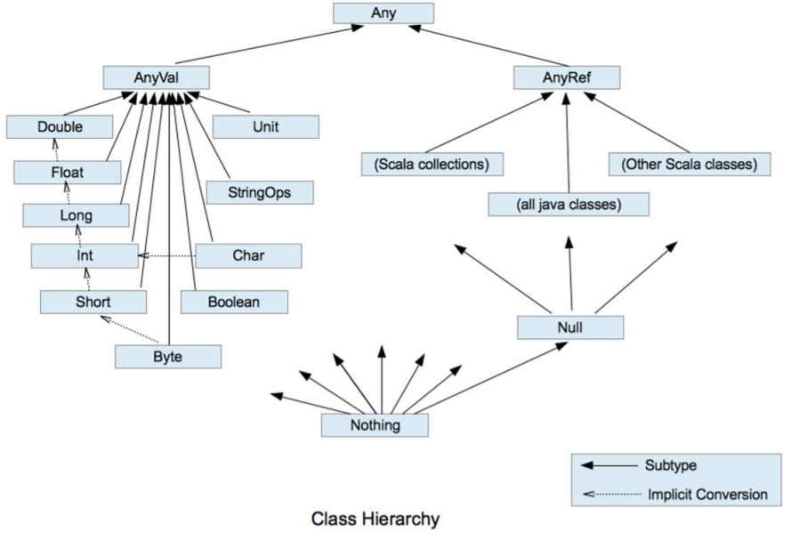

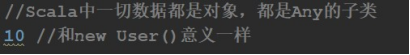

## 2.7 整数类型（Byte、Short、Int、Long）

Scala 的整数类型就是用于存放整数值的，比如 12，30，3456 等等。

1）整型分类

| **数据类型** | **描述**                                                     |
| ------------ | ------------------------------------------------------------ |
| Byte [1]     | 8 位有符号补码整数。数值区间为 -128 到 127                   |
| Short [2]    | 16 位有符号补码整数。数值区间为 -32768 到 32767              |
| Int [4]      | 32 位有符号补码整数。数值区间为 -2147483648 到 2147483647    |
| Long [8]     | 64 位有符号补码整数。数值区间为 -9223372036854775808 到9223372036854775807 = 2 的(64-1)次方-1 |

2） 案例实操

（1）Scala 各整数类型有固定的表示范围和字段长度，不受具体操作的影响，以保证Scala 程序的可移植性。

（2）Scala 的整型，默认为Int 型，声明 Long 型，须后加‘l’或‘L’

（3）Scala 程序中变量常声明为Int 型，除非不足以表示大数，才使用Long

```
object Test07_DataType {
  def main(args: Array[String]): Unit = {
    // 1. 整数类型
    val a1: Byte = 127
    val a2: Byte = -128

//    val a2: Byte = 128    // error

    val a3 = 12    // 整数默认类型为Int
    val a4: Long = 1324135436436L    // 长整型数值定义

    val b1: Byte = 10
    val b2: Byte = 10 + 20
    println(b2)

//    val b3: Byte = b1 + 20
    val b3: Byte = (b1 + 20).toByte
    println(b3)

    // 2. 浮点类型
    val f1: Float = 1.2345f
    val d1 = 34.2245

    // 3. 字符类型
    val c1: Char = 'a'
    println(c1)

    val c2: Char = '9'
    println(c2)

    // 控制字符
    val c3: Char = '\t'    // 制表符
    val c4: Char = '\n'    // 换行符
    println("abc" + c3 + "def")
    println("abc" + c4 + "def")

    // 转义字符
    val c5 = '\\'    // 表示\自身
    val c6 = '\"'    // 表示"
    println("abc" + c5 + "def")
    println("abc" + c6 + "def")

    // 字符变量底层保存ASCII码
    val i1: Int = c1
    println("i1: " + i1)
    val i2: Int = c2
    println("i2: " + i2)

    val c7: Char = (i1 + 1).toChar
    println(c7)
    val c8: Char = (i2 - 1).toChar
    println(c8)

    // 4. 布尔类型
    val isTrue: Boolean = true
    println(isTrue)

    // 5. 空类型
    // 5.1 空值Unit
    def m1(): Unit = {
      println("m1被调用执行")
    }

    val a: Unit = m1()
    println("a: " + a)

    // 5.2 空引用Null
//    val n: Int = null    // error
    var student: Student = new Student("alice", 20)
    student = null
    println(student)

    // 5.3 Nothing
    def m2(n: Int): Int = {
      if (n == 0)
        throw new NullPointerException
      else
        return n
    }


    val b: Int = m2(2)
    println("b: " + b)
  }
}
```

## 2.8 浮点类型（Float、Double）

Scala 的浮点类型可以表示一个小数，比如 123.4f，7.8，0.12 等等。

1）浮点型分类

| **数据类型** | **描述**                           |
| ------------ | ---------------------------------- |
| Float [4]    | 32 位, IEEE 754 标准的单精度浮点数 |
| Double [8]   | 64 位 IEEE 754 标准的双精度浮点数  |

2）案例实操
Scala 的浮点型常量默认为Double 型，声明 Float 型常量，须后加‘f’或‘F’。

```
object TestDataType {

    def main(args: Array[String]): Unit = {

        // 建议，在开发中需要高精度小数时，请选择Double var n7 = 2.2345678912f
        var n8 = 2.2345678912

        println("n7=" + n7) println("n8=" + n8)
    }
}
```

//运行的结果

```
n7=2.2345679 
n8=2.2345678912
```

## 2.9 字符类型（Char）

1）基本说明
字符类型可以表示单个字符，字符类型是 Char。

2）案例实操
（1）字符常量是用单引号 ' ' 括起来的单个字符。
（2）\t ：一个制表位，实现对齐的功能
（3）\n ：换行符

（4）\\ ：表示\

（5）\" ：表示"

```
object Test08_DataTypeConversion {
  def main(args: Array[String]): Unit = {

    // 1. 自动类型转换
    //    （1）自动提升原则：有多种类型的数据混合运算时，系统首先自动将所有数据转换成精度大的那种数据类型，然后再进行计算。
    val a1: Byte = 10
    val b1: Long = 2353
    val result1: Long = a1 + b1
    val result11: Int = (a1 + b1.toInt) // 强转

    //    （2）把精度大的数值类型赋值给精度小的数值类型时，就会报错，反之就会进行自动类型转换。
    val a2: Byte = 10
    val b2: Int = a2
    //    val c2: Byte = b2    // error

    //    （3）（byte，short）和char之间不会相互自动转换。
    val a3: Byte = 10
    val b3: Char = 'b'
    //    val c3: Byte = b3    // error
    val c3: Int = b3
    println(c3)

    //    （4）byte，short，char他们三者可以计算，在计算时首先转换为int类型。
    val a4: Byte = 12
    val b4: Short = 25
    val c4: Char = 'c'
    val result4: Int = a4 + b4
    val result44: Int = a4 + b4 + c4
    println(result44)

    // 2. 强制类型转换
    //    （1）将数据由高精度转换为低精度，就需要使用到强制转换
    val n1: Int = -2.9.toInt
    println("n1: " + n1)

    //    （2）强转符号只针对于最近的操作数有效，往往会使用小括号提升优先级
    val n2: Int = 2.6.toInt + 3.7.toInt
    val n3: Int = (2.6 + 3.7).toInt
    println("n2: " + n2)
    println("n3: " + n3)

    // 3. 数值类型和String类型的转换
    // (1) 数值转String
    val n: Int = 27
    val s: String = n + ""
    println(s)

    // (2) String转数值
    val m: Int = "12".toInt
    val f: Float = "12.3".toFloat
    val f2: Int = "12.3".toDouble.toInt
    println(f2)
  }
}
```

## 2.10 布尔类型：Boolean

1）基本说明
（1）布尔类型也叫Boolean 类型，Booolean 类型数据只允许取值 true 和 false
（2）boolean 类型占 1 个字节。

2）案例实操

```
object TestBooleanType {
    def main(args: Array[String]): Unit = { 
        var isResult : Boolean = false
        var isResult2 : Boolean = true
    }
}
```

## 2.11 Unit 类型、Null 类型和Nothing 类型（重点）

1）基本说明

| **数据类型** | **描述**                                                     |
| ------------ | ------------------------------------------------------------ |
| **Unit**     | 表示无值，和其他语言中 void 等同。用作不返回任何结果的方法的结果类型。Unit 只有一个实例值，写成()。 |
| **Null**     | null , Null 类型只有一个实例值 null                          |
| **Nothing**  | Nothing 类型在 Scala 的类层级最低端；它是任何其他类型的子类型。当一个函数，我们确定没有正常的返回值，可以用 Nothing 来指定返回类型，这样有一个好处，就是我们可以把返回的值（异常）赋给其它的函数或者变量（兼容性） |

1） 案例实操

（1） Unit 类型用来标识过程，也就是没有明确返回值的函数。

由此可见，Unit 类似于 Java 里的void。Unit 只有一个实例——**( )**，这个实例也没有实质意义

```
object TestSpecialType {

    def main(args: Array[String]): Unit = {

        def sayOk : Unit = {// unit 表示没有返回值，即 void
        }
        println(sayOk)
    }
}
```

（2）Null 类只有一个实例对象，Null 类似于 Java 中的 null 引用。Null 可以赋值给任意引用类型（AnyRef），但是不能赋值给值类型（AnyVal）

（3）Nothing，可以作为没有正常返回值的方法的返回类型，非常直观的告诉你这个方法不会正常返回，而且由于 Nothing 是其他任意类型的子类，他还能跟要求返回值的方法兼容。

```
object TestSpecialType {
    def main(args: Array[String]): Unit = { def test() : Nothing={
    	throw new Exception()
    }
}
```

## 2.12 类型转换

扩展 Java 面试题（隐式类型转换）：

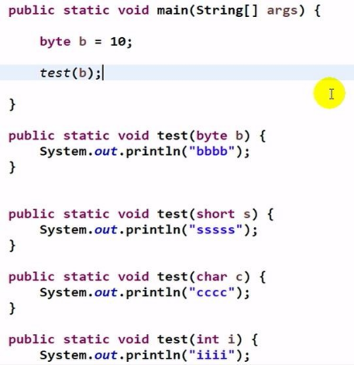

### 2.12.1 数值类型自动转换

当 Scala 程序在进行赋值或者运算时，精度小的类型自动转换为精度大的数值类型，这个就是自动类型转换（隐式转换）。数据类型按精度（容量）大小排序为：

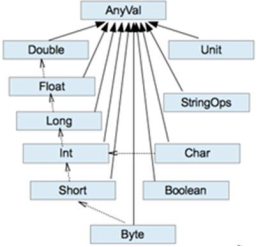

#### 1）基本说明

（1） 自动提升原则：有多种类型的数据混合运算时，系统首先**自动将所有数据转换成精度大的那种数据类型**，然后再进行计算。

（2） 把精度大的数值类型赋值给精度小的数值类型时，就会报错，反之就会进行自动类型转换。

（3）**（byte，short）和 char 之间不会相互自动转换。**

（4）**byte，short，char 他们三者可以计算，在计算时首先转换为 int 类型。**

#### 2） 案例实操

```
object TestValueTransfer {
    def main(args: Array[String]): Unit = {

        //（1）自动提升原则：有多种类型的数据混合运算时，系统首先自动将所有数据转换成精度大的那种数值类型，然后再进行计算。
        var n = 1 + 2.0
        println(n)	// n 就 是 Double
        //（2）把精度大的数值类型赋值给精度小的数值类型时，就会报错，反之就会进行自动类型转换。
        var n2 : Double= 1.0
        //var n3 : Int = n2 //错误，原因不能把高精度的数据直接赋值和低
        精度。
        //（3）（byte，short）和 char 之间不会相互自动转换。
        var n4 : Byte = 1
        //var c1 : Char = n4	//错误var n5:Int = n4

        //（4）byte，short，char 他们三者可以计算，在计算时首先转换为 int
        类型。
        var n6 : Byte = 1 var c2 : Char = 1
        // var n : Short = n6 + c2 //当 n6 + c2 结果类型就是int
        // var n7 : Short = 10 + 90 //错误
    }
}
```

> 注意：Scala 还提供了非常强大的隐式转换机制（隐式函数，隐式类等），我们放在高级部分专门用一个章节来讲解。

### 2.12.2 强制类型转换

##### 1）基本说明

自动类型转换的逆过程，**将精度大的数值类型转换为精度小的数值类型**。使用时要加上强制转函数，但可能造成精度降低或溢出，格外要注意。

```
Java	:	int num = (int)2.5
Scala :	var num : Int = 2.7.toInt
```

##### 2）案例实操

（1）将数据由高精度转换为低精度，就需要使用到强制转换
（2）强转符号只针对于最近的操作数有效，往往会使用小括号提升优先级

### 2.12.3 数值类型和String 类型间转换

```
object TestForceTransfer {

    def main(args: Array[String]): Unit = {

        //（1）将数据由高精度转换为低精度，就需要使用到强制转换
        var n1: Int = 2.5.toInt // 这个存在精度损失
        //（2）强转符号只针对于最近的操作数有效，往往会使用小括号提升优先级
        var r1: Int = 10 * 3.5.toInt + 6 * 1.5.toInt	// 10 *3 + 6*1 = 36
        var r2: Int = (10 * 3.5 + 6 * 1.5).toInt	// 44.0.toInt = 44

        println("r1=" + r1 + " r2=" + r2)
    }
}
```

### 2.12.3 数值类型和String 类型间转换

1）基本说明
在程序开发中，我们经常需要将基本数值类型转成 String 类型。或者将 String 类型转成基本数值类型。
2）案例实操
（1）基本类型转 String 类型（语法：将基本类型的值+"" 即可）
（2）String 类型转基本数值类型（语法：s1.toInt、s1.toFloat、s1.toDouble、s1.toByte、s1.toLong、s1.toShort）

```
object TestStringTransfer {

    def main(args: Array[String]): Unit = {

        //（1）基本类型转 String 类型（语法：将基本类型的值+"" 即可）
        var str1 : String = true + "" var str2 : String = 4.5 + "" var str3 : String = 100 +""

        //（2）String 类型转基本数值类型（语法：调用相关 API） var s1 : String = "12"

        var n1 : Byte = s1.toByte var n2 : Short = s1.toShort var n3 : Int = s1.toInt  var n4 : Long = s1.toLong
	}
}
```

（3）注意事项

在将 String 类型转成基本数值类型时，要确保 String 类型能够转成有效的数据，比如我们可以把"123"，转成一个整数，但是不能把"hello"转成一个整数。

var n5:Int = "12.6".toInt 会出现NumberFormatException 异常。

 **扩展面试题**

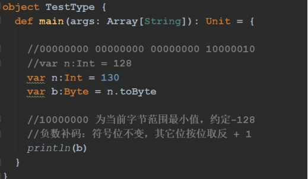

# 第 3 章 运算符

Scala 运算符的使用和 Java 运算符的使用基本相同，只有个别细节上不同。

## 3.1 算术运算符

#### 1）基本语法

| 运算符 | 运算       | 范例       | 结果    |
| ------ | ---------- | ---------- | ------- |
| +      | 正号       | +3         | 3       |
| -      | 负号       | b=4; -b    | -4      |
| +      | 加         | 5+5        | 10      |
| -      | 减         | 6-4        | 2       |
| *      | 乘         | 3*4        | 12      |
| /      | 除         | 5/5        | 1       |
| %      | 取模(取余) | 7%5        | 2       |
| +      | 字符串相加 | “He”+”llo” | “Hello” |

（1）对于除号“/”，它的整数除和小数除是有区别的：整数之间做除法时，只保留整数部分而舍弃小数部分。

（2）对一个数取模 a%b，和 Java 的取模规则一样。

2）案例实操

```
object TestArithmetic {

    def main(args: Array[String]): Unit = {

        //（1）对于除号“/”，它的整数除和小数除是有区别的：整数之间做除法   时，只保留整数部分而舍弃小数部分。
        var r1: Int = 10 / 3 // 3 
        println("r1=" + r1)

        var r2: Double = 10 / 3 // 3.0 
        println("r2=" + r2)

        var r3: Double = 10.0 / 3 // 3.3333 
        println("r3=" + r3)
        println("r3=" + r3.formatted("%.2f")) // 含义：保留小数点 2位，使用四舍五入
        //（2）对一个数取模 a%b，和 Java 的取模规则一样。
        var r4 = 10 % 3 // 1 
        println("r4=" + r4)
    }
}
```

## 3.2 关系运算符（比较运算符）

1）基本语法

| 运算符 | 运算     | 范例  | 结果  |
| ------ | -------- | ----- | ----- |
| ==     | 相等于   | 4==3  | false |
| !=     | 不等于   | 4！=3 | true  |
| <      | 小于     | 4<3   | false |
| >      | 大于     | 4>3   | true  |
| <=     | 小于等于 | 4<=3  | false |
| >=     | 大于等于 | 4>=3  | true  |

2）案例实操
（1）需求 1：

（2）需求 2：Java 和Scala 中关于==的区别

Java：
==比较两个变量本身的值，即两个对象在内存中的首地址；

equals 比较字符串中所包含的内容是否相同。

Scala：==更加类似于 Java 中的 equals，参照 jd 工具

```
def main(args: Array[String]): Unit = { 
	val s1 = "abc"
	val s2 = new String("abc")
	println(s1 == s2) 
	println(s1.eq(s2))
}
```

输出结果： 

true 

false

**scala中eq，equals，==，===经常搞混，这里总结一下**

- equals比较的是值是否相等

- eq比较的是 地址是否相等

- ==（等值符），如果比较的对象是null，==调用的是eq方法，如果比较的对象不是null，==调用的是equals方法。当等号两边的值为相同类型时比较值是否相同，类型不同时会发生类型的自动转换，转换为相同的类型后再作比较

- ===一般用于spark中，是在Column类中定义的函数，对应的不等于是=!=


## 3.3 逻辑运算符

1）基本语法
用于连接多个条件（一般来讲就是关系表达式），最终的结果也是一个 Boolean 值。假定：变量A 为 true，B 为 false

| 运算符 | 描述   | 实例                       |
| ------ | ------ | -------------------------- |
| &&     | 逻辑与 | (A && B) 运算结果为 false  |
| \|\|   | 逻辑或 | (A \|\| B) 运算结果为 true |
| !      | 逻辑非 | !(A && B) 运算结果为 true  |

> 扩展:避免逻辑与空指针异常

## 3.4 赋值运算符

1）基本语法
赋值运算符就是将某个运算后的值，赋给指定的变量。

| 运算符 | 描述                                           | 实例                                   |
| ------ | ---------------------------------------------- | -------------------------------------- |
| =      | 简单的赋值运算符，将一个表达式的值赋给一个左值 | C = A + B 将 A + B 表达式结果赋值 给 C |
| +=     | 相加后再赋值                                   | C += A 等 于 C = C + A                 |
| -=     | 相减后再赋值                                   | C -= A 等 于 C = C - A                 |
| *=     | 相乘后再赋值                                   | C *= A 等 于 C = C * A                 |
| /=     | 相除后再赋值                                   | C /= A 等 于 C = C / A                 |
| %=     | 求余后再赋值                                   | C %= A 等 于 C = C % A                 |
| <<=    | 左移后赋值                                     | C <<= 2 等 于 C = C << 2               |
| >>=    | 右移后赋值                                     | C >>= 2 等 于 C = C >> 2               |
| &=     | 按位与后赋值                                   | C &= 2	等 于 C = C & 2              |
| ^=     | 按位异或后赋值                                 | C ^= 2	等 于 C = C ^ 2              |
| \|=    | 按位或后赋值                                   | C \|= 2	等 于 C = C \| 2            |

>  注意：Scala 中没有++、--操作符，可以通过+=、-=来实现同样的效果；

## 3.5位运算符

1）基本语法
下 表 中 变 量 a 为 60，b 为 13 。

| 运算符 | 描述           | 实例                                                         |
| ------ | -------------- | ------------------------------------------------------------ |
| &      | 按位与运算符   | (a & b) 输出结果 12  ，二进制解释： 0000 1100                |
| \|     | 按位或运算符   | (a \| b) 输出结果 61 ，二进制解释： 0011 1101                |
| ^      | 按位异或运算符 | (a ^ b) 输出结果 49 ，二进制解释： 0011 0001                 |
| ~      | 按位取反运算符 | (~a ) 输出结果 -61 ，二进制解释： 1100 0011， 在一个有符号二进制数的补码形式。 |
| <<     | 左移动运算符   | a << 2  输出结果 240  ，二进制解释： 0011 0000               |
| >>     | 右移动运算符   | a >> 2  输出结果 15 ，二进制解释： 0000 1111                 |
| >>>    | 无符号右移     | a >>>2 输出结果 15, 二进制解释: 0000 1111                    |

## 3.6 Scala 运算符本质

**在 Scala 中其实是没有运算符的，所有运算符都是方法**。
1）当调用对象的方法时，点.可以省略
2）如果函数参数只有一个，或者没有参数，()可以省略

> a + b 就是 a.+(b)  调用了a对象的 + 方法

```
object TestOpt {
    def main(args: Array[String]): Unit = {

        // 标准的加法运算
        val i:Int = 1.+(1)

        // （1）当调用对象的方法时，.可以省略
        val j:Int = 1 + (1)

        // （2）如果函数参数只有一个，或者没有参数，()可以省略
        val k:Int = 1 + 1

        println(1.toString()) 
        println(1 toString()) 
        println(1 toString)
    }
}
```

# 第 4 章 流程控制

## 4.1 分支控制if-else

让程序有选择的的执行，分支控制有三种：单分支、双分支、多分支

### 4.1.1 单分支

1）基本语法

```
if	(条件表达式)	{
	执行代码块
}
```

说明：当条件表达式为 ture 时，就会执行{ }的代码。

2）案例实操

需求：输入人的年龄，如果该同志的年龄小于 18 岁，则输出“童年”

```
object TestIfElse {
    def main(args: Array[String]): Unit = {

        println("input age:")
        var age = StdIn.readShort()

        if (age < 18){ 
        	println("童年")
        }
    }
}
```

### 4.1.2 双分支

1）基本语法

```
if (条件表达式) {
	执行代码块 1
} else {
	执行代码块 2
}
```

### 4.1.3 多分支

1）基本语法

```
if (条件表达式 1) {
	执行代码块 1
}
else if (条件表达式 2) {
	执行代码块 2
}
	……
else {
	执行代码块 n
}
```

（2）需求 2：Scala 中 if else 表达式其实是有返回值的，具体返回值取决于满足条件的代码体的最后一行内容。

```
object TestIfElse	{
    def main(args: Array[String]): Unit = {

        println("input age")
        var age = StdIn.readInt()

        val res :String = if (age < 18){ 
        	"童年"
        }else if(age>=18 && age<30){ 
        	"中年"
        }else{
        	"老年"
        }

        println(res)
    }
}
```

（3）需求 3：Scala 中返回值类型不一致，取它们共同的祖先类型。

```
object TestIfElse	{
    def main(args: Array[String]): Unit = {

        println("input age")
        var age = StdIn.readInt()

        val res:Any = if (age < 18){ 
        	"童年"
        }else if(age>=18 && age<30){ 
        	"中年"
        }else{
        	100
        }

        println(res)
    }
}
```

（4）需求 4：Java 中的三元运算符可以用 if else 实现

如果大括号{}内的逻辑代码只有一行，大括号可以省略。如果省略大括号，if 只对最近的一行逻辑代码起作用。

```
object TestIfElse {

    def main(args: Array[String]): Unit = {

        // Java
        // int result = flag?1:0

        // Scala println("input age")
        var age = StdIn.readInt()
        val res:Any = if (age < 18)	"童年" else "成年" "不起作用"
        println(res)
    }
}
```

## 4.2 嵌套分支

在一个分支结构中又完整的嵌套了另一个完整的分支结构，里面的分支的结构称为内层。分支外面的分支结构称为外层分支。嵌套分支不要超过 3 层。

1）基本语法

```
if(){
    if(){

    }else{
	}
}
```

2）案例实操

需求：如果输入的年龄小于 18，返回“童年”。如果输入的年龄大于等于 18，需要再判断：如果年龄大于等于 18 且小于 30，返回“中年”；如果其他，返回“老年”。

```
object TestIfElse	{
    def main(args: Array[String]): Unit = {

        println("input age")
        var age = StdIn.readInt()

        val res :String = if (age < 18){ 
        	"童年"
        }else {
        	if(age>=18 && age<30){ 
        		"中年"
            }else{
            	"老年"
            }
        }

        println(res)
    }
}
```

## 4.3 Switch 分支结构

在 Scala 中没有 Switch，而是使用**模式匹配来处理。**
模式匹配涉及到的知识点较为综合，因此我们放在后面讲解。

## 4.4 For 循环控制

Scala 也为 for 循环这一常见的控制结构提供了非常多的特性，这些 for 循环的特性被称为 for 推导式或 for 表达式。

### 4.4.1范围数据循环（To）

1）基本语法

```
for(i <- 1 to 3){
	print(i + " ")
}
println()
```

（1）i 表示循环的变量，<- 规定 to

（2）i 将会从 1-3 循环，前后闭合

2）案例实操
需求：输出 5 句  "Hello world"

```
object TestFor {
    def main(args: Array[String]): Unit = { 
        for(i <- 1 to 5){
        	println("Hello world "+i)
        }
    }
}
```

### 4.4.2 范围数据循环（Until）

1）基本语法

```
for(i <- 1 until 3) { 
	print(i + " ")
}
println()
```

（1）这种方式和前面的区别在于 i 是从 1 到 3-1(2)
（2）即使**前闭合后开**的范围

### 4.4.3 循环守卫

1）基本语法

```
for(i <- 1 to 3 if i != 2) { 
	print(i + " ")
}
println()
```

说明：

（1） 循环守卫，即循环保护式（也称条件判断式，守卫）。保护式为 true 则进入循环体内部，为false 则跳过，类似于continue。

（2）上面的代码等价

```
for (i <- 1 to 3){
    if (i != 2) {
    	print(i + " ")
    }
}
```

### 4.4.4 循环步长

1）基本语法

```
for (i <- 1 to 10 by 2) { 
	println("i=" + i)
}
```

说明：by 表示步长

2）案例实操

需求：输出 1 到 10 以内的所有奇数

```
for (i <- 1 to 10 by 2) { 
	println("i=" + i)
}
```

输出结果

```
i=1 
i=3 
i=5 
i=7 
i=9
```

### 4.4.5嵌套循环

1）基本语法

```
for(i <- 1 to 3; j <- 1 to 3) { 
  println(" i =" + i + " j = " + j)
}
```

说明：没有关键字，所以范围后一定要加；来隔断逻辑

2）基本语法
上面的代码等价

```
for (i <- 1 to 3) {
    for (j <- 1 to 3) {
    	println("i =" + i + " j=" + j)
    }
}
```

### 4.4.6 引入变量

```
for(i <- 1 to 3; j = 4 - i) { 
	println("i=" + i + " j=" + j)
}
```

说明：
（1）for 推导式一行中有多个表达式时，所以要加 ; 来隔断逻辑

（1） for 推导式有一个不成文的约定：当 for 推导式仅包含单一表达式时使用圆括号， 当包含多个表达式时，一般每行一个表达式，并用花括号代替圆括号，如下

```
for {
	i <- 1 to 3 
	j = 4 - i
} {
	println("i=" + i + " j=" + j)
}
```

上面的代码等价于

```
for (i <- 1 to 3) { 
	var j = 4 - i
	println("i=" + i + " j=" + j)
}
```

### 4.4.7 循环返回值

1）基本语法

```
val res = for(i <- 1 to 10) yield i 
println(res)
```

说明：将遍历过程中处理的结果返回到一个新 Vector 集合中，使用 yield 关键字。

注意：开发中很少使用。

2）案例实操
需求：将原数据中所有值乘以 2，并把数据返回到一个新的集合中。

```
object TestFor {
    def main(args: Array[String]): Unit = 
    { 
        var res = for(i <-1 to 10) yield {
        	i * 2
        }

    	println(res)
    }
}
```

输出结果：
Vector(2, 4, 6, 8, 10, 12, 14, 16, 18, 20)

### 4.4.8 倒序打印

1）说明：如果想倒序打印一组数据，可以用 reverse。
2）案例实操：
需求：倒序打印 10 到 1

```
for(i <- 1 to 10 reverse){ 
	println(i)
}
```

## 4.5 While 和 do..While 循环控制

While 和 do..While 的使用和 Java 语言中用法相同。

### 4.5.1While 循环控制

1）基本语法

```
循环变量初始化
while (循环条件) {
	循环体(语句) 
	循环变量迭代
}
```

说明：

（1） 循环条件是返回一个布尔值的表达式

（2） while 循环是先判断再执行语句

（3） 与 for 语句不同，**while 语句没有返回值**，即整个 **while 语句的结果是Unit 类型()**

（4） **因为 while 中没有返回值**，所以当要用该语句来计算并返回结果时，就不可避免的使用变量，而变量需要声明在 while 循环的外部，那么就等同于循环的内部对外部的变量造成了影响，所以不推荐使用，而是推荐使用 for 循环。


### 4.5.2 do..while 循环控制

1）基本语法

```
循环变量初始化; 
do{

	循环体(语句) 
	循环变量迭代
} while(循环条件)
```

说明

（1） 循环条件是返回一个布尔值的表达式

（2） do..while 循环是先执行，再判断

## 4.6 循环中断

1） 基本说明

Scala 内置控制结构特地**去掉了** **break** **和** **continue**，是为了更好的适应**函数式编程**，推荐使用函数式的风格解决break 和continue 的功能，而不是一个关键字。Scala 中使用breakable 控制结构来实现 break 和 continue 功能。

1） 案例实操

需求 1：采用异常的方式退出循环

```
def main(args: Array[String]): Unit = {

    try {
        for (elem <- 1 to 10) { 
        	println(elem)
        	if (elem == 5) throw new RuntimeException
    	}
    }catch {
        case e =>
    }
    println("正常结束循环")
}
```

需求 2：采用 Scala 自带的函数，退出循环

```
import scala.util.control.Breaks
def main(args: Array[String]): Unit = { 
	Breaks.breakable(
        for (elem <- 1 to 10) { 
        	println(elem)
        	if (elem == 5) Breaks.break()
        }
    )

    println("正常结束循环")
}
```

需求 3：对break 进行省略

```
import scala.util.control.Breaks._ 
object TestBreak {
    def main(args: Array[String]): Unit = {

        breakable {
            for (elem <- 1 to 10) { 
                println(elem)
                if (elem == 5) break
            }
        }

        println("正常结束循环")
    }
}
```

需求 4：循环遍历 10 以内的所有数据，奇数打印，偶数跳过（continue）

```
object TestBreak {
    def main(args: Array[String]): Unit = { 
        for (elem <- 1 to 10) {
            if (elem % 2 == 1) { 
                println(elem)
            } else {
                println("continue")
            }
        }
    }
}
```

## 4.7 多重循环

1） 基本说明

（1） 将 一 个 循 环 放 在 另 一 个 循 环 体 内 ， 就 形 成 了 嵌 套 循 环 。 其 中 ，for，while，do…while均可以作为外层循环和内层循环。【**建议一般使用两层，最多不要** **超过** **3** **层**】

设外层循环次数为m 次，内层为 n 次，则内层循环体实际上需要执行 **m\*n** 次。

2）案例实操
需求：打印出九九乘法表

```
object TestWhile {

    def main(args: Array[String]): Unit = { 
    for (i <- 1 to 9) {
        for (j <- 1 to i) {
        	print(j + "*" + i + "=" + (i * j) + "\t")
        }

        println()
        }
    }
}
```

输出结果：

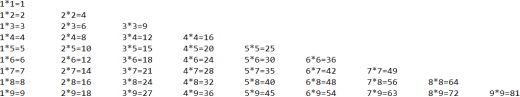


# 官方文档

[https://docs.scala-lang.org/zh-cn/scala3/book/scala-features.html](https://docs.scala-lang.org/zh-cn/scala3/book/scala-features.html)
