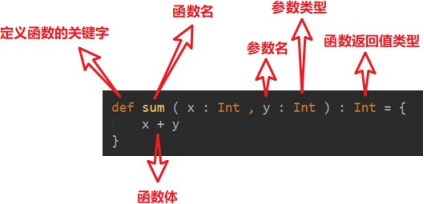

# 第 5 章 函数式编程

1）面向对象编程
解决问题，分解对象，行为，属性，然后通过对象的关系以及行为的调用来解决问题。

对象：用户
行为：登录、连接 JDBC、读取数据库

属性：用户名、密码

Scala 语言是一个完全面向对象编程语言。万物皆对象

对象的本质：对数据和行为的一个封装

2）函数式编程
解决问题时，将问题分解成一个一个的步骤，将每个步骤进行封装（函数），通过调用这些封装好的步骤，解决问题。

例如：请求->用户名、密码->连接 JDBC->读取数据库Scala 语言是一个完全函数式编程语言。万物皆函数。函数的本质：函数可以当做一个值进行传递

3）在Scala 中函数式编程和面向对象编程完美融合在一起了。

## 5.1 函数基础

### 5.1.1 函数基本语法

1）基本语法



2）案例实操

需求：定义一个函数，实现将传入的名称打印出来。

```
object TestFunction {

    def main(args: Array[String]): Unit = {

        // （1）函数定义
        def f(arg: String): Unit = {
            println(arg)
        }

        // （2）函数调用
        // 函数名（参数）
        f("hello world")
    }
}
```

### 5.1.2 函数和方法的区别

1）核心概念
（1）为完成某一功能的程序语句的集合，称为函数。
（2）类中的函数称之方法。
2）案例实操
（1）Scala 语言可以在任何的语法结构中声明任何的语法
（2）函数没有重载和重写的概念；方法可以进行重载和重写
（3）Scala 中函数可以嵌套定义

```scala
object TestFunction {

    // (2)方法可以进行重载和重写，程序可以执行
    def main(): Unit = {

    }

    def main(args: Array[String]): Unit = {
        // （1）Scala 语言可以在任何的语法结构中声明任何的语法
        import java.util.Date new Date()

        // (2)函数没有重载和重写的概念，程序报错
        def test(): Unit ={
            println("无参，无返回值")
        }
        test()

        def test(name:String):Unit={ 
        	println()
        }

        //（3）Scala 中函数可以嵌套定义
        def test2(): Unit ={
        	println("函数可以嵌套定义")
        }
    }
}
```

### 5.1.3 函数定义

1） 函数定义

（1） 函数 1：无参，无返回值

（2） 函数 2：无参，有返回值

（3） 函数 3：有参，无返回值

（4） 函数 4：有参，有返回值

（5） 函数 5：多参，无返回值

（6） 函数 6：多参，有返回值

```
object TestFunctionDeclare {
    def main(args: Array[String]): Unit = {

        // 函数 1：无参，无返回值
        def test1(): Unit ={
        	println("无参，无返回值")
        }
        test1()

        // 函数 2：无参，有返回值
        def test2():String={
        	return "无参，有返回值"
        }
        println(test2())

        // 函数 3：有参，无返回值
        def test3(s:String):Unit={ 
        	println(s)
        }
        test3("jinlian")
        // 函数 4：有参，有返回值
        def test4(s:String):String={ 
        	return s+"有参，有返回值"
        }
        println(test4("hello "))

        // 函数 5：多参，无返回值
        def test5(name:String, age:Int):Unit={ 
        	println(s"$name, $age")
        }
        test5("dalang",40)
    }
}
```

### 5.1.4 函数参数

1）案例实操
（1）可变参数
（2）如果参数列表中存在多个参数，那么可变参数一般放置在最后
（3）参数默认值，一般将有默认值的参数放置在参数列表的后面
（4）带名参数

```scala
object TestFunction {

    def main(args: Array[String]): Unit = {

        // （1）可变参数
        def test( s : String* ): Unit = { 
            println(s)
        }

        // 有输入参数：输出 Array test("Hello", "Scala")

        // 无输入参数：输出List() test()

        // (2)如果参数列表中存在多个参数，那么可变参数一般放置在最后
        def test2( name : String, s: String* ): Unit = {
        	println(name + "," + s)
        }

        test2("jinlian", "dalang")

        // (3)参数默认值
        def test3( name : String, age : Int = 30 ): Unit = {
        	println(s"$name, $age")
        }

        // 如果参数传递了值，那么会覆盖默认值
        test3("jinlian", 20)

        // 如果参数有默认值，在调用的时候，可以省略这个参数
        test3("dalang")

        // 一般情况下，将有默认值的参数放置在参数列表的后面
        def test4( sex : String = "男", name : String ): Unit ={
            println(s"$name, $sex")
        }
        // Scala 函数中参数传递是，从左到右
        //test4("wusong")
        //（4）带名参数
        test4(name="ximenqing")
     }
}
```


### 5.1.5 函数至简原则（重点）

函数至简原则：能省则省

1）至简原则细节
（1）return 可以省略，Scala 会使用函数体的最后一行代码作为返回值
（2）如果函数体只有一行代码，可以省略花括号
（3）返回值类型如果能够推断出来，那么可以省略（:和返回值类型一起省略）
（4）如果有 return，则不能省略返回值类型，必须指定
（5）如果函数明确声明unit，那么即使函数体中使用 return 关键字也不起作用
（6）Scala 如果期望是无返回值类型，可以省略等号
（7）如果函数无参，但是声明了参数列表，那么调用时，小括号，可加可不加
（8）如果函数没有参数列表，那么小括号可以省略，调用时小括号必须省略
（9）如果不关心名称，只关心逻辑处理，那么函数名（def）可以省略

2）案例实操

```
object TestFunction {

    def main(args: Array[String]): Unit = {

        // （0）函数标准写法
        def f( s : String ): String = { 
        	return s + " jinlian"
        }
        println(f("Hello"))

        // 至简原则:能省则省
        //（1） return 可以省略,Scala 会使用函数体的最后一行代码作为返回值
        def f1( s : String ): String =	{ 
        	s + " jinlian"
        }
        println(f1("Hello"))

        //（2）如果函数体只有一行代码，可以省略花括号
        def f2(s:String):String = s + " jinlian"

        //（3）返回值类型如果能够推断出来，那么可以省略（:和返回值类型一起省略）
        def f3( s : String ) = s + " jinlian" 
        println(f3("Hello3"))

        //（4）如果有 return，则不能省略返回值类型，必须指定。
        def f4() :String = {
        	return "ximenqing4"
        }
        println(f4())

        //（5）如果函数明确声明 unit，那么即使函数体中使用 return 关键字也不起作用
        def f5(): Unit = { 
        	return "dalang5"
        }
        println(f5())

        //（6）Scala 如果期望是无返回值类型,可以省略等号
        // 将无返回值的函数称之为过程
        def f6() {
        	"dalang6"
        }
        println(f6())

        //（7）如果函数无参，但是声明了参数列表，那么调用时，小括号，可加可
        不加
        def f7() = "dalang7" 
        println(f7())
        println(f7)

        //（8）如果函数没有参数列表，那么小括号可以省略,调用时小括号必须省
        略
        def f8 = "dalang"
        //println(f8()) 
        println(f8)

        //（9）如果不关心名称，只关心逻辑处理，那么函数名（def）可以省略
        def f9 = (x:String)=>{println("wusong")}

        def f10(f:String=>Unit) = { 
        	f("")
        }

        f10(f9)
        println(f10((x:String)=>{println("wusong")}))
    }
}
```

## 5.2 函数高级

### 5.2.1 高阶函数

在 Scala 中，函数是一等公民。怎么体现的呢？ 对于一个函数我们可以：**定义函数、调用函数**

```
object TestFunction {

    def main(args: Array[String]): Unit = {
        // 调用函数
        foo()
    }
        // 定义函数
    def foo():Unit = { 
    	println("foo...")
    }
}
```

但是其实函数还有更高阶的用法

1）函数可以作为值进行传递

> 函数 foo 后面加上 _，相当于把函数 foo 当成一个整体， 传递给变量 f1

```scala
object TestFunction {

    def main(args: Array[String]): Unit = {

    //（1）调用 foo 函数，把返回值给变量f
    //val f = foo() 
    val f = foo 
    println(f)
    //（2）在被调用函数 foo 后面加上 _，相当于把函数 foo 当成一个整体， 传递给变量 f1
    val f1 = foo _

    foo()
    f1()
    //（3）如果明确变量类型，那么不使用下划线也可以将函数作为整体传递给
    变量
    var f2:()=>Int = foo
    }

    def foo():Int = { 
        println("foo...") 
    }
}
```

2）函数可以作为参数进行传递

```
def main(args: Array[String]): Unit = {

    //（1）定义一个函数，函数参数还是一个函数签名；f 表示函数名称;(Int,Int)表示输入两个 Int 参数；Int 表示函数返回值
    def f1(f: (Int, Int) => Int): Int = { 
    	f(2, 4)
    }

    // （2）定义一个函数，参数和返回值类型和f1 的输入参数一致
    def add(a: Int, b: Int): Int = a + b

    // （3）将 add 函数作为参数传递给 f1 函数，如果能够推断出来不是调用，_ 可以省略
    println(f1(add)) 
    println(f1(add _))
    //可以传递匿名函数
}
```

3）函数可以作为函数返回值返回

```scala
def main(args: Array[String]): Unit = { 
    def f1() = {
        def f2() = {

        }
        f2 _
    }

    val f = f1()
    // 因为f1 函数的返回值依然为函数，所以可以变量f 可以作为函数继续调用
    f()
    // 上面的代码可以简化为
    f1()()
}
```

### 5.2.2 匿名函数

1）说明
没有名字的函数就是匿名函数。
`(x:Int)=>{函数体}`
x：表示输入参数类型；Int：表示输入参数类型；函数体：表示具体代码逻辑

2）案例实操
需求 1：传递的函数有一个参数传递匿名函数至简原则：
（1）参数的类型可以省略，会根据形参进行自动的推导
（2）类型省略之后，发现只有一个参数，则圆括号可以省略；其他情况：没有参数和参数超过 1 的永远不能省略圆括号。
（3）匿名函数如果只有一行，则大括号也可以省略
如果参数只出现一次，则参数省略且后面参数可以用_代替

```scala
def main(args: Array[String]): Unit = {

    // （1）定义一个函数：参数包含数据和逻辑函数
    def operation(arr: Array[Int], op: Int => Int) = { 
    	for (elem <- arr) yield op(elem)
    }

    // （2）定义逻辑函数
    def op(ele: Int): Int = { 
    	ele + 1
    }

    // （3）标准函数调用
    val arr = operation(Array(1, 2, 3, 4), op) println(arr.mkString(","))

    // （4）采用匿名函数
    val arr1 = operation(Array(1, 2, 3, 4), (ele: Int) => { 
    	ele + 1
    })
    println(arr1.mkString(","))

    // （4.1）参数的类型可以省略，会根据形参进行自动的推导; 
    val arr2 = operation(Array(1, 2, 3, 4), (ele) => {
    	ele + 1
    })
    println(arr2.mkString(","))

    // （4.2）类型省略之后，发现只有一个参数，则圆括号可以省略；其他情况：没有参数和参数超过 1 的永远不能省略圆括号。
    val arr3 = operation(Array(1, 2, 3, 4), ele => { 
    	ele + 1
    })
    println(arr3.mkString(","))

    // (4.3) 匿名函数如果只有一行，则大括号也可以省略
    val arr4 = operation(Array(1, 2, 3, 4), ele => ele + 1) println(arr4.mkString(","))

    //（4.4）如果参数只出现一次，则参数省略且后面参数可以用_代替
    val arr5 = operation(Array(1, 2, 3, 4), _ + 1) println(arr5.mkString(","))
    }
}
```


需求 2：传递的函数有两个参数

```
object TestFunction {

    def main(args: Array[String]): Unit = {

        def calculator(a: Int, b: Int, op: (Int, Int) => Int): Int = {
        	op(a, b)
        }

        // （1）标准版
        println(calculator(2, 3, (x: Int, y: Int) =>	{x + y}))

        // （2）如果只有一行，则大括号也可以省略
        println(calculator(2, 3, (x: Int, y: Int) =>	x + y))

        // （3）参数的类型可以省略，会根据形参进行自动的推导; 
        println(calculator(2, 3, (x , y) =>	x + y))

        // （4）如果参数只出现一次，则参数省略且后面参数可以用_代替
        println(calculator(2, 3,	_ + _))
    }
}
```

### 5.2.4 函数柯里化&闭包

闭包：函数式编程的标配
1）说明
闭包：如果一个函数，访问到了它的外部（局部）变量的值，那么这个函数和他所处的环境，称为闭包
函数柯里化：把一个参数列表的多个参数，变成多个参数列表。
2）案例实操

（1）闭包

```
object TestFunction {

    def main(args: Array[String]): Unit = { 
        def f1()={
            var a:Int = 10 
            def f2(b:Int)={
                a + b
            }
            f2 _
        }

        // 在调用时，f1 函数执行完毕后，局部变量a 应该随着栈空间释放掉
        val f = f1()

        // 但是在此处，变量a 其实并没有释放，而是包含在了 f2 函数的内部，形成了闭合的效果
        println(f(3))

        println(f1()(3))

        // 函数柯里化，其实就是将复杂的参数逻辑变得简单化,函数柯里化一定存在闭包
        def f3()(b:Int)={ 
        	a + b
        }

        println(f3()(3))
    }
}
```

### 5.2.5 递归

1）说明
一个函数/方法在函数/方法体内又调用了本身，我们称之为递归调用

2）案例实操

```
object TestFunction {

    def main(args: Array[String]): Unit = {

        // 阶 乘
        // 递归算法
        // 1) 方法调用自身
        // 2) 方法必须要有跳出的逻辑
        // 3) 方法调用自身时，传递的参数应该有规律
        // 4) scala 中的递归必须声明函数返回值类型
        println(test(5))
    }

   def test(i : Int) : Int = { 
		if (i == 1) {
               1
         } else {
               i * test(I - 1)
         }
    }
}
```

### 5.2.6 控制抽象

1）值调用：把计算后的值传递过去

```
object TestControl {
    def main(args: Array[String]): Unit = { 
        def f = ()=>{
            println("f...")
            10
        }

        foo(f())
    }

    def foo(a: Int):Unit = { 
        println(a) 
        println(a)
    }
}
```

2）名调用：把代码传递过去

```
object TestControl {
    def main(args: Array[String]): Unit = { 
        def f = ()=>{
            println("f...")
            10
        }

    	foo(f())
    }

    //def foo(a: Int):Unit = {
    def foo(a: =>Int):Unit = {//注意这里变量 a 没有小括号了
    	println(a) 
    	println(a)
    }
}
输出结果：
f... 
10 
f... 
10
```

注意：Java 只有值调用；Scala 既有值调用，又有名调用。

### 5.2.7 惰性加载

1）说明
当函数返回值被声明为 lazy 时，函数的执行将被推迟，直到我们首次对此取值，该函数才会执行。这种函数我们称之为惰性函数。

2）案例实操

```
def main(args: Array[String]): Unit = {

    lazy val res = sum(10, 30) 
    println("---------------") 
    println("res=" + res)
}

def sum(n1: Int, n2: Int): Int = { 
    println("sum 被 执 行 。 。 。 ") 
    return n1 + n2
}
```

输出结果：

```
---------------
sum 被执行。。。
res=40
```

> 注意：lazy 不能修饰 var 类型的变量

