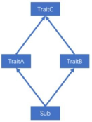

# 第 6 章 面向对象

Scala 的面向对象思想和 Java 的面向对象思想和概念是一致的。
Scala 中语法和 Java 不同，补充了更多的功能。

## 6.1 Scala 包

1）基本语法
	package 包名
2）Scala 包的三大作用（和 Java 一样）
（1）区分相同名字的类
（2）当类很多时，可以很好的管理类
（3）控制访问范围

### 6.1.1 包的命名

1） 命名规则

只能包含数字、字母、下划线、小圆点.，但不能用数字开头，也不要使用关键字。

2） 案例实操

```
demo.class.exec1	//错误，因为 class 关键字
demo.12a	//错误，数字开头
```

3）命名规范
一般是小写字母+小圆点
`com.公司名.项目名.业务模块名`

4）案例实操

```
com.admin4j.oa.model 
com.admin4j.oa.controller 
com.sohu.bank.order
```

### 6.1.2 包说明（包语句）

1）说明
Scala 有两种包的管理风格，一种方式和 Java 的包管理风格相同，每个源文件一个包（包名和源文件所在路径不要求必须一致），包名用“.”进行分隔以表示包的层级关系，如 com.admin4j.scala。另一种风格，通过嵌套的风格表示层级关系，如下

```
package com{ 
	package admin4j{
        package scala{

        }
    }
}
```

（1）一个源文件中可以声明多个 package
（2）子包中的类可以直接访问父包中的内容，而无需导包

2）案例实操

```scala
package com {
    import com.admin4j.Inner //父包访问子包需要导包
    object Outer {
        val out: String = "out"

        def main(args: Array[String]): Unit = { 
            println(Inner.in)
        }
    }
    
    package admin4j { 
        
        object Inner {
            val in: String = "in"

            def main(args: Array[String]): Unit = { 
                println(Outer.out) //子包访问父包无需导包
            }
    	}
    }
}
```

### 6.1.3 包对象

在 Scala 中可以为每个包定义一个同名的包对象，定义在包对象中的成员，作为其对应包下所有 class 和 object 的共享变量，可以被直接访问。

1）定义

```
package object com{
	val shareValue="share" 
	def shareMethod()={}
}
```

1）说明
（1）若使用 Java 的包管理风格，则包对象一般定义在其对应包下的 package.scala文件中，包对象名与包名保持一致。


（2）如采用嵌套方式管理包，则包对象可与包定义在同一文件中，但是要保证包对象与包声明在同一作用域中。

```
package com {

    object Outer {
        val out: String = "out"

        def main(args: Array[String]): Unit = { 
            println(name)
        }
    }
}

package object com {
	val name: String = "com"
}
```

### 6.1.4 导包说明

1）和 Java 一样，可以在顶部使用 import 导入，在这个文件中的所有类都可以使用。

2）局部导入：什么时候使用，什么时候导入。**在其作用范围内都可以使用**

3）通配符导入：import java.util._
4）给类起名：import java.util.{ArrayList=>JL}

5）导入**相同包**的多个类：import java.util.{HashSet, ArrayList} 

6）屏蔽类：import java.util.{ArrayList =>_,_}
7）导入包的绝对路径：new _root_.java.util.HashMap

```
package java { 
    package util {
        class HashMap {

        }
    }
}
```

说明

 

| import com.atguigu.Fruit              | 引入 com.atguigu 包下Fruit（class 和 object）              |
| ------------------------------------- | ---------------------------------------------------------- |
| import com.atguigu._                  | 引入 com.atguigu 下的所有成员                              |
| import com.atguigu.Fruit._            | 引入 Fruit(object)的所有成员                               |
| import com.atguigu.{Fruit,Vegetable}  | 引入 com.atguigu 下的Fruit 和 Vegetable                    |
| import com.atguigu.{Fruit=>Shuiguo}   | 引入 com.atguigu 包下的 Fruit 并更名为 Shuiguo             |
| import com.atguigu.{Fruit=>Shuiguo,_} | 引入 com.atguigu 包下的所有成员，并将 Fruit 更名为 Shuiguo |
| import com.atguigu.{Fruit=>_,_}       | 引入 com.atguigu 包下屏蔽 Fruit 类                         |
| new _root_.java.util.HashMap          | 引入的 Java 的绝对路径                                     |

2）注意
Scala 中的三个默认导入分别是
import java.lang._ 

import scala._ 

import scala.Predef._

## 6.2 类和对象

类：可以看成一个模板

对象：表示具体的事物

### 6.2.1定义类

1）回顾：Java 中的类
如果类是 public 的，则必须和文件名一致。一般，一个.java 有一个 public 类
注意：Scala 中没有 public，一个.scala 中可以写多个类。

1）基本语法

```
[修饰符] class 类名 {
	类体
}
```

说明
（1）Scala 语法中，类并不声明为public，所有这些类都具有公有可见性（即默认就是public）
（2）一个Scala 源文件可以包含多个类

2）案例实操

```
//（1）Scala 语法中，类并不声明为 public，所有这些类都具有公有可见性（即默认就是 public）
class Person {

}

//（2）一个 Scala 源文件可以包含多个类
class Teacher{

}
```

### 6.2.2 属性

属性是类的一个组成部分

1）基本语法
**[修饰符] var|val 属性名称 [：类型] = 属性值**
注：Bean 属性（@BeanPropetry），可以自动生成规范的 setXxx/getXxx 方法

2）案例实操

```scala
import scala.beans.BeanProperty 
class Person {
    var name: String = "bobo" //定义属性
    var age: Int = _ // _表示给属性一个默认值
    //Bean 属性（@BeanProperty）
    @BeanProperty var sex: String = "男"
    //val 修饰的属性不能赋默认值，必须显示指定
}

object Person {
    def main(args: Array[String]): Unit = {

        var person = new Person() 
        println(person.name)

        person.setSex(" 女 ") 
        println(person.getSex)
    }
}
```

## 6.3 封装

封装就是把抽象出的**数据和对数据的操作封装在一起**，数据被保护在内部，程序的其它部分只有通过被授权的操作（成员方法），才能对数据进行操作。Java 封装操作如下，
（1）将属性进行私有化
（2）提供一个公共的 set 方法，用于对属性赋值
（3）提供一个公共的 get 方法，用于获取属性的值
Scala 中的 public 属性，底层实际为 private，并通过 get 方法（obj.field()）和 set 方法
（obj.field_=(value)）对其进行操作。所以 Scala 并不推荐将属性设为 private，再为其设置public 的 get 和 set 方法的做法。但由于很多 Java 框架都利用反射调用 getXXX 和 setXXX 方法，有时候为了和这些框架兼容，也会为 Scala 的属性设置 getXXX 和 setXXX 方法（通过@BeanProperty 注解实现）。

## 6.4 访问权限

1）说明
在 Java 中，访问权限分为：public，private，protected 和默认。

在 Scala 中，你可以通过类似的修饰符达到同样的效果。但是使用上有区别。
（1）Scala 中属性和方法的**默认访问权限为 public**，但 Scala 中无 public 关键字。
（2）private 为私有权限，只在类的内部和伴生对象中可用。
（3）**protected 为受保护权限，Scala 中受保护权限比 Java 中更严格，同类、子类可以访问，同包无法访问。**
（4）**private[包名]增加包访问权限，包名下的其他类也可以使用**
2）案例实操

```
package com.admin4j.scala.test

class Person {

    private var name: String = "bobo" 
    protected var age: Int = 18 
    private[test] var sex: String = "男"
    def say(): Unit = { 
    	println(name)
    }
}

object Person {

    def main(args: Array[String]): Unit = { 
    
        val person = new Person person.say()
        println(person.name)
        println(person.age)
    }
}

class Teacher extends Person { 
    def test(): Unit = {
    	this.age this.sex
    }
}

class Animal {
    def test: Unit = { 
    	new Person().sex
    }
}
```

## 6.5 方法

1）基本语法

```
def 方法名(参数列表) [：返回值类型] = {
	方法体
}
```

2）案例实操

```
class Person {

    def sum(n1:Int, n2:Int) : Int = { 
        n1 + n2
	}
}

object Person {

    def main(args: Array[String]): Unit = { 
    	val person = new Person() 
    	println(person.sum(10, 20))
    }
}
```

## 6.6 创建对象

1）基本语法
`val | var 对象名  [：类型]	= new 类型()`
2）案例实操
（1）val 修饰对象，不能改变对象的引用（即：内存地址），可以改变对象属性的值。
（2）var 修饰对象，可以修改对象的引用和修改对象的属性值
（3）自动推导变量类型不能多态，所以多态需要显示声明

```
class Person {
	var name: String = "canglaoshi"
}

object Person {

    def main(args: Array[String]): Unit = {
        //val 修饰对象，不能改变对象的引用（即：内存地址），可以改变对象属性的值。
        val person = new Person() 
        person.name = "bobo"

        // person = new Person()// 错误的
        println(person.name)
    }
}
```

## 6.7 构造器

和 Java 一样，Scala 构造对象也需要调用构造方法，并且可以有任意多个构造方法。
Scala 类的构造器包括：**主构造器和辅助构造器**

1）基本语法

```
class  类名(形参列表) {	// 主构造器
    // 类 体
    def	this(形参列表) {	// 辅助构造器
    }

    def	this(形参列表) {	//辅助构造器可以有多个...
    }
}
```

说明：
（1）辅助构造器，函数的名称 this，可以有多个，编译器通过参数的个数及类型来区分。
（2）辅助构造方法不能直接构建对象，必须直接或者间接调用主构造方法。
（3）构造器调用其他另外的构造器，要求被调用构造器必须提前声明。

2）案例实操
（1）如果主构造器无参数，小括号可省略，构建对象时调用的构造方法的小括号也可以省略。

```
//（1）如果主构造器无参数，小括号可省略
//class Person (){ 
class Person {

    var name: String = _ 
    var age: Int = _
    
    def this(age: Int) {
        this() this.age = age
        println("辅助构造器")
    }

    def this(age: Int, name: String) { 
        this(age)
        this.name = name
    }

	println("主构造器")
}

object Person {
	def main(args: Array[String]): Unit = { 
		val person2 = new Person(18)
	}
}
```

### 6.7.1 构造器参数

1）说明
Scala 类的主构造器函数的形参包括三种类型：未用任何修饰、var 修饰、val 修饰
（1）未用任何修饰符修饰，这个参数就是一个局部变量
（2）var 修饰参数，作为类的成员属性使用，可以修改
（3）val 修饰参数，作为类只读属性使用，不能修改

```
class Person(name: String, var age: Int, val sex: String) {

}

object Test {

    def main(args: Array[String]): Unit = {

        var person = new Person("bobo", 18, "男")
        // （1）未用任何修饰符修饰，这个参数就是一个局部变量
        // printf(person.name)

        // （2）var 修饰参数，作为类的成员属性使用，可以修改
        person.age = 19 
        println(person.age)
        // （3）val 修饰参数，作为类的只读属性使用，不能修改
        // person.sex = "女" println(person.sex)
    }
}
```

## 6.8 继承和多态

1）基本语法
`class  子类名  extends 父类名	{ 类 体 }`
（1）子类继承父类的属性和方法
（2）scala 是单继承

2）案例实操
（1）子类继承父类的属性和方法
（2）继承的调用顺序：父类构造器->子类构造器

```scala
class Person(nameParam: String) {

    var name = nameParam 
    var age: Int = _

    def this(nameParam: String, ageParam: Int) { 
        this(nameParam)
        this.age = ageParam println("父类辅助构造器")
    }

	println("父类主构造器")
}

class Emp(nameParam: String,ageParam:Int) extends Person(nameParam, ageParam) { 
	
	var empNo: Int = _
    def this(nameParam: String, ageParam: Int, empNoParam: Int) { 
    
        this(nameParam, ageParam)
        this.empNo = empNoParam 
        println("子类的辅助构造器")
    }
    
    println("子类主构造器")
}

object Test {
	def main(args: Array[String]): Unit = { 
		new Emp("z3", 11,1001)
	}
}
```

3）动态绑定
Scala 中属性和方法都是动态绑定，而Java 中只有方法为动态绑定。

案例实操(对比 Java 与 Scala 的重写) 

- Scala

```
class Person {
    val name: String = "person"

    def hello(): Unit = { 
    	println("hello person")
    }
}

class Teacher extends Person {
    
    override val name: String = "teacher" 
    
    override def hello(): Unit = {
    	println("hello teacher")
    }
}

object Test {
    def main(args: Array[String]): Unit = { 
    
        val teacher: Teacher = new Teacher() 
        println(teacher.name) 
        teacher.hello()

        val teacher1:Person = new Teacher 
        println(teacher1.name) 
        teacher1.hello()
    }
}
```

- Java

```
class Person {

    public String name = "person"; 
    public void hello() {
        System.out.println("hello person");
    }
}

class Teacher extends Person {

    public String name = "teacher"; 
    @Override
    public void hello() { 
        System.out.println("hello teacher");
    }
}

public class TestDynamic {

	public static void main(String[] args) {

        Teacher teacher = new Teacher();
        Person teacher1 = new Teacher();

        System.out.println(teacher.name); 
        teacher.hello();

        System.out.println(teacher1.name); 
        teacher1.hello();
    }
}
```

- 结果对比

  **Scala**
  **Java**

## 6.9 抽象类

### 6.9.1 抽象属性和抽象方法

#### 1）基本语法

（1）定义抽象类：abstract class Person{} //通过 abstract 关键字标记抽象类
（2）定义抽象属性：val|var name:String //一个属性没有初始化，就是抽象属性
（3）定义抽象方法：def	hello():String //只声明而没有实现的方法，就是抽象方法

案例实操

```
abstract class Person {
	val name: String 
	def hello(): Unit
}

class Teacher extends Person {
    
    val name: String = "teacher" 
    def hello(): Unit = {
    	println("hello teacher")
    }
}
```

#### 2）继承&重写

（1）如果父类为抽象类，那么子类需要将抽象的属性和方法实现，否则子类也需声明为抽象类
（2）重写非抽象方法需要用 override 修饰，重写抽象方法则可以不加 override。
（3）子类中调用父类的方法使用 super 关键字
（4）子类对抽象属性进行实现，父类抽象属性可以用 var 修饰；
子类对非抽象属性重写，父类非抽象属性只支持 val 类型，而不支持 var。

因为 var 修饰的为可变变量，子类继承之后就可以直接使用，没有必要重写

### 6.9.2匿名子类

1）说明
和 Java 一样，可以通过包含带有定义或重写的代码块的方式创建一个匿名的子类。

2）案例实操

```
abstract class Person {
	val name: String def hello(): Unit
}

object Test {

    def main(args: Array[String]): Unit = { 
    
        val person = new Person {
        
            override val name: String = "teacher"

            override def hello(): Unit = println("hello teacher")
        }
    }
}
```


## 6.10 单例对象（伴生对象）

Scala语言是完全面向对象的语言，所以并没有静态的操作（即在Scala中没有静态的概念）。但是为了能够和Java语言交互（因为Java中有静态概念），就产生了一种特殊的对象来模拟类对象，该对象为**单例对象**。若单例对象名与类名一致，则称该单例对象这个类的**伴生对象**，这个类的所有“静态”内容都可以放置在**它的伴生对象中声明。**

### 6.10.1 单例对象语法

1） 基本语法

```
object Person{

	val country:String="China"
}
```

2）说明

（1） 单例对象采用object 关键字声明

（2） 单例对象对应的类称之为伴生类，伴生对象的名称应该和伴生类名一致。

（3） 单例对象中的属性和方法都可以通过伴生对象名（类名）直接调用访问。

3）案例实操

```
//（1）伴生对象采用 object 关键字声明
object Person {
	var country: String = "China"
}

//（2）伴生对象对应的类称之为伴生类，伴生对象的名称应该和伴生类名一致。
class Person {
	var name: String = "bobo"
}

object Test {
    def main(args: Array[String]): Unit = {
        //（3）伴生对象中的属性和方法都可以通过伴生对象名（类名）直接调用访问。
        println(Person.country)
    }
}
```

### 6.10.2 apply 方法

1）说明
（1）通过**伴生对象**的 **apply 方法**，实现不使用 new 方法创建对象。
（2）如果想让主构造器变成私有的，可以在()之前加上 private。
（3）apply 方法可以重载。
（4）Scala 中 **obj(arg)**的语句实际是在调用该对象的 apply 方法，即 obj.apply(arg)。用以统一面向对象编程和函数式编程的风格。
（5）当使用 new 关键字构建对象时，调用的其实是类的构造方法，当直接使用类名构建对象时，调用的其实时伴生对象的 apply 方法。

2）案例实操

```
object Test {

    def main(args: Array[String]): Unit = {

        //（1）通过伴生对象的 apply 方法，实现不使用 new 关键字创建对象。
        val p1 = Person() 
        println("p1.name=" + p1.name)

        val p2 = Person("bobo") 
        println("p2.name=" + p2.name)
    }
}

//（2）如果想让主构造器变成私有的，可以在()之前加上 
private class Person private(cName: String) {
	var name: String = cName
}

object Person {

	def apply(): Person = { 
        println("apply 空参被调用") 
        new Person("xx")
	}

    def apply(name: String): Person = { 
        println("apply 有参被调用")
        new Person(name)
    }
    //注意：也可以创建其它类型对象，并不一定是伴生类对象
}
```

## 6.11 特质（Trait）

**Scala 语言中，采用特质 trait（特征）来代替接口的概念**，也就是说，多个类具有相同的特质（特征）时，就可以将这个特质（特征）独立出来，采用关键字 trait 声明。
Scala 中的 trait 中即**可以有抽象属性和方法，也可以有具体的属性和方法，一个类可以混入（mixin）多个特质**。这种感觉类似于 Java 中的抽象类。
Scala 引入 trait 特征，第一可以替代 Java 的接口，第二个也是对单继承机制的一种补充。

### 6.11.1特质声明

#### 1）基本语法

```
trait 特 质 名 { 
	trait 主体
}
```

#### 2）案例实操

```
trait PersonTrait {

    // 声明属性
    var name:String = _

    // 声明方法
    def eat():Unit={

    }

    // 抽象属性
    var age:Int

    // 抽象方法
    def say():Unit
}

```

通过查看字节码，可以看到特质=抽象类+接口

### 6.11.2 特质基本语法

一个类具有某种特质（特征），就意味着这个类满足了这个特质（特征）的所有要素， 所以在使用时，也采用了extends 关键字，如果有多个特质或存在父类，那么需要采用with 关键字连接。

#### 1）基本语法：

**没有父类**：class	类名 extends	特质 1	with	特质 2	with	特质 3 …
**有父类**：class	类名	extends	父类	with	特质 1	with	特质 2	with  特质 3… 

#### 2）说明

（1） 类和特质的关系：使用继承的关系。

（2） 当一个类去继承特质时，第一个连接词是 extends，后面是with。

（3） 如果一个类在同时继承特质和父类时，应当把父类写在 extends 后。

#### 3）案例实操

（1）特质可以同时拥有抽象方法和具体方法
（2）一个类可以混入（mixin）多个特质
（3）所有的 Java 接口都可以当做Scala 特质使用
（4）动态混入：可灵活的扩展类的功能
（4.1**）动态混入：创建对象时混入 trait，而无需使类混入该 trait**
（4.2）如果混入的 trait 中有未实现的方法，则需要实现

```
trait PersonTrait {

    //（1）特质可以同时拥有抽象方法和具体方法
    // 声明属性
    var name: String = _

    // 抽象属性
    var age: Int
    // 声明方法
    def eat(): Unit = { 
    	println("eat")
	}

    // 抽象方法
    def say(): Unit
}

trait SexTrait { 
	var sex: String
}

//（2）一个类可以实现/继承多个特质
//（3）所有的 Java 接口都可以当做 Scala 特质使用
class Teacher extends PersonTrait with java.io.Serializable {

    override def say(): Unit = { 
        println("say")
    }

    override var age: Int = _
}

object TestTrait {

    def main(args: Array[String]): Unit = { 
    
        val teacher = new Teacher teacher.say()
        teacher.eat()

        //（4）动态混入：可灵活的扩展类的功能
        val t2 = new Teacher with SexTrait { 

            override var sex: String = "男"
        }

        //调用混入 trait 的属性
        println(t2.sex)
    }
}
```

### 6.11.3 特质叠加

由于一个类可以混入（mixin）多个 trait，且 trait 中可以有具体的属性和方法，若混入的特质中具有相同的方法（方法名，参数列表，返回值均相同），必然会出现继承冲突问题。冲突分为以下两种：

**第一种**，一个类（Sub）混入的两个 trait（TraitA，TraitB）中具有相同的具体方法，且两个 trait 之间没有任何关系，解决这类冲突问题，直接在类（Sub）中重写冲突方法


**第二种**，一个类（Sub）混入的两个 trait（TraitA，TraitB）中具有相同的具体方法，且两个 trait 继承自相同的 trait（TraitC)，及所谓的“钻石问题”，解决这类冲突问题，Scala 采用了**特质叠加**的策略。



所谓的特质叠加，就是将混入的多个 trait 中的冲突方法叠加起来，案例如下，

```
trait Ball {
    def describe(): String = { 
    	"ball"
    }
}

trait Color extends Ball {
    override def describe(): String = { 
    	"blue-" + super.describe()
    }
}

trait Category extends Ball { 
    override def describe(): String = {s
        "foot-" + super.describe()
    }
}

class MyBall extends Category with Color { 
    override def describe(): String = {
        "my ball is a " + super.describe()
    }
}

object TestTrait {
    def main(args: Array[String]): Unit = {
        println(new MyBall().describe())
    }
}
```

结果如下：


### 6.11.4 特质叠加执行顺序

**思考**：上述案例中的 super.describe()调用的是父 trait 中的方法吗？
当一个类混入多个特质的时候，scala 会对所有的特质及其父特质按照一定的顺序进行排序，而此案例中的 super.describe()调用的实际上是排好序后的下一个特质中的 describe() 方法。，排序规则如下：


第一步：列出混入的第一个特质（**Category**）的继承关系，作为临时叠加顺序


第二步：列出混入的第二个特质（**Color**）的继承关系，并将该顺序叠加到临时顺序前边，已经出现的特质不再重复


第三步：将子类（**MyBall**）放在临时叠加顺序的第一个，得到最终的叠加顺序


**结论：**
（1）案例中的 super，不是表示其父特质对象，而是表示上述叠加顺序中的下一个特质，即，MyClass 中的 super 指代 Color，Color 中的 super 指代Category，Category 中的super指代Ball。
（2）如果想要调用某个指定的混入特质中的方法，可以增加约束： super[]，例如 `super[Category].describe()。`

### 611.5 特质自身类型

1）说明
自身类型可实现**依赖注入**的功能。

2）案例实操

```scala
class User(val name: String, val age: Int) 

trait Dao {
    def insert(user: User) = {
    	println("insert into database :" + user.name)
    }
}

trait APP {
	_: Dao =>

    def login(user: User): Unit = { 
    	println("login :" + user.name) 
    	insert(user)
    }
}

object MyApp extends APP with Dao {
	def main(args: Array[String]): Unit = { 
        login(new User("bobo", 11))
	}
}
```

### 6.11.6 特质和抽象类的区别

1. 优先使用特质。一个类扩展多个特质是很方便的，但却只能扩展一个抽象类。

2. 如果你需要构造函数参数，使用抽象类。因为抽象类可以定义带参数的构造函数， 而特质不行（有无参构造）。

## 6.12 扩展

### **6.1.1** **类型检查和转换**

1） 说明

（1） obj.isInstanceOf[T]：判断 obj 是不是T 类型。

（2） obj.asInstanceOf[T]：将 obj 强转成 T 类型。

（1） classOf 获取对象的类名。

2）案例实操

```
class Person{

}

object Person {
    def main(args: Array[String]): Unit = { 
        val person = new Person
        //（1）判断对象是否为某个类型的实例
        val bool: Boolean = person.isInstanceOf[Person]

        if ( bool ) {
            //（2）将对象转换为某个类型的实例
            val p1: Person = person.asInstanceOf[Person] 
            println(p1)
        }

        //（3）获取类的信息
        val pClass: Class[Person] = classOf[Person] 
        println(pClass)
    }
}
```

### 6.12.2 枚举类和应用类

1）说明
枚举类：需要继承 `Enumeration`
应用类：需要继承 `App `

2）案例实操

```scala
object Test {
    def main(args: Array[String]): Unit = {

    	println(Color.RED)
    }
}

// 枚举类
object Color extends Enumeration { 
    val RED = Value(1, "red")
	val YELLOW = Value(2, "yellow") 
    val BLUE = Value(3, "blue")
}

// 应用类
object Test20 extends App { 
    println("xxxxxxxxxxx");
}
```

### 6.12.3 Type 定义新类型

1）说明
使用 type 关键字可以定义新的数据数据类型名称，本质上就是类型的一个别名
2）案例实操

```
object Test {
    def main(args: Array[String]): Unit = { 
        type S=String
        var v:S="abc"
        def test():S="xyz"
    }
}
```


