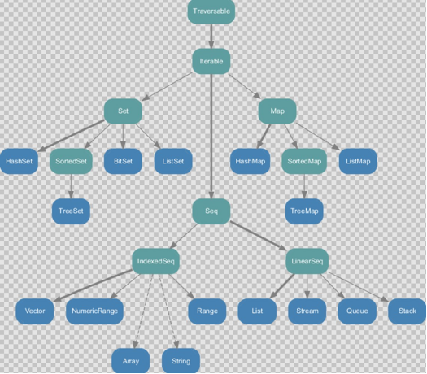
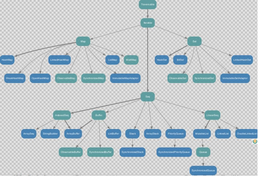
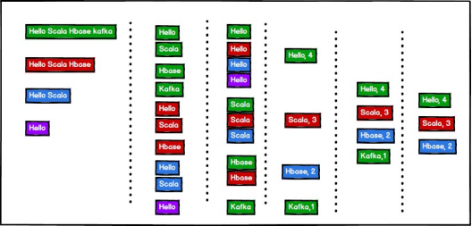

# 第 7 章 集 合

## 7.1 集合简介

1）Scala 的集合有三大类：序列 Seq、集Set、映射 Map，所有的集合都扩展自 Iterable特质。
2）对于几乎所有的集合类，Scala 都同时提供了可变和不可变的版本，分别位于以下两个包

**不可变集合**：scala.collection.immutable 

**可变集合**：	scala.collection.mutable
3）Scala 不可变集合，就是指该集合对象不可修改，每次修改就会返回一个新对象， 而不会对原对象进行修改。类似于 java 中的 String 对象
4）可变集合，就是这个集合可以直接对原对象进行修改，而不会返回新的对象。类似于 java 中 StringBuilder 对象

 建议：在操作集合的时候，不可变用符号，可变用方法

### 7.1.1 不可变集合继承图



1）Set、Map 是 Java 中也有的集合

2）Seq 是 Java 没有的，我们发现 List 归属到Seq 了，因此这里的 List 就和 Java 不是同一个概念了

3）我们前面的for 循环有一个 1 to 3，就是 IndexedSeq 下的 Range 

4）String 也是属于 IndexedSeq

5）我们发现经典的数据结构比如 Queue 和 Stack 被归属到 LinearSeq(线性序列)

6）大家注意Scala 中的 Map 体系有一个 SortedMap，说明 Scala 的 Map 可以支持排序

**7）IndexedSeq 和LinearSeq 的区别：**

（1）IndexedSeq 是通过索引来查找和定位，因此速度快，比如String 就是一个索引集合，通过索引即可定位 （数组）

（2）LinearSeq 是线型的，即有头尾的概念，这种数据结构一般是通过遍历来查找 **（链表）**

### 7.1.2 可变集合继承图



## 7.2数组

### 7.2.1不可变数组 Array

1）第一种方式定义数组

定义：`val arr1 = new Array[Int`](10)

（1）new 是关键字

（2）[Int]是指定可以存放的数据类型，如果希望存放任意数据类型，则指定Any

（3）(10)，表示数组的大小，确定后就不可以变化

2）案例实操

```scala
object TestArray{

    def main(args: Array[String]): Unit = {

        //（1）数组定义
        val arr01 = new Array[Int](4)
        println(arr01.length) // 4

        //（2）数组赋值
        //（2.1）修改某个元素的值
        arr01(3) = 10
        //（2.2）采用方法的形式给数组赋值
        arr01.update(0,1)

        //（3）遍历数组
        //（3.1）查看数组
         println(arr01.mkString(","))

        //（3.2） 普 通 遍 历
        for (i <- arr01) {
            println(i)
        }

        //（3.3）简化遍历
        def printx(elem:Int): Unit = { 
            println(elem)
        }
        arr01.foreach(printx)
        // arr01.foreach((x)=>{println(x)})
        // arr01.foreach(println(_)) arr01.foreach(println)

        //（4）增加元素（由于创建的是不可变数组，增加元素，其实是产生新的数组）
        println(arr01)
        val ints: Array[Int] = arr01 :+ 5 
        println(ints)
    }
}
```

3）第二种方式定义数组val arr1 = Array(1, 2)

（1）在定义数组时，直接赋初始值

（2）使用apply 方法创建数组对象

```
object TestArray{

	def main(args: Array[String]): Unit = {

        var arr02 = Array(1, 3, "bobo") 
        println(arr02.length)
        for (i <- arr02) {
        	println(i)
        }
    }
}
```

### 7.2.2 可变数组 ArrayBuffer

定义变长数组
`val arr01 = ArrayBuffer[Any](3, 2, 5)`


（1）[Any]存放任意数据类型

（2）(3, 2, 5)初始化好的三个元素

（3）ArrayBuffer 需要引入 scala.collection.mutable.ArrayBuffer 

2）案例实操

（1）ArrayBuffer 是有序的集合
增加元素使用的是 append 方法()，支持可变参数

```scala
import scala.collection.mutable.ArrayBuffer 
object TestArrayBuffer {
    def main(args: Array[String]): Unit = {

        //（1）创建并初始赋值可变数组
        val arr01 = ArrayBuffer[Any](1, 2, 3)

        //（2）遍历数组
        for (i <- arr01) { 
            println(i)
        }
        println(arr01.length) // 3 
        println("arr01.hash=" + arr01.hashCode())

        //（3）增加元素
        //（3.1）追加数据
        arr01.+=(4)
        //（3.2）向数组最后追加数据
        arr01.append(5,6)
        //（3.3）向指定的位置插入数据
        arr01.insert(0,7,8)  
        println("arr01.hash=" + arr01.hashCode())

        //（4）修改元素
        arr01(1) = 9 //修改第 2 个元素的值
        println("------")

        for (i <- arr01) { 
            println(i)
        }
        println(arr01.length) // 5
    }
}
```

### 7.2.3 不可变数组与可变数组的转换

1）说明
arr1.toBuffer		//不可变数组转可变数组

arr2.toArray	//可变数组转不可变数组

（1）arr2.toArray 返回结果才是一个不可变数组，arr2 本身没有变化

（2）arr1.toBuffer 返回结果才是一个可变数组，arr1 本身没有变化

### 7.2.4 多维数组

1）多维数组定义
`val arr = Array.ofDim[Double](3,4)`

说明：二维数组中有三个一维数组，每个一维数组中有四个元素

2） 案例实操

```
object DimArray {

    def main(args: Array[String]): Unit = {

        //（1）创建了一个二维数组, 有三个元素，每个元素是，含有 4 个元素一维数组()
        val arr = Array.ofDim[Int](3, 4) 
        arr(1)(2) = 88

        //（2）遍历二维数组
        for (i <- arr) { //i 就是一维数组
            for (j <- i) {
            print(j + " ")
        }

        println("-----------")
        }
    }
}
```

## 7.3 列表List

### 7.3.1 不可变 List

1）说明

（1）List 默认为不可变集合

（2）创建一个 List（数据有顺序，可重复）

（3）遍历 List

（4）List 增加数据

（5）集合间合并：将一个整体拆成一个一个的个体，称为扁平化

（6） 取指定数据

（7）空集合 Nil

2）案例实操

```
object TestList {

    def main(args: Array[String]): Unit = {

        //（1）List 默认为不可变集合
        //（2）创建一个 List（数据有顺序，可重复） 
        val list: List[Int] = List(1,2,3,4,3)

        //（7）空集合 Nil
        val list5 = 1::2::3::4::Nil

        //（4）List 增加数据
        //（4.1）::的运算规则从右向左
        //val list1 =  5::list 
        val list1 = 7::6::5::list
        //（4.2）添加到第一个元素位置
        val list2 = list.+:(5)

        //（5）集合间合并：将一个整体拆成一个一个的个体，称为扁平化
        val list3 = List(8,9)
        //val list4 = list3::list1 
        val list4 = list3:::list1

        //（6）取指定数据
        println(list(0))

        //（3）遍历 List
        //list.foreach(println)
        //list1.foreach(println)
        //list3.foreach(println)
        //list4.foreach(println) 
        list5.foreach(println)
    }
}
```

### 7.3.2 可变ListBuffer

1）说明
（1）创建一个可变集合 ListBuffer

（2）向集合中添加数据

（3）打印集合数据
2）案例实操

```
import scala.collection.mutable.ListBuffer object TestList {
    def main(args: Array[String]): Unit = {

        //（1）创建一个可变集合
        val buffer = ListBuffer(1,2,3,4)

        //（2）向集合中添加数据
        buffer.+=(5) 
        buffer.append(6) 
        buffer.insert(1,2)

        //（3）打印集合数据
        buffer.foreach(println)

        //（4）修改数据
        buffer(1) = 6 
        buffer.update(1,7)

        //（5）删除数据
        buffer.-(5)
        buffer.-=(5) 
        buffer.remove(5)
    }
}
```

## 7.4 Set 集合

默认情况下， Scala 使用的是不可变集合， 如果你想使用可变集合， 需要引用`scala.collection.mutable.Set` 包

1） 说明

（1） Set 默认是不可变集合，数据无序

（2） 数据不可重复

（3） 遍历集合

2） 案例实操

```
object TestSet {

    def main(args: Array[String]): Unit = {

        //（1）Set 默认是不可变集合，数据无序
        val set = Set(1,2,3,4,5,6)

        //（2）数据不可重复
        val set1 = Set(1,2,3,4,5,6,3)

        //（3）遍历集合
        for(x<-set1){ 
        	println(x)
        }
    }
}
```

## 7.4.2 可变mutable.Set

1）说明
（1）创建可变集合 mutable.Set
（2）打印集合
（3）集合添加元素
（4）向集合中添加元素，返回一个新的 Set
（5）删除数据

2）案例实操

```
object TestSet {

    def main(args: Array[String]): Unit = {

        //（1）创建可变集合
        val set = mutable.Set(1,2,3,4,5,6)

        //（3）集合添加元素set += 8

        //（4）向集合中添加元素，返回一个新的 
        Set val ints = set.+(9)
        println(ints) 
        println("set2=" + set)

        //（5）删除数据
        set-=(5)

        //（2）打印集合
        set.foreach(println) 
        println(set.mkString(","))
    }
}
```

### 7.5 Map 集合

Scala 中的 Map 和 Java 类似，也是一个散列表，它存储的内容也是键值对（key-value） 映射

### 7.5.1 不可变 Map

1）说明
（1）创建不可变集合 Map
（2）循环打印
（3）访问数据
（4）如果 key 不存在，返回 0

2）案例实操

```
object TestMap {

    def main(args: Array[String]): Unit = {
        // Map
        //（1）创建不可变集合 Map
        val map = Map( "a"->1, "b"->2, "c"->3 )

        //（3）访问数据
        for (elem <- map.keys) {
        // 使用 get 访问 map 集合的数据，会返回特殊类型 Option(选项):有值（Some），无值(None)
            println(elem + "=" + map.get(elem).get)
        }

        //（4） 如 果 key 不 存 在 ， 返 回 0 
        println(map.get("d").getOrElse(0)) 
        println(map.getOrElse("d", 0))

        //（2）循环打印
        map.foreach((kv)=>{println(kv)})
    }
}
```

### 7.5.2 可变Map

1）说明
（1）创建可变集合
（2）打印集合
（3）向集合增加数据
（4）删除数据
（5）修改数据

2）案例实操

```
object TestSet {

    def main(args: Array[String]): Unit = {

    //（1）创建可变集合
    val map = mutable.Map( "a"->1, "b"->2, "c"->3 )

    //（3）向集合增加数据map.+=("d"->4)

    // 将数值 4 添加到集合，并把集合中原值 1 返回
    val maybeInt: Option[Int] = map.put("a", 4) 
    println(maybeInt.getOrElse(0))

    //（4）删除数据
    map.-=("b", "c")

    //（5）修改数据
    map.update("d",5) map("d") = 5

    //（2）打印集合
    map.foreach((kv)=>{println(kv)})
    }
}
```

## 7.6 元组

1）说明

元组也是可以理解为一个容器，可以存放各种相同或不同类型的数据。说的简单点，就是将多个无关的数据封装为一个整体，称为元组。注意：元组中最大只能有 22 个元素。

2）案例实操
（1）声明元组的方式：(元素 1，元素 2，元素 3)
（2）访问元组
（3）Map 中的键值对其实就是元组,只不过元组的元素个数为 2，称之为对偶

```
object TestTuple {

    def main(args: Array[String]): Unit = {

        //（1）声明元组的方式：(元素 1，元素 2，元素 3)
        val tuple: (Int, String, Boolean) = (40,"bobo",true)

        //（2）访问元组
        //（2.1）通过元素的顺序进行访问，调用方式：_顺序号
        println(tuple._1)
        println(tuple._2) println(tuple._3)

        //（2.2）通过索引访问数据
        println(tuple.productElement(0))

        //（2.3）通过迭代器访问数据
        for (elem <- tuple.productIterator) { 
        	println(elem)
        }

        //（3）Map 中的键值对其实就是元组,只不过元组的元素个数为 2，称之为对偶
        val map = Map("a"->1, "b"->2, "c"->3)  
        val map1 = Map(("a",1), ("b",2), ("c",3))
        map.foreach(tuple=>{println(tuple._1 + "=" + tuple._2)})
    }
}
```

## 7.7 集合常用函数

### 7.7.1 基本属性和常用操作

1）说明

（1）获取集合长度
（2）获取集合大小
（3）循环遍历
（4）迭代器
（5）生成字符串
（6）是否包含

2）案例实操

```
object TestList {

    def main(args: Array[String]): Unit = {

        val list: List[Int] = List(1, 2, 3, 4, 5, 6, 7)

        //（1）获取集合长度
        println(list.length)

        //（2）获取集合大小,等同于 length 
        println(list.size)

        //（3）循环遍历
        list.foreach(println)

        //（4）迭代器
        for (elem <- list.itera tor) { 
        	println(elem)
        }

        //（5）生成字符串
        println(list.mkString(","))

        //（6）是否包含
        println(list.contains(3))
    }
}
```

## 7.7.2 衍生集合

1）说明

（1）获取集合的头

（2）获取集合的尾（不是头的就是尾）
（3）集合最后一个数据
（4）集合初始数据（不包含最后一个）
（5）反转
（6）取前（后）n 个元素
（7）去掉前（后）n 个元素
（8）并集
（9）交集
（10）差集
（11）拉链
（12）滑窗

2）案例实操

```scala
object TestList {

    def main(args: Array[String]): Unit = {

        val list1: List[Int] = List(1, 2, 3, 4, 5, 6, 7)
        val list2: List[Int] = List(4, 5, 6, 7, 8, 9, 10)

        //（1）获取集合的头
        println(list1.head)

        //（2）获取集合的尾（不是头的就是尾） 
        println(list1.tail)

        //（3）集合最后一个数据
        println(list1.last)

        //（4）集合初始数据（不包含最后一个） 
        println(list1.init)

        //（5）反转
        println(list1.reverse)

        //（6）取前（后）n 个元素
        println(list1.take(3)) 
        println(list1.takeRight(3))

        //（7）去掉前（后）n 个元素
        println(list1.drop(3)) 
        println(list1.dropRight(3))

        //（8）并集
        println(list1.union(list2))

        //（9）交集
        println(list1.intersect(list2))

        //（10）差集
        println(list1.diff(list2))

        //（11）拉链 注:如果两个集合的元素个数不相等，那么会将同等数量的数据进行拉链，多余的数据省略不用
        println(list1.zip(list2))

        //（12）滑窗
        list1.sliding(2, 5).foreach(println)
    }
}
```

### 7.7.3 集合计算简单函数

1）说明
（1）求和
（2）求乘积
（3）最大值
（4）最小值
（5）排序
2）实操

```scala
object TestList {

    def main(args: Array[String]): Unit = {

        val list: List[Int] = List(1, 5, -3, 4, 2, -7, 6)

        //（1）求和
        println(list.sum)

        //（2）求乘积
        println(list.product)

        //（3）最大值
        println(list.max)

        //（4）最小值
        println(list.min)

        //（5）排序
        // （5.1）按照元素大小排序
        println(list.sortBy(x => x))

        // （5.2）按照元素的绝对值大小排序
        println(list.sortBy(x => x.abs))

        // （5.3）按元素大小升序排序
        println(list.sortWith((x, y) => x < y))

        // （5.4）按元素大小降序排序
        println(list.sortWith((x, y) => x > y))
    }
}
```

（1）sorted
对一个集合进行自然排序，通过传递隐式的Ordering

（2）sortBy
对一个属性或多个属性进行排序，通过它的类型。
（3）sortWith
基于函数的排序，通过一个 comparator 函数，实现自定义排序的逻辑。

### 7.7.4 集合计算高级函数

1）说明
（1）过滤
遍历一个集合并从中获取满足指定条件的元素组成一个新的集合
（2）转化/映射（map）

将集合中的每一个元素映射到某一个函数
（3）扁平化
（4）扁平化+映射 注：flatMap 相当于先进行 map 操作，在进行 flatten 操作集合中的每个元素的子元素映射到某个函数并返回新集合
（5）分组(group)
按照指定的规则对集合的元素进行分组
（6）简化（归约）

（7）折叠

2）实操

```
object TestList {

    def main(args: Array[String]): Unit = {

        val list: List[Int] = List(1, 2, 3, 4, 5, 6, 7, 8, 9)
        val nestedList: List[List[Int]] = List(List(1, 2, 3), List(4, 5, 6), List(7, 8, 9))
        val	wordList:	List[String]	=	List("hello	world",	"hello atguigu", "hello scala")

        //（1）过滤
        println(list.filter(x => x % 2 == 0))

        //（2）转化/映射
        println(list.map(x => x + 1))

        //（3）扁平化
        println(nestedList.flatten)

        //（4）扁平化+映射 注：flatMap 相当于先进行 map 操作，在进行 flatten操作
        println(wordList.flatMap(x => x.split(" ")))

        //（5）分组
        println(list.groupBy(x => x % 2))
    }
}
```

3）Reduce 方法

Reduce 简化（归约） ：通过指定的逻辑将集合中的数据进行聚合，从而减少数据，最终获取结果。
案例实操

```
object TestReduce {

    def main(args: Array[String]): Unit = { 
        val list = List(1,2,3,4)
        // 将数据两两结合，实现运算规则
        val i: Int = list.reduce( (x,y) => x-y ) 
        println("i = " + i)

        // 从源码的角度，reduce 底层调用的其实就是 reduceLeft
        //val i1 = list.reduceLeft((x,y) => x-y)

        // ((4-3)-2-1) = -2
        val i2 = list.reduceRight((x,y) => x-y) println(i2)
    }
}
```

4）Fold 方法

Fold 折叠：化简的一种特殊情况。
（1）案例实操：fold 基本使用

```
object TestFold {

    def main(args: Array[String]): Unit = { 
    
    	val list = List(1,2,3,4)
        // fold 方法使用了函数柯里化，存在两个参数列表
        // 第一个参数列表为 ： 零值（初始值）
        // 第二个参数列表为： 简化规则
        // fold 底层其实为 foldLeft
        val i = list.foldLeft(1)((x,y)=>x-y) 
        val i1 = list.foldRight(10)((x,y)=>x-y)
        println(i) 
        println(i1)
    }
}
```

（2）案例实操：两个集合合并

```
object TestFold {

    def main(args: Array[String]): Unit = {

        // 两个 Map 的数据合并
        val map1 = mutable.Map("a"->1, "b"->2, "c"->3)
        val map2 = mutable.Map("a"->4, "b"->5, "d"->6)

        val map3: mutable.Map[String, Int] = map2.foldLeft(map1)
        {
            (map, kv) => { 
            	val k = kv._1 val v = kv._2
            	map(k) = map.getOrElse(k, 0) + v map
        	}
        }

        println(map3)
    }
}
```

### 7.7.5 普通WordCount 案例

1）需求
单词计数：将集合中出现的相同的单词，进行计数，取计数排名前三的结果
2）需求分析



3）案例实操

```
object TestWordCount {

    def main(args: Array[String]): Unit = {
        // 单词计数：将集合中出现的相同的单词，进行计数，取计数排名前三的结果
        val stringList = List("Hello Scala Hbase kafka", "Hello Scala Hbase", "Hello Scala", "Hello")

        // 1) 将每一个字符串转换成一个一个单词
        val	wordList:	List[String]	= stringList.flatMap(str=>str.split(" "))
        //println(wordList)

        // 2) 将相同的单词放置在一起
        val	wordToWordsMap:	Map[String,	List[String]]	= wordList.groupBy(word=>word)
        //println(wordToWordsMap)

        // 3) 对相同的单词进行计数
        // (word, list) => (word, count)
        val	wordToCountMap:	Map[String,	Int]	= wordToWordsMap.map(tuple=>(tuple._1, tuple._2.size))

        // 4) 对计数完成后的结果进行排序（降序）
        val	sortList:	List[(String,	Int)]	= wordToCountMap.toList.sortWith {
        	(left, right) => { 
        		left._2 > right._2
        	}
        }

        // 5) 对排序后的结果取前 3 名
        val resultList: List[(String, Int)] = sortList.take(3)

        println(resultList)
    }
}
```

### 7.7.6 复杂WordCount 案例

1）方式一

```
object Test_ComplexWordCount {
  def main(args: Array[String]): Unit = {
    val tupleList: List[(String, Int)] = List(
      ("hello", 1),
      ("hello world", 2),
      ("hello scala", 3),
      ("hello spark from scala", 1),
      ("hello flink from scala", 2)
    )

    // 思路一：直接展开为普通版本
    val newStringList: List[String] = tupleList.map(
      kv => {
        (kv._1.trim + " ") * kv._2
      }
    )
    println(newStringList)

    // 接下来操作与普通版本完全一致
    val wordCountList: List[(String, Int)] = newStringList
      .flatMap(_.split(" "))    // 空格分词
      .groupBy( word => word )     // 按照单词分组
      .map( kv => (kv._1, kv._2.size) )     // 统计出每个单词的个数
      .toList
      .sortBy(_._2)(Ordering[Int].reverse)
      .take(3)

    println(wordCountList)

    println("================================")

    // 思路二：直接基于预统计的结果进行转换
    // 1. 将字符串打散为单词，并结合对应的个数包装成二元组
    val preCountList: List[(String, Int)] = tupleList.flatMap(
      tuple => {
        val strings: Array[String] = tuple._1.split(" ")
        strings.map( word => (word, tuple._2) )
      }
    )
    println(preCountList)

    // 2. 对二元组按照单词进行分组
    val preCountMap: Map[String, List[(String, Int)]] = preCountList.groupBy( _._1 )
    println(preCountMap)

    // 3. 叠加每个单词预统计的个数值
    val countMap: Map[String, Int] = preCountMap.mapValues(
      tupleList => tupleList.map(_._2).sum
    )
    println(countMap)

    // 4. 转换成list，排序取前3
    val countList = countMap.toList
      .sortWith(_._2 > _._2)
      .take(3)
    println(countList)
  }
```

## 7.8 队列

1）说明
Scala 也提供了队列（Queue）的数据结构，队列的特点就是先进先出。进队和出队的方法分别为 enqueue 和dequeue。
2）案例实操

```
object TestQueue {

    def main(args: Array[String]): Unit = { 
    	val que = new mutable.Queue[String]() 
    	que.enqueue("a", "b", "c")
    	println(que.dequeue()) 
    	println(que.dequeue()) 
    	println(que.dequeue())
    }
}
```

## 7.9 并行集合

1）说明
Scala 为了充分使用**多核 CPU**，提供了并行集合（有别于前面的串行集合），用于多核环境的并行计算。
2）案例实操

```
object TestPar {

    def main(args: Array[String]): Unit = {
    
         val result1 = (0 to 100).map{case _ =>  Thread.currentThread.getName}

         val result2 = (0 to 100).par.map{case _ =>  Thread.currentThread.getName }
         println(result1)
         println(result2)
     }
}
```

