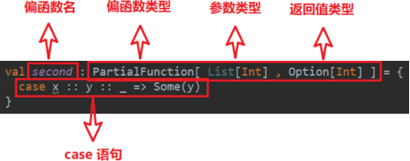

# 第 8 章 模式匹配

Scala 中的模式匹配**类似于Java 中的 switch 语法**。

Scala 支持模式匹配机制，可以代替 switch 语句、执行类型检查、以及支持析构表达式等。

```java
int i = 10 switch (i) {
    case 10 :
    	System.out.println("10"); 
    	break;
    case 20 :
    	System.out.println("20"); 
        break;
    default :
    	System.out.println("other number"); 
        break;
}
```

但是 scala 从语法中补充了更多的功能，所以更加强大。

## 8.1 基本语法

模式匹配语法中，采用 match 关键字声明，每个分支采用 case 关键字进行声明，当需要匹配时，会从第一个 case  分支开始，如果匹配成功，那么执行对应的逻辑代码，如果匹配不成功，继续执行下一个分支进行判断。如果所有 case 都不匹配，那么会执行 `case _` 分支， 类似于 Java 中 default 语句。

```
object TestMatchCase {
    def main(args: Array[String]): Unit = { 
        var a: Int = 10
        var b: Int = 20
        var operator: Char = 'd'

        var result = operator match { 
            case '+' => a + b
            case '-' => a - b 
            case '*' => a * b 
            case '/' => a / b 
            case _ => "illegal"
        }

        println(result)
    }
}
```

1） 说明

（1） 如果所有 case 都不匹配，那么会执行 `case _` 分支，类似于 Java 中default 语句， 若此时没有`case _` 分支，那么会抛出MatchError。

（2） 每个case 中，不需要使用break 语句，自动中断case。

（3） match case 语句可以匹配任何类型，而不只是字面量。

（4） => 后面的代码块，直到下一个 case 语句之前的代码是**作为一个整体执行**，可以使用{}括起来，也可以不括。

## 8.2 模式守卫

1）说明
如果想要表达匹配某个范围的数据，就需要在模式匹配中增加条件守卫。
2）案例实操

```
object TestMatchGuard {
    def main(args: Array[String]): Unit = { 
    
        def abs(x: Int) = x match {
        	case i: Int if i >= 0 => i 
        	case j: Int if j < 0 => -j 
        	case _ => "type illegal"
        }

        println(abs(-5))
    }
}
```

## 8.3 模式匹配类型

### 8.3.1 匹配常量

1）说明
Scala 中，模式匹配可以匹配所有的字面量，包括字符串，字符，数字，布尔值等等。

2）实操

```scala
object TestMatchVal {

    def main(args: Array[String]): Unit = { 
        println(describe(6))
    }

    def describe(x: Any) = x match { 
        case 5 => "Int five"
    	case "hello" => "String hello" 
        case true => "Boolean true" 
        case '+' => "Char +"
    }
}
```

### 8.3.2 匹配类型

1）说明
需要进行类型判断时，可以使用前文所学的 isInstanceOf[T]和 asInstanceOf[T]，也可使用模式匹配实现同样的功能。

2）案例实操

```
object TestMatchClass {
    def describe(x: Any) = x match { 
        case i: Int => "Int"
        case s: String => "String hello"
        case m: List[_] => "List"
        case c: Array[Int] => "Array[Int]"
        case someThing => "something else " + someThing
    }

    def main(args: Array[String]): Unit = {

        //泛型擦除
        println(describe(List(1, 2, 3, 4, 5)))

        //数组例外，可保留泛型
        println(describe(Array(1, 2, 3, 4, 5, 6))) 
        println(describe(Array("abc")))
    }
}
```

### 8.3.3 匹配数组

1）说明
scala 模式匹配可以对集合进行精确的匹配，例如匹配只有两个元素的、且第一个元素为 0 的数组。
2）案例实操

```scala
object TestMatchArray {

    def main(args: Array[String]): Unit = {

        for (arr <- Array(Array(0), Array(1, 0), Array(0, 1, 0), Array(1, 1, 0), Array(1, 1, 0, 1), Array("hello", 90))) { 
            // 对一个数组集合进行遍历
            val result = arr match {
                case Array(0) => "0" //匹配 Array(0) 这个数组
                case Array(x, y) => x + "," + y //匹配有两个元素的数组，然后将将元素值赋给对应的 x,y
                case Array(0, _*) => "以 0 开头的数组" //匹配以 0 开头和数组
                case _ => "something else"
            }

        	println("result = " + result)
        }
    }
}
```

### 8.3.4 匹配列表

1）方式一

```
object TestMatchList {
    def main(args: Array[String]): Unit = {

        //list 是一个存放 List 集合的数组
        //请思考，如果要匹配 List(88) 这样的只含有一个元素的列表,并原值返回.应该怎么写
        for (list <- Array(List(0), List(1, 0), List(0, 0, 0), List(1, 0, 0), List(88))) {

            val result = list match {
                case List(0) => "0" //匹配 List(0)
                case List(x, y) => x + "," + y //匹配有两个元素的List case List(0, _*) => "0 ..."
                case _ => "something else"
            }

            println(result)
        }
    }
}
```

2）方式二

```scala
object TestMatchList {

    def main(args: Array[String]): Unit = {
        val list: List[Int] = List(1, 2, 5, 6, 7) 
        list match {
        case first :: second :: rest => println(first + "-" + second + "-" + rest)
        case _ => println("something else")
        }
    }
}
```

### 8.3.5 匹配元组

```
object TestMatchTuple {

    def main(args: Array[String]): Unit = {

        //对一个元组集合进行遍历
        for (tuple <- Array((0, 1), (1, 0), (1, 1), (1, 0, 2))) {

            val result = tuple match {
                case (0, _) => "0 ..." //是第一个元素是 0 的元组
                case (y, 0) => "" + y + "0" // 匹配后一个元素是 0 的对偶元组
                case (a, b) => "" + a + " " + b case _ => "something else" //默认
            }
            println(result)
        }
    }
}
```

### 8.3.6 匹配对象及样例类

**1）提取器 基本语法**

```scala
class User(val name: String, val age: Int)

object User{

    def apply(name: String, age: Int): User = new User(name, age) 
    
    def unapply(user: User): Option[(String, Int)] = {
    
        if (user == null)
        	None 
        else
        	Some(user.name, user.age)
        }
    }

    object TestMatchUnapply {
        def main(args: Array[String]): Unit = { 
            val user: User = User("zhangsan", 11) 
            val result = user match {
        		case User("zhangsan", 11) => "yes" 
                case _ => "no"
    }

    println(result)
    }
}
```

小结

- val user = User("zhangsan",11)，该语句在执行时，实际调用的是 User 伴生对象中的 **apply** 方法，因此不用 **new** **关键字**就能构造出相应的对象。

- 当将 **User("zhangsan",** **11)** 写在 case 后时[case User("zhangsan", 11) => "yes"]，会默认调用 **unapply** 方法(对象提取器)，**user** **作为** **unapply** **方法的参数**，unapply 方法将 user 对象的 name 和 age 属性提取出来，与User("zhangsan", 11)中的属性值进行匹配

- case 中对象的 **unapply** 方法(提取器)返回 Some，且所有属性均一致，才算匹配成功,属性不一致，或返回 None，则匹配失败。

- 若只提取对象的一个属性，则提取器为 `unapply(obj:Obj):Option[T]`
  若提取对象的多个属性，则提取器为 `unapply(obj:Obj):Option[(T1,T2,T3…)]`
  若提取对象的可变个属性，则提取器为 `unapplySeq(obj:Obj):Option[Seq[T]] `

**2）样例类**

（1）语法：
`case class Person (name: String, age: Int)`

（2）说明

- 1 样例类仍然是类，和普通类相比，只是其自动生成了伴生对象，并且伴生对象中自动提供了一些常用的方法，如 apply、unapply、toString、equals、hashCode 和 copy。

- 2 样例类是为**模式匹配而优化的类**，因为其默认提供了 unapply 方法，因此，样例类可以直接使用模式匹配，而无需自己实现 unapply 方法。

- 3 构造器中的每一个参数都成为 val，除非它被显式地声明为 var（不建议这样做）

  

（3）实操
  上述匹配对象的案例使用样例类会节省大量代码

```scala
case class User(name: String, age: Int)

object TestMatchUnapply {
    def main(args: Array[String]): Unit = { 
        
        val user: User = User("zhangsan", 11) 
        val result = user match {
    		case User("zhangsan", 11) => "yes" 
            case _ => "no"
    	}

    	println(result)
    }
}
```

## 8.4 变量声明中的模式匹配

```
case class Person(name: String, age: Int)

object TestMatchVariable {
    def main(args: Array[String]): Unit = {

        val (x, y) = (1, 2) 
        println(s"x=$x,y=$y")

        val Array(first, second, _*) = Array(1, 7, 2, 9) 
        println(s"first=$first,second=$second")

        val Person(name, age) = Person1("zhangsan", 16) 
        println(s"name=$name,age=$age")
    }
}
```

## 8.5 for 表达式中的模式匹配

```
object TestMatchFor {

    def main(args: Array[String]): Unit = {

        val map = Map("A" -> 1, "B" -> 0, "C" -> 3)
        for ((k, v) <- map) { //直接将 map 中的 k-v 遍历出来
        	println(k + " -> " + v) //3 个
        }
        println("-----------------------------------")

        //遍历 value=0 的 k-v ,如果 v 不是 0,过滤
        for ((k, 0) <- map) {
        	println(k + " --> " + 0) // B->0
        }

        println("-----------------------------------")
        
        //if v == 0 是一个过滤的条件
        for ((k, v) <- map if v >= 1) {
        	println(k + " ---> " + v) // A->1 和 c->33
        }
    }
}
```

## 8.6 偏函数中的模式匹配(了解)

偏函数也是函数的一种，通过偏函数我们可以方便的对输入参数做更精确的检查。例如该偏函数的输入类型为List[Int]，而我们需要的是第一个元素是 0 的集合，这就是通过模式匹配实现的。

**1）偏函数定义**

```
val second: PartialFunction[List[Int], Option[Int]] = { 
	case x :: y :: _ => Some(y)
}
```



**注**：该偏函数的功能是返回输入的List 集合的第二个元素

**2）偏函数原理**

上述代码会被 scala 编译器翻译成以下代码，与普通函数相比，只是多了一个用于参数检查的函数——isDefinedAt，其返回值类型为 Boolean。

```
val second = new PartialFunction[List[Int], Option[Int]] {

    //检查输入参数是否合格
    override def isDefinedAt(list: List[Int]): Boolean = list match
    {
        case x :: y :: _ => true 
        case _ => false
    }

    //执行函数逻辑
    override def apply(list: List[Int]): Option[Int] = list match
    {
        case x :: y :: _ => Some(y)
    }
}
```

**3）偏函数使用**

偏函数不能像 second(List(1,2,3))这样直接使用，因为这样会直接调用 apply 方法，而应该调用 applyOrElse 方法，如下

```
second.applyOrElse(List(1,2,3), (_: List[Int]) => None)
```

applyOrElse 方法的逻辑为 `if (ifDefinedAt(list)) apply(list) else default`。如果输入参数满足条件，即 isDefinedAt 返回 true，则执行 apply 方法，否则执行 defalut 方法，default 方法为参数不满足要求的处理逻辑。

（1）需求
将该List(1,2,3,4,5,6,"test")中的 Int 类型的元素加一，并去掉字符串。

（2）实操
方法一：
```List(1,2,3,4,5,6,"test").filter(_.isInstanceOf[Int]).map(_.asInstanceOf[Int] + 1).foreach(println)```

方法二：
```List(1, 2, 3, 4, 5, 6, "test").collect { case x: Int => x + 1 }.foreach(println)```
