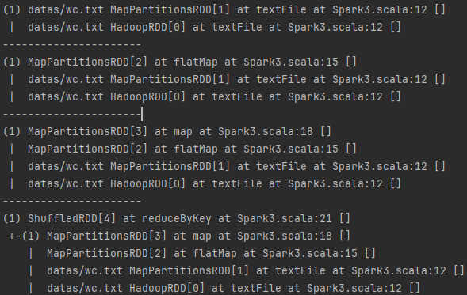
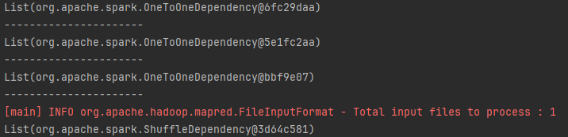
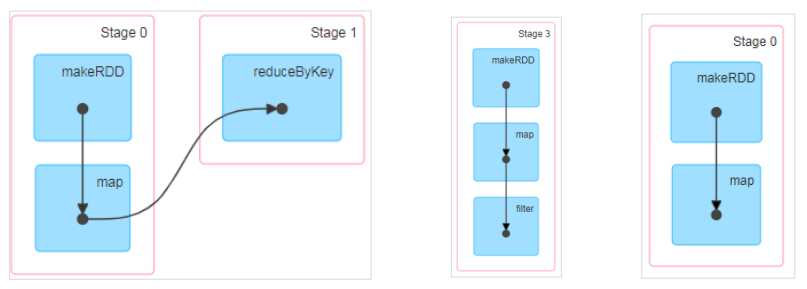
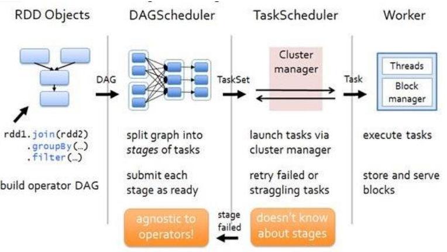
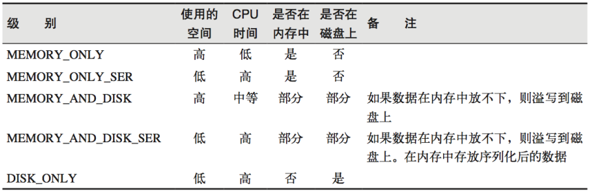

# 6. RDD 序列化

## 6.1 闭包检查

从计算的角度,<mark> **算子以外的代码都是在 Driver 端执行**, **算子里面的代码都是在 Executor 端执行**</mark>。那么在 scala 的函数式编程中，就会导致算子内经常会用到算子外的数据，这样就形成了闭包的效果，如果使用的算子外的数据无法序列化，就意味着无法传值给 Executor 端执行，就会发生错误，所以需要在执行任务计算前，检测闭包内的对象是否可以进行序列化，这个操作我们称之为**闭包检测**。Scala2.12 版本后闭包编译方式发生了改

## 6.2 序列化方法和属性

<mark>从计算的角度, 算子以外的代码都是在 Driver 端执行, 算子里面的代码都是在 Executor 端执行</mark>，看如下代码：

```
    object Spark01_RDD_Serial {

        def main(args: Array[String]): Unit = {
            val sparConf = new SparkConf().setMaster("local").setAppName("WordCount")
            val sc = new SparkContext(sparConf)

            val rdd: RDD[String] = sc.makeRDD(Array("hello world", "hello spark", "hive", "haddoop"))

            val search = new Search("h")

            //search.getMatch1(rdd).collect().foreach(println)
            search.getMatch2(rdd).collect().foreach(println)

            sc.stop()
        }
        // 查询对象
        // 类的构造参数其实是类的属性, 构造参数需要进行闭包检测，其实就等同于类进行闭包检测
        class Search(query:String){

            def isMatch(s: String): Boolean = {
                s.contains(this.query)
            }

            // 函数序列化案例
            def getMatch1 (rdd: RDD[String]): RDD[String] = {
                rdd.filter(isMatch)
            }

            // 属性序列化案例
            def getMatch2(rdd: RDD[String]): RDD[String] = {
                val s = query
                rdd.filter(x => x.contains(s))
            }
        }
    }
```

## 6.3 Kryo 序列化框架

参考地址: https://github.com/EsotericSoftware/kryo

Java 的序列化能够序列化任何的类。但是比较重（字节多），序列化后，对象的提交也比较大。Spark 出于性能的考虑，Spark2.0 开始支持另外一种 Kryo 序列化机制。Kryo 速度 是 Serializable 的 10 倍。当 RDD 在 Shuffle 数据的时候，简单数据类型、数组和字符串类型已经在 Spark 内部使用 Kryo 来序列化。 注意：即使使用 Kryo 序列化，也要继承 Serializable 接口。

```
    object serializable_Kryo {
      def main(args: Array[String]): Unit = {
        val conf: SparkConf = new SparkConf()
          .setAppName("SerDemo")
          .setMaster("local[*]")
          // 替换默认的序列化机制
          .set("spark.serializer",
            "org.apache.spark.serializer.KryoSerializer")
          // 注册需要使用 kryo 序列化的自定义类
          .registerKryoClasses(Array(classOf[Searcher]))

        val sc = new SparkContext(conf)
        val rdd: RDD[String] = sc.makeRDD(Array("hello world", "hello spark",
          "spark", "hahah"), 2)
        val searcher = new Searcher("hello")
        val result: RDD[String] = searcher.getMatchedRDD1(rdd)
        result.collect.foreach(println)
      }
    }

    case class Searcher(val query: String) {
      def getMatchedRDD1(rdd: RDD[String]) = {
        rdd.filter(isMatch)
      }

      def isMatch(s: String) = {
        s.contains(query)
      }

      def getMatchedRDD2(rdd: RDD[String]) = {
        val q = query
        rdd.filter(_.contains(q))
      }
    }
```

# 7 RDD 依赖关系

## 7.1 RDD 血缘关系

RDD 只支持粗粒度转换，即在大量记录上执行的单个操作。将创建 RDD 的一系列 Lineage （血统）记录下来，以便恢复丢失的分区。RDD 的 Lineage 会记录 RDD 的元数据信息和转换行为，当该 RDD 的部分分区数据丢失时，它可以根据这些信息来重新运算和恢复丢失的数据分区。

```
val fileRDD: RDD[String] = sc.textFile("input/1.txt")
println(fileRDD.toDebugString)
println("----------------------")
val wordRDD: RDD[String] = fileRDD.flatMap(_.split(" "))
println(wordRDD.toDebugString)
println("----------------------")
val mapRDD: RDD[(String, Int)] = wordRDD.map((_,1))
println(mapRDD.toDebugString)
println("----------------------")
val resultRDD: RDD[(String, Int)] = mapRDD.reduceByKey(_+_)
println(resultRDD.toDebugString)
resultRDD.collect()
```



## 7.2 RDD 依赖关系

这里所谓的依赖关系，其实就是两个相邻 RDD 之间的关系

```
val sc: SparkContext = new SparkContext(conf)
val fileRDD: RDD[String] = sc.textFile("input/1.txt")
println(fileRDD.dependencies)
println("----------------------")
val wordRDD: RDD[String] = fileRDD.flatMap(_.split(" "))
println(wordRDD.dependencies)
println("----------------------")
val mapRDD: RDD[(String, Int)] = wordRDD.map((_,1))
println(mapRDD.dependencies)
println("----------------------")
val resultRDD: RDD[(String, Int)] = mapRDD.reduceByKey(_+_)
println(resultRDD.dependencies)
resultRDD.collect()
```



## 7.3 RDD 窄依赖

窄依赖表示每一个父(上游)RDD 的 Partition 最多被子（下游）RDD 的一个 Partition 使用， 窄依赖我们形象的比喻为独生子女。

```
class OneToOneDependency[T](rdd: RDD[T]) extends NarrowDependency[T](rdd)
```

## 7.4 RDD 宽依赖

宽依赖表示同一个父（上游）RDD 的 Partition 被多个子（下游）RDD 的 Partition 依赖，会引起 Shuffle，总结：宽依赖我们形象的比喻为多生。

```
class ShuffleDependency[K: ClassTag, V: ClassTag, C: ClassTag](
 @transient private val _rdd: RDD[_ <: Product2[K, V]],
 val partitioner: Partitioner,
 val serializer: Serializer = SparkEnv.get.serializer,
 val keyOrdering: Option[Ordering[K]] = None,
 val aggregator: Option[Aggregator[K, V, C]] = None,
 val mapSideCombine: Boolean = false)
 extends Dependency[Product2[K, V]]
```

## 7.5 RDD 阶段划分

DAG（Directed Acyclic Graph）有向无环图是由点和线组成的拓扑图形，该图形具有方向， 不会闭环。例如，DAG 记录了 RDD 的转换过程和任务的阶段。



## 7.6 RDD 阶段划分源码

```
try {
 // New stage creation may throw an exception if, for example, jobs are run on
a
 // HadoopRDD whose underlying HDFS files have been deleted.
 finalStage = createResultStage(finalRDD, func, partitions, jobId, callSite)
} catch {
 case e: Exception =>
 logWarning("Creating new stage failed due to exception - job: " + jobId, e)
 listener.jobFailed(e)
 return
}
……
private def createResultStage(
 rdd: RDD[_],
 func: (TaskContext, Iterator[_]) => _,
 partitions: Array[Int],
 jobId: Int,
 callSite: CallSite): ResultStage = {
val parents = getOrCreateParentStages(rdd, jobId)
val id = nextStageId.getAndIncrement()
val stage = new ResultStage(id, rdd, func, partitions, parents, jobId, callSite)
stageIdToStage(id) = stage
updateJobIdStageIdMaps(jobId, stage)
stage
}
……
private def getOrCreateParentStages(rdd: RDD[_], firstJobId: Int): List[Stage]
= {
getShuffleDependencies(rdd).map { shuffleDep =>
 getOrCreateShuffleMapStage(shuffleDep, firstJobId)
}.toList
}
……
private[scheduler] def getShuffleDependencies(
 rdd: RDD[_]): HashSet[ShuffleDependency[_, _, _]] = {
val parents = new HashSet[ShuffleDependency[_, _, _]]
val visited = new HashSet[RDD[_]]
val waitingForVisit = new Stack[RDD[_]]
waitingForVisit.push(rdd)
while (waitingForVisit.nonEmpty) {
 val toVisit = waitingForVisit.pop()
 if (!visited(toVisit)) {
 visited += toVisit
 toVisit.dependencies.foreach {
 case shuffleDep: ShuffleDependency[_, _, _] =>
 parents += shuffleDep
 case dependency =>
 waitingForVisit.push(dependency.rdd)
 }
 }
}
parents
}
```

## 7.7 RDD 任务划分

RDD 任务切分中间分为：Application、Job、Stage 和 Task

- Application：初始化一个 SparkContext 即生成一个 Application；
- Job：一个 Action 算子就会生成一个 Job；
- Stage：Stage 等于宽依赖(ShuffleDependency)的个数加 1；
- Task：一个 Stage 阶段中，最后一个 RDD 的分区个数就是 Task 的个数。

> 注意：Application->Job->Stage->Task 每一层都是 1 对 n 的关系



# 8. RDD 持久化

## 8.1 RDD Cache 缓存

RDD 通过 Cache 或者 Persist 方法将前面的计算结果缓存，默认情况下会把数据以缓存在 JVM 的堆内存中。但是并不是这两个方法被调用时立即缓存，而是触发后面的 action 算子时，该 RDD 将会被缓存在计算节点的内存中，并供后面重用。

```
// cache 操作会增加血缘关系，不改变原有的血缘关系
println(wordToOneRdd.toDebugString)
// 数据缓存。
wordToOneRdd.cache()
// 可以更改存储级别
//mapRdd.persist(StorageLevel.MEMORY_AND_DISK_2)
```

存储级别

```
object StorageLevel {
 val NONE = new StorageLevel(false, false, false, false)
 val DISK_ONLY = new StorageLevel(true, false, false, false)
 val DISK_ONLY_2 = new StorageLevel(true, false, false, false, 2)
 val MEMORY_ONLY = new StorageLevel(false, true, false, true)
 val MEMORY_ONLY_2 = new StorageLevel(false, true, false, true, 2)
 val MEMORY_ONLY_SER = new StorageLevel(false, true, false, false)
 val MEMORY_ONLY_SER_2 = new StorageLevel(false, true, false, false, 2)
 val MEMORY_AND_DISK = new StorageLevel(true, true, false, true)
 val MEMORY_AND_DISK_2 = new StorageLevel(true, true, false, true, 2)
 val MEMORY_AND_DISK_SER = new StorageLevel(true, true, false, false)
 val MEMORY_AND_DISK_SER_2 = new StorageLevel(true, true, false, false, 2)
 val OFF_HEAP = new StorageLevel(true, true, true, false, 1)
```



缓存有可能丢失，或者存储于内存的数据由于内存不足而被删除，RDD 的缓存容错机 制保证了即使缓存丢失也能保证计算的正确执行。通过基于 RDD 的一系列转换，丢失的数据会被重算，由于 RDD 的各个 Partition 是相对独立的，因此只需要计算丢失的部分即可， 并不需要重算全部 Partition。

Spark 会自动对一些 Shuffle 操作的中间数据做持久化操作(比如：reduceByKey)。这样 做的目的是为了当一个节点 Shuffle 失败了避免重新计算整个输入。但是，在实际使用的时 候，如果想重用数据，仍然建议调用 persist 或 cache。

## 8.2 RDD CheckPoint 检查点

所谓的检查点其实就是通过**将 RDD 中间结果写入磁盘**

由于血缘依赖过长会造成容错成本过高，这样就不如在中间阶段做检查点容错，如果检查点之后有节点出现问题，可以从检查点开始重做血缘，减少了开销。 对 RDD 进行 checkpoint 操作并不会马上被执行，必须执行 Action 操作才能触发。

```
// 设置检查点路径
sc.setCheckpointDir("./checkpoint1")
// 创建一个 RDD，读取指定位置文件:hello atguigu atguigu
val lineRdd: RDD[String] = sc.textFile("input/1.txt")
// 业务逻辑
val wordRdd: RDD[String] = lineRdd.flatMap(line => line.split(" "))
val wordToOneRdd: RDD[(String, Long)] = wordRdd.map {
 word => {
 (word, System.currentTimeMillis())
 }
}
// 增加缓存,避免再重新跑一个 job 做 checkpoint
wordToOneRdd.cache()
// 数据检查点：针对 wordToOneRdd 做检查点计算
wordToOneRdd.checkpoint()
// 触发执行逻辑
wordToOneRdd.collect().foreach(println
```

## 8.3 缓存和检查点区别

1）Cache 缓存只是将数据保存起来，不切断血缘依赖。Checkpoint 检查点切断血缘依赖。

2）Cache 缓存的数据通常存储在磁盘、内存等地方，可靠性低。Checkpoint 的数据通常存储在 HDFS 等容错、高可用的文件系统，可靠性高。

3）建议对 checkpoint()的 RDD 使用 Cache 缓存，这样 checkpoint 的 job 只需从 Cache 缓存中读取数据即可，否则需要再从头计算一次 RDD。

# 9 RDD 分区器

Spark 目前支持 Hash 分区和 Range 分区，和用户自定义分区。Hash 分区为当前的默认分区。分区器直接决定了 RDD 中分区的个数、RDD 中每条数据经过 Shuffle 后进入哪个分区，进而决定了 Reduce 的个数。

➢ 只有 Key-Value 类型的 RDD 才有分区器，非 Key-Value 类型的 RDD 分区的值是 None

➢ 每个 RDD 的分区 ID 范围：0 ~ (numPartitions - 1)，决定这个值是属于那个分区的。

## 9.1 Hash 分区：

对于给定的 key，计算其 hashCode,并除以分区个数取余

```
class HashPartitioner(partitions: Int) extends Partitioner {
 require(partitions >= 0, s"Number of partitions ($partitions) cannot be
negative.")
 def numPartitions: Int = partitions
 def getPartition(key: Any): Int = key match {
 case null => 0
 case _ => Utils.nonNegativeMod(key.hashCode, numPartitions)
 }
 override def equals(other: Any): Boolean = other match {
 case h: HashPartitioner =>
 h.numPartitions == numPartitions
 case _ =>
 false
 }
 override def hashCode: Int = numPartitions
}
```

## 9.2 Range 分区

将一定范围内的数据映射到一个分区中，尽量保证每个分区数据均匀，而 且分区间有序

# 10 RDD 文件读取与保存

Spark 的数据读取及数据保存可以从两个维度来作区分：文件格式以及文件系统。 文件格式分为：text 文件、csv 文件、sequence 文件以及 Object 文件； 文件系统分为：本地文件系统、HDFS、HBASE 以及数据库。

## 10.1 text 文件

```
// 读取输入文件
val inputRDD: RDD[String] = sc.textFile("input/1.txt")
// 保存数据
inputRDD.saveAsTextFile("output")
```

## 10.2 sequence 文件

SequenceFile 文件是 Hadoop 用来存储二进制形式的 key-value 对而设计的一种平面文件(Flat File)。在 SparkContext 中，可以调用 `sequenceFile[keyClass, valueClass](path)`。

```
// 保存数据为 SequenceFile
dataRDD.saveAsSequenceFile("output")
// 读取 SequenceFile 文件
sc.sequenceFile[Int,Int]("output").collect().foreach(println)
```

## 10.3 object 对象文件

对象文件是将对象序列化后保存的文件，采用 Java 的序列化机制。可以通过 `objectFile[T:  ClassTag](path)`函数接收一个路径，读取对象文件，返回对应的 RDD，也可以通过调用 saveAsObjectFile()实现对对象文件的输出。因为是序列化所以要指定类型。

```
// 保存数据
dataRDD.saveAsObjectFile("output")
// 读取数据
sc.objectFile[Int]("output").collect().foreach(println
```
