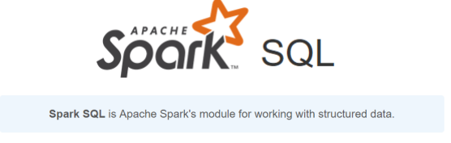
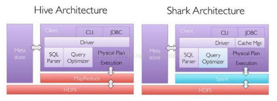
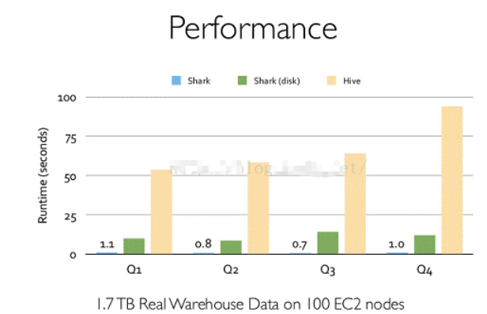
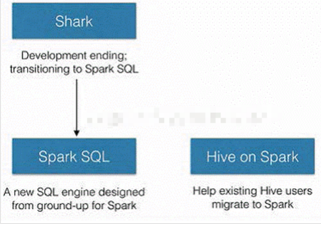
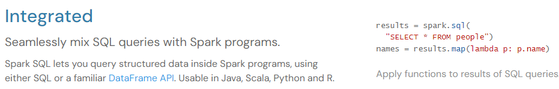
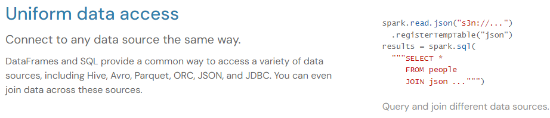
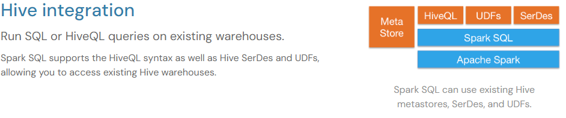
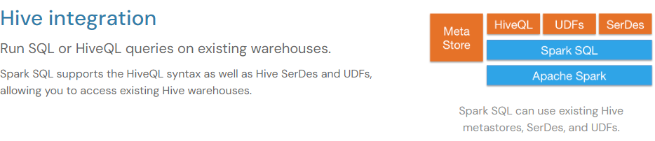
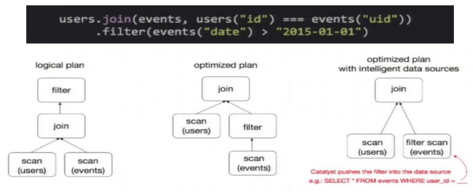
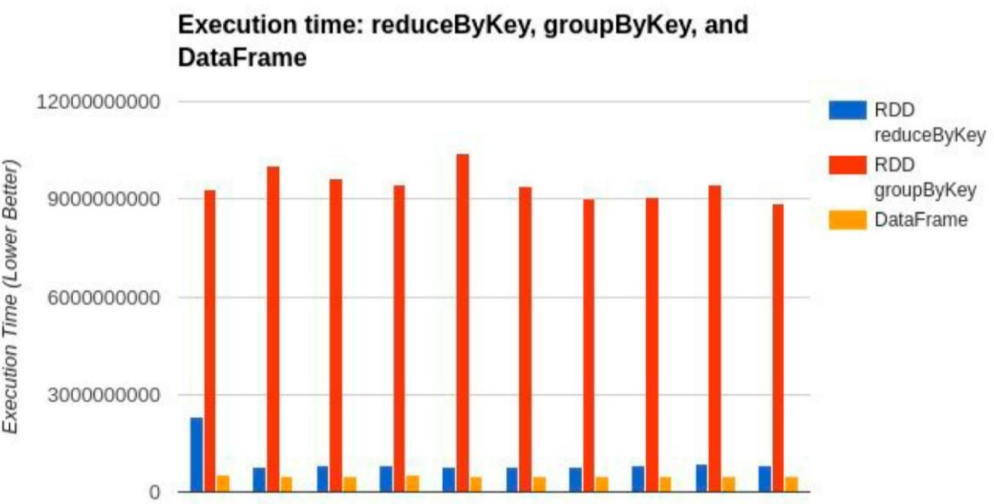

# 第1章 SparkSQL 概述

## 1.1 SparkSQL 是什么

Spark SQL 是 Spark 用于结构化数据(structured data)处理的 Spark 模块。

## 1.2 Hive and SparkSQL

SparkSQL 的前身是 Shark，给熟悉 RDBMS 但又不理解 MapReduce 的技术人员提供快速上手的工具。

Hive 是早期唯一运行在 Hadoop 上的 SQL-on-Hadoop 工具。但是 MapReduce 计算过程 中大量的中间磁盘落地过程消耗了大量的 I/O，降低的运行效率，为了提高 SQL-on-Hadoop 的效率，大量的 SQL-on-Hadoop 工具开始产生，其中表现较为突出的是：

- Drill 
-  Impala 
-  Shark

其中 Shark 是伯克利实验室 Spark 生态环境的组件之一，是基于 Hive 所开发的工具，它修改了下图所示的右下角的内存管理、物理计划、执行三个模块，并使之能运行在 Spark 引擎 上。

Shark 的出现，使得 SQL-on-Hadoop 的性能比 Hive 有了 10-100 倍的提高。

但是，随着 Spark 的发展，对于野心勃勃的 Spark 团队来说，Shark 对于 Hive 的太多依赖（如采用 Hive 的语法解析器、查询优化器等等），制约了 Spark 的 One Stack Rule Them All 的既定方针，制约了 Spark 各个组件的相互集成，所以提出了 SparkSQL 项目。SparkSQL 抛弃原有 Shark 的代码，汲取了 Shark 的一些优点，如内存列存储（In-Memory Columnar  Storage）、Hive兼容性等，重新开发了SparkSQL代码；由于摆脱了对Hive的依赖性，SparkSQL 无论在数据兼容、性能优化、组件扩展方面都得到了极大的方便，真可谓“退一步，海阔天空”。

➢ 数据兼容方面 SparkSQL 不但兼容 Hive，还可以从 RDD、parquet 文件、JSON 文件中获取数据，未来版本甚至支持获取 RDBMS 数据以及 cassandra 等 NOSQL 数据； 

➢ 性能优化方面 除了采取 In-Memory Columnar Storage、byte-code generation 等优化技术外、将会引进 Cost Model 对查询进行动态评估、获取最佳物理计划等等； 

➢ 组件扩展方面 无论是 SQL 的语法解析器、分析器还是优化器都可以重新定义，进行扩展。

2014 年 6 月 1 日 Shark 项目和 SparkSQL 项目的主持人 Reynold Xin 宣布：停止对 Shark 的 开发，团队将所有资源放 SparkSQL 项目上，至此，Shark 的发展画上了句话，但也因此发 展出两个支线：SparkSQL 和 Hive on Spark。

其中 SparkSQL 作为 Spark 生态的一员继续发展，而不再受限于 Hive，只是兼容 Hive；而 Hive on Spark 是一个 Hive 的发展计划，该计划将 Spark 作为 Hive 的底层引擎之一，也就是 说，Hive 将不再受限于一个引擎，可以采用 Map-Reduce、Tez、Spark 等引擎。

对于开发人员来讲，SparkSQL 可以简化 RDD 的开发，提高开发效率，且执行效率非 常快，所以实际工作中，基本上采用的就是 SparkSQL。Spark SQL 为了简化 RDD 的开发， 提高开发效率，提供了 2 个编程抽象，类似 Spark Core 中的 RDD

- DataFrame
- DataSet

## 1.3 SparkSQL 特点

### 1.3.1 易整合

无缝的整合了 SQL 查询和 Spark 编程

## 1.3.2 统一的数据访问

使用相同的方式连接不同的数据源

### 1.3.3 兼容 Hive 

在已有的仓库上直接运行 SQL 或者 HiveQL

### 1.3.4 标准数据连接

## 1.4 DataFrame 是什么

在 Spark 中，DataFrame 是一种以 RDD 为基础的分布式数据集，**类似于传统数据库中的二维表格**。DataFrame 与 RDD 的主要区别在于，前者带有 schema 元信息，即 DataFrame 所表示的二维表数据集的**每一列都带有名称和类型**。这使得 Spark SQL 得以洞察更多的结构信息，从而对藏于 DataFrame 背后的数据源以及作用于 DataFrame 之上的变换进行了针对性的优化，最终达到大幅提升运行时效率的目标。反观 RDD，由于无从得知所存数据元素的具体内部结构，Spark Core 只能在 stage 层面进行简单、通用的流水线优化。

同时，与 Hive 类似，DataFrame 也支持嵌套数据类型（struct、array 和 map）。从 API  易用性的角度上看，DataFrame API 提供的是一套高层的关系操作，比函数式的 RDD API 要 更加友好，门槛更低。

上图直观地体现了 DataFrame 和 RDD 的区别。

左侧的 RDD[Person]虽然以 Person 为类型参数，但 Spark 框架本身不了解 Person 类的内部结构。而右侧的 DataFrame 却提供了详细的结构信息，使得 Spark SQL 可以清楚地知道该数据集中包含哪些列，每列的名称和类型各是什么。

DataFrame 是为数据提供了 Schema 的视图。可以把它当做数据库中的一张表来对待 DataFrame 也是懒执行的，但性能上比 RDD 要高，主要原因：**优化的执行计划**，即查询计划通过 Spark catalyst optimiser 进行优化。比如下面一个例子:

为了说明查询优化，我们来看上图展示的人口数据分析的示例。图中构造了两个 DataFrame，将它们 join 之后又做了一次 filter 操作。如果原封不动地执行这个执行计划，最终的执行效率是不高的。因为 join 是一个代价较大的操作，也可能会产生一个较大的数据集。如果我们能将 filter 下推到 join 下方，先对 DataFrame 进行过滤，再 join 过滤后的较小的结果集，便可以有效缩短执行时间。而 Spark SQL 的查询优化器正是这样做的。简而言之， 逻辑查询计划优化就是一个利用基于关系代数的等价变换，将高成本的操作替换为低成本操 作的过程。

## 1.5 DataSet 是什么

DataSet 是分布式数据集合。DataSet 是 Spark 1.6 中添加的一个新抽象，是 DataFrame 的一个扩展。它提供了 RDD 的优势（强类型，使用强大的 lambda 函数的能力）以及 Spark  SQL 优化执行引擎的优点。DataSet 也可以使用功能性的转换（操作 map，flatMap，filter 等等）。

➢ DataSet 是 DataFrame API 的一个扩展，是 SparkSQL 最新的数据抽象 

➢ 用户友好的 API 风格，既具有类型安全检查也具有 DataFrame 的查询优化特性； 

➢ 用样例类来对 DataSet 中定义数据的结构信息，样例类中每个属性的名称直接映射到 DataSet 中的字段名称； 

➢ DataSet 是强类型的。比如可以有 `DataSet[Car]`，`DataSet[Person]`。 

➢ DataFrame 是 DataSet 的特列，`DataFrame=DataSet[Row]` ，所以可以通过 as 方法将 DataFrame 转换为 DataSet。Row 是一个类型，跟 Car、Person 这些的类型一样，所有的表结构信息都用 Row 来表示。获取数据时需要指定顺序