# 第1章 SparkStreaming 概述

## 1.1 Spark Streaming 是什么

https://spark.apache.org/streaming/

Spark 流使得构建可扩展的容错流应用程序变得更加容易。

Spark Streaming 用于流式数据的处理。Spark Streaming 支持的数据输入源很多，例如：Kafka、 Flume、Twitter、ZeroMQ 和简单的 TCP 套接字等等。数据输入后可以用 Spark 的高度抽象原语 如：map、reduce、join、window 等进行运算。而结果也能保存在很多地方，如 HDFS，数据库等。

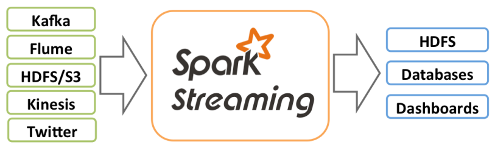

和 Spark 基于 RDD 的概念很相似，Spark Streaming 使用离散化流(discretized stream)作为抽 象表示，叫作 DStream。DStream 是随时间推移而收到的数据的序列。在内部，每个时间区间收 到的数据都作为 RDD 存在，而 DStream 是由这些 RDD 所组成的序列(因此得名“离散化”)。所以 简单来将，DStream 就是对 RDD 在实时数据处理场景的一种封装。

## 1.2 Spark Streaming 的特点

##### 易用

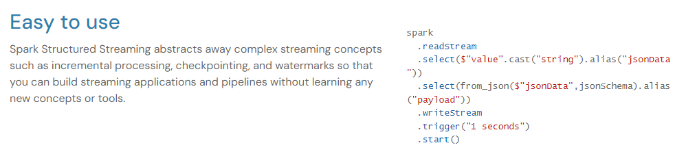

##### 统一的批处理和流api

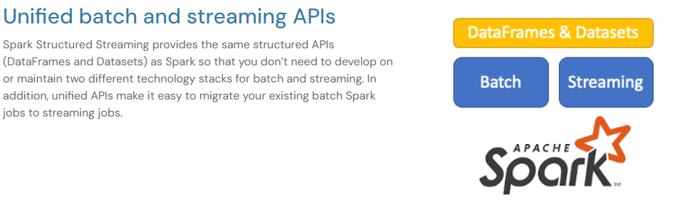

##### 低延迟和成本效益

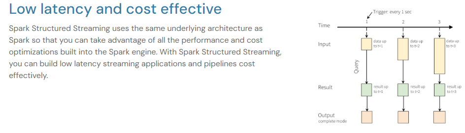

## 1.3 Spark Streaming 架构

### 1.3.1 架构图

##### 整体架构图

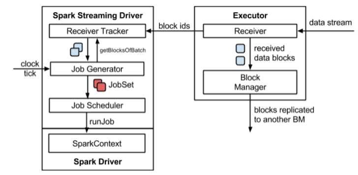

##### SparkStreaming 架构图

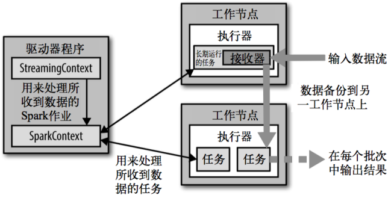

### 1.3.2 背压机制

Spark 1.5 以前版本，用户如果要限制 Receiver 的数据接收速率，可以通过设置静态配制参数“spark.streaming.receiver.maxRate”的值来实现，此举虽然可以通过限制接收速率，来适配当前的处理能力，防止内存溢出，但也会引入其它问题。比如：producer 数据生产高于 maxRate，当前集群处理能力也高于 maxRate，这就会造成资源利用率下降等问题。 为了更好的协调数据接收速率与资源处理能力，1.5 版本开始 Spark Streaming 可以动态控制数据接收速率来适配集群数据处理能力。**背压机制（即 Spark Streaming Backpressure）**: 根据 JobScheduler 反馈作业的执行信息来动态调整 Receiver 数据接收率。 通过属性“spark.streaming.backpressure.enabled”来控制是否启用 backpressure 机制，默认值 false，即不启用。

# 第 2 章 Dstream 入门

## 2.1 WordCount 案例实操

➢ 需求：使用 netcat 工具向 9999 端口不断的发送数据，通过 SparkStreaming 读取端口数据并统计不同单词出现的次数

1) 添加依赖

    ```
    <dependency>
     <groupId>org.apache.spark</groupId>
     <artifactId>spark-streaming_2.12</artifactId>
     <version>3.0.0</version>
    </dependency>
    ```

2. 编写代码

    ```
    object SparkStreaming01_WordCount {
    
        def main(args: Array[String]): Unit = {
    
            // 初始化 Spark 配置信息
            // StreamingContext创建时，需要传递两个参数
            // 第一个参数表示环境配置
            val sparkConf = new SparkConf().setMaster("local[*]").setAppName("SparkStreaming")
            // 第二个参数表示批量处理的周期（采集周期）
            val ssc = new StreamingContext(sparkConf, Seconds(3))
    
     
            // 通过监控端口创建 DStream，读进来的数据为一行行
            val lines: ReceiverInputDStream[String] = ssc.socketTextStream("localhost", 9999)
    		// 将每一行数据做切分，形成一个个单词
            val words = lines.flatMap(_.split(" "))
    
    		// 将单词映射成元组（word,1）
            val wordToOne = words.map((_,1))
    
            // 将相同的单词次数做统计
            val wordToCount: DStream[(String, Int)] = wordToOne.reduceByKey(_+_)
    
    		// 打印
            wordToCount.print()
    
            // 由于SparkStreaming采集器是长期执行的任务，所以不能直接关闭
            // 如果main方法执行完毕，应用程序也会自动结束。所以不能让main执行完毕
            //ssc.stop()
            // 1. 启动采集器
            ssc.start()
            // 2. 等待采集器的关闭
            ssc.awaitTermination()
        }
    }
    ```

3) 启动程序并通过 netcat 发送数据：

   ```
   nc -lk 9999
   hello spark
   ```

## 2.2 WordCount 解析

Discretized Stream 是 Spark Streaming 的基础抽象，代表持续性的数据流和经过各种 Spark 原语操作后的结果数据流。在内部实现上，DStream 是一系列连续的 RDD 来表示。每个 RDD 含有 一段时间间隔内的数据。

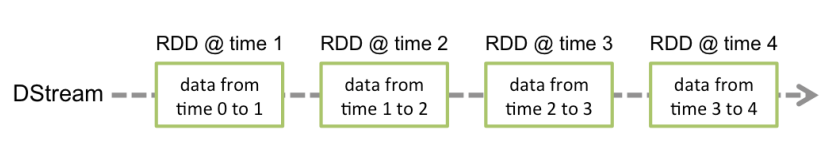

对数据的操作也是按照 RDD 为单位来进行的

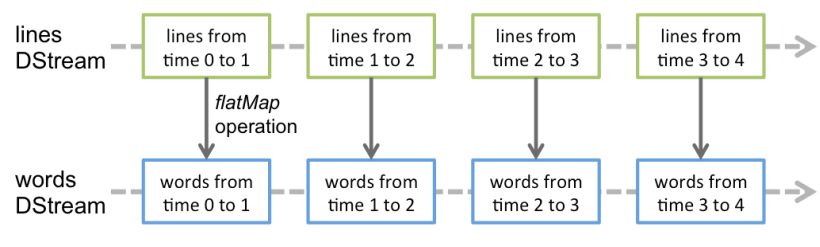

计算过程由 Spark Engine 来完成

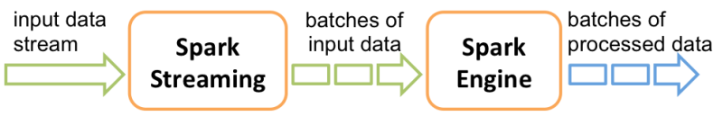

# 第 3 章 DStream 创建

## 3.1 RDD 队列

### 3.1.1 用法及说明

**测试过程中**，可以通过使用 ssc.queueStream(queueOfRDDs)来创建 DStream，每一个推送到这个队列中的 RDD，都会作为一个 DStream 处理。

### 3.1.2 案例实操

需求：循环创建几个 RDD，将 RDD 放入队列。通过 SparkStream 创建 Dstream，计算WordCount

1. 编写代码

    ```
    object RDDStream {
      def main(args: Array[String]) {
        //1.初始化 Spark 配置信息
        val conf = new SparkConf().setMaster("local[*]").setAppName("RDDStream")
        
        //2.初始化 SparkStreamingContext
        val ssc = new StreamingContext(conf, Seconds(4))
        
        //3.创建 RDD 队列
        val rddQueue = new mutable.Queue[RDD[Int]]()
        
        //4.创建 QueueInputDStream
        val inputStream = ssc.queueStream(rddQueue, oneAtATime = false)
        
        //5.处理队列中的 RDD 数据
        val mappedStream = inputStream.map((_, 1))
        val reducedStream = mappedStream.reduceByKey(_ + _)
        
        //6.打印结果
        reducedStream.print()
        
        //7.启动任务
        ssc.start()
        
        //8.循环创建并向 RDD 队列中放入 RDD
        for (i <- 1 to 5) {
          rddQueue += ssc.sparkContext.makeRDD(1 to 300, 10)
          Thread.sleep(2000)
        }
        ssc.awaitTermination()
      }
    }
    ```

2) 结果展示

    ```
    -------------------------------------------
    Time: 1539075280000 ms
    -------------------------------------------
    (4,60)
    (0,60)
    (6,60)
    (8,60)
    (2,60)
    (1,60)
    (3,60)
    (7,60)
    (9,60)
    (5,60)
    -------------------------------------------
    Time: 1539075284000 ms
    -------------------------------------------
    (4,60)
    (0,60)
    (6,60)
    (8,60)
    (2,60)
    (1,60)
    (3,60)
    (7,60)
    (9,60)
    (5,60)
    -------------------------------------------
    Time: 1539075288000 ms
    -------------------------------------------
    (4,30)
    (0,30)
    (6,30)
    (8,30)
    (2,30)
    (1,30)
    (3,30)
    (7,30)
    (9,30)
    (5,30)
    -------------------------------------------
    Time: 1539075292000 ms
    -------------------------------------------
    ```
    
## 3.2 自定义数据源

### 3.2.1 用法及说明

需要继承 Receiver，并实现 onStart、onStop 方法来自定义数据源采集。

### 3.2.2 案例实操

需求：自定义数据源，实现监控某个端口号，获取该端口号内容。

1) 自定义数据源

```
import org.apache.spark.SparkConf
import org.apache.spark.rdd.RDD
import org.apache.spark.storage.StorageLevel
import org.apache.spark.streaming.dstream.ReceiverInputDStream
import org.apache.spark.streaming.receiver.Receiver
import org.apache.spark.streaming.{Seconds, StreamingContext}

import scala.collection.mutable

object CustomerReceiver {

    def main(args: Array[String]): Unit = {

        val sparkConf = new SparkConf().setMaster("local[*]").setAppName("SparkStreaming")
        val ssc = new StreamingContext(sparkConf, Seconds(3))

        val messageDS: ReceiverInputDStream[String] = ssc.receiverStream(new MyReceiver())
        messageDS.print()

        ssc.start()
        ssc.awaitTermination()
    }
    /*
    自定义数据采集器
    1. 继承Receiver，定义泛型, 传递参数
    2. 重写方法
     */
    class MyReceiver extends Receiver[String](StorageLevel.MEMORY_ONLY) {
        private var flg = true
        override def onStart(): Unit = {
            new Thread(new Runnable {
                override def run(): Unit = {
                    while ( flg ) {
                        val message = "采集的数据为：" + new Random().nextInt(10).toString
                        store(message)
                        Thread.sleep(500)
                    }
                }
            }).start()
        }

        override def onStop(): Unit = {
            flg = false;
        }
    }
}
```

## 3.3 Kafka 数据源（面试、开发重点）

### 3.3.1 版本选型

**ReceiverAPI**：需要一个专门的 Executor 去接收数据，然后发送给其他的 Executor 做计算。存在
的问题，接收数据的 Executor 和计算的 Executor 速度会有所不同，特别在接收数据的 Executor
速度大于计算的 Executor 速度，会导致计算数据的节点内存溢出。早期版本中提供此方式，当
前版本不适用
**DirectAPI**：是由计算的 Executor 来主动消费 Kafka 的数据，速度由自身控制。

### 3.3.2 Kafka 0-8 Receiver 模式（当前版本不适用）

1） 需求：通过 SparkStreaming 从 Kafka 读取数据，并将读取过来的数据做简单计算，最终打印到控制台。

2）导入依赖

```
<dependency>
 <groupId>org.apache.spark</groupId>
 <artifactId>spark-streaming-kafka-0-8_2.11</artifactId>
 <version>2.4.5</version>
</dependency>
```

3）编写代码（自动维护 offset）

```
object DirectAPIAuto02 {
  val getSSC1: () => StreamingContext = () => {
    val sparkConf: SparkConf = new
        SparkConf().setAppName("ReceiverWordCount").setMaster("local[*]")
    val ssc = new StreamingContext(sparkConf, Seconds(3))
    ssc
  }

  def main(args: Array[String]): Unit = {
    //获取 SSC
    val ssc: StreamingContext = StreamingContext.getActiveOrCreate("./ck2", () =>
      getSSC)
    //开启任务
    ssc.start()
    ssc.awaitTermination()
  }

  def getSSC: StreamingContext = {
    
    //1.创建 SparkConf
    val sparkConf: SparkConf = new SparkConf().setAppName("ReceiverWordCount").setMaster("local[*]")
    
    //2.创建 StreamingContext
    val ssc = new StreamingContext(sparkConf, Seconds(3))
    //设置 CK
    ssc.checkpoint("./ck2")
    
    //3.定义 Kafka 参数
    val kafkaPara: Map[String, String] = Map[String, String](
      ConsumerConfig.BOOTSTRAP_SERVERS_CONFIG ->
        "linux1:9092,linux2:9092,linux3:9092",
      ConsumerConfig.GROUP_ID_CONFIG -> "atguigu"
    )
    
    //4.读取 Kafka 数据
    val kafkaDStream: InputDStream[(String, String)] =
      KafkaUtils.createDirectStream[String, String, StringDecoder, StringDecoder](ssc,
        kafkaPara,
        Set("atguigu"))
        
    //5.计算 WordCount
    kafkaDStream.map(_._2)
      .flatMap(_.split(" "))
      .map((_, 1))
      .reduceByKey(_ + _)
      .print()
    //6.返回数据
    ssc
  }
}
```

4）编写代码（手动维护 offset）

```
object DirectAPIHandler {
  def main(args: Array[String]): Unit = {
    
    //1.创建 SparkConf
    val sparkConf: SparkConf = new SparkConf().setAppName("ReceiverWordCount").setMaster("local[*]")
    //2.创建 StreamingContext
    val ssc = new StreamingContext(sparkConf, Seconds(3))
    
    //3.Kafka 参数
    val kafkaPara: Map[String, String] = Map[String, String](
      ConsumerConfig.BOOTSTRAP_SERVERS_CONFIG ->
        "hadoop102:9092,hadoop103:9092,hadoop104:9092",
      ConsumerConfig.GROUP_ID_CONFIG -> "atguigu"
    )
    
    //4.获取上一次启动最后保留的 Offset=>getOffset(MySQL)
    val fromOffsets: Map[TopicAndPartition, Long] = Map[TopicAndPartition,
      Long](TopicAndPartition("atguigu", 0) -> 20)
    
    //5.读取 Kafka 数据创建 DStream
    val kafkaDStream: InputDStream[String] = KafkaUtils.createDirectStream[String,
      String, StringDecoder, StringDecoder, String](ssc,
      kafkaPara,
      fromOffsets,
      (m: MessageAndMetadata[String, String]) => m.message())
    
    //6.创建一个数组用于存放当前消费数据的 offset 信息
    var offsetRanges = Array.empty[OffsetRange]
    
    //7.获取当前消费数据的 offset 信息
    val wordToCountDStream: DStream[(String, Int)] = kafkaDStream.transform { rdd
      =>
        offsetRanges = rdd.asInstanceOf[HasOffsetRanges].offsetRanges
        rdd
      }.flatMap(_.split(" "))
      .map((_, 1))
      .reduceByKey(_ + _)
    //8.打印 Offset 信息
    wordToCountDStream.foreachRDD(rdd => {
      for (o <- offsetRanges) {
        println(s"${o.topic}:${o.partition}:${o.fromOffset}:${o.untilOffset}")
      }
      rdd.foreach(println)
    })
    
    //9.开启任务
    ssc.start()
    ssc.awaitTermination()
  }
}
```


### 3.3.4 Kafka 0-10 Direct 模式

1）需求：通过 SparkStreaming 从 Kafka 读取数据，并将读取过来的数据做简单计算，最终打印 到控制台。

2）导入依赖

```
<dependency>
 <groupId>org.apache.spark</groupId>
 <artifactId>spark-streaming-kafka-0-10_2.12</artifactId>
 <version>3.0.0</version>
</dependency>
<dependency>
 <groupId>com.fasterxml.jackson.core</groupId>
 <artifactId>jackson-core</artifactId>
 <version>2.10.1</version>
</dependency>
```

3）编写代码

```
object DirectAPI {
  def main(args: Array[String]): Unit = {
    //1.创建 SparkConf
    val sparkConf: SparkConf = new SparkConf().setAppName("ReceiverWordCount").setMaster("local[*]")

    //2.创建 StreamingContext
    val ssc = new StreamingContext(sparkConf, Seconds(3))
    //3.定义 Kafka 参数
    val kafkaPara: Map[String, Object] = Map[String, Object](
      ConsumerConfig.BOOTSTRAP_SERVERS_CONFIG ->
        "linux1:9092,linux2:9092,linux3:9092",
      ConsumerConfig.GROUP_ID_CONFIG -> "atguigu",
      "key.deserializer" ->
        "org.apache.kafka.common.serialization.StringDeserializer",
      "value.deserializer" ->
        "org.apache.kafka.common.serialization.StringDeserializer"
    )
    
    //4.读取 Kafka 数据创建 DStream
    val kafkaDStream: InputDStream[ConsumerRecord[String, String]] =
      KafkaUtils.createDirectStream[String, String](ssc,
        LocationStrategies.PreferConsistent,
        ConsumerStrategies.Subscribe[String, String](Set("atguigu"), kafkaPara))
        
    //5.将每条消息的 KV 取出
    val valueDStream: DStream[String] = kafkaDStream.map(record => record.value())
    
    //6.计算 WordCount
    valueDStream.flatMap(_.split(" "))
      .map((_, 1))
      .reduceByKey(_ + _)
      .print()
    //7.开启任务
    ssc.start()
    ssc.awaitTermination()
  }
}
```

# 第 4 章 DStream 转换

DStream 上的操作与 RDD 的类似，分为 Transformations（转换）和 Output Operations（输
出）两种，此外转换操作中还有一些比较特殊的原语，如：updateStateByKey()、transform()以及
各种 Window 相关的原语。

## 4.1 无状态转化操作

**无状态转化**操作就是把简单的 RDD 转化操作应用到每个批次上，也就是转化 DStream 中的每
一个 RDD。部分无状态转化操作列在了下表中。注意，针对键值对的 DStream 转化操作(比如
reduceByKey())要添加 import StreamingContext._才能在 Scala 中使用。

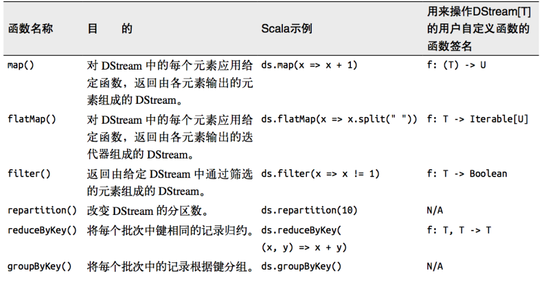

需要记住的是，尽管这些函数看起来像作用在整个流上一样，但事实上每个 DStream 在内部是由许多 RDD（批次）组成，且无状态转化操作是分别应用到每个 RDD 上的。
例如：reduceByKey()会归约每个时间区间中的数据，但不会归约不同区间之间的数据。

### 4.1.1 Transform

Transform 允许 DStream 上执行任意的 RDD-to-RDD 函数。即使这些函数并没有在 DStream 的 API 中暴露出来，通过该函数可以方便的扩展 Spark API。该函数每一批次调度一次。其实也就是对 DStream 中的 RDD 应用转换。

```
object Transform {
  def main(args: Array[String]): Unit = {
    //创建 SparkConf
    val sparkConf: SparkConf = new SparkConf().setMaster("local[*]").setAppName("WordCount")
    
    //创建 StreamingContext
    val ssc = new StreamingContext(sparkConf, Seconds(3))
    
    //创建 DStream
    val lineDStream: ReceiverInputDStream[String] = ssc.socketTextStream("linux1",
      9999)
    
    //转换为 RDD 操作
    val wordAndCountDStream: DStream[(String, Int)] = lineDStream.transform(rdd => {
      val words: RDD[String] = rdd.flatMap(_.split(" "))
      val wordAndOne: RDD[(String, Int)] = words.map((_, 1))
      val value: RDD[(String, Int)] = wordAndOne.reduceByKey(_ + _)
      value
    })
    
    //打印
    wordAndCountDStream.print
    
    //启动
    ssc.start()
    ssc.awaitTermination()
  }
}
```

### 4.1.2 join

两个流之间的 join 需要两个流的批次大小一致，这样才能做到同时触发计算。计算过程就是对当前批次的两个流中各自的 RDD 进行 join，与两个 RDD 的 join 效果相同。

```
object JoinTest {
  def main(args: Array[String]): Unit = {
    
    //1.创建 SparkConf
    val sparkConf: SparkConf = new
        SparkConf().setMaster("local[*]").setAppName("JoinTest")
   
    //2.创建 StreamingContext
    val ssc = new StreamingContext(sparkConf, Seconds(5))
    
    //3.从端口获取数据创建流
    val lineDStream1: ReceiverInputDStream[String] =
      ssc.socketTextStream("linux1", 9999)
    val lineDStream2: ReceiverInputDStream[String] =
      ssc.socketTextStream("linux2", 8888)
   
    //4.将两个流转换为 KV 类型
    val wordToOneDStream: DStream[(String, Int)] = lineDStream1.flatMap(_.split(" ")).map((_, 1))
    val wordToADStream: DStream[(String, String)] = lineDStream2.flatMap(_.split(" ")).map((_, "a"))
   
    //5.流的 JOIN
    val joinDStream: DStream[(String, (Int, String))] =
      wordToOneDStream.join(wordToADStream)
      
    //6.打印
    joinDStream.print()
    
    //7.启动任务
    ssc.start()
    ssc.awaitTermination()
  }
}
```

## 4.2 有状态转化操作

### 4.2.1 UpdateStateByKey

UpdateStateByKey 原语用于记录历史记录，有时，我们需要在 DStream 中跨批次维护状态(例如流计算中累加 wordcount)。针对这种情况，updateStateByKey()为我们提供了对一个状态变量的访问，用于键值对形式的 DStream。给定一个由(键，事件)对构成的 DStream，并传递一个指定如何根据新的事件更新每个键对应状态的函数，它可以构建出一个新的 DStream，其内部数据为(键，状态) 对。 

updateStateByKey() 的结果会是一个新的 DStream，其内部的 RDD 序列是由每个时间区间对应的(键，状态)对组成的。 

updateStateByKey 操作使得我们可以在用新信息进行更新时保持任意的状态。为使用这个功能，需要做下面两步： 

1. 定义状态，状态可以是一个任意的数据类型。 

2. 定义状态更新函数，用此函数阐明如何使用之前的状态和来自输入流的新值对状态进行更新。

    使用 updateStateByKey 需要对检查点目录进行配置，会使用检查点来保存状态。 

    更新版的 wordcount

    ```
    object WorldCount {
      def main(args: Array[String]) {
    
        // 定义更新状态方法，参数 values 为当前批次单词频度，state 为以往批次单词频度
        val updateFunc = (values: Seq[Int], state: Option[Int]) => {
          val currentCount = values.foldLeft(0)(_ + _)
          val previousCount = state.getOrElse(0)
          Some(currentCount + previousCount)
        }
        val conf = new SparkConf().setMaster("local[*]").setAppName("NetworkWordCount")
        val ssc = new StreamingContext(conf, Seconds(3))
        ssc.checkpoint("./ck")
    
        // Create a DStream that will connect to hostname:port, like hadoop102:9999
        val lines = ssc.socketTextStream("linux1", 9999)
    
        // Split each line into words
        val words = lines.flatMap(_.split(" "))
    
        //import org.apache.spark.streaming.StreamingContext._ // not necessary since Spark 1.3
        // Count each word in each batch
        val pairs = words.map(word => (word, 1))
    
        // 使用 updateStateByKey 来更新状态，统计从运行开始以来单词总的次数
        val stateDstream = pairs.updateStateByKey[Int](updateFunc)
        stateDstream.print()
        ssc.start() // Start the computation
        ssc.awaitTermination() // Wait for the computation to terminate
        //ssc.stop()
      }
    }
    ```

2. 启动程序并向 9999 端口发送数据

    ```
    nc -lk 9999
    Hello World
    Hello Scala
    ```

3. 结果展示

    ```
    -------------------------------------------
    Time: 1504685175000 ms
    -------------------------------------------
    -------------------------------------------
    Time: 1504685181000 ms
    -------------------------------------------
    (shi,1)
    (shui,1)
    (ni,1)
    -------------------------------------------
    Time: 1504685187000 ms
    -------------------------------------------
    (shi,1)
    (ma,1)
    (hao,1)
    (shui,1)
    ```

### 4.2.2 WindowOperations

Window Operations 可以设置窗口的大小和滑动窗口的间隔来动态的获取当前 Steaming 的允许状态。所有基于窗口的操作都需要两个参数，分别为窗口时长以及滑动步长。

➢  窗口时长：计算内容的时间范围；

➢ 滑动步长：隔多久触发一次计算。

> 注意：这两者都必须为采集周期大小的整数倍。

WordCount 第三版：3 秒一个批次，窗口 12 秒，滑步 6 秒。

```
object WorldCount {
  def main(args: Array[String]) {
    val conf = new  SparkConf().setMaster("local[2]").setAppName("NetworkWordCount")
    val ssc = new StreamingContext(conf, Seconds(3))
    ssc.checkpoint("./ck")
    
    // Create a DStream that will connect to hostname:port, like localhost:9999
    val lines = ssc.socketTextStream("linux1", 9999)
    
    // Split each line into words
    val words = lines.flatMap(_.split(" "))
    
    // Count each word in each batch
    val pairs = words.map(word => (word, 1))
    val wordCounts = pairs.reduceByKeyAndWindow((a: Int, b: Int) => (a + b), Seconds(12), Seconds(6))
    
    // Print the first ten elements of each RDD generated in this DStream to the console
    wordCounts.print()
    ssc.start() // Start the computation
    ssc.awaitTermination() // Wait for the computation to terminate
  }
}
```

关于 Window 的操作还有如下方法：

（1）window(windowLength, slideInterval): 基于对源 DStream 窗化的批次进行计算返回一个 新的 Dstream；

 （2）countByWindow(windowLength, slideInterval): 返回一个滑动窗口计数流中的元素个数； 

（3）reduceByWindow(func, windowLength, slideInterval): 通过使用自定义函数整合滑动区间流元素来创建一个新的单元素流； 

（4）reduceByKeyAndWindow(func, windowLength, slideInterval, [numTasks]): 当在一个(K,V) 对的 DStream 上调用此函数，会返回一个新(K,V)对的 DStream，此处通过对滑动窗口中批次数 据使用 reduce 函数来整合每个 key 的 value 值。 

（5）reduceByKeyAndWindow(func, invFunc, windowLength, slideInterval, [numTasks]): 这个函数是上述函数的变化版本，每个窗口的 reduce 值都是通过用前一个窗的 reduce 值来递增计算。 通过 reduce 进入到滑动窗口数据并”反向 reduce”离开窗口的旧数据来实现这个操作。一个例子是随着窗口滑动对 keys 的“加”“减”计数。通过前边介绍可以想到，这个函数只适用于可逆的 reduce 函数”，也就是这些 reduce 函数有相应的”反 reduce”函数(以参数 invFunc 形式 传入)。如前述函数，reduce 任务的数量通过可选参数来配置。

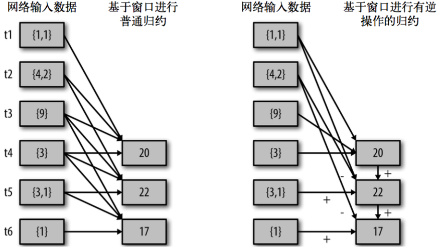

```
val ipDStream = accessLogsDStream.map(logEntry => (logEntry.getIpAddress(), 1))
val ipCountDStream = ipDStream.reduceByKeyAndWindow(
 {(x, y) => x + y},
 {(x, y) => x - y},
 Seconds(30),
 Seconds(10))
 //加上新进入窗口的批次中的元素 //移除离开窗口的老批次中的元素 //窗口时长// 滑动步长
```

countByWindow()和 countByValueAndWindow()作为对数据进行计数操作的简写。 countByWindow()返回一个表示每个窗口中元素个数的 DStream，而 countByValueAndWindow() 返回的 DStream 则包含窗口中每个值的个数。

# 第 5 章 DStream 输出

输出操作指定了对流数据经转化操作得到的数据所要执行的操作(例如把结果推入外部数据库或输出到屏幕上)。与 RDD 中的惰性求值类似，如果一个 DStream 及其派生出的 DStream 都没有被执行输出操作，那么这些 DStream 就都不会被求值。如果 StreamingContext 中没有设定输出操作，整个 context 就都不会启动。

输出操作如下：

➢ print()：在运行流程序的**驱动结点**上打印 DStream 中每一批次数据的最开始 10 个元素。这用于开发和调试。在 Python API 中，同样的操作叫 print()。 

➢ saveAsTextFiles(prefix, [suffix])：以 text 文件形式存储这个 DStream 的内容。每一批次的存储文件名基于参数中的 prefix 和 suffix。”prefix-Time_IN_MS[.suffix]”。 

➢ saveAsObjectFiles(prefix, [suffix])：以 Java 对象序列化的方式将 Stream 中的数据保存为 SequenceFiles . 每一批次的存储文件名基于参数中的为"prefix-TIME_IN_MS[.suffix]". Python 中目前不可用。 

➢ saveAsHadoopFiles(prefix, [suffix])：将 Stream 中的数据保存为 Hadoop files. 每一批次的存储文件名基于参数中的为"prefix-TIME_IN_MS[.suffix]"。Python API 中目前不可用。 

➢ foreachRDD(func)：这是最通用的输出操作，即将函数 func 用于产生于 stream 的每一个 RDD。其中参数传入的函数 func 应该实现将每一个 RDD 中数据推送到外部系统，如将 RDD 存入文件或者通过网络将其写入数据库。

通用的输出操作 foreachRDD()，它用来对 DStream 中的 RDD 运行任意计算。这和 transform() 有些类似，都可以让我们访问任意 RDD。在 foreachRDD()中，可以重用我们在 Spark 中实现的所有行动操作。比如，常见的用例之一是把数据写到诸如 MySQL 的外部数据库中。

注意： 

1) 连接不能写在 driver 层面（序列化） 
2)  如果写在 foreach 则每个 RDD 中的每一条数据都创建，得不偿失； 
3) 增加 foreachPartition，在分区创建（获取）。

> （1）、foreachRdd运行在driver节点，因为它是操作dstream的。foreachPartition和foreach运行在worker节点，因为它是操作rdd的。foreachRdd开启对任务的启动，当执行到执行算子的时候开始任务的执行。
> （2）、对rdd进行操作的就运行在worker节点，对dstream进行操作的就运行在driver节点。
>
> （3）、以下代码将rdd转成了set，所以在driver端执行。

# 第 6 章 优雅关闭

流式任务需要 7*24 小时执行，但是有时涉及到升级代码需要主动停止程序，但是分布式程序，没办法做到一个个进程去杀死，所有配置优雅的关闭就显得至关重要了。
使用外部文件系统来控制内部程序关闭。

➢ MonitorStop

```
class MonitorStop(ssc: StreamingContext) extends Runnable {
  override def run(): Unit = {
    val fs: FileSystem = FileSystem.get(new URI("hdfs://linux1:9000"), new Configuration(), "atguigu")
    while (true) {
      try
        Thread.sleep(5000)
      catch {
        case e: InterruptedException =>
          e.printStackTrace()
      }
      val state: StreamingContextState = ssc.getState
      val bool: Boolean = fs.exists(new Path("hdfs://linux1:9000/stopSpark"))
      if (bool) {
        if (state == StreamingContextState.ACTIVE) {
          ssc.stop(stopSparkContext = true, stopGracefully = true)
          System.exit(0)
        }
      }
    }
  }
}
```

➢ SparkTest

```
object SparkTest {
  def main(args: Array[String]): Unit = {

    val ssc: StreamingContext = StreamingContext.getActiveOrCreate("./ck", () =>
      createSSC())
    new Thread(new MonitorStop(ssc)).start()
    ssc.start()
    ssc.awaitTermination()
  }

  def createSSC(): _root_.org.apache.spark.streaming.StreamingContext = {

    val update: (Seq[Int], Option[Int]) => Some[Int] = (values: Seq[Int], status: Option[Int]) => {
      //当前批次内容的计算
      val sum: Int = values.sum
      //取出状态信息中上一次状态
      val lastStatu: Int = status.getOrElse(0)
      Some(sum + lastStatu)
    }
    val sparkConf: SparkConf = new
        SparkConf().setMaster("local[4]").setAppName("SparkTest")

    //设置优雅的关闭
    sparkConf.set("spark.streaming.stopGracefullyOnShutdown", "true")
    val ssc = new StreamingContext(sparkConf, Seconds(5))
    ssc.checkpoint("./ck")
    val line: ReceiverInputDStream[String] = ssc.socketTextStream("linux1", 9999)
    val word: DStream[String] = line.flatMap(_.split(" "))
    val wordAndOne: DStream[(String, Int)] = word.map((_, 1))
    val wordAndCount: DStream[(String, Int)] = wordAndOne.updateStateByKey(update)
    wordAndCount.print()
    ssc
  }
}
```


# 案例

```
package com.atguigu.bigdata.spark.streaming

import java.sql.ResultSet
import java.text.SimpleDateFormat

import com.atguigu.bigdata.spark.util.JDBCUtil
import org.apache.kafka.clients.consumer.{ConsumerConfig, ConsumerRecord}
import org.apache.spark.SparkConf
import org.apache.spark.streaming.dstream.InputDStream
import org.apache.spark.streaming.kafka010.{ConsumerStrategies, KafkaUtils, LocationStrategies}
import org.apache.spark.streaming.{Seconds, StreamingContext}

import scala.collection.mutable.ListBuffer

object SparkStreaming11_Req1_BlackList {

    def main(args: Array[String]): Unit = {

        val sparkConf = new SparkConf().setMaster("local[*]").setAppName("SparkStreaming")
        val ssc = new StreamingContext(sparkConf, Seconds(3))

        val kafkaPara: Map[String, Object] = Map[String, Object](
            ConsumerConfig.BOOTSTRAP_SERVERS_CONFIG -> "linux1:9092,linux2:9092,linux3:9092",
            ConsumerConfig.GROUP_ID_CONFIG -> "atguigu",
            "key.deserializer" -> "org.apache.kafka.common.serialization.StringDeserializer",
            "value.deserializer" -> "org.apache.kafka.common.serialization.StringDeserializer"
        )

        val kafkaDataDS: InputDStream[ConsumerRecord[String, String]] = KafkaUtils.createDirectStream[String, String](
            ssc,
            LocationStrategies.PreferConsistent,
            ConsumerStrategies.Subscribe[String, String](Set("atguiguNew"), kafkaPara)
        )
        val adClickData = kafkaDataDS.map(
            kafkaData => {
                val data = kafkaData.value()
                val datas = data.split(" ")
                AdClickData(datas(0),datas(1),datas(2),datas(3),datas(4))
            }
        )

        val ds = adClickData.transform(
            rdd => {
                // TODO 通过JDBC周期性获取黑名单数据
                val blackList = ListBuffer[String]()

                val conn = JDBCUtil.getConnection
                val pstat = conn.prepareStatement("select userid from black_list")

                val rs: ResultSet = pstat.executeQuery()
                while ( rs.next() ) {
                    blackList.append(rs.getString(1))
                }

                rs.close()
                pstat.close()
                conn.close()

                // TODO 判断点击用户是否在黑名单中
                val filterRDD = rdd.filter(
                    data => {
                        !blackList.contains(data.user)
                    }
                )

                // TODO 如果用户不在黑名单中，那么进行统计数量（每个采集周期）
                filterRDD.map(
                    data => {
                        val sdf = new SimpleDateFormat("yyyy-MM-dd")
                        val day = sdf.format(new java.util.Date( data.ts.toLong ))
                        val user = data.user
                        val ad = data.ad

                        (( day, user, ad ), 1) // (word, count)
                    }
                ).reduceByKey(_+_)
            }
        )

        ds.foreachRDD(
            rdd => {
                rdd.foreach{
                    case ( ( day, user, ad ), count ) => {
                        println(s"${day} ${user} ${ad} ${count}")
                        if ( count >= 30 ) {
                            // TODO 如果统计数量超过点击阈值(30)，那么将用户拉入到黑名单
                            val conn = JDBCUtil.getConnection
                            val pstat = conn.prepareStatement(
                                """
                                  |insert into black_list (userid) values (?)
                                  |on DUPLICATE KEY
                                  |UPDATE userid = ?
                                """.stripMargin)
                            pstat.setString(1, user)
                            pstat.setString(2, user)
                            pstat.executeUpdate()
                            pstat.close()
                            conn.close()
                        } else {
                            // TODO 如果没有超过阈值，那么需要将当天的广告点击数量进行更新。
                            val conn = JDBCUtil.getConnection
                            val pstat = conn.prepareStatement(
                                """
                                  | select
                                  |     *
                                  | from user_ad_count
                                  | where dt = ? and userid = ? and adid = ?
                                """.stripMargin)

                            pstat.setString(1, day)
                            pstat.setString(2, user)
                            pstat.setString(3, ad)
                            val rs = pstat.executeQuery()
                            // 查询统计表数据
                            if ( rs.next() ) {
                                // 如果存在数据，那么更新
                                val pstat1 = conn.prepareStatement(
                                    """
                                      | update user_ad_count
                                      | set count = count + ?
                                      | where dt = ? and userid = ? and adid = ?
                                    """.stripMargin)
                                pstat1.setInt(1, count)
                                pstat1.setString(2, day)
                                pstat1.setString(3, user)
                                pstat1.setString(4, ad)
                                pstat1.executeUpdate()
                                pstat1.close()
                                // TODO 判断更新后的点击数据是否超过阈值，如果超过，那么将用户拉入到黑名单。
                                val pstat2 = conn.prepareStatement(
                                    """
                                      |select
                                      |    *
                                      |from user_ad_count
                                      |where dt = ? and userid = ? and adid = ? and count >= 30
                                    """.stripMargin)
                                pstat2.setString(1, day)
                                pstat2.setString(2, user)
                                pstat2.setString(3, ad)
                                val rs2 = pstat2.executeQuery()
                                if ( rs2.next() ) {
                                    val pstat3 = conn.prepareStatement(
                                        """
                                          |insert into black_list (userid) values (?)
                                          |on DUPLICATE KEY
                                          |UPDATE userid = ?
                                        """.stripMargin)
                                    pstat3.setString(1, user)
                                    pstat3.setString(2, user)
                                    pstat3.executeUpdate()
                                    pstat3.close()
                                }

                                rs2.close()
                                pstat2.close()
                            } else {
                                // 如果不存在数据，那么新增
                                val pstat1 = conn.prepareStatement(
                                    """
                                      | insert into user_ad_count ( dt, userid, adid, count ) values ( ?, ?, ?, ? )
                                    """.stripMargin)

                                pstat1.setString(1, day)
                                pstat1.setString(2, user)
                                pstat1.setString(3, ad)
                                pstat1.setInt(4, count)
                                pstat1.executeUpdate()
                                pstat1.close()
                            }

                            rs.close()
                            pstat.close()
                            conn.close()
                        }
                    }
                }
            }
        )

        ssc.start()
        ssc.awaitTermination()
    }
    // 广告点击数据
    case class AdClickData( ts:String, area:String, city:String, user:String, ad:String )

}
```

