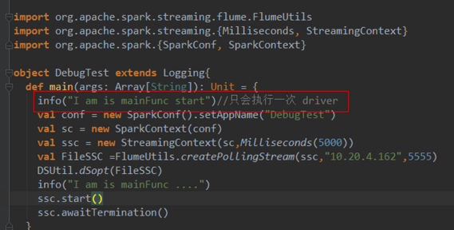
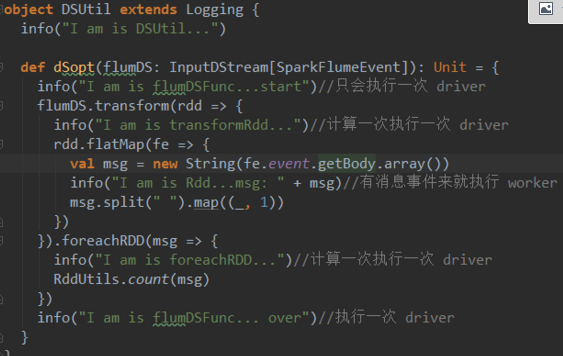
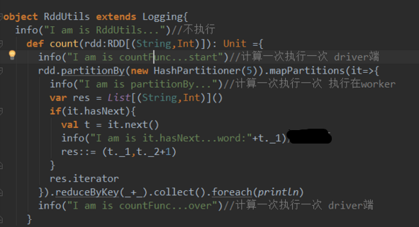

# 什么计算运行在executor，什么算子运行在driver？

（1）、foreachRdd运行在driver节点，因为它是操作dstream的。foreachPartition和foreach运行在worker节点，因为它是操作rdd的。foreachRdd开启对任务的启动，当执行到执行算子的时候开始任务的执行。
（2）、对rdd进行操作的就运行在worker节点，对dstream进行操作的就运行在driver节点。

（3）、以下代码将rdd转成了set，所以在driver端执行。
 

```
resultPlayListRdd.map{ _._1 }.collect.toSet
```

### 一、main方法

 

**main方法就是在driver端执行的，当然这里是把RDD计算的Action剔除的情况**，先看一段代码



 

 除了rdd算子中的代码其他都是在driver端执行，并且只执行一次

 

### 二、DStream处理方法

 

在sparkStreaming中spark 引入了DStream，在处理的时候代码是：



 

 

 DStream的action方法中的代码只有在处理rdd时才会在Worker端执行，其他**对dstream进行操作的就运行在driver节点**，这里是计算一次执行一次。除了Dstram计算中的代码其他都是在driver端并且只执行一次。

 

### 三、RDD处理方法

 



 

 与rdd算子无关的代码都是在driver端计算一次执行一次。rdd的算子闭包是在worker端中执行的。