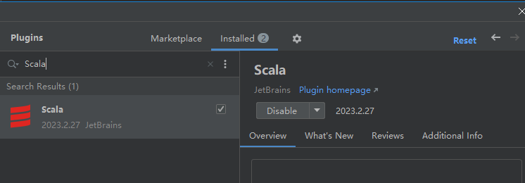

# 第 1 章 Spark 概述

## 1.1 Spark 是什么


Spark 是一种基于内存的快速、通用、可扩展的大数据分析计算引擎。

> Spark 于 2009 年诞生于加州大学伯克利分校 AMPLab，2013 年被捐赠给 Apache 软件基金会，2014 年 2 月成为 Apache 的顶级项目。相对于 MapReduce 的批处理计算，Spark 可以带来上百倍的性能提升，因此它成为继 MapReduce 之后，最为广泛使用的分布式计算框架。

## 1.2 Spark and Hadoop

在之前的学习中，Hadoop 的 MapReduce 是大家广为熟知的计算框架，那为什么咱们还要学习新的计算框架 Spark 呢，这里就不得不提到 Spark 和 Hadoop 的关系。

首先从时间节点上来看: 

➢ Hadoop 

- 2006 年 1 月，Doug Cutting 加入 Yahoo，领导 Hadoop 的开发 

- 2008 年 1 月，Hadoop 成为 Apache 顶级项目  

- 2011 年 1.0 正式发布 - 2012 年 3 月稳定版发布 

- 2013 年 10 月发布 2.X (Yarn)版本 

➢ Spark 

- 2009 年，Spark 诞生于伯克利大学的 AMPLab 实验室 

-  2010 年，伯克利大学正式开源了 Spark 项目 

-  2013 年 6 月，Spark 成为了 Apache 基金会下的项目 

- 2014 年 2 月，Spark 以飞快的速度成为了 Apache 的顶级项目 

-  2015 年至今，Spark 变得愈发火爆，大量的国内公司开始重点部署或者使用 Spark 

**然后我们再从功能上来看**

➢ Hadoop

- Hadoop 是由 java 语言编写的，在分布式服务器集群上存储海量数据并运行分布式分析应用的开源框架 

-  作为 Hadoop 分布式文件系统，HDFS 处于 Hadoop 生态圈的最下层，存储着所有的数 据 ， 支持着 Hadoop 的 所有服 务 。 它 的 理 论 基础源于 Google 的 TheGoogleFileSystem 这篇论文，它是 GFS 的开源实现。 

-  **MapReduce** 是一种编程模型，Hadoop 根据 Google 的 MapReduce 论文将其实现， 作为 Hadoop 的分布式计算模型，是 Hadoop 的核心。基于这个框架，分布式并行程序的编写变得异常简单。综合了 HDFS 的分布式存储和 MapReduce 的分布式计算，Hadoop 在处理海量数据时，性能横向扩展变得非常容易。 

-  HBase 是对 Google 的 Bigtable 的开源实现，但又和 Bigtable 存在许多不同之处。 HBase 是一个基于 HDFS 的分布式数据库，擅长实时地随机读/写超大规模数据集。 它也是 Hadoop 非常重要的组件。 

➢ Spark 
- Spark 是一种由 Scala 语言开发的快速、通用、可扩展的**大数据分析引擎** 
-  Spark Core 中提供了 Spark 最基础与最核心的功能 
-  Spark SQL 是 Spark 用来操作结构化数据的组件。通过 Spark SQL，用户可以使用 SQL 或者 Apache Hive 版本的 SQL 方言（HQL）来查询数据。 
-  Spark Streaming 是 Spark 平台上针对实时数据进行流式计算的组件，提供了丰富的处理数据流的 API。

由上面的信息可以获知，Spark 出现的时间相对较晚，并且主要功能主要是用于数据计算，
所以其实 Spark 一直被认为是 Hadoop 框架的升级版。

## 1.3 Spark or Hadoop

Hadoop 的 MR 框架和 Spark 框架都是数据处理框架，那么我们在使用时如何选择呢？ 

- Hadoop MapReduce 由于其设计初衷并不是为了满足循环迭代式数据流处理，因此在多并行运行的数据可复用场景（如：机器学习、图挖掘算法、交互式数据挖掘算法）中存在诸多计算效率等问题。所以 Spark 应运而生，Spark 就是在传统的 MapReduce 计算框架的基础上，利用其计算过程的优化，从而大大加快了数据分析、挖掘的运行和读写速度，并将计算单元缩小到更适合并行计算和重复使用的 RDD 计算模型。
- 机器学习中 ALS、凸优化梯度下降等。这些都需要基于数据集或者数据集的衍生数据反复查询反复操作。MR 这种模式不太合适，即使多 MR 串行处理，性能和时间也是一 个问题。数据的共享依赖于磁盘。另外一种是交互式数据挖掘，MR 显然不擅长。而 Spark 所基于的 scala 语言恰恰擅长函数的处理。
- Spark 是一个分布式数据快速分析项目。它的核心技术是弹性分布式数据集（Resilient  Distributed Datasets），提供了比 MapReduce 丰富的模型，可以快速在内存中对数据集 进行多次迭代，来支持复杂的数据挖掘算法和图形计算算法。
- **Spark 和Hadoop 的根本差异是多个作业之间的数据通信问题 : Spark 多个作业之间数据通信是基于内存，而 Hadoop 是基于磁盘。**
- Spark Task 的启动时间快。Spark 采用 fork 线程的方式，而 Hadoop 采用创建新的进程的方式。
-  Spark 只有在 shuffle 的时候将数据写入磁盘，而 Hadoop 中多个 MR 作业之间的数据交互都要依赖于磁盘交互
- Spark 的缓存机制比 HDFS 的缓存机制高效。

经过上面的比较，我们可以看出在绝大多数的数据计算场景中，Spark 确实会比 MapReduce 更有优势。但是 Spark 是基于内存的，所以在实际的生产环境中，由于内存的限制，可能会由于内存资源不够导致 Job 执行失败，此时，MapReduce 其实是一个更好的选择，所以 Spark 并不能完全替代 MR。

## 1.4 Spark 核心模块


- Spark Core
    Spark Core 中提供了 Spark 最基础与最核心的功能，Spark 其他的功能如：Spark SQL，Spark Streaming，GraphX, MLlib 都是在 Spark Core 的基础上进行扩展的

-  Spark SQL
    Spark SQL 是 Spark 用来操作结构化数据的组件。通过 Spark SQL，用户可以使用 SQL 或者 Apache Hive 版本的 SQL 方言（HQL）来查询数据。

- Spark Streaming
    Spark Streaming 是 Spark 平台上针对实时数据进行流式计算的组件，提供了丰富的处理数据流的 API。

    

    Spark Streaming 的本质是微批处理，它将数据流进行极小粒度的拆分，拆分为多个批处理，从而达到接近于流处理的效果。

    

- Spark MLlib
    MLlib 是 Spark 提供的一个机器学习算法库。MLlib 不仅提供了模型评估、数据导入等额外的功能，还提供了一些更底层的机器学习原语。

-  Spark GraphX
    GraphX 是 Spark 面向图计算提供的框架与算法库。

## 1.5 集群架构

| Term（术语）    | Meaning（含义）                                              |
| --------------- | ------------------------------------------------------------ |
| Application     | Spark 应用程序，由集群上的一个 Driver 节点和多个 Executor 节点组成。 |
| Driver program  | 主运用程序，该进程运行应用的 main() 方法并且创建 SparkContext |
| Cluster manager | 集群资源管理器（例如，Standlone Manager，Mesos，YARN）       |
| Worker node     | 执行计算任务的工作节点                                       |
| Executor        | 位于工作节点上的应用进程，负责执行计算任务并且将输出数据保存到内存或者磁盘中 |
| Task            | 被发送到 Executor 中的工作单元                               |


**执行过程**：

1. 用户程序创建 SparkContext 后，它会连接到集群资源管理器，集群资源管理器会为用户程序分配计算资源，并启动 Executor；
2. Driver 将计算程序划分为不同的执行阶段和多个 Task，之后将 Task 发送给 Executor；
3. Executor 负责执行 Task，并将执行状态汇报给 Driver，同时也会将当前节点资源的使用情况汇报给集群资源管理器。


## 第2章 Spark 快速上手

在大数据早期的课程中我们已经学习了 MapReduce 框架的原理及基本使用，并了解了其底层数据处理的实现方式。接下来，就让咱们走进 Spark 的世界，了解一下它是如何带领我们完成数据处理的。

## 2.1 创建 Maven 项目 

### 2.1.1 增加 Scala 插件

Spark 由 Scala 语言开发的，所以本课件接下来的开发所使用的语言也为 Scala，咱们当前使用的 Spark 版本为 3.0.0，默认采用的 Scala 编译版本为 2.12，所以后续开发时。我们依然采用这个版本。开发前请保证 IDEA 开发工具中含有 Scala 开发插件



## 2.1.2 增加依赖关系

修改 Maven 项目中的 POM 文件，增加 Spark 框架的依赖关系。本课件基于 Spark3.5 版本，使用时请注意对应版本。

```
    <dependencies>
        <dependency>
            <groupId>org.apache.spark</groupId>
            <artifactId>spark-core_2.13</artifactId>
            <version>3.5.0</version>
        </dependency> 
        <dependency>
            <groupId>org.slf4j</groupId>
            <artifactId>slf4j-simple</artifactId>
            <version>1.7.32</version>
            <scope>compile</scope>
        </dependency>
    </dependencies>
```


### 2.1.3 WordCount 

为了能直观地感受 Spark 框架的效果，接下来我们实现一个大数据学科中最常见的教学案例 WordCount

```
object Spark01_WordCount {
  def main(args: Array[String]): Unit = {

    // Application
    // Spark框架
    // TODO 建立和Spark框架的连接
    // JDBC : Connection
    val sparConf = new SparkConf().setMaster("local").setAppName("WordCount")
    val sc = new SparkContext(sparConf)

    // TODO 执行业务操作

    // 1. 读取文件，获取一行一行的数据
    //    hello world
    val lines: RDD[String] = sc.textFile("datas")

    // 2. 将一行数据进行拆分，形成一个一个的单词（分词）
    //    扁平化：将整体拆分成个体的操作
    //   "hello world" => hello, world, hello, world
    val words: RDD[String] = lines.flatMap(_.split(" "))

    // 3. 将数据根据单词进行分组，便于统计
    //    (hello, hello, hello), (world, world)
    val wordGroup: RDD[(String, Iterable[String])] = words.groupBy(word => word)

    // 4. 对分组后的数据进行转换
    //    (hello, hello, hello), (world, world)
    //    (hello, 3), (world, 2)
    val wordToCount = wordGroup.map {
      case (word, list) => {
        (word, list.size)
      }
    }

    // 5. 将转换结果采集到控制台打印出来
    val array: Array[(String, Int)] = wordToCount.collect()
    array.foreach(println)

    // TODO 关闭连接
    sc.stop()
  }
}
```

执行过程中，会产生大量的执行日志，如果为了能够更好的查看程序的执行结果，可以在项 目的 resources 目录中创建 log4j.properties 文件，并添加日志配置信息： 

```log4j.rootCategory=ERROR, console```


# 第3章 Spark 运行环境

Spark 作为一个数据处理框架和计算引擎，被设计在所有常见的集群环境中运行, 在国内工作中主流的环境为 Yarn，不过逐渐容器式环境也慢慢流行起来。接下来，我们就分别看看不同环境下 Spark 的运行

###  1.1 下载并解压

官方下载地址：[http://spark.apache.org/downloads.html](https://spark.apache.org/downloads.html) ，选择 Spark 版本和对应的 Hadoop 版本后再下载：

 


SPark 中 executor 和 yarn 中的 container 有什么区别
