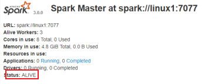

# 第 1 章 Spark 概述

## 1.1 Spark 是什么


Spark 是一种基于内存的快速、通用、可扩展的大数据分析计算引擎。

> Spark 于 2009 年诞生于加州大学伯克利分校 AMPLab，2013 年被捐赠给 Apache 软件基金会，2014 年 2 月成为 Apache 的顶级项目。相对于 MapReduce 的批处理计算，Spark 可以带来上百倍的性能提升，因此它成为继 MapReduce 之后，最为广泛使用的分布式计算框架。

## 1.2 Spark and Hadoop

在之前的学习中，Hadoop 的 MapReduce 是大家广为熟知的计算框架，那为什么咱们还要学习新的计算框架 Spark 呢，这里就不得不提到 Spark 和 Hadoop 的关系。

首先从时间节点上来看:

➢ Hadoop

- 2006 年 1 月，Doug Cutting 加入 Yahoo，领导 Hadoop 的开发

- 2008 年 1 月，Hadoop 成为 Apache 顶级项目

- 2011 年 1.0 正式发布 - 2012 年 3 月稳定版发布

- 2013 年 10 月发布 2.X (Yarn)版本

➢ Spark

- 2009 年，Spark 诞生于伯克利大学的 AMPLab 实验室

- 2010 年，伯克利大学正式开源了 Spark 项目

- 2013 年 6 月，Spark 成为了 Apache 基金会下的项目

- 2014 年 2 月，Spark 以飞快的速度成为了 Apache 的顶级项目

- 2015 年至今，Spark 变得愈发火爆，大量的国内公司开始重点部署或者使用 Spark

**然后我们再从功能上来看**

➢ Hadoop

- Hadoop 是由 java 语言编写的，在分布式服务器集群上存储海量数据并运行分布式分析应用的开源框架

- 作为 Hadoop 分布式文件系统，HDFS 处于 Hadoop 生态圈的最下层，存储着所有的数 据 ， 支持着 Hadoop 的 所有服 务 。 它 的 理 论 基础源于 Google 的 TheGoogleFileSystem 这篇论文，它是 GFS 的开源实现。

- **MapReduce** 是一种编程模型，Hadoop 根据 Google 的 MapReduce 论文将其实现， 作为 Hadoop 的分布式计算模型，是 Hadoop 的核心。基于这个框架，分布式并行程序的编写变得异常简单。综合了 HDFS 的分布式存储和 MapReduce 的分布式计算，Hadoop 在处理海量数据时，性能横向扩展变得非常容易。

- HBase 是对 Google 的 Bigtable 的开源实现，但又和 Bigtable 存在许多不同之处。 HBase 是一个基于 HDFS 的分布式数据库，擅长实时地随机读/写超大规模数据集。 它也是 Hadoop 非常重要的组件。

➢ Spark

- Spark 是一种由 Scala 语言开发的快速、通用、可扩展的**大数据分析引擎**
- Spark Core 中提供了 Spark 最基础与最核心的功能
- Spark SQL 是 Spark 用来操作结构化数据的组件。通过 Spark SQL，用户可以使用 SQL 或者 Apache Hive 版本的 SQL 方言（HQL）来查询数据。
- Spark Streaming 是 Spark 平台上针对实时数据进行流式计算的组件，提供了丰富的处理数据流的 API。

由上面的信息可以获知，Spark 出现的时间相对较晚，并且主要功能主要是用于数据计算，
所以其实 Spark 一直被认为是 Hadoop 框架的升级版。

## 1.3 Spark or Hadoop

Hadoop 的 MR 框架和 Spark 框架都是数据处理框架，那么我们在使用时如何选择呢？

- Hadoop MapReduce 由于其设计初衷并不是为了满足循环迭代式数据流处理，因此在多并行运行的数据可复用场景（如：机器学习、图挖掘算法、交互式数据挖掘算法）中存在诸多计算效率等问题。所以 Spark 应运而生，Spark 就是在传统的 MapReduce 计算框架的基础上，利用其计算过程的优化，从而大大加快了数据分析、挖掘的运行和读写速度，并将计算单元缩小到更适合并行计算和重复使用的 RDD 计算模型。
- 机器学习中 ALS、凸优化梯度下降等。这些都需要基于数据集或者数据集的衍生数据反复查询反复操作。MR 这种模式不太合适，即使多 MR 串行处理，性能和时间也是一 个问题。数据的共享依赖于磁盘。另外一种是交互式数据挖掘，MR 显然不擅长。而 Spark 所基于的 scala 语言恰恰擅长函数的处理。
- Spark 是一个分布式数据快速分析项目。它的核心技术是弹性分布式数据集（Resilient Distributed Datasets），提供了比 MapReduce 丰富的模型，可以快速在内存中对数据集 进行多次迭代，来支持复杂的数据挖掘算法和图形计算算法。
- **Spark 和 Hadoop 的根本差异是多个作业之间的数据通信问题 : Spark 多个作业之间数据通信是基于内存，而 Hadoop 是基于磁盘。**
- Spark Task 的启动时间快。Spark 采用 fork 线程的方式，而 Hadoop 采用创建新的进程的方式。
- Spark 只有在 shuffle 的时候将数据写入磁盘，而 Hadoop 中多个 MR 作业之间的数据交互都要依赖于磁盘交互
- Spark 的缓存机制比 HDFS 的缓存机制高效。

经过上面的比较，我们可以看出在绝大多数的数据计算场景中，Spark 确实会比 MapReduce 更有优势。但是 Spark 是基于内存的，所以在实际的生产环境中，由于内存的限制，可能会由于内存资源不够导致 Job 执行失败，此时，MapReduce 其实是一个更好的选择，所以 Spark 并不能完全替代 MR。

## 1.4 Spark 核心模块


- Spark Core
  Spark Core 中提供了 Spark 最基础与最核心的功能，Spark 其他的功能如：Spark SQL，Spark Streaming，GraphX, MLlib 都是在 Spark Core 的基础上进行扩展的

- Spark SQL
  Spark SQL 是 Spark 用来操作结构化数据的组件。通过 Spark SQL，用户可以使用 SQL 或者 Apache Hive 版本的 SQL 方言（HQL）来查询数据。

- Spark Streaming
  Spark Streaming 是 Spark 平台上针对实时数据进行流式计算的组件，提供了丰富的处理数据流的 API。

  

  Spark Streaming 的本质是微批处理，它将数据流进行极小粒度的拆分，拆分为多个批处理，从而达到接近于流处理的效果。

  

- Spark MLlib
  MLlib 是 Spark 提供的一个机器学习算法库。MLlib 不仅提供了模型评估、数据导入等额外的功能，还提供了一些更底层的机器学习原语。

- Spark GraphX
  GraphX 是 Spark 面向图计算提供的框架与算法库。

## 1.5 集群架构

| Term（术语）    | Meaning（含义）                                                              |
| --------------- | ---------------------------------------------------------------------------- |
| Application     | Spark 应用程序，由集群上的一个 Driver 节点和多个 Executor 节点组成。         |
| Driver program  | 主运用程序，该进程运行应用的 main() 方法并且创建 SparkContext                |
| Cluster manager | 集群资源管理器（例如，Standlone Manager，Mesos，YARN）                       |
| Worker node     | 执行计算任务的工作节点                                                       |
| Executor        | 位于工作节点上的应用进程，负责执行计算任务并且将输出数据保存到内存或者磁盘中 |
| Task            | 被发送到 Executor 中的工作单元                                               |


**执行过程**：

1. 用户程序创建 SparkContext 后，它会连接到集群资源管理器，集群资源管理器会为用户程序分配计算资源，并启动 Executor；
2. Driver 将计算程序划分为不同的执行阶段和多个 Task，之后将 Task 发送给 Executor；
3. Executor 负责执行 Task，并将执行状态汇报给 Driver，同时也会将当前节点资源的使用情况汇报给集群资源管理器。

## 第 2 章 Spark 快速上手

在大数据早期的课程中我们已经学习了 MapReduce 框架的原理及基本使用，并了解了其底层数据处理的实现方式。接下来，就让咱们走进 Spark 的世界，了解一下它是如何带领我们完成数据处理的。

## 2.1 创建 Maven 项目

### 2.1.1 增加 Scala 插件

Spark 由 Scala 语言开发的，所以本课件接下来的开发所使用的语言也为 Scala，咱们当前使用的 Spark 版本为 3.0.0，默认采用的 Scala 编译版本为 2.12，所以后续开发时。我们依然采用这个版本。开发前请保证 IDEA 开发工具中含有 Scala 开发插件


## 2.1.2 增加依赖关系

修改 Maven 项目中的 POM 文件，增加 Spark 框架的依赖关系。本课件基于 Spark3.5 版本，使用时请注意对应版本。

```
    <dependencies>
        <dependency>
            <groupId>org.apache.spark</groupId>
            <artifactId>spark-core_2.13</artifactId>
            <version>3.5.0</version>
        </dependency>
        <dependency>
            <groupId>org.slf4j</groupId>
            <artifactId>slf4j-simple</artifactId>
            <version>1.7.32</version>
            <scope>compile</scope>
        </dependency>
    </dependencies>
```

### 2.1.3 WordCount

为了能直观地感受 Spark 框架的效果，接下来我们实现一个大数据学科中最常见的教学案例 WordCount

```
object Spark01_WordCount {
  def main(args: Array[String]): Unit = {

    // Application
    // Spark框架
    // TODO 建立和Spark框架的连接
    // JDBC : Connection
    val sparConf = new SparkConf().setMaster("local").setAppName("WordCount")
    val sc = new SparkContext(sparConf)

    // TODO 执行业务操作

    // 1. 读取文件，获取一行一行的数据
    //    hello world
    val lines: RDD[String] = sc.textFile("datas")

    // 2. 将一行数据进行拆分，形成一个一个的单词（分词）
    //    扁平化：将整体拆分成个体的操作
    //   "hello world" => hello, world, hello, world
    val words: RDD[String] = lines.flatMap(_.split(" "))

    // 3. 将数据根据单词进行分组，便于统计
    //    (hello, hello, hello), (world, world)
    val wordGroup: RDD[(String, Iterable[String])] = words.groupBy(word => word)

    // 4. 对分组后的数据进行转换
    //    (hello, hello, hello), (world, world)
    //    (hello, 3), (world, 2)
    val wordToCount = wordGroup.map {
      case (word, list) => {
        (word, list.size)
      }
    }

    // 5. 将转换结果采集到控制台打印出来
    val array: Array[(String, Int)] = wordToCount.collect()
    array.foreach(println)

    // TODO 关闭连接
    sc.stop()
  }
}
```

执行过程中，会产生大量的执行日志，如果为了能够更好的查看程序的执行结果，可以在项 目的 resources 目录中创建 log4j.properties 文件，并添加日志配置信息：

`log4j.rootCategory=ERROR, console`


# 第 3 章 Spark 运行环境

Spark 作为一个数据处理框架和计算引擎，被设计在所有常见的集群环境中运行, 在国内工作中主流的环境为 Yarn，不过逐渐容器式环境也慢慢流行起来。接下来，我们就分别看看不同环境下 Spark 的运行

## 3.1 下载并解压

官方下载地址：[http://spark.apache.org/downloads.html](https://spark.apache.org/downloads.html) ，选择 Spark 版本和对应的 Hadoop 版本后再下载：


解压安装包：

```
# tar -zxvf  spark-3.5.0-bin-hadoop3.tgz
```

## 3.2 配置环境变量

```
# vim /etc/profile
```

添加环境变量：

```
export SPARK_HOME=/usr/app/spark-3.5.0-bin-hadoop3
export  PATH=${SPARK_HOME}/bin:$PATH
```

使得配置的环境变量立即生效：

```
# source /etc/profile
```

## 3.3 Local 模式

Local 模式是最简单的一种运行方式，它采用单节点多线程方式运行，不用部署，开箱即用，适合日常测试开发。

```
# 启动spark-shell
spark-shell --master local[2]
```

- **local**：只启动一个工作线程；

- **local[k]**：启动 k 个工作线程；

- **local[\*]**：启动跟 cpu 数目相同的工作线程数。

  

进入 spark-shell 后，程序已经自动创建好了上下文 `SparkContext`，等效于执行了下面的 Scala 代码：

```
val conf = new SparkConf().setAppName("Spark shell").setMaster("local[2]")
val sc = new SparkContext(conf)
```

启动成功后，可以输入网址进行 Web UI 监控页面访问

```
http://虚拟机地址:4040
```


## 3.4 词频统计案例

安装完成后可以先做一个简单的词频统计例子，感受 spark 的魅力。准备一个词频统计的文件样本 `wc.txt`，内容如下：

```
hadoop,spark,hadoop
spark,flink,flink,spark
hadoop,hadoop
```

在 scala 交互式命令行中执行如下 Scala 语句：

```
val file = spark.sparkContext.textFile("file:///home/wc.txt")
val wordCounts = file.flatMap(line => line.split(",")).map((word => (word, 1))).reduceByKey(_ + _)
wordCounts.foreach(println)
```

执行过程如下，可以看到已经输出了词频统计的结果：


同时还可以通过 Web UI 查看作业的执行情况，访问端口为 `4040`：


## 3.5 退出本地模式

按键 Ctrl+C 或输入 Scala 指令

```
:quit
```

# 4. 提交应用

## 4.1 spark-submit

示例程序

```
bin/spark-submit \
--class org.apache.spark.examples.SparkPi \
--master local[2] \
./examples/jars/spark-examples_2.13-3.5.0.jar \
10
```

Spark 所有模式均使用 `spark-submit` 命令提交作业，其格式如下：

```
./bin/spark-submit \
  --class <main-class> \        # 应用程序主入口类
  --master <master-url> \       # 集群的 Master Url
  --deploy-mode <deploy-mode> \ # 部署模式
  --conf <key>=<value> \        # 可选配置
  ... # other options
  <application-jar> \           # Jar 包路径
  [application-arguments]       #传递给主入口类的参数
```

- 1. --class 表示要执行程序的主类，此处可以更换为咱们自己写的应用程序
  2. --master local[2] 部署模式，默认为本地模式，数字表示分配的虚拟 CPU 核数量
  3. spark-examples_2.13-3.5.0.jar 运行的应用类所在的 jar 包，实际使用时，可以设定为咱 们自己打的 jar 包
  4. 数字 10 表示程序的入口参数，用于设定当前应用的任务数量

> 需要注意的是：在集群环境下，`application-jar` 必须能被集群中所有节点都能访问，可以是 HDFS 上的路径；也可以是本地文件系统路径，如果是本地文件系统路径，则要求集群中每一个机器节点上的相同路径都存在该 Jar 包。

### 4.1.1 deploy-mode

deploy-mode 有 `cluster` 和 `client` 两个可选参数，默认为 `client`。这里以 Spark On Yarn 模式对两者进行说明 ：

- 在 cluster 模式下，Spark Drvier 在应用程序的 Master 进程内运行，该进程由群集上的 YARN 管理，提交作业的客户端可以在启动应用程序后关闭；
- 在 client 模式下，Spark Drvier 在提交作业的客户端进程中运行，Master 进程仅用于从 YARN 请求资源。

### 4.1.2 master-url

master-url 的所有可选参数如下表所示：

| Master URL                        | Meaning                                                                                                                                                             |
| --------------------------------- | ------------------------------------------------------------------------------------------------------------------------------------------------------------------- |
| `local`                           | 使用一个线程本地运行 Spark                                                                                                                                          |
| `local[K]`                        | 使用 K 个 worker 线程本地运行 Spark                                                                                                                                 |
| `local[K,F]`                      | 使用 K 个 worker 线程本地运行 , 第二个参数为 Task 的失败重试次数                                                                                                    |
| `local[*]`                        | 使用与 CPU 核心数一样的线程数在本地运行 Spark                                                                                                                       |
| `local[*,F]`                      | 使用与 CPU 核心数一样的线程数在本地运行 Spark 第二个参数为 Task 的失败重试次数                                                                                      |
| `spark://HOST:PORT`               | 连接至指定的 standalone 集群的 master 节点。端口号默认是 7077。                                                                                                     |
| `spark://HOST1:PORT1,HOST2:PORT2` | 如果 standalone 集群采用 Zookeeper 实现高可用，则必须包含由 zookeeper 设置的所有 master 主机地址。                                                                  |
| `mesos://HOST:PORT`               | 连接至给定的 Mesos 集群。端口默认是 5050。对于使用了 ZooKeeper 的 Mesos cluster 来说，使用 `mesos://zk://...` 来指定地址，使用 `--deploy-mode cluster` 模式来提交。 |
| `yarn`                            | 连接至一个 YARN 集群，集群由配置的 `HADOOP_CONF_DIR` 或者 `YARN_CONF_DIR` 来决定。使用 `--deploy-mode` 参数来配置 `client` 或 `cluster` 模式。                      |

## 4.2 Local 模式

Local 模式下提交作业最为简单，不需要进行任何配置，提交命令如下：

```
# 本地模式提交应用
spark-submit \
--class org.apache.spark.examples.SparkPi \
--master local[2] \
./examples/jars/spark-examples_2.13-3.5.0.jar \
10   # 传给 SparkPi 的参数
```


## 4.3 Standalone 模式

Standalone 是 Spark 提供的一种**内置的集群模式**，采用内置的资源管理器进行管理。下面按照如图所示演示 1 个 Mater 和 2 个 Worker 节点的集群配置，这里使用两台主机进行演示：

- hadoop001： 由于只有两台主机，所以 hadoop001 既是 Master 节点，也是 Worker 节点;
- hadoop002 ： Worker 节点。

### 4.3.1 环境配置

首先需要保证 Spark 已经解压在两台主机的相同路径上。然后进入 hadoop001 的 `${SPARK_HOME}/conf/` 目录下，拷贝配置样本并进行相关配置：

在 `spark-env.sh` 中配置 JDK 的目录，完成后将该配置使用 scp 命令分发到 hadoop002 上：

```
# JDK安装位置
JAVA_HOME=/usr/java/jdk1.8.0_201
SPARK_MASTER_HOST=hadoop001
SPARK_MASTER_PORT=7077
```

注意：7077 端口，相当于 hadoop3 内部通信的 8020 端口，此处的端口需要确认自己的 Hadoop
配置

### 4.3.2 集群配置

在 `${SPARK_HOME}/conf/` 目录下，拷贝集群配置样本并进行相关配置：

```
# cp slaves.template slaves
```

指定所有 Worker 节点的主机名：

```
# A Spark Worker will be started on each of the machines listed below.
hadoop001
hadoop002
```

这里需要注意以下三点：

- 主机名与 IP 地址的映射必须在 `/etc/hosts` 文件中已经配置，否则就直接使用 IP 地址；
- 每个主机名必须独占一行；
- Spark 的 Master 主机是通过 SSH 访问所有的 Worker 节点，所以需要预先配置免密登录。

### 4.3.3 启动

使用 `start-all.sh` 代表启动 Master 和所有 Worker 服务。

```
sbin/start-all.sh
```


### 4.3.4 提交作业

```
# 以client模式提交到standalone集群
spark-submit \
--class org.apache.spark.examples.SparkPi \
--master spark://hadoop001:7077 \
--executor-memory 2G \
--total-executor-cores 10 \
./examples/jars/spark-examples_2.13-3.5.0.jar \
100

# 以cluster模式提交到standalone集群
spark-submit \
--class org.apache.spark.examples.SparkPi \
--master spark://207.184.161.138:7077 \
--deploy-mode cluster \
--supervise \  # 配置此参数代表开启监督，如果主应用程序异常退出，则自动重启 Driver
--executor-memory 2G \
--total-executor-cores 10 \
./examples/jars/spark-examples_2.13-3.5.0.jar \
100
```

### 4.3.5 可选配置

在虚拟机上提交作业时经常出现一个的问题是作业无法申请到足够的资源：

```
Initial job has not accepted any resources;
check your cluster UI to ensure that workers are registered and have sufficient resources
```

这时候可以查看 Web UI，我这里是内存空间不足：提交命令中要求作业的 `executor-memory` 是 2G，但是实际的工作节点的 `Memory` 只有 1G，这时候你可以修改 `--executor-memory`，也可以修改 Woker 的 `Memory`，其默认值为主机所有可用内存值减去 1G。


关于 Master 和 Woker 节点的所有可选配置如下，可以在 `spark-env.sh` 中进行对应的配置：

| Environment Variable（环境变量） | Meaning（含义）                                                                                                                                                                                                                         |
| -------------------------------- | --------------------------------------------------------------------------------------------------------------------------------------------------------------------------------------------------------------------------------------- |
| `SPARK_MASTER_HOST`              | master 节点地址                                                                                                                                                                                                                         |
| `SPARK_MASTER_PORT`              | master 节点地址端口（默认：7077）                                                                                                                                                                                                       |
| `SPARK_MASTER_WEBUI_PORT`        | master 的 web UI 的端口（默认：8080）                                                                                                                                                                                                   |
| `SPARK_MASTER_OPTS`              | 仅用于 master 的配置属性，格式是 "-Dx=y"（默认：none）,所有属性可以参考官方文档：[spark-standalone-mode](https://gitee.com/link?target=https%3A%2F%2Fspark.apache.org%2Fdocs%2Flatest%2Fspark-standalone.html%23spark-standalone-mode)  |
| `SPARK_LOCAL_DIRS`               | spark 的临时存储的目录，用于暂存 map 的输出和持久化存储 RDDs。多个目录用逗号分隔                                                                                                                                                        |
| `SPARK_WORKER_CORES`             | spark worker 节点可以使用 CPU Cores 的数量。（默认：全部可用）                                                                                                                                                                          |
| `SPARK_WORKER_MEMORY`            | spark worker 节点可以使用的内存数量（默认：全部的内存减去 1GB）；                                                                                                                                                                       |
| `SPARK_WORKER_PORT`              | spark worker 节点的端口（默认： random（随机））                                                                                                                                                                                        |
| `SPARK_WORKER_WEBUI_PORT`        | worker 的 web UI 的 Port（端口）（默认：8081）                                                                                                                                                                                          |
| `SPARK_WORKER_DIR`               | worker 运行应用程序的目录，这个目录中包含日志和暂存空间（default：SPARK_HOME/work）                                                                                                                                                     |
| `SPARK_WORKER_OPTS`              | 仅用于 worker 的配置属性，格式是 "-Dx=y"（默认：none）。所有属性可以参考官方文档：[spark-standalone-mode](https://gitee.com/link?target=https%3A%2F%2Fspark.apache.org%2Fdocs%2Flatest%2Fspark-standalone.html%23spark-standalone-mode) |
| `SPARK_DAEMON_MEMORY`            | 分配给 spark master 和 worker 守护进程的内存。（默认： 1G）                                                                                                                                                                             |
| `SPARK_DAEMON_JAVA_OPTS`         | spark master 和 worker 守护进程的 JVM 选项，格式是 "-Dx=y"（默认：none）                                                                                                                                                                |
| `SPARK_PUBLIC_DNS`               | spark master 和 worker 的公开 DNS 名称。（默认：none）                                                                                                                                                                                  |

### 4.3.6 配置历史服务

由于 spark-shell 停止掉后，集群监控 hadoop1:4040 页面就看不到历史任务的运行情况，所以 开发时都配置历史服务器记录任务运行情况。

1. 修改 spark-defaults.conf.template 文件名为 spark-defaults.conf

```
mv spark-defaults.conf.template spark-defaults.conf
```

2.  修改 spark-default.conf 文件，配置日志存储路径

```
spark.eventLog.enabled true
spark.eventLog.dir hdfs://hadoop001:8020/directory
```

注意：需要启动 hadoop 集群，HDFS 上的 directory 目录需要提前存在。

```
sbin/start-dfs.sh
hadoop fs -mkdir /directory
```

3. 修改 spark-env.sh 文件, 添加日志配置

```
export SPARK_HISTORY_OPTS="
-Dspark.history.ui.port=18080
-Dspark.history.fs.logDirectory=hdfs://hadoop001:8020/directory
-Dspark.history.retainedApplications=30"
```

- 参数 1 含义：WEB UI 访问的端口号为 18080
- 参数 2 含义：指定历史服务器日志存储路径
- 参数 3 含义：指定保存 Application 历史记录的个数，如果超过这个值，旧的应用程序信息将被删除，这个是内存中的应用数，而不是页面上显示的应用数。

4. 分发配置文件

5. 重新启动集群和历史服

   ```
   sbin/start-all.sh
   sbin/start-history-server.sh
   ```

6. 重新执行任务

   ```
   # 以cluster模式提交到standalone集群
   spark-submit \
   --class org.apache.spark.examples.SparkPi \
   --master spark://207.184.161.138:7077 \
   --deploy-mode cluster \
   --supervise \  # 配置此参数代表开启监督，如果主应用程序异常退出，则自动重启 Driver
   --executor-memory 2G \
   --total-executor-cores 10 \
   ./examples/jars/spark-examples_2.13-3.5.0.jar \
   100
   ```

7) 查看历史服务：http://hadoop1:18080

### 4.3.7 配置高可用（HA）

所谓的高可用是因为当前集群中的 Master 节点只有一个，所以会存在单点故障问题。所以
为了解决单点故障问题，需要在集群中配置多个 Master 节点，一旦处于活动状态的 Master
发生故障时，由备用 Master 提供服务，保证作业可以继续执行。这里的高可用一般采用
Zookeeper 设置


1. 停止集群 `sbin/stop-all.sh`

2. 启动 Zookeeper

3. 修改 spark-env.sh 文件添加如下配置

   ```
   注释如下内容：
   #SPARK_MASTER_HOST=hadoop1
   #SPARK_MASTER_PORT=7077
   添加如下内容:
   #Master 监控页面默认访问端口为 8080，但是可能会和 Zookeeper 冲突，所以改成 8989，也可以自
   定义，访问 UI 监控页面时请注意
   SPARK_MASTER_WEBUI_PORT=8989
   export SPARK_DAEMON_JAVA_OPTS="
   Dspark.deploy.recoveryMode=ZOOKEEPER
   -Dspark.deploy.zookeeper.url=hadoop1,hadoop2,hadoop3
   -Dspark.deploy.zookeeper.dir=/spark"
   ```

4. 分发配置文件

5. 启动集群

```
sbin/start-all.sh
```



6.  启动 hadoop2 的单独 Master 节点，此时 hadoop2 节点 Master 状态处于备用状态


## 4.4 Spark on Yarn 模式

独立部署（Standalone）模式由 Spark 自身提供计算资源，无需其他框架提供资源。这种方式降低了和其他第三方资源框架的耦合性，独立性非常强。但是你也要记住，Spark 主要是计算框架，而不是资源调度框架，所以本身提供的资源调度并不是它的强项，所以还是和其他专业的资源调度框架集成会更靠谱一些。所以接下来我们来学习在强大的 Yarn 环境 下 Spark 是如何工作的（其实是因为在国内工作中，Yarn 使用的非常多）。

### 4.4.1 修改配置文件

1. 修改 hadoop 配置文件/opt/module/hadoop/etc/hadoop/yarn-site.xml, 并分发

   ```
   <!--是否启动一个线程检查每个任务正使用的物理内存量，如果任务超出分配值，则直接将其杀掉，默认
   是 true -->
   <property>
    <name>yarn.nodemanager.pmem-check-enabled</name>
    <value>false</value>
   </property>
   <!--是否启动一个线程检查每个任务正使用的虚拟内存量，如果任务超出分配值，则直接将其杀掉，默认
   是 true -->
   <property>
    <name>yarn.nodemanager.vmem-check-enabled</name>
    <value>false</value>
   </property>
   ```

2) 修改 conf/spark-env.sh，添加 JAVA_HOME 和 YARN_CONF_DIR 配置

   ```
   mv spark-env.sh.template spark-env.sh
   。。。
   export JAVA_HOME=/opt/module/jdk1.8.0_144
   YARN_CONF_DIR=/opt/module/hadoop/etc/hadoop
   ```

### 4.4.2 启动 HDFS 以及 YARN 集群

### 4.4.4 提交应用

```
spark-submit \
--class org.apache.spark.examples.SparkPi \
--master yarn \
--deploy-mode cluster \
./examples/jars/spark-examples_2.13-3.5.0.jar \
10
```


查看 http://hadoop1:8088 页面，点击 History，查看历史页面


### 4.4.5 配置历史服务器

1. 修改 spark-defaults.conf.template 文件名为 spark-defaults.conf

   ```
   mv spark-defaults.conf.template spark-defaults.conf
   ```

2. 修改 spark-default.conf 文件，配置日志存储路径

   ```
   spark.eventLog.enabled true
   spark.eventLog.dir hdfs://hadoop1:8020/directory
   ```

   > 注意：需要启动 hadoop 集群，HDFS 上的目录需要提前存在。

   ```
   [root@hadoop1 hadoop]# sbin/start-dfs.sh
   [root@hadoop1 hadoop]# hadoop fs -mkdir /directory
   ```

3. 修改 spark-env.sh 文件, 添加日志配置
   ```
   export SPARK_HISTORY_OPTS="
   -Dspark.history.ui.port=18080
   -Dspark.history.fs.logDirectory=hdfs://hadoop1:8020/directory
   -Dspark.history.retainedApplications=30"
   ```

- 参数 1 含义：WEB UI 访问的端口号为 18080
- 参数 2 含义：指定历史服务器日志存储路径
- 参数 3 含义：指定保存 Application 历史记录的个数，如果超过这个值，旧的应用程序 信息将被删除，这个是内存中的应用数，而不是页面上显示的应用数。

4. 修改 spark-defaults.conf
   ```
   park.yarn.historyServer.address=hadoop1:18080
   spark.history.ui.port=18080
   ```

5) 启动历史服务

   ```
   sbin/start-history-server.sh
   ```

6) 重新提交应用

   ```
   spark-submit \
   --class org.apache.spark.examples.SparkPi \
   --master yarn \
   --deploy-mode cluster \
   ./examples/jars/spark-examples_2.13-3.5.0.jar \
   10
   ```

7) Web 页面查看日志：http://hadoop2:8088

## 4.5 K8S & Mesos 模式

Mesos 是 Apache 下的开源分布式资源管理框架，它被称为是分布式系统的内核,在 Twitter 得到广泛使用,管理着 Twitter 超过 30,0000 台服务器上的应用部署，但是在国内，依 然使用着传统的 Hadoop 大数据框架，所以国内使用 Mesos 框架的并不多，但是原理其实都 差不多，这里我们就不做过多讲解了


容器化部署是目前业界很流行的一项技术，基于 Docker 镜像运行能够让用户更加方便 地对应用进行管理和运维。容器管理工具中最为流行的就是 Kubernetes（k8s），而 Spark 也在最近的版本中支持了 k8s 部署模式。这里我们也不做过多的讲解。给个链接大家自己感 受一下：https://spark.apache.org/docs/latest/running-on-kubernetes.html


## 4.6 Windows 模式

在同学们自己学习时，每次都需要启动虚拟机，启动集群，这是一个比较繁琐的过程， 并且会占大量的系统资源，导致系统执行变慢，不仅仅影响学习效果，也影响学习进度， Spark 非常暖心地提供了可以在 windows 系统下启动本地集群的方式，这样，在不使用虚拟 机的情况下，也能学习 Spark 的基本使用。

在后续的教学中，为了能够给同学们更加流畅的教学效果和教学体验，我们一般情况下 都会采用 windows 系统的集群来学习 Spark。

### 4.6.1 解压缩文件

将文件 spark-3.5.0-bin-hadoop3.0.tgz 解压缩到无中文无空格的路径中

### 4.6.2 启动本地环境

1. 执行解压缩文件路径下 bin 目录中的 spark-shell.cmd 文件，启动 Spark 本地环境


2. 在 bin 目录中创建 input 目录，并添加 word.txt 文件, 在命令行中输入脚本代码


### 4.6.3 命令行提交应用

在 DOS 命令行窗口中执行提交指令

```
spark-submit --class org.apache.spark.examples.SparkPi --master
local[2] ../examples/jars/spark-examples_2.12-3.0.0.jar 10
```


# 5 部署模式对比


# 6 端口号

➢ Spark 查看当前 Spark-shell 运行任务情况端口号：4040（计算）

➢ Spark Master 内部通信服务端口号：7077

➢ Standalone 模式下，Spark Master Web 端口号：8080（资源）

➢ Spark 历史服务器端口号：18080

➢ Hadoop YARN 任务运行情况查看端口号：8088
