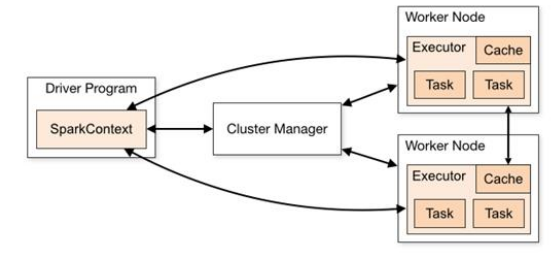
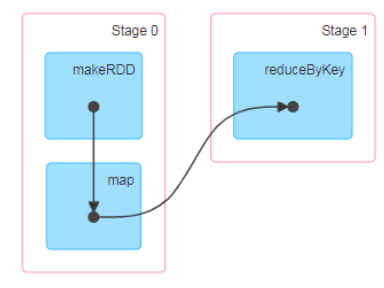
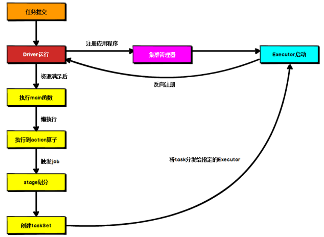

# 1 运行架构

Spark 框架的核心是一个计算引擎，整体来说，它采用了标准 master-slave 的结构。 如下图所示，它展示了一个 Spark 执行时的基本结构。图形中的 Driver 表示 master， 负责管理整个集群中的作业任务调度。图形中的 Executor 则是 slave，负责实际执行任务。

# 2 核心组件

由上图可以看出，对于 Spark 框架有两个核心组件：

## 2.1 Driver 

Spark 驱动器节点，用于执行 Spark 任务中的 main 方法，负责实际代码的执行工作。 Driver 在 Spark 作业执行时主要负责： 

➢ 将用户程序转化为作业（job） 

➢ 在 Executor 之间调度任务(task) 

➢ 跟踪 Executor 的执行情况 

➢ 通过 UI 展示查询运行情况 

实际上，我们无法准确地描述 Driver 的定义，因为在整个的编程过程中没有看到任何有关 Driver 的字眼。所以简单理解，所谓的 Driver 就是驱使整个应用运行起来的程序，也称之为 Driver 类。

## 2.2 Executor

Spark Executor 是集群中工作节点（Worker）中的一个 JVM 进程，负责在 Spark 作业 中运行具体任务（Task），任务彼此之间相互独立。Spark 应用启动时，Executor 节点被同时启动，并且始终伴随着整个 Spark 应用的生命周期而存在。如果有 Executor 节点发生了 故障或崩溃，Spark 应用也可以继续执行，会将出错节点上的任务调度到其他 Executor 节点 上继续运行。

Executor 有两个核心功能：

➢ 负责运行组成 Spark 应用的任务，并将结果返回给驱动器进程 

➢ 它们通过自身的块管理器（Block Manager）为用户程序中要求缓存的 RDD 提供内存 式存储。RDD 是直接缓存在 Executor 进程内的，因此任务可以在运行时充分利用缓存 数据加速运算。

## 2.3 Master & Worker

Spark 集群的独立部署环境中，不需要依赖其他的资源调度框架，自身就实现了资源调 度的功能，所以环境中还有其他两个核心组件：Master 和 Worker，这里的 Master 是一个进程，**主要负责资源的调度和分配，并进行集群的监控等职责**，类似于 Yarn 环境中的 RM, 而 Worker 呢，也是进程，一个 Worker 运行在集群中的一台服务器上，由 Master 分配资源对数据进行并行的处理和计算，类似于 Yarn 环境中 NM。

## 2.4 ApplicationMaster

Hadoop 用户向 YARN 集群提交应用程序时,提交程序中应该包含 ApplicationMaster，用 于向资源调度器申请执行任务的资源容器 Container，运行用户自己的程序任务 job，监控整个任务的执行，跟踪整个任务的状态，处理任务失败等异常情况。 说的简单点就是，ResourceManager（资源）和 Driver（计算）之间的解耦合靠的就是 ApplicationMaster。

# 3 核心概念

## 3.1 Executor 与 Core

Spark Executor 是集群中运行在工作节点（Worker）中的一个 JVM 进程，是整个集群中 的专门用于计算的节点。在提交应用中，可以提供参数指定计算节点的个数，以及对应的资源。这里的资源一般指的是工作节点 Executor 的内存大小和使用的虚拟 CPU 核（Core）数量。

应用程序相关启动参数如下：

|        名称         |                  说明                  |
| :-----------------: | :------------------------------------: |
|  `--num-executors`  |          配置 Executor 的数量          |
| `--executor-memory` |      配置每个 Executor 的内存大小      |
| `--executor-cores`  | 配置每个 Executor 的虚拟 CPU core 数量 |

## 3.2 并行度（Parallelism）

在分布式计算框架中一般都是多个任务同时执行，由于任务分布在不同的计算节点进行 计算，所以能够真正地实现多任务并行执行，记住，这里是并行，而不是并发。这里我们将整个集群并行执行任务的数量称之为**并行度**。那么一个作业到底并行度是多少呢？这个取决于框架的默认配置。应用程序也可以在运行过程中动态修改。

## 3.3 有向无环图（DAG）

大数据计算引擎框架我们根据使用方式的不同一般会分为四类，其中第一类就是 Hadoop 所承载的 MapReduce,它将计算分为两个阶段，分别为 Map 阶段 和 Reduce 阶段。 对于上层应用来说，就不得不想方设法去拆分算法，甚至于不得不在上层应用实现多个 Job  的串联，以完成一个完整的算法，例如迭代计算。 由于这样的弊端，催生了支持 DAG 框 架的产生。因此，支持 DAG 的框架被划分为第二代计算引擎。如 Tez 以及更上层的 Oozie。这里我们不去细究各种 DAG 实现之间的区别，不过对于当时的 Tez 和 Oozie 来 说，大多还是批处理的任务。接下来就是以 Spark 为代表的第三代的计算引擎。第三代计算引擎的特点主要是 Job 内部的 DAG 支持（不跨越 Job），以及实时计算。 这里所谓的有向无环图，并不是真正意义的图形，而是由 Spark 程序直接映射成的数据流的高级抽象模型。简单理解就是将整个程序计算的执行过程用图形表示出来,这样更直观，更便于理解，可以用于表示程序的拓扑结构。

DAG（Directed Acyclic Graph）有向无环图是由点和线组成的拓扑图形，该图形具有方 向，不会闭环。

# 4 提交流程

所谓的提交流程，其实就是我们开发人员根据需求写的应用程序通过 Spark 客户端提交 给 Spark 运行环境执行计算的流程。在不同的部署环境中，这个提交过程基本相同，但是又有细微的区别，我们这里不进行详细的比较，但是因为国内工作中，将 Spark 引用部署到 Yarn 环境中会更多一些，所以本课程中的提交流程是基于 Yarn 环境的。

Spark 应用程序提交到 Yarn 环境中执行的时候，一般会有两种部署执行的方式：Client 和 Cluster。两种模式主要区别在于：Driver 程序的运行节点位置。

## 2.1 Yarn Client 模式

Client 模式将用于监控和调度的 Driver 模块在客户端执行，而不是在 Yarn 中，所以一 般用于测试。 

➢ Driver 在任务提交的本地机器上运行 

➢ Driver 启动后会和 ResourceManager 通讯申请启动 ApplicationMaster 

➢ ResourceManager 分配 container，在合适的 NodeManager 上启动ApplicationMaster，负责向 ResourceManager 申请 Executor 内存 

➢ ResourceManager 接到 ApplicationMaster 的资源申请后会分配 container，然后ApplicationMaster 在资源分配指定的 NodeManager 上启动 Executor 进程

➢ Executor 进程启动后会向 Driver 反向注册，Executor 全部注册完成后 Driver 开始执行 main 函数 

➢ 之后执行到 Action 算子时，触发一个 Job，并根据宽依赖开始划分 stage，每个 stage 生 成对应的 TaskSet，之后将 task 分发到各个 Executor 上执行。

## 2.2 Yarn Cluster 模式

Cluster 模式将用于监控和调度的 Driver 模块启动在 Yarn 集群资源中执行。一般应用于 实际生产环境。 

➢ 在 YARN Cluster 模式下，任务提交后会和 ResourceManager 通讯申请启动 ApplicationMaster， 

➢ 随后 ResourceManager 分配 container，在合适的 NodeManager 上启动ApplicationMaster， **此时的 ApplicationMaster 就是 Driver**。 

➢ Driver 启动后向 ResourceManager 申请 Executor 内存，ResourceManager 接到ApplicationMaster 的资源申请后会分配 container，然后在合适的 NodeManager 上启动 Executor 进程 

➢ Executor 进程启动后会向 Driver 反向注册，Executor 全部注册完成后 Driver 开始执行 main 函数， 

➢ 之后执行到 Action 算子时，触发一个 Job，并根据宽依赖开始划分 stage，每个 stage 生成对应的 TaskSet，之后将 task 分发到各个 Executor 上执行。