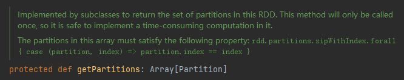
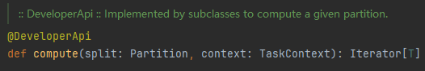
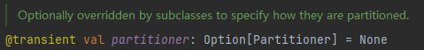
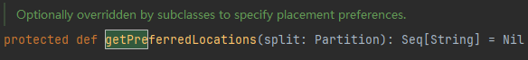
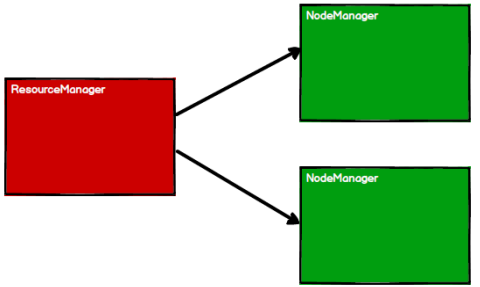
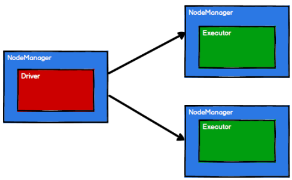
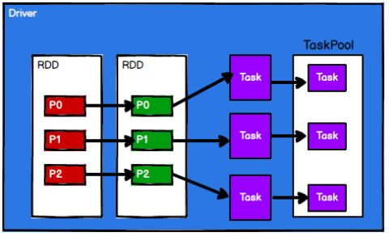
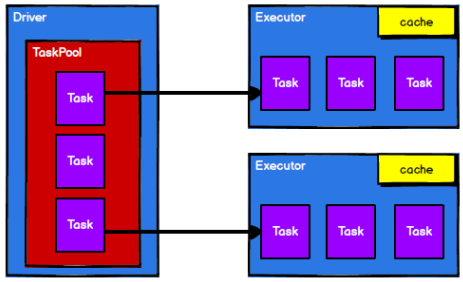

Spark 计算框架为了能够进行高并发和高吞吐的数据处理，封装了三大数据结构，用于处理不同的应用场景。三大

数据结构分别是： 

➢ RDD : 弹性分布式数据集 

➢ 累加器：分布式共享只写变量 

➢ 广播变量：分布式共享只读变量 

接下来我们一起看看这三大数据结构是如何在数据处理中使用的。

# RDD

## 1.1 什么是 RDD

RDD（Resilient Distributed Dataset）叫做弹性分布式数据集，是 Spark 中最基本的**数据处理模型**。代码中是一个抽象类，它代表一个弹性的、不可变、可分区、里面的元素可并行计算的集合。

➢ 弹性 

- 存储的弹性：内存与磁盘的自动切换； 
-  容错的弹性：数据丢失可以自动恢复； 
-  计算的弹性：计算出错重试机制； 
-  分片的弹性：可根据需要重新分片。 

➢ 分布式：数据存储在大数据集群不同节点上 

➢ 数据集：RDD 封装了计算逻辑，并不保存数据 

➢ 数据抽象：RDD 是一个抽象类，需要子类具体实现 

➢ 不可变：RDD 封装了计算逻辑，是不可以改变的，想要改变，只能产生新的 RDD，在新的 RDD 里面封装计算逻辑 

➢ 可分区、并行计算

## 1.2 核心属性

> Internally, each RDD is characterized by five main properties:
> - A list of partitions
> - A function for computing each split
> - A list of dependencies on other RDDs
> - Optionally, a Partitioner for key-value RDDs (e.g. to say that the RDD is hash-partitioned)
> Optionally, a list of preferred locations to compute each split on (e.g. block locations for an HDFS file)
> All of the scheduling and execution in Spark is done based on these methods, allowing each RDD to implement its own way of computing itself. Indeed, users can implement custom RDDs (e.g. for reading data from a new storage system) by overriding these functions. Please refer to the Spark paper  for more details on RDD internals.

➢ 分区列表 (A list of partitions)

RDD 数据结构中存在分区列表，用于执行任务时并行计算，是实现分布式计算的重要属性。



➢ 分区计算函数 

Spark 在计算时，是使用分区函数对每一个分区进行计算



➢ RDD 之间的依赖关系 

RDD 是计算模型的封装，当需求中需要将多个计算模型进行组合时，就需要将多个 RDD 建立依赖关系



➢ 首选位置（可选）

计算数据时，可以根据计算节点的状态选择不同的节点位置进行计算



## 1.3 执行原理

从计算的角度来讲，数据处理过程中需要计算资源（内存 & CPU）和计算模型（逻辑）。 执行时，需要将计算资源和计算模型进行协调和整合。

Spark 框架在执行时，先申请资源，然后将应用程序的数据处理逻辑分解成一个一个的计算任务。然后将任务发到已经分配资源的计算节点上, 按照指定的计算模型进行数据计算。最后得到计算结果。

RDD 是 Spark 框架中用于数据处理的核心模型，接下来我们看看，在 Yarn 环境中，RDD 的工作原理: 

1. 启动 Yarn 集群环境

    

2. Spark 通过申请资源创建调度节点和计算节点

    

3. Spark 框架根据需求将计算逻辑根据分区划分成不同的任务

    

    4. 度节点将任务根据计算节点状态发送到对应的计算节点进行计算

        

        从以上流程可以看出 RDD 在整个流程中主要用于将逻辑进行封装，并生成 Task 发送给 Executor 节点执行计算，接下来我们就一起看看 Spark 框架中 RDD 是具体是如何进行数据处理的。

## 1.4 基础编程

## 1.4.1 RDD 创建

在 Spark 中创建 RDD 的创建方式可以分为四种：

#### 1 从集合（内存）中创建 RDD

从集合中创建 RDD，Spark 主要提供了两个方法：parallelize 和 makeRDD

```
            val sparkConf = new SparkConf().setMaster("local[*]").setAppName("spark")
            val sparkContext = new SparkContext(sparkConf)
            val rdd1 = sparkContext.parallelize(
             List(1,2,3,4)
            )
            val rdd2 = sparkContext.makeRDD(
             List(1,2,3,4)
            )
            rdd1.collect().foreach(println)
            rdd2.collect().foreach(println)
            sparkContext.stop()
```
 从底层代码实现来讲，makeRDD 方法其实就是 parallelize 方法
```
            def makeRDD[T: ClassTag](
             seq: Seq[T],
             numSlices: Int = defaultParallelism): RDD[T] = withScope {
             parallelize(seq, numSlices)
            }
```

####  2.从外部存储（文件）创建 RDD

由外部存储系统的数据集创建 RDD 包括：本地的文件系统，所有 Hadoop 支持的数据集， 比如 HDFS、HBase 等。

```
val sparkConf = new SparkConf().setMaster("local[*]").setAppName("spark")
val sparkContext = new SparkContext(sparkConf)
val fileRDD: RDD[String] = sparkContext.textFile("input")
fileRDD.collect().foreach(println)
sparkContext.stop()

```

#### 3. 从其他 RDD 创建

主要是通过一个 RDD 运算完后，再产生新的 RDD。详情请参考后续章节

#### 4. 直接创建 RDD（new）

使用 new 的方式直接构造 RDD，一般由 Spark 框架自身使用。

### 1.4.2 RDD 并行度与分区

默认情况下，Spark 可以将一个作业切分多个任务后，发送给 Executor 节点并行计算，而能够并行计算的任务数量我们称之为并行度。这个数量可以在构建 RDD 时指定。记住，这里的**并行执行的任务数量**，并不是指的切分任务的数量，不要混淆了。

```
val sparkConf =new SparkConf().setMaster("local[*]").setAppName("spark")
val sparkContext = new SparkContext(sparkConf)
val dataRDD: RDD[Int] =
 sparkContext.makeRDD(
 List(1,2,3,4), 4)
val fileRDD: RDD[String] =
 sparkContext.textFile(
 "input",
 2)
fileRDD.collect().foreach(println)
sparkContext.stop()
```

读取内存数据时，数据可以按照并行度的设定进行数据的分区操作，数据分区规则的 Spark 核心源码如下：

```
def positions(length: Long, numSlices: Int): Iterator[(Int, Int)] = {
 (0 until numSlices).iterator.map { i =>
 val start = ((i * length) / numSlices).toInt
 val end = (((i + 1) * length) / numSlices).toInt
 (start, end)
 }
}
```

读取文件数据时，数据是按照 Hadoop 文件读取的规则进行切片分区，而切片规则和数 据读取的规则有些差异，具体 Spark 核心源码如下

```
public InputSplit[] getSplits(JobConf job, int numSplits)
 throws IOException {
 long totalSize = 0; // compute total size
 for (FileStatus file: files) { // check we have valid files
 if (file.isDirectory()) {
 throw new IOException("Not a file: "+ file.getPath());
 }
 totalSize += file.getLen();
 }
 long goalSize = totalSize / (numSplits == 0 ? 1 : numSplits);
 long minSize = Math.max(job.getLong(org.apache.hadoop.mapreduce.lib.input.
 FileInputFormat.SPLIT_MINSIZE, 1), minSplitSize);
 
 ...
 
 for (FileStatus file: files) {
 
 ...
 
 if (isSplitable(fs, path)) {
 long blockSize = file.getBlockSize();
 long splitSize = computeSplitSize(goalSize, minSize, blockSize);
 ...
 }
 protected long computeSplitSize(long goalSize, long minSize,
 long blockSize) {
 return Math.max(minSize, Math.min(goalSize, blockSize));
 }
```

### 1.4.3 RDD 转换算子

> 从一个已知的 RDD 中创建出来一个新的 RDD 例如: *map*就是一个*transformation*.

RDD 根据数据处理方式的不同将算子整体上分为 Value 类型、双 Value 类型和 Key-Value 类型

#### Value 类型

##### 1) map

➢ 函数签名 

`def map[U: ClassTag](f: T => U): RDD[U]`

➢ 函数说明

将处理的数据逐条进行映射转换，这里的转换可以是类型的转换，也可以是值的转换。

```
val dataRDD: RDD[Int] = sparkContext.makeRDD(List(1,2,3,4))
val dataRDD1: RDD[Int] = dataRDD.map(
 num => {
 	num * 2
 }
)
val dataRDD2: RDD[String] = dataRDD1.map(
 num => {
 	"" + num
 }
)
```

##### 2) mapPartitions

➢ 函数签名 

```
def mapPartitions[U: ClassTag](
 f: Iterator[T] => Iterator[U],
 preservesPartitioning: Boolean = false): RDD[U]
```

➢ 函数说明 

将待处理的数据**以分区为单位**发送到计算节点进行处理，这里的处理是指可以进行任意的处理，哪怕是过滤数据。

```
val dataRDD1: RDD[Int] = dataRDD.mapPartitions(
 datas => {
 	datas.filter(_==2)
 }
)
```

###### 思考一个问题：map 和 mapPartitions 的区别？

➢ 数据处理角度 

Map 算子是分区内一个数据一个数据的执行，类似于串行操作。而 mapPartitions 算子是以分区为单位进行批处理操作。 

➢ 功能的角度 

Map 算子主要目的将数据源中的数据进行转换和改变。但是不会减少或增多数据。 MapPartitions 算子需要传递一个迭代器，返回一个迭代器，没有要求的元素的个数保持不变， 所以可以增加或减少数据 

➢ 性能的角度 

Map 算子因为类似于串行操作，所以性能比较低，而是 mapPartitions 算子类似于批处理，所以性能较高。但是 mapPartitions 算子会长时间占用内存，那么这样会导致内存可能不够用，出现内存溢出的错误。所以在内存有限的情况下，不推荐使用。使用 map 操作。

##### 3) mapPartitionsWithIndex

➢ 函数签名

```
def mapPartitionsWithIndex[U: ClassTag](
 f: (Int, Iterator[T]) => Iterator[U],
 preservesPartitioning: Boolean = false): RDD[U]
```

➢ 函数说明 

将待处理的数据以分区为单位发送到计算节点进行处理，这里的处理是指可以进行任意的处理，哪怕是过滤数据，在处理时同时可以获取当前分区索引。

##### 4) flatMap

➢ 函数签名

```
def flatMap[U: ClassTag](f: T => TraversableOnce[U]): RDD[U]
```

➢ 函数说明 

将处理的数据进行扁平化后再进行映射处理，所以算子也称之为扁平映射

```
val dataRDD = sparkContext.makeRDD(List(
 List(1,2),List(3,4)
),1)
val dataRDD1 = dataRDD.flatMap(
 list => list
)
```

##### 5) glom

➢ 函数签名

```
def glom(): RDD[Array[T]]
```

➢ 函数说明

将同一个分区的数据直接转换为相同类型的内存数组进行处理，分区不变

```
val dataRDD = sparkContext.makeRDD(List(
 1,2,3,4
),1)
val dataRDD1:RDD[Array[Int]] = dataRDD.glom()
```

##### 6) groupBy

➢ 函数签名

```
def groupBy[K](f: T => K)(implicit kt: ClassTag[K]): RDD[(K, Iterable[T])]
```

➢ 函数说明 

将数据根据指定的规则进行分组, 分区默认不变，但是数据会被打乱重新组合，我们将这样的操作称之为 **shuffle**。极限情况下，数据可能被分在同一个分区中一个组的数据在一个分区中，但是**并不是说一个分区中只有一个组**

```
val dataRDD = sparkContext.makeRDD(List(1,2,3,4),1)
val dataRDD1 = dataRDD.groupBy(
 _%2
)
```

##### 7) filter

➢ 函数签名

```
def filter(f: T => Boolean): RDD[T]
```

➢ 函数说明 

将数据根据指定的规则进行筛选过滤，符合规则的数据保留，不符合规则的数据丢弃。 当数据进行筛选过滤后，分区不变，但是分区内的数据可能不均衡，生产环境下，可能会出现**数据倾斜**。

```
val dataRDD = sparkContext.makeRDD(List(
 1,2,3,4
),1)
val dataRDD1 = dataRDD.filter(_%2 == 0)
```

##### 8) sample

➢ 函数签名

```
def sample(
 withReplacement: Boolean,
 fraction: Double,
 seed: Long = Utils.random.nextLong): RDD[T]
```

➢ 函数说明

根据指定的规则从数据集中**抽取**数据

```
val dataRDD = sparkContext.makeRDD(List(
 1,2,3,4
),1)
// 抽取数据不放回（伯努利算法）
// 伯努利算法：又叫 0、1 分布。例如扔硬币，要么正面，要么反面。
// 具体实现：根据种子和随机算法算出一个数和第二个参数设置几率比较，小于第二个参数要，大于不要
// 第一个参数：抽取的数据是否放回，false：不放回
// 第二个参数：抽取的几率，范围在[0,1]之间,0：全不取；1：全取；
// 第三个参数：随机数种子
val dataRDD1 = dataRDD.sample(false, 0.5)
// 抽取数据放回（泊松算法）
// 第一个参数：抽取的数据是否放回，true：放回；false：不放回
// 第二个参数：重复数据的几率，范围大于等于 0.表示每一个元素被期望抽取到的次数
// 第三个参数：随机数种子
val dataRDD2 = dataRDD.sample(true, 2)
```

##### 9) distinct

➢ 函数签名

```
def distinct()(implicit ord: Ordering[T] = null): RDD[T]
def distinct(numPartitions: Int)(implicit ord: Ordering[T] = null): RDD[T]
```

➢ 函数说明 

将数据集中重复的数据去重

```
val dataRDD = sparkContext.makeRDD(List(
 1,2,3,4,1,2
),1)
val dataRDD1 = dataRDD.distinct()
val dataRDD2 = dataRDD.distinct(2)
```

##### 10) coalesce

➢ 函数签名

```
def coalesce(numPartitions: Int, shuffle: Boolean = false,
 partitionCoalescer: Option[PartitionCoalescer] = Option.empty)
 (implicit ord: Ordering[T] = null)
 : RDD[T]
```

➢ 函数说明

根据数据量**缩减分区**，用于大数据集过滤后，提高小数据集的执行效率。当 spark 程序中，存在过多的小任务的时候，可以通过 coalesce 方法，收缩合并分区，减少分区的个数，减小任务调度成本

```
val dataRDD = sparkContext.makeRDD(List(
 1,2,3,4,1,2
),6)
val dataRDD1 = dataRDD.coalesce(2)
```

##### 11) repartition

➢ 函数签名

```
def repartition(numPartitions: Int)(implicit ord: Ordering[T] = null): RDD[T]
```

➢ 函数说明

该操作内部其实执行的是 coalesce 操作，参数 shuffle 的默认值为 true。无论是将分区数多的 RDD 转换为分区数少的 RDD，还是将分区数少的 RDD 转换为分区数多的 RDD，repartition 操作都可以完成，因为无论如何都会经 shuffle 过程。

```
val dataRDD = sparkContext.makeRDD(List(
 1,2,3,4,1,2
),2)
val dataRDD1 = dataRDD.repartition(4)
```

> coalesce 和 repartition 区别？
>
> TODO

##### 12) sortBy

➢ 函数签名

```
def sortBy[K](
 f: (T) => K,
 ascending: Boolean = true,
 numPartitions: Int = this.partitions.length)
 (implicit ord: Ordering[K], ctag: ClassTag[K]): RDD[T
```

➢ 函数说明 

该操作用于排序数据。在排序之前，可以将数据通过 f 函数进行处理，之后按照 f 函数处理 的结果进行排序，默认为升序排列。排序后新产生的 RDD 的分区数与原 RDD 的分区数一致。中间存在 shuffle 的过程

```
val dataRDD = sparkContext.makeRDD(List(
 1,2,3,4,1,2
),2)
val dataRDD1 = dataRDD.sortBy(num=>num, false, 4)
```

#### 双 Value 类型

##### 13) intersection

➢ 函数签名 

```
def intersection(other: RDD[T]): RDD[T]
```

➢ 函数说明

对源 RDD 和参数 RDD 求交集后返回一个新的 RDD

```
val dataRDD1 = sparkContext.makeRDD(List(1,2,3,4))
val dataRDD2 = sparkContext.makeRDD(List(3,4,5,6))
val dataRDD = dataRDD1.intersection(dataRDD2)
```

##### 14) union

➢ 函数签名 

```def union(other: RDD[T]): RDD[T]```

 ➢ 函数说明 

对源 RDD 和参数 RDD 求并集后返回一个新的 RDD

```
val dataRDD1 = sparkContext.makeRDD(List(1,2,3,4))
val dataRDD2 = sparkContext.makeRDD(List(3,4,5,6))
val dataRDD = dataRDD1.union(dataRDD2)
```

##### 15) subtract 

➢ 函数签名 

```def subtract(other: RDD[T]): RDD[T]``` 

➢ 函数说明 

以一个 RDD 元素为主，去除两个 RDD 中重复元素，将其他元素保留下来。求差集

```
val dataRDD1 = sparkContext.makeRDD(List(1,2,3,4))
val dataRDD2 = sparkContext.makeRDD(List(3,4,5,6))
val dataRDD = dataRDD1.subtract(dataRDD2)
```

##### 16) zip 

➢ 函数签名 

```def zip[U: ClassTag](other: RDD[U]): RDD[(T, U)]``` 

➢ 函数说明 

将两个 RDD 中的元素，以键值对的形式进行合并。其中，键值对中的 Key 为第 1 个 RDD 中的元素，Value 为第 2 个 RDD 中的相同位置的元素。

```
val dataRDD1 = sparkContext.makeRDD(List(1,2,3,4))
val dataRDD2 = sparkContext.makeRDD(List(3,4,5,6))
val dataRDD = dataRDD1.zip(dataRDD2)
dataRDD.foreach(println)
```
- 输出:
```
(1,3)
(2,4)
(3,5)
(4,6)
```


#### Key - Value 类型

##### 17) partitionBy 

➢ 函数签名 

```def partitionBy(partitioner: Partitioner): RDD[(K, V)]``` 

➢ 函数说明 

将数据按照指定 Partitioner 重新进行分区。Spark 默认的分区器是 HashPartitioner

```
val rdd: RDD[(Int, String)] = sc.makeRDD(Array((1,"aaa"),(2,"bbb"),(3,"ccc")),3)
import org.apache.spark.HashPartitioner
val rdd2: RDD[(Int, String)] = rdd.partitionBy(new HashPartitioner(2))
```

##### 18) reduceByKey 

➢ 函数签名 

```
def reduceByKey(func: (V, V) => V): RDD[(K, V)] 
def reduceByKey(func: (V, V) => V, numPartitions: Int): RDD[(K, V)]
```

➢ 函数说明 

可以将数据按照相同的 Key 对 Value 进行聚合

```
val dataRDD1 = sparkContext.makeRDD(List(("a",1),("b",2),("c",3)))
val dataRDD2 = dataRDD1.reduceByKey(_+_)
val dataRDD3 = dataRDD1.reduceByKey(_+_, 2)
```

##### 19) groupByKey

➢ 函数签名

```
def groupByKey(): RDD[(K, Iterable[V])]
def groupByKey(numPartitions: Int): RDD[(K, Iterable[V])]
def groupByKey(partitioner: Partitioner): RDD[(K, Iterable[V])]
```

➢ 函数说明 

将数据源的数据根据 key 对 value 进行分组

```
val dataRDD1 =
 sparkContext.makeRDD(List(("a",1),("b",2),("c",3)))
val dataRDD2 = dataRDD1.groupByKey()
val dataRDD3 = dataRDD1.groupByKey(2)
val dataRDD4 = dataRDD1.groupByKey(new HashPartitioner(2))
```

##### reduceByKey 和 groupByKey 的区别？

**从 shuffle 的角度**：reduceByKey 和 groupByKey 都存在 shuffle 的操作，但是 reduceByKey 可以在 shuffle 前对分区内相同 key 的数据进行**预聚合（combine）** 功能，这样会减少落盘的数据量，而 g**roupByKey 只是进行分组**，不存在数据量减少的问题，reduceByKey 性能比较高。 

**从功能的角度**：reduceByKey 其实包含分组和聚合的功能。GroupByKey 只能分组，不能聚合，所以在分组聚合的场合下，推荐使用reduceByKey，如果仅仅是分组而不需要聚合。那 么还是只能使用 groupByKey

##### 20) aggregateByKey 

➢ 函数签名

```
def aggregateByKey[U: ClassTag](zeroValue: U)(seqOp: (U, V) => U,
 combOp: (U, U) => U): RDD[(K, U)]
```

➢ 函数说明 

将数据根据**不同的规则**进行分区内计算和分区间计算

```
val dataRDD1 =
 sparkContext.makeRDD(List(("a",1),("b",2),("c",3)))
val dataRDD2 =
 dataRDD1.aggregateByKey(0)(_+_,_+_)
```

- 取出每个分区内相同 key 的最大值然后分区间相加

    > // TODO : 取出每个分区内相同 key 的最大值然后分区间相加
    >  aggregateByKey 算子是函数柯里化，存在两个参数列表
    >
    > 1. 第一个参数列表中的参数表示初始值
    > 2. 第二个参数列表中含有两个参数
    >    2.1 第一个参数表示分区内的计算规则
    >    2.2 第二个参数表示分区间的计算规则

    ```
    
    val rdd =
     sc.makeRDD(List(
     ("a",1),("a",2),("c",3),
     ("b",4),("c",5),("c",6)
     ),2)
    // 0:("a",1),("a",2),("c",3) => (a,10)(c,10) => (a,10)(b,10)(c,20)
    // 1:("b",4),("c",5),("c",6) => (b,10)(c,10)
    val resultRDD =
     rdd.aggregateByKey(10)(
     (x, y) => math.max(x,y),
     (x, y) => x + y
     )
    resultRDD.collect().foreach(println)
    ```

##### 21) foldByKey

➢ 函数签名 
    
```
def foldByKey(zeroValue: V)(func: (V, V) => V): RDD[(K, V)]
```

➢ 函数说明
    
当分区内计算规则和分区间计算规则相同时，aggregateByKey 就可以简化为 foldByKey
    
```
val dataRDD1 = sparkContext.makeRDD(List(("a",1),("b",2),("c",3)))
val dataRDD2 = dataRDD1.foldByKey(0)(_+_)
```

##### 22) combineByKey

➢ 函数签名
```
def combineByKey[C](
	createCombiner: V => C,
    mergeValue: (C, V) => C,
    mergeCombiners: (C, C) => C): RDD[(K, C)]
```

> ```text
> combineByKey方法需要三个参数：
> 第一个参数表示：将相同key的第一个数据进行结构转换，实现操作
> 第二个参数：分区内的计算规则
> 第三个参数：分区间的计算规则
> ```

➢ 函数说明
最通用的对 key-value 型 rdd 进行聚集操作的聚集函数（aggregation function）。类似于 aggregate()，combineByKey()允许用户返回值的类型与输入不一致。    

小练习：将数据 List(("a", 88), ("b", 95), ("a", 91), ("b", 93), ("a", 95), ("b", 98))求每个 key 的平 均值

```
val list: List[(String, Int)] = List(("a", 88), ("b", 95), ("a", 91), ("b", 93), ("a", 95), ("b", 98))
val input: RDD[(String, Int)] = sc.makeRDD(list, 2)
val combineRdd: RDD[(String, (Int, Int))] = input.combineByKey(
 (_, 1),
 (acc: (Int, Int), v) => (acc._1 + v, acc._2 + 1),
 (acc1: (Int, Int), acc2: (Int, Int)) => (acc1._1 + acc2._1, acc1._2 + acc2._2)
)
```

##### 思考一个问题：reduceByKey、foldByKey、aggregateByKey、combineByKey 的区别？

- reduceByKey: 相同 key 的第一个数据不进行任何计算，分区内和分区间计算规则相同 
- FoldByKey: 相同 key 的第一个数据和初始值进行分区内计算，分区内和分区间计算规则相同
- AggregateByKey：相同 key 的第一个数据和初始值进行分区内计算，分区内和分区间计算规 则可以不相同
- CombineByKey:当计算时，发现数据结构不满足要求时，可以让第一个数据转换结构。分区内和分区间计算规则不相同。

##### 23) sortByKey 

➢ 函数签名

```
def sortByKey(ascending: Boolean = true, numPartitions: Int = self.partitions.length)
 : RDD[(K, V)]
```

➢ 函数说明 

在一个(K,V)的 RDD 上调用，K 必须实现 Ordered 接口(特质)，返回一个按照 key 进行排序的

```
val dataRDD1 = sparkContext.makeRDD(List(("a",1),("b",2),("c",3)))
val sortRDD1: RDD[(String, Int)] = dataRDD1.sortByKey(true)
val sortRDD1: RDD[(String, Int)] = dataRDD1.sortByKey(false)
```

##### 24) join 

➢ 函数签名

```
def join[W](other: RDD[(K, W)]): RDD[(K, (V, W))]
```

➢ 函数说明

在类型为(K,V)和(K,W)的 RDD 上调用，返回一个相同 key 对应的所有元素连接在一起的 (K,(V,W))的 RDD

```
val rdd: RDD[(Int, String)] = sc.makeRDD(Array((1, "a"), (2, "b"), (3, "c")))
val rdd1: RDD[(Int, Int)] = sc.makeRDD(Array((1, 4), (2, 5), (3, 6)))
rdd.join(rdd1).collect().foreach(println)
//输出
(1,(a,4))
(3,(c,6))
(2,(b,5))
```

##### 25) leftOuterJoin

➢ 函数签名

```
def leftOuterJoin[W](other: RDD[(K, W)]): RDD[(K, (V, Option[W]))]
```

➢ 函数说明 

类似于 SQL 语句的左外连接

```
val dataRDD1 = sparkContext.makeRDD(List(("a",1),("b",2),("c",3)))
val dataRDD2 = sparkContext.makeRDD(List(("a",1),("b",2),("c",3)))
val rdd: RDD[(String, (Int, Option[Int]))] = dataRDD1.leftOuterJoin(dataRDD2)
```

##### 26) cogroup 

➢ 函数签名

```
def cogroup[W](other: RDD[(K, W)]): RDD[(K, (Iterable[V], Iterable[W]))]
```

➢ 函数说明

在类型为(K,V)和(K,W)的 RDD 上调用，返回一个(K,(Iterable,Iterable))类型的 RDD

```
val list01 = List((1, "a"),(1, "a"), (2, "b"), (3, "e"))
val list02 = List((1, "A"), (2, "B"), (3, "E"))
val list03 = List((1, "[ab]"), (2, "[bB]"), (3, "eE"),(3, "eE"))
sc.parallelize(list01).cogroup(sc.parallelize(list02),sc.parallelize(list03)).foreach(println)

// 输出： 同一个 RDD 中的元素先按照 key 进行分组，然后再对不同 RDD 中的元素按照 key 进行分组
(1,(CompactBuffer(a, a),CompactBuffer(A),CompactBuffer([ab])))
(3,(CompactBuffer(e),CompactBuffer(E),CompactBuffer(eE, eE)))
(2,(CompactBuffer(b),CompactBuffer(B),CompactBuffer([bB])))
```

##### 27) cartesian

计算笛卡尔积：

```
val list1 = List("A", "B", "C")
val list2 = List(1, 2, 3)
sc.parallelize(list1).cartesian(sc.parallelize(list2)).foreach(println)

//输出笛卡尔积
(A,1)
(A,2)
(A,3)
(B,1)
(B,2)
(B,3)
(C,1)
(C,2)
(C,3)
```

### 1.4.4 RDD 行动算子

> 触发任务的调度和作业的执行，在数据集上计算结束之后, 给驱动程序返回一个值. 例如: *reduce*就是一个*action*.

##### 1) reduce

➢ 函数签名

```
def reduce(f: (T, T) => T): T
```

➢ 函数说明 

聚集 RDD 中的所有元素，先聚合分区内数据，再聚合分区间数据

```
val rdd: RDD[Int] = sc.makeRDD(List(1,2,3,4))
// 聚合数据
val reduceResult: Int = rdd.reduce(_+_)
```

##### 2) collect 

➢ 函数签名

```
def collect(): Array[T]
```

➢ 函数说明 

**在驱动程序中**，以数组 Array 的形式返回数据集的所有元素

```
val rdd: RDD[Int] = sc.makeRDD(List(1,2,3,4))
// 收集数据到 Driver
rdd.collect().foreach(println)
```

##### 3) count

➢ 函数签名

```
def count(): Long
```

➢ 函数说明

返回 RDD 中元素的个数

```
val rdd: RDD[Int] = sc.makeRDD(List(1,2,3,4))
// 返回 RDD 中元素的个数
val countResult: Long = rdd.count()
```

##### 4) first

➢ 函数签名 

```
def first(): T
```

➢ 函数说明

返回 RDD 中的第一个元素

```
val rdd: RDD[Int] = sc.makeRDD(List(1,2,3,4))
// 返回 RDD 中元素的个数
val firstResult: Int = rdd.first()
println(firstResult)
```

##### 5) take 

➢ 函数签名

```
def take(num: Int): Array[T]
```

➢ 函数说明

返回一个由 RDD 的前 n 个元素组成的数组

```
val rdd: RDD[Int] = sc.makeRDD(List(1,2,3,4))
// 返回 RDD 中元素的个数
val takeResult: Array[Int] = rdd.take(2)
println(takeResult.mkString(","))
```

##### 6) takeOrdered

➢ 函数签名

```
def takeOrdered(num: Int)(implicit ord: Ordering[T]): Array[T]
```

➢ 函数说明

返回该 RDD 排序后的前 n 个元素组成的数组

```
val rdd: RDD[Int] = sc.makeRDD(List(1,3,2,4))
// 返回 RDD 中元素的个数
val result: Array[Int] = rdd.takeOrdered(2)
```

##### 7) aggregate 

➢ 函数签名

```
def aggregate[U: ClassTag](zeroValue: U)(seqOp: (U, T) => U, combOp: (U, U) => U): U
```

➢ 函数说明 

分区的数据通过**初始值**和分区内的数据进行聚合，然后再和**初始值**进行分区间的数据聚合

```
val rdd: RDD[Int] = sc.makeRDD(List(1, 2, 3, 4), 8)
// 将该 RDD 所有元素相加得到结果
//val result: Int = rdd.aggregate(0)(_ + _, _ + _)
val result: Int = rdd.aggregate(10)(_ + _, _ + _)
```

##### 8) fold

➢ 函数签名

```
def fold(zeroValue: T)(op: (T, T) => T): T
```

➢ 函数说明

折叠操作，aggregate 的简化版操作

```
val rdd: RDD[Int] = sc.makeRDD(List(1, 2, 3, 4))
val foldResult: Int = rdd.fold(0)(_+_)
```

##### 9) countByKey

➢ 函数签名

```
def countByKey(): Map[K, Long]
```

➢ 函数说明

统计每种 key 的个数

```
val rdd: RDD[(Int, String)] = sc.makeRDD(List((1, "a"), (1, "a"), (1, "a"), (2, 
"b"), (3, "c"), (3, "c")))
// 统计每种 key 的个数
val result: collection.Map[Int, Long] = rdd.countByKey()
```

##### 10) save 相关算子

➢ 函数签名

```
def saveAsTextFile(path: String): Unit
def saveAsObjectFile(path: String): Unit
def saveAsSequenceFile(
 path: String,
 codec: Option[Class[_ <: CompressionCodec]] = None): Unit
```

➢ 函数说明

将数据保存到不同格式的文件中

```
// 保存成 Text 文件
rdd.saveAsTextFile("output")
// 序列化成对象保存到文件
rdd.saveAsObjectFile("output1")
// 保存成 Sequencefile 文件
rdd.map((_,1)).saveAsSequenceFile("output2")
```

##### 11) foreach

➢ 函数签名

```
def foreach(f: T => Unit): Unit = withScope {
 val cleanF = sc.clean(f)
 sc.runJob(this, (iter: Iterator[T]) => iter.foreach(cleanF))
}
```

➢ 函数说明

**分布式遍历** RDD 中的每一个元素，调用指定函数

分布式打印

```
val rdd: RDD[Int] = sc.makeRDD(List(1,2,3,4))
// 收集后打印
rdd.map(num=>num).collect().foreach(println)
println("****************")
// 分布式打印
rdd.foreach(println)
```


##  参考资料

[RDD Programming Guide](https://spark.apache.org/docs/latest/rdd-programming-guide.html#rdd-programming-guide)
