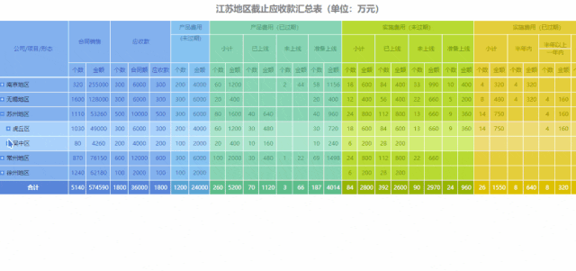
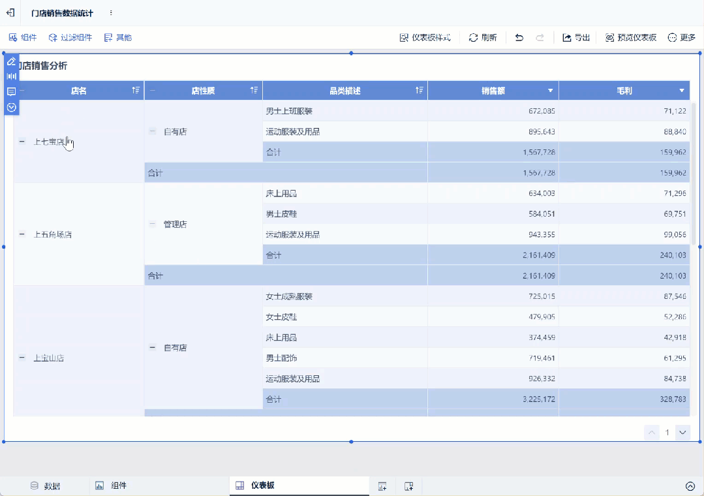
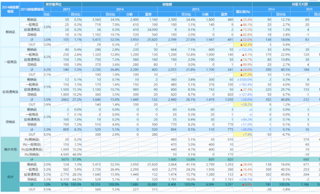
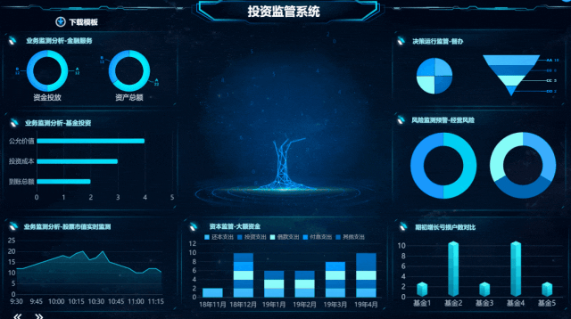
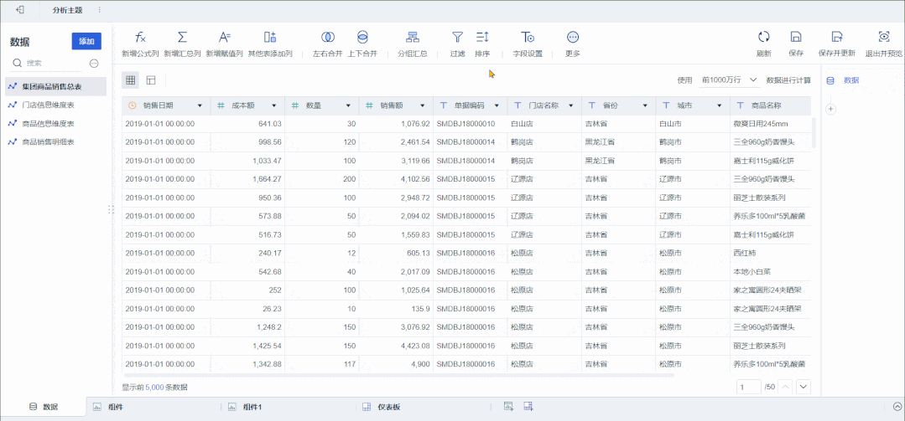
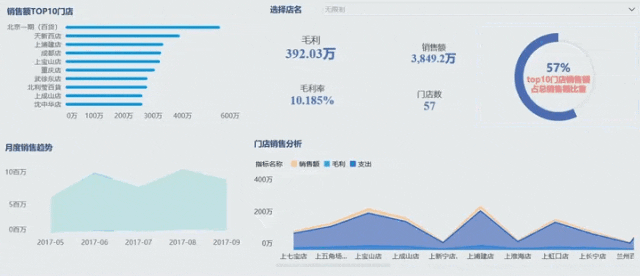
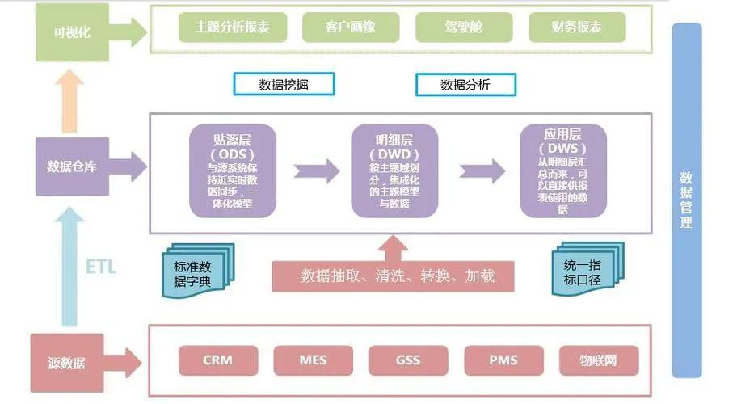

为什么要来解释这个看似并不新颖的问题？

大概是因为还是有读者在后台私信问：**BI 商业智能和报表工具不是同一个东西吗？有啥区别？**

其实这是相当错误的理解，但有这种错误观念也不怪大家，因为这两者都是大数据时代下的数据工具，两者的功能确实也有所重合，但两者在本质上还是存在较大差异。

因此本篇文章，我会尽可能用通俗的语言和例子，帮助大家一次明白：**BI 和报表区别究竟在哪？对企业来说用处又有何不同？**并为大家解答：**企业在信息化 / 数字化建设过程中，应该如何正确规划报表与 BI 建设?**

# **1** **入门：报表和 BI 的区别在哪？**

> **先给结论：最主要的区别在于，报表工具偏向数据展示，BI 工具偏向数据分析。**

## <mark>**报表工具：侧重做复杂但固定的数据展示。**</mark>

解决 “我知道我想要的报表样式，知道数据从哪里来，数据需求不常变化，只要展示出来就好” 的问题，偏向“固定数据的展示阶段，数据交互性较低”。

## <mark>**BI 工具：侧重让不懂技术的业务人员做数据分析，让其自行完成简单报表 / 数据仪表盘的制作。**</mark>

解决业务（运营、财务人员等）和 IT 之间的 “报表需求拉扯”，同时帮业务解决“我有一堆业务数据，我知道这数据有用，可我不知道怎么用，但 BI 可以帮助我去生成一些展示及指标体系，给到我启发” 的问题，偏向“数据需求变化多且快，想带着问题去探索分析数据的阶段，数据交互性较高”。

# **2** **进阶：对于企业来说，两者用处不同在哪？**

> **以我们的 FineReport 和 FineBI 为例，前者是报表平台工具，后者是 BI 工具。**

**对企业来说，可以用 FR 这类报表工具，搭建企业级的数据可视化平台，常用的场景是业务报表制作：**比如企业固定的月报、季报和关键数据指标的统计、展示。此类工具主要面向 IT 或者企业专门设置的报表开发人员，使用者需要一定的数据库知识。在报表工具的帮助下，IT 人员能快速响应企业固定报表制作的需求。

**主要功能有：数据录入 (填报)、数据查询和数据展示 (报表、可视化大屏)，还有报表权限管理。**

- 复杂报表：

- 可视化大屏：

**回到 BI，对企业来说，则可以用 FineBI 这类 BI 工具，解决业务人员多且杂的数据分析需求，并借用 BI 的建立来梳理企业的数据资产。**相比报表，BI 的侧重点在于基于问题导向的分析（销售数据、人员流失数据分析等），快速搭建各种业务模型（杜邦分析法、KANO 模型、RFM 模型等）。优势在于操作简单、数据处理量大，能够更直观地发现业务运营过程中存在的问题，以更好地帮助业务人员调整工作策略。

**主要功能有：简单报表、仪表盘、分析报告制作和自助数据分析。**

- 自助数据分析：

仪表盘：

## **举个例子：**

**如果用报表工具查看数据，**那么领导可以明确知道当月总销售额、各个销售员的业绩和哪个产品卖得最好等，主要是通过统计已知数据，了解总体和细节。

**如果用 BI 查看数据，**领导不光可以知道销售额、销售员业绩，还可以基于这个报表进行更自由的探索分析，比如分地区、分产品分门店查看，还比如使用不同的图表（折线图、饼图、柱状图等）来获取不同视角下的结论，甚至还能对未来做出预测，比如产品 A 销量可观，预计 10 号之后库存枯竭，请及时备货等。

**对于企业来说，BI 能提供更深度的分析和更智能的决策辅助，这是和报表的核心区别。**

# **3** **深挖：企业应该如何正确建设报表与 BI 平台？**

在明白报表和 BI 的区别和用处后，企业又该如何正确建设报表与 BI 平台，充分发挥报表和 BI 的作用呢？

我们总结了三个阶段，帮助企业明确当前数据现状、抓住主要矛盾、明确具体 to do。

## 阶段 1：信息化建设启动期，用业务系统让数据积累下来

企业在信息化建设启动期，先要选择适合企业应用的各类业务系统，例如 OA、ERP、MES 等，将企业日常手工事务性繁重的工作转到业务系统工作，把数据系统化地储存起来，实现 “数据资产的原始积累”。

## 阶段 2：信息化建设整合期，用报表平台整合打通数据

这个期间，大量业务系统已经上线，各业务系统数据已经得到一定程度的积累，主要矛盾转变为 “数据无法整合打通，形成数据孤岛”。

**此时，建立一个能打通各业务系统的报表平台逐渐成为一个 “硬性需求”。**

企业在此阶段需要做好三方面事情：一是把核心业务系统数据逐步入仓，做整合；二是加大对数据治理的重视；三是基于 1-2 个跨流程和跨业务的场景，满足中高层领导的 “看表需求”，打响 “成功故事”，得到领导支持，方便后续信息化建设。

## 阶段 3：信息化建设升级期，用 BI 工具把数据利用起来

到了第三阶段，企业数据平台也日渐成熟，主要矛盾转变为 “提升数据分析时效性，满足业务多且杂的数据分析需求，深挖数据价值。”

企业此时就可以上 BI，开始让业务人员去学着做数据分析，因为只有业务人员最懂业务，最能让已有的业务数据发挥价值。这时候也是 BI 开始发挥作用的阶段，即从管理层层面为企业提供管理依据、提升业务分析效率，从 IT 层面整合企业数据资产，同时给予业务人员更多分析数据的机会。

# **4** **总结一下**

本文主要讲明了 BI 与报表的区别，并明确了企业在信息化 / 数字化建设过程中的三个阶段。

但值得一提的是，不必纠结于概念，因为无论是报表还是 BI 工具，都是为企业和人服务的，选择适合企业所处数据阶段的工具就是最好的。

报表工具适合正处于**信息化建设阶段**的企业，侧重于**复杂固定数据的展示**，使用人员是有 SQL 基础的 IT 人员，有一定学习成本。因此，**做数据展现，日常运作的企业报表系统建议用 FineReport 这类报表工具**。

BI 工具是大数据分析工具，适合处于**信息化建设后期，数字化转型初期**的企业，侧重于**数据的探索分析过程**，使用人员是企业内的业务人员 / 管理层，学习成本低，易上手。**如果做长期战略决策，侧重数据探索分析建议用 FineBI 这类 BI 工具**。
