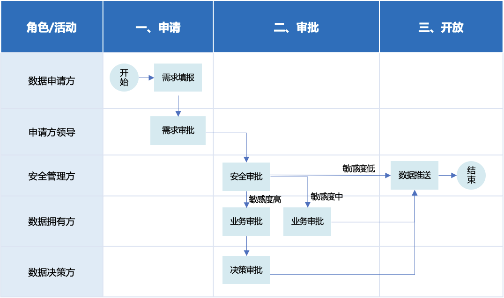
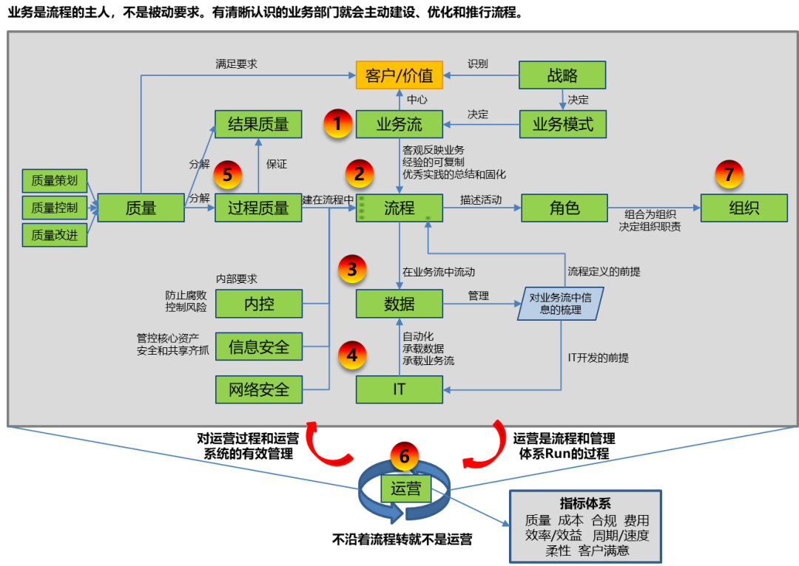
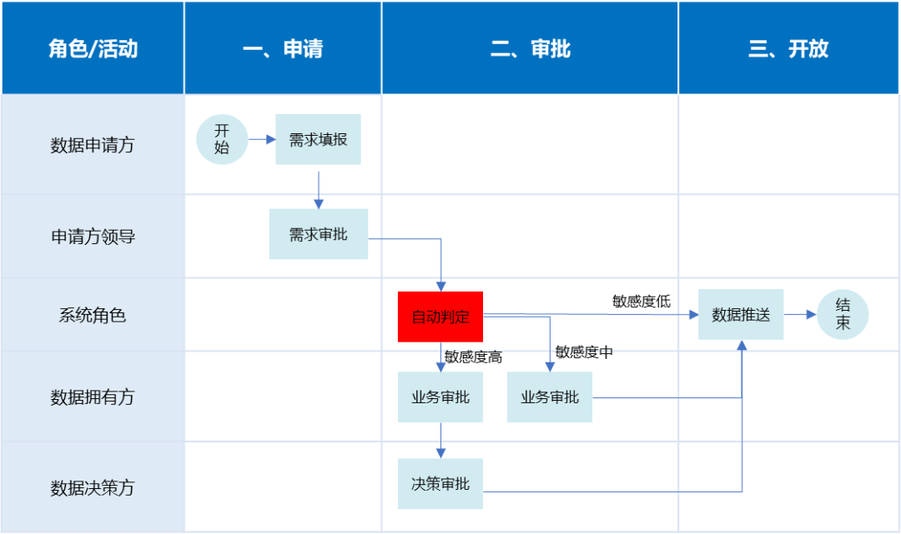

华为董事陶景文说：“**任何不涉及流程重构的数字化转型，都是在装样子**”，这句话有点不明觉厉，今天就来聊聊流程数字化的内涵，具体分为五个部分，希望于大家有所启示。

- **流程的概念和价值**

- **流程分层框架体系**

- **流程与周边的关系**

- **流程是数字化核心**

- **流程的数字化实现**

# **1、流程的概念和价值**

企业为实现价值创造，从输入客户要求开始到交付产品及服务给客户获得客户满意并实现企业自身价值的 E2E（端对端）业务过程就是业务流程。业务流天然存在，适配业务流的流程会带来价值提升，是优秀作业实践的总结和固化。

任正非在《在理性与平实中存活》一文中提出，企业管理的目的，**建立流程型组织**。

#### **那么，流程的具体定义是什么？**

流程的定义是：一套完整的端到端为客户创造价值的活动连接、集合。

在这个定义里，我们如果把它进行进一步拆解的话，其中包括了 6 个基本要素。

**第一是客户。**我们每一个流程的目标都是客户，流程不是为管理服务的，是为了让客户赚钱。

**第二是价值。**这个流程走完有没有让客户赚到钱，有没有让客户满意。

**第三个输入，第四个输出**。流程一定有输入，是有信号进去的，然后走完就有结果出来。比如说产品开发流程，输入是啥？是客户需求、市场需求，那输出又是什么？是产品，是客户价值。

**第五就是活动**。动作在这里不是名词，是动词。就是要做出正确的行为，达成正确的结果。而这个行为的约束就是流程的活动，所以流程中活动一、活动二、活动三，本质上就是行为一、行为二、行为三，而且你必须做出正确的行为，才能让流程产出正确，必须所有人共同训练有素地做出正确的行为。

最后是，**活动和活动之间有作用**。一个客户需求进来如何让组织动起来，它一定是一种相互作用。这个跟分子作用、原子作用、光学作用一样的原理。

这个定义，它颠覆了 100 年来科学管理的思想——泰勒的合理分工、建立流水线。具体体现在：

**第一、** 是一套完整的端到端的流程。**完整的端到端，指的是从客户需求来，到客户需求去，而职能型的组织往往把流程割裂开来**，因为我们建立了部门，部门职责刚性的边界让端到端的流程被打断了，就好像一条高速公路，原本深圳到北京有条高速公路，但是高速公路经历了五个省，每个省都有高速公路的部门，所以这一段下车收费，到了另外一个省，又要收一次钱。因为高速公路是分地域管理的。

**第二、** 为客户创造价值。这句话怎么理解？其实就让人客户成功，让客户赚钱。1954 年，管理学大师德鲁克写本书叫《管理的实践》，他在那本书中讲了企业的使命，企业的使命是创造客户。他说客户其实不知道需求，一个企业创造了需求，创造了产品，就创造了客户。

**第三、** 在企业管理现实中，基于制度的管理总是看起来要复杂，而结果却不精确，流程作为一种规范(**规范化，标准化**)，定义了人们做事情的路径和方法，其可以有严谨的结构，可以有标准的颗粒度，可以有规范的语言；更重要的是可以有非常精确的内容，确保不会有缺失、重叠、交错和冲突，从而使结果更为稳定，这就使得管理的精细化成为一种可能。

我们经常说的一句话就是，流程要让**不同的人做同样的事情有相同的结果**，这拉高了一个企业经营活动的底线，让企业不会由于人员的变动而影响到业务的开展，这正是企业家们处心积虑要达到的一种境界，因为这样就意味着企业运营成本和质量的可控，推广流程的目的是让不同团队执行流程时获得成功的可复制性。

# **2、流程分层框架体系**

要管好流程，首先要对企业的分层分类进行管理，比如华为把流程管理分为运营流程（包括战略管理、集成产品开发、客户关系管理、集成供应链）和管理支持流程（各职能部门的流程）。

流程的层次和管理层次相关，不同的流程层次对应了不同的管理层次的工作，比如华为将主流程用于中高层的业务决策和端到端跨职能部门的业务管理，二级子流程用于智能领域管理，确保职能域的交付能满足主流程的需要，操作级流程用于指导基层活动。

参考华为的流程框架，可以将流程从上到下分为六个级别：

- **level 1 流程分类；**

- **level 2 流程组；**

- **level 3 流程；**

- **level 4 子流程；**

- **level 5 活动；**

- **level 6 任务。**

level 1 流程分类和 level 2 流程组用于流程管理，回答 why to do 的问题，**支撑公司战略和业务目标实现**，体现公司业务模式并覆盖公司全部的业务。

level 3 流程和 level 4 子流程则是用于落实方针政策和管控要求，回答 what to do 的问题，**聚焦战略执行**，体现创造客户价值的主要业务流以及为实现主业务流高效和低成本运作所需要的支撑业务。

level 5 活动和 level 6 任务用于将**流程落实到人**，使之可执行，回答 how to do 问题，完成流程目标所需要的具体活动及任务，体现业务的多样化和灵活性。活动一般指某个角色利用特定的工具和资源，按确定的要求和标准，将明确的输入转换为明确的输出的过程。

这里以某公司的流程分级框架为例说明：

（1）企业的流程可以分为 8 大类别，分别是综合办公类，市场管理类、政企管理类、网络服务类、IT 支撑类、工程建设类、财务类、人力资源类，这些处于 level1。

（2）在 level1 下包括 41 个流程组，比如 IT 支撑类包括了需求管理、数据管理等六个流程组，这些流程组处于 level2。

（3）数据管理组下面包括了数据开放流程等跨部门的端到端业务流程，这些流程处于 level3，数据开放流程分为申请、汇聚、上架和订阅四个阶段。

（4）数据开放流程这四个阶段又对应了四个子流程，分别为申请流程、汇聚流程、上架流程和订阅流程，这些子流程处于 level4。

（5）各个子流程涉及具体的活动，这些活动处于 level5。

下面示例了订阅子流程的流程简图，标识出了流程中的所有角色，包括**数据申请方**、**安全管理方**、**数据拥有方**、**数据决策方**等，同时识别出每个角色的关键活动，分为**申请**，**审批**和**开放**三个阶段，共涉及**需求填报**、**需求审批**、**安全审批**、**业务审批**、**决策审批**、**数据推送**等业务活动，还可以看到，订阅子流程基于数据敏感程度区分了高、中、低三种开放情况。

（6）针对 “**数据推送**” 这个业务活动，其实包含了很多任务，这些任务处于 level6，比如**调度任务**、**数据交换**、**用户通知**等，针对每个任务其实还能细化为具体步骤。

流程反映了企业的业务本质，只有把企业的流程体系梳理出来，才能明确数字化的流程对象到底是指什么，只有把流程层层拆分至具体任务，才能真正的去做具体优化工作。

# **3、流程与周边的关系**

理解了流程本身还不够，我们还要理解流程是怎么运作的，华为徐直军有一篇文章**《华为徐直军：做流程的主人而不是奴隶》**，提到了**流程与业务、数据、IT、质量、运营、组织的关系**，下图示例了相互关系图：

**（1）业务流与流程的关系**

企业为实现价值创造，从输入客户要求开始到交付产品及服务给客户获得客户满意并实现企业自身价值的 E2E（端对端）业务过程就是业务流。业务流天然存在，适配业务流的流程会带来价值提升，是优秀作业实践的总结和固化，推广流程的目的是让不同团队执行流程时获得成功的可复制性。

**（2）数据与流程的关系**

在流程中流动的是信息，信息的载体即数据，数据是业务流各环节的输出，这些输出只有满足下游的要求，流程才能顺畅流动起来，否则价值创造过程就会受阻或停滞。但如果各环节的数据架构和标准没有预先、良好的设计，那么流程各环节的数据就没法有效集成，这就是数据治理对企业异常重要的原因，华为的数据之道的目的就是提升流程效率。

**（3）IT 与流程的关系**

IT 承载的是流程以及数据，IT 支撑每一个作业以及作业输出的数据，通过 IT 实现数据之间的集成，流程的自动化，而不要依靠人来输入、转换数据，因为人是会犯错误的，而 IT 系统不会，而且效率比人高。当然不是所有流程都要借助 IT，只有用的人多，有效率问题才用 IT。

**（4）质量与流程的关系**

质量要求必须跟随业务流构筑在流程中。为了让每个环节的交付能够刚刚好的满足下游的要求，就需要定义每个作业环节的**输入与输出交付件及其质量要求**，并基于质量管理的方法，确保每个作业环节达成质量要求，内控、信息安全、网络安全是特定形式的质量要求。比如保障信息安全的要点是把核心资产识别出来并在流程中去保护，不要去修什么万里长城。

**（5）运营与流程的关系**

运营是瞄准业务目标，周而复始地沿着流程转，通过持续、周期性的业务运营管理活动（对象是业务流程 + 管理系统），以达成业务目标。没有运营，流程和管理体系就是死的（静止的），企业的价值创造就无法实现，也就无法实现业务目标。

**（6）组织与流程的关系**

组织需要适配流程，首先，基于战略设计所选择的业务模式确定主业务流，其次，识别业务流的关键能力进行流程设计，再次，通过流程确定角色，最后，基于角色需要进行组织的设计，流程与组织匹配才能运作高效，不为主业务流服务的组织就是多余的组织。

每个职能组织都要对 E2E 结果负责，而不是段到段，各组织之间不是接力赛，而是类似足球赛，因此，项目化运作是最有效的方式，通过项目组的跨职能组织的运作，一起执行主业务流，以实现业务目标。

只有正确理解业务流、流程、IT、质量、运营之间的关系，才能更有效地建设流程、遵从流程，在流程中构筑质量，并通过 IT 固化流程，有效落实企业管理的目的是流程化组织建设。

# **4、流程是数字化核心**

既然公司的价值创造过程都承载在流程上，很容易理解数字化的核心就应该**去优化流程**。

陈果写过一篇文章[《从中台回到流程 ｜业务流程数字化仍是企业数字化转型的核心话题》](https://mp.weixin.qq.com/s?__biz=MzIwNDI0ODY1OA==&mid=2655961195&idx=1&sn=49a48c01c596281599ea6e88feab4ba2&scene=21#wechat_redirect)，文章中提到：

“企业搞 “数字化转型” 说了这么些年，如果问传统企业（制造业、流通业、金融服务业……）的老板：你究竟希望 “数字化” 给你解决什么问题？在现实中，我从绝大多数企业家那里听到的答案还是：“业务流程”。我很欣赏中国某超大民企的领导人对数字化的精辟总结：“**一切业务在线、数据驱动业务**”，按这个说法，业务流程数字化是企业数字化转型的根本。

我们假设企业信息化做得好，已经用了、并且用好了 CRM、ERP、HCM 等管理信息系统，那还只是做到了 “业务对象数字化”，这里的“业务对象” 指的是数据库里的客户、供应商、物料、账户、订单等等业务信息实体，但是没有做到 “业务流程数字化”。对这些业务对象的“增删查改” 操作和操作组合，并没有被结构化地数字化了——我们过去做 SAP ERP 实施时，“业务流程”其实只是存在于纸面的业务流程图，实际的系统操作是不受控的。”

只有基于业务流程管理 (BPM) 和 SOA 架构的“工作流数字化”（digital workflows)， 才是真正的“流程数字化”，亦即操作本身被数字化，并且实现了自动衔接、结构化、受控，如下图所示：

华为董事陶景文在《[华为董事陶景文：任何不涉及流程重构的数字化转型，都是在装样子!](https://mp.weixin.qq.com/s?__biz=MzIwNDI0ODY1OA==&mid=2655947978&idx=1&sn=25bfd4aafc2044eff50f683bfd56a9d3&scene=21#wechat_redirect)》是这么描述流程与数字化关系的：

“我们原来的业务作业，都是按照既定的流程，比如说设计、制造、运维，每一个领域的流程，流程与流程不通，功能有断点，效率就不高。我们要充分深入到业务场景中，真正的从全流程的用户体验角度、全场景的用户体验角度来设计业务的流转。“**任何不涉及流程重构的数字化转型都是装样子**”，是在外围打转转，没有触及灵魂。我觉得这样的数字化转型也不可能成功，真正的成功一定会对企业的效率带来 10 倍级以上的加速，打破原来流程的边界。”

# **5、流程的数字化实现**

那么流程的数字化到底怎么做呢，我觉得华为给出的方法是最体系化的，这些方法被写在**《华为数据之道》**、**《华为数字化转型之道 》**两本书中。

**流程数字化的前提是分层解耦**，我们通过前面的流程分层框架体系最终实现了流程要素对象化，将带有线序的过程和可被编排的活动相对解耦开。活动就好比乐高积木的零件，而流程就好比用零件拼搭起来的玩具模型，因此，活动负责应对业务的”稳定性 “，流程负责应对业务的” 灵活性“。

**” 活动 “是流程分层解耦的关键**，我们首先将活动从流程中解耦，然后将活动的要素，包括输入输出、角色、业务规则等结构化。

比如订阅子流程的” **安全审批** “这个活动，角色是**安全管理员**，输入是**数据开放申请单**，内容包括**申请数据的部门**、**申请理由**，**数据名称**，**数据表名**，**字段名**，**目标端**等信息，输出是**审批意见**，业务规则包括**数据的敏感等级与开放类型的关系**，**数据开放类型与流程对应关系**等。

华为将以上活动及要素的结构化过程总结为三个数字化，分别是**对象数字化**、**过程数字化**及**规则数字化**。

**活动的解耦是过程数字化的基础**：过程数字化就是活动的线上化，自动化和智能化。

**输入输出的标准化是对象数字化的基础**：对象数字化是基于输出的抽象，不断丰富业务对象的信息量级。

**规则的显性化是规则数字化的基础**：规则数字化就是从业务流程中把业务规则抽取出来结构化管理，以灵活的规则配置驱动流程适应业务的变化。

还是以**订阅子流程为例**说明三个数字化的含义：

**（1）对象数字化**

订阅子流程中的 “**需求工单**” 可以被认为是一个业务对象，对象数字化就是实现工单流转中所涉及的**申请单**、**审批单**、**推送情况**等数据进行全量全要素的记录，比如以前的申请单可能对数据需求的描述都是采用文字，而现在则可以基于数据目录删选的结构化数据进行表征，这样信息量就大幅增加了。

**（2）过程数字化**

订阅子流程的 “**数据推送**” 活动以前对用户是个黑盒子，过程数字化要求 “**数据推送**” 活动记录下推送的**准备时间**、**开始时间**、**完成时间**、**推送的记录数**等全部过程性数据，这样不仅让需求方能清晰的了解数据推送的进度，也能够让运营人员能够及时发现 “**数据推送**” 活动的优化点。

比如我们有一次发现推送时间非常长，通过数据分析发现是**准备时间**特别长，而导致准备时间特别长的原因是调度任务没申请到资源所致。

以上仅是针对 “**数据推送**” 活动的优化，订阅子流程是由各种活动组成的，如果推而广之，就可以实现全流程的优化。

**（3）规则数字化**

订阅子流程涉及的**数据敏感等级**、**数据开放类型**以前都是以文件形式来管理的，安全人员要审批数据是否能开放的时候，往往需要先手工去查询数据的敏感等级，然后根据敏感等级决定数据开放的类型，这些操作都需要在线下进行，全部靠人工判定。

规则数字化就是将敏感等级这些规则显性化、结构化定义了，安全人员在审核数据属于哪种开放类型时，不需要人工判定，而是由机器自动将申请的数据（需要提前结构化，依赖于业务对象数字化的能力）与敏感等级表进行匹配，自动得出开放类型，安全人员点下确认就可以了，不仅速度更快，准确度更高。

如果敏感等级表完全受信任，那么订阅子流程甚至可以取消安全人员审批的环节，这样就能进一步提升流程自动化、智能化水平，如下图所示。

基于以上分析，要实现流程的数字化，我这里简单的总结为六个步骤：

**1）找到流程中的核心业务对象**

**2）把核心业务对象的全量全要素数据补充完整**

**3）把核心业务对象流转中的所有过程数据记录下来**

**4）把涉及到流转的判定规则数据保持下来**

**5）基于过程数据找到流转短板**

**6）基于规则数据提升流转效率**

**7）重复 1-6 步骤**

希望于你有所启示！
