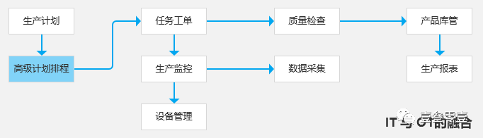
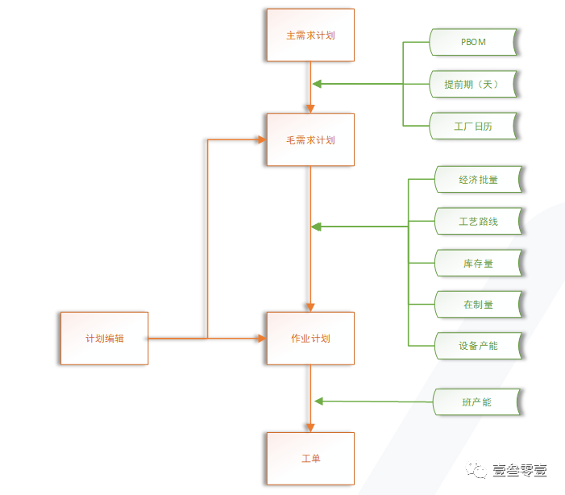
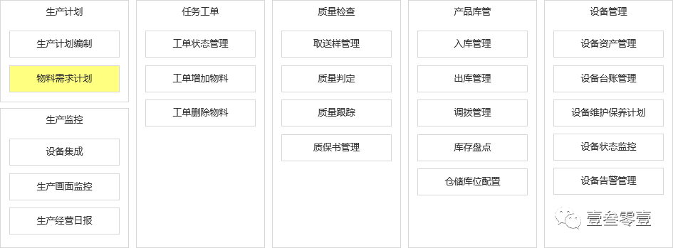
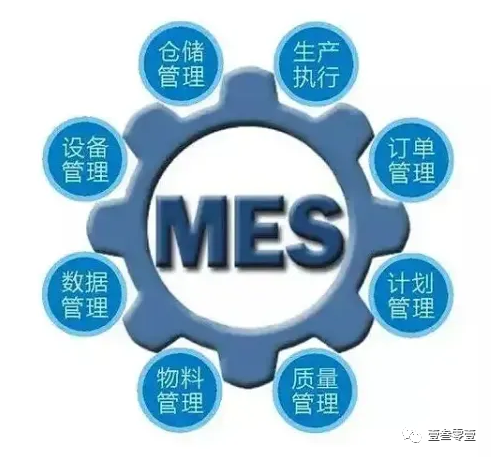

MES 系统主要实现生产业务系统管理。  
ERP 系统主要实现采购、销售、库存（进销存）、财务业务系统管理。

# **一、MES 基础信息**

MES：Manufacturing Execution System，制造执行系统。  
是面向制造车间开发的一整套软件解决方案，跟踪生产资源（人、设备、物料、客户需求等）的实时状态，通过生产信息的互联互通，实现生产过程的可视化、可控化，提高生产效率和产品合格率。

MES 系统主要管理生产过程：生产计划编制，生成任务工单；每一个完成的任务工单，需要进行产品质量检查，确保质量；然后进行产品库管。

# 二、MES 核心模块

随着信息系统的完善，生产制造执行过程管理越来越精细，自动化程度越来越高。

由客户订单或公司年度目标设置，生成生产计划。为确保按时保质交付，需要参考生产计划影响因素，形成可落地的工单。基于此扩展高级计划排程模块。

原先**生产计划**作为主计划，基于 BOM 信息、提前期、工厂日历，细化为毛需求计划。基于经济批量、工艺路线、库存量、在制量、设备产能，细化为作业计划。基于班产能，细化为工单。  
高级计划排程就是在多个影响因素的复杂影响下，组合最优解决方案。

基于核心模块的梳理拆解，形成 MES 的功能模块。

主路径是：生产计划  -- 任务工单 -- 质量检查 -- 产品库管。  
生产计划主要功能包含生产计划编制，还基于此进行物料需求计划编制。

基于任务工单模块，扩展生产监控部分，由生产监控部分关联设备管理。生产监控部分主要包含设备集成、生产画面监控，生产经营日报。  
设备集成：主要实现将硬件设备集成到系统中来，接收设备信息的直接反馈，包含状态、告警情况，如：水位过高、温度过低等；包含生产过程数据记录，如当前电量消耗记录；  
生产画面监控：主要采用孪生模型、3D 建模等方式，在软件系统中复刻工厂，并应用设备集成数据，模拟工厂当前生产状况，配合视频接入等，实现远程控制工厂；  
生产经营日报：应用生产过程数据，设备数据，业务流程数据等汇总统计生成生产日报，用于实时反馈当前生产情况，为高级计划排程等提供支撑数据，让整体生产过程更加可控。

各模块功能均按照生产业务流程进行拆解。其中设备管理更为特殊，故而加以强调。

设备资产管理：主要进行设备资产登记，管理当前企业下所有的设备，并标识设备当前的状态；

设备维护保养计划：主要进行设备维护保养计划的制定，应用系统能力，定时提醒设备保养；

设备台账管理：主要记录设备的使用记录，包含在产线的使用情况，维保的记录情况；

设备状态监控：主要记录设备当前的状态，一般会在生产画面监控中使用，这里单独出来，便于从设备角度查看可使用情况；

设备告警管理：主要记录设备告警信息，一般包含历史告警和实时告警，实时告警主要用于提醒相关人员，及时处理告警，快速查出问题源，恢复生产。

# 三、MES 相关扩展

除以上拆解的核心模块，经典 MES 系统模块还包含：订单管理、物料管理、数据管理、文档管理，且也是符合业务需要的。

订单管理、物料管理，可以放置到 ERP 系统中，订单、物料作为企业资源来进行管理，和财务的紧密程度也很高。放在 MES 系统中来，订单管理作为计划管理的上游数据，十分合理；物料管理作为物料资源计划的补充，更是十分恰当。这也是 MES 系统和 ERP 系统区别与联系的部分。

作为一个完整的信息化系统，实现系统内的数据统计与分析，也是十分必要的。  
较为特殊的是，MES 系统还包含文档管理。  
文档管理：对所有与生产单元有关的资料进行管理，包括工作指令 、图纸 、配方 、标准操作流程、设计变更 、产品记录以及 ISO 信息等，并进行历史数据的存储。尤其在关乎国计民生的医药制药中，对生产过程严格把控，并需要对应的文档支撑文件作为佐证，文档管理变得尤为重要。

MES 非常讲究行业的深度沉淀，MES 产品是与行业解决方案息息相关的。  
就汽车零部件生产而言，钣金件与注塑件生产对 MES 诉求都有很大的差异。而类似医疗、汽车、家电、电子这样跨行业、跨生产模式的业务场景差异更为巨大。  
不同零部件产品带来生产工艺的差异、生产线布局带来的生产组织和排程的差异、不同的质量管理工具方法与管理精细度的差异、仓储物流管理难点和诉求的差异…… 都使 MES 具有很强的行业特性和差异性的要求。

要实现 MES 产品的标准化存在很多难点，较好的建议是模块化，将通用的模块、公共抽取的部分，通过微服务等方法沉淀到平台，提供相应的工具支持特殊化需求灵活定制。  
总归来讲：系统建设是为业务服务的！

> https://mp.weixin.qq.com/s/221ufoEU_4fnWYrQvCyFcg
