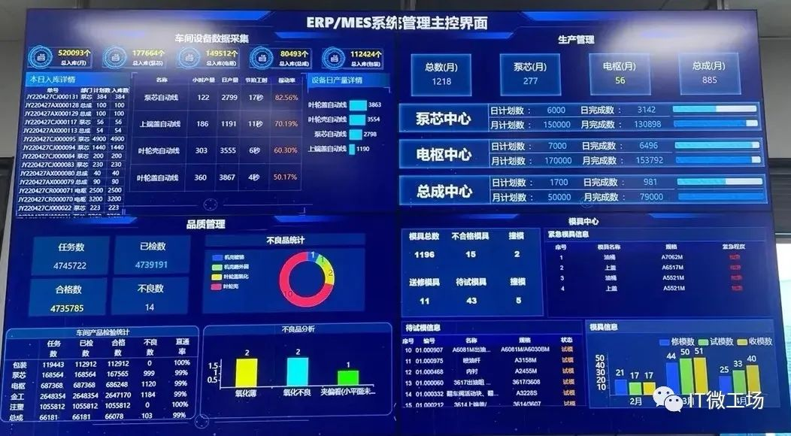
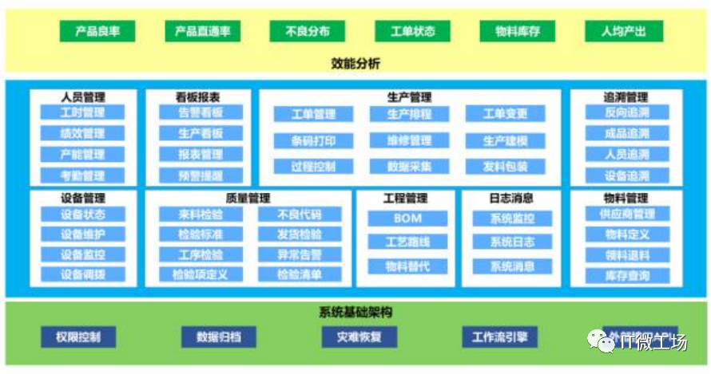
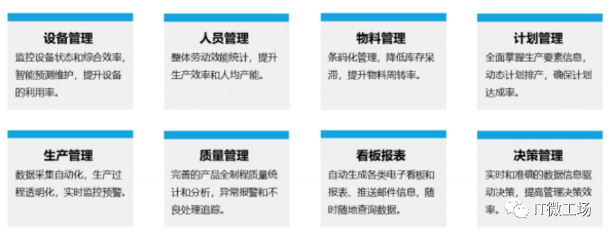
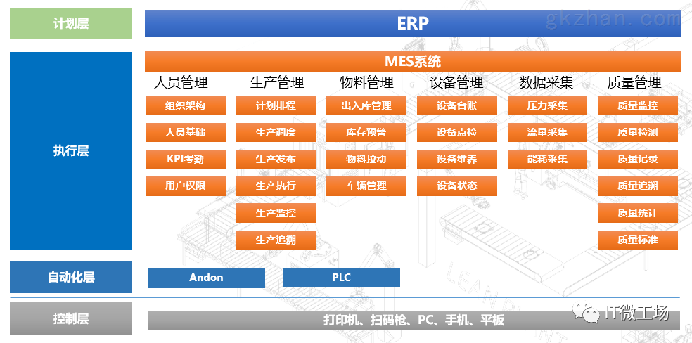

**ERP 系统**：**E**nterprise **R**esource **P**lanning **企业资源计划系统**

**MES 系统**：**M**anufacturing **E**xecution **S**ystem **制造企业生产过程执行系统**

**CRM 系统**：**C**ustomer **R**elationship **M**anagement **客户关系管理系统**

**SCM 系统**：**S**upply **C**hain **M**anagement **供应链管理系统**

**WMS 系统**：**W**arehouse **M**anagement **S**ystem **仓储管理系统**

## MES 系统

MES 系统可为制造企业提供全面的智能化解决方案，通过对信息技术、网络、自动化与管理的结合，形成数字化的制造和管理平台，使企业全面实现生产信息透明化、制造过程协同化、数据采集自动化。可显著消除信息不对称所造成的成本与效率损失，降低生产线潜在故障与风险、减少生产制造过程中的不确定性，从而提升企业的经济效益和客户满意度。

### MES 系统通常功能

**1. 生产计划管理**

根据订单和生产计划，制定详细的排程和车间生产经营计划，将生产计划和用户订单转化为具体的生产经营计划，排出有效的日常经营，大限度地减少设备损失。

**2. 生产过程调度**

生产过程管理工艺管理 MES 在系统的重要环节，工艺管理可以提高产品质量，提高生产效率，保证安全生产，减少消耗。工艺流程管理可以通过版本设置系统中的自定义工艺路线。

**3. 制造过程管理**

生产进度实时报工 MES 该系统是一个重要的节点。每个过程的完成将直接决定整个生产任务的完成，甚至影响整个企业的计划安排。

**4. 质量管理**

生产质量管理主要是控制产品生产过程质量，降低生产风险，提高合格率，为关键工序设置检验指导内容，减少上述工序质量问题造成的损失。

**5. 设备管理**

设备管理是对生产设备、操作规范、管理制度、故障诊断等进行全方面管理的模块，该模块需要设备网络系统来协助完成该功能。

**6. 文档管理**

可直接导入文档数据，摆脱传统纸质表格，使数据信息查阅更加方便快捷，包括工程图纸、标准工艺规程等。

**7. 数据收集和存储**

电子看板和系统背景可以直观地了解每个员工的日常工作能力、设备运行、订单生成进度、加班等，并为管理层提供决策依据。

### MES 系统的作用

**1. 实时监控生产现场，实现生产现场透明**

**MES 系统**能够实时监控从设备到原材料的进厂到最终产品入库的整个生产过程，记录整个生产过程以及产品所需使用的各种物料、设备、产品在每个生产工序上生产所需的时间、人员以及对产品检测的分析数据、结果等生产现场信息，实现整个生产现场完全透明。

**2. 优化企业生产制造过程的生产管理和业务**

**MES 系统**生产制造过程反馈和追溯功能可使客户和企业了解原材料、检验产品技术参数、实际生产过程中各操作环节等相关信息，通过反馈的结果，能有效解决企业由于生产成本过高、生产过程管理效率低下、产品质量不稳定等问题，帮助企业优化对生产制造过程的生产管理和业务。

**3. 构成企业间信息交换、数据共享、操作自动化的全方位应用**

**MES 系统**是制造企业发展的必需品，是计划管理系统与底层控制系统之间的连接。MES、ERP、SCM、SCADA、DCS 及其他系统的协作，构成企业间信息交换、数据共享、操作自动化的全方位应用。MES 与其他管理工具和工具相结合，在科学上可行可持续性地降低成本并提高质量

### MES、ERP 有什么区别

### **ERP 与 MES 的定位不同**

- 传统 ERP 定位于企业计划。主要面向管理人员，其管理的数据以周、天为时间周期。

- MES 系统定位于执行层面。它接转 ERP 下达的工单，并实时发布到产线，通过现场的数据采集，直接对一线操作和车间管理人员提供生产支持。

**ERP 与 MES 管理的功能范围不同**

- ERP 主要管理采购、财务、销售、生产订单管理、发运管理、成品仓储计划控制等计划层面功能。

- MES 主要提供车间的工单派发、制程防错、产品谱系、SPC 质量分析、设备数据分析、制程追溯等执行层面的功能。

MES 与 ERP 的联系

**MES 管理都是在 ERP 的框架下运行的，是 ERP 的子集或交集**。主要功能是对 ERP 的计划的一种监控和反馈，是 ERP 业务管理在生产现场的细化。所以，很多 MES 管理软件都会与工业设备，通过工控技术进行实时数据采集，再上传给 ERP 系统进行业务状态改变和业务指令处理。

**ERP 是业务管理级的系统，而 MES 是现场作业级的系统**。**如果将 ERP 是手机。MES 则是各类 APP**，通过运用很多硬件（如位置传感器），为我们 / 工作提供更加智能化的生活（如导航）。

> https://mp.weixin.qq.com/s/pURiG-EagniQ9A74EhnFkw
