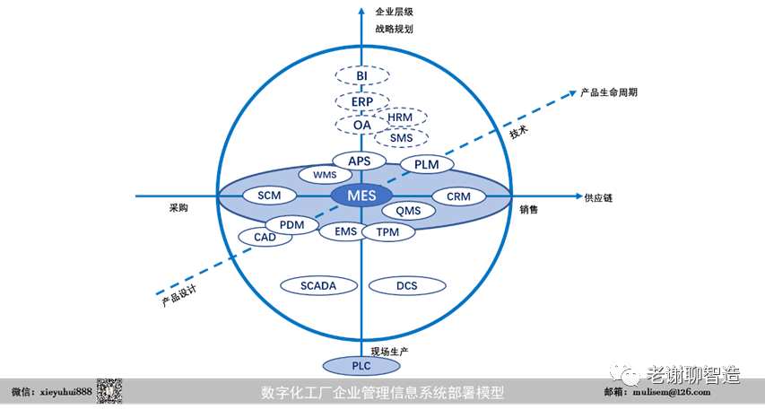
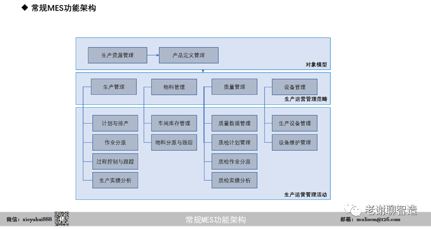
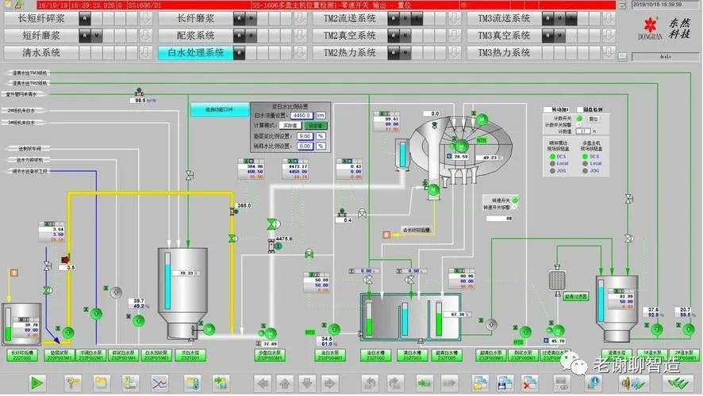

这几天，与团队的工程师小伙伴们聊天，顺便问问他们对 “数字化工厂” 一些见解，聊到几个术语，发现有些在行业干了几年的都不是非常清楚。今天，总结一些行业通俗名称与大家分享，相信不管是对从事 “数字工厂” 行业的朋友还是正在求职的朋友会有些帮助。

# **数字化工厂？**

**数字化工厂（"Digital factory"，简写为 "DF"）：**是指利用先进的信息技术和数字化解决方案，通过整合生产、物流和供应链等各个环节的数据与系统，实现智能化、高效率和灵活性的制造生产模式。数字化工厂通过数字技术和自动化技术的应用，实现工厂内部各项工作的数码化、网络化、智能化，从而提升生产过程的可控性、质量和效率，减少资源浪费，并为企业创造更大的价值。数字化工厂通常包括物联网设备、工业自动化系统、云计算、人工智能、大数据分析等技术的应用，以及相关的管理和运营模式的变革。

## **一、通用数字化工厂术语**

- **数字化转型（Digital Transformation）：**将传统工厂的各个方面，包括生产、供应链、数据分析等，采用数字技术进行改造和优化的过程。

- **物联网（Internet of Things，简称 IoT）：**通过互联网连接各种设备和传感器，实现设备之间的通信和数据交换，以实现自动化和智能化的生产。

- **人工智能（Artificial Intelligence，简称 AI）：**利用计算机系统模拟人类智能的能力，对大量数据进行分析和决策，提高生产效率和质量。

- **数据分析（Data Analytics）：**通过收集、整理和分析大量的生产数据，提取有价值的信息和洞察，以优化生产过程和决策。

- **云计算（Cloud Computing）：**将计算和存储资源通过互联网提供给用户，使其能够随时随地访问和共享数据和应用程序。

- **自动化（Automation）：**使用机器和软件来执行生产任务，减少人工干预，提高效率和准确性。

- **虚拟现实（Virtual Reality，简称 VR）和增强现实（Augmented Reality，简称 AR）：**利用计算机技术创建虚拟的环境或将虚拟元素与真实世界结合，以支持培训、设计和维护等工作。

- **数字孪生（Digital Twin）：**通过建立物理实体的数字模型，并与其实时数据进行同步，实现对实体状态的监测、仿真和优化。

这些术语代表了数字化工厂领域中的关键概念和技术，了解它们将有助于您更好地理解和应用数字化工厂的原理和方法。

## **二、MES 相关术语**

****

- **制造执行系统（Manufacturing Execution System，简称 MES）：**监控和控制实际生产过程的系统，包括生产进度跟踪、质量管理和设备管理等功能。

- **仓库管理系统（Warehouse Management System，简称 WMS）：**用于管理和优化仓库操作和物流流程。它提供了对仓库内活动的实时监控、协调和控制。

- **仓库控制系统（Warehouse Control System，简称 WCS）：**是一种用于管理和优化仓库内设备和物流操作的软件系统。与仓库管理系统（WMS）不同，WCS 专注于设备级别的控制和协调，以确保仓库内的物料流动顺畅和高效。

- **器械人控制系统（Robot Control System，RCS）**：是一种用于管理和控制机器人行为的软件系统。RCS 提供了对机器人硬件和功能的集中控制，并负责解释和执行来自上层应用的指令。

- **生产计划与调度（Production Planning and Scheduling）：**确定生产资源（如人员、设备、原材料）的使用计划和顺序，并确保按时交付产品。

- **供应链管理（Supply Chain Management，简称 SCM）：**协调原材料、零部件、成品和信息在供应链中的流动，以实现高效的供应链运作。

- **计算机集成制造（Computer Integrated Manufacturing，简称 CIM）：**将计算机技术与制造业整合，实现生产过程的自动化和优化。

- **集批生产（Batch Production）：**根据特定的订单或需求批量进行生产活动，通常适用于中小规模的生产方式。

- **质量管理系统（Quality Management System，简称 QMS）：**为确保产品符合质量标准而采取的一系列策略、流程和工具。

- **离散制造（Discrete Manufacturing）：**生产离散的产品，如汽车、电子设备等，通常涉及多个组装或加工步骤。

- **连续制造（Process Manufacturing）：**基于化学反应、物质转化和能源传递的连续流程，如石油炼制、食品加工等。

这些术语代表了生产制造系统中的重要概念和组成部分，帮助实现有效的生产规划、资源管理和质量控制，以达到高效率、高质量和可持续发展的生产目标。

## **三、ERP 相关术语**

- **企业资源计划（Enterprise Resource Planning，简称 ERP）：**是一种综合性的商业管理软件解决方案，旨在整合和管理企业各个部门和业务功能的数据和流程。

- **数据集成（Data Integration）：**通过将各个模块的数据整合到一个统一的数据库中，实现不同业务功能之间的数据共享和一致性。

- **财务管理（Financial Management）：**包括会计核算、财务报告、成本控制和预算管理等，用于支持企业的财务决策和管理。

- **物料管理（Material Management）：**涉及物料需求计划、采购管理、库存控制和供应商管理等活动，以确保及时供应和优化物料流动。

- **供应链管理（Supply Chain Management，简称 SCM）：**管理从原材料采购到最终产品交付的整个供应链过程，包括供应商选择、订单处理和物流管理等。

- **销售与客户关系管理（Sales and Customer Relationship Management，简称 CRM）：**管理销售活动、客户数据和营销策略，以提高销售效率和客户满意度。

- **生产计划与控制（Production Planning and Control）：**规划和管理生产资源、工艺流程和生产计划，以实现生产的高效和准时交付。

- **人力资源管理（Human Resource Management，简称 HRM）：**涉及员工招聘、培训、绩效管理和薪酬福利等人力资源方面的管理。

- **业务智能（Business Intelligence，简称 BI）：**利用 ERP 系统中的数据分析工具和报表功能，提供决策支持和业务洞察，帮助企业做出更明智的决策。

通过使用 ERP 系统，企业能够整合和优化各个部门之间的协作，提高效率、降低成本，并实现对业务运营的全面监控和管理

### **四、DCS 相关术语**

- **分布式控制系统（Distributed Control System，简称 DCS）：**是一种用于监测和控制工业过程的计算机系统。它由多个分布在不同位置的控制单元组成，这些单元通过网络进行通信和协作。以下是与分布式控制系统相关的术语：

- **可编程逻辑控制器 (Programmable Logic Controller，简称 PLC) :** 是一种用于自动化控制系统的电子设备。它最初设计用于替代传统的继电器控制系统，但随着技术的发展，现代 PLC 已经成为工业自动化领域中最常见和重要的控制器之一。

- **控制单元（Control Unit） ：** 位于各个工艺设备或系统中的硬件和软件组件，用于监测和控制特定的过程参数和操作。

- **网络通信（Network Communication）：**控制单元之间通过网络连接，进行数据传输和信息交换，以实现协调和集中控制。

- **过程监测（Process Monitoring）：**对工业过程中的参数和状态进行实时监测和记录，以便及时识别异常情况和采取相应的控制措施。

- **过程控制（Process Control）：**根据预设的规则和策略，对工业过程进行自动或半自动的调节和控制，以达到期望的产品质量和生产效率。

- **人机界面（Human-Machine Interface，简称 HMI）：**提供给操作人员与分布式控制系统进行交互的图形化界面，用于监视和操作过程。

- **分散控制（Decentralized Control）：**将控制功能和决策分散到各个控制单元，使系统具有更高的可靠性和灵活性。

- **高可用性（High Availability）：**分布式控制系统设计具有冗余和备份机制，以确保在硬件或软件故障情况下仍能维持正常运行。

- **实时性（Real-time Capability）：**分布式控制系统需要能够实时监测和响应过程变化，在毫秒级别的时间范围内完成控制操作。

- **故障诊断与恢复（Fault Diagnosis and Recovery）：**系统具备故障检测、故障诊断和自动或手动恢复能力，以减少系统停机时间和生产损失。

- **扩展性（Scalability）：**分布式控制系统能够根据工业过程的需求进行扩展，添加更多的控制单元和设备接口。

分布式控制系统广泛应用于工业领域，如化工厂、电力站、石油炼制厂等，以提供高效的过程监控和控制，并实现生产的自动化和优化。
