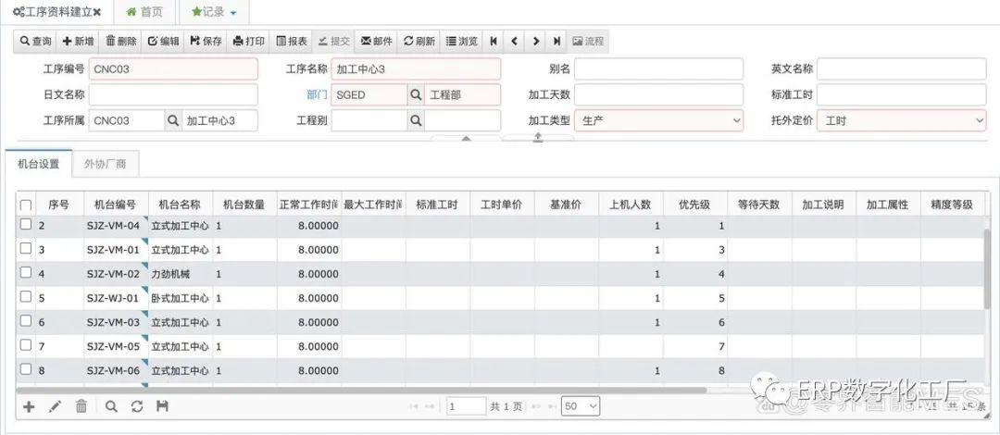
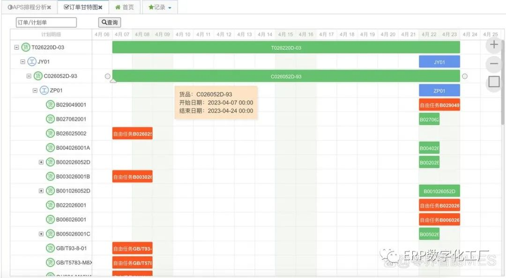
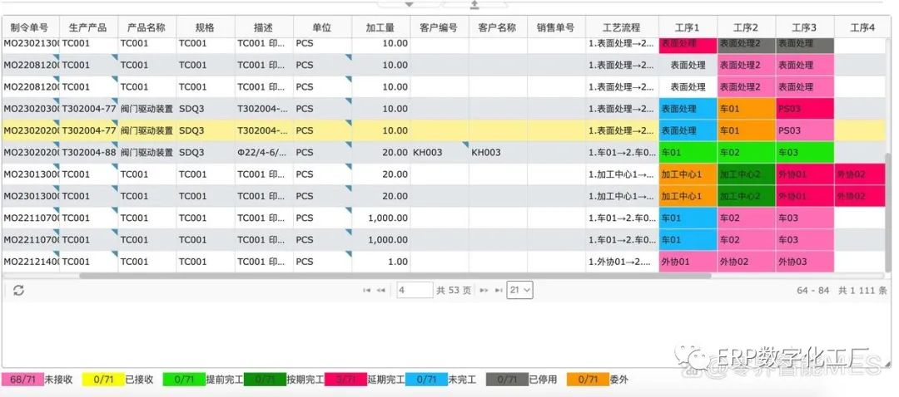
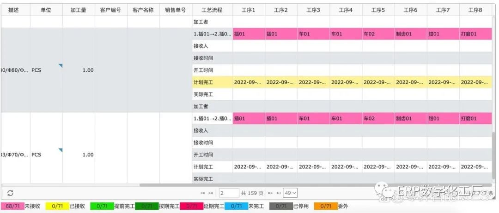
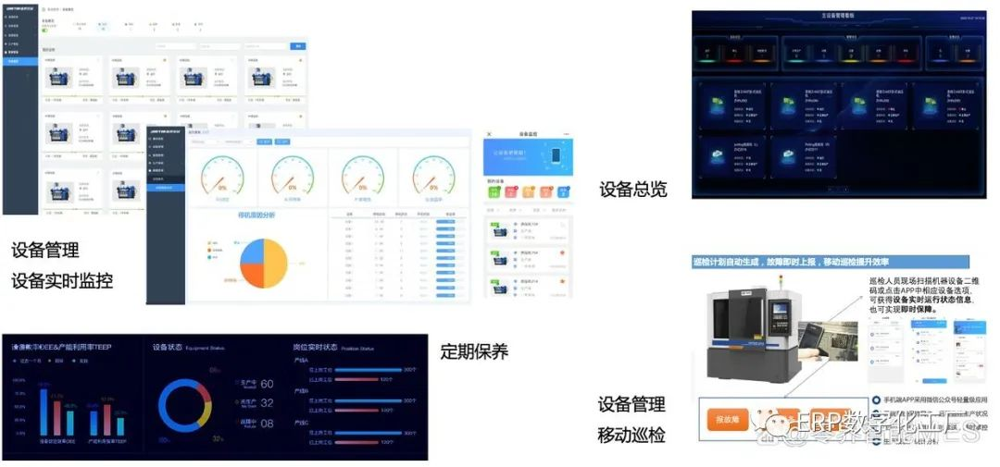

# **一、行业描述**

机械加工在制造业中占比非常多，属于国家支柱产业，从高端装备制造到普通机加工工厂，各领域都会涉及机械加工需求，机械加工大多数都是订单式生产，属于离散制造行业，有单个非标零件加工，也有加工装配一体。

华东地区属于机械加工重镇，机加工企业数量非常庞大，而大多数机械加工企业信息化程度比较低，机械加工企业 ERP 系统、生产 MES 系统、仓库 WMS 系统等都普遍应用比较少，或者应用非常不好，企业仍处于**信息孤岛** 状态，大多数企业都是应用简单的 ERP 或者 MES 系统，然后结合 EXCEL 表格同时使用，信息化环境难以**标准化、规范化**，信息的共享性也很差。

机械加工随着现在各方面成本的不断攀升，生存空间越来越狭窄，而客户的要求越来越高，尽管一部分机加工企业会有一定批量零件加工，但客户对供应链要求又比较高，有些需要每天或者每周按配套客户装配需求计划分批交货，质量追溯要求严格，出现品质问题需要从材料、加工、外协全流程追溯，传统的手工方式或者不匹配的管理软件很难在非标机械加工行业全面应用，反而可能导致企业运转效率降低，增加企业系统应用负担。

如何应用一款适合非标机加工企业的 ERP 软件和 MES 软件，对于当前多品种小批量非标机械加工企业来说，显得尤为重要。

# 二、机加工行 MES 系统功能

## 1、MES 工艺建模

首先建立工序基础信息，工序报工管控设置、工序对应机台，绑定工序机台编号，设置机台加工优先级别，机台加工精度等级，机台最长加工时间、机台标准加工时间，该工序对应机台加工单价等；

这里设置机台加工等级和优先级别，主要作用是在设备排产的时候按照设备优先级顺序派单到机台，另外不同精度等级机台，同一工序可加工产品不同，精度要求高的需要优先安排到高精度机台加工。

标准工艺路线维护：建立标准工艺路线模板，后续加工零件可直接调取工艺模板套用，也可以调取相近工艺路线微调，同时支持绑定产品，标准工艺路线可绑定适合该工艺路线的产品，系统可在工艺流转卡开立时，根据绑定关系自动带出工艺路线。

## 2、APS 计划排程

非标机械加工行业很关注 APS 排程，手工计划的安排工作量非常大，急单、插单非常频繁，非标机械加工行业 APS 系统显得尤为重要。

APS 系统对基础数据要求比较高，需要建立完善的基础档案，包含产品工艺路线、标准工时、产线、机台资料、机台最大产能、机台标准产能、产能日历、人员排班、物料到料状态、生产配套模具、工装、治夹具等。

APS 系统的核心是基于有限产能的订单排产，瓶颈工序也是最核心要考虑的因素，APS 排程一般采用推式（根据订单排产日期向后推）、拉式（根据订单交期向前拉）、瓶颈工序向前向后展开等方式。

通常订单根据交期顺序下达生产指令，工单下达之前，能看到车间现有产能负荷，已排工单占用多少产能，未排工单建立工艺路线和标准工时后才能占用产能，系统可根据现有产能负荷预测订单预估交期，是否有空余产能接收插单。

非正式订单可模拟生产任务，预测交期，客户正式订单下达，直接转成正式生产任务；如果客户订单取消，系统删除模拟任务，释放产能占用。

根据企业不同情况，APS 系统涉及面非常广，考虑因素众多，需要结合企业实际情况和需求，尽可能少的条件判断，才能更好的利用 APS 系统，比如部分企业物料充足，采购交期准时，物料到料状态对系统排程影响就可以忽略不计。

## 3、MES 生产管理

机械加工行业，尤其是非标机械加工，对于 MES 系统的要求相对比较高，生产管理现场可能需要更灵活的生产管理模式。通常采购、外协加工、自制等情况转换非常频繁，计划外协的产品，在厂内产能负荷不足的时候，有可能随时转为厂内自制加工，部分厂内自制零件，由于客户其他紧急订单或者因为厂内产能饱和，选择外协加工或者外购成品。这是非标机械加工最常见的情况，需要系统层面支持外协、外购和自制灵活转换。

机械加工 MES 系统工艺建立是基础工作，有了工艺路线以后，下达工艺流转卡和图纸到车间现场，车间工人按照工艺路线标准和图纸要求加工。现场加工包括班组长派工、材料领取配送、调机、装夹、加工开始，加工完成，首检，工序检等，工人通过 PDA、工位机、或者其他报工终端设备进行任务报工，操作简单。

车间异常，比如返工和报废管理，中途检验发现零件不合格，需要对不合格零件判定是否可以返工，如果可以返工，就将不合格零件拆分单独工卡流转，新的工卡绑定关联到原来老的工卡，新工卡设置单独工艺路线；如果该零件经检验判定不合格，只能报废处理，则需要将该零件如报废仓，系统支持自动补料，下单生产，也可以人为判定不补料，由于加工数量少于订单数量，需要手动结案处理。

## **4、MES 数据采集**

机械加工行业车间数据采集一般通过任务推送机制、工艺卡或图纸带二维码扫描、也可以支持 RFID 标签自动感应、传感器等多种方式进行车间数据采集，系统自动生成生产状态可视化管理，追踪订单、生产工单加工进度，每道工序待生产任务，监控车间实际加工进度和计划的差异。

# **5、MES 质量管理**

系统支持严格按照工艺路线进行零件加工，如果设置参数管控，车间现场无法跳工序或者调换加工顺序，当然在发生工艺变更情况，管理员权限或者主管负责人权限支持调整工艺路线。通过工艺管控，可以避免车间现场工艺加工错误或者漏工序等情况，严格按照工艺路线加工，可确保车间加工品质稳定性。

生产过程支持首检、巡检、工序检、完工检。首检不通过，后续批量加工无法进行，有效避免因为加工工艺等问题导致批量零件加工不合格或者报废；工序检在当前工序完工后，系统推送检验任务到检验部门，检验安排质检人员进行检测，如果合格，才能流转到下道工序进行加工，如果检测不合格，避免不合格零件移转到后道工序，造成加工的浪费；完工检一般在工艺加工全部完成后，进行检验，大部分零件完工都需要全检，检验员通过 PDA 手持操作，对检测结果实时上报，避免不合格零件从厂里发出，最后形成质量检测分析和控制报表，对不合格原因进行分析，避免以后出现同样问题。

## **6、MES 产品跟踪**

对于批量加工零件，一般无法实时追溯到具体加工人员和设备，只能按批次进行追溯，主要是生产加工过程中，会出现拆、合非常频繁的现象，比如第一道工序一个人在 3 台设备加工，第二道工序分拆 3 人在 6 台设备进行加工，第三道工序又可能是 2 个人在 4 台设备加工，如果车间现场无法严格按照周转筐或者托盘标准流转，就比较难跟踪。部分管理要求高的企业，会让加工零件严格按照周转筐或者托盘进行流转，每筐或者每托盘都有唯一工艺流转卡，这样就能进行产品跟踪和追溯。

其次需要了解每道工序在制加工有多少产品，待加工任务，产品或者工单加工进度到哪一道工序，分批流转零件，在车间不同工序在制有多少，在机械加工 MES 系统都能实时体现。实时追踪和了解在制品的生产状态。

## **7、MES 设备管理**

通过设备互联平台实时采集和监控设备的运行状态，加工履历，设备维修、保养、巡检、点检，设备 OEE 计算、设备的利用率分析等，为提高设备利用率提供依据。

设备管理其实范围比较大，对于机械加工企业，主要是加工设备和检测设备，其他还有量具、叉车、航车等辅助设备，加工设备除了维保和点巡检以外，更多的是设备状态的监控、设备加工参数、包括主轴转速、设备进给、开停机时间、异常报警等信息的采集，另一部分就是加工程序 DNC 的传输和管理。

# **三、MES 的应用及效果**

机械加工工厂通过实施 MES 系统可以实现车间生产计划和调度、生产任务查询、生产过程监控、智能数据采集、质量检测与控制、物料跟踪、员工计件计时、绩效管理、统计分析等功能，彻底帮助企业改善生产现场管理的各个节点。

机械加工 MES 系统——直接提升制造执行力；

机械加工 MES 系统—让生产以及物料环节透明化；

机械加工 MES 系统—尽可能实现根源追溯；

机械加工 MES 系统—及时、准确、实时地把握生产现场的信息收集、传递、处理和反馈，做到随时应变；
