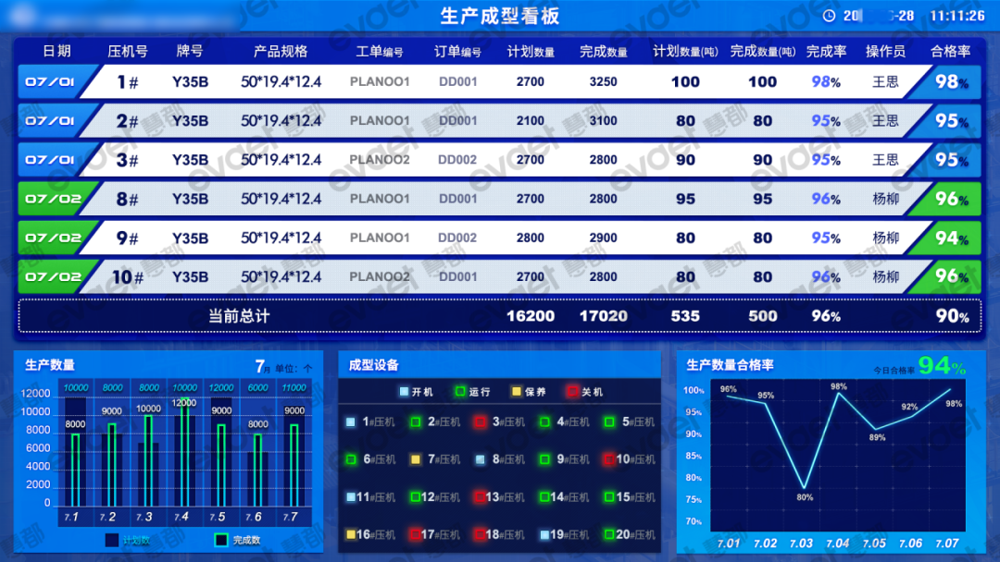

> 装备制造企业大多是劳动密集型企业，自动化程度不高，底层生产数据获取不易，而且很多零部件都是外委到其他车间或企业加工，很难控制物料的齐套性。再加上设计、工艺的经常调整和质检后的返工返修，导致生产计划的安排混乱。

## **01** **生产困境**

传统装备制造业面临着一些生产困境，以下是其中几个主要问题：

**生产效率低：** 传统装备制造业通常采用传统的生产工艺和设备，缺乏自动化和智能化的生产手段。这导致生产效率低下，生产周期长，成本高昂。

**生产现场单据繁杂：** 生产任务、生产进度、质量信息等通过人工统计，存在信息不准确、不能及时更新、处理不及时等情况。

**质量追溯难：** 产品结构复杂，零部件多且外协自制兼有，对外协产品的质量、交货期的跟踪控制困难，不能满足下游客户的合规要求。

**设备管控不合理：** 设备经常处于不坏不修，点巡检执行不标准，因设备问题经常耽误生产进度，造成计划、过程、交期全面延误。

## **02** **MES 系统功能**

通过 MES 系统，企业可以对生产数据、车间现场、产品质量、制造设备进行全方位数字化管控。MES 系统主要包含以下功能模块：

**生产计划与排程：** MES 系统可以根据订单和资源情况生成生产计划，并进行实时的排程和调整。它可以考虑设备能力、工艺要求和人力资源等因素，优化生产计划，提高资源利用率。

**实时监控与控制：** MES 通过连接设备和传感器，实现实时监测和控制生产过程。它可以收集设备运行状态、工艺参数和生产数据，并提供实时的生产指标和报警信息。

**资源管理与调度：** MES 可以有效管理企业的资源，包括设备、材料和人力资源。同时，它可以优化材料的采购和库存管理，确保生产所需的材料供应充足。

**质量管理与检验：** MES 可以提供全面的质量管理功能。定义和执行质量检验计划，并记录检验结果和不良品情况。通过实时监测和控制，及时发现质量问题并采取纠正措施，确保产品符合质量标准和客户要求。

**数据分析与报告：** MES 可以收集大量的生产数据，并进行分析和报告。提供各种报表和图表，展示生产指标、质量数据和资源利用情况等信息。通过数据分析，企业管理者可以发现潜在问题和改进机会，并做出相应的决策。

## **03** **装备制造业 MES 部署关键点**

MES 的实施不是一件易事，需要企业各部门紧密配合，把握重点，有针对性地进行分步实施。以下是 MES 实施的几个关键点：

### **1、产品及供应商选择**

选择了正确的供应商及其产品，MES 推进便成功了一半。现在的 MES 厂商比较多，结构五花八门，很难选择，可以考虑以下几点：

供应商是否有专业的技术团队? 只有专业技术团队开发的 mes 系统才更加稳定和强大。

另外还有产品的通用性和可扩展性，因为装备制造企业要实施 MES 的车间一般不止一个，而各个车间在生产管理上不尽相同，所以 MES 产品的框架首先要在总体上能够适应企业各个车间的一般需求，然后还要针对各个车间的特点在细节上可以进行扩充。

### **2、领导支持程度及部门合作**

从以往的经验来看，离散型企业的 MES 实施困难，其中一个很重要的因素就是企业管理者支持的力度不够。

车间 MES 的实施除了有 IT 部门的全程参与和实施过程中标准化部门的规范化管理，还将涉及生产、设计、工艺、质量等多个部门，企业领导必须坚定决心，统一调度，加大协调督促力度，确保各个部门的协调一致。

如在车间执行生产管理部门的生产计划之前，设计、工艺部门的产品 BOM 数据和工艺流程信息必须已经完成，并通过系统接口进入 MES，形成了待生产产品的基础数据资料。

### **3、需求定位**

首先要分清关键需求和非关键需求，让关键需求先转化为程序模块使用起来，再逐步完善程序实现非关键需求；

在需求梳理的过程中，需结合行业和公司的特点，对这些特点进行详细分析，以保证未来 MES 系统能满足公司个性化需求。

这一环节需要注意几个要点：MES 需求汇总与分析、MES 总体规划与框架设计、MES 详细功能设计。

### **4、数据准确性**

基础数据标准化是 MES 应用的重要工作之一，建立规范统一的基础数据，是保证企业 MES 正常运行的前提条件。

基础数据收集的重要意义是统一思想、规范管理，发现问题，找出差距。基础数据主要包括组织数据、设备数据、物料数据、工艺数据、质量数据等。

### **5、工艺模块化**

装备制造企业的产品种类虽然多，但是生产的批量小，一般是几个到十几个，如果每生产一种不同种类的产品，就重新编制一套新的工艺文件，在可行性和经济性上都是十分不利的。

为此，在 MES 实施过程中引入了工艺节点模块化的概念，即将生成产品的所有工艺按加工性质拆分成单个的独立模块存入工艺模块数据库。

由于相同类别不同型号的产品在构造上存在或多或少的相似性，在设计一个新的产品时可以先从工艺模块数据库中选择可重用的工艺节点，对于新的工艺则另行设计和入库。

