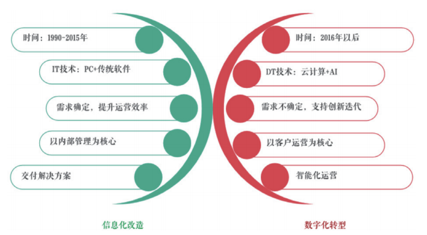
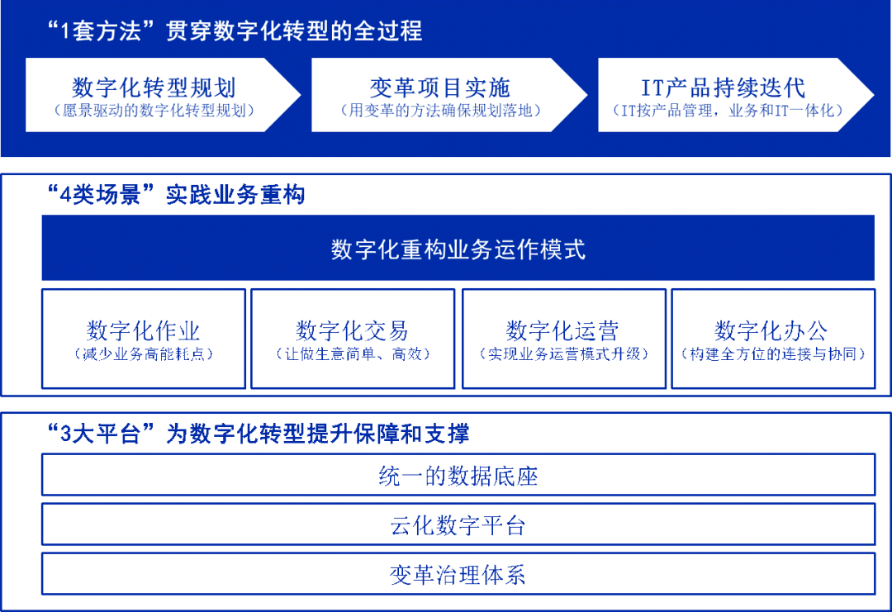
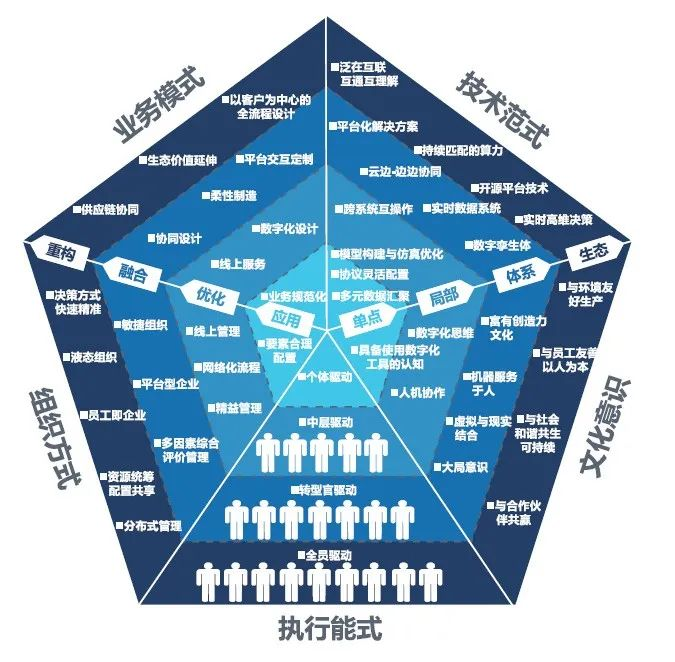

> “信息化”我的理解的是“业务数据化”
>
> “数字化”我的理解是“数据业务化”

近期，我一做数字化咨询的朋友（化名老王）遇到了一个头痛的问题：话说老王的团队近期接了一个大单——一大型制造业的数字化转型规划。老王带领团队奋战了几个月，各种业务调研、信息化调研、高层领导访谈……终于方案初稿出来了。

但是做方案汇报的时候，这版方案被客户方领导给否掉了，**客户认为他们规划的方案是“信息化方案”而非“数字化方案”。**

交代一下：老王在企业信息化领域有近二十年工作经验，对信息化、自动化、数字化等各项知识和技术都很熟悉，曾就职某世界知名咨询公司，主导过 N 多企业大型 ERP 系统的规划和实施，在信息化、数字化领域算得上是身经百战的“老专家”了。按理说，以老王的能力和经验，搞定这样一个咨询项目，并不难。没想到，却在信息化、数字化边界上栽了跟头。

客户认为老王给出的方案还是 ERP 那一套：业务调研-蓝图规划-流程设计-功能设计-数据准备等等，**客户希望看到的是全域数字化解决方案，用数据来驱动业务，而并不是让人去适应系统。**

老王也很苦恼，他向我吐槽：

> 客户信息化基础比较薄弱，虽然有一些信息化系统，但基本都是点状应用，系统之间没有联通，业务流程之间存在大量的断点，缺乏端到端集成，基础数据质量层次不齐，信息孤岛问题严重，很多数据还缺失……，这种现状下，先解决系统层面的流程断点问题、信息孤岛问题，这没问题呀！现在有的业务连数据积累都没有，怎么驱动业务？你说这是不是开玩笑（苦笑）

客户对“数字化”的殷殷期盼我完全能够理解，老王的心情我也感同身受。下面谈一谈我的一点不成熟看法，或许能对遇到类似问题的“客户”和“老王”带来些许启发。

# **01 “客户”说的对，信息化 ≠ 数字化**

### **1. 信息化的定义和本质**

**“信息化”我的理解的是“业务数据化”。**即：对企业的生产过程、采购过程、销售过程、客户服务、事务处理、现金流动等业务活动和过程进行数据化记录的过程。

简单地说，信息化就是业务在物理世界里开展，信息系统提供支撑。例如，对于传统的出租车，乘客招手，司机就停了，出租车在物理世界运营，背后有信息系统支撑。

**信息化的核心和本质是运用网络、计算机、数据库等信息技术，实现企业的业务流程管理和业务数据记录**，其重点关注的是业务流程优化，典型的工具是信息化系统，例如：OA、ERP、CRM、SRM、PLM 等。

### **2. 数字化的定义和本质**

**“数字化”我的理解是“数据业务化”。**即：把信息化过程中，长期累积下来的数交易数据、电商数据、媒体数据、行业数据、用户数据、潜客数据、产品数据、售后数据等，不断融入到企业的管理和经营活动中，通过数据发现问题、发现规律、发现商机，用数据优化业务组合，优化业务流程、优化经营模式，实现企业的持续运营、持续创新、持续发展。

简单来说，数字化就是业务在数字世界里开展，物理元素响应。例如，滴滴等网约车平台在数字空间里开展出租车业务，物理世界的出租车司机、乘客响应。

**数字化的核心和本质是运用大数据、云计算、物联网、区块链、AI、5G、VR/AR 等数字技术，实现企业的业务和管理创新，增强企业竞争力，其重点关注的是“数据驱动”业务**，典型的工具是数据化系统，例如：数据仓库，数据湖，智能分析平台，算法平台，数据资产管理平台等。

### **3. 数字化 ≠ 信息化**

从信息化和数字化的定义中也不难看出，数字化和信息化是现实物理世界和数字化世界谁占主导权的问题，用信息化的手段当然解决不了数字化的问题。例如，我们上边举的两个打车的例子。

**传统出租车业务，是物理世界主导的**，出租车公司也有软件系统，提供了车辆管理、司机管理、运营管理、维修管理、发票管理等系统功能，但这些系统功能对业务来说起到的是支撑作用，也就是说没有这些系统功能，出租车的业务也照样能开展。在物理世界，业务是由人主导的，而非系统。

**而网约车的业务，是数字世界主导的**，在物理世界是不能直接与之交互的。如果你想打车去机场，刚好来了一辆网约车，你对司机说你要去机场，司机会说不行，他已经被人约了。即使没有人约，他也说不行，你要到 App 上叫车，他只能响应那个 App，App 派单或在上面抢单。在数字世界，人的一切行为都只能响应数字世界的指令。

关于信息化和数字化的区别，智慧云创始合伙人——陈雪频老师，从发生时间、技术架构、需求特征、核心目标、交付模式等方面总结了一张图，我觉得总结的很好，分享给大家：

▲ 信息化改造 vs 数字化转型（陈雪频）

这张图简单明了的介绍了信息化改造与数字化转型的不同。**因此，我特别能理解文章开头老王客户说的“我们要的是数字化转型方案，而不是信息化改造方案”！**

# **02 企业能否越过信息化，直接进入数字化**

那话又说回来了，企业能否越过信息化，直接进入数字化？或者说，信息化基础薄弱，能否直接搞数字化？

其实关于这个问题，笔者的观点一直是明确的，在我的数字化转型系列文章中，也不止一次都提到过：**数字化转型是一个系统工程，既需要“大处着眼”的顶层战略规划，也需要“小步快跑、点状突破”的推进策略。**在整个数字化转型的过程中，信息化是基础，没有信息化就无法沉淀出数据，而没有准确、完整的数据，数字化转型就是“白忙活”。

因此在现阶段，除了像阿里、腾讯、谷歌、亚马逊等互联网公司，这种原生就有数字化基因的公司之外，其他传统企业，不论是金融、制造、能源、化工等传统行业的数字化转型，实际上都离不开对信息化升级或改造！

很多传统企业的数字化转型都在学习奈飞（Netflix）、华为等成功实现数字化转型的企业。

### **先说说奈飞。**

这是一个成功的颠覆式数字化转型案例，奈飞从一家 DVD 光碟租赁公司，成功转型成为全球最大的流媒体内容提供商。提到奈飞业内津津乐道的更多的是奈飞如何通过“订阅付费”和“智能推荐算法”的组合，实现了商业模式的巨大成功。

而在其转型的背后，奈飞 10 多年的在线租赁和邮寄 DVD 阶段，已经收集了大量的用户数据，这使得它具备了精细化分析用户偏好的能力。没有这些数据，算法再强大能有什么用呢！

### **再说说华为。**

华为的案例也是很多企业数字化转型学习和参考的对象。最近，华为还写了一本书——**《华为数字化转型之道》**，体系化的讲讲了华为是如何成功实现数字化转型的。这本书主要分为认知篇、方法篇、实践篇、平台篇 4 个篇幅，讲解了华为数字化转型的“1 套方法、4 类场景、3 大平台”，给企业的数字化转型提供了基本参考框架。

- 参见：[揭秘华为数字化转型框架：1 套方法、4 类场景、3 个平台能力](http://mp.weixin.qq.com/s?__biz=MzUxNjAzMDc4NA==&mid=2247512626&idx=1&sn=5f1001eccc6454f8cd0db64657e67f7c&chksm=f9af5a1dced8d30b3ad4f6b4126b50f0003eb51698b9e89362ac83765513b5a7c4a539264c25&scene=21#wechat_redirect)

▲ 图：华为数字化转型框架，来源：《华为数字化转型之道》

从实践篇中，我们看到华为的数字化转型，首要的任务是业务运作模式的重构，通过“对象数字化、过程数字化、规则数字化”重构了业务运作模式，始于流程、终于流程，将数字化成果内化到管理体系中。其次，是数字化作业，通过数字化技术优化供应链，确定性业务自动化、机器代替人等，减少业务高能耗点，实现降本增效。

第三，是数字化交易，重点强调了“以客户为中心”构建 ROADS 用户体验（ROADS 是“实时，按需、在线、自助、社交”的缩写），让 ToB 业务拥有 ToC 的客户体验。

第四，是数字化运营，改变传统运营模式，以数据为驱动，打破信息孤岛和部门墙，实现了基于数据的科学决策。最后，是数字化办公，主要是通过数字化办公 App 提升工作效率的过程。

**以上 5 个实践，既有信息化的改造也有数字化的转型。**看到这里，你如果以为照搬以上 5 个华为的数字化转型实践就能成功，那就大错特错了。在笔者看来，《华为数字化转型之道》这本书并没有将华为数字化转型之道讲透。

以 5 个实践只是华为成功转型实施的举措的冰山一角，这本书没有讲到的还包括：以集成产品开发（IPD）为标志的管理变革、以集成供应链服务（ISC）和全球供应链（GSC）为标志的供应链领域管理变革、以集成财经服务（IFS）为标志的管理变革，而这三大变革如果按信息化、数字化划分的话，应该都属于信息化的范畴。

综上，对于传统企业，信息化、数字化并不矛盾。数字化转型目标的实现离不开信息化的升级和改进，数字化技术的连接力、协同力、洞察力是需要建立在一定的信息化成熟度基础之上的。**因此，我也特别能理解老王，现阶段的传统企业的数字化转型方案一定也离不开信息化改造的影子！**

引用我之前文章的观点：数字化是信息化发展到高级阶段必然产物，而这个所谓的“高级阶段”重点并不在于 IT 技术的某些内在质量是否更高级，更多的是关于企业如何使用这些技术。**在我看来，能够“战略性地”使用“IT”和数据，即为“数字化”。**

# **03 传统企业数字化转型，到底怎么搞？**

数字化转型是一个系统化工程，涉及到企业的商业模式、组织机制、人才结构、技术工具、企业文化等方面的转型，不可能通过一个项目的实施就能转型这件事情。

- 请参考我之前的文章《[企业数字化转型的点、线、面、体](http://mp.weixin.qq.com/s?__biz=MzUxNjAzMDc4NA==&mid=2247513323&idx=1&sn=9a2e531b4e731ab3cf531a20f006d3fb&chksm=f9af5cc4ced8d5d21eb326e5e07bb350887f07c2cd95003ffc5697c444c475f53d7b1c2407b2&scene=21#wechat_redirect)》

对于传统企业的数字化转型，重中之重是数字化能力要素的构建，在中国电子技术标准化研究院发布的《制造业数字化转型路线图（2021）》白皮书中，提出了制造业数字化转型通用能力“海星”象限，我认为是非常值得借鉴的。

当务之急，企业需要精准定位自身数字化转型能力的发展状态，明确转型提升的具体发展方向和进阶路径。同时在实践中不断提升转型认知、明确转型目标、提升企业数字化战略推进信心，定制适合企业自身发展的“专属”转型之路。

▲ 制造业数字化转型通用能力“海星”象限，来源《制造业数字化转型路线图（2021）》

在本白皮书上对于制造业数字化转型也提出了参考方法，我觉得也是值得学习的。引用过来，供大家参考：

#### **1. 单点应用——“数字化投入如何快速给我带来收益？”**

单点应用的目标是实现企业关键业务环节的数字化表达，关注点在于通过数字化工具和设备投入，实现某一环节的数据汇聚和互联互通、互操作，基于数据解决实际的单点问题。

重点需要抽象出高频重复、成本低、收益大且相对独立的业务场景，把握数据这一核心驱动要素，将数据的价值融合到企业关键活动中，实现点状的从流程驱动到数据驱动。

#### **2. 局部优化——“我的企业还需要哪些环节数字化改造？”**

开展局部优化的目标是借助数字化的手段，将过去局限于某个设备、系统或业务环节的数据进行系统性集成，打破信息孤岛，实现跨部门、跨系统和跨业务环节的集成优化，从而达到降本增效的目的。

重点是以企业关键业务为核心，实现相关多业务环节和流程系统的集成。基于关键设备和业务系统的数据集成共享，开展业务流程优化设计和组织架构调整，形成数据驱动的系统建设、集成、运维和持续改进机制。

### **3. 体系融合——“所有业务都值得用数字化手段升级一遍！”**

开展体系融合的目标是通过工业互联网平台汇集各要素资源，形成支撑能力，关注点在于平台建设，以实现企业全链条业务的优化和协调共享。体系融合体系在多个环节的协同优化，数字化技术应用深入整合企业生产经营全过程，行业级工业互联网平台在此阶段出现，人、机、物全面互联，资源高效配置，内外部协同优化。

### **4. 生态重构——“我未来将是一家什么样的企业？”**

生态重构的目标在于通过依托工业互联网平台等各类创新载体，打通企业内部、供应链、产业链上下游的信息链、创新链、价值链，实现企业与企业之间的泛在互联、深度协同、弹性供给、高效配置，开辟多种新型合作路径和商业模式，建立一致价值观企业生态群。

# 参考文献：

《华为数字化转型之道》，机械工业出版社

《汽车企业数字化转型：认知与实现》，机械工业出版社

《制造业数字化转型路线图（2021）》，中国电子技术标准化研究院
