# **一、ERP 基础信息**

ERP ，Enterprise Resource Planning ，**企业资源计划**。
通过软件把企业的人、财、物、产、供、销及相应的物流、信息流、资源流、管理流等紧密地集成起来，实现资源优化和共享。

ERP 系统发展是一个信息发展历程的缩影，从初始的库存信息记录，到物料信息的支持，到制造资源计划管理，到企业资源管理。ERP 一步步完善自身，扩展自身的业务范围，最终成就当前信息建设三驾马车的地位。

**生产制造**就是将买进的**物料**生产加工成为**产品**。主要包含三大模块：**物料管理、生产加工、产品管理。**

物料管理具象表现在物料库存上，通过采购订单购进物料，增加库存；通过生产领料单进入生产加工，减少库存。产品管理具象表现在产品库存上，通过生产加工完成，增加库存；通过客户订单销售，减少库存。
生产中心落地于生产制造管理，当前用**MES**系统去承载，也是下一篇文章将拆解的系统。

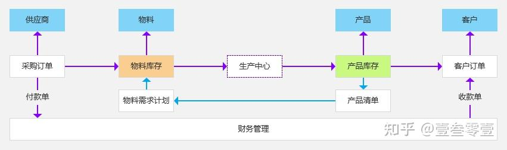

以业务模型为框架，针对单模块扩展，可以逐渐完善、细化业务模型；再基于各个模块的相互约束关系，通过数据处理平台、报表、图表等支持，实现多复杂条件下的降本增效，是系统建设、信息化一直来的追求。

# **二、ERP 发展历程**

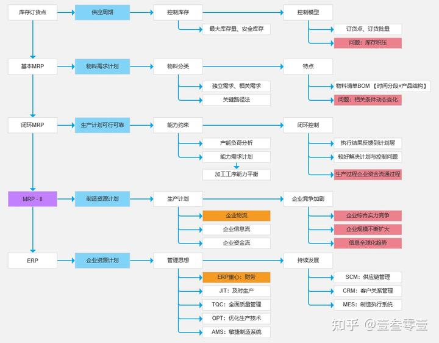

**（1）库存订货点**：企业通过控制**物料库存**的方法来控制物料需求，为每种物料设置**最大库存量**和**安全库存**。基于库存容量、库存占用金设置**最大库存量**；基于物料消耗不能小于安全库存量设置**安全库存**。
物料的供应需要一定周期，如采购周期、生产周期（本司需要的物料可能为另外企业的产品，需要有生产过程），就需要物料还有一定量的情况下采购补充库存，保证生产正常进行。

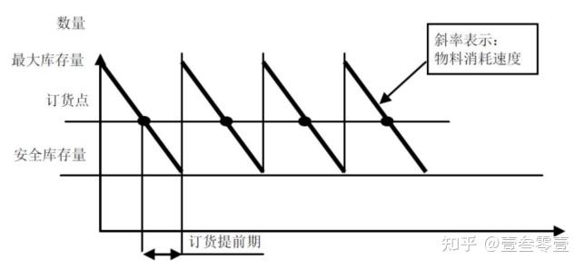

该方法关键点在**订货点**和**订货批量**。
该方法要求物料消耗相对稳定、物料供应相对稳定，但现实中常出现多种异常因素，为确保生产的正常进行，就需要提前订货点、增大订货批量。

**（2）基本 MRP**：物料需求计划理论，在需要的时候提供需要的数量，解决库存订货点的库存积压问题，增强企业竞争力。

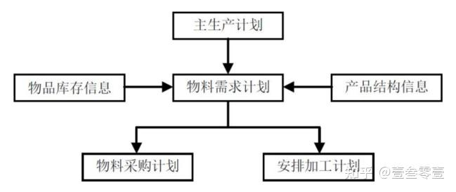

通过**产品清单 BOM** 梳理清楚产品与物料之间的关系，顶级节点是产品，下级节点为物料，梳理物料生产时长及配比关系（如：一辆车需要 4 个轮子，5 个座椅），从而践行关键路径法。

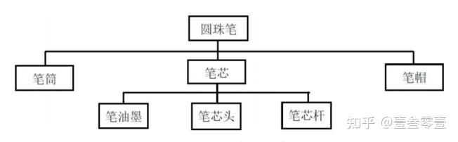

**（3）闭环 MRP**：基于**物料需求计划（MRP）** 主生产计划与物料需求计划可行，提出满足能力约束前提下，确保物料需求计划的执行和实现。通过**产能负荷分析** 判断是否调整主生产计划；通过**能力需求计划** 平衡各加工工序，实现输入输出控制，并根据作业执行结果反馈到计划层。
闭环 MRP 很好地解决计划与控制的问题。

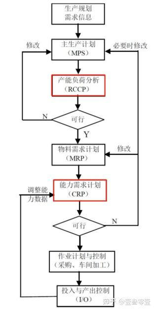

**（4）MRP-II**：制造资源计划，即是广义 MRP，是一个围绕企业基本经营目标，以生产计划为主线，对企业制造的各种资源进行统一计划和控制的有效系统，实现企业信息、物流、资金流畅通运行并动态反馈的系统。

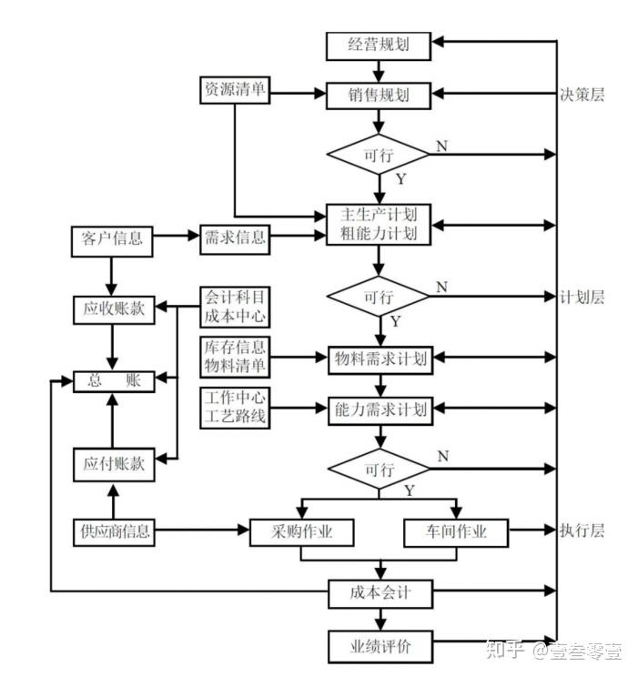

MRP-II 集成财务管理，通过对企业成本、资金运作过程加以掌控，调整企业生产计划，使得生产计划更为可行、可靠。MRP-II 的核心是**物流**，主线是**计划**，伴随物流过程，存在资金流和信息流。

**（5）ERP**：企业资源计划，以信息技术为基础，利用现代化管理思想，全面集成企业所有资源信息，为企业提供决策、计划、控制与经营评估的全方位、系统化管理平台。ERP 主线是计划，核心是财务，整个过程贯穿财务成本控制的概念。

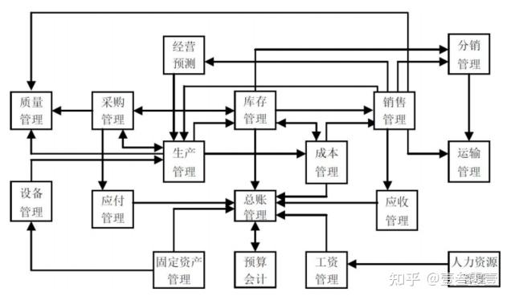

# **三、ERP 核心模块及功能**

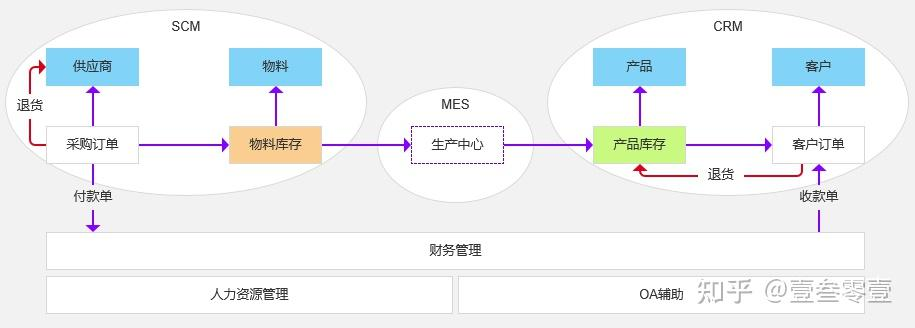

ERP 系统业务核心主要是物料库存、产品库存的管理，采购实现物料的输入，客户订单实现产品的销售，达成物料采购、生产制造、产品销售的核心流程。
系统建设支持业务的执行，对应设计**采购管理、销售管理、库存管理**模块；各业务的执行，需要**财务管理**支持支付、收款。

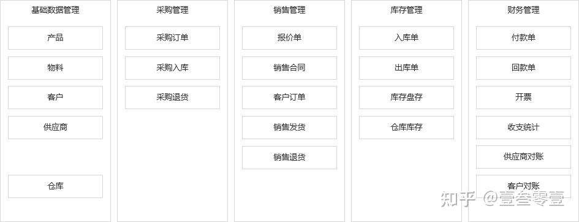

系统建设总体要实现**业务流、资金流**的串通，内在核心需要实现**数据流**的串通。针对各个模块，扩展对应的功能，其中以销售管理，进行模块内容扩展讲解。

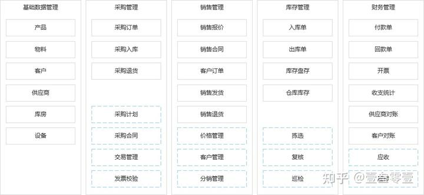

销售的初步是达成合作的共识，并签订法律文件作为运营契约。由产品生产者提供**报价**，分发给潜在**客户**；基于客户合作意愿，双方协定签订**销售合同**，明确双方交易**产品价格**。

在签约好的基础上，直接按照批次进行交易，按**订单**记录、跟进交易过程；完成财务基础条件后，进行**发货**；若是产品异常，存在**退货**情况；实现产品交易过程。

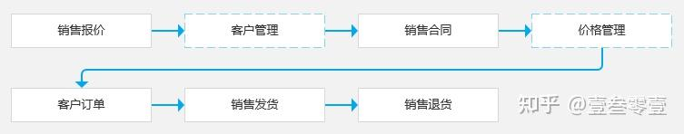

在有合作基础条件下，可以扩展合作意愿。客户可以代理产品，帮助企业**分销**。

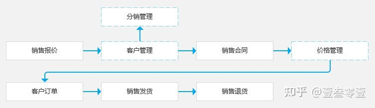

各模块只是业务的关键，本身单模块有多业务内容的实现，需要再次细化为各个功能。

ERP 不仅仅是一套软件，还是一套管理思想。各个企业的业务具体模式存在不同，不能完全照搬。在系统实施落地中，需要以客户业务为基础，ERP 管理思想为支撑，以企业降本增效为目标，来进行系统实施建设。这也是市面上会存有多个 ERP 产品的来源。

经验可以借鉴，产品可以实施部署，但 ERP 是否真正适合企业，还需要企业深入分析、审慎选择。
