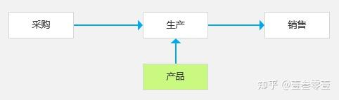
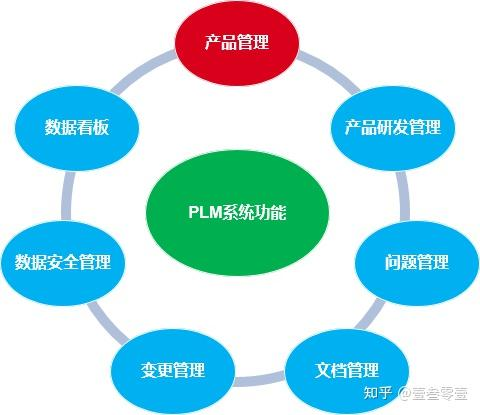

PLM 系统主要实现**产品**模块业务，既包含产品的创意设计、样品打样，也包含产品的批量生产及售后服务。

# **一、PLM 基础信息**

PLM，Product Lifecycle Management，产品生命周期管理。
是一种为企业产品全生命周期提供服务的软件解决方案。以**产品数据**为基础，以**知识库**为核心，以提高研发质量和效率，实现企业信息集成为目标。是集成产品设计、工艺设计与管理的软件数据信息集成平台。

PLM 主要适应于离散型制造企业，尤其适用于汽车及零部件制造，汽车模具制造，通用机械等企业；也适用于医药、军工等研发企业，记录研发过程，精准管控可突破方向，降低研发成本，提高研发成功率。

# **二、PLM 发展历程**

以一款车型产品为例，在产品从设计构想到使用服务，主要生命历程包含：构想、设计、样品、量产、销售、服务等阶段。

研发型产品大部分的生命周期走到样品，就已完结。但在这个过程中，构想的创意点、设计的基础文件、样品制样的过程经验，都是企业形成竞争壁垒的最佳积累。如何有序管理并充分利用这些积累，构建竞争中的领先优势，形成对于管理系统的需要。这也是 EDM 系统的来源，也是 PLM 系统的初始来源。
**EDM**：全称是 Electronic document managements，中文名称为电子文件管理，作用是无差别管理所有文件，不管是 CAD、CAE、CAPP，还是 office 文件，亦或图片文件。单独实现了文件的管理，便于过程经验的积累。

随着系统发展，需要对文档进行分门别类，形成了 PDM。
**PDM**：全称 Product Data Management）中文名称为产品数据管理，管理数据，管理相关文档、制造 BOM，销售 BOM、产品分类等，以产品为中心，进行产品数据的管理。
相当于**点**。

在产品从设计构想到使用服务，是一个完整的生命历程。最终形成 PLM。 PLM: 全称是 product lifecycle management，中文名称生命周期管理，从产品开始预研到产品停止服务，将产品不同时期的数据管理起来。
相当于**线**。

# **三、PLM 核心模块及功能**

**产品管理**：支持产品信息的管理，规定产品输入模版和必填的内容，审批流程，确保产品输入的准确性。
通过实施 PLM 系统能确保企业产品数据的完整性、一致性和正确性，同时也能够方便设计研发人员及相关人员在权限范围内查找到所需数据，实现企业内部的数据共享，避免重复劳动，缩短设计研发周期，提高设计研发质量。

**产品研发管理**：支持管理产品的研发流程管理，贯穿于整个研发部门和环节。
随着研发周期变长，公司越做越大，研发人员越来越多，容易导致需求不清晰，越来越难管理。产品研发管理以市场需求为核心，将产品开发看成一项投资，通过共享模块和跨部门团队准确、快速、低成本、高质量的推出产品。

**问题管理**：支持问题记录、提交解决、修改维护、验证测试、问题关闭的闭环业务流程操作。过程中记录每一成员对问题的操作及操作时间，支持问题的提交、保存、查找、统计、回溯。
一个有借鉴意义的问题可以通过审核转入到“雷区”或经验共享中，以期问题出现之初规避问题，问题出现之后快速解决，问题解决之后复盘优化。

**文档管理**：支持管理产品生命周期中文档的产生、审批和作废的全过程，并且能够在系统中对文档进行快速浏览。
支持创建文档时根据企业编码规则自动生成文档编码。
支持在自定义的关键里程碑进行文档齐套审查，文档不齐全有自动提示。
支持全文检索、打印、水印管理、网络发布。
支持 Office、CAD、PS、源代码等多格式数据存放。

**变更管理**：支持管理产品的更改流程，使数据的修订过程可以被跟踪和管理。提供管理变更请求、变更通知、变更策略、变更执行、变更跟踪等一整套方案。
工程变更时会产生许多相关资料，如变更原因，变更内容，每个审核者的意见、时间，变更的产品批号，客户意见等。这些都会在流程中完整地记录下来，以便将来追踪。审核者也可随时查阅他人的审核意见，以供参考。
支持更改基础机型的 BOM，通过配置管理功能，自动找出派生机型，并更改派生机型。

**数据安全管理**：系统提供多重安全机制来确保数据的安全，使得正确的人在正确的时间可以获得正确的数据，不属于自己权限范围内的数据就无法进行相应的操作。同时系统提供多种赋权方式来简化和系统管理的工作强度。

**数据看板**：支持按照不同角色、不同场景配置数据看板，将最重要、最核心的数据及时反馈对应操作者，以利于及时纠偏，提高设计、生产效率。

要使用 PLM 软件真正管理一个产品的全生命周期，需要与企业经营管理的多系统进行集成。实现 PLM 最大限度跨越时空、地域和供应链信息集成，在产品全生命周期内，充分利用企业资源。PLM 系统的价值取决于在企业内能否与 ERP、SCM、CRM 来集成使用，组成 PLM 生态系统， 实现更全面意义上的协同工作。
