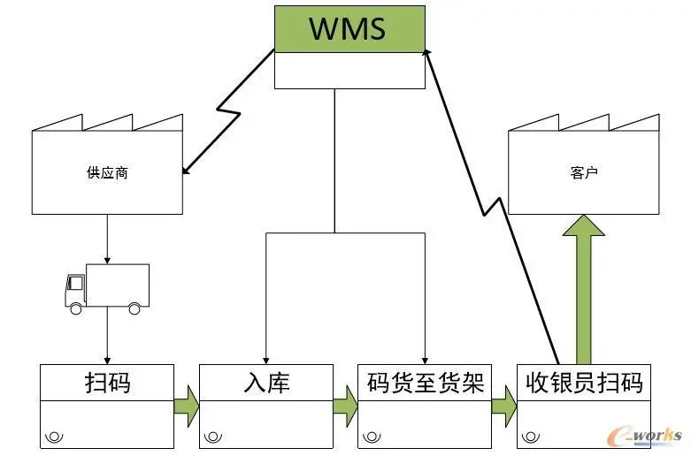
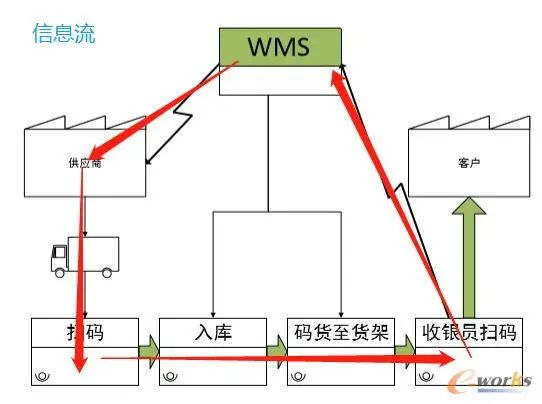
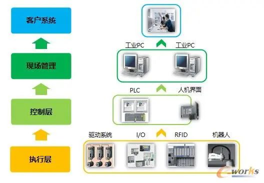
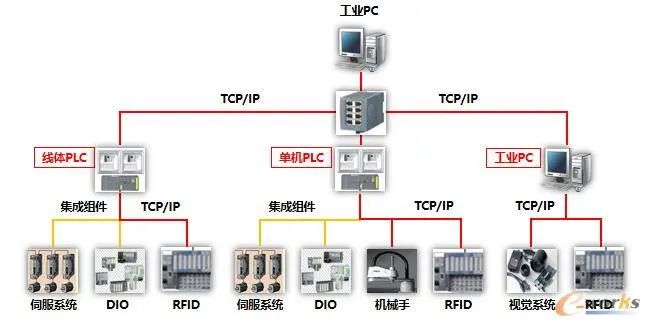

> 近几年，数字化工厂如雨后春笋般，人人都在说，都在做。那么，数字化工厂**究竟是什么**呢？

# 1.**什么是数字化工厂？**

## **1、数字化工厂的定义**

要想理解数字化工厂的概念，我们首先得理解什么是数字化。

**“数字化，即是将许多复杂多变的信息转变为可以度量的数字、数据，再以这些数字、数据建立起适当的数字化模型**，把它们转变为一系列二进制代码，引入计算机内部，进行统一处理，这就是数字化的基本过程。”这一段化来自百度百科，简单概括一下就是将数据、信息、符号、图标等转变成数字信号存入计算机。

对于我们工厂，常见的信息存储介质有二维码、一维码，产品的所有信息：来料、异常、时间周期、生产设备、生产人员等，都可以转换成条码的形式。**我们将数据通过软件录入电脑，电脑生成条码，条码粘贴在产品上；读取时通过扫码枪、手持终端等。**

## **2、如何采集数据？**

### **① 传统人工采集**

传统的工厂在没有导入自动化设备之前，通常都是通过手持扫码的方式录入和采集的。**比如我们常见的快递分拣、商超，也是这种形式。** 

供应商或仓库把商品送到超市时，收货员点检数量，核对单货信息后，将该批次的信息通过扫码枪或人工通过键盘的方式录入电脑。此时电脑软件内拥有了该批次的商品信息，**待客户购买该批次某一件商品时，收银员扫码，此时系统会显示该商品的价格。同时，系统会将商品销账。** 

软件除了上述功能，还有很多智能化的功能。比如说，当该商品库存到达一个设定值时，系统会自动提示管理员进行补货。**这就是一套WMS（Warehouse Management System，仓储管理系统）。**

上图即为商超的WMS系统的流程，**粗线体表示物料实际流转的物理状态流，细的线体表示信息流。**

如上图所示，我们可以看到，商品从供应商到最终客户手里，需要经过“扫码入库、从库里出货码货到货架、然后待客户拣选、最终收银员扫码、客户完成购买”等一长串的流程。**其中可能还会包括商品丢失、理货员报失补货、商品过期退库等诸多流程。**

这是一个开环的流程。

形成了一个信息流的闭环

从该图我们可以看出，从供应商送货到收银员扫码销账形成了一个信息流的闭环。

而商超系统里面，信息的传递是通过人工扫码来实现的，这就是比较传统的一种信息采集方法。

### **② 自动化设备采集**

自动化设备的采集原理和人工采集的原理是一样的，只不过我们产生的数据和数据的存储介质多了一些而已。比如说，我们的传感器数据，也是可以被采集上传给系统的。而这些数据也是可以存储在RFID里面。

最终，采集的数据我们通常会通过网络的形式传入系统。**而系统也会通过网络发送命令给设备，告知设备要生产什么产品。**

**我们可以通过MES/SCADA/PLM/WMS/SAP/SRM等系统构成一个完整的“工厂云平台”。**

这就是我们的数字化工厂，以数字指令的形式来执行订单，出货和异常信息也都会变成数字信息存入我们的系统数据库。

# 二、**我们为什么要做数字化工厂？**

那么，我们记录这些信息有啥用呢？**仅仅只是为了终端客户扫码时能查询到产品信息？能够进行质量追溯吗？**

## **1、数字化工厂的目的**

如上文，超市的WMS流程图，我们可以看到，人工扫码入库和码货至哪一个货架都是由WMS来告知理货员的。WMS的系统可以知道哪一排货架缺了什么商品；仓库内哪一种商品还有多少库存；**它甚至还知道某一种商品比较畅销，可以提醒管理员提前备货。**（数据分析能力/流程控制）

理货员不用跑来跑去频繁查验货架的货物存储量，只需等待系统下达的指令即可。这可大大降低人员的工作量！当然，也会存在一些问题是系统监测不到的，比如说，商品被偷了，或者说有个顾客拿了商品，过会转念一想又不想买了，把商品放置在了其他货架上。这时候，就需要我们的理货员定期做盘点了，**虽然这些是小概率事件，但是通过累积之后，也是不容忽视的。盘点的目的就是为了消除这些系统监测不到的现象。**

这就形成了一套“可视化管理系统”。

## **2、可视化管理系统简介**

**可视化管理系统最早是丰田提出的，是精益生产的一种概念。**最成熟的应用案例就是，我们会把产品的状态标识成“红、黄、绿”等颜色，红色代表报废或者不良、黄色代表在流转或者异常、绿色代表产品正常。

我们也会在WMS建立虚拟货架，标识货架内货物的状态，最终以图表的形式展示给管理者。

**这就是数字化的一个应用，通过可视化的数据引导管理者做出更正确的决策。**

# **三、生产企业数字化的应用**

在生产企业中，我们可以通过数字化**实现产品追溯、质量管理、生产管理、人员管理等。**

比如说，如果有一个产品出现了质量问题，我们可以通过扫码查询到这是哪一个设备生产的，**生产时间和生产人员都可以追踪到。这是数字化最基础的一个应用。**

更深层次的，我们可以把质量信息统计起来，把所有的生产设备形成一个图表监控起来。进而来做数据分析。比如说，我们的系统可以知道，某台设备最近在某个时间段频繁出现不良，那么系统就会告知管理者排查故障。**通过数据分析，我们进行判断是人员问题，还是设备问题。最终解决问题，达到提高产品质量的目的。**

# **四、数字化的最终目标**

工厂实现数字化只是一个阶段性的过程，我们最终是要实现智慧工厂。而在实现智慧工厂的进程中，我们还需要深入贯彻落实精益生产的理念。如上文所述，我们监控设备信息最终是为了提高产品生产质量。**同样的，我们监控库存信息，目的是为了降低库存，提高周转率；监控生产节拍是为了查看瓶颈工艺，进而消灭瓶颈，达到提高产能的目的。**

综上，我们监测任何一种数据最终都是为了**分析数据**，**进而提升产能、降低成本、提高良率**。**数字化和精益生产是相辅相成的，脱离了精益生产而去谈数字化，就都是空谈了。**

> https://mp.weixin.qq.com/s/vQLDEHy5BlQacMT61aHCLw