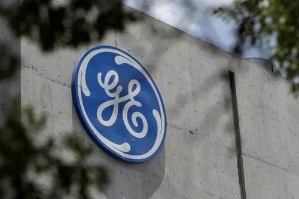
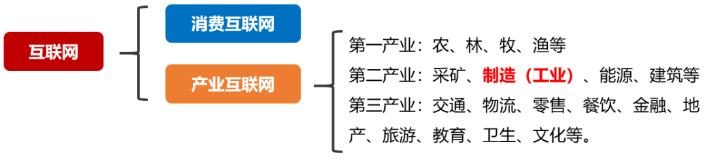
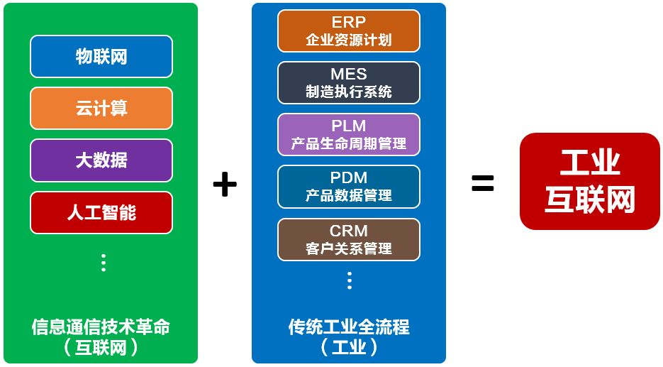
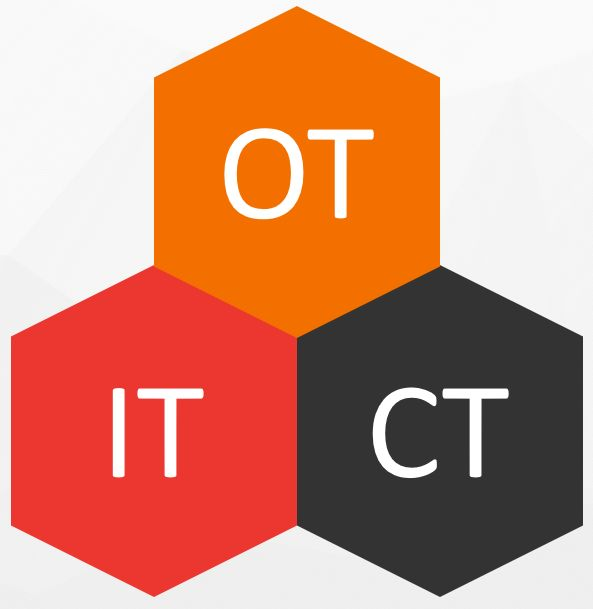
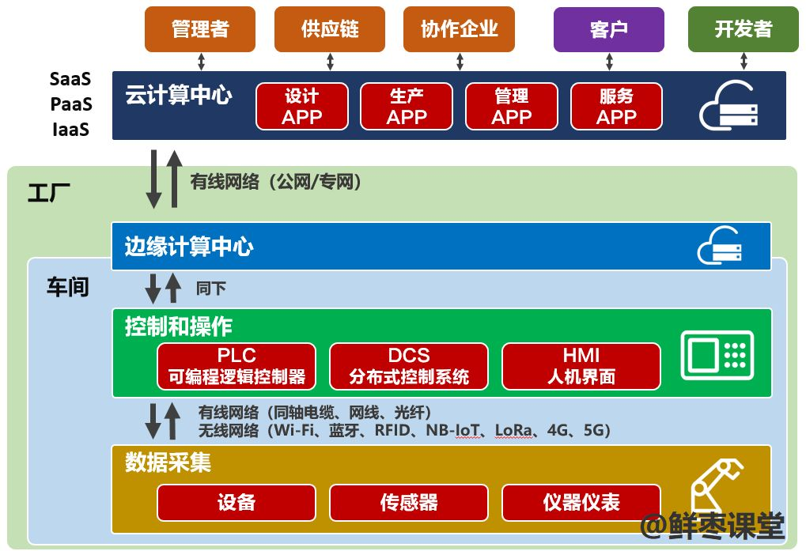

## **1.工业互联网，到底是谁最先提出来的？**

通用电气（GE）。

早在2012年末，通用电气就提出，产业设备应该和IT技术相融合。

2013年，通用电气公司正式提出了工业物联网革命的概念。这也是工业物联网第一次被正式提出来。

通用电气的董事长兼CEO杰夫·伊梅尔特(Jeffrey R. Immelt)说：“一个开放、全球化的网络，将会把人、数据和机器连接起来。”

2014年，通用电气（GE）、AT&T、思科、IBM和英特尔这五家巨头级的公司，在美国宣布成立**工业互联网联盟IIC**。

## **2.工业互联网和工业4.0是同一个东西吗？**

基本上可以理解为同一种理念的不同表达。

工业4.0是德国人提出来的。

本世纪初，全球爆发了多次金融危机，各国经济都受到了沉痛的打击。

尤其是资本市场热捧的高科技产业，泡沫最大，遭受的打击最大。相反，工业和制造业在危机中表现出了很好的抗打击能力。

于是，各国开始重新对工业制造业引起重视。

在这个前提下，德国在2013年4月的汉诺威工业博览会上正式推出了工业4.0战略。它的主要目的，是为了提高德国工业的竞争力，巩固自己的领先优势，在新一轮工业革命中占领先机。

可以看出，工业互联网和工业4.0几乎是同时提出来的，都是旨在对工业进行全面升级改造，应对未来挑战。

## **3.工业互联网就是第四次工业革命吗？**

不是。

第四次工业革命，是以石墨烯、基因、虚拟现实、人工智能、量子技术、可控核聚变、清洁能源以及生物技术为技术突破口的工业革命。

而工业互联网，是现有工业体系的结构和模式升级，是将工业系统与计算、分析、感应和连接技术相融合，最终促成原材料、设备、工人、生产线、供应商、渠道甚至用户的紧密连接。

工业互联网，会采用第四次工业革命相关分支的技术（例如人工智能）。

## **4.工业互联网和产业互联网是什么关系？**

工业互联网的英文叫作 **Industrial Internet** 。Industrial，既有工业的意思，也有产业的意思。

目前行业里对工业互联网的理解存在一定争议。

个人认为，互联网包括消费互联网和产业互联网。**广义的工业互联网（也就是大家口中所说的），其实就是产业互联网。**

而狭义的工业互联网，细究起来，只是产业互联网的一个分支。

国家和政府层面主要是以工业互联网的叫法为主（连主管部门都叫“工信部”），但实际指向更偏向于广义。

不管怎么说，工业互联网和各行各业都有紧密的联系，而非仅限于工业。

##  5.工业互联网是不是就是“工业+互联网”？

不对。

一方面，刚才说了，工业互联网并不是仅指工业。另一方面，工业互联网也不是让工业“上网”这么简单。

工业互联网，是整个产业的数字化、信息化、智能化转型。

它首先通过连接（通信）技术，实现工业生产全流程要素资源的连接，然后通过计算技术，存储并运算数据，挖掘数据价值，优化生产流程，打通薄弱环节，从而实现效率提升、生产力提升、成本下降、利润增长。

准确来说，工业互联网是**“工业技术革命”**和**“ICT（信息通信）技术革命”**相结合的产物，而非“工业+互联网”。

## **6.工业互联网里经常看到OT这个词，OT是什么？**

就像刚才所说，工业互联网是工业技术和信息通信技术结合的产物。

信息通信技术，也就是IT和CT。IT，Information Technology（信息科技）。CT，Communication techonology（通信科技）。

而OT呢，就是工业技术。

准确来说，OT的英文是**Operational Technology**，很多人翻译为运营技术。

我并不认同“运营技术”的译法。我宁愿把它翻译为“操作技术”。

它其实就是指工厂车间里面的那些工业环境和设备，包括机械臂、传感器、仪器仪表、监控系统、控制系统等等。

工业互联网，就是IT、CT、OT的全面融合和升级。它既是一张网络，也是一个平台，更是一个系统，实现了工业生产过程所有要素的泛在连接和整合。

## **7.工业互联网和边缘计算有什么关系？**

工业互联网环境，从网络技术的角度来说，有两个特殊需求，一个是极高的可靠性，另一个，就是极低的时延（或确定性时延）。

工业自动化技术的演进，使得现在工业设备的运转速度和工作精度远超以往。如果网络不能实现实现低时延，将不能满足很多工业场景的需求。

为了降低时延，工业互联网引入了边缘计算。

所谓边缘计算，就是将远在云端的云计算，拉了一部分，下沉到工厂或车间（离终端更近的地方）。这样一来，减少端和算力之间的距离，从而降低时延。

采用边缘计算之后，还能有效解决工厂和云端之间的数据带宽问题。大量的数据在本地得以处理，无需统统上云。

边缘计算还提供了一种新型生态。

就像互联网公司基于云计算开发APP一样，未来，基于边缘计算也会有平台。平台开放公共接口给开发者，开发者针对工厂用户需求，开发APP，给工厂使用。这就是生态。

## **8.工业互联网一定要用5G吗？**

并不是的。

5G是通信技术的最新升级。它有超大带宽、超低延时、海量连接等特点。但是，5G并不是工业互联网的充分必要条件。

行业有成百上千种，场景有成千上万种。

有的场景，可能并没有太多移动性要求，使用光纤甚至网线就可以了。也有的场景，可能对带宽和时延没有太大要求，使用LTE或NB-IoT就可以了。还有的场景，客户可能不希望数据进入运营商网络，或者考虑到成本的因素，想要用Wi-Fi甚至LoRa这样的私有网络技术，也不一定不行。

工业互联网的精髓不在于连接，而是计算。工业互联网的操作系统、平台、数据、应用，才是最关键的部分。

5G不是万金油，它将和众多通信技术长期共存。5G在行业的落地，将是一个漫长的过程。

## **9.工业互联网和人工智能有什么关系？**

人工智能一样是服务于场景的。

当产业逐步实现数字化之后，会产生大量的数据，形成数据流。数据流不仅帮助数据挖掘分析，也助推了人工智能场景的落地。

举个简单的例子，当高速照相机对产品进行质量检测时，仅凭人力观看图片，效率是很低的。如果引入AI，用大量的图片数据去训练它，就可以替代人工，提升检测效率。

往更高的层面来说，如果把AI引入工厂管理流程，统一协调供应、生产、物流、销售等环节，将极大地减少库存，使生产资源达到优化极致，缩减成本，获得利润。

换句话说，有人工厂变成无人工厂，连厂长未来都有可能是AI。

随着人工智能的不断演进，工业互联网这个系统将会实现**工况自感知**、**工艺自学习**、**装备自执行**、**系统自组织**。

这个，就是智能制造的最高境界。

## **10. 工业互联网的推进速度会有多快？**

工业互联网是一个既快又慢的过程。

说它快，是因为如果你想要搞工业互联网，现在很多行业都已经有现成的案例，有很多的解决方案可以直接参考。你可以很快起步。

说它慢，是因为工业互联网的彻底实现是一个极其漫长的过程。

它不是一种商品，不是某种硬件或软件，你买了就马上能用，用了就能自诩为工业互联网的“成功实践者”。

它是对现有企业进行伤筋动骨的改造。你的整个生产流程、管理制度、组织架构、运营模式，都要随之改变。而且，不仅是你自己要变，你的上游供应链，下游经销商，也要跟着变。不然，你的数字化，就像大哥大时代的iPhone，一点用也没有。

工业互联网既需要大量的投资，也需要企业软实力的跟进，你的员工素质和能力，也需要能够支撑你的改造意图。如果人不会用，或者企业文化不接受，那你花再多的钱，也是打水漂。

## **11.工业互联网，到底有哪些玩家？**

工业互联网的主要玩家有以下几类：

首先，是互联网公司。像阿里、腾讯这样的互联网公司，是工业互联网的重要推手。

凭借在消费互联网积累的经验和实力，这类公司可以说最懂互联网。消费互联网目前下半场都打得差不多了，一片红海，所以，他们寄希望于在各个产业能打开市场，获取新的利润增长点。

但是，产业互联网和消费互联网完全不同的玩法，也许会让他们改变想法。

第二类，是传统工业巨头。

这些巨头，是一群最懂行业的人。例如三一重工、海尔、格力等。他们非常懂行业，与此同时，他们也搞了一段时间的信息化和数字化，颇有心得。

但是，同行是死敌。某一行业巨头的解决方案或技术，在同行业具有天然的“被排斥性”。工业互联网涉及骨髓的改造，几乎就是一个企业的身家性命，想让他交给同行？这有点难。

第三类，运营商。

运营商作为基础设施的建设者，不甘心沦为管道，所以积极致力于开发行业解决方案，撬开企业市场。手机移动通信市场惨烈的竞争，还有大幅下滑的利润，也是鞭策运营商加大B端市场投入的重要原因。

不过，运营商所谓的B端市场经验，更多也就是卖了多年的专线。卖解决方案，搞应用落地？目前看好像不是很乐观。这需要心态和思想观念的全面转型，也是漫漫长路。

第四类，是设备商。

说白了，最主要就是华为。

华为搞B端市场的经验比互联网公司更多。鉴于华为在芯片、操作系统、数据库还有生态方面的飞速进步，使得它成为工业互联网中不可忽视的力量。

百行千业，千军万马。庞大的工业互联网市场，是一个巨大的蛋糕。在激烈的蛋糕争夺中，谁也不知道，会不会一个不起眼的力量就此崛起，成为黑马。

对于中小企业，小枣君建议不要轻易投资工业互联网。否则不仅短期内看不到回报，还有可能手术失败，直接嗝屁。

对于开发者，我建议关注细分领域的机会。工业互联网，工业是核心，信息通信黑科技是赋能。深入研究产业，合理利用科技，找到自己的第一性原理，更有在未来把握住机会，实现崛起。
