所谓 SOP，英文是 Standard Operating Procedure——即标准作业程序。

指将某一事件的标准操作步骤和要求以统一的格式描述出来，用于指导和规范日常的工作。

SOP 的精髓是将细节进行量化，通俗来讲，SOP 就是对某一程序中的关键控制点进行细化和量化。

## 作业标准化解决十大问题

### 一、员工方面

员工方面，作业标准化能解决的问题有：

#### 1、新员工上手慢

关于这点，麦当劳是典型的例子。麦当劳招收新员工，哪怕是兼职大学生，稍作培训后，以作业指导书为参照，员工很快可以上手作业。如果缺乏作业指导书，那么，只能师傅盯着徒弟做，上手慢是不争的事实。

#### 2、培训员工没有依据

没有作业指导书，员工培训只能手把手地教。有了作业指导书，可以让员工先看一遍作业指导书，再依照作业指导书进行培训教导，效率会非常高。

#### 3、员工缺乏开展作业改善的动力

作业指导书表明了作业的基本要素与内容，这给了员工开展作业改善必要启迪，甚至对现有作业提出质疑，发现改善的机会。

### 二、作业方面

作业方面，作业标准化能解决的问题有：

#### 4、作业改善缺乏基础

没有作业标准化，改善缺乏向上跳登的平台，即便有心开展改善，也常常面临不知从何处着手的问题。

#### 5、作业改善成果无法固化

作业改善取得了成果，如果不加以固化，很可能被忘却或者被“束之高楼”，而作业标准化就是固化这些改善的重要途径。

#### 6、好的作业手法或经验无法推广运用

每个人的作业手法并不相同，当中有优秀的作业手法，如果没有作业指导书，那么就缺乏推广这类优秀作业手法或经验的渠道。

#### 7、难以对员工作业做出评估

作业标准化通常有对于标准产能的估算，如果员工实际作业超出了标准产能，那么说明员工作业效能超出了常规，反之则低于常规，这样对员工作业的状况就可以做出相对客观的评估。

### 三、产品方面

产品方面。作业标准化能解决的问题有：

#### 8、产品出问题难以追溯到当时的作业规范

质量管理中，确保一定的可追溯性可以找到质量问题发生的原因。有了作业标准化，产品出现问题时，可以追溯到当时的作业标准化版本，进而可以明确当时所用的工艺、物料、作业方法等，进一步查明产生问题的原因。

#### 9、产品一致性差，不良率居高不下

缺乏作业标准化，张三一个做法，李四一个做法，做出来的产品自然一致性很差，这种情景下，产品质量就难以保证。确保产品一致性，可以说是作业标准化的一个主要功能。

### 四、技术方面

技术方面。作业标准化能解决的问题主要指：

#### 10、专业技术不能得到有效推广

有些产品具有一定的技术性，通常只能依赖于人。如果将这些计划标准化在作业标准之中，那么受人的因素影响就会减少，而且，专业技术能够得到更大范围的运用。

不少企业的运营管理，将作业标准化工作当作重中之重的一项事务，是有其道理的，因为这项工作能够解决十大问题。

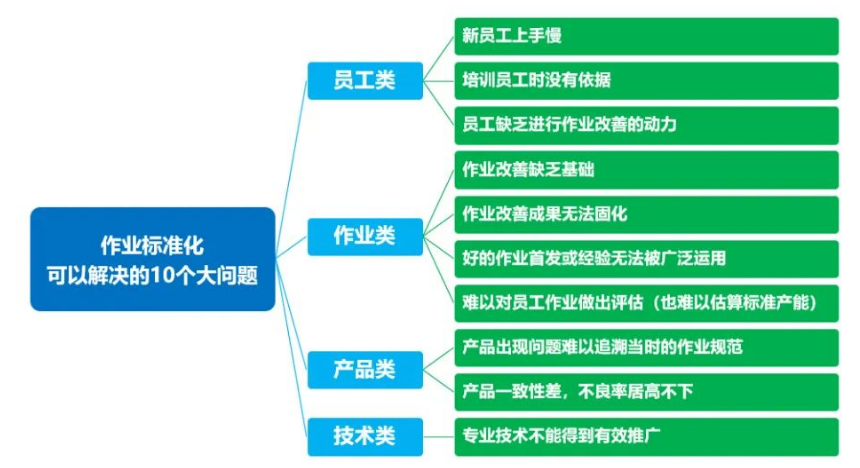

## **为什么制作 sop**

企业做 SOP 的目的和意义，从企业的根本目的来看，无非是为了提高管理运营能力，提升专业化水平，使企业获得更大的效益。

许多岗位的人员经常会发生变动，二是一些日常的工作的基本作业程序相对比较稳定。不同的人，由于不同的成长经历、性格、学识和经验，可能做事情的方式和步骤各不相同。即使做事的方式和步骤有相同，但做每件事的标准和度仍会有一些差异

利用 sop 来规范，让做事的人能够快速上手，统一评价的标准，对做的事情的质量也有更多的保障。

SOP 本身也是在实践操作中不断进行总结、优化和完善的产物，在这一过程中积累了许多人的共同智慧，因此相对比较优化，能提高做事情的效率。通过每个 SOP 对相应工作的效率的提高，企业通过整体 SOP 体系必然会提高整体的运行效率。

另外按照 SOP 的相关规定来做事，就不会出现大的失误。即使出现失误也可以很快地通过 SOP 加以检查发现问题，并加以改进。同时，有了 SOP，保证了我们日常工作的连续性和相关知识的积累，也无形中为企业节约了一些管理投入成本

## **流程与 SOP 的区别**

流程具有完整独立的交付物，它们通常跨越岗位，跨越部门，也可以只由一个人独立完成。

操作指导书和 SOP 只由一个业务角色执行的活动，虽然这个活动也会有几个步骤。

标准作业程序比流程层级更低，它是流程下面对具体活动进行控制的程序，是对作业活动的描述。

标准作业程序是针对活动中的某一个或多个具体事项的操作而制定的标准动作。标准作业程序将相关操作步骤进行细化、量化、优化，然后固化形成标准。

总体看高阶流程包含 sop，sop 是高阶流程的节点，sop 是针对单个部门单个岗位，多个 sop 组成了某个岗位的指导说明书

## **制作 sop 的步骤**

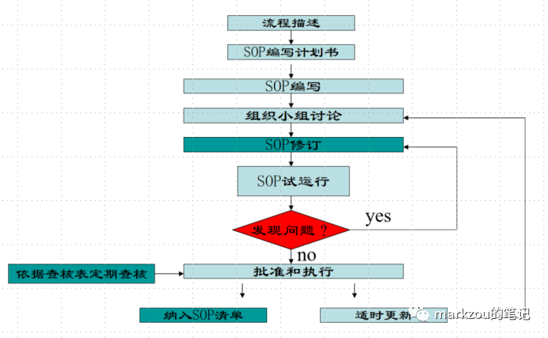

A、**流程描述**

首先将相应的主流程图做出来，然后根据主流程图做出相应的子流程图，并依据每一子流程做出相应的程序。在每一程序中，确定有哪些控制点，哪些控制点应当需要做 SOP，哪些控制点不需要做 SOP，哪些控制点是可以合起来做一个 SOP 的，包括每一个分类，都应当考虑清楚，并制定出来。

### B、**Sop 编写计划书**

明确 SOP 的编号、工序名称、编写人、初稿完成时间、小组讨论时间及最终的定稿时间

### C、**SOP 的讨论修订**

让 sop 的相关方参与讨论，各方统一认识，达成共识，如果有必要，到现场进行确认，编写人员要有实操经验或者对相关事务非常熟悉。

I、应先将相应的执行步骤列出来，并将执行步骤对应的物料名称及数量、工具名称及规格、执行人、所执行的标准、风险防控

Ii、按时间的先后顺序来划分

Iii、按照公司的模板在编写 SOP 时，不要改动模板上的设置；

Iv、对于一些 SOP，可能除了一些文字描述外，还可以增加一些图片或其他图例，目的就是能将步骤中某些细节进行形象化和量化。

主要参照 5W1H 方法及 smart 方法进行编写

5W1H 即是 who、what、where、why、when、how

WHAT——需要执行的任务

HOW——执行此任务所需要的详细步骤

WHEN——步骤的先后顺序；

说明某一具体步骤需要的具体时间；

要进行下一步所需满足的特定条件

WHO:——表明程序的执行人及所涉及到的其它人员

WHERE——指明使用的工具、设备及所在位置

WHY——解释进行此步骤和任务的原因

SMART 原则（S=Specific、M=Measurable、A=Attainable、R=Relevant、T=Time-bound）

Specific——描述清晰明确

Measurable——所做的事情能购进行衡量，有数据

Attainable——描述的事情要能够实现

Relevant——步骤之前，事项之间有强烈的相关性

Time-based——有时间限制

在语言描述上：精准、逻辑严谨、简单明白、无歧义

### **D、SOP 的试运行**

通过实践来检验 SOP 的合理性和可操作性

### **E、定稿、批准、执行**

根据试运行情况，对 SOP 进行适当的优化，批准实施，并对 SOP 的执行情况进行监督。

### **F、更新**

当流程、工具、设备等发生改变，一些操作方法改进时，要对 SOP 进行评审和更新。并且安排人员进行定期回顾，将回顾结果纳入更新内容，将正式发布的 SOP 列入 SOP 清单。比如下方为一个岗位的 sop 集合。

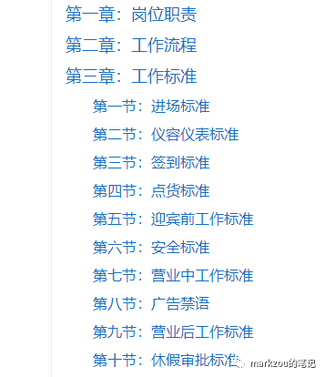

## **Sop 示例**

以下为各行各业 sop 示例

### **制造类型**

组装一种设备的上盖

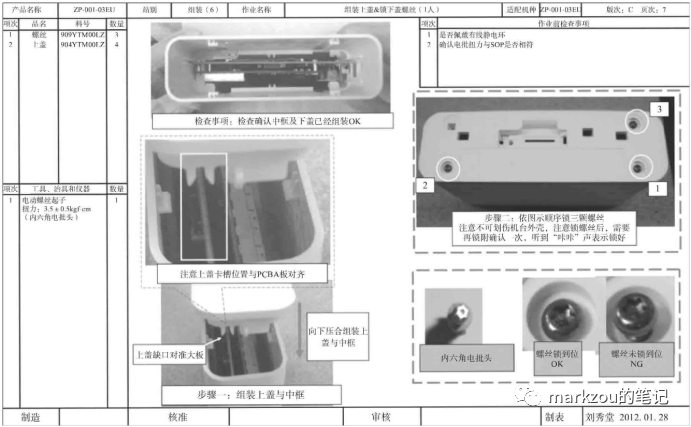

### **餐饮海底捞**

**嫩鸡肉片**

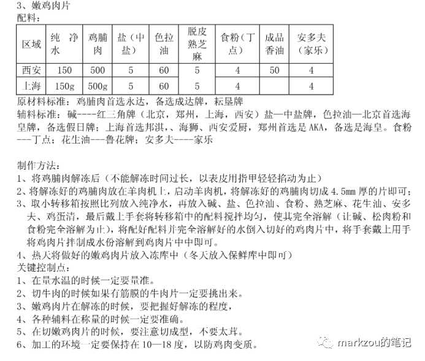

**小馒头的制作**https://www.docin.com/p-2314820135.html

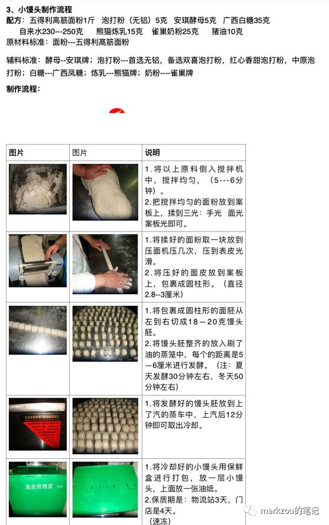

**麦当劳**

###

薯条制作

https://wenku.baidu.com/view/652ee292c2c708a1284ac850ad02de80d4d806df.html?_wkts_=1689498180003&bdQuery=%E9%BA%A6%E5%BD%93%E5%8A%B3sop

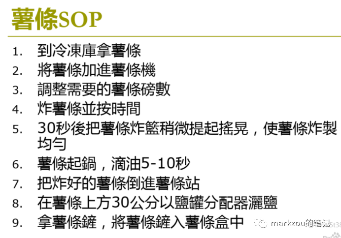

### **零售胖东来**

散装茶岗位https://baike.azpdl.net/#/entry/56d7eb20-c0ab-49bd-9add-a4b1697ff0eb

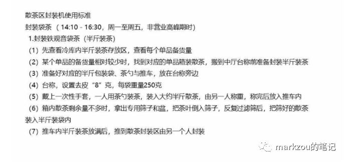

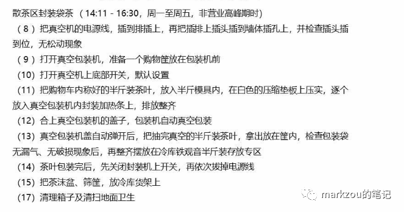

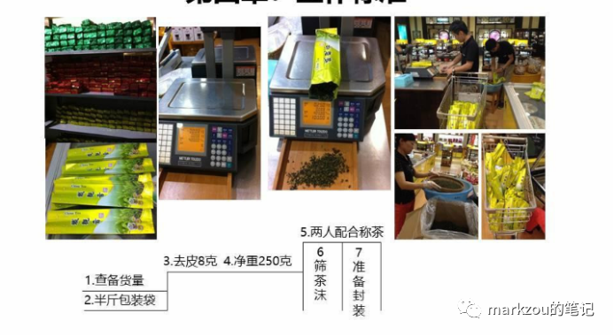

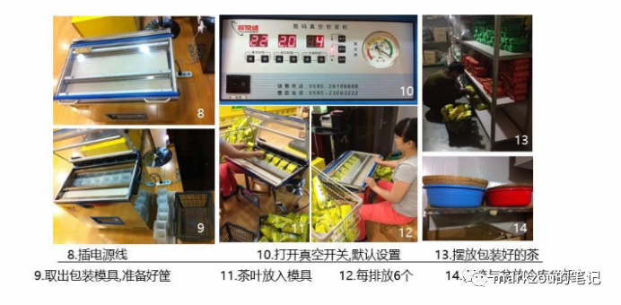

### **卫生打扫**

如下打扫卫生的 sop，准备》吸尘》刮洗》湿拖》不锈钢保洁》检查。

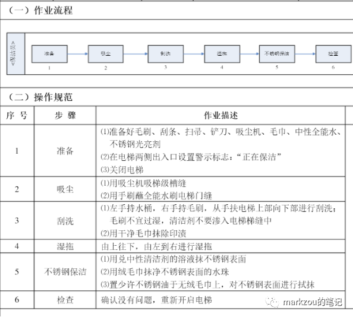

## **总结**

保证产品和服务的一致性——SOP 的本质就是标准化、专业化、规范化从而保障不断做事情的质量，保障整个业务运行的稳定性。

技术和经验的传承——SOP 就是将隐性的知识变得显性化——将企业积累下来的技术﹑经验记录在标准文件中,以免因技术人员的流动而使技术流失。让营盘真正不会随着人员的流转而停转，做到人员流转而业务不受影响。

· 用于人员的培训。利用 SOP 培训操作人员，使操作人员经过短期培训即可快速掌握较为先进的操作技术。

SOP 作为企业最基本、最有效的管理工具，方便和简化了管理人员的管理工作。

如果业务要不断发展，就需要减少对个人的依赖，不断增强系统的能力，而 sop 就是对系统能力的赋能。

> https://mp.weixin.qq.com/s/RwzLHlWaV5cvCn2J80n0Fg
