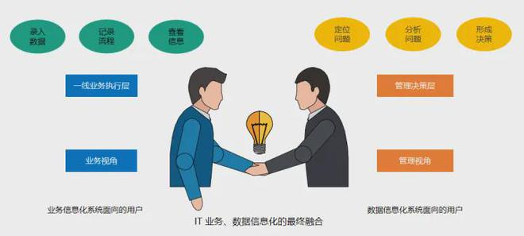
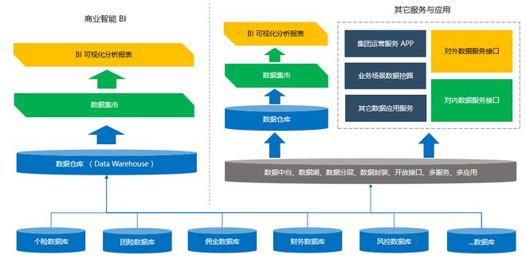
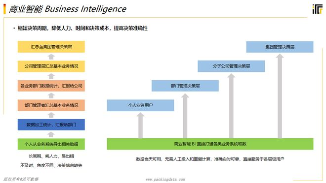

- 业务流、信息流、 数据流

了解业务流、信息流和数据流之间的逻辑关系可以解答 BI 项目规划、建设过程中遇到的很多的问题，帮助我们解惑，不管多复杂的问题，只要思考的深度足够，都可以快速帮助我们定位问题的根源。

## **业务流、信息流、数据流都是什么意思**

### 业务流

简单理解就是业务流程、业务过程管理、业务规则等等，就是一家企业你的业务流程怎么跑，怎么来管理的。

### 信息流

就是将业务流**线上化、标准化、规范化**。于是，企业的业务在运转，依靠的就是线上的各种信息化的业务系统，数据在各个系统中就得到了沉淀。

### 数据流

站在 BI 的角度，数据要在各个系统中横向打通，BI 就是解决数据流、数据应用这个层面的问题。

所以，简单串起来就是企业要有自己的业务管理流程，为了提升管理流程的效率，于是就构建了各种各样的业务系统，最终数据得到了沉淀。最后，通过 BI 来解决数据应用、数据分析层面的问题。

## **BI 项目遇到的问题**

再了解这个大致的概念之后，回到 BI，大部分 BI 项目中遇到的问题、数据层面上遇到的问题，很大一部分都是由信息流和业务流引起的，可以倒推到这两个层面。

比如，分析指标的颗粒度不够、数据不能获取、数据质量的问题，有系统用户就是不用，也不好好填数。这样导致很多本不应该在 BI 层面解决的问题，都在落地 BI 的过程中出现了。这些很明显就不是数据流层面的问题，这个就是信息流、信息化层面的建设出现了问题。

但是有些深层次的问题如果顺着信息流往下追踪的时候，就发现其实根源在于业务流层面。在企业的业务流程、内部业务管理标准都没有统一的情况下，信息流自然也无法很好的支撑，最终传递到数据层面，自然就很差。

在企业里面落地 BI 的过程中，需要通过数据表象层面的问题去深入的分析问题的根源。是没有系统支撑，还是系统支撑的不好，还是因为企业内部业务管理问题造成业务系统本身在当初建设的时候就建的不好。

通过 BI 项目的建设就可以暴露出这些问题，反馈给企业，后期这些问题就都需要解决。根源上的问题解决不好，也会有一些折中的办法，但是治标不治本。

# **BI 的认知**

有的时候我们会遇到一些企业的 CIO，或者 BI 项目负责人，有些我们可能聊过一次就没有办法再继续聊了。为什么，因为我们发现有些对于数据的理解、对于 BI 的认知方向可能是错误的，错误的方向还在坚持，这种 BI 项目不管谁去做，可能都是失败。根源就是意识不到业务流、信息流、数据流三者的关系。

比如在一些大的集团，本身集团层面更多的都是战略管控，真正的业务运营都落在二级集团或以下的企业。所以从业务流的角度，能够够的着就是对人的管理、财的管理、物的管理。

因此，从信息流的角度，集团统建的系统可能就是人力、财务、合同采购管理，对应的就是业务流中的人、财、物。但是，非要在一级集团层面深入到具体的多板块业务分析，想要在数据流层面搞定这些诉求。看下这个过程就发现，数据流依赖的是信息流，具体的业务系统集团层面是无法直接获取的。

比如供应链的管理、销售、生产、物流等这些具体的业务单元就不是放到集团层面去建设的，缺乏底层信息化系统的支撑，数据自然就拿不到。最终，搞来搞去，发现只能通过填报来报送数据，就失去了自动化数据处理和应用的意义了。

另外，从业务流层面，一级集团的管理流程、管理边界不会深入到一个具体的业务细节，这种管理深度也够不着。所以，业务流、信息流的条件都不成立，在数据流层面再怎么使劲都是徒劳。

但并不是说上面提到的场景不能解决，当然是有方式解决的。但解决一个问题的前提就在于你需要清楚的知道这个问题的根源，能看明白一件事情才能更好的解决这件事情。如果看都看不明白，自然这种复杂的问题解决起来就不是那么容易了。

我们碰到一些企业，那我们就上一个中台，弄一个数据治理、建个 BI，这些都不是技术层面的问题。再牛的技术也解决不了因为一个错误的方向延伸出来的问题，方向规划错误，一切都是白搭。只能是交学费踩坑，踩的多了，就慢慢能够意识到原来问题的根源在这，就成长了。

# 参考

https://www.163.com/dy/media/T1646820537030.html
