有朋友私信我，说希望了解数仓的整体建设中的细节及模板。那有啥说的，下面直接上干货！

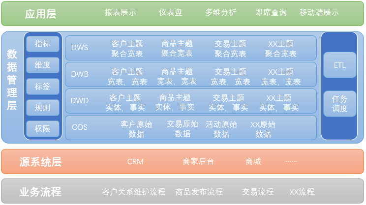

数仓全景图镇楼

# **一、建设过程**

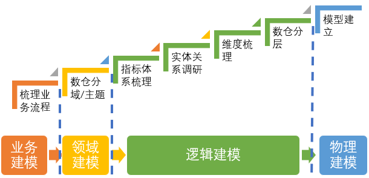

数仓建模的过程分为业务建模、领域建模、逻辑建模和物理建模，但是这些步骤比较抽象。

为了便于落地，笔者根据自己的经验，总结出上面的七个步骤：梳理业务流程、垂直切分、指标体系梳理、实体关系调研、维度梳理、数仓分层以及物理模型建立。

每个步骤不说理论，直接放工具、模板和案例。

**详见：**[从 0 到 1 建设数据仓库（附 PPT）](http://mp.weixin.qq.com/s?__biz=MzkyMDE5ODYwMw==&mid=2247502248&idx=1&sn=4763a49a38fb696120b1c714a71deb0c&chksm=c194050cf6e38c1a573030d4a4dc3c216b3a4fd2b234fdad7b8bd15d062f126f2a920a85aee0&scene=21#wechat_redirect)

# **二、业务流程**

1、找到公司核心业务流程，找到谁，在什么环节，做什么关键动作，得到什么结果。

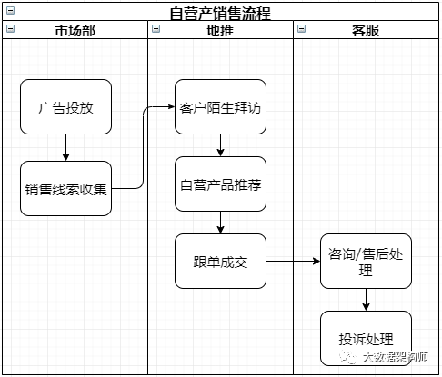

2、梳理每个业务节点的客户及关注重点，找到数据在哪。

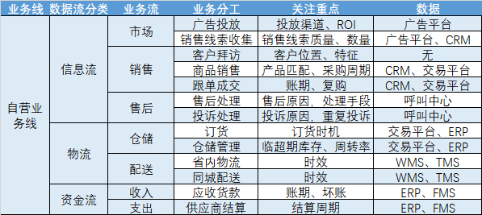

# **三、分域 / 主题**

3、决定数仓的建设方式，快速交活，就用自下而上的建设。要全面支撑，就顶层规划，分步实施，交活稍微慢点。

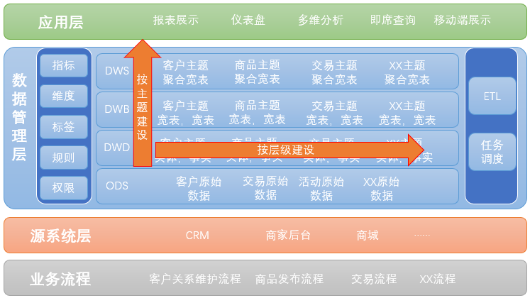

4、同时按照业务领域划分主题域。主题域的划分方法有：按业务流划分（推荐）、按需求分、按职责分、按产品功能分等。

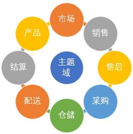

**详见：**[一文读懂数仓主题与主题域划分方法](http://mp.weixin.qq.com/s?__biz=MzkyMDE5ODYwMw==&mid=2247509227&idx=1&sn=22a07e395c68f185bb0d96d7c6454787&chksm=c194684ff6e3e1597e57fb2855fe24986a45fc59937216409a9c40b290a4537163401da1fcac&scene=21#wechat_redirect)

# **四、指标体系**

5、指标的意义在于统一语言，统一口径。所以指标的定义必须有严格的标准。否则如无根之水。

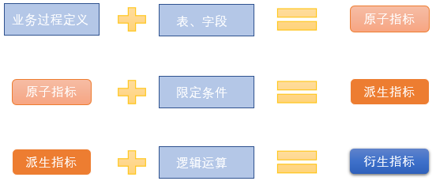

指标可分为原子指标、派生指标和衍生指标，其含义及命名规则举例如下：

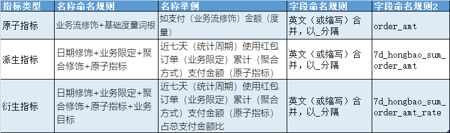

6、依照指标体系建设标准，开始梳理指标体系。整个体系同样要以业务为核心进行梳理。同时梳理每个业务过程所需的维度。维度就是你观察这个业务的角度，指标就是衡量这个业务结果   好坏的量化结果。

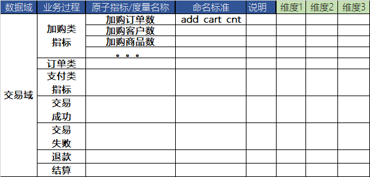

请注意，此时不能被现有数据局限。如果分析出这个业务过程应该有这个指标，但是没有数据，请标注出来，提出收集数据的需求。

**详见：**[终于有人把数据指标体系讲明白了](http://mp.weixin.qq.com/s?__biz=MzkyMDE5ODYwMw==&mid=2247505865&idx=1&sn=62a1a48edb67ff04863e3e6b7828b4c8&chksm=c1941b6df6e3927b4575be7cf444db24a2f92c3365255b73736f7972b3960166958cf6c167ba&scene=21#wechat_redirect)

# **五、实体关系**

7、每个业务动作都会有数据产生。我们将能够获取到的数据，提取实体，绘制 ER 图，便于之后的维度建模。

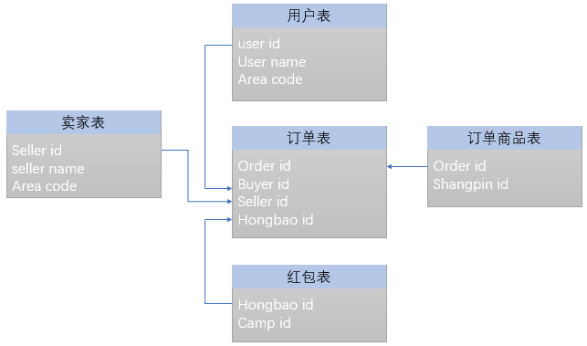

8、同样以业务过程为起点向下梳理，此时的核心是业务表。把每张表中涉及的维度、指标都整理出来。

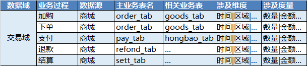

**详见：** [数据仓库 4 种建模方法与实例剖析](http://mp.weixin.qq.com/s?__biz=MzkyMDE5ODYwMw==&mid=2247507854&idx=2&sn=4462fbb87f295b6b24bc7cb80f2ed682&chksm=c194132af6e39a3ccba6c95f64d0e98d98045264d39ce3f764ed97d200acd88cb67a754a47b9&scene=21#wechat_redirect)

# **六、维度整理**

9、维度标准化是将各个业务系统中相同的维度进行统一的过程。其字段名称、代码、名字都可能不一样，我们需要完全掌握，并标准化。

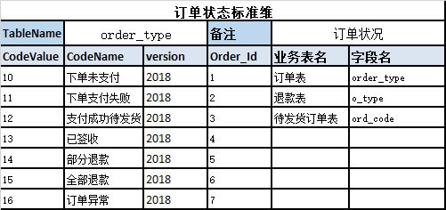

维度的标准尽可能参照国家标准、行业标准。例如地区可以参照国家行政区域代码。

另外，有些维度存在层级，如区域的省、市、县。绝大多数业务系统中的级联就是多层级维度。

**详见：**[数据仓库维度建模概念解析](http://mp.weixin.qq.com/s?__biz=MzkyMDE5ODYwMw==&mid=2247501907&idx=2&sn=a818bb487cc4ab378b0807bf3c41ccb4&chksm=c19404f7f6e38de10a819793fe876f2c491a18e0b6293dc1a530e1a34d043e821a47fbba773c&scene=21#wechat_redirect)

# **七、数仓分层**

10、数据仓库一般分为 4 层，名字可能会不一样，但是其目的和建设方法基本一致：

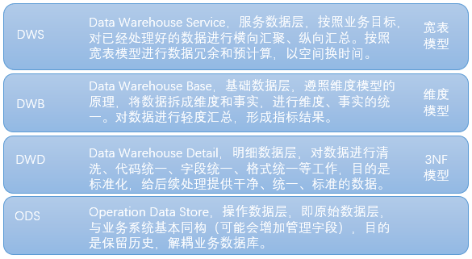

每一层采用的建模方法都不一样，其核心是逐层解耦。越到底层，越接近业务发生的记录，越到上层，越接近业务目标。

11、依托数仓分层的设计理论，根据实际业务场景，我们就可以梳理出整体的数据流向图。这张图会很清晰的告诉所有人，数据从那来，到哪里去，最终提供什么样的服务。

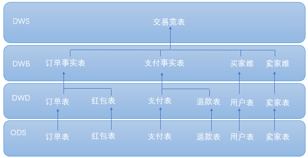

详见： [详解数据仓库分层架构](http://mp.weixin.qq.com/s?__biz=MzkyMDE5ODYwMw==&mid=2247489978&idx=2&sn=ef8564263958b293c0fe96f3e792b4ee&chksm=c197d51ef6e05c08f6c6c44a33e0bab67ffa0c56c9719738afd05555c9e4a5619919f7802f7b&scene=21#wechat_redirect)

**八、模型建立**

12、此时才真正进入纯代码阶段。数仓、ETL 工具选型；ETL 流程开发；cube 的建立；任务调度，设定更新方式、更新频率；每日查看日志、监控 etl 执行情况等等。

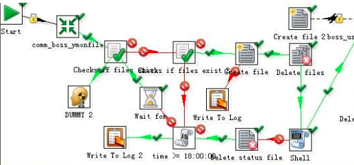

前面梳理清楚了，ETL 会变的非常清晰。

**Tips：**

1、数仓建设须从业务中来，到业务中去。

2、数仓分层的目的是业务解耦。

3、无论哪种建模方式，其核心是业务实体。

4、按领域建设能快速交活，后遗症将会在 2 年之后爆发，且难以解决。

5、数仓建设应该把 75% 的时间投入到设计阶段，如果不是，那你就惨了。

6、数仓本身也可以迭代。

7、传统数仓并没有一种叫做 “宽表模型” 的模型，大数据时代新诞生的名词，因为很多大数据组件 join 代价极高。实际上是范式退化。

**大家都在看：**

[1、](http://mp.weixin.qq.com/s?__biz=MzkyMDE5ODYwMw==&mid=2247483708&idx=1&sn=f019e5f55296c14b87a0cded749474e2&chksm=c197cd98f6e0448e9c776b27cae228b308fd96b2f0dd956457ad50102ffdc0bd0659a91d6ef0&scene=21#wechat_redirect)[大数据能力平台建设方案（PPT）](http://mp.weixin.qq.com/s?__biz=MzkyMDE5ODYwMw==&mid=2247496977&idx=1&sn=87ccf7255e4d732ce01b3bedcaec9cac&chksm=c19439b5f6e3b0a3d2edc19b5a701d3cc1c5e0e49c36cd84b5eac6502c669256ea70e9947ad0&scene=21#wechat_redirect)

2、[数据分类分级方法、标准及应用实践](http://mp.weixin.qq.com/s?__biz=MzkyMDE5ODYwMw==&mid=2247504820&idx=1&sn=3daaef9324fddfdaf28317b44690fcf6&chksm=c1941f10f6e39606ec0a2c14a4fb7f5998fefbe80fc0e7cf4edcf6128adb0041c20e7dee3879&scene=21#wechat_redirect)

[3、](http://mp.weixin.qq.com/s?__biz=MzkyMDE5ODYwMw==&mid=2247483686&idx=1&sn=5861c2d488319748d5333ade5be79945&chksm=c197cd82f6e0449426bf30db8b7c63397e27f922bf732376c175a04ee87811dece4e0fc36857&scene=21#wechat_redirect)[华为数字化转型：从战略到执行（PPT）](http://mp.weixin.qq.com/s?__biz=MzkyMDE5ODYwMw==&mid=2247492959&idx=1&sn=5ed013bb4c4e55996f98d74d9f6985c5&chksm=c19429fbf6e3a0eddd1ba260bfb8d59b76285ebbfd3ef825848709dd50adb04edc31a397c09a&scene=21#wechat_redirect)

[4、](http://mp.weixin.qq.com/s?__biz=MzkyMDE5ODYwMw==&mid=2247483708&idx=2&sn=16eb56cb2336f64d6fd76afbb5293a81&chksm=c197cd98f6e0448ee67572f15b5e5ec3726b287314fb9a0e5120564d11e968e8d6d128dfb3af&scene=21#wechat_redirect)[数据治理咨询项目：《XX 集团数据管理办法》.doc](http://mp.weixin.qq.com/s?__biz=MzkyMDE5ODYwMw==&mid=2247507861&idx=1&sn=3862b40ad3da34cf8b2e77c91959f37d&chksm=c1941331f6e39a27b8bb881fb299b60ac1762663f53e2c54aeb4c12fc1deb96b957ed389088e&scene=21#wechat_redirect)

5、[数据治理体系架构设计方案（PPT）](http://mp.weixin.qq.com/s?__biz=MzkyMDE5ODYwMw==&mid=2247491569&idx=1&sn=249fe8e4a37310db63984a58cb9a3606&chksm=c197d355f6e05a435e6ad92136258ced8497da21e26f6585bb61f592dc896b233fabb4a4de1a&scene=21#wechat_redirect)

6、[华为 VS 阿里数据中台建设方法论](http://mp.weixin.qq.com/s?__biz=MzkyMDE5ODYwMw==&mid=2247500473&idx=1&sn=6457bd90e040f57001ac2b1c9e660c50&chksm=c1940e1df6e3870b8863c4858b754784ba250171c9bfa6a79063f16a804484b08608dd5eac24&scene=21#wechat_redirect)

7、[一文读懂 DAMA 数据治理工程师认证考试（内含福利）](http://mp.weixin.qq.com/s?__biz=MzkyMDE5ODYwMw==&mid=2247489773&idx=1&sn=1784453c5b37213297e5d69f98f1746f&chksm=c197d449f6e05d5fd6fdbd1f570bbc5c1c8645b37992ad3ecc7dea0bc3581772acc38791e5af&scene=21#wechat_redirect)

8[、](http://mp.weixin.qq.com/s?__biz=MzkyMDE5ODYwMw==&mid=2247483730&idx=1&sn=890f4b1f6b9951924c38d2793bfa05ee&chksm=c197cdf6f6e044e0788a1694add2927bfca7e079471ca9396913b4dd2f6c5215b9e76f3d4f4b&scene=21#wechat_redirect)[终于有人把数据指标体系讲明白了](http://mp.weixin.qq.com/s?__biz=MzkyMDE5ODYwMw==&mid=2247505865&idx=1&sn=62a1a48edb67ff04863e3e6b7828b4c8&chksm=c1941b6df6e3927b4575be7cf444db24a2f92c3365255b73736f7972b3960166958cf6c167ba&scene=21#wechat_redirect)

[9、](http://mp.weixin.qq.com/s?__biz=MzkyMDE5ODYwMw==&mid=2247483916&idx=1&sn=98e18921522b5a7ae52e8f40cd0ff3e6&chksm=c197cea8f6e047be9f00dd0744bd52f6a71be8e33f8df5a55e87542f247c34face424f490483&scene=21#wechat_redirect)[数据安全治理体系建设思路和方法](http://mp.weixin.qq.com/s?__biz=MzkyMDE5ODYwMw==&mid=2247498860&idx=2&sn=d4609b89f807250f3fa8f51d00dcec42&chksm=c19430c8f6e3b9deb99fb12364cfa2c8a71105800096210bfc1a32a9ad716188f9a53505c107&scene=21#wechat_redirect)

[10、](http://mp.weixin.qq.com/s?__biz=MzkyMDE5ODYwMw==&mid=2247483745&idx=1&sn=19117dedd3684baa342990bfae4683f2&chksm=c197cdc5f6e044d34c14f98ff3919a61f14e83574b83b26a08489a392c66a59c02992a555a3a&scene=21#wechat_redirect)[数据资产目录建设方案](http://mp.weixin.qq.com/s?__biz=MzkyMDE5ODYwMw==&mid=2247497586&idx=1&sn=bc13414ada87656e5c861c656cc92258&chksm=c1943bd6f6e3b2c0b068f8916fdcc17fc6675adf6630a98debaff4a9d34cfdb5fbe0f84c1361&scene=21#wechat_redirect)

11、[非结构化数据治理方案](http://mp.weixin.qq.com/s?__biz=MzkyMDE5ODYwMw==&mid=2247501462&idx=1&sn=62c5fa8b37c0fcc29e4760fb74b1179d&chksm=c1940a32f6e38324d22444d7b72a70e4d874fbb0ea7f08504ae5d081a7169f6b7535a16686ea&scene=21#wechat_redirect)

12、[德勤：集团主数据管理方法论（PPT）](http://mp.weixin.qq.com/s?__biz=MzkyMDE5ODYwMw==&mid=2247495603&idx=1&sn=f75bc7084f5baa683ce65b5d45e09dc1&chksm=c1942317f6e3aa0198d64d6baad583a6669f4b63917cb3b137aeac1476bc7c405e0663f478f4&scene=21#wechat_redirect)

13、[企业大数据平台顶层规划设计方案（PPT）](http://mp.weixin.qq.com/s?__biz=MzkyMDE5ODYwMw==&mid=2247495877&idx=1&sn=2c63a45d50fa94ac712dcf2481641100&chksm=c1943c61f6e3b577e0614b434823d5ac0c9a85209890fd58a7627fb1a481b85b1efd65300842&scene=21#wechat_redirect)

14、[终于有人把数据中台讲明白了](http://mp.weixin.qq.com/s?__biz=MzkyMDE5ODYwMw==&mid=2247504486&idx=1&sn=2ff8902a72bab590e8b1effe12edbc5f&chksm=c1941ec2f6e397d4e0dfdbce353a0c268de002dfa45cf92b731f46763b83909f87d93cfc7653&scene=21#wechat_redirect)

15、[企业数字化转型之道（PPT）](http://mp.weixin.qq.com/s?__biz=MzkyMDE5ODYwMw==&mid=2247502248&idx=1&sn=4763a49a38fb696120b1c714a71deb0c&chksm=c194050cf6e38c1a573030d4a4dc3c216b3a4fd2b234fdad7b8bd15d062f126f2a920a85aee0&scene=21#wechat_redirect)
