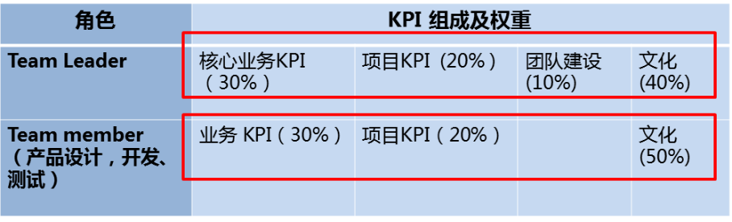
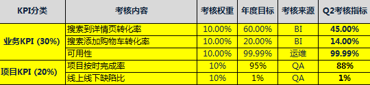
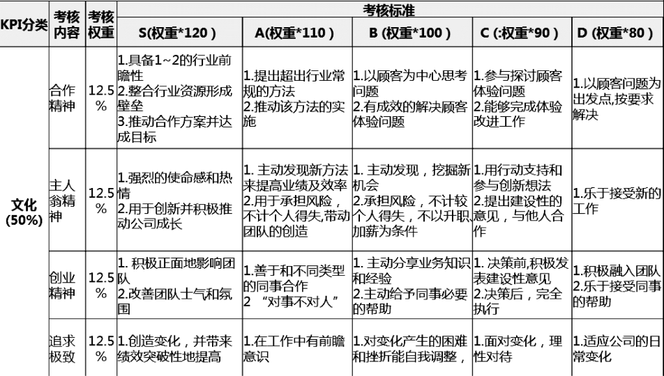
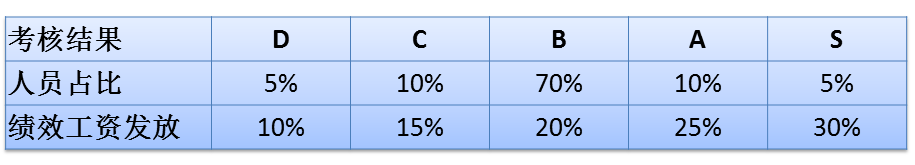

如何设计技术团队的绩效考核方案呢？绩效考核方案应该从框架设计、KPI 组成和权重设计、实施计划，这三个步骤进行搭建和实施。

绩效考核制度应该考察哪些方面呢？笔者的建议是从“文化”和“KPI（Key Performance Indicator，关键绩效指标）”两个维度进行考核。“文化”关注的是过程，员工在工作中体现出来的精神层面的状态，如合作精神、自我驱动力、主人翁精神和追求卓越等；“KPI”体现的是执行的结果，团队必须无条件地对结果负责。把过程和结果两方面结合起来进行考察，更接近员工的真实绩效。

第一步，绩效考核制度框架设计。从考核周期、打分公式、绩效等级和人员占比等方面进行框架的搭建。

考核周期，一般来说有季度考核、半年考核两种，月度考核的成本相对比较高，很少有公司采取月度考核。以季度考核为例，通常在该季度最后一个月的 20~25 号进行考核。值得注意的是，季度绩效考核，是在下季度第一个月里一次性体现上季度 3 个月的绩效。

考核分数的计算公式为：考核分数 = KPI 考核分数 + 季度加分 - 季度减分。其中 KPI 考核分数，分为文化得分、KPI 得分和团队建设得分，下面会详细介绍每一项得分是如何设计的。

绩效等级，是建立绩效等级的档位，以及每个档位人员占比、绩效工资发放比例。如图所示，设计了 5 个档位的绩效等级，假设一个员工的薪资组成是“80%基本工资+20%绩效工资”，那么 B 档员工，人数占比为 70%，领取全部 20%的绩效工资，即 B 档员工当季度绩效工资不加也不减，全额发放；S 档是优秀员工，人数占比为 5%，绩效工资发放比例是 30%；D 档是后进员工，人数占比为 5%，绩效工资发放比例是 10%。

下面来看两个例子，以便掌握如何计算员工的绩效工资。

1）Andy 月薪 10k，第一季度考评结果是 S。

Andy 实际工资为：10 000 + 10 000 ×（30% - 20%）× 3 个月 = 13 000

2）Tom 月薪 10k，第一季度考评结果是 D。

Tom 实际工资为：10 000 + 10 000 ×（10% - 20%）× 3 个月 = 7 000

以上介绍了考核制度的整体框架，接下来讲解 KPI 组成和权重设计。

第二步，KPI 组成和权重设计。秉承文化和 KPI 并重的原则进行权重设计，如图所示。KPI 分数由业务 KPI 和项目 KPI 组成，占比为 50%，文化分占比为 50%，其中需要注意的是，Team leader 还有 10%的团队建设分。

核心业务 KPI 和项目 KPI 如何定义呢？以搜索开发小组的 KPI 定义为例，如图所示，其中核心 KPI 必须能够代表开发团队主要的业务指标，最多不超过 3 项，项目 KPI 指的是工作完成情况和质量情况。

文化分如何定义和考核呢？根据各公司企业文化的不同，考核的内容也不尽相同。以一个互联网门户公司为例，如图所示，文化分成合作精神、主人翁精神、创业精神和追求极致 4 个方面，每一项目占比为 12.5%，合起来占比为 50%。在打分中按员工实际表现进行打分，一般可采取员工自评、主管评分、评级评分的类似于 360 度考核的方式，加权平均后得出最后的文化分。

另外，还应该给予部门主管、项目经理一定的加减分权，对一些表现突出或欠佳的员工进行分数的最后调整，这在实际考核中是个有益补充，但不建议这部分占比太高，否则就变成主观分了。

第三步，实施计划。在搭建完绩效考核体系后，就可以展开绩效考核试点工作了。通常需要进行 1~2 次的试打分，让员工熟悉整个考核方法，在试运行期间只打分，不影响实际的绩效。管理人员也可以通过试运行的情况，来看看这个考核体系是不是真实反映了员工的业绩。

绩效考核开始实施的时候，会遇到来自于员工和管理层的抵触，这是很自然的反应，所以在实施的过程中，最好有一名经验丰富的人力资源部同事帮助，有条件的话可以聘请外部培训公司进行培训指导，帮助管理者做“绩效面谈”技能的培训、考核制度讲解等。通常需要经过多轮宣讲、逐个团队宣讲才能得到认可。

绩效考核的实施，需要结合 IDP 来进行。IDP（Individual Development Plans），就是个人发展规划，是指导团队成员提高个人能力的工具。

IDP 关注的主体是团队中的每个成员，核心目的是提高个体的能力。

IDP 的构成要素是：待发展项、当前现状、成功指标、行动计划。

## 如何制定 IDP 呢？

判断一个 IDP 质量好坏的标准是：待发展项是不是个人职业发展的瓶颈所在，是否以事实为依据，成功指标是否让人有动力，行动计划是否与时间绑定。

### 制定 IDP 包含以下要素：

**待发展项**。 待发展项就是需要提高的能力。这些能力一定要是个人职业发展的瓶颈所在，通常不会超过 3 项。待发展项对于个人而言是最需要提高的能力，而不是对整个团队最重要的能力。例如，对于一位老员工，提高“业务理解能力”虽然很重要，但这通常不是他职业发展的瓶颈，对于他来说明显有更重要的待发展项。团队中的每个人的待发展项不能都一样。

**当前现状**。 认清现实是推动改变的基础，分析或规划要以事实为依据。要客观地描述某项能力相关的实际情况，尽量描述事实本身，而不是对事实的评论或分析。如“辅导团队成员的能力很弱”就是典型的评论而非描述，而“从未对团队成员进行过一对一指导”就是对现实情况的描述。

**成功指标**。 成功指标是待发展项得到提高之后，个人应该达到的状态。成功指标是 IDP 中最重要的部分，它描绘的是你未来的状态，这个状态应该是美好的、激动人心的、有挑战性的，而不能是呆板且常规的。成功指标应该是具体的、可衡量的，甚至可以是充满细节的，这样才能够以此来判断现实与目标的差距，激发改进的动力。

**行动计划**。 行动计划要能够落地，关键在于要与时间绑定。与时间绑定有两种方式，一种是设截止日期，一种是设时间循环。一个行动，要么是在某个截止日期前完成，要么是以某个周期循环执行，两者必选其一。不与时间绑定的行动计划只是一堆代办事项，而不是计划。

## **团队 Leader 如何进行 IDP 的辅导**

团队 Leader 与每名成员每半个季度安排一次 1 对 1 的沟通辅导，在季度初和季度中集中进行，每次不少于 20 分钟，成员提前更新好 IDP 文档，对自身发展充分思考，准备好问题，辅导结果落实在 IDP 文档中。辅导的要点是：回顾本阶段的工作表现，说明优点和缺点；对成员的待发展项给出指导意见；Review 相关指标与行动计划的细节；解答疑问，收集团队成员的建议。

## 以上内容，摘自畅销书《技术人修炼之道》，作者黄哲铿，曾担任 1 号店 技术总监、壹药网 技术副总裁、海尔农业电商 CTO，出版过畅销书《技术管理之巅》，擅长互联网大型系统研发、大型技术团队治理、区块链创新等。

title: 如何做好 Code review
date: 2023-08-31 11:36:20
permalink: /pages/KPI/
categories:

- 项目
  tags:
- author:
  name: andanyang
  link: https://github.com/andanyoung

---

如何设计技术团队的绩效考核方案呢？绩效考核方案应该从框架设计、KPI 组成和权重设计、实施计划，这三个步骤进行搭建和实施。

绩效考核制度应该考察哪些方面呢？笔者的建议是从“文化”和“KPI（Key Performance Indicator，关键绩效指标）”两个维度进行考核。“文化”关注的是过程，员工在工作中体现出来的精神层面的状态，如合作精神、自我驱动力、主人翁精神和追求卓越等；“KPI”体现的是执行的结果，团队必须无条件地对结果负责。把过程和结果两方面结合起来进行考察，更接近员工的真实绩效。

第一步，绩效考核制度框架设计。从考核周期、打分公式、绩效等级和人员占比等方面进行框架的搭建。

考核周期，一般来说有季度考核、半年考核两种，月度考核的成本相对比较高，很少有公司采取月度考核。以季度考核为例，通常在该季度最后一个月的 20~25 号进行考核。值得注意的是，季度绩效考核，是在下季度第一个月里一次性体现上季度 3 个月的绩效。

考核分数的计算公式为：考核分数 = KPI 考核分数 + 季度加分 - 季度减分。其中 KPI 考核分数，分为文化得分、KPI 得分和团队建设得分，下面会详细介绍每一项得分是如何设计的。

绩效等级，是建立绩效等级的档位，以及每个档位人员占比、绩效工资发放比例。如图所示，设计了 5 个档位的绩效等级，假设一个员工的薪资组成是“80%基本工资+20%绩效工资”，那么 B 档员工，人数占比为 70%，领取全部 20%的绩效工资，即 B 档员工当季度绩效工资不加也不减，全额发放；S 档是优秀员工，人数占比为 5%，绩效工资发放比例是 30%；D 档是后进员工，人数占比为 5%，绩效工资发放比例是 10%。

下面来看两个例子，以便掌握如何计算员工的绩效工资。

1）Andy 月薪 10k，第一季度考评结果是 S。

Andy 实际工资为：10 000 + 10 000 ×（30% - 20%）× 3 个月 = 13 000

2）Tom 月薪 10k，第一季度考评结果是 D。

Tom 实际工资为：10 000 + 10 000 ×（10% - 20%）× 3 个月 = 7 000

以上介绍了考核制度的整体框架，接下来讲解 KPI 组成和权重设计。

第二步，KPI 组成和权重设计。秉承文化和 KPI 并重的原则进行权重设计，如图所示。KPI 分数由业务 KPI 和项目 KPI 组成，占比为 50%，文化分占比为 50%，其中需要注意的是，Team leader 还有 10%的团队建设分。

核心业务 KPI 和项目 KPI 如何定义呢？以搜索开发小组的 KPI 定义为例，如图所示，其中核心 KPI 必须能够代表开发团队主要的业务指标，最多不超过 3 项，项目 KPI 指的是工作完成情况和质量情况。

文化分如何定义和考核呢？根据各公司企业文化的不同，考核的内容也不尽相同。以一个互联网门户公司为例，如图所示，文化分成合作精神、主人翁精神、创业精神和追求极致 4 个方面，每一项目占比为 12.5%，合起来占比为 50%。在打分中按员工实际表现进行打分，一般可采取员工自评、主管评分、评级评分的类似于 360 度考核的方式，加权平均后得出最后的文化分。

另外，还应该给予部门主管、项目经理一定的加减分权，对一些表现突出或欠佳的员工进行分数的最后调整，这在实际考核中是个有益补充，但不建议这部分占比太高，否则就变成主观分了。

第三步，实施计划。在搭建完绩效考核体系后，就可以展开绩效考核试点工作了。通常需要进行 1~2 次的试打分，让员工熟悉整个考核方法，在试运行期间只打分，不影响实际的绩效。管理人员也可以通过试运行的情况，来看看这个考核体系是不是真实反映了员工的业绩。

绩效考核开始实施的时候，会遇到来自于员工和管理层的抵触，这是很自然的反应，所以在实施的过程中，最好有一名经验丰富的人力资源部同事帮助，有条件的话可以聘请外部培训公司进行培训指导，帮助管理者做“绩效面谈”技能的培训、考核制度讲解等。通常需要经过多轮宣讲、逐个团队宣讲才能得到认可。

绩效考核的实施，需要结合 IDP 来进行。IDP（Individual Development Plans），就是个人发展规划，是指导团队成员提高个人能力的工具。

IDP 关注的主体是团队中的每个成员，核心目的是提高个体的能力。

IDP 的构成要素是：待发展项、当前现状、成功指标、行动计划。

## 如何制定 IDP 呢？

判断一个 IDP 质量好坏的标准是：待发展项是不是个人职业发展的瓶颈所在，是否以事实为依据，成功指标是否让人有动力，行动计划是否与时间绑定。

### 制定 IDP 包含以下要素：

**待发展项**。 待发展项就是需要提高的能力。这些能力一定要是个人职业发展的瓶颈所在，通常不会超过 3 项。待发展项对于个人而言是最需要提高的能力，而不是对整个团队最重要的能力。例如，对于一位老员工，提高“业务理解能力”虽然很重要，但这通常不是他职业发展的瓶颈，对于他来说明显有更重要的待发展项。团队中的每个人的待发展项不能都一样。

**当前现状**。 认清现实是推动改变的基础，分析或规划要以事实为依据。要客观地描述某项能力相关的实际情况，尽量描述事实本身，而不是对事实的评论或分析。如“辅导团队成员的能力很弱”就是典型的评论而非描述，而“从未对团队成员进行过一对一指导”就是对现实情况的描述。

**成功指标**。 成功指标是待发展项得到提高之后，个人应该达到的状态。成功指标是 IDP 中最重要的部分，它描绘的是你未来的状态，这个状态应该是美好的、激动人心的、有挑战性的，而不能是呆板且常规的。成功指标应该是具体的、可衡量的，甚至可以是充满细节的，这样才能够以此来判断现实与目标的差距，激发改进的动力。

**行动计划**。 行动计划要能够落地，关键在于要与时间绑定。与时间绑定有两种方式，一种是设截止日期，一种是设时间循环。一个行动，要么是在某个截止日期前完成，要么是以某个周期循环执行，两者必选其一。不与时间绑定的行动计划只是一堆代办事项，而不是计划。

## **团队 Leader 如何进行 IDP 的辅导**

团队 Leader 与每名成员每半个季度安排一次 1 对 1 的沟通辅导，在季度初和季度中集中进行，每次不少于 20 分钟，成员提前更新好 IDP 文档，对自身发展充分思考，准备好问题，辅导结果落实在 IDP 文档中。辅导的要点是：回顾本阶段的工作表现，说明优点和缺点；对成员的待发展项给出指导意见；Review 相关指标与行动计划的细节；解答疑问，收集团队成员的建议。

以上内容，摘自畅销书《技术人修炼之道》，作者黄哲铿，曾担任 1 号店 技术总监、壹药网 技术副总裁、海尔农业电商 CTO，出版过畅销书《技术管理之巅》，擅长互联网大型系统研发、大型技术团队治理、区块链创新等。
