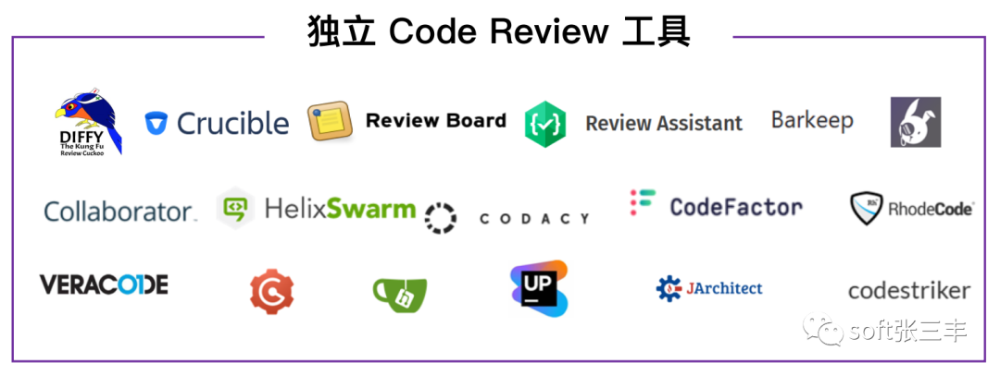
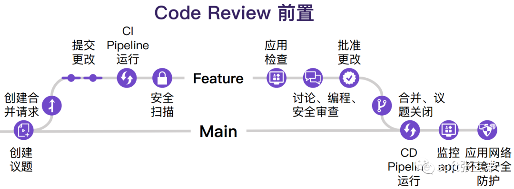

> 保证质量和代码的可读性可维护性，同时可以帮助团队快速成长
> 如果团队新成立，还在磨合，可能编码规范就需要多注意；
> 比如团队稳定，编码规范掌握的比较好，使用的语言也是熟悉的语言，那么可能 review 的重点就会放到业务逻辑方面；
> Code Review 的流程
> CodeReview 的标准
> CodeReview 的工具

# Code Review

**CodeReview 是一种有意识和系统地召集其他程序员来检查代码是否有错误的地方的过程。** 它的主要目的是保证代码的质量。在敏捷团队中推行 CodeReview，可以帮助团队快速成长。在进行 CodeReview 之前，需要满足一些前提条件，比如代码可以顺利运行、项目测试人员已经做过单元测试，以及开发人员对代码已经基本了解。CodeReview 是一种用来确认方案设计和代码实现的质量保证机制，通过这个机制我们可以对代码、测试过程和注释进行检查。

**CodeReview 是一种软件质量保证活动，它是由一组或者一个人检查某个软件产品的源代码以发现并修复错误的过程。** 这个过程可以帮助提高软件的整体质量，提高代码的可读性和可维护性，同时也可以帮助团队成员之间分享知识，学习新的技术或者最佳实践。

**CodeReview 可以在开发过程中的任何阶段进行，但是通常会在代码编写完成之后和代码测试之前进行。** 在一些团队中，CodeReview 是发布新代码的必要步骤，只有当代码通过了 CodeReview，才能被合并到主分支并部署到生产环境。

# Code Review 的流程

CodeReview 的流程和标准可以因组织和项目而异，但通常包括以下步骤：

1. **选择审查人员**： 确定进行代码审查的人员，通常包括团队成员、技术领导或专门的代码审查人员。

2. **审查准备**： 审查人员在进行代码审查之前，需要了解项目的背景和目标，以及代码的设计和实现细节。他们可以查看相关文档、需求规格和设计文档等。

3. **代码审查**： 审查人员仔细检查代码的各个方面，包括代码结构、逻辑、可读性、性能、安全性等。他们可以使用静态代码分析工具来帮助检测潜在的问题。审查人员还可以提出改进建议和指导，例如优化代码、改进算法、修复错误等。

4. **提交审查意见**： 审查人员将审查意见和建议提交给代码的作者。这可以通过代码审查工具、电子邮件或会议等方式进行。

5. **讨论和解决问题**： 代码的作者和审查人员之间进行讨论，解决审查意见中提出的问题和改进建议。这可以通过会议、电子邮件或代码审查工具的评论功能进行。

6. **更新代码**： 代码的作者根据审查意见进行必要的修改和改进。他们可以提交更新后的代码供审查人员再次审查。

7. **完成审查**： 一旦代码经过修改和改进，审查人员进行最终的审查，确认问题已解决并提出进一步的建议。一旦审查人员认为代码符合要求，代码可以继续进行后续的测试和发布流程。

# CodeReview 的标准

CodeReview 的标准通常包括以下方面：

1. **代码风格**： 代码应符合组织或项目的代码风格指南，包括缩进、命名规范、注释等。

2. **代码结构和逻辑**： 代码应具有清晰的结构和良好的逻辑，避免冗余、复杂或混乱的代码。

3. **可读性**： 代码应易于理解和阅读，包括良好的命名、注释和文档。

4. **性能**： 代码应具有良好的性能，避免低效的算法和操作。

5. **安全性**： 代码应具有良好的安全性，避免潜在的安全漏洞和风险。

6. **错误处理**： 代码应具有适当的错误处理机制，能够处理异常和错误情况。

7. **单元测试**： 代码应具有良好的单元测试覆盖率，以确保代码的正确性和稳定性。

8. **可维护性**： 代码应易于维护和扩展，包括模块化、可重用性和解耦等。

通过进行代码审查，可以提高代码质量、减少错误和问题，并促进团队成员之间的沟通和学习。

# CodeReview 的工具

CodeReview 的工具可以包括以下内容：

1. **静态代码分析工具**： 静态代码分析工具可以帮助检查代码中的潜在问题，例如代码中的错误、不规范的编码风格、潜在的性能问题等。常见的静态代码分析工具有 SonarQube、PMD、FindBugs 等。

2. **版本控制工具**： 版本控制工具可以帮助团队协作开发和进行代码审查。常见的版本控制工具有 Git、SVN 等。

3. **在线代码审查工具**： 在线代码审查工具可以帮助团队成员进行远程代码审查，方便团队成员之间的交流和反馈。常见的在线代码审查工具有 GitHub、GitLab 等。

4. **代码评审工具**： 代码评审工具可以帮助团队成员进行代码质量评估和审核，包括代码风格、逻辑错误等方面。常见的代码评审工具有 Crucible、Review Board 等。

5. **代码质量度量工具**： 代码质量度量工具可以帮助团队成员评估代码的质量，包括代码复杂度、测试覆盖率等方面。常见的代码质量度量工具有 JaCoCo、Cobertura 等。

6. **测试工具**： 测试工具可以帮助团队成员进行单元测试、集成测试、性能测试等。常见的测试工具有 JUnit、Selenium 等。

以上只是一些常见的 CodeReview 工具，具体使用哪些工具还需要根据团队的需求和实际情况来确定。

开源的 Code Review 项目

以下是一些开源的 Code Review 项目：

1. **Gerrit**：Gerrit 是一个基于 Git 的代码审查工具，它提供了一个 Web 界面，用于查看、评论和合并代码变更。它是 Android 开源项目所使用的代码审查工具。

2. **Phabricator**：Phabricator 是一个开源的软件开发协作平台，其中包括了代码审查工具。它提供了一个交互式的 Web 界面，用于查看、评论和合并代码变更。

3. **Review Board**：Review Board 是一个开源的 Web 应用程序，用于进行代码审查。它支持多种版本控制系统，包括 Git、Mercurial 和 Subversion，并提供了一个易于使用的界面，用于查看和评论代码变更。

4. **Crucible**：Crucible 是一个商业的代码审查工具，但它的核心功能是开源的。它提供了一个 Web 界面，用于查看、评论和合并代码变更，并与其他开发工具（如 JIRA 和 Confluence）进行集成。

5. **RhodeCode**: RhodeCode 是一个开源的代码审查和代码管理工具，支持 Git、Mercurial 和 Subversion。它提供了代码审查、权限管理、全文搜索等功能。

6. **GitLab**: GitLab 是一个基于 Web 的 Git 仓库管理工具，也提供了代码审查功能。用户可以在合并请求中进行代码审查，还可以在代码中添加评论。

7. **Barkeep**: Barkeep 是一个轻量级的代码审查工具，支持 Git。用户可以在 Web 界面上查看代码差异，添加评论，并通过电子邮件接收审查通知。

8. **Codebrag**: Codebrag 是一个简单易用的代码审查工具，支持 Git 和 Subversion。它的审查流程非常简单，只需要查看代码差异，然后添加评论即可。

这些项目都具有不同的特点和功能，你可以根据自己的需求选择适合的项目进行代码审查。

