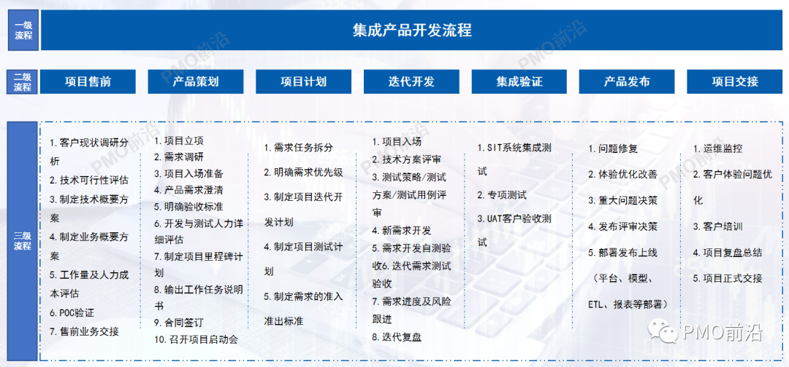
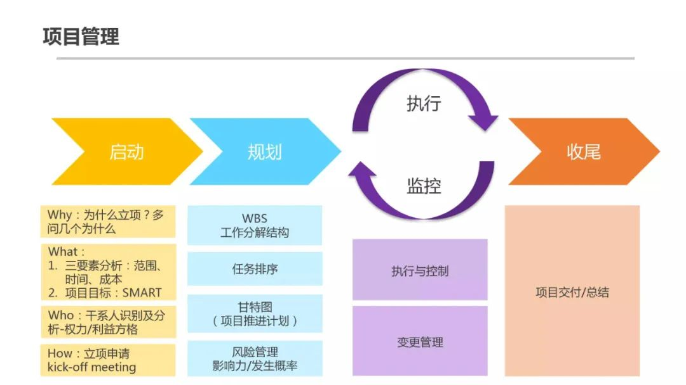
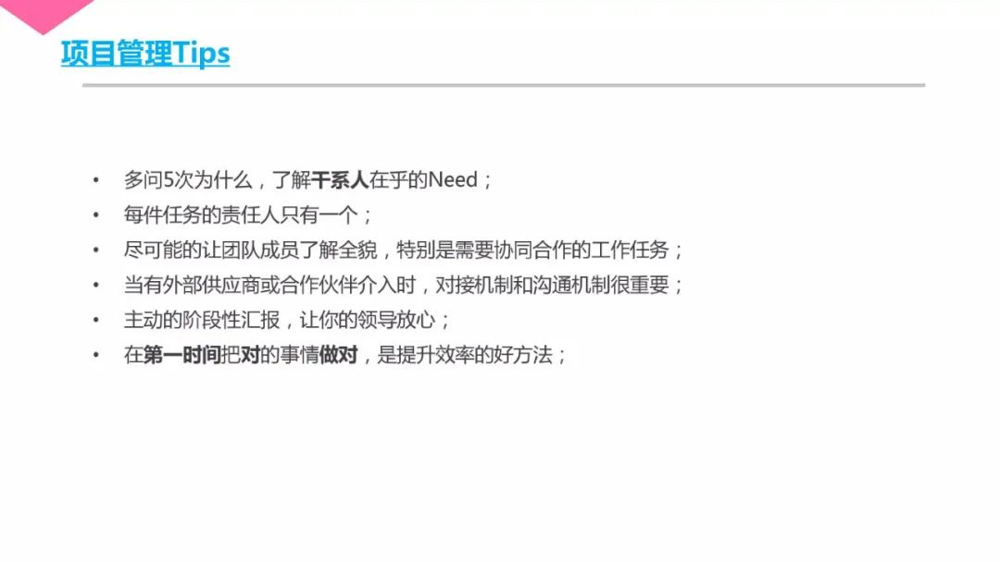

> https://mp.weixin.qq.com/s/ThuG27EQ8cuDTmzdho6rXA

> 项目开发流程是一个项目和产品的能否做好的关键。今天分享给大家一个史上最详细的项目管理开发流程架构和说明实例，是咱们社区的实战大咖湘北总结撰写的，供大家借鉴参考！
> 

# [一文掌握腾讯项目管理方法](https://mp.weixin.qq.com/s/KALtd0f7pVUFYYtzEvLf0A)

